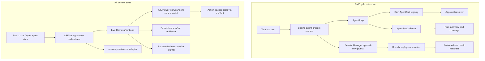
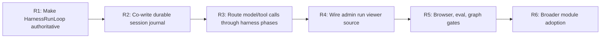

# AE Harness OMP Re-Audit

Date: 2026-07-02
Frame: `$plan-eng-review` architecture review, using OMP as gold-standard reference architecture.
Status: `DONE_WITH_CONCERNS`

## Evidence Snapshot

Reference checkouts:

- OMP reference: `/private/tmp/oh-my-pi`
- OMP commit: `31a8cfc31cf1e467efa76655ded27e64d2295139`
- AE workspace: `/Users/skchan/Jcsyc_Projects/agentic-economy`
- AE HEAD: `d7db54cfa84dd4c02eebc8afd7478252615b0dd5`

Current AE generated maps:

- AE codebase map: `.planning/codebase/`
- AE graph report: `.planning/graphs/GRAPH_REPORT.md`
- AE graph size: `18,266` nodes, `17,364` edges, `26` communities
- AE graph artifact commit: `d7db54cfa84dd4c02eebc8afd7478252615b0dd5`
- Graph gate status: red because graph-relevant source paths are dirty, even though the graph artifact commit matches HEAD.

Validation run during this refresh:

- `npm run typecheck`: currently red because unrelated dirty UI/route work has `Button` variant drift, dynamic listing-link typing, and missing `FactGrid` exports. The live harness files no longer report type errors.
- `npm run test:eval`: passed after the live-loop follow-up: coverage audit 12 cases, suite report 12 cases / 14 turns, promptfoo 27/27, eval Vitest 23 tests. Promptfoo telemetry flush warned on DNS, after the eval had completed successfully.
- `./node_modules/.bin/vitest run tests/unit/harness tests/unit/answer-thread tests/integration/answer-tool-calls.test.ts`: passed after the live-loop follow-up, 24 files / 115 tests.
- `./node_modules/.bin/vitest run tests/unit/harness/run-loop.test.ts tests/unit/answer-thread/answer-harness-operation.test.ts tests/unit/answer-thread/tool-runner.test.ts tests/unit/answer/answer-tool-use-agent.test.ts`: passed, 4 files / 30 tests after the live answer-loop follow-up.
- `npm run test:ui-contract -- tests/ui-contract/public-language-copy.test.ts`: currently red because unrelated dirty public-shell work imports `@clerk/tanstack-react-start` in `src/components/ae/layout/AePublicShell.tsx`, which the copy scanner flags as an internal identifier on a public surface.
- `./node_modules/.bin/playwright test tests/e2e/thread-first.spec.ts --project=compact-chromium --project=wide-chromium`: initially exposed duplicate wide-sidebar entries for the second query; after moving `AeChat` initial `?q=` startup out of render, passed with 3 tests and 1 compact-sidebar skip.
- `npm run test:graph-freshness`: failed with `graph_relevant_worktree_dirty`; current output marks `operational evidence: blocked`, lists relevant dirty paths, and directs the operator to settle paths and rerun the gate before making graph-backed operational claims.
- `git diff --check`: passed.

## Executive Conclusion

AE has moved beyond the first surface-level OMP port. It now has meaningful harness primitives: a reusable run loop, event collector, action-to-tool adapter, approval modes, schema validation, evidence envelopes, journal helpers, replay projections, eval hooks, and an admin run-viewer scaffold.

The main gap has narrowed from "post-hoc reporting" to "state-machine ownership." OMP makes its loop the runtime spine. AE now uses one live `HarnessRunLoop` during answer turns for context, intent, route, retrieval, model, assemble, gate, persistence, and terminal reporting events. The remaining gap is that `streamAnswerTurn()` still coordinates the SSE-facing state machine instead of delegating the entire turn to `HarnessRunLoop.run()` handlers.

High-ROI rebuild target:

1. Move the remaining `streamAnswerTurn()` state machine into `HarnessRunLoop.run()` handlers.
2. Keep the runtime-fed journal path and extend replay/admin source-read coverage.
3. Keep one schema path from action definition to harness tool, quiet tool descriptor, model descriptor, execution validation, and eval fixture.
4. Treat eval, browser continuity, graph freshness, and public-leakage scans as register gates, not afterthoughts.
5. Keep AE's public trust contract smaller than OMP: only `registry.search`, `registry.detail`, and source-write-admitted `inquiry.submit`.

## Architecture Contrast

## What Changed Since The Earlier Audit

The earlier audit overstated some missing pieces. Current corrections:

| Area | Earlier claim | Current re-audit |
| --- | --- | --- |
| Run collector | Missing model/provider/usage dimensions | AE collector records model/provider/usage/cost, and the live answer model path now routes through `HarnessRunLoop.runModel()`. |
| Approval | Simplified read/write policy only | AE now has approval modes and source-write-aware decisions. It is still thinner than OMP's operator prompt and override machinery. |
| Replay/protection | Public projection tests only | AE now has evidence-envelope and replay projection helpers. They remain pure/tested pieces until durable answer-session co-writing lands. |
| Advisor guard | Missing | AE now has `HarnessEmissionGuard`, including public-surface suppression and evidence requirements. It is not wired into a reviewer/advisor runtime yet. |
| Eval | No harness-specific invariants | Eval cases and evaluators now check harness evidence. Current `npm run test:eval` is green. |
| Admin viewer | Missing | A viewer scaffold exists, but the production source port is intentionally disabled. |

## Findings

### P0. The answer harness loop is live, but the top-level state machine is not fully delegated yet

AE has a serious `HarnessRunLoop`, and the answer path now feeds it live runtime events:

- `src/modules/harness/run-loop.ts`: defines phases and records events through `run()`, `runTool()`, `runModel()`, `evaluateGate()`, and `persist()`.
- `src/modules/answer-thread/internal/turn-orchestrator.ts`: `streamAnswerTurn()` creates one live answer harness operation and records context, intent, route, retrieval, model, assemble, gate, persist, and terminal report events.
- `src/modules/answer-thread/internal/tool-runner.ts`: answer read tools run through `loop.runTool()` when a live loop is present.
- `src/modules/answer/internal/answer-tool-use-agent.ts`: planned and real model calls run through `loop.runModel()` when a live loop is present.
- `tests/unit/answer-thread/answer-harness-operation.test.ts`: drives the real streaming path and asserts live tool/model/gate/persist/run journal entries with sanitized public summaries.

OMP contrast:

- `/private/tmp/oh-my-pi/packages/agent/src/run-collector.ts:1`: the collector is designed to be fed by telemetry during the loop.
- `/private/tmp/oh-my-pi/packages/agent/src/run-collector.ts:180`: chat/model calls are begun and ended as first-class run events.

Impact: AE now produces authoritative live reports for the answer path. The remaining OMP parity gap is that the orchestrator still sequences the turn; the next rebuild should express the full answer state machine as `HarnessRunLoop.run()` phase handlers, with SSE as an adapter.

Acceptance criteria:

- `streamAnswerTurn()` delegates execution to `HarnessRunLoop.run()` phase handlers instead of owning the state machine.
- `runAnswerToolUseAgent()` model calls flow through `HarnessRunLoop.runModel()` or an equivalent model phase helper.
- Complete, refused, blocked, error, timeout, and abort paths are summarized from the same collector.
- Tests inject failure at every phase and assert status, coverage, timing, and persisted report shape.

### P0. Durable session replay is runtime-fed for answer turns, but admin/source replay is not operational

AE now has good pure primitives:

- `src/modules/harness/session-journal.ts`: append/idempotency/parent conflict/projection helpers.
- `src/modules/harness/replay-projection.ts`: private and public replay projections.
- `src/modules/harness/harness.functions.ts:156`: source-facing append helper.
- `convex/harnessSessions.ts:148`: public mutation for appending harness session entries.
- `src/modules/answer-thread/internal/answer-turn-finalization.ts`: answer persistence accepts a live harness report/event stream and maps runtime events into `turn.started`, `context.loaded`, `intent.routed`, `tool.*`, `model.*`, `gate.evaluated`, `turn.persisted`, and `run.reported` entries when a server request is available.
- `src/routes/api.answer.turn.ts`: passes the request into the answer turn so source-write admission can be minted without exposing client authority.
- `tests/unit/answer-thread/answer-harness-operation.test.ts`: proves persisted answer turns write sanitized journal entries without raw tool ids, query text, or hashes in public summaries.

This closes the earlier "compact finalization spine only" gap for the answer turn. It does not yet reach operational OMP parity because admin source reads, browser replay smoke, graph freshness, and broader module adoption are still pending.

OMP contrast:

- `/private/tmp/oh-my-pi/packages/coding-agent/src/session/session-manager.ts:331`: sessions are append-only JSONL journals with ids and parent ids.
- `/private/tmp/oh-my-pi/packages/coding-agent/src/session/session-manager.ts:730`: `#recordEntry()` pushes, indexes, appends to disk, and notifies.
- `/private/tmp/oh-my-pi/packages/coding-agent/src/session/session-manager.ts:1270`: message/model/mode/init/compaction/custom entries are appended as runtime facts.
- `/private/tmp/oh-my-pi/packages/coding-agent/src/session/session-manager.ts:1533`: branching moves the leaf without deleting existing entries.

Impact: AE can reconstruct much richer operator replay evidence for answer turns from source rows. The remaining gap is making that replay operational through authenticated admin source reads and proving it with browser/graph gates.

Acceptance criteria:

- Keep the source-write-admitted runtime-event co-write green.
- Persist entries for turn start, tool completed, model completed, gate, answer persisted, run report emitted, and error/abort from live runtime events.
- Public projection remains sanitized and never exposes raw tool ids, inputs, hashes, or internal trace names.
- Browser continuity proves first question, new question, second question, sidebar contains both, navigation works after reload.

### P0. Current graph evidence is stale-by-policy

The graph artifact says it was built from current HEAD, but `npm run test:graph-freshness` correctly fails because graph-relevant source files are dirty. That distinction matters: the register cannot use the graph artifact as operational evidence until the implementation settles and graphify is rerun.

Current failure summary:

- `npm run test:graph-freshness`: `graph freshness: stale`
- Operational evidence: `blocked`.
- Commit fields match `d7db54cfa84dd4c02eebc8afd7478252615b0dd5`.
- Reason: `graph_relevant_worktree_dirty`.
- Actionability: the gate lists every relevant dirty path and next actions. It does not hide dirty-path failures.

Acceptance criteria:

- Settle harness/answer/eval source changes.
- Rebuild graphify.
- Rerun graph freshness.
- Register rows can only claim `5-operational` when graph freshness passes against a clean graph-relevant tree.

### P0. Browser continuity is now current-green, and it found a real bug

The continuity gate exists in `tests/e2e/thread-first.spec.ts` and checks the public thread-first flow across compact and wide Chromium projects. It covers first query submission, thread URL navigation, safe public copy, second-thread creation, desktop recent-question sidebar visibility, and return navigation to the first thread.

Current refresh status: green after fix:

- `./node_modules/.bin/playwright test tests/e2e/thread-first.spec.ts --project=compact-chromium --project=wide-chromium`

The first rerun failed because the wide sidebar had two links named `emergency roofer nowhere 9999`. Root cause: `AeChat` started `initialQuery` during render, which could create two threads from one `?q=` query under dev/browser remount behavior. Fix: `src/components/ae/chat/AeChat.tsx` now starts the initial query from a guarded effect. The rerun passed with 3 tests and 1 expected compact-sidebar skip.

Impact: browser continuity no longer blocks this slice, but graph freshness still blocks any `5-operational` register claim.

### P1. Model accounting is live for answer turns, but still needs eval/browser gates

AE now has the accounting structures:

- `src/modules/harness/run-collector.ts`: model records, usage, cost, provider/model coverage.
- `src/modules/harness/harness.schema.ts`: model request records and summary/coverage fields.
- `tests/unit/harness/run-collector.test.ts`: focused model accounting coverage.

The live agent path now passes a harness loop into `runAnswerToolUseAgent()`, and planned/real model calls are recorded through `HarnessRunLoop.runModel()`. Focused unit coverage is green; promptfoo/browser gates still need a post-settle rerun before any operational claim.

Acceptance criteria:

- Real and planned answer model calls are recorded as model phase events.
- Summary exposes model/provider/usage/cost privately.
- Public answer UI receives only safe elapsed/check counts.

### P1. Tool contract is useful, still thinner than OMP's `AgentTool`

AE's action-backed contract is the right foundation because it preserves the product boundary. It still lacks several OMP lifecycle controls that would make the harness reusable across modules.

AE evidence:

- `src/modules/harness/harness.schema.ts`: `HarnessToolDefinition`.
- `src/modules/harness/action-tool.ts`: action-to-harness-tool conversion and execution validation.
- `src/modules/harness/approval-policy.ts`: read/write/owner/admin/internal approval modes.

OMP contrast:

- `/private/tmp/oh-my-pi/packages/agent/src/types.ts:597`: `AgentTool` includes labels, hidden tools, deferrable/load mode, concurrency, interruptibility, matcher metadata, approval hooks, approval detail formatting, execution, call/result rendering.
- `/private/tmp/oh-my-pi/packages/coding-agent/src/tools/approval.ts:93`: approval decisions combine tool policy, user policy, mode, and prompt formatting.

Acceptance criteria:

- Add internal-only lifecycle fields where AE needs them: concurrency, deferrable/pending work, projection/render metadata, approval detail formatter, and timeout/interrupt semantics.
- Keep quiet/public descriptors derived from a safe subset.
- Add descriptor parity tests from `ActionDefinition` to harness tool to quiet descriptor to model descriptor to eval fixture.

### P1. Admin run viewer exists but has no production source

AE now has an admin viewer scaffold, but it is intentionally disabled without a source port:

- `src/modules/harness/run-viewer.functions.ts:41`: disabled source state.
- `src/modules/harness/run-viewer.functions.ts:67`: list reads return disabled projections when no source is configured.
- `src/modules/harness/run-viewer.functions.ts:85`: detail reads also return disabled/not-found projections without source access.

This is a good safety default, but not yet OMP-like inspectability.

Acceptance criteria:

- Add admin-authorized source read for answer turns or harness session entries.
- Add Playwright/admin smoke covering list, filter, detail, private evidence presence, and public leakage absence.
- Keep navigation hidden until production authorization and source-read behavior are proven.

### P2. Protected evidence and advisor guard are now good primitives, not missing gaps

OMP's protected compaction primitive is small and sharp:

- `/private/tmp/oh-my-pi/packages/agent/src/compaction/tool-protection.ts:14`: collect tool calls by id.
- `/private/tmp/oh-my-pi/packages/agent/src/compaction/tool-protection.ts:42`: decide protected tool results by name or matcher.

AE now has the equivalent product-shaped primitives:

- `src/modules/harness/evidence-envelope.ts`: private evidence, public projection, replay id remapping, protected compaction projection, stale metadata.
- `tests/unit/harness/evidence-envelope.test.ts`: private/public/protected/stale coverage.

OMP's advisor guard makes model-output rules load-bearing:

- `/private/tmp/oh-my-pi/packages/coding-agent/src/advisor/emission-guard.ts:116`: per-session guard with duplicate/noise/cycle suppression.

AE's version is stronger for AE's boundary:

- `src/modules/harness/emission-guard.ts:225`: suppresses empty, public-surface, filler, low-severity, missing-evidence, duplicate, and cycle-limit emissions.

Acceptance criteria:

- Do not expand this until reviewer/advisor emissions are actually wired.
- When wired, accepted emissions must be private/admin only and evidence-backed.
- Suppression counters can be stored privately for debugging, never projected to public answer copy.

## Rebuild Plan

Order of operations:

1. Fix the graph/register truth loop first: no operational claims while graph-relevant paths are dirty.
2. Move answer execution behind `HarnessRunLoop`; preserve current SSE events as adapter output.
3. Expand harness session entries from compact finalization entries to live phase/tool/model entries.
4. Route model calls through collector-backed model phases.
5. Wire the admin viewer to an authorized source read.
6. Re-run the required gates and only then promote register rows.

## Non-Goals

AE should not copy these OMP capabilities into public/product assistants:

- Shell, filesystem, browser, editor, LSP, or arbitrary custom tools.
- Dynamic public tool discovery.
- Autonomous booking, payment, dispatch, fulfillment, or availability assumptions.
- Raw tool ids, inputs, result hashes, internal trace names, private evidence, or reviewer emissions in public UI.

AE should copy OMP's engineering discipline: append-only evidence, runtime-fed collector, replayable sessions, explicit approval, durable summaries, and eval-backed confidence.
