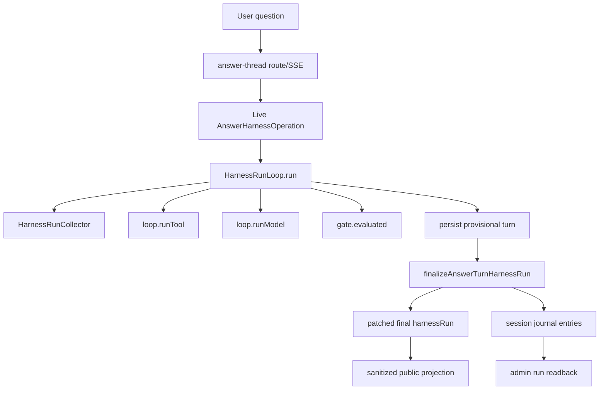

# AE Harness OMP Re-Audit

**Date:** 2026-07-03
**Frame:** `$plan-eng-review` plus project-local `$gsd-map-codebase` and `$gsd-graphify` evidence
**Audit stance:** OMP is the gold-standard reference architecture. AE should copy the harness discipline, not OMP's public tool surface.
**AE closeout implementation commit:** `075ac3767718358d96a9ae9025b9098db8bcb0b8`
**OMP reference:** `/Users/skchan/Jcsyc_Projects/oh-my-pi` at `31a8cfc31cf1e467efa76655ded27e64d2295139`
**Verdict:** AE now has OMP-shaped answer runtime authority, durable source finalization, admin readback primitives, and green graph freshness for the landed answer-harness closeout slice.

## Executive Readout

AE has crossed the important line from "harness-shaped reports" to "harness-owned live answer execution."

Current OMP carry-over now includes:

- `HarnessRunLoop` owning context, intent, route, retrieval, model, gate, assemble, persist, and report phases for answer turns.
- `HarnessRunCollector` receiving live runtime events for phases, tools, models, gates, persistence, and operation events.
- AE actions adapted into harness tools with validation, descriptors, hashes, approval policy, load mode, hidden flag, concurrency, and interruptibility.
- Answer turn finalization moved into a source-backed Convex mutation that patches the final `HarnessRunReport` and appends session journal entries in one transaction.
- Finalization outcomes are typed as accepted, replayed, conflict, denied, and error; conflict/error now block a normal complete stream.
- Admin/operator readback is source-backed and auth-gated instead of a disabled scaffold.

The graph-relevant dirty tree has been landed. The remaining work is no longer a P0 harness blocker: add admin browser smoke with seeded source-backed evidence, then expand the same journal pattern into broader AE modules where useful.

## Evidence Snapshot

| Area | Evidence | Result |
| --- | --- | --- |
| OMP checkout | `/Users/skchan/Jcsyc_Projects/oh-my-pi` | Present |
| OMP commit | `31a8cfc31cf1e467efa76655ded27e64d2295139` | Reference commit |
| OMP graphify | 69,345 nodes, 65,123 edges, built at `31a8cfc` | Fresh reference |
| AE commit | `075ac3767718358d96a9ae9025b9098db8bcb0b8` | Closeout implementation commit |
| Typecheck | `npm run typecheck` | Pass |
| Focused finalization/admin tests | `./node_modules/.bin/vitest run tests/unit/answer-thread/answer-harness-operation.test.ts tests/unit/harness/run-loop.test.ts tests/unit/harness/run-viewer-functions.test.ts tests/unit/harness/run-viewer-projection.test.ts tests/unit/harness/session-journal.test.ts` | Pass: 5 files, 28 tests |
| Focused harness/answer tests | `./node_modules/.bin/vitest run tests/unit/answer-thread tests/unit/harness tests/integration/answer-tool-calls.test.ts` | Pass: 24 files, 119 tests |
| Eval suite | `npm run test:eval` | Pass: coverage ok, answer suite 12 cases/14 turns, promptfoo 27/27, eval Vitest 23/23 |
| UI contract | `npm run test:ui-contract -- tests/ui-contract/public-language-copy.test.ts` | Pass: 6 files, 36 tests |
| Browser continuity | `./node_modules/.bin/playwright test tests/e2e/thread-first.spec.ts --project=compact-chromium --project=wide-chromium --reporter=line` | Pass with elevated local server permission: 3 passed, 1 skipped |
| Graphify rebuild | `graphify update . && ... && node .codex/gsd-core/bin/gsd-tools.cjs graphify status` | Pass: 18,150 nodes, 17,307 edges, built/current `075ac37`, `commit_stale: false` |
| Graph freshness | `npm run test:graph-freshness` | Pass: graph report/json commit equals `075ac3767718358d96a9ae9025b9098db8bcb0b8`; 0 graph-relevant dirty paths |
| Diff hygiene | `git diff --check` | Pass |

## OMP Gold Anchors

| OMP source | Pattern carried into AE |
| --- | --- |
| `packages/agent/src/agent-loop.ts` | Loop owns model/tool/phase execution, terminal status, events, aborts, and blocked calls. |
| `packages/agent/src/run-collector.ts` | Passive collector creates stable summaries, coverage, errors, timings, usage, and status counts. |
| `packages/agent/src/types.ts` | Rich internal tool contract with approval, concurrency, load/hidden modes, interruptibility, and schema policy. |
| `packages/coding-agent/src/tools/approval.ts` | Approval is resolved before execution and cannot bypass product trust boundaries. |
| `packages/coding-agent/src/session/session-manager.ts` | Append-style session journal and replay projection are first-class runtime evidence. |
| `packages/agent/src/compaction/tool-protection.ts` | Tool evidence must be protected across replay/compaction boundaries. |
| `packages/coding-agent/src/advisor/emission-guard.ts` | Advisor/reviewer output must be suppressed when empty, duplicate, noisy, or over budget. |
| `packages/ai/src/utils/schema/strict-tool-validation.ts` | Tool schemas are checked before descriptors reach model/provider surfaces. |

## AE Current Architecture

The public SSE shape remains stable. Public answer surfaces still receive answers, providers, next steps, and sanitized check summaries. They do not receive raw tool IDs, inputs, result hashes, private payloads, provider request IDs, or internal trace names.

## Comparison Matrix

| Domain | OMP reference behavior | AE current behavior | Parity |
| --- | --- | --- | --- |
| Runtime authority | Loop owns model response streaming, tool execution, steering, abort handling, blocked/skipped calls, and terminal events. | Answer turns run under `HarnessRunLoop.run()` handlers; tools and model calls use the same loop; finalization now happens in the report phase. | Strong partial |
| Run collection | Passive collector aggregates runtime telemetry into stable sorted snapshots. | `HarnessRunCollector` aggregates phases, tools, models, providers, gates, status counts, private telemetry, and coverage. | Strong partial |
| Tool contract | Rich internal tool definitions include tier, approval, load mode, visibility, concurrency, interruptibility, and validation policy. | AE action tools now carry the core OMP-like metadata while preserving the public allowlist. | Strong product-safe partial |
| Approval | Approval is resolved before execution and respects mode/tier/user policy. | Public reads auto-allow; qualified inquiry remains the only public write; exec and unsupported writes block. | Strong for AE trust contract |
| Tool execution | Tool calls distinguish ok/error/refused/blocked/timeout/aborted/skipped, with concurrency and cancellation. | `runHarnessTool()` and `runToolBatch()` cover these statuses and shared/exclusive scheduling; write timeout reconciliation is still future work. | Strong partial |
| Durable finalization | Session manager treats replay and append evidence as durable runtime state. | `finalizeAnswerTurnHarnessRun` patches answer turn evidence and appends journal entries atomically; idempotent replay and conflicts are explicit. | Strong partial |
| Replay projection | Runtime paths are reconstructable and private evidence is protected. | Public/private projection helpers and admin source readback exist; admin browser smoke is still pending. | Partial |
| Admin evidence | OMP terminal/session workflows expose raw evidence to operators. | Admin run list/detail source reads are auth-gated and unit-tested; route smoke with seeded evidence remains. | Partial |
| Eval coupling | Runtime evidence is tied to loop outputs. | Typecheck, focused tests, promptfoo, answer eval, UI contract, browser continuity, and graph freshness are green for the closeout slice. | Strong |
| Public tool surface | OMP can expose dynamic terminal tools. | AE rejects dynamic public tool discovery and shell/filesystem/browser/LSP product tools. | Correct rejection |

## Findings

### P0 - Graph freshness is now closed

Graphify artifacts were rebuilt at `075ac37` and report `commit_stale: false`. Standalone graph freshness now passes because the graph-relevant dirty tree was landed.

Impact: architecture maps and graph evidence are usable for the closeout implementation commit.

Closed evidence:

- `graphify update .`
- `node .codex/gsd-core/bin/gsd-tools.cjs graphify status`
- `npm run test:graph-freshness`

### P0 - Same-commit evidence is established for the answer-harness slice

The landed closeout commit has green typecheck, eval, UI contract, browser continuity, focused tests, and graph freshness evidence. The regenerated graph report is expected to remain a working-tree evidence artifact because the graph records the current commit hash.

Impact: R1/R5/R6/R7/R8 can be called operational for the answer-harness closeout slice. R9 remains evaled until admin browser smoke is added.

Required closeout:

- Keep these gates as the baseline for future harness changes.
- Add admin browser smoke for run viewer confidence.

### P1 - Admin run viewer needs browser smoke

Source-backed admin readback is no longer a disabled scaffold. `convex/answerThreads.ts` exposes an admin-only query and `run-viewer.functions.ts` calls it through authenticated source query plumbing. Unit tests cover denied default/public access and configured admin reads.

Impact: the backend evidence path is real, but user-visible operator evidence browsing is not yet proven in browser automation.

Required follow-up:

- Seed source-backed harness run evidence.
- Add Playwright coverage for `/admin/runs` and `/admin/runs/$turnId`.
- Keep raw evidence admin-only and public projection sanitized.

### P1 - Write timeout reconciliation is still thinner than OMP

AE now propagates guard signals through phases, model work, persistence, and interruptible tools. Read tools default to interruptible; writes default to exclusive and non-interruptible.

Impact: this is safe for current public reads and qualified inquiry boundaries, but broader internal writes still need idempotency and reconciliation after timeout or abort.

Required follow-up:

- Define per-write idempotency keys.
- Add post-timeout reconciliation events.
- Extend tests for interrupted writes.

### P2 - Protected evidence and advisor guard remain broader adoption work

Evidence envelope and emission guard primitives exist, but they are not central to compaction/replay or future reviewer/advisor flows yet.

Required follow-up:

- Use protected evidence IDs during replay and final answer assembly.
- Wire `HarnessEmissionGuard` before any reviewer/advisor output ships.
- Add evals for duplicate/noisy suppression and public leakage.

## High-ROI Closeout Plan

1. **Keep closeout gates mandatory.** Typecheck, focused tests, eval, UI contract, browser continuity, graph freshness, and diff check stay the harness baseline.
2. **Add admin smoke.** Browser-test the admin run viewer with seeded source-backed evidence.
3. **Broaden adoption.** Carry the same operation journal pattern into inquiries, protected actions, and billing observability where useful.
4. **Finish write reconciliation.** Add explicit idempotency and post-timeout reconciliation for broader internal writes.

## Bottom Line

The OMP answer-harness closeout is operational for the implemented slice: runtime authority, durable finalization, journal projection, admin readback primitives, eval/browser/UI evidence, and graph freshness are all in place.

The remaining work is follow-up depth, not a P0 closeout blocker: admin browser smoke, broader module adoption, and write timeout reconciliation.
