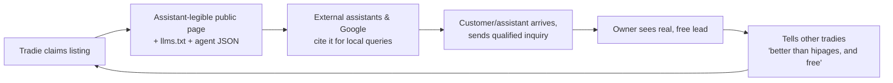

# The 10-Star Product — Agentic Economy (v6, Handshake convergence)

**Date:** 2026-07-02
**Status:** strategy evaluation. v6 clarifies H4.5's mechanism: `handshake-protocol-kernel` (the author's other product) is a general-purpose clearance kernel that already matches H4.5's checkpoint-gated escrow shape, and ROADMAP.md's existing "Handshake Protocol Kernel posture" decision-door already reserves phase 4/6 for exactly this convergence. Confirmed Cloudflare's Web Bot Auth (agent identity) does not obsolete Handshake (action clearance + evidence) — different layer. Not a phase plan. Does not change current public claims.
**Method:** Chesky 11-star ladder × ODI opportunity scoring × two-sided marketplace discovery × demand-gated horizons × a four-point category admission test (§0.5) × protocol-landscape gap analysis (§7.5.1). Every load-bearing claim carries a source and an evidence grade: **seen it** (external evidence in hand) / **hunch** (plausible, unconfirmed) / **guess** (inference).

---

## 0. The three lines (north star)

1. **What customers are trying to accomplish:** get a trustworthy local provider to actually show up and do the job, without spending days chasing.
2. **What they do instead today:** call 3–5 tradies, one calls back; use hipages/Airtasker and get spam or silence; fall back to Facebook groups and word of mouth.
3. **Why that sucks (their words):** *"just didn't show up… no phone call or anything"* — r/australia, Oct 2023 [1]. *"paid a $1,000 invoice, tradie missed the install date, then stopped replying"* — r/AusLegal, Oct 2025 [2]. *"started a job, was paid, then never came back and blocked our number"* — r/AusRenovation, Nov 2025 [3].

And the mirror three lines for the owner side:

1. **What owners are trying to accomplish:** a steady stream of real jobs without becoming a marketing department.
2. **What they do instead:** pay hipages ~$200/month for leads [4], answer the phone between jobs, lose work to missed calls [5].
3. **Why that sucks (their words):** *"You end up paying for the opportunity to chase work that goes nowhere. There's zero return on investment."* — ProductReview on hipages [6]. The ACCC formally found hipages' subscription traps *"likely contravened Australian Consumer Law"* [7].

---

## 0.5 The widen-the-horizon challenge, answered honestly

**The critique is half right.** The v1/v2 docs let "AU trades is the correct *launch wedge*" collapse into "AU trades is the vision." Those are different claims and only the first survived the research. Widening the aperture — B2B distribution, agri, mining, ecommerce, SaaS, brick-and-mortar, professional services — and testing each one, rather than assuming AE generalizes everywhere "agentic" gets used, produces a real answer: **AE's moat generalizes to a specific, large category. It does not generalize to all of commerce, and pretending it does is the opposite failure mode — vision-by-buzzword instead of vision-by-wedge.**

### The category admission test

AE's actual asset is a **receipt/mandate/attestation layer for trust failures between small, fragmented counterparties transacting locally.** Not "agent commerce" in general — a huge share of "agentic commerce" news right now is either (a) enterprise-internal automation with no counterparty-trust problem, or (b) trillion-dollar platforms already racing to own the SKU-checkout shape. A vertical is AE-shaped only if it clears **all four**:

1. **Fragmented supply.** Many small independent providers, no dominant player already running trust infrastructure between them and customers.
2. **A live trust failure**, not a solved one — show-up/quality/dispute risk that's currently absorbed by the customer, not the platform.
3. **Small-business counterparties** (SMB↔consumer or SMB↔SMB), not enterprise-to-enterprise with mature procurement/legal/EDI/clearing infrastructure already absorbing the trust problem.
4. **Not already being won by a giant.** If Shopify/Stripe/OpenAI/Google are spending billions to own the shape, AE showing up late with no distribution is a vanity project, not a wedge.

### Running the test on every category raised

| Category | Fragmented | Live trust gap | SMB counterparty | Not giant-owned | **Verdict** | Evidence |
|---|---|---|---|---|---|---|
| **Home/trade services** | yes | yes (opp 16, proven) | yes | yes | **PASS — proof vertical #1** | hipages/Airtasker corpus, prior pass |
| **Professional local services** (accountants, mechanics, vets, real estate agents, local IT/computer repair) | yes | hunch — structurally identical to trades (show-up, quality, "did they actually do what they said") | yes | yes | **PASS — likely vertical #2** | inferred from trades pattern; not yet corpus-tested [seen it: none directly; hunch] |
| **Personal care / bookings** (salons, gyms, clinics via Mindbody/Fresha) | partially — Mindbody/Fresha already provide booking infra | **weak.** Reviews are about *platform* billing/contract traps (*"will get you signed onto a contract then not care about the terrible service"* — Mindbody, Trustpilot), not provider no-shows. The trust failure AE targets (ghosting, no recourse) isn't the loud pain here. | yes | mostly | **PARTIAL — secondary, not a wedge.** Booking is already solved; AE's receipt/recourse angle has less to bite on. | Trustpilot Mindbody reviews [18] |
| **B2B wholesale/distribution** | no — the 2026 activity is AI agents *inside one company's* inventory/replenishment/pricing (RELEX, StackAI, Impact Analytics), not a cross-counterparty trust protocol | no — this is internal automation, not a trust gap between two businesses | no — mid/large distributors with existing credit terms, EDI, decades of relationship | no — an active, well-funded enterprise-AI category already | **FAIL for now.** This is "AI copilot inside an ERP," not an AE-shaped problem. A cross-counterparty gap may exist for small/informal distributors (a market stall buying from a small importer) but it's unproven, not researched. | [19–27] wholesale-AI vendor corpus, all internal-automation framing |
| **Agri — commodity/grain trading** | no — institutional counterparties with CTRM platforms, ISDA-like contracts, existing clearing | no — the trust/settlement problem is already solved by institutional finance rails | no — enterprise counterparties | no — McKinsey/Oliver Wyman-tracked institutional AI-trading race already underway | **FAIL.** Wrong customer size, wrong trust architecture; AE's small-counterparty receipt model adds nothing an ISDA contract and a clearinghouse don't already do. | [28–35] agri-trading corpus |
| **Agri — farm-gate services** (farm equipment repair, contract mustering, local ag services) | yes — structurally a trade | hunch — same pattern as trades, untested | yes | yes | **PASS, deferred.** Same shape as home services; a rural extension of vertical #1, not a separate bet. | inferred, not yet corpus-tested |
| **Mining — contractor/service procurement** | no — mine-site vendor management already runs through mature enterprise procurement (tender, AS/quality-assurance, insurance, SAP Ariba-class systems) | no — the trust problem is already owned by enterprise procurement, not absorbed by an unrepresented customer | no — counterparty is a large enterprise (the mine) | no — this is enterprise procurement software's turf | **FAIL.** Even though contractors themselves are SMEs, the *buyer* isn't — AE's consumer-side trust primitives don't map onto tender-based enterprise procurement. | reasoned from category structure; no counter-evidence found |
| **Ecommerce / retail SKUs** | no | no — checkout/fulfillment trust is Stripe/Shopify's problem and it's being solved fast | mixed | **no — actively being won.** Shopify Agentic Storefronts + Google/Shopify Universal Commerce Protocol (Jan 2026) already extend "millions of merchants" into ChatGPT/Copilot/Gemini; Stripe ACP live with Instant Checkout since Feb 2026 | **FAIL.** This is the single clearest "stay out" signal in the whole research pass — trillion-dollar-backed standards war, AE has zero right to win here. | [13–17, 36–40] |
| **Agent-to-agent SaaS/API procurement** | no — global, digital-native | no — agent-native billing/metering (Stripe, Chargebee, Nevermined) already building this trust stack | no — often enterprise-to-enterprise or platform-to-platform | no — active, funded category | **FAIL.** No "domestic" or "physical local trust" advantage applies to a digital API call; AE's differentiators (show-up, jurisdiction, physical dispute evidence) are irrelevant here. | [41–45] |

### The honest widened vision

**AE is not "the home of AU trades." AE is the trust layer for fragmented, local, small-counterparty commerce where a live trust failure currently has no receipt** — and that category is much bigger than trades alone: professional local services, personal-care providers once booking-trust gaps are found, local B2B trade services, farm-gate rural services. That's still a **domestic, physical-world, SMB-shaped economy** — genuinely large, genuinely AE's to own — but it explicitly **excludes** institutional commodity trading, enterprise procurement (mining, large distribution), and anything Shopify/Stripe/OpenAI/Google are already spending billions to win (retail SKU checkout, agent-native SaaS billing).

**Sequencing, not simultaneity.** Every PASS vertical validates the *same* primitives (trust states, qualified inquiry, receipts, mandates) — that's the actual "home of domestic agentic commerce" claim: one trust architecture, proven once in trades, then re-parameterized (not rebuilt) per adjacent vertical once liquidity math clears at H2. Vision stays horizontal in the document from here on; execution stays narrow in the roadmap. Building professional-services and personal-care support *before* trades hits its H2 liquidity threshold is the same mistake as building hands before meat — just one category wider.

**What changes in the roadmap below:** nothing in H0–H2 (trades stays proof vertical #1, unchanged). H3 gains an explicit second track — "vertical #2 selection," gated on H2 evidence, choosing between professional-local-services and farm-gate services based on which shows the same opp-16-shaped pain when corpus-tested. The FAIL categories are not revisited without a specific decision record overturning the evidence above.
---

## 1. Discovery: what the evidence actually says

### 1.1 The wide net (what was cast)

Sources pooled: r/australia, r/AusRenovation, r/AusLegal, r/AusPropertyChat threads (2023–2026); ProductReview/Trustpilot reviews of hipages, ServiceSeeking, Airtasker; ACCC enforcement records; agentic-commerce protocol coverage (Stripe ACP docs, OpenAI Instant Checkout, UCP/AP2 comparisons, Feb–Jun 2026).

### 1.2 Sorted catch — customer side (homeowner, AU)

| Need | Pain | Served | **Opportunity** | Evidence |
|---|---:|---:|---:|---|
| Provider actually shows up / responds | 9 | 2 | **16** | seen it [1][2][3][8] |
| Know a provider is real, capable, in-area *before* contact | 8 | 3 | **13** | seen it [1][6][9] |
| Recourse when it goes wrong (deposit paid, ghosted) | 8 | 2 | **14** | seen it [2][3]; *"If your tradie ghosts you, Airtasker will not intervene in any meaningful way"* [9] |
| Compare providers quickly | 6 | 6 | 6 | seen it — Maps/hipages do this passably; table stakes |
| Book/pay in one place | 5 | 4 | 6 | hunch — desired but not the screamed pain |

**Read:** the top three needs are all *trust and follow-through*, not discovery. Nobody on Reddit is complaining they can't *find* a plumber's phone number. They're complaining about what happens after. This is a direct hit on AE's thesis — and a warning: a prettier registry alone scores a 6, not a 16.

### 1.3 Sorted catch — owner side (solo/small tradie, AU)

| Need | Pain | Served | **Opportunity** | Evidence |
|---|---:|---:|---:|---:|
| Leads that are real jobs, not charged spam | 9 | 2 | **16** | seen it [6][7][10] |
| Not losing jobs to missed calls while on the tools | 8 | 3 | **13** | seen it [5] |
| Fair pricing model (no per-lead roulette, no lock-in) | 8 | 2 | **14** | seen it — an entire alternatives industry markets *"no lead fees"* as its headline [10][11]; ACCC action [7] |
| Look credible online without doing marketing | 7 | 4 | 10 | seen it [10] |
| Get paid / deposits without chasing | 6 | 5 | 7 | hunch |

**Read:** the incumbent (hipages, ~$200/mo, 1,397 Trustpilot reviews trending bitter [12]) is hated for its *business model*, not its software. Money is provably moving — tradies pay $2,400/yr for leads they hate. That's the wallet. The whole "alternatives" cottage industry [11] differentiates on "no lead fees," which tells you the served-axis failure is structural: pay-per-lead misaligns platform and tradie. **AE's inquiry model (free, qualified, consented) is already positioned on the right side of this hatred — by accident of the trust doctrine. Make it deliberate.**

### 1.4 The macro catch — the agentic rails (this is the "why now")

- OpenAI + Stripe shipped the **Agentic Commerce Protocol**; Instant Checkout live Feb 16, 2026, ~4% fee on completed orders [13][14].
- Visa, Mastercard, Meta, PayPal building parallel rails; Google pushing AP2; UCP vs ACP vs AP2 is an active standards war [15][16].
- OpenAI already pivoting toward **merchant-controlled checkout** (Mar 2026) [17] — the demand side wants businesses to own their endpoints, exactly AE's "business-origin capability" bet.
- **The gap:** every one of these rails is built for *retail SKUs in a cart*. None of them handles the local-services shape: quote-first pricing, scheduling, site visits, deposits, no-shows, disputes about workmanship. A haircut is not an SKU; a blocked drain even less so. **seen it** — ACP docs cover checkout/order flows only [13].

**Why now, in one line:** the money rails for agent commerce shipped this year for products, and the services half of the economy — where trust failures are the loudest pain in the corpus — has no equivalent. That's AE's opening, and it's time-boxed: whoever defines "agentic checkout for services" owns the shape.

### 1.5 Competitor matrix (customer-side needs × what exists)

| Need ↓ / Solution → | Google Maps | hipages | Airtasker | FB groups | "call around" | **AE (today)** |
|---|---|---|---|---|---|---|
| Find a provider | well | well | well | poorly | poorly | okay |
| Verify real/capable/in-area | poorly | poorly | poorly | poorly (social proof only) | poorly | **okay → could own** (trust states exist) |
| Provider responds | — | poorly (spam both ways) | poorly | okay | poorly (1 in 3 calls back) | **inquiry loop live** |
| Recourse when ghosted | none | none | *"will not intervene in any meaningful way"* [9] | none | none | **receipt primitives built, unlit** |
| Assistant-readable | scraping only | no | no | no | no | **yes — llms.txt, agent JSON, tools door. Unique.** |

Two cells nobody occupies: **recourse** and **assistant-readable**. AE has primitives for both. That's the differentiator pair. Everything in the "find a provider" column is table stakes AE must merely not fail at.

---

## 2. The star ladder (unchanged shape, sharper stakes)

| ★ | Customer side | Business side |
|---|---|---|
| 3★ | Google Maps: pins and reviews of unknown provenance; next step is always "call them" — and 2 of 3 don't call back [1][5]. | hipages: pay $200/mo to chase charged spam [4][6]. |
| 5★ | **AE today (built):** comparable listings, named trust source/freshness/boundary, assistant-legible, one safe conversion (qualified inquiry). | Claim → publish → inbox → reply. Free, qualified, consented — the anti-hipages. |
| 6★ | Inquiry is a **structured job request** (service/area/urgency/budget window); replies are structured quotes an assistant can compare. | Quote desk: answer once, structured, reusable. AE is your agent-facing front door before you have an agent. |
| 7★ | Quote → owner-approved commitment → payment → **receipt**. The whole job closes on-rail; the human approves one clear checkpoint. | One protected action live (deposit-secured booking / paid intake). Money arrives with a reconstructable receipt; disputes have evidence — the recourse cell nobody else occupies. |
| 8★ | Assistant negotiates among quotes inside the customer's mandate (ceiling, window) and commits within it. | You publish **signed, expiring, price-bound capability commitments**; AE enforces anti-spoof/replay/stale-price properties you couldn't build alone. This is "merchant-controlled checkout" [17] done for services. |
| 9★ | Reputation computed from **receipt chains**: completion rate, dispute rate, time-to-quote — provenance-backed facts. The fake-review economy is structurally irrelevant here. | Your business-agent quotes, schedules, accepts 24/7. AE attests identity/capability, admits evidence, underwrites receipts. Never hosts. B2B: your agent procures from suppliers' agents on the same rail. |
| 10★ | Standing mandates ("keep the house maintained, ≤$400/incident"); services happen; every act carries a receipt you could take to court. | **Agent-run businesses incorporate on AE** — identity, capability attestation, authority, money, proof, disputes. The ASIC + Stripe + DNS of agentic commerce. |
| 11★ | Hot-water telemetry triggers your agent; three plumber-agents bid; winner on-site in an hour, parts pre-ordered from a supplier-agent; you learn about it from the receipt. | Your whole back office is agents; every consequential act mandate-bound and receipt-backed — so you're insurable, auditable, financeable *because* you run on AE. |

**10★ in one sentence:** the trust fabric where agent-run businesses operate and agent-carrying customers transact — identity, capability, authority, money, proof — with a beautiful human face on top.

**Rung deltas:** 5→6 structure · 6→7 money+receipt · 7→8 signed commitments · 8→9 business agents + receipt reputation · 9→10 operating registry. Each rung unlocks on the previous rung's **liquidity**, never on its code.

---

## 3. Organs, mapped to evidence

| Organ | What | State | Verdict |
|---|---|---|---|
| **Meat** | Real owners, inquiries, money | 0/5 owner rows; deployed P2/P3 smoke debt open (STATE.md) | **Binding constraint. H0.** |
| **Eyes** | Truth pipeline: freshness, contradiction, observation | Schema states exist; no engine populates them | H1–H2. The "verify before contact" need (opp 13) is theirs to serve. |
| **Brains** | Answer routing; later negotiation | P7 shipped, correctly capped as router | Polish only until H3. |
| **Hands** | Protected actions, payments, endpoints | P4/P6 clearance+receipt models, source/local; P5 postured | H2–H3. The "recourse" need (opp 14) is theirs to serve. |

Order stays **meat → eyes → hands**. The corpus confirms why: both sides' top pains (opp 16 / 16) are liquidity-and-alignment problems, not capability problems.

---

## 4. Two-sided reality: cold start, sides, thresholds

**This is a marketplace. Both ICPs, named:**
- **Supply ICP:** the solo AU tradie (plumber/sparky/locksmith) who pays hipages ~$200/mo, hates it [6][7], misses calls on the tools [5], and has no web presence beyond a Facebook page.
- **Demand ICP:** the AU homeowner/renter with an urgent-ish job who has been ghosted before [1][2][3] — and increasingly, **their AI assistant** carrying the search.

**Which side is harder?** Supply. Demand-side pain is ambient and assistants already aggregate demand. A tradie changing workflow is the expensive conversion. **Launch cracks supply first.**

**Cold-start strategy (three stacked, from the playbook):**
1. **Single-player value for supply:** a claimed AE listing is useful with zero AE traffic — it's an assistant-legible front door ("be readable by your customers' AI") plus a free structured inbox. No network needed for value. *(This is why H1's structured-quote desk matters: it deepens single-player value.)*
2. **Start absurdly narrow:** one metro × 2–3 urgent trades (e.g., Perth × plumbing/electrical/locksmith). Dense enough that the answer surface never feels empty for the wedge query.
3. **Threshold before doors:** don't market the demand side of a category/geo until it crosses minimum liquidity.

**Minimum liquidity threshold (the "50 pages per city" number):** ≥25 published, claimed, response-committed listings in the wedge geo×vertical before any demand-side push. Below that, a customer's first query lands in an empty room and they never return.

**Seeding rule (ethics):** seed supply by hand — concierge onboarding, publicly-observed listings marked as such (`publicly_observed`, unclaimed) are honest inventory. **Never** fake demand, reviews, availability, or "3 people are viewing." The trust contract is the product; one fake signal and it's dead.

---

## 5. Growth loops (drawn, with the enabling feature on V1 lists)

**Loop 1 — content loop (spins from H0):**

Enabling features: already shipped (public pages, llms.txt, agent tools door). Missing: **attribution** — referrer/assistant-source logging on inquiries, and a "how did you hear" field on claims. *That instrumentation is an H0 deliverable.*

**Loop 2 — signal loop (from H2):** every completed receipt-backed job emits a shareable proof object ("Protected by AE" receipt the customer can show and the tradie can link). Receipts in the wild are the Livestrong band. Enabling feature: public receipt page, on the H2 V1 list, not V2.

**Loop metric:** share of new claims and new inquiries attributable to an existing listing, citation, or receipt (`?ref=`, referrer, signup question). If it stays ~0 after H1, the loops are a story, and paid/manual acquisition is the honest engine — say so and budget for it.

---

## 6. Roadmap: demand-gated horizons with kill signals

> Doctrine holds: a phase exists only when it unlocks a source-owned capability **and** the prior horizon produced observed demand. All ROADMAP.md relapse guards stay in force.

### H0 — Meat (now; weeks)
**Goal:** prove the 5★ loop compounds. One metro × 2–3 urgent trades.
**Do:** close deployed-smoke debt (P2 support/provider, P3 readback — already-defined blockers); 5 friendly-owner rows → 25 wedge listings via concierge onboarding pitched as the anti-hipages (*free qualified inquiries, no lead fees, readable by your customers' AI*); instrument attribution + boundary-refusals; watch owners, record surprises verbatim.
**Exit:** ≥25 live listings; ≥20 real inquiries; ≥60% owner 24h response; ≥3 owners upset-if-gone (asked directly).
**Riskiest assumption:** *tradies will answer a free, qualified inquiry channel even though they ignore hipages leads.* Cheapest test: 10 DMs/calls to tradies who posted about hating hipages — before onboarding tooling gets any polish.
**Kill signal:** owners won't respond to real inquiries → inbox isn't valued → change wedge (vertical/geo/owner value prop) before any H1 spend.

### H1 — Structured demand + single-player value (6★)
**Goal:** AE is the business's agent-facing front door — valuable at zero AE traffic because *other people's assistants* read it.
**Do:** structured inquiry (service/area/urgency/budget window) + structured quote replies; external-assistant distribution measured (tools-door analytics, llms.txt fetches, referrers); eyes v1 — freshness nudges, "last checked," one deterministic contradiction check; P7 polish per the answer contract.
**Exit:** ≥50% inquiries structured; measurable external-assistant reads; ≥10 owners quoting structured; owner weekly retention real.
**Riskiest assumption:** *external assistants will actually read and cite AE listings.* Test: seed listings, then query ChatGPT/Claude/Gemini for wedge searches; log citations. If no assistant ever surfaces AE, the "demand side already exists" thesis needs a distribution fix (schema/llms/partnership), not more supply.
**Kill signal:** owners use the inbox once and never return → single-player value insufficient → fix the quote desk before touching money.

### H2 — First hands + first dollar, first escrow (7★)
**Goal:** one protected action, money attached, receipt-backed, live — built as a **checkpoint-gated escrow**, not a payment link. This is the mechanism that separates AE from every 402-based rail researched in §7.5.1: x402/MPP/ACP all assume the resource returns in the same round-trip as the payment. A physical job doesn't. AE's actual primitive is *pay into escrow, hold against a mandate, release or reverse when a receipt clears* — P4's checkpoint model and P6's receipt verifier already exist for exactly this. P4+P5+P6 converge on **one flow** (deposit-secured booking or paid intake), not three parallel infrastructures.
**Do:** proposal → owner approval → one-use clearance → funds move to escrow (PSP-partner-held, not AE-custodied — see §7.5.1 regulatory path) bound to the checkpoint → job happens in the physical world → evidence admits (`ExternalEvidenceEvent`) → checkpoint clears and escrow releases with the receipt as proof, or checkpoint fails and escrow reverses with the same reconstructability. Receipt is the *visible* product for both sides (public receipt page → signal loop); exercise dispute/reversal once for real.
**Regulatory path (named, not deferred):** holding funds between "paid" and "job done or refunded" is escrow-shaped money movement. Two real paths, not a maybe: (a) **PSP/BaaS partnership** — Stripe Connect custom accounts, Airwallex, or an EMI partner legally holds funds while AE owns the checkpoint/receipt logic that controls release; fastest to ship, matches the existing Autumn+Stripe P5 posture. (b) **AFSL** if AE holds/moves funds directly — heavier, but makes AE unambiguously the platform of record rather than a pass-through; the honest path if H2 volume justifies it. P5's existing decision-record gate is where this gets decided properly, evaluated against real transaction evidence, not defaulted to "Stripe Checkout, don't think about it."
**Entry gate:** H1 exit **+ ≥5 owners explicitly asking to take money through AE** (pull, not push).
**Exit:** ≥10 real paid actions; ≥1 real dispute resolved by receipt reconstruction; 0 receipt-integrity failures.
**Riskiest assumption:** *the deposit-secured booking actually reduces no-shows/ghosting enough that both sides prefer it.* The corpus says no-shows and ghosted-deposits are the top pains [1][2][3]; if the receipted flow doesn't measurably beat the status quo on those, it's infrastructure cosplay.
**Kill signal:** owners take the money but disputes/receipts never get used → you built a payment link with extra steps → rethink what the receipt must *do* for a human.

### H3 — Attested capability invocation + agent-to-agent (8★)
**Goal:** AE doesn't just publish signed capability descriptors for someone else to call — it **mediates the call itself**, wrapped in the same evidence/receipt kernel it already built for its own actions. This is the direct realization of AGENTS.md's founding thesis ("interacting directly with businesses and their endpoints/CLIs/agents"), and the mechanism landed in the repo already: `src/modules/harness/` (2026-07-02, OMP-ported) is a schema-first tool-admission kernel — strict JSON-schema validation, protected evidence envelopes, replay projection, emission guards — currently wired only to AE's 3 first-party actions. R10/R11 (`AE-HARNESS-OMP-REGISTER.md`) reject *public dynamic tool discovery in the answer-chat surface*; they say nothing about a registered, schema-admitted `BusinessCapability` wrapping one external call. Different question, never asked, and `AI-SPEC.md:719-721` already defers business-origin capabilities to a phase gated on the same evidence/receipt bar P4 uses — "prove it," not "no."
**Do:** `BusinessCapability` = an owner-registered `HarnessToolContract` wrapping one external endpoint (URL, method, input/output JSON schema, price ceiling, rate limit) — same claim/publish trust-state pattern as P1. Reuse the kernel's evidence envelope, replay projection, and emission guard verbatim; add one new approval mode (`business-capability`, authority from mandate/checkpoint, not `sourceWriteAdmission`) and one generic HTTP call-out adapter with an explicit threat model: SSRF (deny private/link-local ranges at registration + re-validate per call against DNS-rebinding), untrusted response (validate against declared output schema, size cap, timeout), spoofed output (unsigned responses stay `publicly_observed`-tier, never `business_supplied`-verified, until HMAC-signed — extends the existing PRODUCT.md trust vocabulary, invents nothing new), replay/cost (idempotency key bound to mandate+checkpoint per P6 doctrine; circuit breaker suspends a misbehaving capability, surfaced through the `/admin/runs` scaffold already mid-build).
**Entry gate:** H2 exit + instrumented boundary-refusals showing assistants already attempting beyond-inquiry actions.
**Exit:** ≥3 businesses with live signed capabilities; ≥1 end-to-end agent-committed job inside a mandate, no human mid-loop, invoked through AE (not merely read by an external assistant that calls the business directly).
**Riskiest assumption:** *the standards war doesn't produce a services-shaped rail first* — and separately, that mediated invocation (not passive descriptors) is worth the added call-out attack surface. Watch ACP/UCP/AP2 scope quarterly; if one moves to services, AE's play becomes "best AU implementation + trust layer." If the threat model above doesn't hold up under a real security review before H3 starts, fall back to descriptor-only (external assistant calls the business directly) rather than ship an under-reviewed call-out surface.
**Kill signal:** a `BusinessCapability` call-out incident (SSRF, spoofed evidence, runaway cost) before a security review clears the adapter → freeze new capability registration, do not let the H2 receipt kernel's credibility bleed into the H3 kernel's failure.

**Vertical #2 selection (runs alongside the capability-commitment work, not instead of it):** gated on H2 exit evidence, corpus-test professional-local-services and farm-gate rural services the same way §1.2–1.3 tested trades (Reddit/review sort + ODI scoring). Select whichever shows an opp-16-shaped pain, re-parameterize the same trust/mandate/receipt primitives (no new architecture), and run its own H0-shaped concierge onboarding in a new narrow wedge. Do not open a second vertical before H2's liquidity threshold clears in vertical #1 — this is meat-before-hands, one category wider.

### H3.5 — The capability template marketplace (the App Store moment)
**The finding this rung is built on:** §H3's `BusinessCapability` and §6.5's Tier-1 on-ramp both assume AE (or the owner alone) hand-builds each capability wrapper — one Housecall Pro adapter, one ServiceTitan adapter, one Calendly adapter, per business. That's the pre-2008-App-Store shape: Apple wrote every app until the SDK opened. It doesn't scale past a few hundred businesses, and it's the exact bottleneck an App Store dissolves. The App Store's real innovation wasn't the install button — it was *define the SDK, review against a bar, let outside developers supply the apps, take a cut, stop building most of them yourself.*
**Goal:** AE stops building `BusinessCapability` wrappers one at a time and starts **admitting reusable capability templates built by third-party developers.** A field-service integrations consultancy, an agency already building Zapier/Make flows for trades, or the same people already shipping MCP servers for Calendly/Housecall Pro *independent of AE today* (§6.5, evidence-backed) builds ONE template — "any Housecall Pro business" — and publishes it. Every Housecall Pro business on AE activates it with a credential, not a bespoke build.
**Do:** a `CapabilityTemplate` registry sitting one layer above `BusinessCapability` — same schema/threat-model bar from §H3 (strict input/output JSON schema, the SSRF/untrusted-response/spoofed-output/replay threat model, HMAC signing) applied to a template once, then instantiated per business via credential binding instead of custom code. Developer registers a template → AE runs it through the mechanical admission bar → published templates appear in an owner-facing "activate" flow next to the existing "AE hosts your first endpoint" (Tier-0) and "admit an existing endpoint" (Tier-1, manual) paths from §6.5.
**Why this is more defensible than Apple's version:** Apple's App Store review was taste and opaque policy — the "Apple rejected my app for no reason" genre is a whole internet subculture. AE's admission bar is **mechanical**: a template either passes schema validation and the named threat model or it doesn't. No discretionary rejection, because the bar is code, not a human's judgment call on a Tuesday.
**The take-rate answer, and why it aligns incentives instead of fighting them:** §7.5's take-rate-on-successful-receipted-call model splits naturally — AE keeps its cut for the trust/receipt layer, the template developer takes a share for supplying reach AE didn't have to build. This is the direct counter to sherlocking risk (Apple building Sherlock and killing Watson, the classic App Store failure mode): if AE's revenue comes from *more templates existing*, not from *building them itself*, the incentive points toward inviting developers in, not competing with them. Worth stating as a design commitment now, worth checking honestly if AE is ever tempted to build a first-party template for a vertical a third party already served well.
**Entry gate:** H3 exit + hand-building capability wrappers has visibly become the bottleneck — i.e., enough live `BusinessCapability` instances that the one-at-a-time model can't keep up. Not sooner: building a template marketplace with no template authors and no demand is speculative developer-platform infrastructure, the same meat-before-hands mistake one layer up the stack.
**Exit:** ≥3 third-party-authored templates live, each activated by ≥2 independent businesses without a bespoke AE build.
**Riskiest assumption:** that a template author population exists and wants in — the MCP-wrapper builders found in §6.5 (Calendly's official server, the community Housecall Pro wrapper, `calendly-cli`) are evidence of *capability*, not evidence of *willingness to build for AE's admission bar and revenue split specifically*. Cheapest test: approach the authors of those existing wrappers directly before designing the registry.
**Kill signal:** zero template authors respond to direct outreach after H3 liquidity clears → the developer-platform layer isn't wanted yet; stay in H3's hand-built mode longer rather than build an empty marketplace.

### H4 — Receipt reputation + business agents (9★)
Trust scores from receipt chains (completion, dispute, time-to-quote, integrity — with provenance). Business-agent admission: attested identity/capability/evidence for third-party or self-hosted agents (the Hermes/Dark Factory crowd is manufacturing these *now*, trust-scoped only to their own operators — AE is the counterparty-trust layer they lack). AE attests and receipts; never hosts. One B2B pilot: business-agent ↔ supplier-agent, receipted.

### H4.5 — The checkpoint-gated facilitator (9.5★, the move nobody else can make)
**The finding this rung is built on:** every payment rail researched — x402 (Coinbase), MPP (Stripe/Tempo, IETF track), ACP (OpenAI/Stripe), Visa's Trusted Agent Protocol — shares one hard assumption: *the resource returns in the same round-trip as the payment.* Pay, get the file/API result/receipt, done, stateless. None of them can 402-gate "show up and fix the pipe," because none of them have a state machine for "paid, pending, evidenced, released-or-reversed." AE already built that state machine for H2/H3 (P4 checkpoint, P6 receipt verifier) and nobody else in this landscape has a reason to build it, because nobody else is solving physical-world trust.
**Goal:** AE becomes a **checkpoint-gated 402 facilitator** — the missing settlement primitive for anything that isn't stateless. Not competing with x402/MPP/ACP; sitting underneath them as the layer they call into the moment an agent tries to pay for something that takes hours and might not happen. Concretely: a customer's assistant hits a `BusinessCapability` (§H3), gets a 402-shaped challenge scoped to a mandate-bound escrow hold (not an instant resource); funds move to PSP-partner-held escrow bound to one job/one checkpoint (§H2's regulatory path, scaled); the job happens in the physical world; evidence admits; checkpoint clears (escrow releases, receipt returned) or fails (escrow reverses, same reconstructability). **The receipt is returned instead of the resource — that's the entire adaptation the 402 ecosystem needs for physical services and doesn't have.**
**Why this beats "publish a descriptor and hope":** every stablecoin bet in this landscape (USDC, Cloudflare's NET Dollar, the new Open USD consortium) is racing to be the *settlement asset* under 402. None of them are racing to solve what happens when the thing paid for takes three hours and might not happen at all. That's the open lane, and it's AE-shaped specifically because H2's escrow/checkpoint work already exists as a stepping stone into it.
**Entry gate:** H3 exit + real transaction volume/evidence from H2's escrow flow to bring to a proper AFSL-vs-PSP-partner decision (not a defaulted one).
**Riskiest assumption:** that any of Visa/Stripe/Coinbase's rails will integrate a third-party checkpoint facilitator rather than build a shallow "hold for N hours" primitive themselves. Watch for any of them shipping escrow/hold semantics on top of 402 — that's the signal this lane is closing or opening.
**Kill signal:** a major rail ships native escrow-hold semantics before AE has volume to be the credible integration partner → the lane narrows to "best implementation for AU services," not "the facilitator" — still valuable, differently sized.
**Handshake integration — the ROADMAP gate this rung actually opens:** `ROADMAP.md`'s decision-door register already reserves this: *"Handshake Protocol Kernel posture... Future protected-action clearance should be HSK-shaped internally... it is not a public AE surface in this phase"* (phase 4/6). H4.5 is that phase. Handshake (the author's other product, `handshake-protocol-kernel` on npm) is a general-purpose clearance kernel — exact action contract → policy decision → one-use greenlight/refusal → gateway check → receipt/refusal/replay-refusal/proof-gap — and its dependency tree already includes an `x402-payment` adapter with a `wallet-gateway` and `VerifiedGatewayCheck` whose "consumed greenlights produce replay refusal, unknown downstream finality is a proof gap" is the exact state machine H4.5 needs, generalized rather than AE-specific. It also ships `protected-tool-profile` activation adapters for `hermes-activation` and `openclaw-activation` — the same agent-operator runtimes surfaced in the Hermes/Dark Factory research, meaning the demand-side agents that will eventually try to pay through AE's capabilities are runtimes Handshake already clears actions for. **Cloudflare's Web Bot Auth did not obsolete this** — WBA is cryptographic identity ("is this a real signed agent"); Handshake is authorization + evidence for one consequential action once identity is established. Different layer, not a smaller version of the same one. `src/modules/harness/`'s approval-policy/checkpoint/receipt-envelope code is currently reinventing a narrower version of exactly this; the ROADMAP gate is the signal to converge onto Handshake's adapter-pack model instead of deepening the bespoke version further. Caveat from Handshake's own README, matching AE's own source/local-proof discipline: it explicitly disclaims hosted operation, provider custody, and settlement/finality — adopting it removes the need to hand-build the clearance state machine, not the PSP-partner/AFSL regulatory work above it.

### H5 — The operating registry (10★)
Where agent-run businesses exist: identity, capability attestation, authority, money, proof, disputes — and, per H4.5, the checkpoint/escrow rail that Visa/Stripe/Coinbase-class payment infrastructure eventually calls into for anything that isn't instant. Not "a directory other rails route past" — **infrastructure they route through.** Not designed now. One architectural commitment today: **every consequential act reconstructable from the first inquiry onward** — already the engineering doctrine. Keep it.

## 6.5 The supply-side transition: how a business actually becomes callable

**The docx→pdf comparison, corrected.** Smallpdf/ILovePDF/CloudConvert succeeded because the unbundled task was stateless, instant, and trust-free: bytes in, bytes out, verify success by looking at the output, no dispute mechanism needed because nothing can go wrong that costs someone real money. A plumbing quote is the opposite on all three axes — it's stateful (scheduling, a real visit), slow (hours to days), and trust-bearing (wrong quote, no-show, ghosted deposit — the exact corpus pains in §1.2). **That's not a flaw in the analogy — it's the reason nobody has done this for local services yet.** The docx→pdf unbundling required zero new infrastructure. This unbundling requires the trust/receipt kernel AE is building. The absence of a "quote-to-callable-capability" wrapper for trades isn't evidence nobody thought of it; it's evidence the hard part (trust, not the API) was never solved.

**Businesses don't self-serve into this. They arrive at whatever software tier they're already on — meet them there, don't demand a leap.** Evidence of the actual population split:

| Tier | What the business has today | Who's already building the wrapper | AE's job |
|---|---|---|---|
| **0 — no software** | Phone, Facebook page, at most hipages. This is most of the AU trades wedge per §1.3 — hipages/a Facebook page is often the *only* digital touchpoint. | Nobody — there's nothing to wrap. | **AE is the first endpoint.** H1's structured quote reply *is* the docx→pdf moment: "reply to this inquiry" becomes a schema-shaped, priced, receiptable unit the moment H1 ships structured quotes. No new build beyond H1's existing plan — this is the concrete mechanism, not a new horizon. |
| **1 — booking/field-service SaaS** | Housecall Pro, ServiceTitan, Calendly, Fresha/Mindbody (personal care). These already have public REST APIs. | **Third parties, already, today** — Calendly ships an *official* MCP server (developer.calendly.com/calendly-mcp-server); Housecall Pro has a community MCP wrapper listed on MCP Market; a public `calendly-cli` "agent-native CLI and MCP server" exists on GitHub with 40 tools. This is happening independent of AE. | **Don't rebuild it — admit it.** H3's `BusinessCapability` adapter must accept an *existing* MCP/REST endpoint (vendor-official or community-built) as the wrapped target, not assume AE hand-builds bespoke integration per business. AE's value-add is strictly the layer these wrappers don't have: schema validation against a *declared* contract, the evidence envelope, the receipt, the dispute path. AE competes with nobody here — Calendly's MCP server gets a customer a meeting; it never gets a receipt if the customer no-shows. |
| **2 — agent-callable, unreceipted** | The Tier-1 wrapper exists and works, but a call succeeding means "the API returned 200," not "the job will happen as promised." | The MCP/API ecosystem (see Tier 1). | This is the gap `BusinessCapability` closes: AE registers the *capability* (e.g. "check availability," "create booking hold") pointing at the existing wrapper, applies AE's own output-schema validation and evidence envelope on top, and only *now* does a successful call carry a receipt. |
| **3 — attested capability** | A priced, schema-shaped, receipt-backed unit of work, callable by a customer's mandate-holding assistant. | AE. | This is H3's exit state — reached from Tier 0 via H1→H3 directly, or from Tier 1 via admitting an existing wrapper. Two different on-ramps, same destination. |

**Practical implication for the roadmap:** H3's adapter spec (§H3, `BusinessCapability`) needs one addition — an **"admit existing endpoint"** registration path (owner pastes/authorizes a Housecall Pro/ServiceTitan/Calendly API credential or an existing MCP server URL) alongside the "AE-hosted first endpoint" path that Tier-0 businesses get for free via H1's structured quote reply. Building only the Tier-0 path undersells the many trades and personal-care businesses already on a booking SaaS; building only the Tier-1 admission path abandons the majority-Tier-0 wedge H0 was built to serve. Both on-ramps converge on the same `BusinessCapability` contract and the same H2/H3 monetization (§7.5) — the fee is on the *successful, evidence-enveloped call*, regardless of which tier the business started at.

---

## 7. Distribution (the final boss, answered specifically)

- **First 10 supply users:** tradies in the wedge metro who have *publicly complained* about hipages/lead fees — they're findable by name in [2][6][10] threads and AU tradie Facebook groups. Not "small businesses." These people, by handle.
- **Where they gather:** AU tradie Facebook groups, r/AusRenovation, and the ProductReview/Trustpilot hipages complaint threads.
- **First move:** 10 direct messages/calls: *"Free structured inquiry inbox, no lead fees, your page is readable by your customers' AI assistants. 10 minutes to claim. I'll do it with you."* Concierge, one at a time, things that don't scale.
- **Start before building anything more.** The worst launch is shipping H1 into silence.

## 7.5 Monetization: what agentic.market and tryponcho don't have, priced correctly

**What they actually are, stripped of branding:**

| | Agentic.market (Coinbase) | Poncho | AE |
|---|---|---|---|
| Sells | discovery + x402/USDC pay-per-call | $20/mo subscription + usage wallet | trust + mediated invocation (§H3) |
| Catalog | digital APIs (inference, data, search) | 3,000+ digital tools | physical-world SMB services (§0.5 category test) |
| Trust mechanism | **none** — payment clearing ≠ verification | **none** — "quotes price before running" is a UX courtesy, not a receipt | trust states + evidence envelope + receipt (built) |
| Dispute path | none found | none found | P4/P6 checkpoint + reconstruction (built) |
| Category-test verdict (§0.5) | **FAIL** — no physical/counterparty trust gap, exactly the agent-to-agent SaaS/API row that failed the test | same FAIL shape — a tool catalog, not a trust layer | the gap both of them structurally cannot fill |

### 7.5.1 The 402 protocol landscape — and the lane none of them occupy

Every live/announced agentic-payment rail as of this research: **x402** (Coinbase-governed, USDC-based, three-header HTTP `402` flow, offloads verification to a facilitator), **MPP — Machine Payments Protocol** (Stripe + Tempo Labs, on the **IETF standards track**, payment-method-agnostic — cards/Lightning/stablecoins — backwards-compatible with x402, adds streaming "sessions"), **ACP** (OpenAI+Stripe, checkout-shaped, live since Feb 2026), **Visa's Trusted Agent Protocol** and **Mastercard Agent Pay** (built on Cloudflare's **Web Bot Auth** — agent identity/authentication, a separate concern from settlement). Three competing dollar-stablecoin bets are racing to be the settlement asset underneath all of it: Coinbase's USDC, Cloudflare's own **NET Dollar**, and the newly announced **Open USD** (a 140+-firm consortium — Visa, Mastercard, Stripe, Google, Shopify, Coinbase, BlackRock — shared governance, no mint/redeem fees, reserve yield shared with distributing businesses; announced ~Jul 1 2026, live "later in 2026").

**The structural gap every one of them shares:** all of it assumes the resource returns in the *same round-trip* as the payment — pay, get the file/API result/receipt, done. None of them have a state machine for "paid, pending, evidenced, released-or-reversed," because none of them are solving physical-world trust — see the category admission test (§0.5): agent-to-agent digital-API payment structurally fails it. **That gap is exactly where H4.5 sits.** AE isn't proposing a fourth competing rail; it's proposing the missing settlement primitive — checkpoint-gated escrow — that any of the above would need the moment an agent tries to pay for something that takes hours and might not happen. This is a bigger claim than "AE takes a fee on receipted jobs" (§7.5's H2/H3 rows) — it's "AE's checkpoint/receipt kernel is infrastructure the existing 402 ecosystem eventually calls into," and it's why H4.5 is rated 9.5★, one rung below the operating registry itself.

**Regulatory path, named because the ambition demands it, not deferred as a maybe:** holding funds between "paid" and "job done or refunded" is escrow-shaped money movement under Australian law. Two real paths: **(a) PSP/BaaS partnership** — Stripe Connect custom accounts, Airwallex, or an EMI partner legally holds funds while AE owns the checkpoint/receipt logic controlling release; fastest to ship, matches the existing Autumn+Stripe P5 posture, and is the H2 starting point. **(b) AFSL** (Australian Financial Services Licence) if AE holds/moves funds directly — heavier, but makes AE unambiguously the platform of record; the honest long-run path once H2/H4.5 volume justifies it, same category of ambition as a payments company pursuing a bank charter. P5's existing decision-record gate is exactly where this choice gets made — properly, against real transaction evidence, not defaulted to "Stripe Checkout and don't think about it." Naming the regulatory ladder is part of sizing the vision correctly, not a hedge against it.

Neither monetizes trust because neither has a trust problem to solve — a bad LLM inference call costs a retry, not a $1,000 deposit and a blocked phone number [2][3]. **AE's monetizable asset is the one thing that costs money to build and money to break: proof that a real, capable, in-area business will actually do the job, backed by a receipt if it doesn't.** Price that, not the API call.

**The constraint the corpus already proved:** never charge for access, only for realized value. hipages charges per lead regardless of outcome — that's the #1 hated mechanic in the whole corpus [6][7], and the ACCC formally sanctioned it. Any AE fee structure that charges an owner to register, to receive an inquiry, or to appear in search recreates the exact trap H0's onboarding pitch is built to beat (§0, §7). Running the value equation on the owner-side offer: Dream outcome ↑ (steady real jobs) · Perceived likelihood ↑ (receipts/attestation, not marketing claims) · Time delay ↓ (free, instant, no sales call) · Effort ↓ (reply once, structured). Price sits outside all four numerator/denominator terms until value is realized — that's the lever hipages inverted, and the lever AE must not invert.

**Revenue layers, gated to the horizon that earns them — never charge ahead of proven value:**

| Horizon | Revenue mechanism | Who pays, when | Why it's earned there, not sooner |
|---|---|---|---|
| H0–H1 | **None.** Free registry, free structured inbox. | Nobody. | This is the anti-hipages positioning itself (§7); monetizing it here poisons the wedge before liquidity exists. |
| H2 | **Take-rate on completed, receipted transactions only** (e.g. 2–4%, benchmarked against ACP's ~4% [14] but justified by trust, not checkout convenience). Never a subscription, never per-lead. | Customer or owner, only on a job that actually closed with a receipt. | Matches Stripe/ACP's own justified take-rate model, but attached to a receipt AE actually stands behind — the thing ACP/x402/Poncho cannot offer for physical services. Zero revenue if the job doesn't happen — structurally cannot become a lead-fee trap. |
| H3 | **Per-invocation fee on mediated `BusinessCapability` calls** (small flat fee or % of the capability's declared price ceiling), charged only on a successful, schema-valid, evidence-enveloped call. This is AE's actual agentic.market-shaped revenue line — but gated on trust, unlike theirs. | The calling party (customer's assistant/mandate) or the business, per successful mediated call. | This is where AE's model structurally beats agentic.market's: they charge for *any* call regardless of what it does; AE only earns on a call that passed schema validation, approval policy, and evidence envelope — i.e., only on trustworthy execution. A failed/rejected call (SSRF blocked, spoofed evidence, timeout) is free, by design — it can't be, since AE did no verified work. |
| H3.5 | **Revenue-share split on template-activated capability calls** — the same H3 per-call fee, divided between AE (trust/receipt layer) and the template's third-party developer (integration reach AE didn't build). | The calling party or business, per successful call; AE and template author, split. | Aligns incentive against sherlocking: AE earns from *more templates existing*, not from building them itself — the counter-force to Apple building Sherlock and killing Watson. |
| H4 | **Attestation/reputation-as-a-service fee** for businesses wanting their receipt-derived trust score surfaced to external assistants/marketplaces (a paid, verified "AE Attested" signal, distinct from the free trust-state labels PRODUCT.md already mandates — never sell the labels themselves, only the deeper attestation work). | Business, subscription or per-attestation-refresh. | Only sellable once H2/H3 have produced enough receipt volume that a score means something — selling attestation before receipts exist is the "verified" overclaim PRODUCT.md already bans. |
| H5 | **Registry-of-record fees** (identity/capability incorporation, analogous to a domain registrar or ASIC — the ASIC+Stripe+DNS framing from §2) for agent-run businesses whose entire operating authority lives on AE. | Agent-run business, ongoing. | Not designed now (§6, H5) — named here only so the revenue model doesn't foreclose it. |

**Why this beats copying either comp directly:** agentic.market's x402/USDC rail is a P5 relapse guard violation on sight (wallet/credits/custody stays out per §8) and solves a problem AE doesn't have — digital API micropayments. Poncho's flat subscription reintroduces the "pay regardless of outcome" mechanic the whole wedge exists to kill. AE's take-rate-on-receipt model is the one shape that is simultaneously *aligned with the trust doctrine*, *proven as a category by ACP/Stripe's own economics* [13][14], and *structurally impossible for either comp to copy* without first building a trust/receipt layer they show no sign of building.

---

## 8. What NOT to build (relapse guards, restated)

The 10★ vision licenses none of these before their horizon's demand gate: hosted agent runtime (never by default — attest + receipt, don't operate) · wallet/credits/custody/x402/Connect before a decision record (P5 posture holds) · generic action catalog / API marketplace (P4/P6 doctrine holds) · SKU/product marketplace, request market, dispatch claims · "verified" without a named standard · protocol theater — MCP/OpenAPI/UCP surfaces only with a route-tested consumer (P3 doctrine holds) · autonomy overclaim — every rung is *mandate-bound* autonomy with checkpoints and receipts; public copy never outruns deployed proof · **fake anything** — demand, reviews, urgency, availability. The trust contract is the product.

---

## 9. Scoreboard

| Horizon | North star | Guard metric | Loop metric |
|---|---|---|---|
| H0 | Real inquiries/week | Owner 24h response rate | Attribution instrumented |
| H1 | External-assistant reads/week + structured-quote rate | Owner weekly retention | % claims from referral/citation |
| H2 | Paid receipted actions/week | Receipt-integrity failures = 0; dispute rate | % inquiries via public receipts |
| H3 | Agent-committed jobs in mandates | Boundary-refusal → capability conversion | — |
| H4 | Businesses with receipt-derived scores | Manipulation attempts caught | — |
| H5 | Agent-run businesses registered | 100% reconstructability | — |

---

## 10. The assignment

This week: **message 10 tradies who publicly hate hipages** (they're named in the complaint threads) and offer the concierge claim. Owner row #1 is worth more than any horizon in this document — and the first real owner's first surprise will rewrite H1 harder than any research pass, including this one.

---

## Sources

[1] r/australia, "How do you get tradies to show up when they say they will?" (Oct 2023) — reddit.com/r/australia/comments/17kfiqf
[2] r/AusLegal, tradie stopped answering after $1,000 invoice (Oct 2025) — reddit.com/r/AusLegal/comments/1o567s5
[3] r/AusRenovation, paid then blocked (Nov 2025) — reddit.com/r/AusRenovation/comments/1ovhjbp
[4] r/AusRenovation, "Hipages heads-up for tradies" — $200/mo, cancel trap — reddit.com/r/AusRenovation/comments/zvjnlg
[5] r/AusPropertyChat, plumber losing jobs from missed calls (Mar 2026) — reddit.com/r/AusPropertyChat/comments/1s6j4lw
[6] ProductReview.com.au, hipages listing — "paying for the opportunity to chase work that goes nowhere"
[7] ACCC media release, "Tradie platform hipages rectifies subscription trap issues"
[8] r/AusRenovation, "What does everyone do when trades people cannot be reached?" (2026)
[9] ProductReview.com.au, Airtasker — "will not intervene in any meaningful way"
[10] 20minutemarketing.com.au, "HiPages Reviews 2026: What Australian Tradies Actually Say"
[11] tradepassapp.com, "HiPages Alternatives 2026" — category marketing anchored on "no lead fees"
[12] Trustpilot, hipages.com.au — 1,397 reviews
[13] Stripe docs, Agentic Commerce Protocol — docs.stripe.com/agentic-commerce/acp
[14] ekamoira.com, "ChatGPT Instant Checkout: ACP Protocol Retailer Guide (2026)" — live Feb 16 2026, ~4% fee
[15] digitalapplied.com, "Agentic Commerce Standards: UCP vs ACP vs AP2 in 2026"
[16] mindstudio.ai, "OpenAI and Stripe's Agentic Commerce Protocol" — Visa/Mastercard/Meta/PayPal parallel rails
[17] digitalcommerce360.com / checkout.com, "OpenAI shifts checkout plans" (Mar 2026) — pivot to merchant-controlled checkout
[18] Trustpilot, mindbodyonline.com — "will get you signed onto a contract then not care about the terrible service"
[19] impactanalytics.ai, "Wholesale Inventory Management Guide for 2026" — AI-native replenishment framed as internal ops
[20] LinkedIn/Congruentx, "Maximizing Warehouse Efficiency with AI in Wholesale Distribution" — SKU Genie internal automation
[21] levelops.co, "AI Agents for Manufacturing Operations"
[22] ezintegrations.ai, "AI Agents for Retail Autonomous Inventory & Order Management"
[23] virtualworkforce.ai, "AI assistant for wholesalers"
[24] relexsolutions.com, "Introducing RELEX AI Agents for retail"
[25] iqsource.ai, "AI Maestro for Wholesale & Distribution"
[26] stackai.com, "Wholesale Distributors" solutions page
[27] millentic.com, "Wholesale & B2B Distribution"
[28] mckinsey.com, "How agility and AI could rewire agriculture trading"
[29] virtualworkforce.ai, "Helios AI agents for agriculture commodities"
[30] revenue.ai whitepaper, "AI Agents for Commodity Trading"
[31] websitecategorizationapi.com, "Commodity & Trade — AI Agent Workflows for Agriculture & AgTech"
[32] satyield.com, "SatYield AI Agent: Satellite Data for Commodity Trading"
[33] oliverwyman.com, "AI's Role In The Future Of Commodity Trading"
[34] researchgate.net, "An Agent Model of Agricultural Commodity Trade" (NISAC N-ABLE)
[35] mindsprint.com, Tradesprint CTRM platform for agriculture
[36] get-ryze.ai, "Who Wins Agentic Commerce: ChatGPT, Google UCP, or Shopify"
[37] ekamoira.com, "How AI Agents Are Changing E-commerce in 2026: Open Protocols Explained"
[38] shopify.engineering/UCP, "Building the Universal Commerce Protocol" (Jan 11, 2026)
[39] agenticplug.ai, "State of Agentic Commerce | Protocol Tracker" — Shopify Agentic Storefronts to ChatGPT/Copilot/Gemini/AI Mode
[40] forrester.com, "Agentic Payments In B2C Commerce: Where We Are Now"
[41] nevermined.ai, "Event-Based Pricing for AI Agents in SaaS"
[42] chargebee.com, "Selling Intelligence: The 2026 Playbook For Pricing AI Agents"
[43] cleverbridge.com, "B2B SaaS & Agentic AI: When Agents Make Purchases"
[44] lek.com, "Why API Monetization Is the Next Pricing Frontier in the AI Age"
[45] stactize.com, "AI Agent Marketplaces Are Here: Google, Microsoft, and Oracle"
[46] joinopenstandard.com, Open Standard official site — Open USD (OUSD) stablecoin, 140+ firm consortium, launch "later in 2026"
[47] thepaypers.com, "Visa, Mastercard, Stripe join Open Standard to launch Open USD"
[48] developers.cloudflare.com/agents/tools/payments, "Agentic Payments" — x402 and MPP via HTTP 402, Cloudflare Agents SDK
[49] cloudflare.com press release, "Cloudflare Collaborates with Leading Payments Companies to Secure and Enable Agentic Commerce" (Oct 14, 2025) — Web Bot Auth, Visa Trusted Agent Protocol, Mastercard Agent Pay, NET Dollar, x402 Foundation
[50] mpp.dev — Machine Payments Protocol specification, Stripe + Tempo Labs, IETF standards track
[51] x402.org — x402 protocol specification, Coinbase
[52] npmjs.com/package/handshake-protocol-kernel — Handshake Protocol Kernel v0.4.0, author's other product
[53] github.com/CreasyBear/handshake-protocol-kernel — README, adapter tree, x402-payment/wallet-gateway/VerifiedGatewayCheck, hermes-activation/openclaw-activation profiles
[54] developers.cloudflare.com/bots/reference/bot-verification/web-bot-auth — Web Bot Auth spec, IETF drafts, cryptographic HTTP message signatures for agent identity
