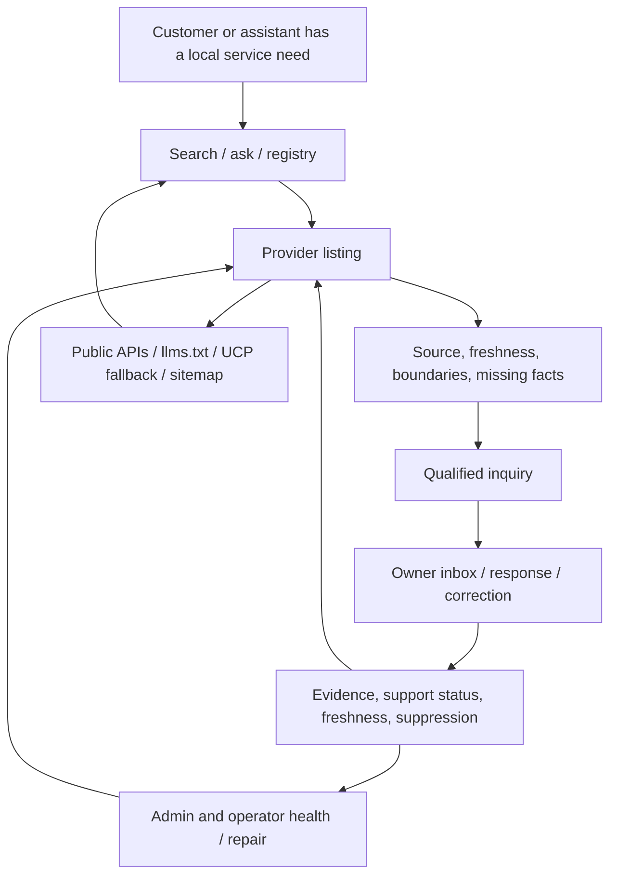
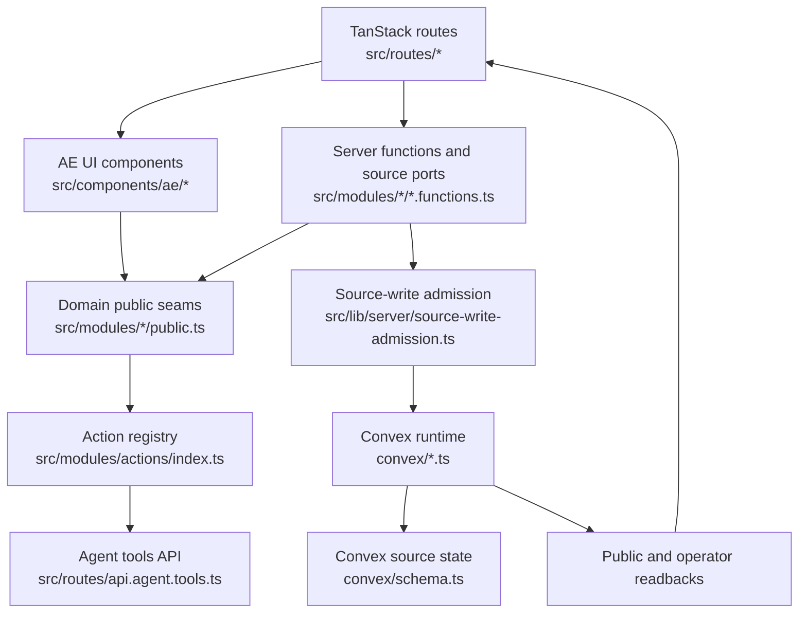

# Product Architecture Interrogation

**Date:** 2026-06-30
**Mode:** Product design interrogation over the refreshed codebase map
**Primary inputs:** `.planning/codebase/*`, `PRODUCT.md`, `DESIGN.md`, `.planning/PROJECT.md`, `.planning/STATE.md`
**External lenses:**
- Vercel, "Teaching agents product design at Vercel": https://vercel.com/blog/teaching-agents-product-design-at-vercel
- TexasBedouin/vibe-check: https://github.com/TexasBedouin/vibe-check

**Operating lenses:**
- Office-hours interrogation: demand reality, status quo, specificity, wedge, observation, future-fit
- CEO review: selective reduction, scope quarantine, product proof gates, surface ownership

## Executive Frame

Agentic Economy is a trust-aware local provider discovery and inquiry system.

Its product center is not chat, payments, generic agents, or a protocol demo. The center is a provider listing that can be read by people and assistants, compared against other providers, acted on through one safe next step, and improved through owner correction and evidence.

The market validation changes the emphasis: agentic commerce is real, but the active market is splitting into checkout rails, machine-payment rails, service marketplaces, and agent web-reach tools. AE should not race those layers. AE's wedge is the pre-commerce job humans currently do badly:

```text
from messy real-world service need
  -> to a defensible short list
  -> to one safe, qualified first-contact request
```

The larger ambition is a trust-and-consequence layer for agentic commerce. AE earns that ambition only by proving the smaller loop first: listings become trustworthy, inquiries create owner-visible demand, owner action makes facts fresher, and assistants can route without inventing capabilities.

After the office-hours, CEO-review, and market-validation pass, the rationalized posture is: hold the source-state/trust-boundary architecture, reduce the product center to loop proof, and quarantine every feature that does not strengthen the core listing-to-inquiry-to-owner-correction loop.

The durable product loop is:

```text
query/search
  -> comparable provider listing
  -> trust-aware next action
  -> qualified inquiry
  -> owner response or correction
  -> fresher listing evidence
  -> better search and assistant discovery
```

Everything else should serve that loop or remain explicitly quarantined.

## Core Product Map



### Product Objects

| Object | Product job | Source owner |
| --- | --- | --- |
| Provider listing | Give a customer or assistant enough trustworthy context to take the next safe step. | `src/modules/catalog/`, `src/modules/registry/`, `convex/registry.ts` |
| Service area and offer | Make providers comparable by what they do and where they operate. | `src/modules/catalog/public.ts` |
| Trust state | Explain source, freshness, limitation, contradiction, or unsupported claim. | `src/modules/business/`, `src/modules/security/`, `src/modules/observability/` |
| Qualified inquiry | Convert demand into a structured handoff without implying booking, payment, or dispatch. | `src/modules/inquiries/`, `convex/inquiries.ts` |
| Owner readback | Let the business see, respond, correct, and understand the state of its public presence. | `src/routes/owner.*.tsx`, `src/modules/inquiries/`, `src/modules/catalog/` |
| Agent-readable payload | Let assistants read, compare, summarize, and route only within explicit boundaries. | `src/modules/discovery/`, `src/routes/api.*`, `src/routes/llms[.]txt.ts` |
| Operator repair | Keep public trust from decaying when projection, suppression, support, or provider evidence fails. | `src/modules/observability/`, `src/routes/admin.*.tsx` |

## Core Architecture



### Architectural Contract

1. Routes adapt HTTP, params, loaders, forms, and response shape.
2. Domain modules own product contracts and state machines.
3. Server functions bridge route-safe calls to source state.
4. Source-write admission signs consequential writes server-side.
5. Convex verifies auth/admission and persists durable state.
6. Public outputs are projected and redacted back into listings, APIs, discovery files, and operator readbacks.

This is a modular monolith with explicit source-state authority. That is a good fit for the current product because the trust boundary is more important than independent service scaling.

## Integration Map

| Integration | Product role | Current posture | Product question |
| --- | --- | --- | --- |
| Convex | Durable source state and read/write runtime. | Core dependency. | Are hot public reads using projections, not source reconstruction, before real catalog growth? |
| Clerk | Owner/admin identity and Convex auth bridge. | Core dependency. | Are owner/admin flows proven on deploy, not only local bypass? |
| Resend | Inquiry email delivery. | Needed for owned conversion loop. | Is delivery evidence deployed and tied to real inquiry-created dispatch IDs? |
| Novu | Notification workflow trigger and readback. | Needed or optional depending on notification strategy. | Is it table-stakes reliability or extra orchestration before the loop is proven? |
| OpenRouter | Optional answer/chat generation and follow-up chips. | Adjacent to search/discovery. | Does it improve provider routing, or distract from listing/inquiry maturity? |
| Autumn | Paid activation. | Future/commercial rail. | Does money help the first loop, or add trust surface before demand proof? |
| Stripe | Business-action/payment evidence. | Evidence rail, not core marketplace payment. | Is any Stripe-facing copy strictly source/proof scoped? |
| Sentry | Error capture. | Present in source, map needs correction. | Are product-critical failures visible with owner/operator consequence? |
| PostHog | Funnel analytics. | Present in source, map needs correction. | Are activation and inquiry loop events coherent enough to drive decisions? |
| Google Maps Embed | Listing context and local service area. | Optional visual support. | Does it make the provider decision clearer, or become decorative weight? |

## Vercel Product-Design Lens

The useful Vercel frame is that product decisions should live in the repository, be reviewed like code, and guide agents through routed references, deterministic checks, and evidence-backed judgment. The operating contract is especially relevant here:

- Start with the job, not pixels.
- Define outcome before output.
- Use evidence, not taste.
- Separate facts from decisions.
- Treat shipped code as evidence, not automatic precedent.
- Choose the smallest coherent intervention.
- Design every reachable state.
- Verify the real surface.

### Compact Product Decision Brief

| Field | Answer |
| --- | --- |
| User | Australian local service customer, local service owner/operator, assistant, internal reviewer. |
| Job | Find or expose a trustworthy service provider and take one safe next step without pretending booking/payment/dispatch exists. |
| Product object | Provider listing with service facts, trust state, action boundary, and agent-readable payload. |
| Current behavior | Listing/search/discovery architecture exists; inquiry/provider proof and owner activation remain the product-function pressure points. |
| Desired outcome | A customer or assistant can find a provider, understand what is known, send a qualified inquiry when supported, and cause the listing to get fresher through owner response or correction. |
| Success signal | Real deployed inquiry from a public listing creates owner-visible delivery/readback and owner action updates public trust or freshness. |
| Non-goals | Booking, payment, dispatch, generic marketplace liquidity, protocol theater, fake verified status, hosted agents, wallet, settlement. |
| Consequence | Public trust increases only when source-owned evidence or owner correction supports it; unsupported claims stay limited. |
| Reversibility | Suppression, correction, repair, and no-contact/no-inquiry states must be explicit and visible to operator/owner. |
| Open decisions | Is answer/chat public core, hidden support surface, or future phase? Is Novu required for V1 or secondary to Resend? What exactly qualifies as "checked"? |

### Reachable State Map

| Surface | Empty/sparse | Populated | Failure | Permission | Stale/degraded |
| --- | --- | --- | --- | --- | --- |
| Home/search | No matching providers. | Ranked provider answer/cards. | Search unavailable or source unavailable. | Public. | Query result warns limited/stale data. |
| Registry | No providers in market/category. | Comparable provider list. | Registry source unavailable. | Public. | Some listings stale or unsupported. |
| Listing detail | Unpublished or suppressed. | Services, area, trust, next action. | Source read fails. | Public. | Details old, contradicted, or awaiting owner confirmation. |
| Inquiry | Inquiry unavailable. | Structured request submitted. | Rate-limited, support record missing, provider delivery failed. | Public customer plus source admission. | Business cannot currently receive inquiry. |
| Owner inbox | No inquiries. | Threads and delivery state. | Provider readback failed. | Authenticated owner. | Missed, held, stale, privacy tombstone. |
| Admin/operator | No issues. | Repair queues/readbacks. | Missing authority. | Admin only. | Projection, discovery, notification, evidence degraded. |
| Agent API/discovery | No eligible listing. | Public DTO/llms/UCP fallback. | Route parity or source unavailable. | Public read or gated action. | Explicit `degraded`, `unavailable`, stale support. |

### Findings From This Lens

| Priority | Finding | Product consequence | Smallest coherent fix |
| --- | --- | --- | --- |
| P0 | Product scope is not single-source clear. Phase state says chat/money/actions are excluded from Phase 1 while code maps show answer, billing, Stripe, notification, and business-action surfaces. | Agents and humans can optimize the wrong center of gravity. | Add a surface status register: public core, internal, hidden beta, future, killed. |
| P0 | Core loop proof is weaker than architecture proof. The architecture maps the loop, but deployed inquiry delivery, owner response, and correction feedback remain the hard product function. | AE behaves like a high-integrity directory, not yet a compounding marketplace loop. | Make deployed `listing -> inquiry -> owner delivery -> owner response/correction -> listing freshness` the next proof gate. |
| P1 | Trust language has drift risk. `PRODUCT.md` forbids unsupported `verified`; `DESIGN.md` includes example "verified" copy. | Users may over-trust listings before a named verification standard exists. | Replace example language with `checked`, `business supplied`, or `published details`, and define the proof standard before using `verified`. |
| P1 | Answer/chat may be a second product center. It is valuable only if it routes demand to trusted providers faster. | The product can become an AI search demo instead of a trust/inquiry loop. | Decide if answer is the primary entry to listings or quarantine it behind a future/hidden status. |
| P1 | Map artifacts contain factual drift. `CONCERNS.md` says typecheck is red but `npm run typecheck` passes; `INTEGRATIONS.md` missed Sentry/PostHog wiring. | Planning agents may prioritize false blockers or miss real product instrumentation. | Update docs or add a map-verification checklist for high-impact claims. |

## Vibe-Check Lens

The useful `vibe-check` frame is not beginner language; it is the zero-to-one discipline underneath it:

- Name the struggling moment.
- If the product is multi-sided, run discovery for every side.
- Score opportunity by pain and how well current alternatives serve it.
- Build V1 as differentiator plus table stakes.
- Map connections as product choices, not technology decoration.
- Reality-check cost, complexity, first 10 users, riskiest assumption, and growth loop.

### Struggling Moments

| Side | Struggling moment | Current workaround | AE promise |
| --- | --- | --- | --- |
| Customer | "I need a local provider and cannot tell who is reachable, credible, and safe to contact." | Google/Maps, directories, phone calls, old pages, guesswork. | Comparable listing with source, service area, boundaries, and one safe next step. |
| Business owner | "Assistants/search may misrepresent my business or send bad leads before I see them." | Manually update scattered profiles, answer repeated calls, hope search snippets are right. | Claim/correct listing, receive structured inquiries, see health/readbacks. |
| Assistant | "I need facts I can safely use without inventing booking/payment/capability claims." | Scrape pages and infer too much. | Deterministic public payload with refusal boundaries and next-step constraints. |
| Internal reviewer | "I need to know which public facts are stale, contradicted, unsupported, or broken." | Manual inspection and ad hoc fixes. | Operator health, audit, suppression, repair, support evidence. |

### Differentiator Plus Table Stakes

| Category | AE answer |
| --- | --- |
| Differentiator | Trust-aware, agent-readable provider listings that make the safe next step explicit and prevent unsupported agent assumptions. |
| Buyer table stakes | Search, comparable cards, service area, business identity, mobile usability, clear CTA, no fake reviews/availability. |
| Owner table stakes | Claim/correct page, receive inquiry, know delivery state, update availability/limitations, remove/suppress bad data. |
| Assistant table stakes | Stable JSON, public-only fields, provenance, refusal boundaries, route parity, no prompt-injection owner prose. |
| Operator table stakes | Audit, source health, repair, provider evidence, suppression, deployed smoke proof, funnel analytics. |

### Opportunity Map

Scored qualitatively from the map, not from fresh user research. Evidence labels are therefore `mapped`, `state evidence`, or `hypothesis`.

| Need | Pain | Served today | Opportunity | Evidence | Product implication |
| --- | ---: | ---: | ---: | --- | --- |
| Know which provider is safe to contact right now. | 9 | 4 | 14 | hypothesis + product thesis | Listing trust and next action must be the hero. |
| Give assistants facts without letting them overclaim. | 8 | 3 | 13 | mapped | Agent payload is a real product surface, not decorative protocol. |
| Let owners correct or confirm public service facts. | 8 | 4 | 12 | state evidence | Correction/removal is core loop, not admin cleanup. |
| Deliver a qualified inquiry and prove owner receipt. | 9 | 6 | 12 | state evidence | Notification/deploy proof is V1 table stake. |
| Browse many providers with ranking/freshness signals. | 7 | 6 | 8 | hypothesis | Ranking quality matters after inquiry proof. |
| Charge for paid activation. | 5 | 6 | 5 | mapped future rail | Not core until demand and trust loop work. |

### Connections As Product Decisions

| Decision | Recommended posture | Why |
| --- | --- | --- |
| Auth | Clerk remains owner/admin identity. | Authentication is table stakes, not a differentiator. Use managed auth and keep authority server-derived. |
| Data | Convex remains source state. | The product needs durable readbacks, mutation authority, and projections more than a split service topology. |
| Inquiry delivery | Resend first, Novu only if orchestration proves necessary. | A single reliable owner handoff is more important than multi-provider orchestration. |
| Analytics | PostHog funnel events tied to product loop. | The product needs proof of activation and conversion, not generic pageview comfort. |
| Error tracking | Sentry tied to user-visible consequences. | Exceptions should connect to broken jobs: inquiry lost, owner cannot respond, listing unavailable. |
| AI | OpenRouter only when it improves routing to listings. | AI prose is not the product unless it shortens the path to trusted next action. |
| Money | Autumn/Stripe future or gated commercial rail. | Payment can create false maturity before buyer/seller trust exists. |

### Riskiest Assumptions

1. Customers or assistants care enough about trust-state listings to switch from ordinary search/Maps/directory behavior.
2. Owners will claim/correct listings and respond to structured inquiries.
3. The agent-readable layer creates demand or distribution rather than only internal elegance.
4. The product can express trust plainly without turning into an audit log.
5. The first market is narrow enough for ranking, freshness, and support to feel real.

### First Ten Users

The first ten users should not be "small business owners" in the abstract.

They should be named or directly reachable operators in one tight local service cluster, for example:

```text
10 emergency plumbing/electrical/trades owner-operators in one Australian metro area
who already get urgent inbound calls and care about search/assistant representation.
```

For each one, AE needs:

- claimed or owner-reviewed listing
- one published service area
- one safe inquiry or contact posture
- owner-visible page/discovery health
- one correction or confirmation event
- one measurable activation signal

### Growth Loop Hypothesis

The possible loop is:

```text
customer/assistant finds listing
  -> sends qualified inquiry
  -> owner sees useful structured demand
  -> owner corrects/confirms listing
  -> listing becomes safer and ranks better
  -> better listing earns more customer/assistant trust
  -> more inquiries
```

This loop is only real when owner response and correction happen. Until then, the product is a trusted directory with agent-readable files, not a compounding marketplace.

## Office Hours Diagnostic

Office-hours mode treats this as a startup/product problem, not an architecture problem. The hard question is not "is the system coherent?" It is "who would be genuinely upset if this disappeared, and what proof do we have?"

### Six Forcing Questions Applied

| Question | Current answer | Diagnosis | Assignment |
| --- | --- | --- | --- |
| Demand reality | The docs show a strong thesis and a built system, but not enough named user behavior. `.planning/STATE.md` still notes owner activation evidence as debt. | Architecture proof is ahead of demand proof. Interest in agentic commerce is not demand. | Get 5 named owner/operator sessions and record whether they would use/correct/share/respond through AE this week. |
| Status quo | Customers use Google, Maps, directories, old web pages, direct calls, and guesswork. Owners maintain scattered profiles and answer repetitive inbound. Assistants scrape and infer. | The real competitor is not another startup. It is "good enough" Google/Maps plus manual phone work. | Watch one customer try to choose a provider and one owner try to correct their public presence without coaching. |
| Desperate specificity | The current ICP is Australian urgent/local service owners, starting with trades. That is better than "SMBs" but still too broad for first proof. | Need a named cluster, not a category. "Emergency plumbing/electrical/trades" is a filter, not yet a sales list. | Pick one metro, one service category, and 10 named operators. |
| Narrowest wedge | The smallest paid/useful version is not the full marketplace. It is one trustworthy listing that can receive a qualified inquiry and let the owner correct it. | The narrowest wedge is `provider listing -> inquiry -> owner response/correction -> freshness`, not registry breadth or AI answer breadth. | Make one deployed listing complete the loop end to end before adding more surface area. |
| Observation and surprise | The docs do not yet show uncoached observation of customers or owners using the product. | Without observation, the product may optimize for the founder's trust model rather than the user's decision model. | Run silent observation. Do not demo. Record where they hesitate, mistrust, or ignore trust cues. |
| Future-fit | More assistants will read structured public data, but that only helps AE if the facts are fresher and safer than ordinary pages. | The future makes AE more essential only if AE owns evidence quality, not just machine-readable formatting. | Prove that AE reduces an unsafe assumption an assistant or customer would otherwise make. |

### Office Hours Premises

These are the premises this product should be judged against:

1. The product is valuable only if the listing changes what a customer or assistant safely does next.
2. The supply side is load-bearing. Owners must claim, correct, respond, or otherwise improve the listing.
3. Agent-readable payloads are distribution and trust infrastructure, not the product by themselves.
4. A qualified inquiry is the first conversion. Booking, payment, dispatch, and business-action evidence are later unless the loop earns them.
5. The first market must be narrow enough that freshness, ranking, support, and owner response can feel real.

## Market Validation: Agentic Commerce Is Real, But AE's Wedge Is Earlier

The external research strengthens the thesis, but it also narrows the product. Agentic commerce is forming, but most visible activity is around rails: checkout inside assistants, pay-per-request APIs, agent-accessible tools, identity, settlement, and security. Those layers matter later. AE's near-term product value is the step before commerce: making real-world service choice safer, clearer, and easier to hand off.

### Source Map

| Source cluster | What it validates | What it does not validate | AE implication |
| --- | --- | --- | --- |
| arXiv: [The Agentic Economy](https://arxiv.org/abs/2505.15799) and related agent-economy papers | Consumer-side assistants and business-side systems will reduce communication friction and create more programmatic business interactions. | That local service trust, owner correction, availability, dispute handling, or fulfillment are solved. | AE should make the pre-transaction facts clear enough for humans and assistants to act without guessing. |
| arXiv: [The Agent Economy](https://arxiv.org/abs/2602.14219), [From Agent Identity to Agent Economy](https://arxiv.org/abs/2606.12128) | Agent identity, assets, reputation, and registries are becoming important economic primitives. | That registries alone produce operational trust or commercial liquidity. | AE's listing cannot be a static identity entry; it must prove freshness, next step, and owner response. |
| arXiv: [What Is Your AI Agent Buying?](https://arxiv.org/abs/2508.02630) | AI shopping agents can be influenced by rank, description, and presentation. Agent-readable product/service facts will affect demand. | That consumer product shopping behavior transfers cleanly to urgent local services. | AE's service facts, exclusions, and next-step language are commercial levers, not metadata. |
| arXiv: [SoK: Security of Autonomous LLM Agents in Agentic Commerce](https://arxiv.org/abs/2604.15367), [RAILS](https://arxiv.org/abs/2606.08790), [TessPay](https://arxiv.org/abs/2602.00213), [A402](https://arxiv.org/abs/2603.01179) | Agentic commerce requires authorization, scoped obligations, receipts, verification, and dispute/reconciliation posture. | That payment rails alone make consequence safe. | AE should keep future protected actions behind owner approval, reconstructable receipt, and proof-gap language. |
| [OpenAI Buy It In ChatGPT](https://openai.com/index/buy-it-in-chatgpt/) and [Agentic Commerce Protocol](https://www.agenticcommerce.dev/) | Assistant-mediated checkout is moving mainstream; merchants still need control, confirmation, and customer relationship boundaries. | That AE should jump to checkout, inventory, shipping, tax, fulfillment, or instant transaction claims. | ACP/Stripe validate the future rail, but AE's current job remains service selection and qualified inquiry. |
| [Stripe Agentic Commerce](https://docs.stripe.com/agentic-commerce) | Sellers, agents, product feeds, embedded checkout, and machine payments are becoming a formal commerce stack. | That service businesses can skip trust, fit, scope, and owner review. | Stripe is a later rail. AE should not look like a product catalog or checkout system before the service trust loop works. |
| [x402](https://docs.x402.org/introduction) and [Coinbase x402 docs](https://docs.cdp.coinbase.com/x402/welcome) | Programmatic payment for APIs, content, and services is becoming easy for agents. | That machine payment creates business truth, service quality, or safe fulfillment. | x402 is not AE's wedge. It is future payment infrastructure after source-owned proof and owner authority exist. |
| [TryPoncho](https://tryponcho.com/), [Agentic Market](https://agentic.market/), [Agent Reach](https://github.com/Panniantong/Agent-Reach) | The market wants agent-usable tools, pay-per-use services, and web reach. | That tool access solves real-world provider fit or owner-corrected service information. | AE should be easy for agents to read, but not become a tool marketplace, wallet layer, or generic service API. |
| a16z AI commentary, including [Building Search for AI Agents](https://a16z.com/podcast/building-search-for-ai-agents-with-exa-ceo-will-bryk/) and [AI Agents And The Fight For Customer Data](https://a16z.com/podcast/ai-agents-and-the-fight-for-customer-data/) | Discovery, search, data access, and customer ownership are being contested as agents become interfaces. | That the winning wedge is payments or broad agent platforming. | AE's defensible lane is trusted local service data and demand routing before the customer relationship is lost to generic assistants. |
| YC and broad accelerator/investor signal | Broad AI-agent interest is high, especially vertical workflows and automation. | A strong official YC-specific thesis for "agentic economy" or local service commerce was not found in this pass. | Treat YC as broad market tailwind, not proof. AE still needs narrow user proof. |

### Market Read

The market is splitting into layers:

| Layer | Examples | AE posture |
| --- | --- | --- |
| Assistant checkout | OpenAI Instant Checkout, Agentic Commerce Protocol, Stripe agentic commerce | Learn from the control/confirmation model; do not claim checkout. |
| Machine payment | x402, Coinbase/Base ecosystem, paid API/service calls | Future rail only; not public center. |
| Agent tool access | TryPoncho, Agentic Market, Agent Reach | Validate agent-readable demand; avoid becoming a generic tool catalog. |
| Agent search/data access | Exa/a16z search discussion, agent web-reach tools | Make AE pages and payloads easy to read and cite. |
| Trust, fit, correction, and first contact | Underserved by the rails market | AE's actual wedge. |

### Ten-Star Product Translation

The ten-star version is not "agentic commerce for local services" as a broad category. It is a single painful task done dramatically better:

```text
I need help now.
Which provider should I contact first,
what is known,
what still needs confirmation,
and can AE send a useful first inquiry without pretending anything is booked?
```

Humans are bad at this because:

1. They compare stale pages, Maps listings, ads, social posts, reviews, and directories under time pressure.
2. They infer service area, availability, pricing, and fit from weak signals.
3. They over-trust confident snippets and under-check missing facts.
4. They send vague first-contact messages that owners cannot quickly triage.
5. Owners are busy and often do not know which public facts or AI/search summaries are wrong.

AE improves the task by collapsing that mess into:

1. a short list of providers;
2. plain service fit and service-area facts;
3. visible limitations and facts needing confirmation;
4. one qualified inquiry with enough context for owner review;
5. a receipt/delivery state that does not imply booking, payment, dispatch, or fulfillment;
6. an owner correction path that makes the next answer safer.

### CEO-Level Product Claim

The public product claim should move from category language to job language:

```text
AE helps people and assistants find the right real-world service provider
and send a safer first inquiry, using business-supplied facts that owners can correct.
```

The investor-level ambition can remain:

```text
AE becomes the trusted pre-commerce layer for real-world services:
the place assistants can read before they recommend,
and the place businesses correct before bigger actions exist.
```

### Proof Standard

The market does not prove AE wins. AE proves it only if one narrow cluster beats the status quo:

| Proof | Target |
| --- | --- |
| Cluster | One metro and one service category. |
| Supply | 10 owner-reviewed or owner-corrected listings. |
| Demand test | 20 uncoached customer sessions against Google/Maps baseline. |
| Task | "Who should I contact first, what is known, what needs confirmation, and can I send the first inquiry?" |
| Success | Median under 3 minutes to a confident first inquiry, with users able to explain the remaining uncertainty. |
| Owner signal | At least 5 owners respond, correct, or say the inquiry was worth receiving. |
| Kill signal | Users browse but do not inquire, owners ignore/cannot use inquiries, or AE is not materially faster/safer than Google/Maps. |

### Strongest Version

The strongest version is not "AI directory" and not "agent checkout for services." It is:

```text
The trusted pre-commerce layer between local service demand and assistant-mediated routing.

AE knows what a provider publicly offers, what the owner supplied, what is stale,
what cannot be assumed, and what the safest next step is. Customers and assistants
use the same facts. Owners can correct the record. Better-supported listings earn
better placement and better first-contact demand.
```

That is worth building if owners and customers behave differently because of it.

## CEO Review Rationalization

CEO review mode asks what to cut, what to make explicit, and what proof matters before this gets bigger.

### Mode

Recommended posture: **selective reduction**.

Hold the architecture because the source-state and trust-boundary spine is good. Reduce the product center to the proof loop. Cherry-pick only the expansions that make that loop easier to prove or operate.

### Scope Decision

| Keep in core | Why |
| --- | --- |
| Provider listing | Core object users inspect and assistants read. |
| Registry/search | Demand entry and comparison layer. |
| Qualified inquiry | First owned conversion. |
| Owner inbox/response/correction | Turns a directory into a loop. |
| Public API, `llms.txt`, UCP fallback | Agent-readable distribution, but bounded by listing facts. |
| Operator health/repair | Prevents trust decay and silent public failures. |
| Sentry/PostHog tied to loop events | Needed to operate the loop and learn from it. |

| Quarantine or subordinate | Why |
| --- | --- |
| Answer/chat | Useful only if it routes demand into trusted listings; otherwise it becomes the accidental product. |
| Billing/Autumn | Commercial rail after owner/customer loop proof, not before. |
| Stripe evidence/business actions | Proof rail for later consequential actions, not current product center. |
| Novu | Keep only if it improves owner delivery reliability beyond Resend. |
| Broad marketplace language | Creates expectations for liquidity, reviews, availability, and dispute handling that are not yet proven. |
| `verified` copy | Requires a named proof standard; use `checked`, `business supplied`, or `published` until then. |

### Alternatives

| Approach | Summary | Effort | Risk | Completeness |
| --- | --- | --- | --- | --- |
| A. Docs-only rationalization | Keep current implementation, clarify product center in planning docs. | S | Low | 4/10 |
| B. Surface status plus loop proof | Add repository artifacts that classify every surface, define the loop proof, and make product decisions enforceable by future plans. | M | Low | 8/10 |
| C. Full product expansion | Treat answer, billing, business actions, discovery, and registry as one broad platform push. | XL | High | 6/10 |

Recommendation: **B. Surface status plus loop proof**. It gives the architecture a product operating system without adding product surface area.

### CEO Review Checklist

| Section | Rationalized finding | Required next move |
| --- | --- | --- |
| Architecture | The technical spine is coherent, but surface ownership is not explicit enough. | Create a surface status register: public core, internal, hidden beta, future, killed. |
| Error and rescue | The critical failure states are product states: no provider, inquiry unavailable, owner delivery failed, owner never responds, listing stale, source unavailable. | Name these as first-class user/operator states with copy and tests. |
| Security | Public answer thread writes, canonical origin handling, and local auth bypass centralization remain the sharpest security/product risks. | Quarantine answer/chat or close ownership/rate-limit gaps before public use. |
| Data and interaction edges | Edge cases decide trust: zero results, stale listing, unsupported claim, owner disputes, provider cannot receive inquiry, duplicate correction. | Design the empty/error/partial states before adding new happy paths. |
| Code quality | Map drift already happened. Planning artifacts can mislead agents. | Add verification notes for high-impact claims and update stale map findings. |
| Tests | The product's 2am confidence test is not local typecheck. It is deployed listing-to-inquiry-to-owner-response proof. | Add or designate a single loop proof gate and evidence ledger. |
| Performance | Registry/search can wait until volume, but projection hot paths should not be ignored. | Keep projection performance as a scale gate after loop proof. |
| Observability | Generic analytics are not enough. | Track query, listing inspect, inquiry attempt, inquiry delivered, owner response, correction, freshness/rank change. |
| Deployment | Local proof and deployed proof are different products. | Make deploy/provider smokes part of production readiness, even if separate from local release. |
| Long-term trajectory | Trust loop first, marketplace second, money third. | Do not let commercial rails or protocol surfaces define the product before the loop works. |
| UX/design | The user should see provider identity, service fit, trust reason, limitation, and safe next action in that order. | Use listing/inquiry UX as the product hierarchy test. |

### Rationalized Product Spine

```text
1. Query or browse
2. Compare trustworthy provider listings
3. Understand source, freshness, limitation, and next action
4. Send a qualified inquiry when supported
5. Owner receives, responds, or corrects
6. Listing becomes fresher and safer
7. Better-supported listings rank and route better
```

If a feature does not strengthen one of these seven steps, it is not core right now.

## Aha Moments

These are the product realizations the architecture can support when the current surface is untangled from cautious-directory posture.

| Aha | What it means | Product consequence |
| --- | --- | --- |
| The listing is a living contract, not a profile. | A provider page is not just descriptive copy. It is the current public agreement about what the business offers, what is unsupported, what is stale, and what a person or assistant can safely do next. | Listing detail, registry cards, answer results, and agent payloads should all make the same safe next action obvious. |
| Human and assistant truth can be the same truth. | AE can project one source-owned catalog into human UI, JSON, `llms.txt`, and route readbacks without letting public copy overclaim. | The "Get as agent JSON" affordance is not decoration; it is proof that people and assistants are reading the same bounded facts. |
| Correction is liquidity. | Owner correction and confirmation are not admin chores. They are how supply gets fresher and more routable. | Claim, correction, dispute, and freshness should sit in the main marketplace loop, not behind an operator-only cleanup story. |
| An inquiry is a trust update. | A qualified inquiry is not merely a contact form. It tests whether the listing can create useful demand and whether the owner responds, refuses, or corrects. | Inquiry outcome should feed listing freshness, support posture, ranking, and owner activation evidence. |
| Safe first contact is the wedge. | The task humans do badly is not "find a directory result." It is choosing who to contact first, knowing what is uncertain, and sending useful context without pretending a transaction happened. | The ask/search/listing experience should optimize for time-to-safe-first-inquiry against Google/Maps, not for browsing volume alone. |
| Rails are evidence of the future, not the current center. | OpenAI/Stripe ACP, x402, Coinbase/Base, and machine-payment marketplaces validate the direction of agentic commerce, but they mostly solve checkout, payment, and access. | AE should learn from their control, confirmation, and receipt posture while staying focused on pre-commerce trust and inquiry proof. |
| Receipts make consequence safe. | Future higher-consequence actions are valuable only when AE can reconstruct who asked, what was allowed, what was attempted, what happened, and what remains a proof gap. | Commerce and protected-action work should be earned through receipt posture, not through interface optimism. |
| The operator layer is part of the product. | Trust decays if stale, disputed, suppressed, or failed states are invisible. | Operator health and repair are not back-office polish; they are how public trust stays defensible. |

The simple public aha should be:

```text
AE helps people and assistants choose a real provider without guessing,
and gives the business a way to correct the record before bigger actions exist.
```

## What We Are Handicapping

The current architecture can do more than the product is letting users feel.

| Handicap | Current effect | Better posture |
| --- | --- | --- |
| Trust is treated as evidence infrastructure. | The system has source state, audit, admission, suppression, support records, and readbacks, but the user may only feel "directory with caveats." | Make trust visible at decision points: why this provider, what is supported, what is stale, and what happens next. |
| Correction is too easy to frame as cleanup. | Owner correction risks feeling like an admin exception path rather than the core supply-side loop. | Treat every correction or confirmation as marketplace progress: fresher listing, safer routing, better placement. |
| Inquiry is under-sold as a product signal. | The qualified inquiry can look like a conservative form instead of the first owned conversion. | Present inquiry as the first trust-preserving handoff: saved message, owner delivery/readback, response/correction outcome. |
| Answer/search can become either too central or too hidden. | If answer is centered too soon, it can become an AI demo; if hidden, AE loses the natural demand entry point. | Use answer/search as demand routing into listings, not as a separate product. Provider cards and source boundaries must lead. |
| Future action rails are parked without a crisp product bridge. | Protected actions, billing, and business-action receipts exist as technical phases but can feel detached from the first loop. | Sequence them as consequence upgrades: inquiry first, owner approval next, paid activation later, receipt-backed actions last. |
| Machine-readable output can read as protocol theater. | Discovery files and agent JSON risk feeling like internal elegance unless tied to user outcomes. | Tie agent readability to safer routing, fewer unsupported assumptions, and more owner-correctable facts. |

## Incredible User Stories

These stories describe what AE should make possible without pretending future phases are live today.

### Now: Trust Loop Proof

| User | Story | Aha moment |
| --- | --- | --- |
| Customer | I search for urgent help, compare providers, see service area and limitations, and send a qualified inquiry only where the business supports that step. | "I know what I can safely do next." |
| Owner | I claim or review my page, correct services or exclusions, see what customers and assistants will read, and understand whether inquiry is available. | "This is my public record, and I can improve it." |
| Assistant | I read the same bounded listing facts as the person, compare providers, and stop at inquiry or return the user to AE when the requested action exceeds the listing. | "I can be useful without inventing booking, payment, or dispatch." |
| Operator | I see stale, suppressed, disputed, missing-support, and failed-delivery states before they leak into public trust. | "Trust decay has a queue and a repair path." |

### Next: Demand Routing And Owner Activation

| User | Story | Aha moment |
| --- | --- | --- |
| Customer | I ask a natural-language question and get provider cards first, with plain explanation of fit, source, freshness, and the safest action. | "The answer did the comparison work but did not hide the evidence." |
| Owner | I see that a qualified inquiry came from a specific listing/service context, respond or correct the listing, and watch that correction improve freshness. | "Better facts create better demand." |
| Assistant | I can fetch public payloads, route to the right listing, send an allowed inquiry if published, and avoid unsupported claims automatically. | "The machine contract is practical, not performative." |
| Operator | I can tell whether the loop failed because no provider matched, inquiry was unavailable, delivery failed, owner did not respond, or the listing was stale. | "Failures are product states, not mystery errors." |

### Future: Consequence With Receipts

| User | Story | Aha moment |
| --- | --- | --- |
| Customer | I can request a higher-consequence next step only when the provider has published that posture and the system can show receipt or proof-gap status. | "The product gets more capable without getting less honest." |
| Owner | I approve or refuse an exact proposed action before anything consequential happens, and I can reconstruct the outcome later. | "Approval is specific, one-step-at-a-time, and auditable." |
| Assistant | I can propose a protected action, but clearance, owner authority, and receipt posture decide whether it proceeds. | "Generated intent is not authority." |
| Operator | I can reconstruct the chain from listing facts to request, owner decision, provider evidence, receipt, replay refusal, or proof gap. | "Agentic commerce becomes inspectable." |

## Handshake Kernel Note

Handshake Protocol Kernel is useful background architecture gravity for the future protected-action and receipt phases. Its product lesson is **reconstructable clearance before consequence**: reduce a consequential automated action to an exact contract, decision, one-use approval or refusal, final check, and receipt or proof gap before treating downstream evidence as success.

For AE, that means:

1. HSK is not the product center; AE remains the trust and discovery layer.
2. HSK is not installed or exposed in this pass.
3. HSK language must not appear on public customer/provider surfaces.
4. Future P4/P6 work should avoid inventing a parallel action protocol when HSK already provides the internal grammar.
5. Public AE language should stay plain: owner approval, receipt, refused, replay refused, proof gap, and safe next step.

Sources:

- https://www.npmjs.com/package/handshake-protocol-kernel
- https://github.com/CreasyBear/handshake-protocol-kernel

## Product Architecture Verdict

The architecture is unusually strong on trust boundaries, source-state ownership, and agent-readable caution. The product risk is that the architecture can make the system look more mature than the user loop is.

The market risk is the mirror image: outside activity can make the product chase rails too early. OpenAI/Stripe, ACP, x402, Coinbase/Base, TryPoncho, Agentic Market, and Agent Reach validate that agents will need readable commercial surfaces and payment/action rails. They do not prove AE should become a checkout system, wallet layer, generic tool marketplace, or autonomous service executor.

The next best work is not more surface area. It is product-function closure:

1. Define public surface status for every mounted route and feature.
2. Prove deployed listing-to-inquiry-to-owner-response-to-correction loop.
3. Make correction/removal first-class in the user journey.
4. Tie PostHog and Sentry to the core loop, not generic telemetry.
5. Decide answer/chat posture before it becomes the accidental product.
6. Keep money and business-action evidence subordinate until the trust/inquiry loop earns them.
7. Benchmark the actual user task against Google/Maps: time-to-safe-first-contact, confidence, remaining uncertainty, inquiry quality, and owner response/correction.

## Recommended Repository Artifacts

Following the Vercel product-design pattern, AE should keep product judgment as repo artifacts:

| Artifact | Purpose |
| --- | --- |
| `.planning/SURFACE-STATUS.md` | One table of every route/API/surface and whether it is public core, internal, beta, future, or killed. |
| `.planning/PRODUCT-DECISIONS.md` | Accepted product decisions with rationale, evidence, consequence, and examples. |
| `.planning/TRUST-LANGUAGE.md` | Canonical public labels and banned words with source and examples. |
| `.planning/LOOP-PROOF.md` | Evidence ledger for search/listing/inquiry/owner/correction/freshness. |
| `.planning/FIRST-10-OWNERS.md` | Named first-owner activation ledger, source channel, owner job, activation evidence. |
| `.planning/PRODUCT-DESIGN-COVERAGE-GAPS.md` | Known areas with no settled design/product standard yet. |

## Immediate Questions To Interrogate Next

1. What is the single public entry point: query-first home, registry, or listing?
2. Is answer/chat a core route to listings or a future surface?
3. What exact event means "owner activated"?
4. What exact event means "inquiry loop works"?
5. What exact proof permits "checked" and what proof would ever permit "verified"?
6. Which side is harder to acquire first: customers/assistants or owners?
7. What are the first ten named owner candidates and what is the first outreach move?
8. Which integrations are required for V1 table stakes and which are architecture drag?
9. What should the product do when the provider cannot receive inquiry?
10. What must be true before billing or Stripe appears in public product language?
11. Which external rails are research context only, and which are admitted into future architecture?
12. What would prove AE is safer or faster than Google/Maps for one urgent local-service task?

---

This document is a product architecture artifact, not implementation authority by itself. Its job is to make the product spine explicit enough that future plans can be judged against it.
