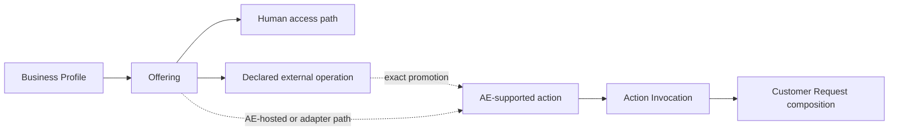

---
# ADR-026: One business supply graph from listing to execution
Status: Accepted
Date: 2026-07-22
Supersedes: ADR-002 Capability Registry — Agent-Native Supply Remodel

## Decision

AE has one supply graph. `catalog` owns the customer-recognisable Business
Profile, revisioned Offering and independently publishable access paths.
`capability-supply` owns the stronger execution-grade contract, binding,
admission, credential and readiness facts. Promotion references an exact
Offering revision and, when relevant, an exact declared access-path revision;
it does not copy or upgrade their claims.

Business publication, Offering publication, human reachability, a declared
external operation and AE-supported execution are independent facets—not one
maturity enum. A published business may have zero Offerings. An Offering may
have zero, one or several human and machine access paths. A declared operation
is descriptive inventory and AE never probes or invokes it merely because it
is listed.

The shared public projection exposes Offering facts, public access paths and a
derived support posture (`integrated`, `routeable`, public reasons and bounded
freshness). It never exposes credentials, adapter configuration, private
evidence or internal diagnostic reasons.

`listIntegratedCapabilitySupply` answers what has entered AE's supply control
plane. `listRouteableCapabilitySupply` answers what may be considered for
execution now: exact active contract and binding, published business, current
publication, healthy readiness, ready credentials and unexpired observation.
Customer Request uses only the strict routeable query and requalifies before
release.

## Migration

Use expand–migrate–contract. Retain `businessServices` and
`serviceCapabilities` read-only through cutover. Derive stable Offering and
access-path crosswalks with source hashes; never infer identity from names or
search terms. Dual-read disagreement refuses cutover and leaves the v1 public
projection authoritative. Physical retirement is a later bounded decision.

## Historical public Offering revisions

Previously public Offering revisions use the accepted
`retain-safe-history` policy. Ordinary withdrawal stops the Offering from
appearing in new discovery, records `withdrawnAt`, and retains the exact
historically public revision for later inspection. Publication evidence is
keyed by the exact business, Offering reference, revision and source hash; the
existence of an immutable revision row alone never proves that it was public.

Safe display is evaluated again on every historical read. A business that is
no longer public, an active live-business suppression, a privacy withdrawal, a
safety withdrawal, a never-public revision, a business mismatch or a source
hash mismatch refuses before revision facts are returned. Privacy and safety
withdrawals set an explicit hidden safe-display disposition and take effect
immediately.

A retained historical read never substitutes the current Offering revision.
When a newer revision is currently public, its exact identity may be returned
separately as a current-version notice. The caller must make a distinct choice
to inspect it.

## Acceptance

The contract must demonstrate: a published business with no Offerings; an
Offering with no access path; human-only and declared-operation-only supply;
both paths coexisting; endpoint withdrawal without loss of contact; exact
promotion; readiness expiry removing only routeability; suppression removing
current public projections; safe public DTOs; refusal on migration drift; and
transfer between a GraphQL data operation and a professional-services quote.

## Boundaries

This decision does not add endpoint crawling, endpoint verification, ranking,
reputation, payouts, private-data rights machinery for directory records, or a
second execution plane. Action Invocation, mandate, attempt, payment,
uncertainty and recovery semantics remain unchanged. Domain-specific rights
and quality gates are required when a declared operation is promoted into a
private-data or consequential action.
