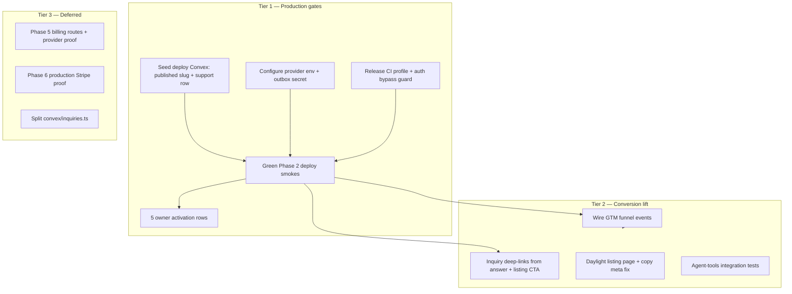

# Production-Readiness ROI Audit

**Project:** Agentic Economy  
**Date:** 2026-06-30  
**Mode:** Audit only — no implementation  
**Commit mapped:** `8075862` (working tree includes uncommitted WIP)

---

## Executive summary

1. **AE is not production-ready for honest launch claims.** Phase closeouts (especially Phase 6) reflect source/local proof, not deployed operator or user proof. The core human conversion loop — inquiry submit → owner notification → owner reply — is **broken on deploy** due to missing Convex source rows and provider env, not missing application code.

2. **Highest ROI is operational proof, not new features.** Seeding deployed Convex with a published inquiry-eligible business + `human_inquiry_owner_inbox` support record, configuring notification provider secrets, and passing Phase 2 deploy smokes unlocks more value than additional UI polish or Phase 5/6 surface work.

3. **The query-first landing/answer path (WIP) is the right product direction** and passes copy/e2e gates locally, but it is not yet wired end-to-end to inquiry conversion, GTM funnel instrumentation, or full design-system parity on listing pages.

4. **Release gates are weaker than product ambition.** `npm run test:all` passes copy/ui-contract but **typecheck fails on uncommitted billing WIP** and omits e2e, a11y, and all deploy/provider smokes. Production auth bypass flag has no hard-stop.

5. **Graphify rebuild was blocked** (`graphify` CLI not installed). Existing graph at commit `7c02ce7` is **49 commits behind HEAD** — answer module and landing rebuild are absent from graph queries.

---

## Production readiness verdict

**Not production-ready because:**

| Blocker | Evidence |
|---------|----------|
| Deployed inquiry unavailable | `02-DEPLOY-SMOKE-BLOCKERS.md` — `/plumbing-demo/inquiry` renders *Inquiry unavailable* |
| Phase 2 closeout blocked | No green `test:phase2-support-smoke`, Resend/Novu provider smokes |
| 0/5 owner activation rows | `STATE.md`, `GTM-READINESS.md` — internal alpha blocked |
| Notification env missing on deploy | Dispatch routes return `500 missing_notification_outbox_secret` |
| No end-to-end deployed workflow smoke | `lane-workflows.md` WF-006 |
| Release CI gap | `test:all` omits e2e/a11y/deploy; typecheck red on billing WIP |

**What *is* ready:** Phase 1 spine (claim, publish, registry, discovery files, admin) with local and partial deploy smoke proof; query-first landing + deterministic answer synthesizer with strong boundary copy and unit/e2e tests.

---

## Intelligence refresh status

### Codebase map (Phase 0A) — **Complete**

Refreshed all 7 documents in `.planning/codebase/` (1,241 lines total):

| Document | Lines |
|----------|------:|
| STACK.md | 147 |
| INTEGRATIONS.md | 169 |
| ARCHITECTURE.md | 195 |
| STRUCTURE.md | 239 |
| CONVENTIONS.md | 126 |
| TESTING.md | 190 |
| CONCERNS.md | 175 |

### Graphify (Phase 0B) — **Partial**

| Item | Status |
|------|--------|
| Config gate | `graphify.enabled: true` |
| `graphify build` | **Blocked** — `graphify` CLI not installed (`uv pip install graphifyy`) |
| Existing graph | 5,693 nodes, built 2026-06-29 from `7c02ce7` |
| Freshness | mtime FRESH (21h); **commit_stale: true** (49 commits behind `8075862`) |
| `query inquiry` | 1,924 nodes — cluster centered on `convex/inquiries.ts` |
| `query answer` | Returns planning docs only — **no `src/modules/answer` in stale graph** |
| `query registry` | 1,328 nodes — `convex/registry.ts`, search API |
| `graphify diff` | 0 changes (same stale baseline) |

**Recommendation:** Install graphify and rebuild after Phase 2 deploy proof lands.

---

## ROI-ranked findings (Top 15)

Scoring: **Production gate** (yes = blocks launch claim) × **Conversion lift** (H/M/L) ÷ **Effort** (S/M/L)

| Rank | ID | Finding | Gate | Lift | Effort | Tier | Lanes |
|------|-----|---------|:----:|:----:|:------:|:----:|-------|
| 1 | WF-001 | Deployed inquiry path unreachable — missing Convex publish + support row | Yes | H | M | **S** | L6, L7 |
| 2 | WF-003 | Notification provider env dead on deploy (outbox secret, Resend, Novu) | Yes | H | S | **S** | L6, L8 |
| 3 | WF-002 | Phase 2 closeout (P2-R8) blocked — no deploy smoke evidence | Yes | H | M | **S** | L6, L7 |
| 4 | US-P1-R10 | 0/5 friendly owner activation rows — GTM Stage 0 blocked | Yes | H | L | **S** | L7, L6 |
| 5 | CQ-002 | `VITE_AE_DISABLE_CLERK_FOR_LOCAL_E2E` has no production hard-stop | Yes | L | S | **S** | L8, L9 |
| 6 | CQ-001 | `test:all` omits e2e, a11y, deploy/provider smokes | Yes | L | S | **S** | L9, L8 |
| 7 | AI-1 | No integration tests for `POST /api/agent/tools` | Yes | H | S | **S** | L5, L9 |
| 8 | F3 | Default `__root` meta leaks banned "source-owned" | Yes | M | S | **S** | L4 |
| 9 | L1-001 | GTM funnel events not emitted from public routes | Yes | H | M | **S** | L1 |
| 10 | WF-006 | No single deploy smoke spans claim→inquiry→notify→reply | Yes | H | L | **A** | L6 |
| 11 | UI-002 | Listing page (`/$slug`) uses dark legacy shell, not daylight design | Soft | H | L | **A** | L2 |
| 12 | UI-004 | No sticky amber inquiry CTA on listing hero | Soft | H | M | **A** | L2, L3 |
| 13 | L1-004 | Answer cards don't deep-link to inquiry when available | Soft | H | M | **A** | L1, L5 |
| 14 | L1-002 | Public nav registry-first; Ask funnel invisible in nav | Soft | H | S | **A** | L1 |
| 15 | A11y-1 | `aria-live` on full answer stream floods screen readers | Soft | M | S | **A** | L10 |

---

## Critical path to production-ready

### Recommended execution sequence (audit output only)

1. **Deploy ops (1–2 days):** Seed Convex on production deployment; configure `AE_NOTIFICATION_OUTBOX_SECRET`, Resend, Novu; document runbook (WF-005).
2. **Proof (1 day):** Run `test:phase2-support-smoke` → capture dispatch IDs → `test:provider-smoke:resend/novu`; record `02-DEPLOY-SMOKE-EVIDENCE.md`.
3. **Release hygiene (0.5 day):** Production hard-stop for E2E bypass; add `test:release` script; fix or park billing WIP type errors blocking `typecheck`.
4. **GTM alpha (ongoing):** Five friendly owner activations with attribution; wire funnel emitters (L1-001, L1-003).
5. **Conversion polish (1–2 weeks):** Listing daylight UI, inquiry CTAs, nav Ask link, copy/meta fixes, agent-tools tests, a11y stream fixes.
6. **Explicitly later:** Phase 5 paid activation, Phase 6 production Stripe, registry projection perf at scale.

---

## Lane summaries

| Lane | Verdict | Top issue |
|------|---------|-----------|
| L1 IA | Query funnel exists; measurement and nav underweight Ask | Funnel events not wired |
| L2 UI | Split visual systems — home/answer good, listing legacy | `$slug` dark answer record |
| L3 UX | 53/D code-only; new landing much improved vs stale heuristic | Claim auth cold redirect |
| L4 Copy | Scanners strong on phase overclaims; weak on epistemic labels | `__root` meta + scan gaps on answer WIP |
| L5 AI | Boundary-honest locally; discovery index incomplete | Agent-tools untested at HTTP layer |
| L6 Workflows | Local loop proven; deploy loop not | WF-001–003 blockers |
| L7 User stories | 28 reqs lack deployed/user proof | P2-R8 primary conversion |
| L8 Libraries | Nitro nightly + TanStack skew + CI gaps | Playwright outside `test:all` |
| L9 Code quality | Strong guardrails; release truth weaker than `test:all` | Same as L8 CI + inquiry file size |
| L10 A11y | 62/C+ code-only; motion good; stream SR flood risk | aria-live scope |

Full detail: `.planning/audits/lanes/lane-*.md`

---

## WIP-specific risks

| WIP area | Risk | Mitigation |
|----------|------|------------|
| Query landing + answer module | Not in graphify; partial scan coverage | Extend `scanPublicLanguage` targets (F2) |
| `src/lib/server/billing-provider.ts` | **Breaks `npm run typecheck`** | Park behind future-phases or fix before merge |
| Uncommitted `.planning/codebase/*` | Fresh map not committed | Commit when ready (out of audit scope) |

---

## Won't-do-yet (explicit deferrals)

- Phase 5 paid activation route mount and Autumn/Stripe production proof
- Phase 6 production Stripe webhook and autonomous business-action claims
- LLM-backed answer synthesis (deterministic Phase 1 is intentional)
- Registry projection performance optimization (until catalog volume proves need)
- Splitting `convex/inquiries.ts` (maintainability — not launch-blocking)
- Graphify rebuild (blocked on CLI install)

---

## Validation pass (Phase 3)

| Command | Result |
|---------|--------|
| `npm run test:copy` | **PASS** — 5 files, 46 tests |
| `npm run test:ui-contract` | **PASS** — 6 files, 29 tests |
| `npm run typecheck` | **FAIL** — 2 errors in billing WIP (`billing-provider.ts`, `api.billing.webhook.ts`) |
| `npm run test:phase2-support-smoke` | **FAIL (expected)** — missing `DEPLOY_BASE_URL`, `SMOKE_PHASE2_BUSINESS_SLUG` |

---

## Deliverables checklist

- [x] Refreshed `.planning/codebase/*` (7 docs)
- [ ] Refreshed `.planning/graphs/graph.json` — **blocked** (graphify not installed)
- [x] 10 lane audit files in `.planning/audits/lanes/`
- [x] Consolidated `.planning/audits/production-readiness-roi-audit.md`
- [x] No product code changes

---

## Next steps for the team

1. Treat **deploy source seeding + provider env** as the single highest-ROI workstream before any new product surface.
2. Run founder-assisted **5 owner activations** in parallel — this is GTM proof, not optional polish.
3. Before merging landing/answer WIP broadly, close **copy scan gaps** (F2, F3) and **agent-tools integration tests**.
4. Install graphify and rebuild when CLI available: `uv pip install graphifyy && graphify install`, then `/gsd-graphify build`.
5. Use lane files as input to a focused **Phase 2 deploy closeout** execution plan — not a broad refactor.

---

*Audit orchestrated 2026-06-30. Agency-agents personas referenced per lane mapping in plan; no external agent install required.*
