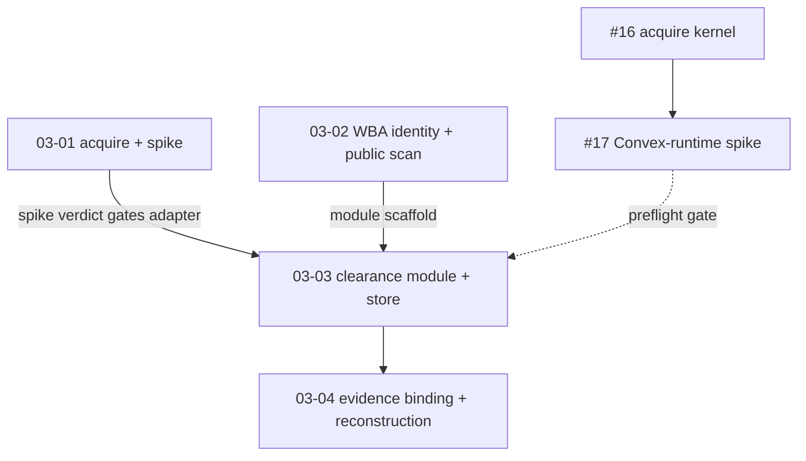

# Scope 03 — Agent identity, mandates, per-action clearance via Handshake

**ADR:** [.planning/adr/ADR-003-handshake-agent-identity-clearance.md](../../adr/ADR-003-handshake-agent-identity-clearance.md) (Status: Proposed)
**Direction:** `local://five-scopes.md` Scope 3 (USER DIRECTION LOCKED) · `.planning/PRODUCT-10-STAR.md` H4.5
**Effort:** M–L · **Sequencing:** needs Scope 1 (deployed env + `convex/authz.ts` tokenIdentifier canonicalization); parallelizable with Scope 2.
**Posture:** identity ≠ authority. Attested identity grants attribution + quota only; new verbs come solely from mandate + checkpoint + action contract. Handshake vocabulary never ships on public human surfaces or in agent JSON/tools/boundaries copy.

## Validation-first gate

Read `.planning/scopes/PREMORTEM-VALIDATION-GATES.md` and `.planning/scopes/PHASED-EXECUTION-PREP.md` before executing this scope. Scope 3 public posture and any write-admission path are blocked by non-kill verdicts for **PM-02 assistant distribution**, **PM-03 launch wedge lock**, and **PM-05 trust-language red-team**. Scope-local gates:

- **S3-G1 package/subpath quarantine** before accepting the kernel dependency or vendored dist.
- **S3-G2 Web Bot Auth fixture/header proof** before route integration.
- **S3-G3 Convex CAS replay proof** before 03-03 consumes the runtime spike.
- **S3-G4 identity-is-not-authority dispatch review** before threading `agentIdentity` into action context.
- **S3-G5 key/copy posture** before evidence/signing/readback work.

## Decisions digest (authoritative WHAT — these plans are the HOW)

| D | Decision | Covered by |
|---|---|---|
| **D1** | Depend on `handshake-protocol-kernel` v0.4.x only; import root + `/adapter-sdk` only, never `x402`/`mcp`/`http` subpaths; exact-pin; npm-first, vendor Apache-2.0 `dist/` if registry unresolved. | 03-01 |
| **D2** | Single clearance module `src/modules/clearance/`, wrap not replace: kernel-backed gate wraps P4+P6; pure `record*`/`consume*`/`verify*` stay the reconstruction oracle; kernel verdict recorded as bound evidence hashed into the receipt chain. | 03-03, 03-04 |
| **D3** | Convex runtime is spike-gated: run kernel transitions in one Convex mutation only after T2 proves kernel + `@noble` + zod v4 run in the V8 isolate with injected `now`/IDs and atomic single-use CAS; fallback = kernel-in-action + terminal atomic `commit*` in an internal mutation. | 03-01 |
| **D4** | `ConvexProtocolStore` over Convex tables (`handshakeRecords`, `handshakeStreamEvents`, `handshakeIdempotencyLedger`, `handshakeGatewayChecks`, `handshakeIsolationStates`); greenlights are `handshakeRecords` with `recordKind: greenlight` per `03-03-D4-STORE-SHAPE-AMENDMENT.md`; Convex owns idempotency via unique indexes; kernel idempotency maps onto existing `idempotencyKey`/`operationKey`. | 03-03 |
| **D5** | WBA identity at the agent door: pinned Cloudflare `web-bot-auth` + explicit policy checks; mount pre-check at `api.agent.tools.ts`; thread principal through `ActionContext.agentIdentity`; unsigned reads served, unsigned writes `403 + Accept-Signature`; short `expires` is the read-path replay defence. | 03-02 |
| **D6** | Principal + mandate model owned by clearance module: new `agentPrincipal`; generalize P6 `BuyerMandate` into reusable `mandate` (principalRef, allowedActionScope[], spendCap optional, expiry, revocation, mandateHash). | 03-02 (principal), 03-03 (mandate) |
| **D7** | Reshape-in-place (no deployed clearance data): reshape P4/P6 clearance schemas into the module before deploy; verifiers re-point at new shapes; conditional fallback to freeze-and-supersede if Scope 1 deploys P4/P6 clearance rows first. | 03-03 |
| **D8** | Reject `handshake-cloud` (CF/D1/Clerk/Stripe, closed, issues no authority); keep authority + readback in Convex; never import `customer-edge`/`agentic-endpoint-access`/`cloud-adapter`. | 03-03 (enforced as import-scan antipattern) |
| **D9** | Handshake stays un-branded publicly: `Handshake`, `HSK`, `kernel`, `greenlight`, `clearance`, `mandate`, `protocol`, `gateway`, `ActionContract` never on public human surfaces nor in agent JSON/tools/boundaries copy; add to the public banned-claim scan. | 03-02 |
| **D10** | Identity ≠ authority (normative): WBA proves the signer (attribution/quota/audit only); Handshake clears the action; a signature never authorizes a verb; rate buckets key on `(signatureAgent, keyid)`. | 03-02 |

## Tickets (Scope 3 wayfinder questions)

Every ticket is resolved by an early resolution task (resolve investigation → post resolution comment → close issue → append one line to map issue [#1](https://github.com/CreasyBear/Agentic-Economy/issues/1) "Decisions so far"). Blocked tickets also appear as named `<preflight_gates>` entries.

| Ticket | # | Type | Blocked by | Where handled |
|---|---|---|---|---|
| Obtain handshake-protocol-kernel 0.4.x: npm or vendor dist | #16 | task | — | 03-01 Task 1 (resolution) |
| Spike kernel clearance transitions inside one Convex mutation | #17 | prototype | #16 | 03-01 Task 2 (spike + resolution); **preflight gate of 03-03** |
| Confirm WBA signer landscape and pin web-bot-auth verify semantics | #19 | research | — | 03-02 Task 1 (resolution) |
| Decide credential-custody and enforcementMode for AE actions | #20 | grilling | #17 | 03-03 Task 1 (resolution) |
| Decide signing posture and key management for greenlights/receipts | #21 | grilling | — | 03-03 Task 2 (resolution) |
| Map kernel evidence into P4/P6 receipt hash chains | #18 | grilling | #17 | 03-04 Task 1 (resolution) |

## Plan sequence + dependency graph

| Plan | Wave | depends_on | Requirements (D) | Resolves |
|---|---|---|---|---|
| [03-01](03-01-kernel-acquisition-runtime-spike-PLAN.md) — kernel acquisition + Convex-runtime spike | 1 | — | D1, D3 | #16, #17 |
| [03-02](03-02-agent-door-identity-public-posture-PLAN.md) — WBA identity at the agent door + public posture scan | 1 | — | D5, D6, D9, D10 | #19 |
| [03-03](03-03-clearance-module-convex-store-PLAN.md) — clearance module + ConvexProtocolStore + mandate | 2 | 03-01, 03-02 | D2, D4, D6, D7, D8 | #20, #21 |
| [03-04](03-04-evidence-binding-reconstruction-PLAN.md) — kernel-evidence binding into P4/P6 receipt chains | 3 | 03-03 | D2 | #18 |

Wave 1 = 03-01 ∥ 03-02 (independent; identity layer is orthogonal to the kernel per D10). Wave 2 = 03-03 (gated by the spike verdict + the module scaffold). Wave 3 = 03-04.

## End conditions

Observable, command-verifiable. **Deployed** items require Scope 1's deployed env and are honestly out of local scope until then.

- **[local]** `handshake-protocol-kernel` resolves at the exact-pinned 0.4.x version and imports of root + `/adapter-sdk` typecheck with no `x402`/`mcp`/`viem`/`hono` transitive code reachable: `npm run typecheck` green; `npm run test:imports` fails on any `handshake-protocol-kernel/x402-protected-tool|/mcp|/http|/agentic-endpoint-middleware|/customer-edge` import.
- **[local]** The T2 spike verdict is recorded (mutation-in-isolate PASS, or action + terminal-mutation fallback) and the store execution shape in 03-03 matches it: `npx vitest run tests/spike/handshake-convex-runtime.spike.test.ts` green (or documented fallback with its own green test).
- **[local]** A signed agent request is attributed end-to-end: `contextFromRequest` yields `ActionContext.agentIdentity = { signatureAgent, keyid, verifiedAt }`; unsigned reads still return `200`; unsigned writes return `403` with `Accept-Signature`. `npm run test:integration` (agent-tools identity cases) green.
- **[local]** `src/modules/clearance/` exports one kernel-backed admission gate wrapping both P4 and P6; `ConvexProtocolStore` satisfies the port with atomic CAS in single Convex mutations; `npm run check:convex-codegen` + `npm run typecheck` + `npm run test:ts-standards` green.
- **[local]** `verifyReceiptStatus` still reconstructs `complete` (not `evidence_mismatch`/`unbound_provider_event`) with kernel evidence bound into the chain, and reconstructs typed refusal/replay/proof-gap/expired-mandate outcomes: `npm run test:unit` (clearance reconstruction cases) green.
- **[local]** Public/agent copy carries zero Handshake vocabulary and identity advertises no new verbs: `npm run test:copy` + `npm run test:source-mining` green with **zero new allowances**; the agent-tools registration snapshot is unchanged except the deliberate identity addition.
- **[deployed — Scope 1 gate]** A live signer (OpenAI ChatGPT-agent) request verifies against its fetched `/.well-known/http-message-signatures-directory` and lands attributed audit rows in the deployed env. **Not claimed until Scope 1 deploys.**
- **[deployed — ADR-006 S1-G3 gate]** The agent-experience audit run in `None`-credentials mode shows an unbriefed agent hitting the unsigned-write `403 + Accept-Signature` wall and recovering in one hop (Setup Friction + Error Recovery), with identity granting no verb (zero boundary-overreach). Runs against the deployed surface; **not claimed until Scope 1 deploys.**

## Success criteria (rollup)

- **03-01:** kernel acquired + exact-pinned per D1 (npm or vendored `dist/` with a source-mining ledger row); subpath quarantine holds; T2 spike verdict recorded and gates 03-03; #16 and #17 closed with resolution comments + map append.
- **03-02:** WBA identity verified at the agent door with explicit policy checks; principal threaded through `ActionContext`; `agentPrincipal` registered; unsigned reads served / unsigned writes refused with typed reasons; D9 public-posture scan live and green; identity grants no new verbs; #19 closed.
- **03-03:** one clearance module wrapping P4+P6; `ConvexProtocolStore` with single-mutation atomic CAS matching the spike verdict; `mandate` generalizes `BuyerMandate`; honest `credentialCustodyStatus`/`enforcementMode` chosen; `handshake-cloud` and money-rail subpaths never imported; #20 and #21 closed.
- **03-04:** kernel evidence hashed into the P4/P6 receipt chain as bound evidence, never a bypass; the reconstruction verifier remains the tamper oracle; reconstruction proven across success/refusal/replay/proof-gap/expired-mandate; #18 closed.

## What good looks like

A reviewer can check all of these:

1. **Identity never authorizes a verb.** Deleting the entire mandate/checkpoint layer would make every write refuse; a verified signature alone unlocks nothing (grep the agent door + a test proving a signed-but-unmandated write is refused with a typed reason).
2. **Authority stays 100% in Convex.** No import of `handshake-cloud`, `customer-edge`, `agentic-endpoint-access`, `x402`, `wallet`, `mcp`, or `viem` anywhere in `src/` or `convex/`; the reconstruction verifier — not a kernel token — is the source of truth.
3. **The receipt chain still reconstructs.** `verifyReceiptStatus` returns `complete` with kernel evidence bound in, and returns exact typed outcomes for refusal/replay/proof-gap/expired-mandate — the kernel verdict is bound evidence, never a route-around.
4. **Copy scans stay green with zero new allowances.** No Handshake/HSK/kernel/greenlight/clearance/mandate/protocol/gateway/ActionContract word reaches any public human surface or agent JSON/tools/boundaries payload; the agent-tools snapshot changed only for the deliberate identity addition.
5. **No new bespoke UI primitives.** Any owner/admin principal/mandate/audit readback is Astryx-only — no new `Ae*` presentation components, CSS files, or parallel design system in the diff.
6. **Smokes and spikes fail loudly.** The T2 spike states its exact pass/fail; the deployed WBA end-to-end is honestly marked Scope-1-gated and never counted as local proof; every summary states "source/local proof only, production proof not claimed".

## How to execute (fresh session)

1. Read this INDEX, then read the ADR ([ADR-003](../../adr/ADR-003-handshake-agent-identity-clearance.md)) end-to-end — its D1–D10 are the authoritative WHAT.
2. **Load skills first:** `ponytail` (full — delete/simplify, no future abstractions), then per plan `security-best-practices` + `security-threat-model` + `convex-security-audit` (door hardening, replay, custody), `librarian` (source-verify handshake + web-bot-auth before pinning), `convex-best-practices` + `convex-schema-validator` + `convex-functions` + `convex-migration-helper`, `clerk-tanstack-patterns` (Clerk human auth + WBA agent identity coexistence), `codebase-design` + `domain-modeling` (the clearance seam + kernel↔AE term map), `tdd`, and `wayfinder` (ticket resolution + map append). Each plan's `<skill_usage>` maps tasks → skills.
3. Execute plans in wave order: **wave 1** 03-01 ∥ 03-02 → **wave 2** 03-03 → **wave 3** 03-04. Within a plan, run tasks in order; TDD where marked; run each task's `<verify>` before moving on.
4. Resolve each ticket exactly once, in the task that owns it: resolve the investigation, post a resolution comment, close the issue, and append one line to map issue #1 "Decisions so far".
5. On completion of each plan, write the `SUMMARY.md` named in its `<output>`, stating source/local proof only and that production proof is not claimed.
6. Skip formatters/linters/full suites during task work — the orchestrator verifies centrally; run only the `<verify>` commands each task names.
