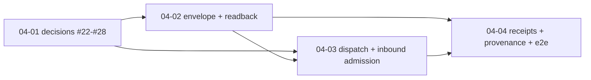

# Scope 04 — Communication rail: durable receipted agent↔business threads

**ADR:** [.planning/adr/ADR-004-comms-rail-threads.md](../../adr/ADR-004-comms-rail-threads.md) (Status: Proposed)
**Direction:** `local://five-scopes.md:30-34,43` — S4 needs S2 (endpoints) + S3 (identity); a quote in a thread is communication, never a transaction; acceptance hands off to S5.
**Boundary (non-negotiable):** AE reads, compares, summarizes, routes, and delivers/reads-back messages — it never books, charges, dispatches, or auto-fulfils, and it never fabricates a business's reply. No money-rail fields enter the thread/message schema.

## Validation-first gate

Read `.planning/scopes/PREMORTEM-VALIDATION-GATES.md` and `.planning/scopes/PHASED-EXECUTION-PREP.md` before executing this scope. Scope 4 implementation beyond 04-01 is blocked by non-kill verdicts for **PM-01 owner pull**, **PM-02 assistant distribution** where attributed-agent readback or agent-submitted inquiry surfaces are involved, **PM-03 launch wedge lock**, **PM-04 hands require pull**, and **PM-05 trust-language red-team**, plus Scope 2 endpoint dispatchability and Scope 3 identity posture. Scope-local gates:

- **S4-G1 ADR resolution reality check:** 04-02/04-03/04-04 cannot start until ADR-004 has concrete `Resolution:` lines for #22-#28, those issues are closed, and map issue #1 has one line per decision.
- **S4-G2 endpoint dispatchability matrix** before 04-03.
- **S4-G3 outbox status-model fixture** before 04-03 adapter work.
- **S4-G4 readback-token leak tabletop** before 04-02 anonymous readback work.
- **S4-G5 copy/provenance fixture** before 04-04 UI/e2e/demo work.

## Decisions digest (authoritative WHAT — see ADR §Decisions)

| D | Decision | Plan(s) |
|---|----------|---------|
| D1 | Extend existing inquiry tables; the qualified inquiry is thread-kind #1; no parallel thread/message tables; `inquiry*` names kept. | 04-02 |
| D2 | `messageEnvelopeV1` = zod discriminated union on kind `question\|clarification\|quote\|acceptance`, each `body` + optional `inReplyTo`; `quote.terms={summary, quotedValue?(free-text label), validUntil?}`; wedge-agnostic, generic commerce verbs only. | 04-02 |
| D3 | Initiator readback both ways by principal type: attributed agent keyed to scope-3 principal; anonymous human via a minted single-thread expirable readback mechanism. New read-only `inquiry.readThread`; returns `{thread, messages[], deliveryState, lastReadCursor, nextStep?}`; refuses booking/payment/dispatch. | 04-01 (#22/#25), 04-02 |
| D4 | Outbox provider family `business_endpoint`: AE signs outbound POST (`Ae-Signature` HMAC over `${ts}.${bodyHash}`, per-business secret, idempotency + retry/backoff + dead-letter) only after a scope-2 preflight accepts a checked + fresh endpoint. #23 blocks 04-03 until scope 2 exposes normalized same-origin `dispatchUrl`, outbound signing-key ref, inbound verification-key ref, guarded egress, 5s timeout, 16KiB serialized body cap, and 64KiB response cap; reuse dispatch/attempt/webhook records; add `sender:'business_agent'` + `operatedBy`. | 04-01 (#23), 04-03 |
| D5 | Inbound replies at `POST /api/inquiry/endpoint-webhook`, route-verified + deduped (`providerEventId`), admitted via new source-write scope `business_agent_reply` (add to `SourceWriteAdmissionScopeValues`; Convex validator derives from it), validated + redacted, written as `business_agent`; operationKey binds `threadId + providerEventId`; AE NEVER auto-generates a reply. | 04-01 (#24), 04-03 |
| D6 | Transfer omp-IRC: wake=webhook, receipt=attempt row (with retry/backoff), replyTo=inReplyTo/correlationId, inbox=durable rows + cursor, wait=bounded poll/long-poll through read-only `inquiry.readThread` action (`waitMs` 0-20s, timeout=`unchanged`); reject ephemerality, callback webhooks, SSE as v1 contract, direct hand-off, reply-on-behalf, sessionFile revival, sync `await` coupling. | 04-03 (#25) |
| D7 | `Delivered` = provider/business-endpoint 2xx or provider delivery webhook, never read. `Read` requires explicit receiver signal: owner/customer cursor advance or optional signed `business_endpoint` ack status `read`; optional ack status `received` renders "Endpoint acknowledged receipt." Without ack: generic copy "Delivered, not yet read"; endpoint copy "Delivered to business endpoint; read status unavailable." | 04-01 (#26), 04-04 |
| D8 | Provenance: every message carries `sender` + `operatedBy`; human copy "Automated reply from {business}" and "Sent via an assistant on behalf of a person"; no banned vocabulary. | 04-04 |
| D9 | Per-identity rate caps reuse `rateLimitClaim` + `inquiryAbuseBuckets` with keys `thread_message:{threadId}` and `initiator_thread:{principal}` (+ per-endpoint burst cap). | 04-03 |
| D10 | A quote is communication; an acceptance records intent and emits a typed `nextStep` pointer into scope-5's checkpoint rail (or an external step); scope 4 never charges/books; no money-rail fields. | 04-04 |
| D11 | Do not add `awaiting_*` statuses. Keep source status `unread|read|replied|closed`; add `expiresAt` + `closedReason` (`owner_closed|expired|privacy_tombstone`). Scheduled source-owned expiry closes at the seven-day readback TTL and all writes refuse expired threads. Inbox buckets stay derived: unread incoming, needs_reply when last message is initiator-side and open, resolved after business-side reply or closed/expired. Public copy: "Waiting for business reply" / "Waiting for customer reply"; expired initiator link copy and owner "Expired — replies are closed." | 04-01 (#27), 04-02/04-04 |
| D12 | Demo proof must run against real networked developer/business-owned endpoint(s) in dev/staging; local fixtures are CI smoke only. Each endpoint is explicitly enrolled, domain/URL pinned, scope-2 checked fresh, and labelled test/demo — not live booking, dispatch, payment, fulfilment, availability, or marketplace liquidity. It verifies AE outbound `Ae-Signature`, then emits a signed inbound `business_agent` `quote` through `/api/inquiry/endpoint-webhook`; dispatch response is ack/readback only. E2E verifier reconstructs attributed submit, customer message, dispatch/attempt, endpoint ack/signature hash, inbound webhook, quote message, `inquiry.readThread` cursor, receipts, audit/operation hashes; no raw secrets/contact/fake availability/fake-liquidity claim. | 04-01 (#28), 04-04 |

## Tickets (to resolve in wave 1; not pre-resolved)

| Ticket | # | Type | Where handled |
|--------|---|------|---------------|
| Decide initiator readback auth: token vs magic-link vs attributed-only | #22 | grilling | 04-01 Task 1 (resolve+close) → consumed 04-02 (`resolution of #22`) |
| Prototype initiator wait transport: poll vs SSE vs Convex subscription | #25 | prototype | 04-01 Task 1 (resolve+close; blocked_by #22) → consumed 04-02 (`resolution of #25`) |
| Fix business_endpoint SSRF and endpoint-trust envelope from scope 2 model | #23 | research | 04-01 Task 2 (resolve+close) → consumed 04-03 (`resolution of #23`), preflight-gates 04-03 |
| Decide source-write scope for business-agent reply admission | #24 | grilling | 04-01 Task 3 (resolve+close) → consumed 04-03 (`resolution of #24`), preflight-gates 04-03 |
| Decide business-side read-receipt honesty: ack event vs unknown | #26 | grilling | 04-01 Task 4 (resolve+close) → consumed 04-04 (`resolution of #26`) |
| Decide thread lifecycle/TTL state-machine widening | #27 | grilling | 04-01 Task 4 (resolve+close) → consumed 04-02 (`resolution of #27`), preflight-gates 04-02 |
| Prototype a seeded demo business-agent endpoint for the e2e loop | #28 | prototype | 04-01 Task 5 (resolve+close; blocked_by #23,#24) → consumed 04-04 (`resolution of #28`), preflight-gates 04-04 |

Planned coverage: **7/7** scope-4 tickets. Each resolution task must post a GitHub resolution comment, close its issue, append one line to wayfinder map issue #1 "Decisions so far", and add the matching ADR-004 `Resolution:` line before downstream plans consume it.

## Plan sequence, waves, and depends_on graph

| Plan | Wave | depends_on | Requirements | Scope | Prod-exec |
|------|------|-----------|--------------|-------|-----------|
| 04-01 settle-scope-decisions | 1 | — | D1,D3,D4,D5,D6,D7 | decision_spike | false |
| 04-02 message-envelope-thread-readback | 2 | 04-01 | D1,D2,D3 | source_local | false |
| 04-03 business-endpoint-dispatch-inbound-admission | 2 | 04-01, 04-02 | D4,D5,D6,D9 | source_local | false |
| 04-04 receipts-provenance-boundary-e2e | 3 | 04-02, 04-03 | D7,D8,D10,D12 | deployed_dev_staging_demo | true |

Note: 04-02 and 04-03 are both wave 2, but 04-03 depends_on 04-02 (it needs the `business_agent` sender + envelope), so run 04-02 before 04-03. Scope 4 as a whole depends on scopes 1/2/3 substrate (deploy discipline, scope-2 endpoint capability, scope-3 attributed identity) — surfaced in each plan's `<preflight_gates>`.

## End conditions

Observable, command-verifiable statements of completion (04-04 requires deployed dev/staging proof against real networked developer/business-owned test/demo endpoint(s); local fixtures are CI smoke only):

- All of #22–#28 are closed on GitHub with resolution comments and appear on wayfinder map issue #1; ADR-004 `## Open questions → tickets` carries a `Resolution:` line per ticket. *(verify: issue state + ADR grep)*
- `npm run check:convex-codegen` and `npm run typecheck` pass with the widened inquiry schema (message `kind`/`inReplyTo`/`terms`/`operatedBy`, `business_agent` sender, initiator read cursor), the `business_endpoint` outbox family, and the #24 source-write scope.
- `npx vitest run tests/unit/inquiries/message-envelope.test.ts tests/unit/inquiries/thread-readback.test.ts tests/types/domain-contracts.test.ts` is green (envelope wedge-agnostic; validator-inferred type equals domain type; readback own-thread-only + cursor-gated).
- `npx vitest run tests/unit/notification-outbox/business-endpoint-adapter.test.ts tests/unit/inquiries/business-agent-reply-admission.test.ts` is green (signed outbound + every SSRF refusal; inbound verify/dedupe/admit/redact; no synthetic-reply path).
- `npx vitest run tests/integration/inquiry-thread-readback.test.ts tests/integration/inquiry-endpoint-webhook.test.ts` is green (readback token refusal; full round-trip reconstructable; rate caps enforce).
- `npx playwright test tests/e2e/scope4-comms-rail-loop.spec.ts` passes against deployed dev/staging AE plus an explicitly enrolled, domain/URL-pinned developer/business-owned test/demo endpoint: attributed-agent submit → signed dispatch → endpoint signed quote through inbound webhook → initiator `inquiry.readThread` readback → whole thread reconstructable from receipts. Local Convex/vite fixtures may run as CI smoke but do not close #28.
- `npm run test:copy && npm run test:seo && npm run test:source-mining && npm run test:ts-standards && npm run test:imports && npm run test:ui-contract` are green with **zero new positive-claim allowances** in the claims register.
- DEPLOYED (ADR-006 S1-G3 gate, T3 extended goal) — the agent-experience audit exercises `inquiry.readThread` and confirms **zero boundary-overreach** on the thread rail: no agent treats a `quote` as a booking/charge or an `acceptance` as a completed transaction. Runs against the deployed surface; not claimed until Scope 1 deploys.

## Success criteria (rollup of plan success_criteria)

- **04-01:** all 7 tickets resolved/recorded/closed/mirrored; no implementation plan pre-answers a ticket; scans green; quote≠transaction + read+describe egress posture intact.
- **04-02:** typed wedge-agnostic `messageEnvelopeV1` on existing tables; `inquiry.readThread` serves both principal types, own-thread-only, refuses unsafe intents; read only from cursor advance; no money-rail/services-shaped fields.
- **04-03:** `business_endpoint` delivers signed messages only to the registered scope-2 endpoint under the #23 guard list with durable retry/backoff/dead-letter; inbound replies verified/deduped/admitted/redacted as `business_agent`, never fabricated; per-identity caps bound both sides; round-trip reconstructable.
- **04-04:** delivered≠read cursor-gated receipts; provenance + quote≠transaction boundary copy on every human surface, no pay/book control, no banned vocabulary; full loop runs in deployed dev/staging against a real networked developer/business-owned test/demo endpoint (closes #28); Astryx-only diff; scans green with zero new allowances.

## What good looks like

1. **A reviewer reconstructs the full loop from persisted rows alone** — submit → signed dispatch attempt → signed business reply → readback → delivery/read receipts — with no ephemeral state and no gap (D6 durability).
2. **AE never speaks for a business** — there is no code path that generates a `business_agent` message without a signature-verified inbound POST; silence stays silence (timeout + delivery state), proven by test.
3. **quote≠transaction is enforced in schema AND copy** — no money-rail field exists on the thread/message/nextStep schema, and no human surface renders a pay/book/confirm affordance or "booked/paid/confirmed"; acceptance only emits a typed nextStep pointer into scope 5.
4. **Delivered and read are never conflated** — "Delivered, not yet read" shows absent a read signal; read is claimed only from a cursor advance; business-agent read follows the #26 decision; email opens never imply read.
5. **No new bespoke UI primitives** — the owner-inbox/thread provenance UI is an Astryx-only diff composing existing `AeInquiry*` components; the class-scan and no-new-CSS constraint hold.
6. **Copy scans stay green with zero new allowances** — every positive claim already had a gate; the rail added truthful negative/boundary copy, not new marketing latitude, and demo endpoint surfaces are labelled test/demo with no live availability, booking, dispatch, payment, fulfilment, marketplace liquidity, or fake-liquidity claim.

## How to execute (fresh session)

1. **Load skills first** (per ENGINEERING-STANDARDS.md Required skills/modes, mapped to this harness): always `/ponytail full` + `code-review`; then per plan — 04-01: `grilling`, `security-best-practices`, `security-threat-model`, `convex-security-audit`; 04-02: `domain-modeling`, `convex-schema-validator`, `convex-migration-helper`, `convex-best-practices`, `convex-realtime`, `clerk-tanstack-patterns`, `tanstack-router-best-practices`, `tdd`; 04-03: `security-best-practices`, `security-threat-model`, `convex-security-audit`, `convex-performance-audit`, `convex-best-practices`, `tdd`; 04-04: `impeccable`, `make-interfaces-feel-better`, `ui-craft`, `product-design`, `playwright`, `seo-audit`, `ai-seo`, `tdd`.
2. **Read authority docs**: ADR-004, `AGENTS.md`, `.planning/ENGINEERING-STANDARDS.md`, `.planning/ROADMAP.md` (bloat detector + money quarantine), `.planning/codebase/CONVENTIONS.md`, `.planning/codebase/ARCHITECTURE.md`, `DESIGN.md`.
3. **Execute in wave order**: 04-01 → 04-02 → 04-03 → 04-04. Run each plan's tasks in order; TDD where marked; run `<verify>` after each task; do NOT pre-answer a ticket — 04-01 owns the decisions and downstream plans cite `resolution of #N`.
4. **Bring up required environments**: for 04-02/03 use local Convex (`npx convex dev --once --typecheck=disable --codegen=disable`) and `npm run check:convex-codegen`; for 04-04, also deploy a dev/staging AE environment and enroll at least one real networked developer/business-owned test/demo endpoint with pinned URL/domain and signing secrets. Local seeded fixtures are CI smoke only.
5. **Write each plan's SUMMARY.md** on completion (`04-0N-SUMMARY.md`), stating exactly which evidence is local/source proof and which 04-04 evidence is deployed dev/staging proof; do not claim live-customer production proof unless a separate deployed smoke covers it.
