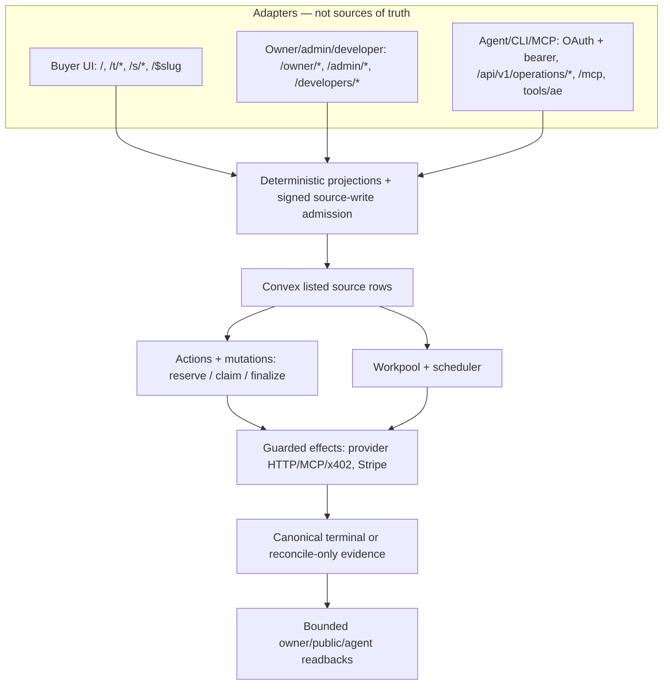

# Info Architecture — Schemas & Data-Flow Routes

**Analysis date: 2026-08-20**

## Scope, evidence ceiling, and maintenance contract

This map owns the current information architecture:

- durable schemas and source/projection boundaries;
- buyer, owner, administrator, developer, and agent personas;
- HTTP, TanStack Start UI, CLI, and MCP adapters;
- Market Operation discovery, invocation, cancellation, status, and reconciliation;
- owner supply admission, publication, readiness, and supplier economic readback;
- Answer threads, durable turns, sharing, and public projections;
- agent access, OAuth adapters, listed grants/principals, budgets, and approval modes;
- internal billing, provider-direct x402 spend, Stripe observations, Qualified Use, and payout rows;
- operator/security surfaces and public discovery.

Prompt construction, model selection, tool-loop mechanics, model-visible schemas, and eval detail belong
in [PROMPT-DATA-FLOW.md](PROMPT-DATA-FLOW.md). This map links that boundary and does not duplicate those
internals.

Customer Request TypeScript is deleted. Inquiry Convex modules are deleted. Those families are not live
listed schema and are not product journeys. Dedicated HTTP tombstones (410) and fail-closed unlisted
Convex commands are documented only as retirement seams.

- **Authority:** Convex durable rows plus deterministic module/kernel seams own identity, validation,
  authorization, dispatch, persistence, budgets, money, settlement state, and evidence
  (`convex/schema.ts`, `src/modules/**/public.ts`, and enforcing `internal/*` seams).
- **Adapter rule:** TanStack Start routes, UI loaders, HTTP handlers, CLI, and MCP expose or submit
  contracts. They are not alternate sources of truth (`src/routes/**`, `src/lib/server/**`,
  `tools/ae/**`, `src/lib/server/mcp-api.ts`).
- **Projection rule:** Search documents, public DTOs, Answer artifacts, status pages, and provider
  responses are bounded projections or observations. A projection cannot grant authority or upgrade
  uncertain work to completion.
- **Evidence classes:** repository-integrated source, locally verified behavior, fixture/eval proof,
  configured hosted observation, independently supplied evidence, and settled production evidence are
  distinct classes. Source integration alone proves only source facts.
- **Source-facts-only ceiling:** Nothing here certifies hosted uptime, external provider completion,
  real-money settlement, payout, legal readiness, or an SLO unless a cited durable observation proves
  that exact claim.
- **Maintenance:** Re-walk `convex/schema.ts`, every spread source, public module seams, route files,
  adapter registries, and dirty-tree changes before changing counts or flows.
- **USE notation:** The resource table applies Brendan Gregg's utilization, saturation, errors lens
  after inventory. `?` means no repository observation seam was found; it never means zero or healthy.

## 1. Authority spine and functional blocks

`convex/schema.ts` registers **15 table bundles/spreads containing 48 application tables**.
The spread count describes root composition; the table count describes concrete `defineTable(...)`
registrations reachable through those spreads. `tests/unit/schema/convex-schema.test.ts` pins the
census: `durableTables` must equal `schema.export()` table names. Convex component-owned tables
(Workpool, rate limiter, aggregate) are outside this application-schema count.

Unlisted on purpose (`convex/schema.ts` comment): routing-kernel, discovery, notification-outbox,
settings, and agent-access OAuth grant/client tables. Do not spread them back in. Customer Request,
inquiry, demand, project-spine, Work Tree, and study families are not listed and have no TypeScript
product modules in the current tree.



```text
 Public/buyer                 Owner/admin/developer               Agent/CLI/MCP
 ────────────                 ─────────────────────               ─────────────
 /, /t/new, /$slug            /owner/*, /admin/*                  OAuth + bearer
 /t/$threadId, /s/$token      /developers/discovery              POST /api/v1/operations/call
                              /agent-access/*                    GET/POST status/cancel/reconcile
                              /operations/invocations/*          /mcp, tools/ae
        │                              │                                │
        │ read/submit adapters         │ identity + source writes       │ strict contracts
        └──────────────┬───────────────┴───────────────┬────────────────┘
                       ▼                               ▼
          deterministic projections         signed source-write admission
          and public module seams            auth/scope/nonce/digest checks
                       │                               │
                       └──────────────┬────────────────┘
                                      ▼
                       Convex durable source rows
             identity / revision / authority / evidence / money
                                      │
                    ┌─────────────────┴──────────────────┐
                    ▼                                    ▼
        Convex actions + mutations             Workpool + scheduler
        reserve/claim/finalize                  bounded asynchronous work
                    │                                    │
                    └─────────────────┬──────────────────┘
                                      ▼
       guarded external effects: provider HTTP/MCP/x402, Stripe
                                      │
              response, webhook, chain receipt, or provider claim = observation
                                      ▼
     canonical terminal/reconciliation evidence → bounded owner/public readbacks
```

```text
Catalog source ──► BusinessSupplyProjection (value, not a table) ──► public business/service DTOs
      │                         │
      │ exact offering/access-path lineage
      ▼                         ▼
Capability publication ──► current Operation projection ──► discovery only
      │
      ├─ readiness observation + revision/target/credential fence
      └─ binding + provider connection + policy
                              │
                              ▼
Agent grant ─► invocation reservation ─► canonical Action Invocation claim
                              │                       │
                              ▼                       ▼
                       Workpool dispatch       release/effect fence
                              │                       │
                              └──────────┬────────────┘
                                         ▼
                           transport + money observation
                                         ▼
                           terminal or reconcile-only state
```

```text
Answer reservation → transient stream → checkpoint/finalization → answerThreads readback
Owner supply draft → import/admission → publication/binding → readiness → public projection
OAuth consent adapter → listed principal/policy grant → scoped /call envelope → status/recovery
Customer Request / inquiry / /$slug/inquiry / /api/v1/requests → retired; not live families
```

The functional blocks stay separate:

1. **Business/catalog** owns public business identity, offerings, revisions, and access paths.
   Claim status lives on `businesses`; there is no separate `claims` table.
2. **Capability supply** owns contract-backed publications, offerings, bindings, provider authority,
   readiness observations, and Operation material.
3. **Registry/discovery** owns deterministic public search documents, site UCP, and machine-readable
   discovery files. They are projections, not a second catalog authority.
4. **Agent access** owns listed principals and policy grants. OAuth HTTP adapters exist; OAuth
   grant/client Convex tables are unlisted and fail-closed.
5. **Capability execution + Action Invocation** own invocation reservation, canonical claim, lease,
   release, terminal outcome, and recovery. The paid HTTP door is `POST /api/v1/operations/call`.
6. **Money** owns exact internal ledger state, credential-budget reservations, provider-direct
   external spend, Stripe observations, Qualified Use receipts, provider accrual, and payout rows.
7. **Answer/thread** owns durable conversational lifecycle and sanitized readbacks. Its prompt/model
   execution boundary remains in the companion prompt map.
8. **Operator/security** owns disputes, source-write nonces, and fail-closed admin membership
   (always `undefined` at the document mapper). Admin UI routes exist; they do not mint membership.

## 2. Personas and current route inventory

The current TanStack Start tree has **88 `createFileRoute(...)` modules plus `__root.tsx`**.
`src/routes/__root.tsx` uses `createRootRoute`, not `createFileRoute`. A glob of
`src/routes/**/*.{ts,tsx}` is 89 files; the file-route census is the `createFileRoute` count.
The count includes the `/_operator` layout, `/api/$` catch-all, retained redirects, and HTTP
tombstones. Route presence proves an adapter exists, not that its backing dependency is configured
or healthy.

### Buyer/customer

- `/` validates bounded `q` (`QUERY_MAX_LENGTH` 200 in `src/lib/query-length.ts`) and optional
  leftover `project` search so old `/?project=` URLs do not 400. A query redirects to `/t/new`.
  Home never reads a Work Tree (`src/routes/index.tsx`, `loadRootRoute`).
- `/t/new` starts an Answer; `/t/$threadId` reads a pseudonymous-session-owned durable projection
  (`src/routes/t.new.tsx`, `src/routes/t.$threadId.tsx`).
- `/s/$shareToken` is an unowned, read-only, sanitized shared Answer projection. The token is a grant,
  not thread authority (`src/routes/s.$shareToken.tsx`,
  `src/modules/answer-thread/internal/share-token.ts`).
- `/i/$threadId` is a retained **301** redirect to `/t/$threadId`; it is not a second record model
  (`src/routes/i.$threadId.tsx`).
- `/$slug` reads a source-backed public business page (`src/routes/$slug.tsx`). There is no
  `/$slug/inquiry` route.
- `/$slug/ucp` is the current offering-level UCP manifest (`src/routes/$slug.ucp.ts`).
- `/$slug/tools/$toolId` and `/$slug/tools/$toolId/prepare` are **410 tombstones**. They call
  `handleBusinessToolInvoke` / `handleBusinessToolPrepare`
  (`src/lib/server/business-tool-api.ts`), which return RFC 9457
  `quarantine_surface_retired`. They do not advertise prepare/invoke as product.
- `/about`, `/help`, `/privacy`, `/privacy/remove-business`, `/terms`, `/for-agents`, and
  `/for-providers` are public informational adapters, not durable business authorities.
- `/engine` is retained only as a redirect to `/` (`src/routes/engine.tsx`).

### Answer HTTP family

- `POST /api/answer/turn` is the keyless agent entry (`ANSWER_THREAD_AGENT_ENTRYPOINT` in
  `src/modules/answer-thread/agent-entry.ts`; handler `src/routes/api.answer.turn.ts`). It reserves
  durable identity before transient streaming. Paid market work is not this door.
- `POST /api/answer/turn/stop` durably stops eligible work before client abort is treated as final
  (`src/routes/api.answer.turn.stop.ts`).
- `/api/answer/threads`, `/api/answer/threads/$threadId`, and
  `/api/answer/threads/$threadId/share` expose bounded session-owned list/read/share operations.
- `/api/answer/eval-status` reports `{ evalPassed }` from `AE_ANSWER_EVAL_PASSED`
  (`src/routes/api.answer.eval-status.ts`). It is not production Answer quality evidence.
- Prompt, model, and tool-loop internals for these routes are documented only in
  [PROMPT-DATA-FLOW.md](PROMPT-DATA-FLOW.md).

### Public catalog, services, and Operation discovery

- `/api/businesses`, `/api/businesses/search`, and `/api/businesses/$slug` read the public catalog
  projection (`src/modules/registry/internal/offering-api-projection.ts`).
- `/api/v1/services`, `/api/v1/services/search`, and `/api/v1/services/$serviceId` project that same
  catalog into Service DTOs. They are not a second catalog authority
  (`src/modules/registry/internal/services-api-projection.ts`).
- `/api/v1/market-operations/search`, `/detail`, `/compare`, and `/inspect-plan` expose read-only
  Operation contracts from the canonical action registry
  (`src/modules/registry/operation-paths.ts`, `src/modules/registry/operation-action-contracts.ts`).
- Search accepts a query of at most 200 characters and returns at most 20 results; compare and
  inspect-plan accept at most four exact Operation refs (`operationSearchInputSchema`,
  `operationCompareInputSchema`, `operationInspectPlanInputSchema` in
  `src/modules/capability-supply/operation-schemas.ts`).
- `/operations/$operationRef` displays one exact current Operation descriptor
  (`src/routes/operations.$operationRef.tsx`).
- `/operations/invocations/$invocationRef` is an owner-scoped status/cancel/reconcile surface, not a
  public invocation readback (`src/routes/operations.invocations.$invocationRef.tsx`).
- Discovery descriptors include contract/input, commercial, evidence, effect, authentication,
  availability, provenance, and recovery navigation. They never grant invocation authority.

### Public discovery and machine-readable adapters

- `/.well-known/ucp` is the site UCP manifest (`src/routes/[.]well-known/ucp.ts`,
  `src/modules/discovery/internal/site-manifest.ts`).
  - `customerRequest.retired` is `true`; `successorPath` is `/api/v1/operations/call`.
  - Paid-door summary: “Paid market work goes through POST /api/v1/operations/call.”
  - The manifest does **not** advertise business-tool prepare/invoke or `/api/v1/requests`.
- `/llms.txt`, `/SKILL.md`, `/robots.txt`, and `/sitemap.xml` derive bounded public files from current
  registry/discovery seams.
- `/api/discovery/schema` and `/api/discovery/examples` publish current contracts and examples.
- `/.well-known/http-message-signatures-directory` publishes signature-key discovery material.
- `/mcp` is the Streamable HTTP MCP adapter over the shared action registry
  (`src/routes/mcp.ts`, `src/lib/server/mcp-api.ts`, `src/modules/actions/index.ts`).
- `src/lib/mcp-protocol.ts` re-exports the installed SDK's `LATEST_PROTOCOL_VERSION`. MCP request
  bodies are capped at 320 KiB (`MAX_MCP_REQUEST_BODY_BYTES`).
- Anonymous MCP lists/runs only read-only actions without credential admission. Authenticated MCP
  resolves bearer principal, scope, and required authority mode before registering protected tools
  (`createAeMcpServer`, `handleMcpRequest`). Registered actions include registry search/detail,
  market-operation search/detail/compare/inspect-plan, `operation.execute` (anonymous keyless),
  `operation.invoke` / status / cancel / reconcile, and supply publish/withdraw/earnings. There is
  no `inquiry.submit` and no Customer Request action
  (`tests/unit/actions/registry.test.ts`).
- `/api/health` and `/api/ready` are application health/readiness adapters. They do not prove a given
  supplier binding or Operation is routeable.

### Owner/supplier

Operator nav is `src/lib/operator/navigation.ts`. Owner core: `/owner/status`, `/owner/offerings`,
`/owner/supply`, `/owner/settings`. Advanced: `/agent-access`. There are no owner inquiry or
request-problem destinations.

- `/claim`, `/claim/form`, and `/claim/success` are the public owner-claim funnel
  (`src/routes/claim.tsx`, `src/modules/catalog/owner-claim.functions.ts`).
- `/owner/supply` and `/owner/supply/$offeringRef` expose source-backed supply setup, publication,
  readiness, testing, maintenance, and supplier economic readback
  (`src/modules/capability-supply/supply-funnel.functions.ts`).
- `/owner/offerings`, `/owner/offerings/new`, and `/owner/offerings/$offeringRef` own offering source
  editing and revisions.
- `/owner/status` and `/owner/settings` expose bounded owner page and account settings. Notification
  preference Convex commands are retired (`convex/settings.ts` returns `owner_not_found` /
  “Owner notification preferences are retired.”).
- Source files use the layout IDs `/_operator/owner/...`; user-visible paths omit the pathless layout
  segment (`src/routes/_operator/owner.*`).
- Setup/test does not create a paid production invocation or supplier earnings. Its UI cannot serve as
  Qualified Use or payout evidence.

### Administrator and developer

- `/_operator` supplies the Clerk-authenticated shell for owner, admin, developer, and agent-access
  surfaces (`src/routes/_operator.tsx`, `src/lib/operator/route-options.ts`). Durable membership or
  ownership still decides each operation.
- Admin nav (`src/lib/operator/navigation.ts`): `/admin/claims`, `/admin/audit-events`,
  `/admin/index-health`, `/admin/runs`. There are no `/admin/inquiries`, `/admin/request-problems`,
  or `/admin/search-gaps` routes.
- `/admin/runs/$turnId` is a nested run-viewer adapter (`src/routes/_operator/admin.runs.$turnId.tsx`).
- Admin membership document mapping always returns `undefined`
  (`adminMembershipFromDocument` in `convex/securityAdminMembership.ts`).
  `loadAdminAuthoritySource` always returns empty membership arrays. `requireAdminAuthority(undefined, …)`
  denies with `missing_membership` (`src/modules/security/internal/admin-authority.ts`). This is
  fail-closed, not missing documentation.
- `/developers/discovery` reports discovery route health/freshness and is not an admin projection.
- `/sign-in/$` and `/sign-up/$` are authentication adapters.

### Agent access and OAuth

- `/agent-access` lists/issues/revokes owner-controlled access (`src/routes/_operator/agent-access.tsx`).
- `/agent-access/authorize` handles pending approval decisions (`src/routes/_operator/agent-access.authorize.tsx`).
- `/oauth/register`, `/oauth/device_authorization`, `/oauth/authorize`, and `/oauth/token` implement
  dynamic-client/device/authorization-code token flows through the OAuth HTTP adapter
  (`src/lib/server/agent-access-oauth-api.ts`, `src/lib/server/agent-access-oauth-store.ts`).
- Convex OAuth grant/client tables are **unlisted**. `convex/agentAccessOAuth.ts` insert/update
  throws `agent_access_oauth_unlisted`; reads return `null`. That is fail-closed durability for the
  OAuth row family, not an absent HTTP adapter.
- Listed durable agent-access authority remains `agentAccessPrincipals` and `agentAccessGrants`.
- `/.well-known/oauth-authorization-server` and `/.well-known/oauth-protected-resource` publish OAuth
  metadata. Protected-resource `scopes_supported` is `AGENT_ACCESS_OAUTH_SCOPES`
  (`src/lib/http/oauth-challenge.ts`): `market_operations:invoke` plus the four authority-mode
  strings (`customer_requests:inspect_only`, `customer_requests:approve_each`,
  `customer_requests:bounded_mandate`, `customer_requests:full_yolo`). Those mode strings are
  authority-mode tokens, not a Customer Request product family.
- `normalizeRequestedScopes` and `canonicalAgentScopes` refuse `customer_requests:create`
  (`src/modules/agent-access/oauth-state.ts`, `src/modules/agent-access/agent-access.ts`).
  Do not advertise `customer_requests:create` as issued.
- Authorization-server metadata does not republish `scopes_supported`
  (`oauthAuthorizationServerMetadata` in `src/lib/server/agent-access-oauth-api.ts`).

### Operation APIs (paid door and recovery)

Paid door and recovery live in `OPERATION_INVOKE_ROUTE_CONTRACT`
(`src/modules/capability-execution/operation-invoke-entry.ts`) and
`src/lib/server/operation-invoke-api.ts`.

| Action | Method | Path | Route module |
|---|---|---|---|
| `operation.invoke` | POST | `/api/v1/operations/call` | `src/routes/api.v1.operations.call.ts` |
| `operation.status` | GET | `/api/v1/operations/{invocationRef}` | `src/routes/api.v1.operations.$invocationRef.ts` |
| `operation.cancel` | POST | `/api/v1/operations/{invocationRef}/cancel` | `src/routes/api.v1.operations.$invocationRef.cancel.ts` |
| `operation.reconcile` | POST | `/api/v1/operations/{invocationRef}/reconcile` | `src/routes/api.v1.operations.$invocationRef.reconcile.ts` |

- **Paid door:** `POST /api/v1/operations/call`. Required bearer scope is
  `market_operations:invoke` (`OPERATION_INVOKE_SCOPE`).
- **`POST /api/v1/operations/execute` is HTTP 410** for every method
  (`src/routes/api.v1.operations.execute.ts`, `quarantineSurfaceRetiredProblemInput`).
  RFC 9745 Deprecation/Sunset/Link headers attach to this tombstone only, never to `/call`
  (`src/modules/product-frontier/deprecation-notice.ts`). Successor path is `/api/v1/operations/call`.
- Invocation bodies are capped at 256 KiB; cancel/reconcile bodies at 64 KiB
  (`MAX_OPERATION_INVOKE_BODY_BYTES`, `parseRecoveryBody`).
- The gateway requires bearer scope, strict canonical schemas, source-write admission, and
  principal-bound idempotency before source execution.

### Tombstone HTTP (not product)

These adapters exist so old clients get an explicit gone/frozen answer. They are not live families.

- `POST/GET/… /api/v1/operations/execute` → 410 (`src/routes/api.v1.operations.execute.ts`).
- `POST /$slug/tools/$toolId` and `…/prepare` → 410, including historical `inquiry.submit` tool ids
  (`src/lib/server/business-tool-api.ts`, `tests/unit/server/quarantine-write-http.test.ts`).
- `POST /api/notification/novu-dispatch` and `POST /api/notification/resend-dispatch` → 410
  (`src/routes/api.notification.novu-dispatch.ts`,
  `src/routes/api.notification.resend-dispatch.ts`).
- `/api/v1/requests` and `/api/requests` have **no concrete route files** (Customer Request TypeScript
  and `customer-request-gone.ts` are deleted). Unmatched `/api/**` hits `/api/$` and returns RFC 9457
  **404** `api_not_found` (`src/routes/api.$.ts`). Treat that absence as retirement, not a request
  product. Quarantine prefixes in `QUARANTINE_FAMILY_ACTION_PREFIXES` are currently empty
  (`src/modules/product-frontier/quarantine-write-admission.ts`); dedicated handlers above still 410
  by calling `quarantineSurfaceRetiredProblemInput` directly.

### Notification, money, storefront, release, and observability APIs

- Novu/Resend **dispatch** routes are 410 tombstones (above). Convex notification outbox commands
  return retired errors (`notification_dispatch_disabled`, `notification_webhooks_disabled` in
  `convex/notificationOutbox.ts`). Tables are unlisted.
- `/api/notification/resend-webhook` still exists as an HTTP adapter
  (`src/routes/api.notification.resend-webhook.ts`) but ingest is retired at source. It is not a live
  notification product.
- `/api/stripe/webhook` is the bounded Stripe observation adapter (`src/routes/api.stripe.webhook.ts`,
  `src/modules/money/server.ts`). Browser success is never payment authority.
- `/api/storefront/import-draft` and `/api/storefront/enrich` submit guarded source-admission work.
- `/api/v1/release` is a release-identity adapter; unconfigured source revision is 503
  (`src/routes/api.v1.release.ts`).
- `/api/observability/client-error` and `/api/observability/funnel` submit bounded telemetry.
- `/api/$` returns an API 404 rather than SPA HTML (`src/routes/api.$.ts`).

### CLI

- `tools/ae/cli.ts` is a thin external adapter over HTTP/action contracts.
- Current commands (`tools/ae/commands/manifest.ts`): `manifest`, `search`, `inspect`, `compare`,
  `inspect-plan`, `connect`, `invoke`, `status`, `recover` (reconcile), `demand ask|business|discover|enrich|import|journey`,
  and `advanced action|actions|cancel|doctor|eval|policy`.
- There is no CLI `request` command. Invoke uses the authenticated gateway (`POST /api/v1/operations/call`).
- CLI output preserves explicit unknown/recovery states and source-local evidence. Local output is not
  durable authority.

## 3. Durable schema inventory

### Root count

The exact current root is:

- **15 spreads** in `convex/schema.ts`;
- **48 listed application tables**, pinned by `tests/unit/schema/convex-schema.test.ts`
  (`durableTables` exact-equals exported table names);
- **14 money tables**, including `qualifiedUseReceipts` and `moneyExternalSpendReservations`;
- **0 Customer Request tables listed**;
- **0 inquiry tables listed**.

| # | Root bundle/spread | Tables | Durable responsibility | Source |
|---:|---|---:|---|---|
| 1 | `actionInvocationTables` | 3 | controls, attempts, append-only history | `src/modules/action-invocation/internal/convex-schema.ts` |
| 2 | `capabilityOperationInvocationTables` | 1 | outer agent-facing invocation envelope/projection | `src/modules/capability-execution/internal/convex-schema.ts` |
| 3 | `answerThreadTables` | 5 | threads, turns, reservations, tool calls, shares | `src/modules/answer-thread/internal/convex-schema.ts` |
| 4 | `businessTables` | 2 | owners, businesses (claim status on the business row) | `src/modules/business/internal/schema.ts` |
| 5 | `catalogTables` | 3 | offerings, revisions, access paths | `src/modules/catalog/internal/schema.ts` |
| 6 | `capabilityContractRegistryTables` | 1 | immutable capability contract documents | `src/modules/capability-contract-registry/internal/convex-schema.ts` |
| 7 | `capabilitySupplyTables` | 7 | publications, offerings, bindings, provider connections/leases/approvals, mappings | `src/modules/capability-supply/internal/convex-schema.ts` |
| 8 | `agentAccessPrincipalTables` | 1 | durable caller principals | `src/modules/agent-access/internal/principal-convex-schema.ts` |
| 9 | `agentAccessPolicyTables` | 1 | generation-bound policy grants | `src/modules/agent-access/internal/convex-schema.ts` |
| 10 | `registryTables` | 1 | public search documents | `src/modules/registry/internal/schema.ts` |
| 11 | `harnessTables` | 2 | harness sessions and append-only entries | `src/modules/harness/internal/convex-schema.ts` |
| 12 | `observabilityTables` | 1 | operation keys | `src/modules/observability/internal/schema.ts` |
| 13 | `securityTables` | 2 | disputes, source-write nonces | `src/modules/security/internal/schema.ts` |
| 14 | `moneyTables` | 14 | accounts, ledger, transactions, usage, budgets, external spend, x402 attempts, Qualified Use, Stripe, payouts | `src/modules/money/internal/convex-schema.ts` |
| 15 | `externalRunTables` | 4 | frozen manifests, starts, evidence, gate decisions | `src/modules/external-run/internal/convex-schema.ts` |

Listed table names (the `durableTables` census): `owners`, `businesses`, `businessOfferings`,
`businessOfferingRevisions`, `offeringAccessPaths`, `moneyAccounts`, `moneyLedgerEntries`,
`moneyTransactions`, `moneyCredentialBudgetStates`, `moneyUsageEvents`,
`moneyCredentialUsageSummaries`, `moneyExternalSpendReservations`, `moneyX402PaymentAttempts`,
`moneyTopupCommands`, `moneyStripeEvents`, `moneyPayoutAccounts`, `moneyPayouts`,
`moneyPayoutAllocations`, `qualifiedUseReceipts`, `capabilityContractDocuments`,
`capabilityOfferings`, `capabilityOperationInvocations`, `capabilityPublications`,
`capabilityTransportBindings`, `capabilityProviderConnections`,
`capabilityProviderConnectionLeases`, `capabilityProviderApprovals`,
`registeredOperationMappings`, `agentAccessGrants`, `agentAccessPrincipals`, `operationKeys`,
`sourceWriteNonces`, `registrySearchDocuments`, `disputes`, `answerThreads`, `answerTurns`,
`answerTurnReservations`, `answerToolCalls`, `answerThreadShares`, `harnessSessions`,
`harnessSessionEntries`, `actionInvocationControls`, `actionInvocationAttempts`,
`actionInvocationHistory`, `externalRunEvidence`, `externalRunManifests`, `externalRunStarts`,
`externalRunGateDecisions`.

### Information-bearing row groups

**Business/catalog.** `owners` and `businesses` establish durable public identity (`claimStatus` is a
field, not a table). `businessOfferings`, `businessOfferingRevisions`, and `offeringAccessPaths`
establish versioned supply. `BusinessSupplyProjection` is a Convex value validator used in
projection code (`src/modules/catalog/internal/schema.ts`); it is not a listed table.

**Capability supply.** `capabilityContractDocuments`, `capabilityPublications`,
`capabilityOfferings`, and `capabilityTransportBindings` own admitted contract/transport material.
Provider connections, leases, approvals, and registered mappings own server-side authority and
operational observations. There are no listed `capabilitySupplySourceDrafts` or
`capabilityCallEvents` tables.

**Registry/discovery.** `registrySearchDocuments` are repairable projections (including the
`search_searchText_by_publicStatus` search index). Site UCP and discovery files are generated
read contracts. Neither replaces source business or capability rows. Discovery *tables* are
unlisted.

**Operation execution.** `capabilityOperationInvocations` is the outer principal-owned envelope.
`actionInvocationControls`, `actionInvocationAttempts`, and `actionInvocationHistory` are the canonical
effect-lifecycle authority. Outer completion must agree with canonical terminal evidence.

**Answer.** `answerTurnReservations` binds session, thread scope, request digest, turn ID, and sequence
before model/provider work. `answerTurns` stores frozen terminal material; `answerToolCalls` and
`answerThreadShares` support evidence and revocable sharing.

**Agent access.** Listed principals and policy grants separate caller identity from durable
scope/budget policy. OAuth grant/client rows are unlisted; HTTP OAuth remains an adapter over a
fail-closed Convex store.

**Money.** Accounts/entries/transactions own AE-internal balances. Usage and credential-budget rows own
charge attribution and budget accounting. `moneyExternalSpendReservations` and
`moneyX402PaymentAttempts` own provider-direct spend. `qualifiedUseReceipts` is insert-once ADR-034
delivery evidence (`convex/qualifiedUse.ts`, `src/modules/money/internal/convex-schema.ts`).
Payout account/payout/allocation rows own transfer attempts linked to Qualified Use.

**Governance.** `disputes` and `sourceWriteNonces` are listed. Admin membership, admin membership
audit, and generic audit-event tables are not listed; membership mapping is always `undefined`.
Harness and external-run bundles own bounded operational and evidence records. External-run gates
cap 12 starts and 64 evidence records per start (`MAX_EXTERNAL_RUN_STARTS`,
`MAX_EXTERNAL_RUN_EVIDENCE_PER_START` in `convex/externalRuns.ts`).

**Retired / unlisted (do not re-list as live schema).** Customer Request V2/route-mandate names may
still appear in hashed export inventories
(`src/modules/product-frontier/table-export-tables.ts`). Inquiry JSONL under
`.planning/evidence/` is historical export, not listed schema. Notification outbox, settings,
discovery manifests, and OAuth grant/client tables are unlisted; remaining Convex functions fail
closed or return retired errors.

## 4. Numbered data-flow journeys

### J1 — Buyer ask → Answer reservation → durable/private/share readback

1. `/` validates query state and routes an ask to `/t/new`.
2. `/api/answer/turn` requires JSON, a 16 KiB body, session identity, rate admission, and a bounded
   `x-ae-turn-key` (`src/routes/api.answer.turn.ts`).
3. `reserveAnswerTurn` atomically binds reservation key, session, requested thread scope, request
   digest, thread/turn identity, and sequence before streaming (`convex/answerThreads.ts`,
   `convex/answerThreadsReserve.ts`).
4. A thread admits at most 25 turns; source reads 26 to detect overflow
   (`ANSWER_THREAD_MAX_TURNS`, `ANSWER_THREAD_TURN_COUNT_SNAPSHOT_LIMIT`).
5. The stream is transient. Checkpoint/finalization writes frozen evidence and a terminal status;
   durable readback, not an open SSE frame, confirms completion (`convex/answerThreadsCheckpoint.ts`).
6. Public projection rejects malformed frozen evidence, recursive forbidden replay keys, inconsistent
   Operation candidate/selection/outcome digests, and oversized artifacts
   (`src/modules/answer-thread/internal/public-projection.ts`).
7. A pending/stopped reservation can be projected as lifecycle truth, but it never manufactures
   prose, artifacts, work log, or tool payload.
8. Share issue/revoke persists a revocable grant. `/s/$shareToken` projects only sanitized thread
   state.
9. An authenticated `Authorization` header may create an `AnswerOperationInvokeContext` so the
   Answer tool loop can remap paid work onto `operation.invoke`. Authentication is caller identity,
   not provider/effect authority. Prompt/model/tool-loop detail stays in
   [PROMPT-DATA-FLOW.md](PROMPT-DATA-FLOW.md).

### J2 — Catalog → exact Service/Operation projection → public page

1. Source-write-admitted business/catalog writes create or revise durable business, offering, and
   access-path rows.
2. Projection rebuild creates a bounded `BusinessSupplyProjection` value; public reads hide
   unpublished, suppressed, stale, or missing source. Search documents are per-offering
   (`registry-search-document:v2`); the obsolete aggregate envelope is refused
   (`tests/unit/schema/convex-schema.test.ts`).
3. Service projection enriches an endpoint with Operation semantics only for one exact catalog-origin
   join across offering revision, access path, URL, method, and source hashes
   (`src/modules/registry/internal/services-api-projection.ts`).
4. Operation search/detail/compare/inspect-plan read current supply and recompute
   `operation:v1:<64hex>` identity (`createPublicOperationRef` in
   `src/modules/capability-supply/public.ts`).
5. `/$slug` is the public business page. There is no inquiry submit path. Historical
   `inquiry.submit` business-tool URLs 410 (J5).
6. Public catalog/Operation descriptors never grant invocation authority.

### J3 — Owner claim/supply → admission/import → readiness → public projection

1. Claim and offering editors persist owner/business/revision state with expected version and
   idempotent operation keys (`src/modules/catalog/owner-claim.functions.ts`,
   `convex/catalogOfferingMutations.ts`). Caps: 100 offerings/business, 20 access paths/offering
   (`MAX_OFFERINGS_PER_BUSINESS`, `MAX_ACCESS_PATHS_PER_OFFERING`).
2. Owner supply reads current publications and runs document/capability preflight, admission,
   testing, readiness, maintenance, withdrawal, and republish against exact owner/business/offering
   revision (`src/modules/capability-supply/supply-funnel.functions.ts`).
3. OpenAPI, MCP, and x402 importers bound source bytes, depth, nodes, schemas, transport, and payment
   configuration before creating prepared publication material.
4. Commit persists provenance, contract document, publication, offering, binding, and replay identity
   only after deterministic validation.
5. Curated provider bootstrap uses the same generic contract→offering→binding→publication path. In
   production it filters demo/development-keyed publications and refuses source drift as migration
   required (`convex/curatedProviders.ts`).
6. Readiness is a separate guarded observation against exact revision, endpoint, credential state, and
   target. A one-minute cron schedules at most 20 due probes with a 90 s lead
   (`scheduleDueCapabilityProbesHandler` in `convex/capabilitySupplyProbes.ts`, `convex/crons.ts`).
   Bootstrap never fabricates readiness.
7. Public projection fails closed on stale revision, invalid binding, expired readiness, source
   capacity, ambiguous catalog origin, or insufficient evidence.
8. Owner economic readback uses owner-derived Business authority over money rows
   (`readOwnerProviderEarnings` in the supply-funnel connections seam). Connect *account reserve and
   finalize* commands are unlisted (`reserveConnectAccountHandler` /
   `finalizeConnectAccountHandler` in `convex/moneyConnect.ts` return `connect_account_unlisted`).
   That is fail-closed, not missing docs. Bind/record-event handlers still exist for payout
   binding under the live-money gate.

### J4 — Operation discovery → grant → `/call` → effect/recovery/money

1. Anonymous discovery returns bounded current descriptors but no execution authority.
2. Owner-issued agent keys and OAuth consent adapters establish a durable principal and policy grant
   before a one-time caller key is returned. Supplier credentials stay server-side. OAuth Convex
   grant/client persistence is unlisted (fail-closed); listed grants remain `agentAccessGrants`.
3. `POST /api/v1/operations/call` authenticates bearer scope `market_operations:invoke`, parses
   strict input, computes principal-bound operation/idempotency material, and obtains signed
   source-write admission (`src/lib/server/operation-invoke-api.ts`).
4. `capabilityOperationInvocations` reservation replays exact identity and conflicts on changed
   principal, grant, operation, input, request, or persisted publication material.
5. Reservation enforces grant lifecycle/generation/expiry, per-credential rate limits, and maximum
   concurrent pending/reconciliation rows before insert.
6. Authority mode can permit a free read, require owner approval, or consume standing grant authority.
   Approval re-reads current publication and exact persisted input before dispatch.
7. `marketDispatchWorkpool` owns 32 parallel slots and retries idempotent actions at most three
   attempts with 1-second exponential backoff (`convex/marketDispatchWorkpool.ts`). Dispatch re-reads
   principal/grant/current publication/readiness/provider authority and opens the canonical Action
   Invocation claim.
8. Charge authorization derives billing authority from persisted invocation, publication, offering,
   grant, principal, canonical attempt, and exact price material; it is an internal source mutation,
   not caller-supplied billing identity (`convex/moneyChargeAuthorize.ts`, `convex/moneyLedger.ts`).
9. The worker persists release fencing before guarded HTTP/MCP/x402 effect. A provider response is
   normalized and output-schema-validated before terminal delivery.
10. AE-internal billing settles through the exact ledger. Provider-direct x402 reserves external spend,
    records possible submission before send, verifies settlement evidence, and avoids a duplicate AE
    provider payout lane.
11. Status is principal/owner scoped. Cancellation is safe only before release; uncertain release
    becomes `reconciliation_required`.
12. Reconciliation binds invocation, attempt, effect generation, input, transport, payment, provider,
    and evidence identity and never creates a fresh external effect.
13. Production Qualified Use may insert an immutable `qualifiedUseReceipts` row after authorized
    production delivery (`convex/qualifiedUse.ts`). Payment or call observation alone is not that
    receipt.

### J5 — Retired Customer Request, inquiry, and execute surfaces (tombstones)

1. Customer Request TypeScript is deleted. There is no live `/api/v1/requests` or `/api/requests`
   family, no RoutePlan/mandate/Work Tree product, and no `customerRequestRouteWorkpool`.
2. Unmatched request URLs under `/api/` return 404 via `src/routes/api.$.ts`.
3. `POST /api/v1/operations/execute` is 410 with RFC 9745 deprecation headers pointing at `/call`.
4. `/$slug/tools/*` prepare/invoke are 410, including `inquiry.submit`.
5. Inquiry Convex modules are deleted. Inquiry table families are not listed in `convex/schema.ts`.
6. Site UCP publishes `customerRequest: { retired: true, successorPath: '/api/v1/operations/call' }`.
7. Paid successor is always `POST /api/v1/operations/call` (J4). Do not restore a planner, compiler,
   mandate graph, or Customer Request Workpool.

### J6 — Agent access / OAuth lifecycle

1. Public metadata and registration are bounded adapters.
2. Device or authorization-code/PKCE consent uses the HTTP OAuth adapter. Convex OAuth insert throws
   `agent_access_oauth_unlisted`; treat OAuth *row* durability as fail-closed until those tables are
   listed again. Issued keys still bind to listed principals and policy grants.
3. Policy grant binds principal, application, environment, credential, generation, scopes, Operation
   access, spend, rate, concurrency, and expiry. Issued scopes are `market_operations:invoke` plus at
   most one mode string. `customer_requests:create` is refused at mint.
4. Revocation persists grant/principal lifecycle before external credential cleanup.
5. Owner readbacks omit caller keys and supplier credentials. Local E2E bypass is explicitly not
   production authorization.

### J7 — Money, Stripe, x402, and retired notification observations

1. Novu/Resend dispatch HTTP is 410. Outbox enqueue/dispatch/webhook ingest Convex commands return
   retired errors. Clerk owner-address helpers remain in `src/lib/server/notification-provider-clerk.ts`
   as library code, not a live dispatch door.
2. Stripe webhooks verify bounded raw events, deduplicate durable `moneyStripeEvents` identity, and
   record observations before projecting topup/payout status (`src/modules/money/server.ts`).
3. Internal topup/connect/payout paths preserve pending, succeeded, failed, reversed, and unknown
   states; browser navigation cannot settle them. Connect account **reserve/finalize** are unlisted.
4. `evaluateLiveMoneyGate` refuses production money while counsel signoffs are `open` or Stripe is
   not live-ready (`src/modules/money/internal/live-money-gate.ts`). Default policy is open.
5. Daily supplier settlement is scheduled (`runDailySupplierSettlement` in `convex/crons.ts`,
   handler in `convex/moneyPayoutTransferSettlement.ts`) and still goes through that gate.
6. x402 challenge and authorization are bound to target, exact amount, network, asset, `payTo`,
   attempt, effect generation, and operation identity.
7. `verifyExactEvmX402Settlement` additionally requires a successful matching transaction, at least
   12 confirmations, and an exact ERC-20 `Transfer` from payer to `payTo`
   (`src/modules/capability-supply/internal/x402-settlement-verifier.ts`).
8. Settlement evidence does not prove output schema validity or Qualified Use. Qualified Use is a
   separate insert-once receipt.

### J8 — Operator/admin/developer, public discovery, and external proof gates

1. The operator shell authenticates Clerk; each source query/mutation still enforces ownership or the
   admin action matrix. Admin membership is always `undefined` at the listed-schema mapper, so admin
   source readbacks deny `missing_membership`.
2. Admin UI still renders `/admin/claims`, `/admin/audit-events`, `/admin/index-health`, and
   `/admin/runs` as bounded redacted adapters over that fail-closed authority.
3. Developer discovery renders route health, freshness, supported/degraded state, and unsupported
   capabilities (`DeveloperDiscoveryUnsupportedCapabilities` in
   `src/modules/discovery/internal/developer-discovery-types.ts`).
4. Public UCP, llms, SKILL, catalog, Services, and Operation descriptors derive from current source
   projections and route/action registries.
5. External-run manifests are frozen, starts/evidence are capped and digest-bound, and final gate
   decisions are durable (`convex/externalRuns.ts`).
6. A release or external-run report proves only the evidence classes actually recorded. It cannot
   promote fixture/local/source integration into hosted, independent-provider, customer, or settled
   payment proof.

## 5. Authority, provenance, redaction, idempotency, and evidence invariants

- **Registered root:** only tables spread through `convex/schema.ts` are application durable authority.
- **Public Convex exposure:** sensitive helpers use `internalQuery`, `internalMutation`, and
  `internalAction`; public functions remain explicit adapters.
- **Identity and revision:** Operation refs derive from operation ID, publication ref/revision, and
  contract ref (`createPublicOperationRef`). Admitted material additionally binds catalog and binding
  lineage, readiness, commercial, and effect digests.
- **Exact catalog origin:** no model result, URL similarity, or ambiguous offering creates an executable
  Service endpoint.
- **Authority before effect:** authentication, ownership/admin membership or principal/grant, source
  write, expected revision, command digest, and consequence authority precede every consequential
  mutation. Admin membership currently cannot become active through listed tables.
- **Signed source writes:** `source-write:v2` binds scope, key ID, operation key, correlation ID,
  command digest, request method/origin/path/query/body digest, issue time, nonce, and signature
  (`requireSourceWrite` in `convex/sourceWriteAdmission.ts`,
  `src/modules/security/source-write-admission.ts`).
- **Nonce replay:** accepted source writes consume `sourceWriteNonces`; cleanup deletes at most 200 per
  batch and reschedules, capped at 500 (`SOURCE_WRITE_NONCE_CLEANUP_BATCH_SIZE`,
  `SOURCE_WRITE_NONCE_CLEANUP_MAX_BATCH_SIZE`). Hourly cron in `convex/crons.ts`.
- **Model non-authority:** a model may propose interpretation or selection. Deterministic schemas,
  current source descriptors, and durable command seams decide acceptance. See
  [PROMPT-DATA-FLOW.md](PROMPT-DATA-FLOW.md).
- **Provider non-authority:** HTTP success, MCP output, x402 headers, readiness probes, Stripe events,
  and notification webhooks are observations until validated and durably transitioned.
- **Redaction:** public Answer projection recursively rejects token/secret/credential-shaped replay
  keys. Public catalog, operation, OAuth, and admin projections omit private source material.
- **Credential locality:** provider credentials and x402 signing material resolve server-side from
  opaque refs. Transport output is rejected/unknown if it contains outbound sensitive values.
- **Idempotency:** Answer reservation, publication, Operation, canonical Action Invocation, money,
  external spend, and payout commands bind stable identity plus canonical material digest.
- **Replay conflict:** exact replay returns prior durable result; same identity with changed material
  refuses. Cache/TTL dedupe is never the authority.
- **Release fencing:** canonical attempts bind attempt ref, effect generation, lease owner/expiry,
  release state, and terminal/reconciliation evidence.
- **Possibly released:** `possibly_released`, unknown submission, unknown settlement, and
  `reconciliation_required` are never safe-to-retry completion states.
- **Two money lanes:** AE-internal billing owns ledger debit/provider accrual/rake. Provider-direct x402
  owns external-spend reservation and direct settlement evidence. One invocation must not pay through
  both lanes.
- **Exact money:** currency, exponent, units, price digest, account version, transaction identity,
  credential-budget generation, provider accrual, and rake are checked transactionally.
- **x402 ordering:** authorization is prepared, durable possible submission is recorded, payment is
  sent, and settlement observation is persisted. Process loss restores signing material only through
  an opaque custody digest.
- **Qualified Use:** insert-once production receipt; corrections append facts elsewhere. Ledger remains
  economic authority; Action Invocation remains lifecycle authority.
- **Completion:** Operation completion requires canonical terminal state and contract-valid output.
  Payment settlement alone is not delivery; delivery alone is not a payout.
- **HTTP boundary:** concrete handlers bound body, method, schema, auth, and rate; failures use RFC 9457
  `application/problem+json` (`src/lib/server/problem.ts`, `src/lib/server/method-guard.ts`).
- **MCP schema:** MCP projects the canonical action input/output schemas, including strict top-level
  output unions; it does not own a parallel tool contract.

## 6. Resource-first USE inventory

USE is applied after naming the resource. Utilization is used/busy capacity over a stated cap and
window. Saturation is waiting caused by unavailable capacity. Errors include refused, failed,
recovered, and retried work. A source-enforced cap is not an aggregate measurement.

| Resource | Capacity/bound next to enforcing symbol | Utilization observation | Saturation observation | Errors | Authority/observation seam |
|---|---|---|---|---|---|
| Answer turn storage | 25 turns/thread; read 26 for overflow (`ANSWER_THREAD_MAX_TURNS`) | per-thread rows; windowed turn utilization `?` | `thread_turn_limit`; wait/queue `?` | reservation, digest, identity, finalization failures | `convex/answerThreadsReserve.ts` |
| Answer checkpoint | 256 KiB; step ≤16 (`MAX_ANSWER_TURN_CHECKPOINT_BYTES`, `ANSWER_TURN_CHECKPOINT_MAX_STEP`) | per-turn checkpoint bytes/step; aggregate `?` | exhausted checkpoint/step cap | invalid/oversized/stale checkpoint | `convex/answerThreadsCheckpoint.ts` |
| Answer model/tool loop | Prompt/model/tool caps live in companion map | request-level usage; aggregate tokens/cost `?` | model/provider queue `?` | bounded taxonomy; aggregate rate `?` | [PROMPT-DATA-FLOW.md](PROMPT-DATA-FLOW.md) |
| Convex transactions | platform transaction ceilings; application reads use bounded `take`/pagination | live bytes/docs/queries may exist platform-side; repo aggregate `?` | platform queue/limit `?` | capacity/transaction errors | each module source seam |
| Operation search | source 256 eligible, query 200 chars, page 20, cursor 512, compare/inspect 4 | returned count/page | source-capacity refusal; DB queue `?` | invalid cursor/ref/unavailable/schema | Operation projection |
| Catalog source | 100 offerings/business; 20 access paths/offering (`MAX_OFFERINGS_PER_BUSINESS`, `MAX_ACCESS_PATHS_PER_OFFERING`) | per-business row counts | explicit overflow; rebuild queue `?` | stale revision/lineage/projection | catalog source/projection |
| Eligible capability supply | max 256 (`MAX_ELIGIBLE_SUPPLY`) | rows examined per qualification | source-capacity refusal | binding/readiness/evidence refusal | `src/modules/capability-supply/internal/eligibility/list.ts` |
| Agent grant rate | policy-bound minute/hour rates; dynamic ceilings | durable rate admissions | 429 + Retry-After | stale grant/scope/rate refusal | agent access + `convex/lib/rateLimit.ts` |
| Agent invocation concurrency | grant `maximumConcurrentInvocations` across pending + reconciliation rows | current bounded rows per credential | `concurrency_limited` | grant/rate/concurrency refusal | `capabilityOperationInvocations` reserve |
| Market dispatch Workpool | 32 parallel; 3 attempts; 1 s base-2 backoff (`marketDispatchWorkpool`) | work IDs/states; active-slot window `?` | queue depth/age `?` | completion/retry/transport failures | Workpool component + source callbacks |
| Readiness scheduler | one-minute scheduling; 20 due probes/run (`MAX_READINESS_REFRESH_BATCH`); 90 s lead | per-publication observed/valid times | due rows beyond batch wait; queue age `?` | typed probe failures | `convex/capabilitySupplyProbes.ts` |
| Provider HTTP transport | timeout 100–120,000 ms; response 512 KiB (`requestTimeoutMs`, `MAX_RESPONSE_BYTES`) | per-attempt bytes/status/timing where recorded | provider/client queue `?` | network/status/content/schema/size | route transport observation |
| Provider MCP transport | 32 pages; 4,096 tools; no reconnect retries (`MCP_TOOL_LIST_PAGE_LIMIT`, `MCP_TOOL_LIST_TOOL_LIMIT`, `maxRetries: 0`) | pages/tools per lookup | provider queue `?` | initialize/list/cursor/tool/result errors | `src/modules/capability-supply/internal/route-transport-mcp.ts` |
| MCP ingress | 320 KiB body (`MAX_MCP_REQUEST_BODY_BYTES`) | per-request admission; aggregate `?` | server in-flight `?` | 413/invalid JSON-RPC/auth/tool errors | `handleMcpRequest` |
| Operation HTTP ingress | invoke 256 KiB; recovery 64 KiB | per-request body/admission; aggregate `?` | server in-flight `?` | schema/auth/source/provider errors | `src/lib/server/operation-invoke-api.ts` |
| Source-write nonce store | 200 cleanup batch, max 500 | durable nonce rows; aggregate age/volume `?` | cleanup backlog `?` | replay/signature/age/origin mismatch | `sourceWriteNonces` |
| External spend budget | grant daily/monthly/per-invocation/concurrency limits | reserved/settled/released amounts | budget concurrency exhaustion | identity/state/live-gate/reconcile refusal | `moneyExternalSpendReservations` |
| Internal money ledger | exact units/exponent; OCC account version | accounts, entries, transactions, usage | provider/Stripe queue `?` | insufficient credit/conflict/unknown/live-gate | money kernel |
| x402 settlement verifier | exact EVM, ≥12 confirmations (`verifyExactEvmX402Settlement`) | per-receipt confirmation count | chain finality wait; aggregate age `?` | reverted/mismatch/unverified | x402 verifier + durable observation |
| Daily supplier settlement | lookback 7 days; read 32; begin 16 (`DAILY_SETTLEMENT_*`) | begun/not-ready/unresolved counts | Stripe/Connect queue `?` | live-gate skip; transfer unknown | `convex/moneyPayoutTransferSettlement.ts` |
| Notification outbox | dispatch HTTP 410; Convex retired | n/a (retired) | n/a | `notification_dispatch_disabled` / 410 | tombstone routes + `convex/notificationOutbox.ts` |
| Admin readbacks | membership always undefined; row cap 100 when allowed | returned rows/truncation | read queue `?` | `missing_membership` 401 | `convex/securityAdminMembership.ts` |
| External-run proof | 12 starts; 64 evidence/start; 768 total (`MAX_EXTERNAL_RUN_*`) | starts/evidence against caps | cohort/evidence-full refusal | integrity/class/gate failures | external-run rows |
| Browser/stream client | no global browser fetch semaphore found | local in-flight state; aggregate `?` | client backpressure `?` | abort/disconnect/malformed frame | UI state + durable Answer readback |

### USE interpretation and unknown metrics

- A 429 is an admission error and can be a saturation signal, but it does not prove measured
  utilization.
- A source `take(cap + 1)` overflow proves one bound was reached, not that the resource is normally
  busy.
- `outcome_unknown` describes effect uncertainty, not utilization or health.
- Per-request rows expose IDs, counts, attempts, state, digests, `observedAt`, `validUntil`, and retry
  status. They generally do not expose windowed utilization/saturation/error rates.
- Unknown aggregate seams remain: Convex transaction consumption; Workpool active slots and queue
  depth/age; readiness/provider aggregate latency; model token/cost totals; browser/HTTP in-flight
  concurrency; external-spend reconciliation age.

## 7. Proof ceilings and reachable gaps

### Proof ceilings

- **Catalog/discovery:** proves a bounded current source projection, declared provenance, price,
  contract, and availability state at read time. It does not prove provider uptime or business
  acceptance.
- **Readiness:** proves one guarded observation against a revision/target/credential at
  `observedAt`/`validUntil`. It is not an SLA.
- **Answer:** proves only durable frozen evidence and sanitized terminal/error projection. Model prose
  and open streams cannot declare an external effect complete.
- **Operation:** `completed` proves canonical terminal acceptance of matching contract-valid output.
  Pending, possibly released, unknown payment, and reconciliation-required states remain incomplete.
- **Internal money:** proves AE's exact ledger transition and recorded provider accrual/rake. Accrual is
  not Stripe transfer or bank payout.
- **Qualified Use:** proves an insert-once production receipt bound to invocation/attempt/effect/
  contract/binding digests. It does not by itself prove a Stripe transfer or bank payout.
- **x402:** proves only the bound external-spend and settlement observation accepted by the verifier.
  It does not prove output-schema-valid delivery or Qualified Use.
- **Stripe:** proves the recorded verified provider event/transfer observation, not browser success or
  downstream bank payout.
- **Owner/admin:** proves an authorized bounded redacted view when membership/ownership allows. Current
  listed-schema admin membership cannot allow.
- **External run:** proves only the frozen manifest, admitted evidence classes, and deterministic gate
  over those rows. Missing hosted/provider/customer/payment evidence stays missing.
- **Tombstones:** 410/404/retired-error responses prove the old door is gone. They do not prove a
  caller migrated to `/call`.

### Reachable gaps in the current source

1. **Admin membership is fail-closed.** `adminMembershipFromDocument` always returns `undefined`.
   Admin UI routes exist; source-owned admin actions deny `missing_membership`. Do not treat missing
   membership rows as an undocumented feature.
2. **OAuth grant/client tables are unlisted.** HTTP OAuth adapters call Convex mutations that throw
   `agent_access_oauth_unlisted`. Listed agent-access authority is principals + policy grants.
3. **Connect account reserve/finalize are unlisted** (`connect_account_unlisted`). Bind/record-event
   remain gated by live-money policy.
4. **Live-money/legal gate remains fail-closed.** `evaluateLiveMoneyGate` refuses while counsel
   decisions are open and Stripe is not live-ready. The daily settlement cron does not bypass that
   gate. Source integration is not proof that jurisdiction, reserve, tax, merchant-of-record, or
   emergency-stop policy is configured.
5. **Provider-direct x402 is source-integrated but not hosted-certified here.** External spend,
   durable possible-submission ordering, exact EVM verification, and reconciliation paths exist. The
   repository alone does not prove funded custody, facilitator/chain reachability, a settled real
   transfer, or supplier delivery.
6. **Cancellation still has a narrow outer/canonical race surface.** Outer cancellation can mark a
   pending invocation cancelled when no canonical control is yet visible, while an already enqueued
   worker may be opening its claim. Canonical claim/release state remains the safety authority, not the
   outer label.
7. **Bounded readbacks are not complete history.** Provider earnings can report `truncated`; admin,
   catalog, and Operation surfaces use caps/cursors. Consumers must honor `truncated`,
   `continueCursor`, `nextCursor`, or `hasMore`.
8. **Projection/readiness repair has no source-proven latency SLO.** Current behavior truthfully fails
   closed on pending/stale/expired/unsupported state, but the schema does not prove repair within a
   target interval.
9. **Aggregate USE telemetry is absent.** Per-request evidence exists; repository seams do not expose
   the aggregate utilization, saturation, and error windows marked `?` in §6.
10. **Curated supply is configuration- and environment-sensitive.** Production bootstrap excludes
    demo/development-keyed publications and returns source drift as migration required. A seeded row is
    not independent-provider or live-route proof.
11. **Hosted completion remains deployment evidence.** OAuth keys, provider credentials, Stripe, MCP,
    and public DNS guards are source adapters. Production claims require configured deployment plus
    matching durable observations.
12. **Notification and inquiry product is gone.** Dispatch 410 + unlisted outbox + deleted inquiry
    modules. Remaining Clerk/Resend/Novu helper modules are not a send door.

## 8. Primary-source register

Repository-relative sources authoritative for this map:

- Root schema: `convex/schema.ts`.
- Table census pin: `tests/unit/schema/convex-schema.test.ts`.
- Convex guidelines governing interpretation: `convex/_generated/ai/guidelines.md`.
- Answer durability: `convex/answerThreads.ts`, `convex/answerThreadsReserve.ts`,
  `convex/answerThreadsCheckpoint.ts`, `convex/answerThreadsReads.ts`, `convex/answerThreadsShare.ts`,
  `src/modules/answer-thread/public.ts`,
  `src/modules/answer-thread/internal/public-projection.ts`,
  `src/modules/answer-thread/agent-entry.ts`.
- Capability supply/readiness: `convex/capabilitySupply.ts`,
  `convex/capabilitySupplyProbes.ts`,
  `convex/capabilitySupplyProjection.ts`,
  `convex/capabilitySupplyOperations.ts`,
  `src/modules/capability-supply/public.ts`,
  `src/modules/capability-supply/operation-projection.ts`,
  `src/modules/capability-supply/supply-funnel.functions.ts`.
- Operation invocation/recovery: `convex/capabilityOperationInvocations.ts`,
  `convex/capabilityOperationInvocationWorker.ts`,
  `src/modules/capability-execution/public.ts`,
  `src/modules/capability-execution/operation-invoke-entry.ts`,
  `src/lib/server/operation-invoke-api.ts`.
- Canonical effect lifecycle: `src/modules/action-invocation/canonical-claim.ts`,
  `src/modules/action-invocation/durable.ts`,
  `src/modules/action-invocation/operation-public.ts`.
- Workpool: `convex/marketDispatchWorkpool.ts`, `convex/convex.config.ts`.
- Money, Qualified Use, and settlement: `src/modules/money/public.ts`,
  `src/modules/money/internal/convex-schema.ts`,
  `src/modules/money/internal/live-money-gate.ts`,
  `convex/moneyLedger.ts`,
  `convex/qualifiedUse.ts`,
  `convex/moneyConnect.ts`,
  `convex/moneyPayoutTransferSettlement.ts`.
- x402 transport/verification: `src/modules/capability-supply/route-transport-runtime.ts`,
  `src/modules/capability-supply/internal/x402-payment-signer.ts`,
  `src/modules/capability-supply/internal/x402-settlement-verifier.ts`.
- Registry/catalog/discovery: `src/modules/registry/public.ts`,
  `src/modules/registry/operation-action-contracts.ts`,
  `src/modules/registry/internal/services-api-projection.ts`,
  `src/modules/catalog/public.ts`,
  `src/modules/discovery/internal/site-manifest.ts`.
- Curated supply: `convex/curatedProviders.ts`,
  `src/modules/capability-supply/curated-provider-publications.ts`.
- Agent access/OAuth: `src/modules/agent-access/public.ts`,
  `src/modules/agent-access/agent-access.ts`,
  `src/modules/agent-access/policy.ts`,
  `src/modules/agent-access/oauth-state.ts`,
  `src/lib/http/oauth-challenge.ts`,
  `src/lib/server/agent-access-oauth-api.ts`,
  `convex/agentAccessOAuth.ts`.
- Operator nav: `src/lib/operator/navigation.ts`.
- Quarantine/tombstones: `src/modules/product-frontier/quarantine-write-admission.ts`,
  `src/modules/product-frontier/deprecation-notice.ts`,
  `src/lib/server/business-tool-api.ts`.
- Notifications (retired): `convex/notificationOutbox.ts`,
  `src/lib/server/notification-provider.ts`.
- Source-write/security: `convex/sourceWriteAdmission.ts`, `convex/security.ts`,
  `convex/securityAdminMembership.ts`,
  `src/modules/security/source-write-admission.ts`.
- External proof: `convex/externalRuns.ts`.
- MCP: `src/lib/server/mcp-api.ts`, `src/lib/mcp-protocol.ts`,
  `src/modules/actions/index.ts`.
- Route/adapter inventory: `src/routes/**`, `src/lib/server/**`, `tools/ae/**`.
- Prompt/model/tool/eval boundary: [PROMPT-DATA-FLOW.md](PROMPT-DATA-FLOW.md).
- External method: Brendan Gregg, “The USE Method,”
  <https://www.brendangregg.com/usemethod.html>.

## What this map does not certify

This map does not certify hosted uptime, live provider completion, real-money settlement, bank
payout, legal/counsel acceptance, admin membership that can allow, OAuth grant-row durability,
notification delivery, Customer Request or inquiry product, `/execute` as a live door, or an SLO.
It does not duplicate prompt/model/tool/eval internals. Counts are current-source counts from
`convex/schema.ts`, `tests/unit/schema/convex-schema.test.ts`, and `createFileRoute` modules under
`src/routes`.

_Refreshed against the current dirty tree on 2026-08-20. This map does not infer hosted readiness,
external effects, settlement, payout, or SLO health from source shape._
