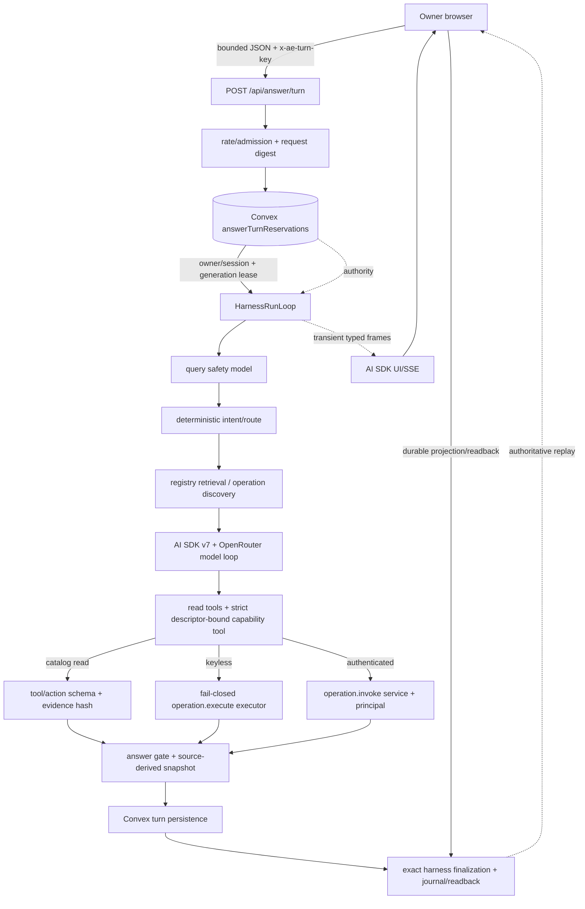
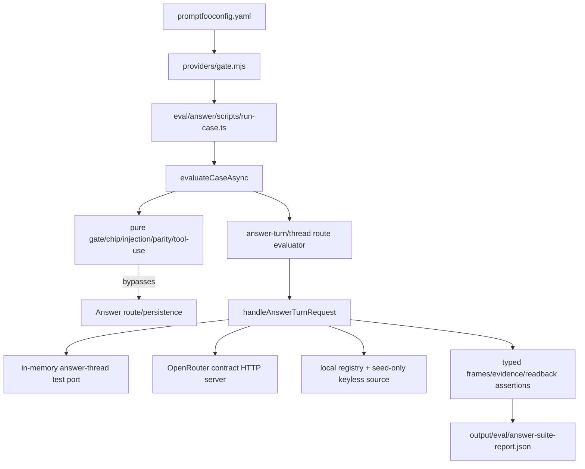

# PROMPT-DATA-FLOW — prompting, data-flow, and AI harness map

**Analysis date: 2026-08-12**

This map covers the current prompt, model, tool, stream, evaluation, and runtime seams in the dirty tree. It is intentionally narrower than the general architecture and information-architecture maps: it follows data and authority from an Answer turn or Customer Request through proposal, execution, evidence, and readback. Current source is the authority; historical map text and absent files are not current callsites.

## Maintenance contract and evidence ceiling

- Convex durable state and deterministic module/kernel seams own identity, validation, authority, dispatch, persistence, budgets, money, settlement, and evidence. Routes, browser code, CLI/MCP adapters, and model providers are projections or observations.
- A model may propose typed semantics, tool inputs, or prose. It cannot create a provider, price, credential, approval, spend authority, route release, cancellation result, output validity, or payment settlement. Provider responses and browser frames are observations until accepted by a durable source-owned seam.
- Evidence classes do not upgrade one another:

| class | establishes | does not establish |
|---|---|---|
| source-integrated | checked-in contracts, guards, bounds, and ownership | that a provider, customer, payment, or hosted deployment actually succeeded |
| config-gated | a path can be enabled when required credentials/configuration exist | that the configuration exists or that a live call was made |
| local fixture | deterministic protocol behavior in test ports, contract servers, or convex-test | hosted Convex, real provider, customer value, payment, or settlement |
| named packet | the fields and outcomes recorded in that packet | a different revision, environment, provider, or stronger proof class |
| hosted/live-certified | only a current revision-bound executed receipt plus durable readback can establish this class | anything not included in that receipt/readback |

- The source register at the end is the claim-to-source index. Credential values, private URLs, prompt secrets, and raw provider payloads are intentionally omitted.
- USE follows Brendan Gregg’s method: inventory resources first, then ask utilization, saturation, and errors separately. `?` means the current source/telemetry does not expose that observation; it is not zero, idle, or healthy. USE supplements latency, workload, correctness, authority, provenance, and security analysis; it does not replace them.

## Functional block diagrams

### Answer turn: reservation-bound model/tool loop

`src/routes/api.answer.turn.ts:36-231` owns bounded request admission, reservation identity, and the UI stream boundary. `src/modules/answer-thread/internal/turn-orchestrator.ts:639-905` owns the lease-bound run and `HarnessRunLoop` phases. `src/modules/answer/internal/answer-tool-use-agent.ts:546-1460` owns model/tool selection and model accounting; `src/modules/answer-thread/internal/tool-runner.ts:29-225` turns read-tool outcomes into buffered evidence. The dotted edges are authority/readback edges, not model claims.

### Customer Request: proposal to executable route and readback

```mermaid
flowchart LR
  U[Browser or authenticated agent] --> N[bounded/authenticated submit]
  N --> V[(Convex V2 submission shell)]
  V --> G[routeable graph: exact contracts + admitted operations + current price/readiness]
  G --> O[registry.operations.search <= 20]
  O --> K[focused descriptor pool]
  K --> L[OpenRouter JSON proposal]
  K --> D[deterministic interpreter/recovery]
  L --> Z[domain/grounding settlement]
  D --> Z
  Z --> C[deterministic compiler + digests]
  C --> W[OCC aggregate/head/route-generation commit]
  W --> PV[inspect-only preview]
  PV --> CF[fresh confirmation]
  CF --> MD[mandate + attenuated step grant]
  MD --> ST[start/resume run]
  ST --> Q[(attempt + dispatch outbox)]
  Q --> WP[Workpool: bounded queue/retry]
  WP --> CL[canonical claim + pre-release checks/fence]
  CL --> X[guarded HTTP/MCP/x402 transport]
  X --> OBS[bounded untrusted observation]
  OBS --> EV[output/evidence validation]
  EV --> T[canonical terminal outcome]
  T --> RB[Convex projection/readback]
  RB --> U
  CF -. only this edge creates effect authority .-> MD
  CL -. release fence before provider effect .-> X
```

`src/modules/customer-request/application/interpret-compile/graph.ts:34-234`, `src/modules/customer-request/application/interpret-compile/discover.ts:9-68`, `src/modules/customer-request/application/interpret-compile/interpreter.ts:41-177`, `src/modules/customer-request/application/interpret-compile/compile.ts` (compile wrapper), and `src/modules/customer-request/compiler.ts:243-441` (active compiler) establish the proposal/compile path. `src/modules/customer-request/application/confirm-route/confirm.ts`, `src/modules/customer-request/route-mandate-admission.ts`, and `src/modules/customer-request/route-execution/machines/start-or-resume.ts` are the authority transitions. `convex/customerRequestRouteExecutionJournalPorts.ts:133-149` schedules; `convex/customerRequestRouteTransportWorker.ts:81-305` claims, fences, transports, and records; `src/modules/customer-request/route-execution/machines/record-outcome.ts` validates readback. Workpool mechanics and provider observations are never execution truth by themselves.

## Flow A — Answer request, route selection, and execution

### A1. Admission, reservation, and route selection

1. The browser posts JSON to `/api/answer/turn`. The route requires `Content-Type: application/json`, bounds the body to 16 KiB, requires a 1–128 character `x-ae-turn-key`, applies rate admission, and computes canonical `requestDigest` and `reservationKey` (`src/routes/api.answer.turn.ts:52-165`; `src/modules/answer-thread/internal/turn-digests.ts`). An `Authorization` header may add an authenticated `OperationInvokeContext`; this does not make the model an authority.
2. `convex/answerThreads.ts:225-418` idempotently creates or replays the owner/session-bound thread reservation. It rejects identity or digest conflicts, denies another session, caps a thread at 25 turns, and uses a 30-second generation-fenced execution lease (`src/modules/answer-thread/answer-thread.schema.ts:65-66`). `renewAnswerTurnLease` checks reservation identity, state, request digest, and generation (`convex/answerThreads.ts:419-470`).
3. `streamAnswerTurn` resumes a valid checkpoint or renews the lease before creating a run. Its phases are context, intent, retrieval, model, gate/assembly, persistence, and report; a finalized/stopped reservation replays durable state instead of recomputing it (`src/modules/answer-thread/internal/turn-orchestrator.ts:639-905`).
4. The context phase calls `classifyAnswerQuerySafety` before lookup, provider search, capability selection, or execution. The classifier is a structured OpenRouter call capped at 8 output tokens, with `maxRetries: 0`; missing key, non-stop completion, or request failure is a typed refusal (`src/modules/answer/internal/answer-query-safety.ts:12-95`). The model request is recorded even for refusal (`turn-orchestrator.ts` context phase).
5. Intent/route selection is deterministic and context-aware. `planAnswerTurn` emits clarification, answer, compare, filter, empty, boundary, unsupported, or error modes; answer search/visible provider budget is 3, compare visible budget is 2, filter visible budget is 3, and the local registry search policy allows one call (`src/modules/answer-thread/internal/answer-response-planner.ts:17-105`). Frozen compare/filter paths do not expose catalogue tools (`src/modules/answer/internal/answer-tool-use-agent.ts:1179-1197`).
6. Retrieval-first uses the read-only registry/source ports before model prose. For specific live-data requests, `resolveKeylessDataAsk` and the registry operation-search tool narrow current admitted operation descriptors; candidates are bounded to four and are rebound from a checkpoint only when candidate, descriptor, selection, tool, and execution-binding digests still match (`src/modules/answer/internal/keyless-data-ask.ts`; `src/modules/answer/internal/answer-tool-use-agent.ts:436-543`).

### A2. Model, tool, and executable capability seams

- The only model provider seam is `openRouterModel` in `src/modules/model-gateway/public.ts:1-139`. It uses the installed AI SDK 7 package (`package.json:70-103`) and OpenRouter, requests usage, enables strict structured output when requested, supports bounded web results, and treats absent provider cost metadata as `undefined`, never as zero. The default model is `deepseek/deepseek-v4-flash`.
- Current Answer model callsites are in `src/modules/answer/internal/answer-tool-use-agent.ts:546-1460`: resumed prose (`generateText` with `Output.object`), normal prose/tool rounds, one schema-repair call, one registry-operation recovery round, one forced selected-capability round, and grounded/final prose. Every call sets `maxRetries: 0`; `recordStep` stores provider/model/stop reason/usage/cost or an explicit unavailable reason. `MAX_ROUNDS=4`, prose output is capped at 1,024 tokens, model-visible tool results at 64 KiB, and the tool queue serializes recorded tool-call ordering (`answer-tool-use-agent.ts:136-139,633-809,882-928,1378-1459`).
- `runToolCall` checks the normalized per-turn `maxToolCalls` before execution and records `budget_exceeded` as a refusal; when the round/budget boundary is reached, the SDK receives one final tool-less prose step rather than an unbounded extra round (`answer-tool-use-agent.ts:715-809,1378-1445`). No global model context-token ceiling is exposed by current source: `?`.
- The model-facing tool object contains the four fixed read IDs (`registry.search`, `registry.detail`, `web.discover`, `registry.operations.search`) plus up to four strict capability tools bound to selected operation descriptors (`src/modules/answer-thread/answer-thread.schema.ts:70-77`; `answer-tool-use-agent.ts:810-828`). `operation.execute` is not a free-form model tool. It is the shared evidence-record executor selected by dynamic per-operation tools; authenticated turns route the same intent through `operation.invoke` with the authenticated principal/service (`answer-tool-use-agent.ts:721-765`; `src/modules/capability-execution/operation-execute.functions.ts`).
- `runAnswerToolCall` resolves only registered read actions, enforces read-only and strict input/output schemas, executes via the harness action-tool seam, and returns a buffered `AnswerToolCallRecord` with input/result summaries and a canonical result hash. Refused, blocked, timeout, transport, and schema errors are evidence records rather than model-uncaught failures (`src/modules/answer-thread/internal/tool-runner.ts:29-155`).
- Keyless operation execution is fail-closed: the descriptor’s public operation reference and strict input are validated, the request is guarded, the response is bounded to 512 KiB and schema-checked, and output is returned with evidence. Invalid response is non-retryable; unreachable transport is retryable; no credential is passed to the model (`src/modules/capability-execution/operation-execute.functions.ts`, `src/modules/capability-execution/operation-execute.actions.ts`). Authenticated operation invocation is a separate service boundary, not a keyless fallback.
- Other current model seams are separate from the Answer turn: optional follow-up chips in `src/modules/answer-thread/internal/llm-follow-up-chips.ts`, Customer Request JSON interpretation in `src/modules/customer-request/openrouter-transport.ts`, and storefront business enrichment in `src/modules/storefront/internal/business-enrichment.ts`. They use the shared gateway or its explicit transport adapter; they do not share Answer reservation/finalization authority.

### A3. Checkpoints, finalization, replay, and evidence

- A tool-bearing intermediate step is checkpointed with replay messages, model requests, tool calls, providers, allowed slugs, operation candidates, selection, and outcome. `serializeAnswerTurnCheckpoint` canonical-digest checks the object, enforces a 256 KiB JSON cap, rejects replay-secret keys (`api_key`, authorization, credential, password, private key, secret, token), and bounds calls/digests/model requests to 16, providers to 25, candidates to 4, and replay messages to 32 (`src/modules/answer-thread/internal/answer-turn-checkpoint.ts:21-75,78-180`; `answer-thread.schema.ts:142-170`).
- Convex checkpoint persistence checks generation, step sequence, parent digest, reservation/request/turn identity, and the 16-step turn cap before writing (`convex/answerThreads.ts:493-600`; `convex/answerThreads.ts:42-46`). A resumed checkpoint is not trusted merely because it parses: operation candidate, descriptor, selection, and execution-binding digests are rebound before tool construction (`answer-tool-use-agent.ts:436-543`).
- The gate and snapshot are built from tool-derived providers/allowed slugs, not model-supplied provider claims. `finalizeAnswerTurnSnapshot` rejects unsupported copy or grounding; `persistAnswerTurnWithResult` freezes evidence, answer-run summary, model/tool timings, operation artifacts, and tool hashes (`src/modules/answer-thread/internal/turn-orchestrator.ts:1199-1428`; `src/modules/answer-thread/internal/answer-turn-finalization.ts:139-287`).
- Harness finalization builds private journal entries and a finalization hash, then calls the source-owned finalizer. `convex/harnessSessions.ts` validates exact reservation, turn, tool-call, evidence, journal, and finalization identity before atomically inserting/settling the turn. A retry may replay an already accepted finalization; it cannot replace it with a different digest (`src/modules/answer-thread/internal/answer-turn-finalization.ts:289-371`; `convex/harnessSessions.ts:483-658`).
- The durable answer/tool/session rows are the replay source. A transient stream frame is never treated as durable completion (`src/modules/answer/answer-ui-stream.ts:29-37`; `src/modules/answer-thread/internal/answer-turn-finalization.ts`).

### A4. SSE/UI and owner readback

- The route emits AI SDK UI data parts named `data-answer-event`; frames are transient and carry `{seq,event}`. The server stops sending after request abort and marks complete/pending/stopped/error as terminal (`src/routes/api.answer.turn.ts:179-230`).
- The SDK owns SSE framing; `readAnswerTurnFrames` validates the Answer payload, requires sequence numbers starting at zero and contiguous, rejects duplicate/late terminal frames, and rejects empty or unterminated streams (`src/modules/answer/answer-ui-stream.ts:29-93`).
- `turn-stream-session.ts` shares a stable client-key session, deduplicates frames by sequence, replays non-thinking frames to late subscribers, and removes completed sessions with no subscribers. Its `frames` array has no source-visible count/byte cap and `writer.write` is not awaited by the route: backpressure/queue depth `?` (`src/components/ae/chat/turn-stream-session.ts:15-125`; `src/routes/api.answer.turn.ts:179-209`).
- `useAnswerTurnLifecycle` fences updates by mount and generation, reads the durable thread projection after terminal/pending/stopped outcomes, retries a retryable/network readback once after 250 ms, and only aborts local transport after a durable Stop acknowledgement (`src/components/ae/chat/use-answer-turn-lifecycle.ts:34-66,155-243,245-305`; `src/components/ae/chat/turn-stream-session.ts:116-125`). The browser is therefore a reducer/readback adapter, not the authority for completion.

## Flow B — Customer Request semantic proposal, compile, and execution

### B1. Input, graph, discovery, and proposal

- Authenticated and guest surfaces are adapters over the same bounded application seam. `src/lib/server/customer-request-api.ts` bounds submit bodies to 32 KiB and applies strict submit/sensitive-input checks; `src/lib/server/customer-request-route-action-api.ts` bounds run/cancel bodies to 4 KiB; `src/lib/server/customer-request-browser-api.ts` and `src/lib/server/customer-request-agent-api.ts` provide guest-cookie or scoped-agent identity and route lifecycle commands. `convex/customerRequestApplication.ts` owns preview admission, shell reservation, interpret/compile, confirmation, run, cancellation, and projections.
- `loadRequestGraph` reads current routeable supply and exact active contracts, then verifies admitted operation/publication/binding identity, readiness, price digests, and registration hashes before constructing descriptors, models, bindings, mappings, and a registry snapshot digest (`src/modules/customer-request/application/interpret-compile/graph.ts:34-193`). Current graph limits include 512,000 descriptor bytes and 256,000 projected input-schema bytes (`convex/customerRequestApplication.ts:71-72`); routeable supply is bounded by the eligibility read (current source limit 256, submit path asks 64, in `src/modules/capability-supply/internal/eligible-supply.ts` and `convex/customerRequestV2.ts`).
- `discoverAndFilterDescriptors` runs deterministic `registry.operations.search` with limit 20 and keeps only graph descriptors whose public operation references were returned. No-match/unavailable discovery falls back to the graph descriptor set; discovery order is preserved and the interpreter never invents a descriptor (`src/modules/customer-request/application/interpret-compile/discover.ts:9-68`).
- `createConfiguredRequestInterpreter` always returns an interpreter. Without an OpenRouter key it is deterministic; with a key it uses a structured JSON model plus deterministic fallback. Domain curation prevents crypto/fiat or other obvious mismatches; model selections are revalidated, ungrounded/no-selection proposals recover through deterministic matching or become typed `needs_information` (`src/modules/customer-request/application/interpret-compile/interpreter.ts:23-177,193-295`). The deterministic interpreter never grabs an arbitrary pool item and caps recovery selections at two (`src/modules/customer-request/application/interpret-compile/deterministic-interpreter.ts`). Geocoding composition is an explicit prior step when the registered mapping supports it.
- The Customer Request OpenRouter adapter uses the shared `openRouterModel` with strict structured output, a 1,000,000-byte request cap, 20-second default attempt timeout, default one retry, and caller-supplied completion/reasoning limits (`src/modules/customer-request/openrouter-transport.ts:22-118`). The configured semantic interpreter bounds descriptor payloads, response bytes to 64,000, and its timeout to 45 seconds (`src/modules/customer-request/application/interpret-compile/interpreter.ts:41-56`). A failed first proposal is retried once; an exhausted model/provider failure becomes deterministic recovery or typed refusal, not a fabricated plan.

### B2. Compile, preview, and authority transition

- `proposeThenCompile` records the proposal/interpreter identity and passes it to `compileProposal`; the compiler checks exact public operation refs, contract models, facts, bindings, graph digests, effects, cancellation, and evidence. It derives actions, dependency mappings, price/maximum-cost posture, route-plan generations, plan/aggregate digests, and never grants execution authority in a proposal (`src/modules/customer-request/application/interpret-compile/interpret.ts:82-130`; `src/modules/customer-request/compiler.ts:299-441`).
- Compiler caps are 64 selections, 128 facts, 256 route plans, and a 700,000-byte aggregate (`src/modules/customer-request/compiler.ts:51-55,428-435`). Rejections are typed (`unsafe_interpretation` or `capability_graph_invalid`); model output cannot bypass them.
- `previewCustomerRequest` truncates customer job/network inputs, loads the graph, runs a two-attempt propose/compile ladder, and returns `needs_information`, `unavailable`, or an inspect-only preview. Preview is capped at 32 steps and 5-minute validity; raw offering refs are bounded to 64 per step (`src/modules/customer-request/application/interpret-compile/preview.ts:24-171`). The customer-safe projection reduces options to three per step and 120 KiB (`src/modules/customer-request/application/consumer-plan-projection.ts`).
- Confirmation checks principal, revision, freshness, route generation, and known-cost posture (`src/modules/customer-request/application/confirm-route/confirm.ts`). Only mandate/grant code creates spend/effect authority: `route-mandate-mutation/issue.ts` persists an authenticated mandate, and `route-mandate-admission.ts` attenuates it per step with exact operation/contract/digest/expiry/cumulative-spend checks. A model proposal or preview cannot run a provider.

### B3. Queue, guarded provider effect, and readback

- `start-or-resume.ts` idempotently creates a run, attempt, and dispatch outbox after active mandate/grant admission. `journalMutationPorts` persists those records and enqueues the action through `customerRequestRouteWorkpool` with a completion callback (`src/modules/customer-request/route-execution/machines/start-or-resume.ts`; `convex/customerRequestRouteExecutionJournalPorts.ts:133-149`).
- The route Workpool owns scheduling mechanics only: `maxParallelism=32`, retries enabled, max three attempts, initial backoff 1,000 ms, exponential base 2 (`convex/customerRequestRouteWorkpool.ts:1-10`). Queue depth, wait time, and slot utilization are not exposed: `?`.
- `customerRequestRouteTransportWorker.run` opens the current dispatch, claims the canonical invocation, checks authority expiry and provider-connection authority, signs the call, prepares the adapter, writes the canonical release fence, marks dispatch, verifies a public target/DNS guard, invokes guarded HTTP/MCP/x402, then persists a canonical terminal outcome and route projection (`convex/customerRequestRouteTransportWorker.ts:81-305`). A release fence precedes provider effect; a provider observation cannot rewrite authority.
- `route-transport-runtime.ts` bounds adapter configuration to 65,536 bytes, request timeout to 100–120,000 ms, response/body and persisted observation fields to 512 KiB, MCP listing to 32 pages/4,096 tools, and x402 payment/challenge fields. It distinguishes succeeded, refused, partial, unknown, released, not-released, and unknown release states; x402 custody can remain reconciliation-required (`src/modules/capability-supply/internal/transport-adapters.ts`; `src/modules/capability-supply/route-transport-runtime.ts:62-126,1134-1213,1378-1380`).
- `record-outcome.ts` validates current attempt/route integrity, output schema, evidence, and dependency/input mapping before advancing or projecting succeeded, partial, failed, unknown, or cancelled. `customerRequestRouteExecution.ts` owns durable dispatch completion, terminal outcome, and x402 custody mutations. Cancellation uses an explicit current-attempt machine and a separate canonical cancellation worker; it is not inferred from a browser abort (`src/modules/customer-request/route-execution/machines/record-outcome.ts`; `src/modules/customer-request/route-execution/machines/cancel-current.ts`; `convex/customerRequestRouteCancellationWorker.ts`).

## Flow C — evaluation, contract servers, and fixture boundaries

- `eval/answer/promptfooconfig.yaml` contains direct gate/chip/injection/parity/tool-use rows and answer-turn/thread rows. `eval/answer/providers/gate.mjs` launches `eval/answer/scripts/run-case.ts`, which forwards variables to `evaluateCaseAsync` (`eval/answer/providers/gate.mjs:1-25`; `eval/answer/scripts/run-case.ts:1-6`).
- Pure modes intentionally bypass the production route and persistence: gate uses `runAnswerGate`, chips use chip validation, parity reads the local registry, and tool-use installs a deterministic model plan while running the real tool agent/gate. They prove only the direct function seam (`eval/answer/lib/evaluators.ts:363-455,1364-1490`).
- Answer-turn/thread cases use `handleAnswerTurnRequest`, an in-memory `AnswerThreadTestStore`, a local registry source, an optional seed-only keyless source, and `startOpenRouterContractServer`. The contract server scripts safety, tool-call, and prose responses; unexpected or unserved requests throw (`eval/answer/lib/evaluators.ts:458-840`; `tests/helpers/answer-thread-test-port.ts`; `tests/helpers/openrouter-contract-server.ts:41-235`; `tests/helpers/registry-local-e2e.ts`; `tests/helpers/keyless-seed-source.ts`). These are deterministic local fixtures, not hosted Convex or real provider evidence.
- The named packet `output/eval/answer-suite-report.json` is an answer-eval v3 report: 13 cases, 15 turns, 19 model requests, 12 tool runs, 1 complete capability-tool record, 1,244 total tokens, and cost-unavailable reasons `price_table_missing` and `provider_metadata_missing` (`output/eval/answer-suite-report.json:1-61`). Those are packet fields only; they do not establish live latency, hosted success, customer value, provider settlement, or payment.
- `eval/answer/lib/cases.ts` is the contract catalog for expected statuses, tool IDs/inputs, evidence, model requests, timing, and capability operation-reference dialects. `eval/answer/lib/suite.ts` aggregates model/tool/timing/usage/cost fields and marks cost unavailable rather than silently using zero (`eval/answer/lib/cases.ts`; `eval/answer/lib/suite.ts:40-250`).

## Current callsite inventory

| seam | current source/symbol | input → output | authority/evidence ceiling |
|---|---|---|---|
| HTTP Answer admission | `src/routes/api.answer.turn.ts:handleAnswerTurnRequest` | bounded JSON/key → reservation + UI stream | route boundary only; Convex reservation owns identity |
| Reservation/lease | `convex/answerThreads.ts:reserveAnswerTurn`, `renewAnswerTurnLease`, `stopAnswerTurn` | session/key/digest → generation-fenced durable state | Convex lifecycle authority |
| Answer orchestration | `src/modules/answer-thread/internal/turn-orchestrator.ts:streamAnswerTurn`, `buildStreamAnswerTurnPhases` | reservation → route/retrieval/model/gate/persist phases | deterministic orchestration; model remains untrusted |
| Query safety | `src/modules/answer/internal/answer-query-safety.ts:classifyAnswerQuerySafety` | query → allow/refuse + model request record | safety decision is typed source input, not provider fact |
| Answer model/tool loop | `src/modules/answer/internal/answer-tool-use-agent.ts:runRealToolUseAgent` | prompt/checkpoint → tool calls + prose + model telemetry | AI SDK/OpenRouter observation; AE owns tool validation/evidence |
| Read tool runner | `src/modules/answer-thread/internal/tool-runner.ts:runAnswerToolCall` | action/input → buffered result hash + provider slugs | action schema/read-only boundary |
| Operation tool boundary | `src/modules/answer/internal/answer-tool-use-agent.ts:runOperationToolCall`; `src/modules/capability-execution/operation-execute.functions.ts:executeOperation` | strict op ref/input → bounded output/error | fail-closed keyless executor; authenticated calls use `operation.invoke` |
| Checkpoint | `src/modules/answer-thread/internal/answer-turn-checkpoint.ts` + `convex/answerThreads.ts` | replay state → canonical bounded checkpoint | digest/generation/secret rejection |
| Finalization | `src/modules/answer-thread/internal/answer-turn-finalization.ts` + `convex/harnessSessions.ts:finalizeReservedAnswerTurn` | frozen evidence/journal → atomic settled turn | durable harness/source-write authority |
| UI stream | `src/modules/answer/answer-ui-stream.ts:readAnswerTurnFrames` | SDK chunks → contiguous typed frames | wire observations; durable readback wins |
| Browser lifecycle | `src/components/ae/chat/turn-stream-session.ts`, `use-answer-turn-lifecycle.ts` | frames/result/stop → reducer + projection | client adapter; no completion authority |
| Customer Request model | `src/modules/customer-request/openrouter-transport.ts:createOpenRouterJsonTransport` | graph/prompt → typed semantic proposal | model proposal only; deterministic fallback/compile gate |
| Customer Request compiler | `src/modules/customer-request/compiler.ts:compileCustomerRequest` | proposal + graph → digested plan/route generation | deterministic contract/price/effect authority |
| Route scheduler | `convex/customerRequestRouteWorkpool.ts`; `convex/customerRequestRouteExecutionJournalPorts.ts:enqueueRouteTransport` | dispatch outbox → retryable action | queue mechanics only |
| Provider worker | `convex/customerRequestRouteTransportWorker.ts:run` | current dispatch → bounded observation + terminal mutation | canonical claim/release/fence + guarded transport |
| Promptfoo/eval bridge | `eval/answer/providers/gate.mjs`, `scripts/run-case.ts`, `lib/evaluators.ts` | vars → direct or route-fixture result | local fixture/packet only |

## Resource-first USE checklist

All rows below are software resources confirmed in current source. Runtime utilization and saturation are not inferred from configured capacity. The packet observation in Flow C is not a hosted metric.

| resource | capacity/bound | utilization observation | saturation observation | errors | current observability | owner/seam |
|---|---|---|---|---|---|---|
| Answer model rounds/output/context | `MAX_ROUNDS=4`; prose `maxOutputTokens=1024`; tool result `64 KiB`; no global context cap (`?`) (`src/modules/answer/internal/answer-tool-use-agent.ts:136-139,1378-1459`) | `?` live model busy time/tokens; named local packet reports 19 requests/1,244 tokens only (`output/eval/answer-suite-report.json:13-27`) | `?` context-window wait/overflow; round cap yields final prose step | ? (no live window/count/rate exposed; local packet reports 19 model requests but no error/recovery/retry counts); taxonomy: `prose_failed`, `tool_unavailable`, `budget_exceeded`; model calls use `maxRetries:0` | `HarnessModelRequestRecord` usage, stop reason, duration, cost/unavailable reason | `openRouterModel` + `runRealToolUseAgent` |
| Query-safety model | structured choice; 8 output tokens; no retry (`src/modules/answer/internal/answer-query-safety.ts:12-61`) | `?` request rate/latency outside packet | `?` provider wait or classifier capacity | ? (no live window/count/rate exposed; no failure/recovery/retry counts); taxonomy: `unsafe_request`, `classifier_unavailable`, `answer_query_safety_unavailable`; no retry | model request record includes status, usage, duration, cost-unavailable reason | `classifyAnswerQuerySafety` |
| Answer tool-call budget | normalized `maxToolCalls`; fixed read tools plus max four capability tools; registry search policy one; model result 64 KiB (`answer-tool-use-agent.ts:633-809`; `answer-thread/internal/answer-response-planner.ts:33-37`) | `?` calls per live turn; packet reports 12 tool runs | `?` queued tool work; serial `toolQueue` is observable only in code | ? (no live window/count/rate exposed; packet reports 12 tool runs, not error/recovery/retry counts); taxonomy: `tool_not_known`, schema/refusal, transport/error, `budget_exceeded` recorded as tool evidence | `AnswerToolCallRecord`, timings, result hash, tool counters | `tool-runner.ts`, `answer-tool-use-agent.ts` |
| Operation catalogue/discovery | registry search default 20/max 50; Answer candidate limit 4; Customer discovery limit 20 (`src/modules/registry/internal/search.ts:42-65`; `answer/answer-schema.ts`; `customer-request/application/interpret-compile/discover.ts:17-67`) | `?` catalog reads and candidate occupancy | `?` page wait, result truncation, or discovery queue | ? (no live window/count/rate exposed; no failed/recovered/retried discovery counts); taxonomy: typed no-match/unavailable/invalid operation; no-match falls back without fabrication | search result ranks and operation candidate digests | registry operation search + `resolveKeylessDataAsk` |
| Answer reservation/lease | request body 16 KiB; key 128; lease 30 s; renewal interval ≤10 s; thread 25 turns (`api.answer.turn.ts:52-99`; `answer-thread.schema.ts:65-66`; `convex/answerThreads.ts:42-46`) | `?` active reservations/lease occupancy | `?` in-progress contention, lease wait, read/write latency | ? (no live window/count/rate exposed; no conflict/recovery/retry counts); taxonomy: identity/digest conflict, `in_progress`, `thread_turn_limit`, generation/stopped/settled conflict | Convex reservation state, generation, updatedAt, typed result | `convex/answerThreads.ts` |
| Checkpoint/replay persistence | JSON 256 KiB; max 16 tool calls/digests/model requests, 25 providers, 32 messages, 4 candidates, 16 steps (`answer-turn-checkpoint.ts:21-29`; `convex/answerThreads.ts:42-46`) | `?` bytes/rows written per turn | `?` write contention/read wait; no queue-depth metric | ? (no live window/count/rate exposed; no failed/recovered/retried persistence counts); taxonomy: checkpoint shape/digest/secret/parent/generation conflicts | checkpoint digest, step, generation, canonical replay validation | `answer-turn-checkpoint.ts` + Convex checkpoint mutations |
| Final turn/harness journal persistence | Convex fields are bounded by validators but no final-turn byte cap is exposed (`?`); finalization/tool identity digests required (`answer-turn-finalization.ts`; `src/modules/harness/internal/convex-schema.ts`) | `?` bytes/rows and transaction time | `?` transaction contention or journal backlog | ? (no live window/count/rate exposed; no failed/recovered/retried finalization counts); taxonomy: source-write failure, identity mismatch, replay/conflict, stopped | persisted turn/evidence/tool rows and harness report; packet/fixture only unless hosted readback | `convex/harnessSessions.ts:finalizeReservedAnswerTurn` |
| SSE/UI stream and client buffer | Answer request 16 KiB; contiguous seq/terminal required; client `frames[]` has no count/byte cap (`answer-ui-stream.ts:60-93`; `turn-stream-session.ts:15-25`) | `?` bytes/sec, frames/sec, active subscribers | `?` backpressure/blocked writer; route does not await `writer.write` | ? (no live window/count/rate exposed; no failed/recovered/retried stream counts); taxonomy: malformed/empty/missing terminal, abort, transport problem | parser errors, seq, terminal event, client session result | AI SDK UI stream + `turn-stream-session.ts` |
| Harness phase/tool scheduler | optional run/tool timeout; shared tools can run concurrently, exclusive tools wait behind shared work; no default timeout/queue cap (`src/modules/harness/run-loop.ts:33-46,300-333,543-598`) | `?` phase/tool occupancy and concurrency | `?` waiting shared/exclusive tasks | ? (no live window/count/rate exposed; no failed/recovered/retried scheduler counts); taxonomy: aborted, timeout, refused/blocked/error/failed tool statuses | runtime events, phase/tool durations, collector counters | `HarnessRunLoop` + `run-collector.ts` |
| Customer Request model payload/completion | request 1,000,000 bytes; default attempt timeout 20 s; default retry 1; configured interpreter timeout 45 s/response 64 KiB (`openrouter-transport.ts:22-118`; `interpreter.ts:41-56`) | `?` live request/token rate; no hosted observation | `?` provider wait/retry occupancy | ? (no live window/count/rate exposed; configured retry=1 is a bound, not an observed count; failed/recovered/retried attempts unobserved); taxonomy: typed timeout, provider 4xx/5xx/unavailable, invalid/no-content/length | proposal interpreter ID, retry/failure code, model output schema validation | `createOpenRouterJsonTransport` + configured interpreter |
| Customer Request graph/compiler/preview | graph descriptor 512 KiB/schema 256 KiB; selections 64/facts 128/routes 256/aggregate 700 KiB; preview 32 steps/64 raw refs/5 min (`customerRequestApplication.ts:71-72`; `src/modules/customer-request/compiler.ts:51-55`; `preview.ts:141-171`) | `?` graph bytes/actions/route generation occupancy | `?` graph read/compile wait or option truncation pressure | ? (no live window/count/rate exposed; two-attempt proposal/compile ladder is a bound, not an observed error/recovery count); taxonomy: graph unreadable, unsafe interpretation, graph invalid, preview unavailable/options changed | digests, typed refusal, preview expiry; no live workload counters | graph/interpret/compile/preview modules |
| Customer Request Workpool queue | `maxParallelism=32`, retry max 3, backoff 1 s base 2 (`convex/customerRequestRouteWorkpool.ts:5-10`) | `?` active slots/actions; configuration is not utilization | `?` queue depth/wait time/retry backlog | ? (no live window/count/rate exposed; retry max 3 is a bound, not an observed count; failed/recovered/retried actions unobserved); taxonomy: action failed after retry, completion callback/refusal paths | Workpool dispatch state/work ID and journal callback | `customerRequestRouteExecutionJournalPorts.ts` + Workpool |
| Provider HTTP/MCP/x402 transport | adapter config 65,536 bytes; request timeout 100–120,000 ms; body/response/observation 512 KiB; MCP 32 pages/4,096 tools (`route-transport-runtime.ts:62-126`; `transport-adapters.ts`) | `?` provider request occupancy/bytes | `?` provider connection wait or guarded-fetch queue | ? (no live window/count/rate exposed; failed/recovered/retried transport counts unobserved); taxonomy: timeout, unreachable, 4xx/5xx, redirect, invalid/oversize response, credential/payment/refusal, unknown | bounded `RouteTransportObservation`, disposition/release states, request/response digests | `route-transport-runtime.ts` + Node transport worker |
| Keyless operation executor | response cap 512 KiB; descriptor request timeout; manual redirects/guarded public target (`operation-execute.functions.ts`; `route-transport-runtime.ts`) | `?` executed calls/bytes in live host; packet has 1 capability record | `?` credential/transport wait; no queue metric | ? (no live window/count/rate exposed; packet reports 1 capability record, not error/recovery/retry counts); taxonomy: `response_invalid`, retryable `fetch_failed`, fail-closed schema/target refusal | `OperationExecuteResult` and evidence hash; no provider/customer proof without receipt | `executeOperation` / operation tool call |
| Readiness probes | refresh lead 90 s; batch 20; bounded timeout/512 KiB response (`convex/capabilitySupply.ts`; `src/modules/capability-supply/internal/readiness-probe.ts`) | `?` probes per interval and provider busy time | `?` batch backlog/slot pressure; no probe retry counter | ? (no live window/count/rate exposed; refresh/batch bounds are not observations; failed/recovered/retried probe counts unobserved); taxonomy: credential unavailable/rejected, unreachable, 4xx/5xx, redirect, invalid/too-large | readiness status, validity, failure code, digest; hosted current counts `?` | capability supply readiness seam |
| HTTP/rate admission | token buckets: public-read 120/min, public-mutation 5/min, OAuth 5/min, Answer submit 30/hour, chips 60/hour, stream 30/hour, inquiry 5/min, dispute 3/min; agent access ≤300/hour/60/min (`convex/lib/rateLimit.ts:20-72`) | `?` bucket consumption by principal | `?` rejection pressure/queue wait | ? (no live window/count/rate exposed; bucket limits and `retryAfter` are bounds/state, not aggregate counts; rejected/recovered/retried request counts unobserved); taxonomy: typed rate-limited responses with retry-after | bucket state/retryAfter per admission; no aggregate live dashboard | Convex rate limiter + `src/lib/server/rate-limit.ts` |
| Spend/credential/lease authority | durable policy has per-invocation/daily/monthly/concurrent spend and call limits; provider lease ≤30 s and refuses <100 ms remaining (`src/modules/agent-access/internal/convex-schema.ts:14-24`; capability invocation worker) | `?` spend/credit/concurrent invocation utilization | `?` credit or concurrency saturation in hosted runtime | ? (no live window/count/rate exposed; durable caps and lease are bounds, not aggregate counts; failed/recovered/retried invocation counts unobserved); taxonomy: insufficient credit, outcome_unknown, credential unavailable/rejected, reconciliation_required | exact money/price digest/charge state and authority expiry in durable rows; no live totals | agent-access, money, operation-invocation, route mandate seams |

## Invariants, reachable gaps, and proof ceilings

### Current invariants

1. Reservation keys, request digests, generation leases, checkpoint digests, finalization hashes, and tool result hashes make Answer retries/replays identity-bound (`src/modules/answer-thread/internal/turn-digests.ts`; `convex/answerThreads.ts`; `answer-turn-finalization.ts`).
2. Answer providers/allowed slugs are extracted from validated tool results; prose is gated against frozen source evidence (`src/modules/answer-thread/internal/tool-runner.ts`; `src/modules/answer/internal/catalog-grounding.ts`; `src/modules/answer-thread/internal/turn-orchestrator.ts`).
3. The model can select among surfaced operations but cannot introduce an operation, free-form executable schema, provider credential, price, or effect. Dynamic capability tools bind exact admitted descriptor schemas; authenticated operation invocation is explicit (`answer-tool-use-agent.ts`; `operation-execute.functions.ts`).
4. Customer Request model/deterministic proposals are narrowed to current routeable graph descriptors and must pass exact compiler, price, effect, cancellation, evidence, size, and digest checks. Preview is inspect-only; confirmation and mandate/grant are the effect-authority transition (`graph.ts`; `src/modules/customer-request/compiler.ts`; `confirm-route`; `route-mandate-admission.ts`).
5. Workpool/SDK/browser scheduling only moves work or observations. Canonical Convex claim/release/terminal fences, output validation, and readback own executable outcome (`customerRequestRouteWorkpool.ts`; `customerRequestRouteTransportWorker.ts`; `record-outcome.ts`).
6. Source, fixture, packet, and hosted evidence are separate trust domains. The local eval packet’s pass/latency/token/cost fields remain a named packet, not a hosted/provider/customer/payment claim.

### Reachable gaps and unknowns

- Current source does not expose live utilization, saturation, queue depth, backpressure, active lease occupancy, model context-window usage, provider busy time, readiness batch pressure, or spend/credit/concurrency totals: `?` for each in the USE table.
- The browser frame cache has no source-visible size bound, and the route does not await `writer.write`; parser correctness is covered, but backpressure behavior under load is not measured (`turn-stream-session.ts`; `api.answer.turn.ts`).
- OpenRouter cost metadata can be absent and is explicitly reported unavailable. The named packet has both `price_table_missing` and `provider_metadata_missing`; neither is evidence of zero cost (`model-gateway/public.ts`; `output/eval/answer-suite-report.json`).
- Source shape and local fixtures do not prove a current hosted Convex transaction, real provider response, customer value, payment submission/settlement, or reconciliation receipt. Those remain `?` until a current revision-bound executed packet and durable readback are named.
- Historical/absent paths are intentionally not mapped as current authority. In particular, references to removed seed-supply/feed/run files or old W-stage narratives are not evidence of a live seam.

## Primary source register

- `src/routes/api.answer.turn.ts` — Answer HTTP admission, body/key limits, reservation handoff, AI SDK stream.
- `src/modules/answer-thread/internal/turn-orchestrator.ts` — reservation-bound phases, route selection, retrieval, gate, persistence, finalization recovery.
- `convex/answerThreads.ts` — durable Answer reservations, lease/generation, checkpoint and thread-turn bounds.
- `src/modules/answer-thread/answer-thread.schema.ts` — Answer tool IDs, checkpoint shape, lease constant, turn records.
- `src/modules/answer/internal/answer-query-safety.ts` — pre-lookup structured safety model call and typed refusal.
- `src/modules/answer/internal/answer-tool-use-agent.ts` — AI SDK tool loop, recovery, dynamic operation tools, budgets, accounting.
- `src/modules/answer/internal/keyless-data-ask.ts` — operation candidate resolution/rebinding and clarification.
- `src/modules/answer-thread/internal/tool-runner.ts` — action schema/transport execution, result hashing, buffered tool evidence.
- `src/modules/answer-thread/internal/answer-turn-checkpoint.ts` — canonical checkpoint validation, size/secret/replay caps.
- `src/modules/answer-thread/internal/answer-turn-finalization.ts` — frozen evidence, journal and finalization digest construction.
- `convex/harnessSessions.ts` — source-owned finalization identity/replay checks and durable writes.
- `src/modules/model-gateway/public.ts` — sole OpenRouter/AI SDK model seam and cost-unknown semantics.
- `src/modules/answer/answer-ui-stream.ts` — typed transient frame protocol and SSE sequence/terminal validation.
- `src/components/ae/chat/turn-stream-session.ts` and `use-answer-turn-lifecycle.ts` — shared browser stream, generation fences, stop/readback convergence.
- `src/modules/customer-request/application/interpret-compile/graph.ts`, `discover.ts`, `interpreter.ts`, `interpret.ts` — current graph, discovery, model/deterministic proposal, and compile orchestration.
- `src/modules/customer-request/compiler.ts` — deterministic plan/action/route derivation and hard compiler caps.
- `src/modules/customer-request/application/interpret-compile/preview.ts` and `consumer-plan-projection.ts` — inspect-only preview and customer-safe projection limits.
- `src/modules/customer-request/openrouter-transport.ts` — structured Customer Request model transport caps and typed failures.
- `src/modules/customer-request/application/confirm-route/confirm.ts`, `route-mandate-admission.ts`, `route-execution/machines/start-or-resume.ts` — authority transition from preview to grant/run.
- `convex/customerRequestRouteWorkpool.ts`, `customerRequestRouteExecutionJournalPorts.ts` — queue/retry and durable dispatch outbox.
- `convex/customerRequestRouteTransportWorker.ts` and `src/modules/capability-supply/route-transport-runtime.ts` — canonical claim/fence, guarded provider transport, bounded observations and payment branches.
- `src/modules/customer-request/route-execution/machines/record-outcome.ts` — output/evidence validation and deterministic outcome transitions.
- `eval/answer/promptfooconfig.yaml`, `providers/gate.mjs`, `scripts/run-case.ts`, `lib/evaluators.ts`, `lib/cases.ts`, `lib/suite.ts` — eval dispatch, fixture/route distinction, and report aggregation.
- `tests/helpers/openrouter-contract-server.ts`, `answer-thread-test-port.ts`, `registry-local-e2e.ts`, `keyless-seed-source.ts` — deterministic model/persistence/registry/capability fixtures.
- `output/eval/answer-suite-report.json` — named local answer-eval v3 packet; packet evidence only.
- `src/modules/harness/run-loop.ts`, `run-collector.ts`, and `src/modules/agent-access/internal/convex-schema.ts` — runtime guards/telemetry and durable budget policy fields.
- `src/modules/capability-execution/operation-execute.functions.ts` and `src/modules/capability-supply/internal/readiness-probe.ts` — executable keyless boundary and readiness error taxonomy.

The map is complete only at the source/fixture/packet ceiling above. Live utilization, saturation, hosted/provider/customer/payment outcomes, and any stronger proof class remain `?` until their named observation and readback seams are available.
