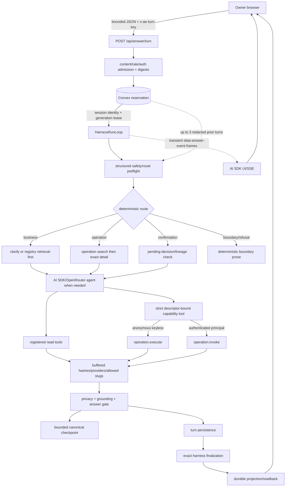
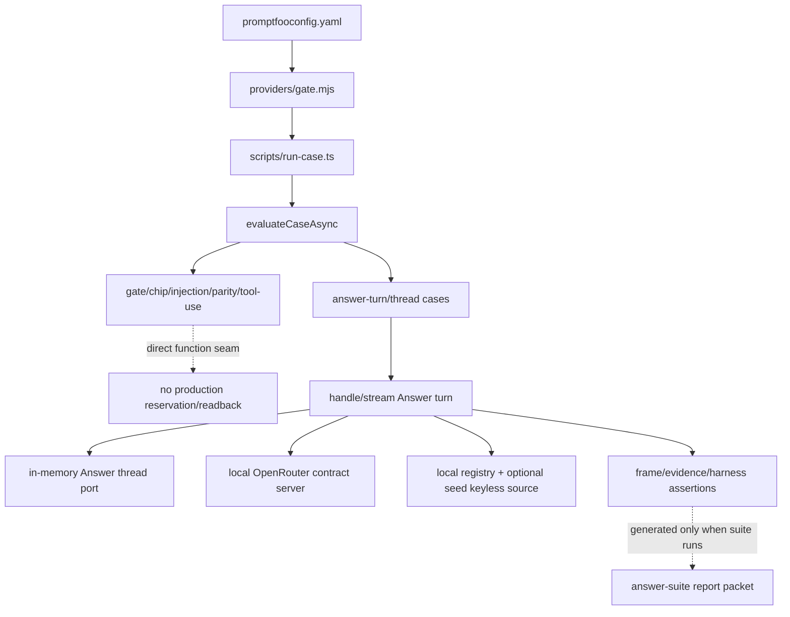

# PROMPT-DATA-FLOW — prompting, data-flow, and AI harness map

**Analysis date: 2026-08-15**

This is the narrow current-tree map of prompt, model, tool, stream, evaluation, and runtime seams. It follows an Answer turn or Customer Request from admission through proposal, deterministic validation, execution, evidence, persistence, and readback. It includes uncommitted source changes. It does not map the whole architecture or information architecture.

## Maintenance contract and evidence ceiling

- Current source is authoritative. Re-check every named symbol, bound, model, and package version when refreshing this document; do not carry forward an absent file, generated report, or historical campaign claim.
- Convex durable state and deterministic module/kernel seams own identity, admission, validation, authority, dispatch, budgets, money, settlement, evidence, and readback. Routes, models, SDKs, workers, browsers, CLI/MCP adapters, and provider responses are adapters or observations.
- A model may propose safety/route semantics, candidate selection, strict tool input, or prose. It cannot create a provider, contract, price, credential, approval, spend authority, route release, cancellation result, output validity, payment settlement, or durable completion.
- Provider output is untrusted until the appropriate contract/output/evidence seam validates and persists it. Stream frames are transient and never outrank durable readback.
- Evidence classes do not upgrade one another:

| class | establishes | does not establish |
|---|---|---|
| source-integrated | checked-in contracts, guards, bounds, and ownership | that a hosted deployment or provider call succeeded |
| config-gated | a path can run when named configuration/credentials exist | that configuration exists or a live call occurred |
| local fixture | deterministic behavior through test ports, local contract servers, or convex-test | hosted Convex, real provider, customer value, payment, or settlement |
| named packet | only the fields/outcomes in an identified generated packet | another revision, environment, provider, or stronger evidence class |
| hosted-live-certified | a current revision-bound executed receipt plus durable readback | anything outside that receipt/readback |

- No current `output/eval/answer-suite-report.json` exists in this tree. Therefore this refresh names no Answer suite packet counts. Source-defined cases are source-integrated; a future generated report becomes a named packet only when it exists and is identified.
- USE follows Brendan Gregg’s resource-first method: inventory each resource, then ask utilization, saturation, and errors separately. `?` means unobserved in current source/telemetry, not zero, idle, healthy, or unlimited.
- Credential values, private URLs, prompt secrets, raw provider payloads, and raw private harness payloads are intentionally omitted.

## Functional block diagrams

### Answer turn: reservation-bound model/tool/evidence loop

`src/routes/api.answer.turn.ts` owns the HTTP/UI-stream boundary. `src/modules/answer-thread/internal/turn-orchestrator.ts` owns lease-bound phases and route dispatch. `src/modules/answer/internal/answer-query-safety.ts` proposes the structured route; host logic and turn paths enforce it. `src/modules/answer/internal/answer-tool-use-agent.ts` stages navigation and capability calls. `src/modules/answer-thread/internal/tool-runner.ts`, `internal/answer-turn-checkpoint.ts`, `internal/answer-turn-finalization.ts`, and Convex source writes own evidence and replay.

### Customer Request: proposal to guarded route execution

```mermaid
flowchart LR
  U[Browser or authenticated agent] --> S[bounded/authenticated submit]
  S --> SH[(Convex V2 shell/revision)]
  SH --> G[routeable graph + exact contracts + price/readiness]
  G --> DS[registry operation discovery <= 20]
  DS --> POOL[grounded descriptor pool]
  POOL --> LM[OpenRouter JSON proposal]
  POOL --> DI[deterministic interpreter/recovery]
  LM --> SET[domain + grounding settlement]
  DI --> SET
  SET --> CO[deterministic compiler + digests]
  CO --> OCC[OCC aggregate/head/generation commit]
  OCC --> PV[inspect-only preview]
  PV --> CF[fresh confirmation]
  CF --> MD[mandate + attenuated step grant]
  MD --> SR[start/resume]
  SR --> Q[(attempt + dispatch outbox)]
  Q --> WP[Workpool delay/retry]
  WP --> CL[canonical claim]
  CL --> PR[pre-release checks + release fence]
  PR --> TX[guarded HTTP/MCP/x402]
  TX --> OBS[bounded untrusted observation]
  OBS --> VO[output/evidence validation]
  VO --> OUT[canonical terminal state]
  OUT --> RB[Convex projection/readback]
  RB --> U
  CF -. only this transition creates effect authority .-> MD
  PR -. fence precedes provider effect .-> TX
```

The semantic model never receives route authority. `src/modules/customer-request/application/interpret-compile/*` narrows and compiles proposals; `application/confirm-route/confirm.ts`, mandate code, and `route-execution/machines/start-or-resume.ts` create authority and durable work. `convex/customerRequestRouteTransportWorker.ts` claims, fences, invokes, and records. `record-outcome.ts` accepts only bounded observations consistent with current attempts and contract validation.

## Flow A — Answer request, route selection, and execution

### A1. Admission, reservation, lease, and route

1. `handleAnswerTurnRequest` requires JSON, bounds the request body to 16 KiB, requires a trimmed `x-ae-turn-key` of 1–128 characters, applies `answer-turn-submit` admission, and resolves a pseudonymous session (`src/routes/api.answer.turn.ts:52-131`).
2. An `Authorization` header optionally creates an authenticated `AnswerOperationInvokeContext`. This selects the controlled `operation.invoke` service later; authentication is caller identity, not provider/effect authority.
3. The route computes a canonical request digest and a session/thread-scope/client-key reservation key, then calls the source-write-backed reservation seam (`src/routes/api.answer.turn.ts:134-168`; `src/modules/answer-thread/internal/turn-digests.ts`).
4. `convex/answerThreads.ts:235-428` idempotently creates, replays, or takes over a reservation. It checks session/thread scope and request digest, denies foreign sessions, caps threads at 25 turns, and uses a 30-second generation-fenced lease. A live reserved row returns `in_progress`; an expired row increments generation and migrates only a valid checkpoint.
5. Lease renewal validates reservation/session/thread/turn/request/generation identity. The orchestrator renews at at most one-third of the 30-second lease and stops heartbeat at the persistence handoff (`turn-orchestrator.ts:137-140,2170-2239,1781-1785`).
6. Before registry/provider work, `classifyAnswerRequestPreflight` asks OpenRouter for strict `{safety, interpretation}`. Interpretation contains route `business | operation | confirmation | boundary`, 1–4 ordered unique `requestedIntents`, continuation `new | refine_prior_operation | resolve_pending`, and effect policy `run_when_ready | candidate_only` (`answer-schema.ts`). `candidate_only` is the structured form of a search-only request: `resolveEffectiveAnswerRoute` turns it into `effectAllowed: false`, which keeps operation reads available and stops the agent at a reviewable candidate.
7. The preflight uses strict structured output, `temperature: 0`, `maxOutputTokens: 256`, `maxRetries: 0`, and up to three redacted prior turns. Missing credentials or provider/schema failure becomes typed `classifier_unavailable`; unsafe requests become `unsafe_request`. Both fail into deterministic safety copy, not permissive routing.
8. Host routing remains deterministic. Business requests can clarify, take a direct registry retrieval path, reuse frozen providers, or invoke the agent. Operation requests stage operation search and exact detail. Confirmation without a bound pending decision clarifies. Boundary/refusal uses deterministic prose (`turn-orchestrator.ts:1173-1683`; `turns/boundary.ts`).
9. `answer-response-planner.ts` owns business clarification and provider/artifact budgets: the search/visible provider limit is three; broad service-less or first-turn location-less queries clarify before search. This planner does not authorize operation execution.

### A2. Model, navigation, tool, and capability seams

- The shared provider seam is `openRouterModel` in `src/modules/model-gateway/public.ts`. The installed versions are AI SDK `^7.0.44`, `@openrouter/ai-sdk-provider ^3.0.0`, Convex `1.42.0`, and Workpool `^0.4.9` (`package.json:78-107`).
- The Answer default model is `deepseek/deepseek-v4-flash`, overridable by deployment configuration. The gateway requests usage, permits provider fallbacks, supports strict structured output/reasoning/web options, installs tool-input-example middleware, and treats missing provider cost metadata as unavailable, never zero.
- The Customer Request model is separate: when configured, it defaults to `openai/gpt-5-mini`, low reasoning, and a 4,096-token completion budget (`customer-request/application/interpret-compile/interpreter.ts:31-56`). Do not conflate it with the Answer default.
- Answer prose and structured agent outputs are capped at 1,024 output tokens with `maxRetries: 0`. Model-visible operation results are capped at 64 KiB. Current source exposes no global context-token cap: `?`.
- `ANSWER_AGENT_MAX_TOOL_CALLS=4` bounds navigation/read attempts; `MAX_EFFECT_CALLS=1` independently bounds provider effects. Navigation uses an SDK step stop of five (`4 + 1`) and the general loop defers its four-step/budget stop once for one final tool-less structured prose step. The old `MAX_ROUNDS` symbol no longer exists; the real bounds are the constants and stop conditions in `answer-tool-use-agent.ts:151-155,1451-1574,1903-1964`.
- Operation routing cannot terminate at unsupported catalogue prose when an executable live result was requested. The host forces `registry.operations.search`, then exact `registry.operations.detail`; compare/inspect-plan are optional reads. A single detailed routeable candidate can be deterministically promoted to a call under the single-intent/effect checks.
- Fixed read tools come from `answer-tool-registry.ts`. `runAnswerToolCall` rejects unknown or non-read actions, requires strict input/output schemas, runs through the harness, and returns buffered input/result JSON, status, summaries, providers, allowed slugs, timings, and canonical result hash. Tool failure is recorded rather than trusted as prose.
- Capability tools are generated per admitted descriptor. The closure binds the operation reference; the model supplies only the published strict input object. Input examples are sanitized and illustrative. A single bounded repair model call may repair malformed input only from the user request/prior values; it may not invent defaults, change tools, or widen schema.
- `contract-input-binding.ts` resolves user-facing missing-input labels from current contract customer annotations. It is presentation metadata only; strict descriptor schema validation remains authoritative.
- Multi-intent execution is allowed only when one selected native contract input covers every ordered requested result. Otherwise the model/tool seam narrows or asks for information; it cannot silently drop intents or hide a second effect.
- Anonymous calls use the fail-closed `operation.execute` path. It rereads the current descriptor, accepts only eligible keyless read operations, validates input, guards the public target, performs one HTTP JSON request, bounds the response to 512 KiB, validates status/content type/JSON/output schema, and returns typed evidence (`operation-execute.functions.ts`).
- Authenticated calls use `operation.invoke`, not keyless fallback. The answer runtime derives an idempotency key from reservation key, turn ID, and persisted effect ordinal; the invocation service applies principal, policy, connection, spend, approval, and recovery state (`answer-tool-use-agent.ts:1994-2117`; `capability-execution/operation-invoke.ts`).
- `operation-result-presentation.ts` now applies a server-side privacy decision before model, stream, or durable projection: recursively forbidden secret-like keys replace the result with an opaque `unsafe_output` failure and hashes. Public presentation resolves only declared JSON pointers, emits only validated credential-free HTTPS links, and neutralizes bidi/control hazards.
- Capability self-description helper was removed 2026-08-15 (orphan
  `answer-thread/internal/self-description.ts`); Answer surface copy remains
  owned by synthesizer/boundary prose paths.

### A3. Checkpoint, finalization, evidence, and replay

- Tool-bearing intermediate work is checkpointed after SDK steps. The checkpoint carries query/route/interpretation/requested intents, continuation/pending lineage, replay messages, model requests, tool calls, prior providers/slugs, operation candidates/comparison/plan/selection/outcome, selected tool/input/binding digests, and step lineage.
- `serializeAnswerTurnCheckpoint` shape-checks and canonical-digests JSON, rejects replay-secret keys, and caps the document at 256 KiB. Caps include 16 tool calls, 16 tool digests, 16 model requests, 25 providers, 32 replay messages, four operation candidates, and 16 persisted checkpoint steps (`answer-turn-checkpoint.ts:28-34`; `convex/answerThreads.ts:52-55,485-508`).
- Persistence requires exact reservation/request/thread/turn/generation identity, monotonic step ordinal, and parent digest. Lease takeover rewrites only the generation of a valid checkpoint; malformed or partial checkpoint fields conflict.
- Continuation is fail-closed. `refine_prior_operation`/`resolve_pending` requires current exact rebinding of candidate-set, descriptor material, selection, execution binding, selected input, origin turn/generation, terminal checkpoint, and pending decision. Readiness timestamps alone are excluded from operation material drift; contract, authority, commercial, data-use, effect, and binding changes are material (`keyless-data-ask.ts`; `operation-artifacts.ts`).
- Stable external-effect identity uses reservation identity plus persisted effect ordinal, not lease generation. A takeover therefore reuses the same effect key. Persisted tool evidence lets recovery produce prose without repeating a completed effect.
- `finalizeAnswerTurnSnapshot` and the answer gate derive providers/allowed slugs from tool evidence, reject overclaim/grounding failures, and preserve operation artifacts. A model claim cannot add provider evidence.
- Persistence freezes the turn, tool calls, interpretation, pending decision, selected-input digest, evidence JSON, snapshot hash, prose/artifacts, work log, model accounting, and final gate.
- `answer-turn-finalization.ts` builds private journal entries, evidence envelopes, answer/finalization digests, and calls the source-owned finalizer. Exact reservation, generation, turn, tool-call, journal, answer, and finalization identity are checked before atomic durable settlement. Replay must match.
- The report phase explicitly retries ambiguous source writes and exact finalized replays, but converts unresolved finalization failure to a durable error path. A stop/generation conflict wins over late completion (`turn-orchestrator.ts:1781-2044`).

### A4. SSE, browser lifecycle, and durable readback

- The route emits transient AI SDK data parts named `data-answer-event`, carrying `{seq,event}`. Terminal events are `complete`, `pending`, `stopped`, or `error`; request abort suppresses further writes (`api.answer.turn.ts:182-253`).
- `readAnswerTurnFrames` delegates SSE framing to the AI SDK parser, ignores unrelated SDK lifecycle chunks, and requires AE frames to start at sequence zero, remain contiguous, contain one terminal, and reject empty/late/malformed streams (`answer-ui-stream.ts:29-93`).
- `turn-stream-session.ts` shares one client-key stream, de-duplicates by sequence, replays non-thinking frames to late subscribers, and removes settled sessions with no subscribers.
- The session’s `frames[]` has no source-visible count/byte cap. The route’s `writer.write` is synchronous/not awaited. Stream backpressure, active subscriber count, and browser buffer saturation remain `?`.
- `useAnswerTurnLifecycle` fences callbacks by mount/generation, converges terminal/pending/stopped transport outcomes through durable thread projection, retries one retryable/network readback after 250 ms, and aborts local transport only after a durable Stop acknowledgement.
- Browser reducer state and streamed “complete” are observations. The durable owner projection is the replay/completion authority.

## Flow B — Customer Request proposal, compile, mandate, and execution

### B1. Submission, graph, discovery, and semantic proposal

- Browser and agent surfaces converge on bounded authenticated application seams; Convex application code owns shell reservation, revision/OCC, interpretation/compile, preview, confirmation, run/cancel, and projections.
- `loadRequestGraph` reads current routeable supply, admitted publications, mappings, exact active contracts, readiness, and fixed price posture. It checks operation/publication/binding/registration identities and derives models, descriptors, bindings, mappings, and a registry snapshot digest (`graph.ts:45-232`).
- Current graph caps are 512,000 descriptor bytes and 256,000 projected input-schema bytes. The submit graph reader asks for at most 64 routeable supplies and 128 mappings (`convex/customerRequestApplication.ts:71-72,1789-1799`).
- `discoverAndFilterDescriptors` calls deterministic registry operation search with limit 20 and retains only descriptors returned from the graph. No-match/unavailable discovery falls back to graph descriptors; the interpreter still cannot invent a descriptor.
- Without a configured OpenRouter key, `createConfiguredRequestInterpreter` is deterministic. With a key, the model proposes first and deterministic recovery catches exhausted provider failures.
- Before model selection, routeability and declared domain guards remove obvious crypto/fiat mismatches and non-executable observations. Model-selected references are re-grounded against the curated pool and deterministic matching. Zero/ungrounded selections become deterministic recovery or typed `needs_intent_direction`, never an arbitrary pool item.
- The model adapter uses strict `Output.object`, a 1,000,000-byte request cap, default 20-second provider attempt timeout, default one SDK retry, and caller-supplied output limit. The configured interpreter adds a 45-second outer timeout, 64,000-byte response cap, and graph descriptor cap (`openrouter-transport.ts:32-118`; `interpreter.ts:34-57`).
- Submission performs up to two proposal/compile attempts. The first provider or retryable compile-admission failure can retry once; final provider failure degrades to deterministic recovery. Configuration bounds are not observed retry counts.
- Geocode-before-destination composition is explicit and only uses registered descriptors/mappings. Deterministic recovery asserts no invented facts.

### B2. Compile, preview, confirmation, and authority

- `proposeThenCompile` stamps the interpreter leg that actually answered and passes proposal plus whole graph to `compileProposal`. The compiler validates exact operation refs, contracts, facts, effects, evidence, cancellation, mappings, price/maximum-cost posture, and graph digests.
- Compiler caps are 64 selections, 128 facts, 256 route plans, and a 700,000-byte aggregate (`compiler.ts:51-54`). Typed failures are `unsafe_interpretation` or `capability_graph_invalid`.
- Compile derives actions, dependency mappings, route-plan generation, aggregate/route digests, recovery posture, and OCC commit material. A proposal has no execution authority.
- Preview is inspect-only, capped at 32 steps and 64 raw options with five-minute validity; customer-safe projection caps options to three per step and 120,000 bytes (`interpret-compile/preview.ts`; `consumer-plan-projection.ts`).
- Confirmation reloads current ownership/revision/generation, requires a selectable fresh route and known maximum total cost, and issues an idempotent mandate bounded by the displayed route validity and maximum spend (`confirm-route/confirm.ts:11-73`).
- Only mandate issuance and `route-mandate-admission.ts` create/attenuate effect authority. Per-step grants bind request, route, operation, exact contract, digest, expiry, spend, data scope, effects, evidence, cancellation, and recovery posture.

### B3. Dispatch, Workpool, release fence, transport, and readback

- `startOrResume` verifies principal/idempotency identity and active mandate, replays exact commands, rejects leased/dispatched/unknown conflicting runs, materializes first-step input through the exact decision model, admits the step grant, and atomically creates run/head/attempt/dispatch records (`start-or-resume.ts`).
- New dispatches wait through a 5-second pre-release cancellation window. The Workpool owns scheduling only: `maxParallelism=32`, retries enabled, maximum three attempts, initial backoff 1,000 ms, exponential base two (`customerRequestRouteWorkpool.ts`).
- Queue depth, wait distribution, active slots, retry backlog, and Workpool utilization are not exposed in current source: `?`.
- The Node worker opens current dispatch, claims the canonical invocation, checks authority expiry/provider-connection authority, signs call identity, prepares the registered adapter, persists a canonical release fence, marks dispatched, rechecks public DNS/target, and only then invokes transport (`customerRequestRouteTransportWorker.ts:81-307`).
- Pre-release failure is durably `not_released`. Failure after the release fence becomes unknown/possibly released and requires reconciliation; it is never silently retried as a clean failure.
- Registered transport adapters cap config at 65,536 bytes and request timeout at 100–120,000 ms. Responses and observation fields are capped at 512 KiB. MCP discovery is capped at 32 pages and 4,096 tools (`transport-adapters.ts`; `route-transport-runtime.ts:73,91-124`).
- HTTP/MCP/x402 output is an observation. x402 separately persists prepared authorization, possible submission, attempt observation, settlement status, evidence refs, and reconciliation-required custody. Credential material remains outside model payloads.
- The worker persists canonical terminal outcome before projecting to Customer Request state. Returned/partial results are non-referenceable observations until `recordOutcome` and exact contract validation accept them.
- `recordOutcome` checks current attempt/operation key, observation shape/disposition/release state, bounded JSON, exact output schema, guaranteed evidence pointers, and upstream value digests. Invalid “success” becomes `outcome_unknown`, not success.
- Multi-step advancement rematerializes downstream input from persisted upstream evidence and reacquires an attenuated grant. Missing/mismatched evidence stops advancement.
- Durable run/attempt/dispatch/cancellation/payment rows and projections own succeeded, advanced, failed, partial/outcome-unknown, completed, or cancelled readback. Browser abort and Workpool completion do not.

## Flow C — evaluation, contract servers, and fixture boundaries

- `eval/answer/promptfooconfig.yaml` currently declares six gate rows, five chip rows, one injection row, one parity row, two direct tool-use rows, eleven answer-turn rows, and two answer-thread rows.
- `providers/gate.mjs` launches `scripts/run-case.ts`, which calls `evaluateCaseAsync`. Gate/chip/injection/parity/tool-use modes intentionally test direct seams and bypass production reservation/finalization.
- Answer-turn/thread modes use the real Answer orchestration against `AnswerThreadTestStore`, local registry source, optional seed-only keyless executor, and `startOpenRouterContractServer` (`eval/answer/lib/evaluators.ts`; `tests/helpers/answer-thread-test-port.ts`; `tests/helpers/openrouter-contract-server.ts`).
- The contract server listens only locally, records request shape, distinguishes safety preflight from navigation/tool/prose requests, scripts strict responses, and returns an error for unexpected unserved calls. This proves deterministic protocol behavior, not OpenRouter behavior.
- The test port models reservation identity, generation lease takeover, checkpoint parent lineage, stop, exact finalization replay, and sanitized projections in memory. It is not hosted Convex evidence.
- Seed-only capability output and local registry fixtures are explicitly local fixture evidence. They do not prove current provider output, market liquidity, customer value, payment, or settlement.
- `eval/answer/lib/cases.ts` is the source contract for expected statuses, routes, tools/inputs, evidence, model/tool counts, timing, and capability operation references. `lib/coverage.ts` audits required coverage and distinguishes deterministic versus model paths.
- `lib/suite.ts` aggregates cases/turns, usage, timing, capability metrics, score, and cost. Missing cost must carry an unavailable reason; it is not coerced to zero.
- No generated Answer suite report is present at analysis time. Therefore current case definitions are source-integrated only, and current run/pass/token/cost counts are `?`.

## Current callsite inventory

| seam | current source/symbol | input → output | authority/evidence ceiling |
|---|---|---|---|
| Answer HTTP admission | `src/routes/api.answer.turn.ts:handleAnswerTurnRequest` | bounded JSON/key/auth → reservation + UI stream | route adapter; Convex owns lifecycle |
| Reservation/lease | `convex/answerThreads.ts` reserve/renew/checkpoint/stop | identities/digests → generation-fenced row | durable lifecycle authority |
| Orchestration | `answer-thread/internal/turn-orchestrator.ts:streamAnswerTurn` | reservation/prior turns → phased result | deterministic host authority |
| Structured preflight | `answer/internal/answer-query-safety.ts:classifyAnswerRequestPreflight` | request + redacted context → safety/route/intents/continuation | model proposal; host gates |
| Business planner | `answer-thread/internal/answer-response-planner.ts` | query/context → clarify/search budgets | deterministic plan, no effect authority |
| Answer model/tool loop | `answer/internal/answer-tool-use-agent.ts:runAnswerToolUseAgent` | route/evidence/checkpoint → reads, ≤1 effect, prose | model proposes; descriptor/schema/budget gates |
| Read tool runner | `answer-thread/internal/tool-runner.ts:runAnswerToolCall` | action/input → buffered result hash/providers | registered read-only harness evidence |
| Keyless execution | `capability-execution/operation-execute.functions.ts:executeOperation` | current op ref + strict input → bounded typed result | fail-closed keyless read seam |
| Authenticated invocation | `capability-execution/operation-invoke.ts` | principal/op/input/idempotency → authority-aware state | durable policy/authority seam |
| Result privacy/presentation | `answer/internal/operation-result-presentation.ts` | provider result + annotations → safe view/refusal | deterministic privacy/projection |
| Checkpoint | `answer-thread/internal/answer-turn-checkpoint.ts` | replay/operation state → bounded canonical JSON/digest | generation/parent/lineage fence |
| Finalization | `answer-thread/internal/answer-turn-finalization.ts`; `convex/harnessSessions.ts` | frozen turn/evidence/journal → atomic settlement | source-owned replay authority |
| UI stream | `answer/answer-ui-stream.ts:readAnswerTurnFrames` | SDK SSE chunks → contiguous typed frames | transient protocol observation |
| Browser lifecycle | `chat/turn-stream-session.ts`; `use-answer-turn-lifecycle.ts` | frames/stop/result → reducer + readback | adapter; durable projection wins |
| Customer Request model | `customer-request/openrouter-transport.ts` | bounded graph prompt → strict proposal | proposal only |
| Interpreter settlement | `customer-request/application/interpret-compile/interpreter.ts` | curated pool/model result → grounded proposal/ask | deterministic domain/grounding floor |
| Compiler | `customer-request/compiler.ts` | proposal + graph → digested aggregate/routes | deterministic contract/price/effect checks |
| Confirmation/mandate | `application/confirm-route/confirm.ts`; mandate modules | current route + principal → mandate/grant | creates bounded effect authority |
| Route scheduler | `customerRequestRouteWorkpool.ts`; journal ports | dispatch outbox → delayed/retry action | scheduling mechanics only |
| Provider worker | `customerRequestRouteTransportWorker.ts:run` | current dispatch → canonical observation/outcome | claim/fence/guarded transport |
| Outcome/readback | `route-execution/machines/record-outcome.ts` | bounded observation → validated run transition | durable outcome authority |
| Eval bridge | `eval/answer/providers/gate.mjs`; `lib/evaluators.ts` | case vars → direct or route-fixture result | local fixture only |

## Resource-first USE checklist

Configured capacities are bounds, not utilization observations.

| resource | capacity/bound | utilization | saturation | errors/observability | owner |
|---|---|---|---|---|---|
| Answer preflight model | 256 output tokens; no retry; ≤3 prior turns | ? live requests/tokens/busy time | ? provider/context wait | typed unavailable/refusal; per-request model record only | `answer-query-safety.ts` |
| Answer agent model | 1,024 output tokens/call; no retries; global context cap `?` | ? model calls/tokens/cost | ? context/latency pressure | request records include usage/duration/cost-unavailable | `answer-tool-use-agent.ts` |
| Answer read/effect budget | ≤4 navigation reads; ≤1 effect; ≤4 operation candidates; 64 KiB model-visible effect result | ? calls per hosted turn | ? serial tool-queue wait | typed schema/refusal/transport/budget evidence | tool agent/runner |
| Business retrieval/artifacts | search/visible provider limit 3; layout-owned artifact budgets | ? query/provider occupancy | ? truncation pressure | gate and tool records; no aggregate counters | response planner/turn paths |
| Reservation/lease | 16 KiB body; key 128; 30 s lease; thread 25 turns | ? active reservations | ? contention/takeovers | durable conflicts/generation state; no aggregate rate | `convex/answerThreads.ts` |
| Checkpoint | 256 KiB; 16 calls/digests/model requests/steps; 25 providers; 32 messages; 4 candidates | ? bytes/rows | ? transaction contention | exact typed lineage conflicts | checkpoint + Convex |
| Finalization/journal | exact digests/identities; Convex document limits apply; dedicated final-turn cap `?` | ? write volume/time | ? transaction contention | accepted/replayed/conflict/denied per run | finalization + Convex |
| SSE/client cache | contiguous sequence/one terminal; client frame cap `?` | ? frames/bytes/subscribers | ? writer/backpressure/cache | parser/transport errors per client | AI SDK + chat lifecycle |
| Harness scheduler | optional run/tool timeout; shared tools concurrent, exclusive waits; no default queue cap | ? phase/tool occupancy | ? shared/exclusive wait | runtime events and per-run report | `harness/run-loop.ts` |
| CR semantic model | 1,000,000-byte request; 4,096 output default; 20 s attempt; one SDK retry; 45 s outer/64 KiB response | ? requests/tokens | ? retry/provider wait | typed provider/timeout/invalid + deterministic fallback | CR model/interpreter |
| CR graph/compiler | 512,000 descriptor; 256,000 schema; 64 selections; 128 facts; 256 routes; 700,000 aggregate | ? graph/compile volume | ? read/compile pressure | typed graph/compile refusals | graph/compiler |
| CR preview | 32 steps; 64 raw options; 3 displayed/step; 120,000 bytes; 5 min | ? active previews | ? expiry/truncation | typed stale/options-changed | preview/projection |
| Workpool | parallelism 32; attempts 3; backoff 1 s ×2 | ? active slots | ? queue depth/wait/retry backlog | callback/journal state, no aggregate counters | route Workpool |
| Route dispatch lease | dispatch lease 30 s; pre-release delay 5 s | ? leased dispatches | ? lease conflicts/wait | durable dispatch/attempt states | journal ports |
| HTTP/MCP/x402 transport | config 65,536 bytes; timeout 100–120,000 ms; response 512 KiB; MCP 32 pages/4,096 tools | ? requests/bytes/provider busy time | ? DNS/connect/provider wait | bounded observation/release/payment taxonomy | transport runtime/worker |
| Keyless executor | one guarded request; 512 KiB response; descriptor timeout | ? hosted calls/bytes | ? transport wait | typed refused/error/retryable flag | operation executor |
| Spend/credential authority | contract/policy/mandate/concurrent limits are durable but deployment values omitted | ? spend/credit/concurrency | ? budget/credential saturation | exact refusal/reconciliation state; totals `?` | invoke/money/mandate seams |
| Eval suite | 27 direct/route rows in source; generated packet absent | ? current runs | ? runner/provider capacity | source expectations only; current pass/error counts `?` | `eval/answer/**` |

## Invariants, reachable gaps, and proof ceilings

### Current invariants

1. Answer retries/replays are bound by session/thread scope, reservation key, request digest, generation, checkpoint parent digest, turn identity, tool ordinals, selected-input/binding digests, result hashes, and finalization hash.
2. Lease generation is a takeover fence, not external-effect identity. A takeover reuses the persisted effect ordinal and therefore the same effect idempotency key.
3. Structured preflight is advisory. Host code owns route enforcement, pending-decision lineage, operation rebinding, tool choice, budgets, and final outcome.
4. A new operation request must search registered operations and inspect exact detail before execution. The model cannot create an operation reference, endpoint, credential, schema, second effect, price, or authority.
5. One Answer turn can perform at most one provider effect. Multi-intent requests must fit one native contract input that covers every ordered intent.
6. Anonymous keyless execution and authenticated invocation are distinct. Authentication does not turn an ineligible operation into keyless execution or bypass provider/spend/approval policy.
7. Forbidden secret-like output keys are withheld before model, stream, and durable public projection. Declared output annotations do not make arbitrary provider text or links trusted.
8. Answer provider cards and allowed slugs derive from validated tool evidence. Frozen follow-ups and public operation views preserve hashes/lineage; model prose cannot add evidence.
9. Customer Request proposals stay inside the current routeable graph and deterministic compiler. Only fresh confirmation plus mandate/grant admission creates execution authority.
10. Workpool, network transports, and provider responses move work or observations. Canonical claim/release fence, contract validation, terminal mutation, and durable projection own execution truth.
11. A post-fence ambiguous transport is possibly released/outcome unknown and requires reconciliation. It is never treated as a safe retry merely because no valid output arrived.
12. Source-integrated, config-gated, local fixture, named packet, and hosted-live-certified claims remain separate proof domains.

### Reachable gaps and unknowns

- Live utilization, saturation, queue depth, model context pressure, backpressure, active leases, Workpool occupancy, provider busy time, spend/credit totals, readiness pressure, and aggregate error/retry rates are unobserved: `?`.
- Browser frame caching is unbounded in source and stream backpressure is not measured.
- OpenRouter provider cost metadata may be absent; source records an unavailable reason. No current generated packet supplies aggregate cost.
- The Answer model loop has several bounded model phases (preflight, navigation, repair, forced effect, grounded prose). Source records each request, but there is no single simple per-turn model-call maximum across every conditional path beyond the individual stop/budget gates.
- Local eval cases exercise realistic orchestration but replace Convex, registry, OpenRouter, and keyless provider boundaries. They cannot establish hosted transaction behavior or real provider/payment outcomes.
- Source does not prove a current hosted deployment, real OpenRouter/provider response, customer value, payment submission/settlement, or reconciliation receipt. Those remain `?` until a revision-bound hosted/live packet and durable readback are named.

## Primary source register

- `src/routes/api.answer.turn.ts` — Answer HTTP admission, auth option, reservation handoff, AI SDK stream.
- `src/modules/answer-thread/internal/turn-orchestrator.ts` — lease heartbeat, preflight context, deterministic route phases, persistence/finalization recovery.
- `convex/answerThreads.ts` — durable reservations, generation takeover, checkpoints, stop, thread bounds.
- `src/modules/answer-thread/answer-thread.schema.ts`, `answer-thread.values.ts` — statuses, lease, tool IDs, checkpoint/turn records.
- `src/modules/answer/internal/answer-query-safety.ts`, `answer-schema.ts` — strict safety/route/intents/continuation proposal.
- `src/modules/answer-thread/internal/answer-response-planner.ts`, `turns/*` — deterministic clarification/retrieval/frozen/boundary/agent paths.
- `src/modules/answer/internal/answer-tool-use-agent.ts` — staged navigation, strict descriptor tools, repair, one-effect budget, model accounting.
- `src/modules/answer/internal/keyless-data-ask.ts`, `operation-artifacts.ts`, `contract-input-binding.ts` — candidate material, continuation rebinding, input labels.
- `src/modules/answer/internal/operation-result-presentation.ts` — result privacy, declared-pointer projection, safe links.
- `src/modules/answer-thread/internal/tool-runner.ts` — registered read execution and buffered evidence.
- `src/modules/answer-thread/internal/answer-turn-checkpoint.ts`, `answer-turn-finalization.ts`, `public-projection.ts` — replay lineage, settlement material, safe readback.
- `src/modules/model-gateway/public.ts` — shared AI SDK/OpenRouter provider seam and cost-unknown semantics.
- `src/modules/answer/answer-ui-stream.ts`, `src/components/ae/chat/turn-stream-session.ts`, `use-answer-turn-lifecycle.ts` — transient frames and durable browser convergence.
- `src/modules/capability-execution/operation-execute.functions.ts`, `operation-execute.server.ts` — canonical keyless executor.
- `src/modules/capability-execution/operation-invoke.ts`, `operation-invoke.actions.ts`, recovery actions — authenticated invocation/authority/recovery.
- `src/modules/customer-request/application/interpret-compile/graph.ts`, `discover.ts`, `interpreter.ts`, `interpret.ts` — routeable graph, discovery, model/deterministic settlement, two-attempt compile flow.
- `src/modules/customer-request/openrouter-transport.ts`, `semantic-interpreter.ts` — strict CR model transport and payload/timeout bounds.
- `src/modules/customer-request/compiler.ts`, `application/interpret-compile/preview.ts`, `consumer-plan-projection.ts` — deterministic compile/preview bounds.
- `src/modules/customer-request/application/confirm-route/confirm.ts`, `route-mandate-mutation/*`, `route-mandate-admission.ts` — fresh authority transition.
- `src/modules/customer-request/route-execution/machines/start-or-resume.ts`, `record-outcome.ts`, journal modules — durable run/attempt/outcome state.
- `convex/customerRequestRouteWorkpool.ts`, `customerRequestRouteExecutionJournalPorts.ts`, `customerRequestRouteTransportWorker.ts` — scheduling, pre-release window, claim/fence/transport.
- `src/modules/capability-supply/internal/transport-adapters.ts`, `route-transport-runtime.ts`, x402 signer/verifier seams — bounded HTTP/MCP/x402 observations.
- `src/modules/harness/run-loop.ts`, `run-collector.ts`, `action-tool.ts`, `session-journal.ts` — phase/tool guards, accounting, and private evidence.
- `eval/answer/promptfooconfig.yaml`, `providers/gate.mjs`, `scripts/run-case.ts`, `lib/cases.ts`, `lib/coverage.ts`, `lib/evaluators.ts`, `lib/suite.ts` — current eval contracts and aggregation.
- `tests/helpers/openrouter-contract-server.ts`, `answer-thread-test-port.ts`, registry/keyless helpers — deterministic local fixture boundaries.
- `package.json` — current AI SDK, OpenRouter provider, Convex, and Workpool versions.

The map is complete only to the source/config/local-fixture ceiling above. As of **2026-08-15**, live utilization, saturation, hosted/provider/customer/payment outcomes, and named Answer suite packet metrics remain `?` until current observations and durable readback are available.
