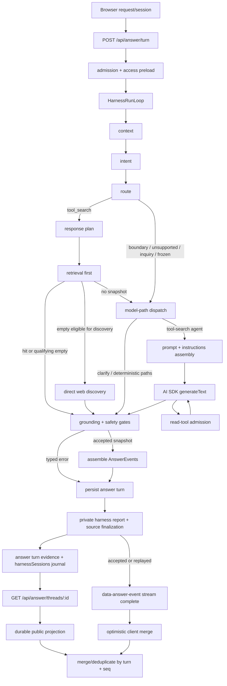
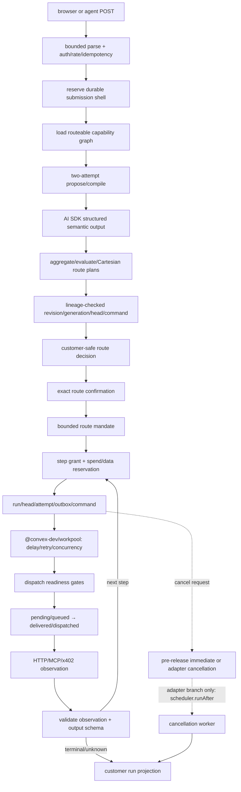
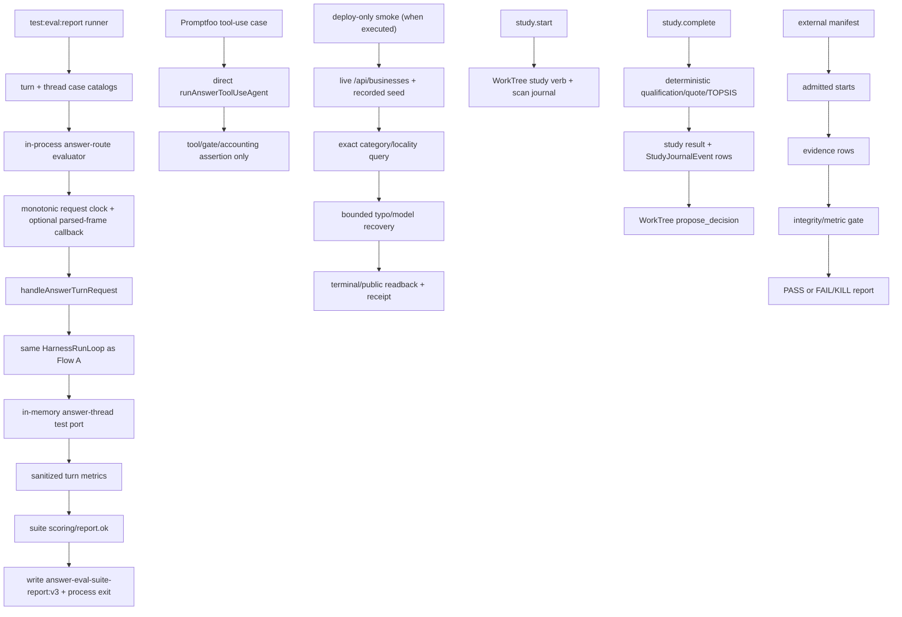

# PROMPT-DATA-FLOW — prompting & data-flow architecture map

**Maintained document.** Every hop below is source-cited (`file:line`, verified 2026-08-02).
Update rule: any PR that adds/moves a prompt-assembly site, gate, model call, stream frame,
durable journal, or scheduler hop MUST update the affected stage row and the entropy ledger.
Owner labels: **lib** = ai SDK / @convex-dev component / Convex runtime; **domain** =
deliberate product/safety policy (keep hand-rolled); **base** = infrastructure glue
(adoption candidate whenever a documented library primitive exists).

Stack (from `package.json` + `node_modules/*/package.json`): `ai@7.0.44`,
`@openrouter/ai-sdk-provider@3.0.0` (peer `ai ^7`), `@convex-dev/workflow@0.4.4`,
`@convex-dev/workpool@0.4.9`, `convex@1.42.0`, `zod@4.4.3`.
`@convex-dev/agent` is neither declared nor installed (`package.json:63-97`). Adoption is blocked
until an installed release can be verified against this repo's AI SDK major and the mapped
thread/message/projection contracts.
Runtime compatibility: package engine `>=22`; Nitro/Vercel emits `nodejs22.x` with the existing Node entry format (`package.json:156-159`; `vite.config.ts:57-66`).

---

## Maintenance contract

- **Owner:** architecture maintainers for the affected module; the author changing a mapped hop
  updates this document in the same change.
- **Evidence rule:** local behavior claims use current repo-relative `file:line` citations.
  Package behavior uses installed manifest/source citations. Transient agent transcripts,
  issue/PR state, and unverified current-version claims are not durable evidence.
- **Row contract:** every stage records **input → processing → output → owner**. Owner is
  **lib**, **domain**, or **base** as defined above.
- **Change triggers:** prompt assembly, routing/gates, model/tool calls, structured-output
  schemas, stream frames, persistence/journals, scheduler/workpool hops, projections, verdicts,
  or dependency versions.
- **Verification:** `tests/unit/planning/prompt-data-flow-map.test.ts` rejects transient evidence,
  missing flow tables/owner fields, and local citations whose files or line anchors no longer
  exist. Semantic accuracy still requires tracing the changed path from source.

---

## Flow A — Public answer turn: request → plan → answer → persistence → UI

| stage | source evidence | input | processing | output | owner |
|---|---|---|---|---|---|
| Browser request/session | `src/components/ae/chat/answer-stream.ts:8-82`; `src/components/ae/chat/turn-stream-session.ts:22-91` | query, optional thread/search context/key | same-origin credentialed POST; one in-flight request per key; active-session-only frame replay | HTTP request and thread/frame/result callbacks | base + domain |
| Parse + cookie | `src/routes/api.answer.turn.ts:36-61`; `src/lib/server/bounded-request-body.ts:58-76`; `src/modules/answer-thread/answer-thread.schema.ts:188-205` | raw body, headers | 16 KiB JSON bound, schema parse, `ae_session` resolution | validated request or 400/413 | base + domain |
| Admission + access | `src/routes/api.answer.turn.ts:63-97`; `src/modules/answer-thread/internal/turn-guard.ts:23-95` | session, turn key, thread | 30 s claim, HTTP admission, owner/session and 25-turn gate; thread-not-found remount resets to a new thread | access/preloaded turns or typed rejection | domain over base |
| Stream wiring | `src/routes/api.answer.turn.ts:98-145`; `src/modules/answer/answer-ui-stream.ts:17-69`; `tests/helpers/answer-turn-stream.ts:3-20` | allowed request, abort signal | AI SDK `createUIMessageStream`/response; transient `data-answer-event`; suppress post-abort writes; eval may attach an optional callback while draining parsed frames | no-store streaming response; optional eval frame observation | **lib** framing + base adapter |
| Harness runtime | `src/modules/answer-thread/internal/turn-orchestrator.ts:116-243`; `src/modules/harness/harness.schema.ts:21-33`; `src/modules/harness/run-loop.ts:116-210` | `StreamAnswerTurnInput` | ordered context→intent→route→retrieval→model→gate→assemble→persist; guarded normal phases; unguarded report attempt after failure | runtime state/events/report attempt | base |
| Context | `src/routes/api.answer.turn.ts:76-95`; `src/modules/answer-thread/internal/turn-orchestrator.ts:245-255` | thread/session, optional preload | complete preloaded turns or bounded read fallback; boundary explanation deliberately gets empty preload | prior turns/count | domain |
| Intent | `src/modules/answer-thread/internal/turn-orchestrator.ts:256-286`; `src/modules/answer-thread/internal/follow-up-intent.ts:9-81` | query, prior turns | precedence classification; collect frozen providers/allowed slugs | follow-up intent + prior evidence | domain |
| Route | `src/modules/answer-thread/internal/intent-router.ts:14-46`; `src/modules/answer-thread/internal/turn-orchestrator.ts:287-290` | follow-up intent | exhaustive route selection | tool-search, frozen, inquiry, boundary, or unsupported route | domain |
| Plan | `src/modules/answer-thread/internal/answer-response-planner.ts:99-191`; `src/modules/answer-thread/internal/turn-orchestrator.ts:278-306` | tool-search query/context | detect service/location; choose clarify/answer; set search, visible, artifact, and tool budgets | response plan | domain |
| Retrieval first | `src/modules/answer-thread/internal/turns/retrieval-first.ts:41-175,241-313` | route, plan, query/context | registry search through harness; deterministic hit; qualifying empty may call `web.discover` directly; other empty/error falls through | snapshot, imported claims, buffered tool record, or no snapshot | domain + base |
| Model-path dispatch | `src/modules/answer-thread/internal/turn-orchestrator.ts:327-388`; `src/modules/answer-thread/internal/turns/frozen-known.ts:1-81`; `src/modules/answer-thread/internal/turns/insufficient-frozen.ts:1-73`; `src/modules/answer-thread/internal/turns/inquiry-handoff.ts:1-130` | route, plan, prior evidence, retrieval result | deterministic boundary/unsupported/inquiry/frozen/clarify branches; only unresolved tool-search reaches agent | deterministic path result or agent input | domain |
| Prompt assembly | `src/modules/answer/internal/answer-llm-prompts.ts:1-129`; `src/modules/answer/internal/action-to-tool-spec.ts:46-77`; `src/modules/answer/internal/answer-tool-use-agent.ts:249-361,367-403` | agent query/context, intent, tool results | catalog-only instructions policy, provider-safe model tool aliases mapped back to canonical action IDs, inert data, JSON-replacer string sanitization, strict AnswerProse shape | instructions + user prompt payloads | domain |
| AI SDK loop | `src/modules/answer/internal/answer-tool-use-agent.ts:112-121,249-361,403-460` | prompts, OpenRouter model, tools, abort | missing-key fail closed; one `generateText` with tools + `Output.object`; bounded `stopWhen`; final tool-less structured step; `onStepEnd` usage | typed prose, canonical action tool records, per-step accounting; thrown failures remain in harness events | **lib** loop + domain budgets/schema |
| Tool admission | `src/modules/answer-thread/internal/tool-runner.ts:37-112,207-231`; `src/modules/answer-thread/answer-thread.schema.ts:29-33` | tool id/input, optional harness | allow-list/read-only/schema checks, execution, evidence/result digest extraction; failures become records | tool-call record, sources, allowed slugs | domain |
| Grounding + safety | `src/modules/answer/internal/answer-tool-use-agent.ts:135-184`; `src/modules/answer/internal/catalog-grounding.ts:11-40`; `src/modules/answer-thread/internal/answer-turn-safety.ts:17-69`; `src/modules/answer-thread/internal/turn-orchestrator.ts:399-429` | prose/snapshot, current or frozen allowed slugs | location filter, slug grounding, sanitization, three defense-in-depth gates | accepted snapshot or typed error | domain |
| Assemble events | `src/modules/answer/internal/emit-snapshot-events.ts:21-93`; `src/modules/answer-thread/internal/turn-orchestrator.ts:430-470,650-755` | accepted snapshot | ordered plan/thinking/prose/source/provider/artifact/next-step/summary events; terminal complete withheld | transient answer events | domain |
| Persist | `src/modules/answer-thread/internal/answer-turn-finalization.ts:141-273`; `convex/answerThreads.ts:58-338` | snapshot or error, evidence, tool calls | source-write admission; canonical hashes; new/existing-thread atomic mutations; error turns persist empty evidence/prose | production answerThreads/answerTurns/answerToolCalls rows | base + domain |
| Report/finalize | `src/modules/answer-thread/internal/turn-orchestrator.ts:527-576`; `src/modules/answer-thread/internal/answer-turn-finalization.ts:247-314,500-740`; `convex/harnessSessions.ts:186-447` | persisted turn, harness events, source request | journal mapping, finalization hash, turn-evidence update, source finalizer; only accepted/replayed completes | private harness report/finalized evidence or persist failure | base + domain |
| Client merge/replay | `src/components/ae/chat/answer-turn-state.ts:40-176`; `src/components/ae/chat/AeChat.tsx:300-380,620-669`; `src/routes/api.answer.threads.$threadId.ts:11-29`; `convex/answerThreads.ts:580-619`; `src/modules/answer-thread/internal/public-projection.ts:45-93` | transient events and durable rows | optimistic merge on stream done; GET durable projection; merge/deduplicate by turn/seq | converged UI turn list | base React + domain projection |

**Explicit forks/invariants.** The OpenRouter key is consulted only on the agent path
(`src/modules/answer/internal/answer-tool-use-agent.ts:114-123`); all deterministic paths bypass it.
The local-E2E adapter stores in-memory threads/turns and does not retain tool-call rows
(`src/modules/answer-thread/answer-thread.functions.ts:490-550`), so the three-row persistence
contract above is production Convex behavior.

## Flow B — Customer request V2: intake → interpretation → plan → execution → projection

| stage | source evidence | input | processing | output | owner |
|---|---|---|---|---|---|
| Public transports | `src/routes/api.requests.ts:1-7`; `src/lib/server/customer-request-browser-api.ts:42-57,127-143`; `src/routes/api.v1.requests.ts:1-7`; `src/lib/server/customer-request-agent-api.ts:42-59` | browser or agent POST | guest/auth/service-assertion routing into one submit boundary | common request command path | base |
| Bounded admission | `src/lib/server/customer-request-api.ts:19-47`; `src/lib/server/customer-request-route-action-api.ts:43-93` | raw request | 32 KiB bound, strict schema, sensitive-input refusal, command projection/status mapping | application call or typed HTTP error | base + domain |
| Submission reservation | `convex/customerRequestApplication.ts:697-768`; `convex/customerRequestV2.ts:146-218` | command, caller assertion | rate/identity/idempotency/digest/replay checks; insert submission shell before provider work | replay/refusal or durable-shell compile request | domain + base |
| Capability graph | `src/modules/customer-request/application/interpret-compile/graph.ts:22-90`; `convex/customerRequestApplication.ts:1768-1791` | network id | load routeable supply/exact contracts/decision models/bindings; digest snapshot; reload each attempt | bounded models/descriptors/bindings/digest | domain |
| Attempt ladder | `src/modules/customer-request/application/interpret-compile/interpret.ts:118-205`; `src/modules/customer-request/application/interpret-compile/interpreter.ts:23-70` | intent/amendment/prior facts/graph | exactly two attempts; retry proposal or retryable compile refusal; OpenRouter gets deterministic fallback only on final attempt, while no-key chooses deterministic up front | proposal/compiled aggregate or typed refusal | domain |
| Structured semantics | `src/modules/customer-request/semantic-interpreter.ts:128-236,242-302`; `src/modules/customer-request/openrouter-transport.ts:46-100` | public job/amendment/capability payload | payload bound → AI SDK `generateText` + `Output.object` → serialized-response bound → tolerant wire normalization → strict domain schema; `JSON.parse` only salvages `NoObjectGeneratedError.text` | typed proposal + provenance digests | **lib** structured output + domain validation |
| Compile | `src/modules/customer-request/compiler.ts:208-390,546-700` | semantic proposal and graph | facts/criteria/actions/dependencies/evaluation/Cartesian routes, costs, freshness, recovery, digests; omit generation for zero routes or any non-known cost | aggregate + optional route generation or refusal | domain |
| Commit/store | `src/modules/customer-request/v2-write/commit-aggregate.ts:11-155`; `convex/customerRequestV2WritePorts.ts:60-216` | aggregate/generation, expected lineage, command digest | replay/conflict/current-graph checks; supersede mandate; write revision, optional generation/head, request head, command | stored/replayed current request | domain + base |
| Decision projection | `src/modules/customer-request/route-plan-customer-projection.ts:93-162`; `src/modules/customer-request/application/route-plan-projection/project-plans.ts:12-68`; `convex/customerRequestCompareResumePorts.ts:66-75` | current generation material + names/semantics/time | validate and project routes, comparison, changes, influence, recovery, available actions | customer-safe route-plan decision | domain |
| Confirm + mandate | `src/modules/customer-request/application/confirm-route/confirm.ts:11-78`; `src/modules/customer-request/route-mandate-mutation/issue.ts:11-170`; `convex/customerRequestRouteMandatePorts.ts:242-318` | exact displayed revision/route, idempotency, owner/service authority | freshness/known-cost/current-graph/authorization checks; persist issue/head/command | confirmation receipt and bounded mandate; no work started | domain |
| Step grant | `convex/customerRequestRouteMandateAdmission.ts:60-145,199-263`; `src/modules/customer-request/internal/route-mandate-convex-schema.ts:431-488` | mandate, exact step/supply/contract identities, idempotency | scope/cumulative-spend/data-reservation checks and writes | admitted/replayed route-step grant | domain |
| Start + journal | `src/modules/customer-request/route-execution/machines/start-or-resume.ts:7-187`; `convex/customerRequestRouteExecutionJournalPorts.ts:279-373`; `src/modules/customer-request/internal/route-mandate-convex-schema.ts:490-738` | active mandate, request/principal/key | replay/resume/cancel-prior checks; materialize input; write run/head/queued attempt/pending outbox/command | started/resumed run + pending dispatch | domain + base |
| Workpool enqueue | `convex/customerRequestRouteExecutionJournalPorts.ts:103-128` | committed dispatch ref | workpool max parallelism 32, retry max 3, 5 s pre-release delay | transport-worker invocation | **lib** |
| Dispatch open | `convex/customerRequestRouteExecutionDispatchPorts.ts:96-181` | dispatch ref | verify pending/queued rows, grant, mandate, exact healthy supply/publication/readiness/credential state | bounded invocation or unavailable | domain + base |
| Release | `src/modules/customer-request/route-execution/machines/mark-dispatched.ts:7-77`; `convex/customerRequestRouteExecutionDispatchPorts.ts:20-69` | opened dispatch/attempt | repeat authority/readiness checks; patch pending→delivered, queued→dispatched, run→running | recorded/replayed/refused release | domain |
| Provider transport | `src/modules/capability-supply/route-transport-runtime.ts:147-203,307-520,762-787`; `convex/customerRequestRouteTransportWorker.ts:66-198` | guarded HTTP/MCP/x402 invocation | execute adapter; normalize bounded observation, digests, evidence, optional output/receipt/payment | untrusted route-transport observation | base transport |
| Outcome commit | `src/modules/customer-request/route-execution/machines/record-outcome.ts:7-95`; `convex/customerRequestRouteExecutionJournalPorts.ts:389-473` | attempt/key/observation/output | parse observation, match disposition/release, validate registered output/evidence; invalid released output becomes unknown | failed/unknown/completed/cancelled/advanced/replayed | domain |
| Next-step loop | `convex/customerRequestRouteExecutionJournalPorts.ts:646-783` | successful attempt + evidence-bound mappings | materialize/re-admit next step; write queued attempt/pending outbox; enqueue workpool | advanced run or outcome unknown | domain + **lib** enqueue |
| Cancellation fork | `src/modules/customer-request/route-execution/machines/cancel-current.ts:16-86`; `convex/customerRequestRouteExecutionCancelPorts.ts:89-188`; `convex/customerRequestRouteCancellationWorker.ts:13-74`; `src/modules/customer-request/route-execution/machines/cancel-resolve-attempt.ts:7-50` | request/principal/key/mode | queued+pending cancels immediately; active adapter branch writes pending cancellation and uses raw scheduler; worker records accepted/rejected/unknown; otherwise too late | cancelled/pending/too-late/replayed/resolved | domain + base scheduler |
| Customer projection | `src/modules/customer-request/application/route-plan-projection/project-run.ts:64-149`; `convex/customerRequestRouteExecution.ts:105-180,568-579` | stored run + aggregate | map completed/unknown/cancelled/failed/progress and cancellation state | customer action status/result/attention | domain |

**No notification edge.** The notification outbox accepts inquiry thread/message data, not V2 run
output (`src/modules/notification-outbox/internal/commands.ts:28-56`;
`convex/inquiryNotificationBridge.ts:25-76`). Connecting V2 outcomes is product gap B1, not an
existing stage.

## Flow C — Eval, Promptfoo probe, study, and external-run protocols

| stage | source evidence | input | processing | output | owner |
|---|---|---|---|---|---|
| Eval runner | `package.json:41-44`; `eval/answer/scripts/run-suite.ts:5-40` | static suite configuration/output path | run the v3 suite, serialize its sanitized report, set nonzero exit when `report.ok` is false | `answer-eval-suite-report:v3` JSON + process status | base eval |
| Case catalogs | `eval/answer/lib/cases.ts:153-184,202-279`; `eval/answer/lib/coverage.ts:61-148`; `eval/answer/lib/suite.ts:120-151` | turn/thread/harness case declarations | execute turn/thread cases; direct retrieval requires exactly 0 model requests, Paramata recovery exactly 1 model request and 2 persisted tool runs; audit harness metadata coverage separately | executable cases + coverage/count verdict | domain eval |
| In-process answer evaluator | `tests/helpers/answer-turn-stream.ts:3-20`; `eval/answer/lib/evaluators.ts:313-489,491-628,658-834`; `src/routes/api.answer.turn.ts:43-145` | case query/context + deterministic fixture | isolate the local registry from ambient Convex URLs, install in-memory answer-thread state, start `performance.now()` immediately before route invocation, mark first parsed non-`thread` frame through the optional callback, drain terminal response, then read harness summary and enforce expectations | answer turn result + evidence + finite request-to-first-progress/request-to-completion metrics, counts, usage, and cost | base test seam + shared domain |
| Shared harness/finalization | `src/modules/answer-thread/internal/turn-orchestrator.ts:125-219`; `src/modules/answer-thread/internal/answer-turn-finalization.ts:150-329`; `tests/helpers/answer-thread-test-port.ts:14-109`; `src/modules/harness/harness.schema.ts:117-200`; `src/modules/harness/run-collector.ts:242-266,404-448` | evaluator route result | run Flow A harness and finalization; test port stores evidence in memory, while the private harness summary aggregates model/tool counts, usage, and cost once | in-memory frozen evidence/harnessRun plus private aggregate summary | shared base/domain |
| Production harness journal/viewer | `convex/harnessSessions.ts:186-541`; `src/modules/harness/run-viewer.functions.ts:45-156`; `src/modules/harness/replay-projection.ts:70-133` | production runtime events/journal rows | append/finalize/query journal; project private/public replay summaries | durable session/run view | base + domain |
| Score/report | `eval/answer/lib/suite.ts:38-76,135-174,176-218,325-398`; `tests/eval/answer-pipeline.test.ts:84-194`; `eval/answer/scripts/run-suite.ts:9-25` | evaluated cases + coverage | calculate thresholds/outcomes; aggregate model/tool counts, usage, estimated cost, sorted cost-unavailable reasons, and `performanceByPath` p95/max; preserve report redaction and existing `ok` semantics | sanitized `answer-eval-suite-report:v3` with per-turn and aggregate evidence | domain eval + base runner |
| Promptfoo direct probe | `eval/answer/promptfooconfig.yaml:152-182`; `eval/answer/providers/gate.mjs:7-26`; `eval/answer/scripts/run-case.ts:1-6`; `eval/answer/lib/evaluators.ts:957-1051` | Promptfoo vars + fixture server | direct `runAnswerToolUseAgent`; bypass route/harness/persistence; source/mock model behavior only | in-memory tool input/gate/slug/accounting assertion, never route or deployment proof | eval probe + **lib** agent |
| Hosted answer-runtime smoke | `tests/deploy-smoke/answer-runtime-production-smoke.spec.ts:34-94,96-134,205-251,353-426` | deployment base URL + optional selection seed | fetch live public catalog; choose a unique category/locality subject deterministically; exercise exact retrieval then bounded typo/model recovery through public UI; require terminal citations, fresh readback, no consequential effect, and a receipt | deployment-only proof when executed, or failed/unavailable smoke | base + domain |
| Study start/inspect | `src/modules/study/study.actions.ts:45-82`; `src/modules/study/study.functions.ts:100-208`; `convex/workTrees.ts:239-279` | study/work-tree refs and operation key | apply WorkTree `study`, create study, append scan-started event; inspect reads state | study receipt/status | domain |
| Study complete | `src/modules/study/study.actions.ts:84-114`; `src/modules/study/study.functions.ts:227-304`; `src/modules/study/internal/pipeline.ts:38-87,108-211,253-429`; `src/modules/study/internal/topsis.ts:65-151` | fenced study, registry/web material | deterministic qualification, quote/evidence checks, scoring/TOPSIS, refusal branches | StudyArtifact + journal events or refusal | domain |
| Study persist/proposal | `convex/studies.ts:164-252`; `src/modules/study/study.functions.ts:267-304`; `src/modules/work-tree/internal/verbs.ts:223-254` | pipeline result | record artifact/events, then separately apply WorkTree `propose_decision`; XState replay is an interpreter of durable events | persisted study + proposal-only decision node | domain + base |
| External manifest/start/evidence | `convex/externalRuns.ts:66-251` | manifest, caller/source authority, evidence | create/inspect manifest, admit bounded starts, append evidence with integrity checks | persisted manifest/start/evidence rows | domain + base |
| External finalize/report | `convex/externalRuns.ts:252-363`; `src/modules/external-run/internal/gate.ts:160-297` | manifest + admitted starts + evidence | reconcile digests/references/metrics and thresholds; persist/read gate report | exact `PASS` or `FAIL/KILL` | domain |

**Protocol invariant.** Eval returns boolean `ok`, study returns recommendation/refusal plus a
proposal-only WorkTree node, and external-run returns `PASS | FAIL/KILL`. No conversion edge exists
between these trust domains.
**Proof boundary.** In-process route/harness evaluation and the Promptfoo probe are local source/mock evidence; they do not claim live provider or deployment behavior. The runtime-selected smoke is the only deployment proof, and only an executed receipt/readback can support that claim.

## Library-adoption boundary

| surface | current verdict | evidence | owner / revisit trigger |
|---|---|---|---|
| UI stream protocol | SDK framing owned; AE owns payload only | `src/routes/api.answer.turn.ts:114-145`; `src/modules/answer/answer-ui-stream.ts:1-63` | **lib**; revisit on AI SDK stream contract change |
| Tool loop / structured prose | `generateText` + tools + `Output.object` + SDK step control (`instructions`, `prepareStep`, `stopWhen`, `onStepEnd`) | `src/modules/answer/internal/answer-tool-use-agent.ts:285-357` | **lib** loop / **domain** schema; revisit on SDK major |
| Semantic structured output | adopted with tolerant wire/strict domain validation | `src/modules/customer-request/openrouter-transport.ts:74-100`; `src/modules/customer-request/semantic-interpreter.ts:128-165,242-302` | **lib** call / **domain** validation; preserve taxonomy |
| Model telemetry | SDK `onStepEnd` usage plus one private harness model-event envelope; eval exports only aggregate counts/usage/cost and route clocks; no `@ai-sdk/otel` dependency or deployment trace | `src/modules/answer/internal/answer-tool-use-agent.ts:251-274,294-346`; `src/modules/harness/harness.schema.ts:155-200`; `eval/answer/lib/evaluators.ts:127-151,463-572`; `package.json:60-90` | **lib** usage / **base** journal / **domain** eval; revisit if SDK usage fields or deployment-proof contract changes |
| Timeout plumbing | semantic transport uses SDK timeout + abort; answer agent uses abort only | `src/modules/customer-request/openrouter-transport.ts:74-89`; `src/modules/answer/internal/answer-tool-use-agent.ts:294-303,333-347` | **base**; unresolved only if answer-loop timeout must be independently bounded |
| Model gateway | one cached OpenRouter provider seam | `src/modules/model-gateway/public.ts:42-130` | **base**; revisit only for a second provider adapter |
| Model catalog | bounded fetch/cache/fallback remains product-owned; installed `es-toolkit/array` owns first-ID-wins deduplication | `src/modules/answer/internal/openrouter-models.ts:171-230,247-255`; `package.json:98` | **domain** fetch policy + **lib** collection primitive; revisit if provider SDK exposes authoritative catalog |
| `@convex-dev/agent` | not declared or installed; no application import | `package.json:63-97` | **base**; re-evaluate from installed manifest/source before adoption |
| `@convex-dev/workflow` | installed 0.4.4 and used by project spine | `node_modules/@convex-dev/workflow/package.json:1-12`; `convex/projectSpine.ts:1-91,145-164` | **lib**; copy installed source contracts, not “latest” claims |
| `@convex-dev/workpool` | installed 0.4.9; owns normal route-transport enqueue | `node_modules/@convex-dev/workpool/package.json:1-15`; `convex/customerRequestRouteExecutionJournalPorts.ts:103-128` | **lib**; revisit if priority/retry semantics change |
| Harness/journals/gates/digests | AE lifecycle/evidence contract remains domain-owned; Convex rows are the durable source of truth, while the eval test port is only a local seam | `src/modules/harness/run-loop.ts:116-233,330-367`; `src/modules/answer-thread/internal/answer-turn-finalization.ts:164-191`; `tests/helpers/answer-thread-test-port.ts:14-109` | **base + domain**; replace only with a primitive preserving every phase/evidence invariant |

## Entropy ledger — dissipative structures to eliminate or justify

| id | finding / invariant | status | owner / revisit trigger |
|---|---|---|---|
| A1 | retrieval-first may search registry before agent recovery searches again (`src/modules/answer-thread/internal/turns/retrieval-first.ts:49-145`; `src/modules/answer/internal/answer-tool-use-agent.ts:220-237`) | accepted deterministic-first policy | answer domain; revisit when observed tool budgets or latency drift |
| A2 | response-plan tool policy previously re-derived | resolved: orchestrator threads policy into agent (`src/modules/answer-thread/internal/turn-orchestrator.ts:370-380`; `src/modules/answer-thread/internal/turns/agent.ts:32-46`) | answer domain; preserve one thread-path source |
| A3 | prose gated in agent, safety adapter, and orchestrator (`src/modules/answer/internal/answer-tool-use-agent.ts:174-184`; `src/modules/answer-thread/internal/answer-turn-safety.ts:17-49`; `src/modules/answer-thread/internal/turn-orchestrator.ts:399-421`) | accepted defense in depth | safety domain; revisit only with equivalent invariant proof |
| A4 | prompt/tool registry drift | resolved: prompt and admission derive canonical IDs (`src/modules/answer/internal/answer-llm-prompts.ts:1-2,45-49`; `src/modules/answer-thread/internal/answer-tool-registry.ts:8-18`) | answer domain; guard registry/prompt parity |
| A5 | optimized write plus compatibility fallback graph | resolved for writes; read-only missing-function fallback remains (`src/modules/answer-thread/answer-thread.functions.ts:237-301,394-416`) | answer-thread base; remove read fallback when legacy host support ends |
| A6 | live reducer and durable projection both assemble artifacts (`src/components/ae/chat/answer-turn-state.ts:49-127`; `src/modules/answer-thread/internal/public-projection.ts:45-82`) | accepted transient/durable representations | answer UI/domain; revisit on parity failures |
| A7 | `AnswerSynthesizer` implementation deleted but named contract module/types remain (`src/modules/answer/answer-synthesizer.ts:1-32,119-167`; `src/modules/answer/public.ts:120-136`) | **OPEN:** prior “removed” claim was false/partial | answer domain; rename/deepen contract seam when exported callers can migrate cleanly |
| A8 | unsupported turns previously projected as boundary | behavior resolved: emits unsupported (`src/modules/answer-thread/internal/turns/boundary.ts:21-44,78-88`); contract cleanup remains A7 | answer domain; keep route/mode unions aligned |
| A9 | route preload plus orchestrator fallback (`src/routes/api.answer.turn.ts:68-95`; `src/modules/answer-thread/internal/turn-orchestrator.ts:245-255`) | accepted remount/race fork | answer-thread base; revisit if one durable context read can preserve race behavior |
| B1 | notification outbox has no V2 outcome input (`src/modules/notification-outbox/internal/commands.ts:28-56`; `convex/notificationOutbox.ts:316-346`) | product gap, not refactor | founder/product; decide whether V2 outcomes need a separate notification contract |
| B2 | historical `accepted` attempt state has no live producer (`src/modules/customer-request/internal/route-mandate-convex-schema.ts:674-678`; `convex/customerRequestRouteExecutionDispatchPorts.ts:47-60`) | live producer removed; compatibility reads remain | route-execution domain; remove literal only after historical rows are impossible |
| B3 | refresh uses final-attempt semantics twice (`src/modules/customer-request/application/compare-resume/refresh.ts:58-69`) | deliberate graph-compilation retry, documented | customer-request domain; revisit if provider retry enters refresh |
| B4 | route generation omitted for zero routes or non-known costs (`src/modules/customer-request/compiler.ts:359-390,631-635`) | product policy | customer-request domain; revisit on preparation-price product decision |
| B5 | scheduler ownership split: workpool transport vs native cancellation/readiness (`convex/customerRequestRouteExecutionJournalPorts.ts:107-128`; `convex/customerRequestRouteExecutionCancelPorts.ts:89-108`; `convex/capabilitySupplyPublicationPorts.ts:89-95`) | justified by different semantics; scheduled mutations are exactly-once, actions at-most-once (`node_modules/convex/src/server/scheduler.ts:18-25`) | route/platform base; revisit only if hop guarantees converge |
| B6 | legacy leased route-projection state | resolved; current projection has no leased branch (`src/modules/customer-request/application/route-plan-projection/project-run.ts:12-60`) | customer-request domain; prevent cross-subsystem lease-state leakage |
| C1 | Promptfoo tool probe bypasses route/harness/persistence (`eval/answer/lib/evaluators.ts:793-820`) | accepted model-behavior probe | eval owner; never use as end-to-end correctness evidence |
| C2 | harness model envelope and per-step usage looked duplicated | resolved/defined: one request envelope plus per-step accounting; v3 reads the harness aggregate once (`src/modules/answer/internal/answer-tool-use-agent.ts:251-274,410-480`; `src/modules/harness/run-collector.ts:404-448`; `eval/answer/lib/evaluators.ts:127-151`) | harness base/eval; preserve request/step distinction without adding OTel |
| C3 | live and fallback harness report/journal builders can diverge (`src/modules/answer-thread/internal/answer-turn-finalization.ts:164-191,481-560`) | accepted fallback; parity proof remains desirable | harness owner; add parity check on first observed mismatch |
| C4 | eval/study/external verdict protocols do not convert (`eval/answer/lib/suite.ts:120-151`; `src/modules/study/internal/pipeline.ts:252-429`; `src/modules/external-run/internal/gate.ts:250-297`) | accepted distinct trust domains | evaluation architecture; revisit only with an explicit conversion contract |
| C5 | request wall-clock and internal harness spans measure different boundaries (`tests/helpers/answer-turn-stream.ts:3-20`; `eval/answer/lib/evaluators.ts:463-572`; `eval/answer/lib/suite.ts:343-398`) | deliberate split: monotonic request-to-first-progress/request-to-completion stays separate from internal timing; `performanceByPath` is descriptive p95/max, not an SLO | eval owner; revisit if parser or route boundary changes |
| C6 | local captures can be mistaken for hosted/provider proof (`tests/eval/answer-pipeline.test.ts:84-194`; `tests/deploy-smoke/answer-runtime-production-smoke.spec.ts:34-94`) | explicit proof ceiling: local route/harness and Promptfoo remain source/mock; runtime-selected public smoke counts only when its receipt/readback exists | release/eval owner; never upgrade absent smoke to deployed |

## Verification record

- 2026-08-02: four discrete source audits independently traced Flow A, Flow B, Flow C, and
  A1-A9/B1-B6/C1-C4. Corrections include planner-before-retrieval ordering, the direct discovery
  fork, accepted/replayed finalization, structured semantic output, explicit route grant/release/
  next-step hops, eval's in-memory persistence seam, exact `PASS | FAIL/KILL`, A7 reopened, and
  scheduler guarantees split by function kind.
- `npx vitest run tests/unit/planning/prompt-data-flow-map.test.ts --no-file-parallelism`:
  3 tests passed; all three stage tables, ledger IDs, durable evidence rules, architecture link,
  and more than 80 local citation anchors validated.
- 2026-08-02 agent-runtime rationalization map update: Flow A now records the AI SDK 7 `instructions` seam, and Flow C records parsed-frame clocks, report v3 evidence/counts, and the runtime-selected smoke's deployment-only proof boundary (`src/modules/answer/internal/answer-tool-use-agent.ts:294-346`; `eval/answer/lib/evaluators.ts:463-572`; `eval/answer/lib/suite.ts:135-173`; `tests/deploy-smoke/answer-runtime-production-smoke.spec.ts:34-94`).
- 2026-08-02 dependency-adoption audit: four discrete slices found no justified new package.
  Existing AI SDK/OpenRouter/Zod/x402/workflow/workpool primitives already own their base
  mechanisms. Adopted installed SDK `StepResult`, `es-toolkit/array.uniqBy`, and native
  `JSON.stringify` replacers; removed the duplicate step-shape type, model-dedupe loop, and two
  recursive/repeated string-sanitization paths. `@convex-dev/agent@0.6.4` remains blocked by
  `ai ^6`/provider-utils v4 peers and its v3 language-model guard; the repo requires AI SDK 7,
  provider-utils 5, and OpenRouter's v4 model. MCP high-level client replacement remains blocked
  because it would replace registered protocol versions and operation-key request IDs.
