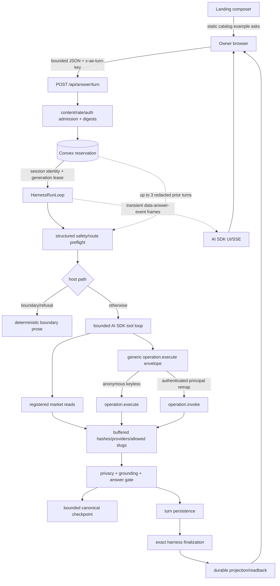
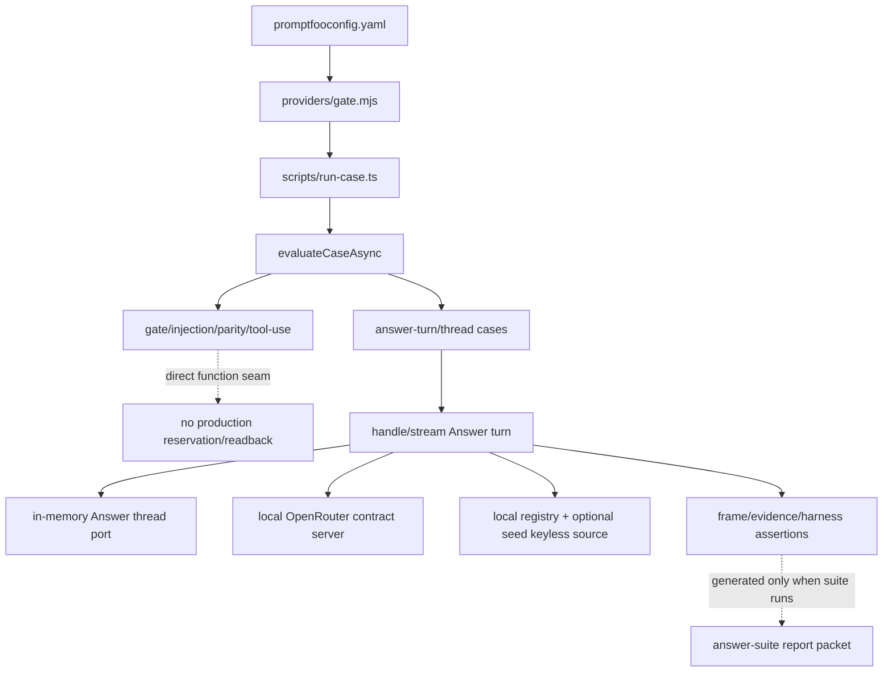

# PROMPT-DATA-FLOW — prompting, data-flow, and AI harness map

**Analysis date: 2026-08-20**

This is the narrow current-tree map of prompt, model, tool, stream, evaluation, and runtime seams. It follows an Answer turn from admission through the harness, the bounded market tool loop, evidence, persistence, and readback. Customer Request TypeScript is retired; paid work is `POST /api/v1/operations/call`. It includes uncommitted source changes. It does not map the whole architecture or information architecture.

## Maintenance contract and evidence ceiling

- Current source is authoritative. Re-check every named symbol, bound, model, and package version when refreshing this document; do not carry forward an absent file, generated report, or historical campaign claim.
- Convex durable state and deterministic module/kernel seams own identity, admission, validation, authority, dispatch, budgets, money, settlement, evidence, and readback. Routes, models, SDKs, workers, browsers, CLI/MCP adapters, and provider responses are adapters or observations.
- A model may propose safety/route semantics, candidate selection, strict tool input, or prose. It cannot create a provider, contract, price, credential, approval, spend authority, route release, cancellation result, output validity, payment settlement, or durable completion.
- Provider output is untrusted until the appropriate contract/output/evidence seam validates and persists it. Stream frames are transient and never outrank durable readback.
- Evidence classes do not upgrade one another:

| class | establishes | does not establish |
|---|---|---|
| source-integrated | checked-in contracts, guards, bounds, and ownership | that a hosted deployment or provider call succeeded |
| config-gated | a path can run when named configuration/credentials exist | that configuration exists or a live call occurred |
| local fixture | deterministic behavior through test ports, local contract servers, or convex-test | hosted Convex, real provider, customer value, payment, or settlement |
| named packet | only the fields/outcomes in an identified generated packet | another revision, environment, provider, or stronger evidence class |
| hosted-live-certified | a current revision-bound executed receipt plus durable readback | anything outside that receipt/readback |

- No current `output/eval/answer-suite-report.json` exists in this tree. Therefore this refresh names no Answer suite packet counts. Source-defined cases are source-integrated; a future generated report becomes a named packet only when it exists and is identified.
- USE follows Brendan Gregg’s resource-first method: inventory each resource, then ask utilization, saturation, and errors separately. `?` means unobserved in current source/telemetry, not zero, idle, healthy, or unlimited.
- Credential values, private URLs, prompt secrets, raw provider payloads, and raw private harness payloads are intentionally omitted.

## Functional block diagrams

### Answer turn: reservation-bound model/tool/evidence loop

`src/routes/api.answer.turn.ts` owns the HTTP/UI-stream boundary. `src/modules/answer-thread/internal/turn-orchestrator.ts` owns lease-bound execution and checkpoint persistence. `src/modules/answer-thread/internal/answer-turn-phases.ts` owns the harness phase machine (`context` → `intent` → `route` → `retrieval` → `model` → `gate` → `assemble` → `persist` → `report`). Preflight is advisory; the host does not invent a query-shape plan. Safe turns enter one bounded AI SDK tool loop. `src/modules/answer/internal/answer-tool-use-agent.ts` stages navigation and a generic capability envelope. `src/modules/answer-thread/internal/tool-runner.ts`, `internal/answer-turn-checkpoint.ts`, `internal/answer-turn-persist.ts`, `internal/answer-turn-harness-report.ts`, and Convex source writes own evidence and replay.

There is no live `/api/answer/follow-up-chips` route. Landing chips are static catalog example asks (`src/modules/answer/catalog-example-asks.ts`), not model-generated follow-ups. Customer Request TypeScript is retired. Paid work is `POST /api/v1/operations/call`. HTTP 410 tombstones remain on `/api/v1/operations/execute` and Convex HTTP routing-v1 paths. Do not restore a planner, compiler, mandate graph, or Customer Request Workpool.

## Flow A — Answer request, preflight, and execution

### A1. Admission, reservation, lease, and route

1. `handleAnswerTurnRequest` requires JSON, bounds the request body to 16 KiB (`MAX_ANSWER_TURN_BODY_BYTES`), requires a trimmed `x-ae-turn-key` of 1–128 characters, applies `answer-turn-submit` admission, and resolves a pseudonymous session (`src/routes/api.answer.turn.ts:68-118`). Query text is `trim().min(1)` and is otherwise capped at 200 characters unless `parseAnswerOperationSelectionRecognition` accepts it as a valid operation-selection payload (`answer-thread.schema.ts:470-480`).
2. An `Authorization` header optionally creates an authenticated `AnswerOperationInvokeContext`. This selects the controlled `operation.invoke` service later; authentication is caller identity, not provider/effect authority (`api.answer.turn.ts:119-131`). The Node-only Answer execution graph is loaded with a documented dynamic import so the client route graph does not pull it (`api.answer.turn.ts:134-141`).
3. The route computes a canonical request digest and a session/thread-scope/client-key reservation key, then calls the source-write-backed reservation seam (`api.answer.turn.ts:143-168`; `src/modules/answer-thread/internal/turn-digests.ts`).
4. `convex/answerThreads.ts` is the public Convex barrel. `reserveAnswerTurnHandler` in `convex/answerThreadsReserve.ts:156` idempotently creates, replays, or takes over a reservation. It checks session/thread scope and request digest, denies foreign sessions, caps threads at 25 turns (`ANSWER_THREAD_MAX_TURNS`), and uses a 30-second generation-fenced lease (`ANSWER_TURN_EXECUTION_LEASE_MS` in `answer-thread.schema.ts:72`). A live reserved row returns `in_progress`; an expired row increments generation and migrates only a valid checkpoint (`answerThreadsReserve.ts:179-220`).
5. Lease renewal validates reservation/session/thread/turn/request/generation identity. Heartbeat lives in `src/modules/answer-thread/internal/answer-turn-lease.ts`: interval is `Math.min(10_000, floor(lease/3))` (10 s at the current 30 s lease). `streamAnswerTurn` starts the heartbeat after reservation/checkpoint takeover and `reportStreamAnswerTurnPhase` stops it at the persistence/report handoff (`turn-orchestrator.ts:315-357`; `answer-turn-persist.ts:263-266`). A live `in_progress` admission does not enter the loop: it emits thinking + `pending` and returns (`turn-orchestrator.ts:247-250`).
6. Before registry/provider work, the `context` phase calls `classifyAnswerRequestPreflight`, which asks OpenRouter for strict `{safety, interpretation}`. Interpretation still names route `business | operation | confirmation | boundary`, 1–4 ordered unique `requestedIntents`, continuation `new | refine_prior_operation | resolve_pending`, and effect policy `run_when_ready | candidate_only` (`answer-schema.ts:505-577`; `answer-query-safety.ts:67-85`). That proposal is advisory. The live host `route` phase does not call a query-shape planner: refused preflight becomes `safety_refusal`; every other allowed turn is `tool_search` with `lane: 'operation'`, `continuation: 'new'`, `allowedReadToolFamily: 'shared'`, and `effectAllowed: true` (`answer-turn-phases.ts:268-281`). `candidate_only` is a preflight field, not a host-enforced search-only budget.
7. The preflight uses strict structured output, `temperature: 0`, `maxOutputTokens: 256`, `maxRetries: 0`, and up to three redacted prior turns (`answer-query-safety.ts:17,87-92,143-161`). Missing credentials or provider/schema failure becomes typed `classifier_unavailable`; unsafe requests become `unsafe_request`. Both fail into deterministic safety copy, not permissive routing.
8. Host routing is a harness phase machine (`context` → `intent` → `route` → `retrieval` → `model` → `gate` → `assemble` → `persist` → `report`) in `answer-turn-phases.ts`. Safe turns enter one bounded AI SDK tool loop over registered market reads and at most one provider effect. Boundary/refusal uses deterministic prose (`turns/boundary.ts`). `planPendingOperationClarification` still exists as layout/copy with `toolPolicy: none` (`answer-response-planner.ts:86-114`) and is unit-tested, but `streamAnswerTurn` / `createStreamAnswerTurnPhases` does not call it.
9. Layout/provider budgets (search/visible limit 3, artifact kinds) live next to response modes in `answer-response-planner.ts`. They do not classify capabilities or authorize operation execution. The harness `intent` phase always stores `refine_search` (`answer-turn-phases.ts:215-219`). There is no `deriveFollowUpIntent` symbol in current source. `classifyFollowUpIntent` in `follow-up-intent.ts` remains a client/funnel classifier (`AeChat.tsx`, `chat-funnel.ts`), not host tool routing.

### A2. Model, navigation, tool, and capability seams

- The shared provider seam is `openRouterModel` in `src/modules/model-gateway/public.ts`. The installed versions are AI SDK `^7.0.44`, `@openrouter/ai-sdk-provider ^3.0.0`, Convex `1.42.0`, and Workpool `^0.4.9` (`package.json:71-93`).
- The Answer default model is `deepseek/deepseek-v4-flash`, overridable by `AE_LLM_MODEL`. The gateway requests usage, permits provider fallbacks, supports strict structured output/reasoning/web options, installs tool-input-example middleware, and treats missing provider cost metadata as unavailable, never zero (`model-gateway/public.ts:31,110-157`).
- Answer prose and structured agent outputs are capped at 1,024 output tokens with `maxRetries: 0`. The navigation/tool `generateText` and the later structured prose call both use `temperature: 0.2` (`answer-tool-use-agent.ts:86,357-366,419-426`). Model-visible operation results are capped at 64 KiB (`MAX_MODEL_TOOL_RESULT_BYTES` in `answer-tool-result-json.ts`). Current source exposes no global context-token cap: `?`. Prompts live in `src/modules/answer/internal/answer-llm-prompts.ts` (tool-loop system, grounded prose, catalog_data sanitization).
- `ANSWER_AGENT_MAX_TOOL_CALLS=4` bounds navigation/read attempts; `MAX_EFFECT_CALLS=1` independently bounds provider effects (`answer-tool-use-agent-types.ts:36-37`). The tool loop uses `isStepCount(4)` plus an immediate stop when the resolved loop step disables tools (first effect spent, exhausted navigation, unsafe output, or tool error), then a **separate** structured `generateText` prose call (`answer-tool-loop.ts:83-91`; `answer-tool-use-agent.ts:352-438`). There is no `MAX_ROUNDS` symbol and no in-loop deferred fifth tool-less step. A fabricated-live-answer guard can skip the model loop entirely (`requestsFabricatedLiveAnswerWithoutExecution`).
- Model-visible tools come from `listAnswerModelToolActions()` over `ANSWER_READ_TOOL_IDS`: `registry.search`, `registry.detail`, `registry.operations.search|detail|compare|inspectPlan`, and generic `operation.execute` (`answer-thread.schema.ts:84-92`; `answer-agent-tools.ts:374-381`). Capability execution is a host envelope `{operationRef, input}`, not a per-admitted-descriptor tool. Authenticated turns remap `operation.execute` to `operation.invoke` inside the runner (`answer-agent-tools.ts:192-195`).
- `runAnswerToolCall` rejects unknown or non-read actions, requires strict input/output schemas, runs through the harness, and returns buffered input/result JSON, status, summaries, providers, allowed slugs, timings, and canonical result hash (`tool-runner.ts:64-80`). Tool failure is recorded rather than trusted as prose.
- Input examples stay on the AI SDK tool contract via gateway middleware. Prompt copy tells the model they are illustrative, never defaults (`answer-llm-prompts.ts`; `capability-tool-examples.ts`). There is no separate repair-model call. `registry.operations.search` currently injects `filters.availability ??= ['routeable']` before dispatch (`answer-agent-tools.ts:397-406`).
- `oneNativeBatchCoversRequestedIntents` exists (`answer-navigation-policy.ts:96-152`) and is invoked from the live tool runner, but the live call site always passes `descriptor: undefined`, and `undefined` descriptor returns `true` (`answer-agent-tools.ts:233-239`; `answer-navigation-policy.ts:101-102`). The live `model` phase also does not pass `requestedIntents` into `runAnswerToolUseAgent`. Multi-intent covering is therefore a helper plus tests, not a currently wired host gate. The one-effect budget still holds independently.
- Anonymous calls use the fail-closed `operation.execute` path. It rereads the current descriptor, accepts only eligible keyless HTTP-JSON read operations, validates input, guards the public target, performs one HTTP JSON request, bounds the response to 512 KiB, validates status/content type/JSON/output schema, and returns typed evidence (`operation-execute.functions.ts`).
- Authenticated calls use `operation.invoke`, not keyless fallback. The answer runtime derives an idempotency key from reservation key, turn ID, and persisted effect ordinal (`answer-operation-effect:v1` digest; `answer-operation-tool-call.ts:36,43-64,105-115`). The invocation service applies principal, policy, connection, spend, approval, and recovery state (`capability-execution/operation-invoke.ts`).
- `operation-result-presentation.ts` applies a server-side privacy decision before model, stream, or durable projection: recursively forbidden secret-like keys (`FORBIDDEN_OUTPUT_KEY`) replace the result with an opaque `unsafe_output` failure and hashes. Public presentation resolves only declared JSON pointers, emits only validated credential-free HTTPS links, and neutralizes bidi/control hazards.
- `src/lib/server/rate-limit.ts:7-12` names `public-read`, `public-mutation`, `oauth-issuance`, `answer-turn-submit`, and `answer-stream`. It does not name `answer-follow-up-chips`.
- Eval-status reports `{ evalPassed }` from `AE_ANSWER_EVAL_PASSED` (`src/routes/api.answer.eval-status.ts:22-26`). There is no `readLlmFollowUpChipsEnabled` and no chip generator.

### A3. Checkpoint, finalization, evidence, and replay

- Tool-bearing intermediate work is checkpointed after SDK steps. The checkpoint carries query/interpretation/requested intents, continuation/pending lineage, replay messages, model requests, tool calls, prior providers/slugs, operation candidates/comparison/plan/selection/outcome, selected tool/input/binding digests, and step lineage (`turn-orchestrator.ts:570-638`).
- `serializeAnswerTurnCheckpoint` shape-checks and canonical-digests JSON, rejects replay-secret keys (`FORBIDDEN_REPLAY_KEYS`), and caps the document at 256 KiB. Caps include 16 tool calls, 16 tool digests, 16 model requests, 25 providers, 32 replay messages, four operation candidates (`ANSWER_OPERATION_CANDIDATE_LIMIT`), and 16 persisted checkpoint steps (`answer-turn-checkpoint.ts:29-40`; `convex/answerThreadsCheckpoint.ts:16,116-118`).
- Persistence requires exact reservation/request/thread/turn/generation identity, monotonic step ordinal, and parent digest. Lease takeover rewrites only the generation of a valid checkpoint; malformed or partial checkpoint fields conflict.
- Continuation is fail-closed. `readPriorContinuationState` rebinds pending decisions only when origin turn/generation, terminal checkpoint, candidate-set, descriptor, execution binding, selected input, and decision digests match exactly (`answer-continuation-state.ts:116-179`). Readiness timestamps alone are excluded from operation material drift in `answerOperationDescriptorMaterialDigest` (`operation-artifacts.ts:34-52`); contract, authority, commercial, data-use, effect, and binding changes are material.
- Stable external-effect identity uses reservation identity plus persisted effect ordinal, not lease generation. A takeover therefore reuses the same effect key. Persisted tool evidence lets recovery produce prose without repeating a completed effect.
- `finalizeAnswerTurnSnapshot` (`answer-turn-safety.ts:17-26`) and `runAnswerGate` derive providers/allowed slugs from tool evidence, reject overclaim/grounding/epistemic/injection failures, and preserve operation artifacts (`answer-gate.ts:26-67`). A model claim cannot add provider evidence.
- Persistence freezes the turn, tool calls, interpretation, pending decision, selected-input digest, evidence JSON, snapshot hash, prose/artifacts, work log, model accounting, and final gate. Frozen evidence has no follow-up-chip field (`answer-thread.schema.ts:482-508`).
- `answer-turn-harness-report.ts` builds private journal entries, evidence envelopes, answer/finalization digests, and calls the source-owned finalizer (`convex/harnessSessions.ts` barrel → `convex/harnessSessionsFinalize.ts`). Exact reservation, generation, turn, tool-call, journal, answer, and finalization identity are checked before atomic durable settlement. Replay must match. `answer-run-summary.ts` rolls tool/evidence/work-log/timing counters into the private answer-run report.
- The report phase explicitly retries ambiguous source writes and exact finalized replays, but converts unresolved finalization failure to a durable error path. A stop/generation conflict wins over late completion (`answer-turn-persist.ts:253-416`).

### A4. SSE, browser lifecycle, durable readback, and landing chips

- The route emits transient AI SDK data parts named `data-answer-event`, carrying `{seq,event}`. Terminal events are `complete`, `pending`, `stopped`, or `error`; request abort suppresses further writes (`api.answer.turn.ts:182-247`; `answer-ui-stream.ts:39`).
- `readAnswerTurnFrames` delegates SSE framing to the AI SDK parser, ignores unrelated SDK lifecycle chunks, and requires AE frames to start at sequence zero, remain contiguous, contain one terminal, and reject empty/late/malformed streams (`answer-ui-stream.ts:63-93`).
- `turn-stream-session.ts` shares one client-key stream, de-duplicates by sequence, replays non-thinking frames to late subscribers, and removes settled sessions with no subscribers.
- The session’s `frames[]` has no source-visible count/byte cap. The route’s `writer.write` is synchronous/not awaited. Stream backpressure, active subscriber count, and browser buffer saturation remain `?`.
- `useAnswerTurnLifecycle` fences callbacks by mount/generation, converges terminal/pending/stopped transport outcomes through durable thread projection, retries one retryable/network readback after 250 ms (`READBACK_RETRY_DELAY_MS`), and aborts local transport only after a durable Stop acknowledgement.
- Browser reducer state (`answer-turn-state.ts`) and streamed “complete” are observations. The durable owner projection is the replay/completion authority (`public-projection.ts`).
- Composer suggestion chips exist only as landing example pills. `AeAnswerSuggestions` documents that thread follow-up chips were removed (`AeSuggestionChips.tsx:24-25`). `AE_CATALOG_EXAMPLE_ASKS` supplies EUR/USD, reference rates, and Berlin weather queries; `AeQueryPanel.buildContextExamples` may swap the third example to local weather under `near_me` context (`AeQueryPanel.tsx:64-82`). Selecting a chip fills the composer; it does not call a chip HTTP API. After the first complete turn, `buildFollowUpComposerCopy` only changes placeholder copy to “Ask a follow-up” (`composer-copy.ts:8-26`).

## Flow B — evaluation, contract servers, and fixture boundaries

- `eval/answer/promptfooconfig.yaml` currently declares **six** gate rows, **one** injection row, **one** parity row, **two** direct tool-use rows, **thirteen** answer-turn rows, and **two** answer-thread rows (**25** promptfoo tests). There are **no** chip rows and no `mode: chip` vars. Injection and parity assert through `expect-eval-ok.mjs`.
- `providers/gate.mjs` launches `scripts/run-case.ts`, which calls `evaluateCaseAsync`. Modes are `gate`, `injection`, `parity`, `tool-use`, `answer-turn`, and `answer-thread`. Unknown modes fail closed. There is no `evaluateChipCase`.
- Gate/injection/parity/tool-use modes intentionally test direct seams and bypass production reservation/finalization.
- Answer-turn/thread modes use the real Answer orchestration against `AnswerThreadTestStore`, local registry source, optional seed-only keyless executor, and `startOpenRouterContractServer` (`eval/answer/lib/evaluators.ts`; `eval/answer/lib/eval-turn.ts`; `tests/helpers/answer-thread-test-port.ts`; `tests/helpers/openrouter-contract-server.ts`).
- The contract server listens only locally, records request shape, distinguishes safety preflight from navigation/tool/prose requests, scripts strict responses, and returns an error for unexpected unserved calls. This proves deterministic protocol behavior, not OpenRouter behavior.
- The test port models reservation identity, generation lease takeover, checkpoint parent lineage, stop, exact finalization replay, and sanitized projections in memory. It is not hosted Convex evidence.
- Seed-only capability output and local registry fixtures are explicitly local fixture evidence. They do not prove current provider output, market liquidity, customer value, payment, or settlement.
- `eval/answer/lib/cases.ts` is a barrel. Source contracts live in `eval-turn-cases.ts` (13 turn), `eval-thread-cases.ts` (2 thread), and `eval-harness-cases.ts` (7 harness). Harness cases are coverage-audited in `lib/coverage.ts` and are not listed as promptfoo rows. `lib/scoring.ts` scores turn/thread outcomes; it does not score chip generation.
- `lib/suite.ts` aggregates cases/turns, usage, timing, capability metrics, score, and cost. Missing cost must carry an unavailable reason; it is not coerced to zero.
- No generated Answer suite report is present at analysis time. Therefore current case definitions are source-integrated only, and current run/pass/token/cost counts are `?`.

## Current callsite inventory

| seam | current source/symbol | input → output | authority/evidence ceiling |
|---|---|---|---|
| Answer HTTP admission | `src/routes/api.answer.turn.ts:handleAnswerTurnRequest` | bounded JSON/key/auth → reservation + UI stream | route adapter; Convex owns lifecycle |
| Reservation/lease | `convex/answerThreads.ts` barrel; `answerThreadsReserve.ts` / `answerThreadsCheckpoint.ts` | identities/digests → generation-fenced row | durable lifecycle authority |
| Orchestration | `answer-thread/internal/turn-orchestrator.ts:streamAnswerTurn` | reservation/prior turns → phased result | lease/checkpoint owner; no intent planner |
| Phase machine | `answer-thread/internal/answer-turn-phases.ts:createStreamAnswerTurnPhases` | runtime state → refuse-or-tool-loop | harness phases; preflight advisory |
| Structured preflight | `answer/internal/answer-query-safety.ts:classifyAnswerRequestPreflight` | request + redacted context → safety/route/intents/continuation | model proposal; host gates |
| Pending-operation copy | `answer-thread/internal/answer-response-planner.ts:planPendingOperationClarification` | pending present/absent → tools-off clarify snapshot | layout helper; live harness does not call it |
| Answer model/tool loop | `answer/internal/answer-tool-use-agent.ts:runAnswerToolUseAgent` | evidence/checkpoint → reads, ≤1 effect, prose | model proposes; descriptor/schema/budget gates |
| Navigation policy | `answer/internal/answer-navigation-policy.ts` | route/family/budgets/intents → forbid/cover/stop | host budget; live multi-intent cover not wired |
| Read tool runner | `answer-thread/internal/tool-runner.ts:runAnswerToolCall` | action/input → buffered result hash/providers | registered read-only harness evidence |
| Keyless execution | `capability-execution/operation-execute.functions.ts:executeOperation` | current op ref + strict input → bounded typed result | fail-closed keyless read seam |
| Authenticated invocation | `capability-execution/operation-invoke.ts` | principal/op/input/idempotency → authority-aware state | durable policy/authority seam |
| Paid HTTP door | `src/routes/api.v1.operations.call.ts` | authenticated invoke body → invocation state | paid work; not Answer SSE |
| Retired execute HTTP | `src/routes/api.v1.operations.execute.ts` | any method → HTTP 410 | tombstone; never `/call` |
| Result privacy/presentation | `answer/internal/operation-result-presentation.ts` | provider result + annotations → safe view/refusal | deterministic privacy/projection |
| Operation artifacts | `answer/internal/operation-artifacts.ts` | tool records → candidates/selection/outcome/plan | evidence assembly; no chip freeze |
| Checkpoint | `answer-thread/internal/answer-turn-checkpoint.ts` | replay/operation state → bounded canonical JSON/digest | generation/parent/lineage fence |
| Continuation rebind | `answer-thread/internal/answer-continuation-state.ts` | prior frozen evidence → pending decision or empty | fail-closed exact digest match |
| Finalization | `answer-thread/internal/answer-turn-harness-report.ts`; `convex/harnessSessions.ts` | frozen turn/evidence/journal → atomic settlement | source-owned replay authority |
| UI stream | `answer/answer-ui-stream.ts:readAnswerTurnFrames` | SDK SSE chunks → contiguous typed frames | transient protocol observation |
| Browser lifecycle | `chat/turn-stream-session.ts`; `use-answer-turn-lifecycle.ts`; `answer-turn-state.ts` | frames/stop/result → reducer + readback | adapter; durable projection wins |
| Landing example chips | `catalog-example-asks.ts`; `AeSuggestionChips.tsx`; `AeAnswerPromptInput.tsx`; `AeQueryPanel.tsx`; `src/routes/index.tsx` | static asks → composer fill | UI only; no chip HTTP |
| Client follow-up intent | `follow-up-intent.ts:classifyFollowUpIntent` | query + prior count → funnel/composer intent | client observation; host stores `refine_search` |
| Customer Request | retired TypeScript module; no remaining CR HTTP routes | HTTP 410 on routing-v1 and `/api/v1/operations/execute` | paid work is `POST /api/v1/operations/call` |
| Route scheduler | `convex/marketDispatchWorkpool.ts` | operation invoke enqueue | market dispatch only; parallelism 32 |
| Provider worker | `convex/capabilityOperationInvocationWorker.ts` | claimed invocation → transport/outcome | claim/fence/guarded transport |
| Outcome/readback | capability-execution invocation status | bounded observation → public five-state vocabulary | durable outcome authority |
| Eval bridge | `eval/answer/providers/gate.mjs`; `lib/evaluators.ts` | case vars → direct or route-fixture result | local fixture only |

## Resource-first USE checklist

Configured capacities are bounds, not utilization observations.

| resource | capacity/bound | utilization | saturation | errors/observability | owner |
|---|---|---|---|---|---|
| Answer preflight model | 256 output tokens; no retry; ≤3 prior turns; temperature 0 | ? live requests/tokens/busy time | ? provider/context wait | typed unavailable/refusal; per-request model record only | `answer-query-safety.ts` |
| Answer agent model | 1,024 output tokens/call; no retries; temperature 0.2; global context cap `?` | ? model calls/tokens/cost | ? context/latency pressure | request records include usage/duration/cost-unavailable (`price_table_missing` or `provider_metadata_missing`) | `answer-tool-use-agent.ts` |
| Answer read/effect budget | ≤4 navigation reads; ≤1 effect; ≤4 operation candidates; 64 KiB model-visible effect result | ? calls per hosted turn | ? serial tool-queue wait | typed schema/refusal/transport/budget evidence | tool agent/runner |
| Business retrieval/artifacts | search/visible provider limit 3; default registry search limit 3; layout-owned artifact budgets | ? query/provider occupancy | ? truncation pressure | gate and tool records; no aggregate counters | response planner/turn paths |
| Reservation/lease | 16 KiB body; key 128; query 200 unless operation-selection; 30 s lease; thread 25 turns | ? active reservations | ? contention/takeovers | durable conflicts/generation state; no aggregate rate | `convex/answerThreadsReserve.ts` |
| Checkpoint | 256 KiB; 16 calls/digests/model requests/steps; 25 providers; 32 messages; 4 candidates | ? bytes/rows | ? transaction contention | exact typed lineage conflicts | checkpoint + Convex |
| Finalization/journal | exact digests/identities; Convex document limits apply; dedicated final-turn cap `?` | ? write volume/time | ? transaction contention | accepted/replayed/conflict/denied per run | harnessSessionsFinalize + Convex |
| SSE/client cache | contiguous sequence/one terminal; client frame cap `?` | ? frames/bytes/subscribers | ? writer/backpressure/cache | parser/transport errors per client | AI SDK + chat lifecycle |
| Harness scheduler | optional run/tool timeout; shared tools concurrent, exclusive waits; no default queue cap | ? phase/tool occupancy | ? shared/exclusive wait | runtime events and per-run report | `harness/run-loop.ts` |
| Workpool | parallelism 32; attempts 3; backoff 1 s ×2 | ? active slots | ? queue depth/wait/retry backlog | callback/journal state, no aggregate counters | `convex/marketDispatchWorkpool.ts` |
| Route dispatch lease | acquire/execute lease 30 s (`application-service.ts:245`) | ? leased dispatches | ? lease conflicts/wait | durable dispatch/attempt states | invoke/application service |
| HTTP/MCP/x402 transport | config 65,536 bytes; timeout 100–120,000 ms; response 512 KiB; MCP 32 pages/4,096 tools | ? requests/bytes/provider busy time | ? DNS/connect/provider wait | bounded observation/release/payment taxonomy | `route-transport-runtime.ts` |
| Keyless executor | one guarded request; 512 KiB response; descriptor timeout | ? hosted calls/bytes | ? transport wait | typed refused/error/retryable flag | operation executor |
| Spend/credential authority | contract/policy/mandate/concurrent limits are durable but deployment values omitted | ? spend/credit/concurrency | ? budget/credential saturation | exact refusal/reconciliation state; totals `?` | invoke/money/mandate seams |
| Eval suite | 25 promptfoo rows (gate/injection/parity/tool-use/turn/thread); 7 harness cases not in YAML; generated packet absent | ? current runs | ? runner/provider capacity | source expectations only; current pass/error counts `?` | `eval/answer/**` |

## Invariants, reachable gaps, and proof ceilings

### Current invariants

1. Answer retries/replays are bound by session/thread scope, reservation key, request digest, generation, checkpoint parent digest, turn identity, tool ordinals, selected-input/binding digests, result hashes, and finalization hash.
2. Lease generation is a takeover fence, not external-effect identity. A takeover reuses the persisted effect ordinal and therefore the same effect idempotency key.
3. Structured preflight is advisory. Host code owns route enforcement, pending-decision lineage, operation rebinding, tool choice, budgets, and final outcome. Live host routing is refuse-or-tool-loop; it does not disable tools from a pending-confirmation planner, and it does not honor `candidate_only` as a host search-only budget.
4. A new operation request must search registered operations and inspect exact detail before execution. The model cannot create an operation reference, endpoint, credential, schema, second effect, price, or authority. The model-visible execute tool is a generic envelope; current descriptor schema validation remains authoritative.
5. One Answer turn can perform at most one provider effect (`MAX_EFFECT_CALLS=1`). A native-batch covering helper exists for multi-intent requests, but the live tool runner currently passes no descriptor, so that helper does not presently refuse a second requested intent.
6. Anonymous keyless execution and authenticated invocation are distinct. Authentication remaps `operation.execute` to `operation.invoke`; it does not turn an ineligible operation into keyless execution or bypass provider/spend/approval policy.
7. Forbidden secret-like output keys are withheld before model, stream, and durable public projection. Declared output annotations do not make arbitrary provider text or links trusted.
8. Answer provider cards and allowed slugs derive from validated tool evidence. Public operation views preserve hashes/lineage in frozen evidence; there is no frozen follow-up-chip list. Model prose cannot add evidence. Landing chips are static catalog example asks and are not persisted as turn evidence.
9. Consuming agents own multi-step plans. AE does not compile Customer Request graphs or issue CR mandates. Paid work is `POST /api/v1/operations/call`.
10. Workpool, network transports, and provider responses move work or observations. Canonical claim/release fence, contract validation, terminal mutation, and durable projection own execution truth.
11. A post-fence ambiguous transport is possibly released/outcome unknown and requires reconciliation. It is never treated as a safe retry merely because no valid output arrived.
12. Source-integrated, config-gated, local fixture, named packet, and hosted-live-certified claims remain separate proof domains.

### Reachable gaps and unknowns

- Live utilization, saturation, queue depth, model context pressure, backpressure, active leases, Workpool occupancy, provider busy time, spend/credit totals, readiness pressure, and aggregate error/retry rates are unobserved: `?`.
- Browser frame caching is unbounded in source and stream backpressure is not measured.
- OpenRouter provider cost metadata may be absent; source records an unavailable reason (`provider_metadata_missing` on preflight, `price_table_missing` on tool/prose steps). No current generated packet supplies aggregate cost.
- The Answer model loop has several bounded model phases (preflight, navigation, grounded prose, optional resume-prose). Source records each request, but there is no single simple per-turn model-call maximum across every conditional path beyond the individual stop/budget gates.
- Host `route` always sets `lane: 'operation'`, `continuation: 'new'`, and `effectAllowed: true` for non-refused turns. Preflight `interpretation.route`, `effectPolicy`, and `requestedIntents` are stored on checkpoint/work log, but the live agent call does not receive `requestedIntents`.
- `ROUTING_V1_RETIRED_PATHS` lists `/.well-known/ae-routing-topology.json`, but `convex/http.ts` currently registers only `/.well-known/ae-routing.json` among the well-known paths.
- Promptfoo has no chip rows. Injection and parity still use `expect-eval-ok.mjs`.
- Local eval cases exercise realistic orchestration but replace Convex, registry, OpenRouter, and keyless provider boundaries. They cannot establish hosted transaction behavior or real provider/payment outcomes.
- Source does not prove a current hosted deployment, real OpenRouter/provider response, customer value, payment submission/settlement, or reconciliation receipt. Those remain `?` until a revision-bound hosted/live packet and durable readback are named.

## Primary source register

- `src/routes/api.answer.turn.ts` — Answer HTTP admission, auth option, reservation handoff, AI SDK stream.
- `src/modules/answer-thread/internal/turn-orchestrator.ts` — lease heartbeat start, checkpoint persistence, harness run entry.
- `src/modules/answer-thread/internal/answer-turn-phases.ts` — preflight context, hardcoded `refine_search` intent, refuse-or-tool-loop, gate/assemble/persist/report.
- `src/modules/answer-thread/internal/answer-turn-lease.ts` — generation-fenced heartbeat interval and loss handling.
- `convex/answerThreads.ts` — barrel for reserve/renew/checkpoint/stop/reads/share.
- `convex/answerThreadsReserve.ts`, `answerThreadsCheckpoint.ts`, `answerThreadsReads.ts`, `answerThreadsShare.ts` — durable reservations, generation takeover, checkpoints, stop, thread bounds.
- `src/modules/answer-thread/answer-thread.schema.ts`, `answer-thread.values.ts` — statuses, lease, tool IDs, checkpoint/turn records.
- `src/modules/answer/internal/answer-query-safety.ts`, `answer-schema.ts` — strict safety/route/intents/continuation proposal.
- `src/modules/answer-thread/internal/answer-response-planner.ts` — layout budgets and unused pending-operation clarification helper; `turns/agent.ts` and `turns/boundary.ts` are the live paths.
- `src/modules/answer/internal/answer-tool-use-agent.ts`, `answer-tool-loop.ts`, `answer-agent-tools.ts`, `answer-tool-use-agent-types.ts` — staged navigation, generic execute envelope, one-effect budget, model accounting.
- `src/modules/answer/internal/answer-llm-prompts.ts`, `answer-gate.ts`, `answer-navigation-policy.ts`, `operation-artifacts.ts` — prompts, grounding gate, budgets, artifact assembly.
- `src/modules/answer-thread/internal/answer-turn-safety.ts`, `answer-turn-snapshots.ts` — snapshot gate wrap and snapshot stream.
- `src/modules/answer/catalog-example-asks.ts` — static landing example asks (no follow-up chip HTTP).
- `src/modules/answer-thread/internal/follow-up-intent.ts` — `buildThreadTitle` plus client `classifyFollowUpIntent`; host intent is always `refine_search`.
- `src/modules/answer-thread/internal/answer-continuation-state.ts`, `answer-run-summary.ts` — pending rebind and private run rollup.
- `src/modules/answer/internal/operation-result-presentation.ts` — result privacy, declared-pointer projection, safe links.
- `src/modules/answer-thread/internal/tool-runner.ts`, `answer-tool-registry.ts` — registered read execution and buffered evidence.
- `src/modules/answer-thread/internal/answer-turn-checkpoint.ts`, `answer-turn-persist.ts`, `answer-turn-harness-report.ts`, `public-projection.ts` — replay lineage, settlement material, safe readback.
- `src/modules/model-gateway/public.ts` — shared AI SDK/OpenRouter provider seam and cost-unknown semantics.
- `src/modules/answer/answer-ui-stream.ts`, `src/components/ae/chat/turn-stream-session.ts`, `use-answer-turn-lifecycle.ts`, `answer-stream.ts`, `answer-turn-state.ts`, `AeChat.tsx`, `AeSuggestionChips.tsx`, `AeAnswerPromptInput.tsx`, `AeQueryPanel.tsx`, `composer-copy.ts` — transient frames, landing chips, durable browser convergence.
- `src/lib/server/rate-limit.ts` — live `answer-turn-submit` (no follow-up-chip admission).
- `src/modules/capability-execution/operation-execute.functions.ts`, `operation-execute.server.ts` — canonical keyless executor.
- `src/modules/capability-execution/operation-invoke.ts`, `operation-invoke.actions.ts`, recovery actions — authenticated invocation/authority/recovery.
- `src/routes/api.v1.operations.call.ts` — paid authenticated invoke door.
- `src/routes/api.v1.operations.execute.ts` — HTTP 410 tombstone for the retired execute door.
- `convex/http.ts`, `src/modules/routing-kernel/retirement.ts` — Convex HTTP 410 for routing-v1 POST paths and `/mcp`.
- `src/modules/capability-supply/internal/transport-adapters.ts`, `route-transport-runtime.ts`, x402 signer/verifier seams — bounded HTTP/MCP/x402 observations.
- `src/modules/harness/run-loop.ts`, `run-collector.ts`, `action-tool.ts`, `session-journal.ts` — phase/tool guards, accounting, and private evidence.
- `eval/answer/promptfooconfig.yaml`, `providers/gate.mjs`, `scripts/run-case.ts`, `lib/cases.ts`, `lib/eval-turn-cases.ts`, `lib/eval-thread-cases.ts`, `lib/eval-harness-cases.ts`, `lib/coverage.ts`, `lib/evaluators.ts`, `lib/scoring.ts`, `lib/suite.ts` — current eval contracts and aggregation.
- `tests/helpers/openrouter-contract-server.ts`, `answer-thread-test-port.ts`, registry/keyless helpers — deterministic local fixture boundaries.
- `package.json` — current AI SDK, OpenRouter provider, Convex, and Workpool versions.

The map is complete only to the source/config/local-fixture ceiling above. As of **2026-08-20**, live utilization, saturation, hosted/provider/customer/payment outcomes, and named Answer suite packet metrics remain `?` until current observations and durable readback are available.
