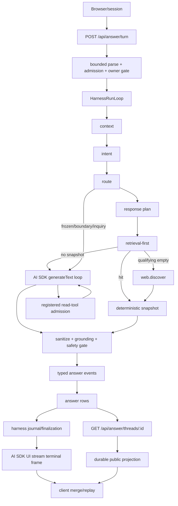
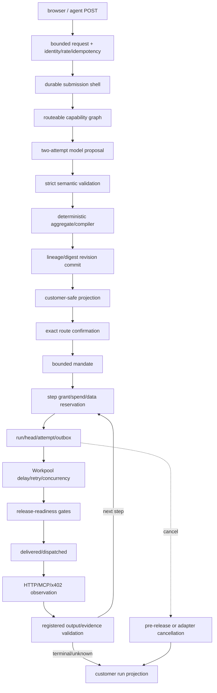
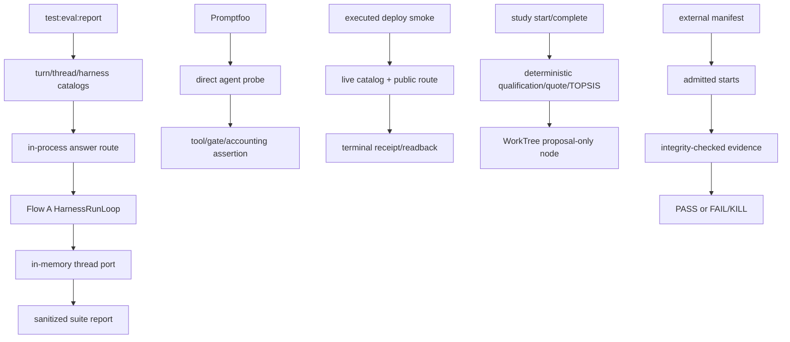

# PROMPT-DATA-FLOW — prompting, data-flow, and AI harness map

**Analysis date: 2026-08-02.** This is the current-source map and AI-runtime audit. It is deliberately
not a claim of hosted, provider, or customer success unless that evidence is named and observed.
Every implementation claim below cites a repository or installed-package path. No credential value,
request secret, or environment value is recorded.

## Reading contract and evidence ceilings

- **Source-shape evidence** means the checked-in TypeScript, Convex functions, deployment config, or
  installed package source cited in the row. It proves what the code is shaped to do, not that a
  deployment or provider accepted a request (`src/modules/model-gateway/public.ts:4-11`;
  `node_modules/ai/src/generate-text/generate-text.ts:299-491`).
- **Fixture evidence** means an in-process test port, mock provider, or deterministic seed. It can
  prove local protocol behavior and invariants, but cannot prove provider latency, hosted routing,
  or real customer value (`tests/helpers/answer-thread-test-port.ts:6-18,32-83`;
  `tests/helpers/openrouter-contract-server.ts:141-180`).
- **Hosted evidence** means an executed deployment smoke with a real base URL, terminal response,
  receipt, and durable readback. The smoke source defines this ceiling; an unexecuted test file is
  not hosted evidence (`tests/deploy-smoke/answer-runtime-production-smoke.spec.ts:34-95,205-251,353-426`).
- **Provider evidence** means a real provider response, usage/cost metadata, and request outcome.
  OpenRouter metadata can omit cost; `undefined` is not zero (`src/modules/model-gateway/public.ts:127-139`).
- **Customer evidence** means observed human journey completion and customer-value measures. No
  source map or local eval upgrades itself to customer evidence (`eval/answer/lib/suite.ts:120-151`;
  `tests/eval/answer-pipeline.test.ts:84-216`).
- **Evidence ceiling:** source-shape can establish boundaries and accounting code; fixtures can
  establish deterministic contracts; hosted/provider/customer claims require their own executed
  evidence packet. External benchmarks, package README claims, and generated metadata do not lift
  that ceiling (`node_modules/@convex-dev/workflow/README.md:8-38`;
  `node_modules/@convex-dev/workpool/src/client/index.ts:264-278`).

## Current stack and compatibility truth

| dependency/runtime | installed or declared fact | consequence |
|---|---|---|
| AI SDK | `ai@7.0.44`, ESM, provider-utils `5.0.16`, Node `>=22` (`node_modules/ai/package.json:1-10,44-48`; `package.json:60-63,90-123,156-159`) | Use the installed v7 API (`instructions`, `output`, `prepareStep`, `stopWhen`, `onStepEnd`); do not infer a newer API from online prose (`node_modules/ai/docs/03-agents/04-loop-control.mdx:8-21`; `node_modules/ai/docs/03-ai-sdk-core/65-lifecycle-callbacks.mdx:122-159`). |
| OpenRouter adapter | `@openrouter/ai-sdk-provider@3.0.0`, peer `ai ^7`, Node `>=22` (`node_modules/@openrouter/ai-sdk-provider/package.json:1-5,43-48`) | All four production model callsites use one AE gateway; SDK/provider own transport, while AE owns authority and validation (`src/modules/model-gateway/public.ts:4-11,98-124`). |
| Convex | `convex@1.42.0` (`package.json:90-97`; `node_modules/convex/package.json:1-10`) | Convex transactions/functions remain the durable source of truth; scheduled mutation and action guarantees differ (`node_modules/convex/src/server/scheduler.ts:17-29,125-147`). |
| Workflow | `@convex-dev/workflow@0.4.4` (`node_modules/@convex-dev/workflow/package.json:1-13`) | Used by Project Spine for durable wait/sleep/replay/cancel; it is not the customer-request authority or evidence contract (`convex/projectSpine.ts:1-104,142-164`). |
| Workpool | `@convex-dev/workpool@0.4.9` (`node_modules/@convex-dev/workpool/package.json:1-20`) | Used for route-transport action enqueue/retry/concurrency; cancellation of a running item allows it to finish and only suppresses retry (`node_modules/@convex-dev/workpool/src/client/index.ts:235-277`). |
| Agent component | No `@convex-dev/agent` declaration, lockfile entry, installed directory, or application import (`package.json:60-123`; `node_modules/@convex-dev`) | Adoption is **deferred**, not “installed but unused.” Generated Convex guidance is not installed-package parity evidence (`convex/_generated/ai/guidelines.md:320-323`). |
| Runtime source config | Nitro Vercel node entry pins `nodejs22.x` (`vite.config.ts:52-67`) | Matches package and AI SDK engine requirements. |
| Generated deployment metadata | Generated Nitro output also says `nodejs22.x` (`.vercel/output/nitro.json:17-26`); Vercel project settings separately say `nodeVersion: 24.x` (`.vercel/project.json:5-15`) | Treat project setting as a deployment configuration discrepancy to reconcile; source function runtime is 22.x. No secret values are copied into this map. |

## Maintenance contract

- The maintainer changing a prompt assembly site, model call, tool schema, route/gate, stream frame,
  durable journal, scheduler hop, projection, or package/runtime target updates this map in the
  same change (`.planning/codebase/ARCHITECTURE.md:1-160`).
- Each stage row records **input → processing → output → owner**. `lib` is an installed SDK/Convex
  primitive; `domain` is AE policy, authority, validation, evidence, or customer semantics; `base`
  is glue that can be replaced only with parity proof (`src/modules/common/action.ts:4-24`).
- AI SDK tool approvals, threads, traces, and generic agent histories are mechanics. They are not
  AE identity, spend authority, mandate, prepared effect, commit, evidence, projection, or recovery
  truth (`node_modules/ai/docs/03-ai-sdk-core/15-tools-and-tool-calling.mdx:159-168,243-265`;
  `src/modules/common/action.ts:76-115,164-187`).

## Flow A — public answer turn: request → plan → answer → persistence → UI

| stage | source evidence | input | processing | output | owner |
|---|---|---|---|---|---|
| request/session | `src/routes/api.answer.turn.ts:43-84`; `src/components/ae/chat/answer-stream.ts:8-82` | request body, cookie, optional thread/context/key | resolve pseudonymous session; bound and parse body; preload only the authorized thread | admitted request or typed HTTP error | base + domain |
| body bound | `src/routes/api.answer.turn.ts:34-56`; `src/lib/server/bounded-request-body.ts:11-75`; `src/modules/answer-thread/answer-thread.schema.ts:188-205` | raw bytes | 16 KiB body cap, JSON parse, schema validation | validated query/context or 413/400 | base |
| admission/access | `src/routes/api.answer.turn.ts:59-96`; `src/modules/answer-thread/internal/turn-guard.ts:6-27,40-90` | session, turn key, thread | 30 s idempotency claim, HTTP rate admission, session owner check, 25-turn cap; missing dev-remount thread resets to new thread | allowed access/preload or 403/404/429 | domain over base |
| UI stream | `src/routes/api.answer.turn.ts:98-140`; `src/modules/answer/answer-ui-stream.ts:17-68` | allowed request, abort signal | SDK frames SSE; AE writes only typed transient `data-answer-event`; abort suppresses later writes | no-store response and parsed AE frames | lib framing + base adapter |
| ordered harness | `src/modules/harness/harness.schema.ts:21-33`; `src/modules/harness/run-loop.ts:117-205` | initial runtime state | context → intent → route → retrieval → model → gate → assemble → persist; report runs once without normal guards after a failure | state, runtime events, report | base lifecycle |
| context | `src/modules/answer-thread/internal/turn-orchestrator.ts:225-245` | preloaded or durable prior turns | bounded complete-turn read; preserve empty preload for boundary explanation | prior turns/count | domain |
| intent/route | `src/modules/answer-thread/internal/turn-orchestrator.ts:246-313`; `src/modules/answer-thread/internal/intent-router.ts:14-45` | query, history, search context | precedence classification and exhaustive route selection | route kind and prior frozen evidence | domain |
| response plan | `src/modules/answer-thread/internal/answer-response-planner.ts:15-55,60-175` | query, prior count, context | classify clarify/answer/frozen modes; derive search, visible, artifact, and tool budgets | typed plan | domain |
| retrieval-first | `src/modules/answer-thread/internal/turns/retrieval-first.ts:44-183,265-323`; `src/modules/answer-thread/internal/tool-runner.ts:62-161` | plan/query/context | canonical `registry.search`; deterministic hit; qualifying location empty may call one registered `web.discover`; each call is admitted and recorded | snapshot, imported claims, tool records, or no snapshot | domain + base |
| model dispatch | `src/modules/answer-thread/internal/turn-orchestrator.ts:314-387`; `src/modules/answer-thread/internal/turns/frozen-known.ts:1-81`; `src/modules/answer-thread/internal/turns/inquiry-handoff.ts:1-130` | route and retrieval result | bypass model for deterministic/frozen/boundary branches; unresolved tool-search enters model loop | path result or model input | domain |
| prompt assembly | `src/modules/answer/internal/answer-llm-prompts.ts:44-129`; `src/modules/answer/internal/action-to-tool-spec.ts:8-69` | query, intent, prior public providers, tool policy | assemble instructions/user payload; expose canonical action-derived aliases and inert data; do not pass credentials or authority as prompt facts | instructions, user prompt, model tool specs | domain |
| SDK model loop | `src/modules/answer/internal/answer-tool-use-agent.ts:206-367,379-415` | gateway model, prompts, tools, abort | `generateText` + `Output.object`; serialized tool calls drain in emitted order; `prepareStep` removes tools for final prose; custom `stopWhen` allows one final tool-less structured step; `maxRetries: 0` | typed `AnswerProse`, tool records, provider-step observations | lib loop + domain budgets/schema |
| model accounting | `src/modules/answer/internal/answer-tool-use-agent.ts:255-284,417-449`; `src/modules/harness/run-collector.ts:404-448` | AI SDK `StepResult`/error | one model observation per provider step, usage/cost when present, explicit unavailable reason on failure; no outer duplicate request | private harness request records/timing | lib callback + base collector |
| tool admission | `src/modules/answer-thread/internal/tool-runner.ts:32-42,68-127,191-231`; `src/modules/actions/index.ts:52-120` | model tool alias/input | resolve canonical action; read-only allow-list; strict input/output schema check; execute once; extract providers/slugs; canonical result digest | buffered tool-call evidence and model-safe result JSON | domain |
| gates | `src/modules/answer-thread/internal/answer-turn-safety.ts:17-49`; `src/modules/answer/internal/answer-tool-use-agent.ts:135-203` | snapshot/prose, allowed slugs | sanitize, grounding, location, safety checks; reject or accept only a source-grounded snapshot | accepted snapshot + gate summary or typed error | domain |
| assembly | `src/modules/answer/answer-synthesizer.ts:119-171`; `src/modules/answer-thread/internal/turn-orchestrator.ts:432-447` | accepted snapshot/assembly plan | emit ordered plan, work, thinking, prose, sources, artifacts, next-step, terminal answer | transient AE event sequence | domain |
| durable persistence | `src/modules/answer-thread/internal/answer-turn-finalization.ts:137-253`; `convex/answerThreads.ts:150-338` | snapshot/error, evidence, tool calls, source write request | canonical snapshot/evidence hashes; atomically create/append thread and turn/tool rows; persist error evidence too | `answerThreads`, `answerTurns`, `answerToolCalls` | domain + Convex base |
| report/finalize | `src/modules/answer-thread/internal/turn-orchestrator.ts:449-526`; `src/modules/answer-thread/internal/answer-turn-finalization.ts:256-325,431-630`; `convex/harnessSessions.ts:186-447` | persisted turn and runtime events | journal mapped events; finalization hash binds snapshot/run/entries; only accepted/replayed finalization permits terminal completion | private harness journal and finalized evidence | domain + base |
| public readback | `src/routes/api.answer.threads.$threadId.ts:11-29`; `convex/answerThreads.ts:598-621`; `src/modules/answer-thread/internal/public-projection.ts:45-101` | durable rows | public query reads capped turns and builds redacted projection; no raw evidence/tool payload | public thread projection | domain projection |
| client convergence | `src/components/ae/chat/answer-turn-state.ts:40-176`; `src/components/ae/chat/AeChat.tsx:300-380,620-669` | optimistic stream + GET projection | merge/dedupe by turn/sequence; durable readback wins after reload | converged UI transcript | base React + domain |

**Flow A invariants.** Direct registry hits and qualifying empty states can complete with zero model
requests; the model path is not an authority path (`src/modules/answer-thread/internal/turns/retrieval-first.ts:74-183`; `eval/answer/lib/cases.ts:204-241,286-313`).
Writes never enter the answer read-tool set (`src/modules/answer-thread/internal/tool-runner.ts:68-82`; `src/modules/common/action.ts:139-187`). The local test port is a fixture and omits production
Convex tool-call rows; production has the three-row contract (`tests/helpers/answer-thread-test-port.ts:18-83`; `convex/answerThreads.ts:150-238`).

## Flow B — Customer Request V2: intake → interpretation → plan → execution → projection

| stage | source evidence | input | processing | output | owner |
|---|---|---|---|---|---|
| transports | `src/routes/api.requests.ts:1-7`; `src/routes/api.v1.requests.ts:1-7`; `src/lib/server/customer-request-browser-api.ts:42-57,127-143`; `src/lib/server/customer-request-agent-api.ts:42-59` | browser or agent request | route browser, authenticated, and signed service assertions into one application boundary | common command | base |
| admission | `src/lib/server/customer-request-api.ts:19-47`; `src/lib/server/customer-request-route-action-api.ts:43-93` | raw request | bounded body, strict schema, sensitive-input refusal, rate/identity/idempotency projection | admitted application input or typed refusal | base + domain |
| submission shell | `convex/customerRequestApplication.ts:697-768`; `convex/customerRequestV2.ts:146-218` | command/authority/digest | reserve durable shell before provider work; replay/conflict checks | shell, replay, or refusal | domain + Convex base |
| capability graph | `src/modules/customer-request/application/interpret-compile/graph.ts:22-90`; `convex/customerRequestApplication.ts:1768-1791` | network id | load exact descriptors, decision models, bindings, and registry digest | bounded graph snapshot | domain |
| proposal ladder | `src/modules/customer-request/application/interpret-compile/interpret.ts:76-118,120-203` | intent/amendment/graph | exactly two attempts; reload graph; retry proposal or retryable compile admission; no-key deterministic interpreter can be selected by configuration | model/deterministic proposal or refusal | domain |
| structured transport | `src/modules/customer-request/openrouter-transport.ts:31-116` | system instruction, serialized payload, response schema, abort | AI SDK `generateText` + `Output.object`; request/attempt timeout; provider error taxonomy; one retry | wire object or typed provider failure | lib transport + base adapter |
| semantic validation | `src/modules/customer-request/semantic-interpreter.ts:128-236,242-333` | tolerant wire object | payload/response byte bounds; normalized response; strict Zod proposal schema; canonical statements and digests | typed proposal + interpretation evidence | domain |
| deterministic compile | `src/modules/customer-request/compiler.ts:231-410,418-433` | proposal, exact models/bindings, prior facts | validate opaque keys/facts; derive criteria; compose actions/dependencies/routes; refuse incompatible/unknown-cost routes; bind `proposal_only` authority | aggregate/plan/generation or refusal | domain |
| commit | `src/modules/customer-request/application/interpret-compile/compile.ts:1-153`; `src/modules/customer-request/v2-write/commit-aggregate.ts:11-154`; `convex/customerRequestV2WritePorts.ts:60-216` | aggregate, expected lineage, command digest | replay/conflict/current graph checks; write revision/head/command | stored/replayed current request | domain + Convex base |
| decision projection | `src/modules/customer-request/application/route-plan-projection/project-plans.ts:12-68`; `src/modules/customer-request/route-plan-customer-projection.ts:93-162` | generation/material/names/semantics | validate and project routes, changes, influence, recovery, available actions | customer-safe decision | domain |
| confirmation/mandate | `src/modules/customer-request/application/confirm-route/confirm.ts:11-77`; `src/modules/customer-request/route-mandate-mutation/issue.ts:11-170`; `convex/customerRequestRouteMandatePorts.ts:242-318` | exact displayed revision/route, authority, idempotency | freshness/current graph/known-cost/authorization checks; persist confirmation and mandate without starting work | receipt + bounded mandate | domain |
| grant | `convex/customerRequestRouteMandateAdmission.ts:60-145,199-263`; `src/modules/customer-request/internal/route-mandate-convex-schema.ts:431-488` | mandate, exact step/supply/contract | scope, cumulative spend, data reservation, idempotency | admitted/replayed grant | domain |
| run journal | `src/modules/customer-request/route-execution/machines/start-or-resume.ts:7-187`; `convex/customerRequestRouteExecutionJournalPorts.ts:279-373` | active mandate/principal/key | replay/resume/cancel-prior checks; materialize input; write run/head/queued attempt/pending outbox/command | pending dispatch | domain + Convex base |
| Workpool seam | `convex/customerRequestRouteExecutionJournalPorts.ts:110-126`; `convex/customerRequestRouteWorkpool.ts:1-10`; `node_modules/@convex-dev/workpool/src/client/index.ts:83-108,142-164,361-400` | committed dispatch ref | delay, max parallelism 32, action retry up to 3, completion mutation | transport worker | lib queue |
| release/transport | `convex/customerRequestRouteExecutionDispatchPorts.ts:20-181`; `src/modules/customer-request/route-execution/machines/mark-dispatched.ts:7-77`; `convex/customerRequestRouteTransportWorker.ts:66-198` | pending attempt, mandate, readiness | recheck authority/readiness; mark release; execute HTTP/MCP/x402 adapter; capture bounded untrusted observation | delivered/dispatched + observation | domain + transport base |
| outcome/loop | `src/modules/customer-request/route-execution/machines/record-outcome.ts:7-94`; `convex/customerRequestRouteExecutionJournalPorts.ts:389-473,646-783` | attempt, observation, registered output/evidence | validate disposition/output; invalid released output becomes unknown; materialize/re-admit next step | terminal, advanced, unknown, failed, or replayed | domain |
| cancellation | `src/modules/customer-request/route-execution/machines/cancel-current.ts:16-86`; `convex/customerRequestRouteExecutionCancelPorts.ts:89-188`; `convex/customerRequestRouteCancellationWorker.ts:13-74`; `src/modules/customer-request/route-execution/machines/cancel-resolve-attempt.ts:7-50` | request/principal/key/mode | queued pending cancels immediately; active adapter records pending cancellation and uses scheduler worker; too-late is explicit | cancelled/pending/too-late/replayed | domain + scheduler base |
| customer projection | `src/modules/customer-request/application/route-plan-projection/project-run.ts:64-149`; `convex/customerRequestRouteExecution.ts:105-180,568-579` | stored run/aggregate | map progress, outcomes, attention, and cancellation state | customer action status/result | domain projection |

**Flow B authority invariant.** A model proposal may name opaque registered capabilities and facts, but
cannot construct routes, calls, approvals, effects, completion evidence, or provider choices; the
compiler and mandate gates do that deterministically (`src/modules/customer-request/semantic-interpreter.ts:208-234`; `src/modules/customer-request/compiler.ts:264-370`; `src/modules/common/action.ts:164-187`).

## Flow C — eval, Promptfoo probe, study, and external-run protocols

| stage | source evidence | input | processing | output | owner |
|---|---|---|---|---|---|
| suite runner | `package.json:41-44`; `eval/answer/scripts/run-suite.ts:1-40` | suite config/output path | run suite; write sanitized report; nonzero exit on `ok=false` | `answer-eval-suite-report` JSON | base eval |
| cases/coverage | `eval/answer/lib/cases.ts:142-186,204-313`; `eval/answer/lib/coverage.ts:61-148` | turn/thread/harness declarations | encode exact model/tool counts, phases, public-copy and evidence assertions | executable case catalog | domain eval |
| in-process route | `eval/answer/lib/evaluators.ts:127-151,463-628,658-837`; `tests/helpers/answer-turn-stream.ts:3-20` | deterministic seed/request | isolate local registry and Convex URL; parse frames; measure monotonic request clocks; drain terminal response; read harness report | fixture result with finite metrics | base seam + domain |
| score/report | `eval/answer/lib/suite.ts:38-76,120-218,325-398`; `eval/answer/scripts/run-suite.ts:9-40` | case outcomes | aggregate counts, usage/cost evidence, route p95/max descriptions, redacted score | report + process status | domain eval |
| Promptfoo probe | `eval/answer/promptfooconfig.yaml:152-182`; `eval/answer/providers/gate.mjs:7-26`; `eval/answer/lib/evaluators.ts:957-1051` | vars + fixture server | direct `runAnswerToolUseAgent`; bypass route/harness/persistence | model/tool/gate assertion only | eval probe |
| hosted smoke | `tests/deploy-smoke/answer-runtime-production-smoke.spec.ts:34-95,205-251,353-426`; `src/lib/dev/local-e2e-business-fixtures.ts:32-142` | deployment URL and selected public catalog | exclude development fixture slugs; exact public query and bounded recovery; require terminal citations and readback | deployment-only proof when executed | hosted eval |
| study | `src/modules/study/study.actions.ts:45-113`; `src/modules/study/internal/pipeline.ts:39-87,108-211,253-429`; `src/modules/study/internal/topsis.ts:65-151` | fenced study and registry/web material | qualify listed supply; verify quote/evidence; deterministic score/TOPSIS; refuse unsupported claims | StudyArtifact/journal or refusal | domain |
| study persistence | `convex/studies.ts:164-252`; `src/modules/work-tree/internal/verbs.ts:223-254` | pipeline result | persist study, then apply proposal-only WorkTree decision; replay durable events | study and proposal node | domain + base |
| external run | `convex/externalRuns.ts:66-251,252-363`; `src/modules/external-run/internal/gate.ts:160-297` | frozen manifest, authority, starts, evidence | integrity/replay checks; admitted starts/evidence; deterministic final gate | exact `PASS` or `FAIL/KILL` | domain + Convex base |

**Flow C protocol invariant.** Eval `ok`, study recommendation/refusal, and external `PASS | FAIL/KILL`
are separate trust domains. They do not convert into one another (`eval/answer/lib/suite.ts:120-151`;
`src/modules/study/internal/pipeline.ts:253-429`; `src/modules/external-run/internal/gate.ts:250-297`).

## Direct model, prompt, tool, and stream callsite inventory

| callsite | prompt assembly | installed primitive | boundary and evidence |
|---|---|---|---|
| answer tool agent | `buildToolUseAgentSystemPrompt` + `buildToolUseAgentUserPrompt`; canonical action specs (`src/modules/answer/internal/answer-llm-prompts.ts:44-113`; `src/modules/answer/internal/action-to-tool-spec.ts:46-69`) | `generateText`, `Output.object`, `tool`, `prepareStep`, `stopWhen`, `onStepEnd` (`src/modules/answer/internal/answer-tool-use-agent.ts:293-357`) | read-only action admission, sequential budget/evidence drain, final gate, one request record per SDK step (`src/modules/answer-thread/internal/tool-runner.ts:32-42,68-161`; `src/modules/answer/internal/answer-tool-use-agent.ts:255-284,421-449`) |
| follow-up chips | dedicated system/user prompt from query and public provider sources (`src/modules/answer/internal/answer-llm-prompts.ts:115-129`) | `generateText` + `Output.object` (`src/modules/answer-thread/internal/llm-follow-up-chips.ts:46-61`) | absent key or provider error returns no chips; output is capped to three AE-valid chips (`src/modules/answer-thread/internal/llm-follow-up-chips.ts:63-78`) |
| Customer Request semantic interpreter | versioned instruction + public capability descriptors; opaque keys and untrusted data policy (`src/modules/customer-request/semantic-interpreter.ts:208-236,257-283`) | `generateText` + `Output.object`, timeout, abort, one retry (`src/modules/customer-request/openrouter-transport.ts:64-116`) | tolerant wire shape is followed by strict domain schema, byte bounds, canonical digests, and proposal-only compile (`src/modules/customer-request/semantic-interpreter.ts:128-206,287-333`; `src/modules/customer-request/compiler.ts:231-370`) |
| storefront enrichment/discovery | versioned source-grounding instructions + business/query prompt (`src/modules/storefront/internal/business-enrichment.ts:89-118,155-225`) | `generateText` with OpenRouter JSON mode/web plugin, timeout, one retry (`src/modules/storefront/internal/business-enrichment.ts:261-305`) | every accepted claim must cite a returned URL; enrichment remains `draft_unconfirmed`, never publishes (`src/modules/storefront/internal/business-enrichment.ts:27-35,229-255,382-446`) |
| answer HTTP stream | no model prompt; route emits only AE typed transient data part (`src/routes/api.answer.turn.ts:98-140`) | `createUIMessageStream` + `createUIMessageStreamResponse` | SDK owns SSE framing; AE owns payload, abort behavior, admission and persistence (`src/modules/answer/answer-ui-stream.ts:17-68`) |
| registered read tools | model-facing aliases derived from action metadata; canonical IDs remain server-side (`src/modules/actions/index.ts:52-109`; `src/modules/answer/internal/action-to-tool-spec.ts:8-15`) | AI SDK `tool` wrapper with custom input validation adapter (`src/modules/answer/internal/answer-tool-use-agent.ts:371-415`) | model input is not authority; action contracts declare effect/authority/retry/evidence and runner enforces them (`src/modules/common/action.ts:139-187,216-284`; `src/modules/answer-thread/internal/tool-runner.ts:68-127`) |

**Callsite completeness check.** The production source inventory contains four `generateText` model
call families plus the answer UI stream; no production import uses `ToolLoopAgent`, `streamText`,
`createAgentUIStream`, or SDK approval/telemetry integrations (`src/modules/answer/internal/answer-tool-use-agent.ts:1-12`; `src/modules/answer-thread/internal/llm-follow-up-chips.ts:1-12`; `src/modules/customer-request/openrouter-transport.ts:1-17`; `src/modules/storefront/internal/business-enrichment.ts:1-12`; `src/routes/api.answer.turn.ts:1-8`). Test imports are fixtures, not additional runtime callsites (`tests/unit/answer/answer-tool-use-agent.test.ts:1-40`; `tests/unit/answer-thread/follow-up-chips.test.ts:1-24`).

## Library-adoption matrix

| mechanism | verdict | retain/replace boundary | source proof |
|---|---|---|---|
| model HTTP/provider transport | **replace-with-library / retained** | AI SDK + OpenRouter own request shaping, retries, typed provider errors, abort, usage; AE keeps gateway config and fail-closed credential policy | `src/modules/model-gateway/public.ts:4-11,28-38,98-124`; `node_modules/ai/package.json:1-10,44-48` |
| structured output parsing | **replace-with-library / retained** | `Output.object` validates final generated object; AE still performs semantic normalization, strict business invariants, and proposal compile | `node_modules/ai/docs/03-ai-sdk-core/10-generating-structured-data.mdx:11-23,25-56`; `src/modules/customer-request/semantic-interpreter.ts:287-333` |
| answer tool loop | **replace-with-library / retained** | `generateText` loop, `prepareStep`, `stopWhen`, `onStepEnd` are SDK mechanics; AE retains tool sequencing, budget, evidence, gate, and finalization | `node_modules/ai/docs/03-agents/04-loop-control.mdx:8-21,147-221`; `src/modules/answer/internal/answer-tool-use-agent.ts:221-240,328-367` |
| `ToolLoopAgent` | **defer** | Installed source offers reusable loop defaults and callbacks, but it is not used; adoption requires parity for AE run IDs, one-step accounting, tool order, final-step tool removal, abort, and harness failure semantics | `node_modules/ai/src/agent/tool-loop-agent.ts:34-68,120-180`; `src/modules/answer/internal/answer-tool-use-agent.ts:328-357,421-449` |
| SDK `toolApproval` | **simplify/defer for answer reads** | Read tools are deterministic public-read actions. Do not treat SDK approval as AE authority; writes use source-write admission/mandates and are not answer tools | `node_modules/ai/docs/03-ai-sdk-core/15-tools-and-tool-calling.mdx:159-168,243-265`; `src/modules/common/action.ts:10-18,89-100`; `src/modules/answer-thread/internal/tool-runner.ts:68-82` |
| UI stream framing | **replace-with-library / retained** | SDK owns SSE/UI lifecycle framing and AE owns `data-answer-event` payload, redaction, and terminal semantics | `node_modules/ai/src/ui-message-stream/create-ui-message-stream.ts:1-150`; `src/routes/api.answer.turn.ts:98-140`; `src/modules/answer/answer-ui-stream.ts:17-68` |
| model lifecycle telemetry | **simplify** | Use `onStepEnd` and harness collector for one provider-step observation; do not add OTel until a deployment trace contract is required and redaction/identity parity is proven | `node_modules/ai/docs/03-ai-sdk-core/65-lifecycle-callbacks.mdx:8-20,122-159`; `src/modules/harness/run-collector.ts:404-448` |
| semantic model transport | **replace-with-library / retained** | AI SDK call/timeout/retry; AE owns tolerant wire normalization, strict domain schema, evidence digests, and two-attempt compile | `src/modules/customer-request/openrouter-transport.ts:64-116`; `src/modules/customer-request/application/interpret-compile/interpret.ts:120-203` |
| `@convex-dev/agent` | **defer** | Not installed or declared; no parity proof for AE projection, source-write authority, evidence, or AI SDK v7 peers | `package.json:60-123`; `node_modules/@convex-dev`; `src/modules/answer-thread/internal/answer-turn-finalization.ts:150-325` |
| Workflow | **replace-with-library / retained at durable wait seam** | Use component for durable steps, event waits, sleeps, replay, status, cancel/restart; keep Project Spine/customer authority and evidence rows in AE | `node_modules/@convex-dev/workflow/README.md:8-38,96-105`; `node_modules/@convex-dev/workflow/src/client/index.ts:159-260`; `convex/projectSpine.ts:53-104,142-164` |
| Workpool | **replace-with-library / retained at async dispatch seam** | Use enqueue/retry/concurrency/status/cancel mechanics; keep durable route state, effect release, observation validation, and outcome commit in AE | `node_modules/@convex-dev/workpool/src/client/index.ts:83-108,142-164,235-277,371-400`; `convex/customerRequestRouteExecutionJournalPorts.ts:110-126` |
| native scheduler | **retain-domain adapter** | Use native scheduling for cancellation worker/readiness where action/mutation guarantees are materially different; never infer action exactly-once from scheduled mutation semantics | `node_modules/convex/src/server/scheduler.ts:17-29,125-147`; `convex/customerRequestRouteExecutionCancelPorts.ts:89-188` |
| action/tool descriptor conversion | **replace-with-library only for conversion** | `@tanstack/ai` converts schemas; canonical action registry, effect metadata, surfaces, and source-write boundaries remain AE | `src/modules/common/action.ts:1-24,244-284`; `src/modules/actions/index.ts:1-12,94-120` |

**Installed-source contradiction.** The Workpool client’s status type is only `pending`, `running`, or
`finished`; no `statusTtl` option exists in its installed `WorkpoolOptions` surface. README wording or
a future package cannot be used to design retention here (`node_modules/@convex-dev/workpool/src/client/index.ts:264-278,371-400`).

## Target seams and ownership boundaries

| target seam | library side | AE-owned side | parity gate |
|---|---|---|---|
| model gateway | provider factory, request encoding, SDK errors/abort/usage (`src/modules/model-gateway/public.ts:1-11,98-139`) | model selection policy, credential refusal, cost-unavailable taxonomy, callsite budgets | provider request fixtures plus one real receipt with redacted metadata |
| prompt/input | SDK accepts `instructions`, `prompt`, tool specs, output schemas (`node_modules/ai/src/generate-text/generate-text.ts:299-491`) | versioned instructions, bounded/inert payload, public copy, no authority encoded as text (`src/modules/answer/internal/answer-llm-prompts.ts:44-129`; `src/modules/customer-request/semantic-interpreter.ts:208-236`) | prompt snapshot + injection/fuzz cases |
| tools/actions | AI SDK `tool` execution and loop mechanics (`node_modules/ai/docs/03-ai-sdk-core/15-tools-and-tool-calling.mdx:8-21`) | registry, canonical IDs, authority/effect metadata, source-write admission, schema/evidence and digest (`src/modules/common/action.ts:139-187,216-284`; `src/modules/actions/index.ts:52-109`) | unknown/malformed/write/refused tool cases |
| answer harness | AI SDK step callbacks and structured output (`node_modules/ai/docs/03-ai-sdk-core/65-lifecycle-callbacks.mdx:122-159`) | run identity, ordered phases, budgets, status dominance, report/finalization, redacted journal (`src/modules/harness/run-loop.ts:158-205,225-251`; `src/modules/answer-thread/internal/answer-turn-finalization.ts:256-325`) | exact one-record-per-provider-step and failure/replay cases |
| durable workflow | Workflow step/event/sleep/restart/cancel (`node_modules/@convex-dev/workflow/src/client/index.ts:218-306`) | customer request revision/head/mandate/grant/outbox/effect/output/evidence semantics (`convex/customerRequestRouteExecutionJournalPorts.ts:141-153,389-473`) | restart/cancel/replay with authority and lineage checks |
| async dispatch | Workpool bounded queue/retry/status/cancel (`node_modules/@convex-dev/workpool/src/client/index.ts:235-277`) | release gates, provider invocation attribution, output validation, next-step admission, unknown outcome (`convex/customerRequestRouteExecutionDispatchPorts.ts:20-181`; `src/modules/customer-request/route-execution/machines/record-outcome.ts:7-94`) | action retry and duplicate provider-result fixtures |
| public projection | Convex query/reactive read mechanics (`convex/answerThreads.ts:598-621`; `convex/customerRequestRouteExecution.ts:568-579`) | redaction, source provenance, customer copy, public schema, no raw model/tool documents (`src/modules/answer-thread/internal/public-projection.ts:45-101`; `src/modules/customer-request/application/route-plan-projection/project-run.ts:64-149`) | readback parity and forbidden-field scan |

## Justified hand-rolling register

1. **Answer route taxonomy and retrieval-first policy** — product semantics decide when a query is
   clarifiable, searchable, frozen, boundary, inquiry, or unsupported; an agent library cannot know
   AE’s catalog and copy contract (`src/modules/answer-thread/internal/answer-response-planner.ts:107-175`; `src/modules/answer-thread/internal/intent-router.ts:14-45`; `src/modules/answer-thread/internal/turns/retrieval-first.ts:44-183`).
2. **Action registry and authority metadata** — one action declaration fans out across UI/HTTP/agent/MCP
   surfaces, while source-write admission and principal authority remain transport-bound (`src/modules/common/action.ts:4-24,216-284`; `src/modules/actions/index.ts:1-12,52-120`).
3. **Deterministic proposal compiler and route gates** — model output is untrusted; exact opaque keys,
   graph lineage, cost, dependency, evidence, mandate, and release checks are customer safety policy
   (`src/modules/customer-request/compiler.ts:231-410`; `convex/customerRequestRouteMandateAdmission.ts:60-145,199-263`).
4. **Harness evidence/finalization** — the one-to-one provider-step accounting, run status, canonical
   hashes, private journal, and public redaction are AE’s audit contract (`src/modules/harness/harness.schema.ts:77-182`; `src/modules/answer-thread/internal/answer-turn-finalization.ts:164-193,271-325`).
5. **Prepared effects, commits, and recovery** — Workpool/Workflow can schedule or retry, but cannot
   decide whether an effect is authorized, released, reconciled, or customer-visible (`src/modules/common/action.ts:164-187`; `src/modules/customer-request/route-execution/machines/start-or-resume.ts:7-187`; `src/modules/customer-request/route-execution/machines/cancel-current.ts:16-86`).
6. **Public projections and customer copy** — projection builders deliberately reconstruct redacted
   artifacts from frozen evidence; generic thread/message storage is not customer truth (`src/modules/answer-thread/internal/public-projection.ts:45-101`; `convex/answerThreads.ts:598-621`).

## Deletion and simplification candidates

These are bounded candidates, not edits performed by this map refresh.

| candidate | why it can be deleted/simplified | guard before deletion |
|---|---|---|
| legacy answer read fallback | `answer-thread.functions` still has a compatibility read fallback while optimized source functions are current (`src/modules/answer-thread/answer-thread.functions.ts:237-301,394-416`) | remove only after legacy host/function support is proven absent in all hosted environments |
| duplicate `AnswerSynthesizer` implementation surface | The type/contract file remains while the ordered orchestrator and turn paths assemble snapshots (`src/modules/answer/answer-synthesizer.ts:7-33,119-171`; `src/modules/answer-thread/internal/turn-orchestrator.ts:432-447`) | migrate exported callers and preserve public event/projection types before deleting names |
| bespoke loop if SDK agent parity arrives | Current hand loop adds AE-specific accounting and final-step tool removal (`src/modules/answer/internal/answer-tool-use-agent.ts:328-367,421-449`) | only replace with `ToolLoopAgent` after exact callback, abort, order, budget, evidence, and failure/replay parity fixtures |
| local test persistence port | It is intentionally in-memory and does not prove Convex durability (`tests/helpers/answer-thread-test-port.ts:6-18,104-133`) | never delete until an equivalent deterministic test seam covers route/harness assertions |
| semantic JSON salvage | `NoObjectGeneratedError.text` salvage preserves a known failure taxonomy (`src/modules/customer-request/semantic-interpreter.ts:287-302`) | delete only after provider/version fixtures prove no usable response is lost |
| flat OpenRouter parameter projection | It looks duplicate beside full Zod schemas, but the model surface and server validation have different contracts (`src/modules/answer/internal/action-to-tool-spec.ts:35-69`) | retain unless provider schema parity proves constraints can move without changing refusals |

## Proposed SLOs (release targets, not current measurements)

All numbers below are **[PROPOSED]** targets derived from existing hard bounds and eval assertions;
none is presented as an observed production metric (`src/routes/api.answer.turn.ts:34-69`; `src/modules/answer-thread/internal/turn-orchestrator.ts:129-148`; `eval/answer/lib/cases.ts:216-240,264-283`).

| SLO | proposed target | measurement/evidence |
|---|---|---|
| request admission | 100% reject over-bound/invalid bodies; body ≤16 KiB; duplicate turn key does not re-admit within 30 s | route response tests and bounded-body fixtures (`src/lib/server/bounded-request-body.ts:11-75`; `src/modules/answer-thread/internal/turn-guard.ts:6-27`) |
| direct retrieval cost | 100% of direct-hit/qualifying-empty fixtures use zero model requests; one initial registry call plus at most one discovery call | answer case exact counts/tool IDs (`eval/answer/lib/cases.ts:204-313`) |
| model loop | no turn exceeds configured tool-call/step cap; final prose has no active tools; provider failures become harness evidence | loop `maxToolCalls`, `isStepCount`, `prepareStep`, and accounting (`src/modules/answer/internal/answer-tool-use-agent.ts:99-103,328-367`) |
| answer integrity | 100% accepted snapshots pass sanitization, grounding, and gate; no public projection exposes raw evidence/tool payload | gate/projection fixtures (`src/modules/answer-thread/internal/answer-turn-safety.ts:17-49`; `src/modules/answer-thread/internal/public-projection.ts:45-101`) |
| persistence/finalization | 100% successful source-write turns have accepted/replayed finalization before terminal complete; replay with same hashes is idempotent | orchestrator/finalizer and Convex journal (`src/modules/answer-thread/internal/turn-orchestrator.ts:493-525`; `convex/harnessSessions.ts:186-447`) |
| customer request authority | 0 released attempts without current mandate/grant/readiness checks; 0 model-selected direct effects | action metadata and dispatch gates (`src/modules/common/action.ts:164-187`; `convex/customerRequestRouteExecutionDispatchPorts.ts:96-181`) |
| cancellation | queued pending work cancels deterministically; active adapter state is explicit pending/accepted/rejected/unknown; no claim of provider interruption without adapter evidence | cancellation state machine/worker (`convex/customerRequestRouteExecutionCancelPorts.ts:89-188`; `convex/customerRequestRouteCancellationWorker.ts:13-74`) |
| eval timing | all reported clocks finite; p95/max remain descriptive until a hosted transfer study exists | eval evaluator/suite (`eval/answer/lib/evaluators.ts:463-628`; `eval/answer/lib/suite.ts:325-398`) |

## Evaluation ladder

1. **Static source-shape:** verify every model callsite goes through the gateway, every answer tool
   resolves the canonical action registry, no write action enters the answer tool set, and every map
   citation remains resolvable (`src/modules/model-gateway/public.ts:4-11`; `src/modules/actions/index.ts:52-109`; `src/modules/answer-thread/internal/tool-runner.ts:68-82`; `tests/unit/planning/prompt-data-flow-map.test.ts:14-57`).
2. **Schema/prompt fixtures:** malformed model JSON, unknown keys, prompt injection in capability
   descriptors, invalid tool inputs/outputs, and ungrounded claims must refuse without side effects
   (`src/modules/customer-request/semantic-interpreter.ts:208-236,287-333`; `src/modules/answer-thread/internal/tool-runner.ts:80-91`; `src/modules/answer-thread/internal/answer-turn-safety.ts:17-49`).
3. **Model-loop fixtures:** direct retrieval zero-call; visible typo recovery exact two requests/two
   tools; final structured prose; abort/timeout/error accounting; cost-unavailable reason required
   (`eval/answer/lib/cases.ts:204-313`; `tests/unit/answer/answer-tool-use-agent.test.ts:120-180`; `src/modules/answer/internal/answer-tool-use-agent.ts:255-284,417-449`).
4. **Route/harness integration:** exercise request admission → stream → persistence → journal →
   readback with in-memory ports and assert exact phase/status/evidence parity (`eval/answer/lib/evaluators.ts:127-151,658-837`; `tests/helpers/answer-thread-test-port.ts:18-133`).
5. **Convex durability/recovery:** run route execution retries, duplicate commands, release/output
   mismatches, next-step admission, cancellation, and projection readback against Convex functions
   (`convex/customerRequestRouteExecutionJournalPorts.ts:141-153,389-473,646-783`; `convex/customerRequestRouteExecutionCancelPorts.ts:89-188`).
6. **Provider evidence:** record real OpenRouter request/response IDs, usage, finish reason, and cost
   or explicit unavailable reason; never infer provider parity from mock servers (`src/modules/model-gateway/public.ts:127-139`; `src/modules/answer/internal/answer-tool-use-agent.ts:255-284`; `tests/helpers/openrouter-contract-server.ts:141-180`).
7. **Hosted transfer:** execute deployment smoke against a clean public catalog, require terminal
   response plus fresh durable readback/receipt, and keep development fixtures excluded (`tests/deploy-smoke/answer-runtime-production-smoke.spec.ts:205-251,353-426`).
8. **Customer value:** instrument human completion, correction, inquiry handoff, cancellation, and
   provider/customer outcome studies; do not convert eval score or provider latency into customer
   value without a transfer design (`eval/answer/lib/suite.ts:120-151`; `src/modules/study/internal/pipeline.ts:253-429`).

## Migration sequence

1. **Freeze inventory:** keep this callsite/entropy map current and resolve the source-runtime
   `nodejs22.x` versus Vercel project `24.x` setting discrepancy before changing deployment targets
   (`vite.config.ts:57-67`; `.vercel/output/nitro.json:17-26`; `.vercel/project.json:5-15`).
2. **Harden shared seams:** preserve the OpenRouter gateway, AI SDK structured output, action registry,
   harness one-step accounting, bounded requests, and source-write gates; add parity fixtures before
   replacement (`src/modules/model-gateway/public.ts:98-139`; `src/modules/common/action.ts:216-284`; `src/modules/harness/run-loop.ts:158-205`).
3. **Keep answer loop mechanical:** do not introduce `@convex-dev/agent` or `ToolLoopAgent` while
   package/API peers and durable projection parity are absent (`package.json:60-123`; `node_modules/ai/src/agent/tool-loop-agent.ts:120-180`).
4. **Pilot durable Workflow only where it deepens waits/replay:** Project Spine already proves the
   component seam; do not move customer request authority, mandates, or evidence into generic
   workflow history (`convex/projectSpine.ts:61-104,142-164`; `node_modules/@convex-dev/workflow/README.md:20-35`).
5. **Retain Workpool for route transport:** preserve committed outbox → enqueue → release checks →
   outcome commit; do not let retries bypass idempotency or authority (`convex/customerRequestRouteExecutionJournalPorts.ts:110-126`; `src/modules/customer-request/route-execution/machines/record-outcome.ts:7-94`).
6. **Add hosted/provider transfer evidence:** run source/fixture gates first, then one clean hosted
   smoke and one provider receipt; only then revise proposed SLOs (`tests/deploy-smoke/answer-runtime-production-smoke.spec.ts:34-95`; `src/modules/model-gateway/public.ts:127-139`).
7. **Customer study:** after hosted parity, measure customer completion and correction loops through
   the existing study/external-run protocols; no architecture primitive substitutes for this evidence
   (`src/modules/study/internal/pipeline.ts:65-87`; `convex/externalRuns.ts:252-357`).

## Rejected alternatives

| alternative | rejection reason |
|---|---|
| install `@convex-dev/agent` now | absent from manifest/install and no AI SDK v7/thread/projection/evidence parity proof; generic history cannot become AE customer truth (`package.json:60-123`; `node_modules/@convex-dev`; `src/modules/answer-thread/internal/answer-turn-finalization.ts:256-325`) |
| replace answer loop with `ToolLoopAgent` immediately | would change loop defaults/callback surface and could hide AE’s one-provider-step accounting, ordered tool evidence, final tool-less step, and abort/failure semantics (`node_modules/ai/src/agent/tool-loop-agent.ts:34-68,120-180`; `src/modules/answer/internal/answer-tool-use-agent.ts:221-240,328-367,421-449`) |
| use SDK `toolApproval` as payment/mandate authority | SDK approval is a model-call protocol and can emit a two-call manual approval flow; it does not validate principal, spend, prepared effect, release, or reconciliation (`node_modules/ai/docs/03-ai-sdk-core/15-tools-and-tool-calling.mdx:243-265`; `src/modules/common/action.ts:164-187`; `convex/customerRequestRouteMandateAdmission.ts:60-145`) |
| move all async work to native scheduler | scheduled actions are at-most-once while scheduled mutations are exactly-once; route transport, cancellation, and effect commit need different seams (`node_modules/convex/src/server/scheduler.ts:21-29,125-147`; `convex/customerRequestRouteExecutionJournalPorts.ts:110-126`) |
| use generic public threads as durable authority | answer public projection is redacted and source-write/finalization binds hashes; generic messages lack these AE gates (`src/modules/answer-thread/internal/public-projection.ts:45-101`; `convex/harnessSessions.ts:186-447`) |
| claim local eval proves hosted/provider/customer success | local ports and mock provider are fixture/source evidence; hosted/provider/customer evidence require executed receipts and transfer study (`tests/helpers/answer-thread-test-port.ts:18-133`; `tests/helpers/openrouter-contract-server.ts:141-180`; `tests/deploy-smoke/answer-runtime-production-smoke.spec.ts:34-95`) |

## Entropy ledger — dissipative structures to eliminate or justify

| id | finding | current status and action | evidence |
|---|---|---|---|
| A1 | retrieval may search registry before model recovery searches again | **accepted deterministic-first policy**; revisit only if observed budget/latency drift | `src/modules/answer-thread/internal/turns/retrieval-first.ts:59-183`; `src/modules/answer/internal/answer-tool-use-agent.ts:221-247` |
| A2 | response-plan tool policy can be re-derived | **resolved**; orchestrator passes plan policy to the agent once | `src/modules/answer-thread/internal/turn-orchestrator.ts:291-312,370-380`; `src/modules/answer-thread/internal/turns/agent.ts:32-46` |
| A3 | prose is checked by model output, safety adapter, and orchestrator | **accepted defense in depth**; retain until equivalent invariant proof | `src/modules/answer/internal/answer-tool-use-agent.ts:185-203`; `src/modules/answer-thread/internal/answer-turn-safety.ts:17-49`; `src/modules/answer-thread/internal/turn-orchestrator.ts:389-430` |
| A4 | prompt/tool registry can drift | **resolved by canonical registry-derived tool descriptors**; keep parity check | `src/modules/answer/internal/answer-llm-prompts.ts:1-2,44-49`; `src/modules/actions/index.ts:52-109`; `src/modules/answer/internal/action-to-tool-spec.ts:46-69` |
| A5 | optimized source writes coexist with compatibility paths | **write path is explicit; read fallback remains**; remove only after host retirement | `src/modules/answer-thread/answer-thread.functions.ts:237-301,394-416`; `convex/answerThreads.ts:150-238` |
| A6 | live reducer and durable projection both assemble artifacts | **accepted transient/durable representations**; compare on readback | `src/components/ae/chat/answer-turn-state.ts:49-127`; `src/modules/answer-thread/internal/public-projection.ts:45-101` |
| A7 | `AnswerSynthesizer` names remain beside ordered paths | **open deletion candidate**, not a false “removed” claim | `src/modules/answer/answer-synthesizer.ts:7-33,119-171`; `src/modules/answer-thread/internal/turn-orchestrator.ts:432-447` |
| A8 | unsupported route can be projected as boundary | **resolved behavior**; keep route/mode unions aligned | `src/modules/answer-thread/internal/turns/boundary.ts:21-44,78-88`; `src/modules/answer-thread/internal/intent-router.ts:14-45` |
| A9 | route preload and orchestrator fallback can race | **accepted bounded context fork**; preserve remount behavior | `src/routes/api.answer.turn.ts:71-93`; `src/modules/answer-thread/internal/turn-orchestrator.ts:236-245` |
| B1 | notification outbox has no V2 run-outcome edge | **product gap**, not a library replacement | `src/modules/notification-outbox/internal/commands.ts:28-56`; `convex/notificationOutbox.ts:316-346` |
| B2 | historical `accepted` attempt state has no live producer | **compatibility read remains**; remove literal only when historical rows are impossible | `src/modules/customer-request/internal/route-mandate-convex-schema.ts:674-678`; `convex/customerRequestRouteExecutionDispatchPorts.ts:47-60` |
| B3 | refresh uses final-attempt semantics twice | **deliberate graph-compilation retry**; document rather than collapse | `src/modules/customer-request/application/compare-resume/refresh.ts:58-69`; `src/modules/customer-request/application/interpret-compile/interpret.ts:128-196` |
| B4 | route generation omitted for zero/unknown-cost routes | **customer safety policy**; retain until preparation-price policy changes | `src/modules/customer-request/compiler.ts:379-401` |
| B5 | Workpool transport and native cancellation/readiness scheduler seams differ | **justified split** by execution guarantees | `convex/customerRequestRouteExecutionJournalPorts.ts:110-126`; `convex/customerRequestRouteExecutionCancelPorts.ts:89-188`; `node_modules/convex/src/server/scheduler.ts:21-29` |
| B6 | historical `leased` route state crosses current projections | **resolved as explicit in-progress compatibility**; customer, support, evidence, and UI contracts preserve `leased`, while start/resume refuses a second run before release | `src/modules/customer-request/application/route-plan-projection/project-run.ts:50-55`; `convex/customerRequestApplication.ts:471-510,1529-1595`; `src/modules/customer-request/route-execution/machines/start-or-resume.ts:46-105` |
| C1 | Promptfoo bypasses route/harness/persistence | **accepted model-behavior probe**; never end-to-end proof | `eval/answer/lib/evaluators.ts:793-820`; `eval/answer/promptfooconfig.yaml:152-182` |
| C2 | outer harness accounting could collapse multi-step SDK call | **resolved**; one observation per SDK provider step, no duplicate outer model request | `src/modules/answer/internal/answer-tool-use-agent.ts:255-284,421-449`; `src/modules/answer-thread/internal/turns/agent.ts:83-90`; `src/modules/harness/run-collector.ts:404-448` |
| C3 | live and fallback harness report/journal builders can diverge | **accepted fallback**; add parity check on first mismatch | `src/modules/answer-thread/internal/answer-turn-finalization.ts:164-191,481-560` |
| C4 | eval/study/external verdict protocols do not convert | **accepted distinct trust domains**; require explicit conversion contract | `eval/answer/lib/suite.ts:120-151`; `src/modules/study/internal/pipeline.ts:253-429`; `src/modules/external-run/internal/gate.ts:250-297` |
| C5 | request wall-clock and internal harness timing have different boundaries | **deliberate split**; p95/max are descriptive until transfer study | `tests/helpers/answer-turn-stream.ts:3-20`; `eval/answer/lib/evaluators.ts:463-572`; `eval/answer/lib/suite.ts:325-398` |
| C6 | local captures can be mistaken for hosted/provider proof | **explicit evidence ceiling**; only executed smoke/receipt/readback can lift it | `tests/eval/answer-pipeline.test.ts:84-194`; `tests/deploy-smoke/answer-runtime-production-smoke.spec.ts:34-95,205-251` |
| C7 | typed tool failure status could diverge between the live harness and durable answer record | **resolved before emission**; the harness classifies semantic `web.discover` error/unavailable results before journal/summary/timing capture, and the answer record reuses that status and result hash | `src/modules/harness/run-loop.ts`; `src/modules/answer-thread/internal/tool-runner.ts`; `tests/unit/answer-thread/tool-runner.test.ts` |

## Primary-source register

- Installed AI SDK manifest and source: `node_modules/ai/package.json:1-48`; `node_modules/ai/src/generate-text/generate-text.ts:299-491`; `node_modules/ai/src/agent/tool-loop-agent.ts:34-180`; `node_modules/ai/src/generate-text/output.ts:1-179`; `node_modules/ai/src/generate-text/stop-condition.ts:1-77`.
- Installed AI SDK docs: tool schemas/approval (`node_modules/ai/docs/03-ai-sdk-core/15-tools-and-tool-calling.mdx:8-21,159-265`), loop controls (`node_modules/ai/docs/03-agents/04-loop-control.mdx:8-21,147-229`), structured output (`node_modules/ai/docs/03-ai-sdk-core/10-generating-structured-data.mdx:11-56,150-175`), lifecycle callbacks (`node_modules/ai/docs/03-ai-sdk-core/65-lifecycle-callbacks.mdx:8-20,122-159`).
- Installed provider/component manifests and source: `node_modules/@openrouter/ai-sdk-provider/package.json:1-48`; `node_modules/@convex-dev/workflow/package.json:1-13`; `node_modules/@convex-dev/workflow/src/client/index.ts:159-306`; `node_modules/@convex-dev/workpool/package.json:1-20`; `node_modules/@convex-dev/workpool/src/client/index.ts:235-277,361-400`; `node_modules/convex/src/server/scheduler.ts:17-29,125-147`.
- AE gateway/actions/harness: `src/modules/model-gateway/public.ts:1-139`; `src/modules/common/action.ts:1-24,139-187,216-284`; `src/modules/actions/index.ts:1-120`; `src/modules/harness/run-loop.ts:117-251`; `src/modules/harness/harness.schema.ts:21-33,77-182`.
- AE answer prompt/model/persistence/projection: `src/modules/answer/internal/answer-llm-prompts.ts:44-129`; `src/modules/answer/internal/answer-tool-use-agent.ts:206-449`; `src/modules/answer-thread/internal/turn-orchestrator.ts:125-222,225-526`; `src/modules/answer-thread/internal/answer-turn-finalization.ts:137-325`; `convex/answerThreads.ts:150-238,557-621`; `src/modules/answer-thread/internal/public-projection.ts:45-101`.
- AE Customer Request/runtime: `src/modules/customer-request/semantic-interpreter.ts:128-333`; `src/modules/customer-request/openrouter-transport.ts:31-116`; `src/modules/customer-request/compiler.ts:231-410`; `convex/customerRequestRouteExecutionJournalPorts.ts:110-126,389-473,646-783`; `convex/customerRequestRouteExecutionCancelPorts.ts:89-188`; `convex/customerRequestRouteWorkpool.ts:1-10`.
- Evaluation/study/proof boundaries: `eval/answer/lib/cases.ts:142-186,204-313`; `eval/answer/lib/evaluators.ts:127-151,463-628,793-820`; `eval/answer/lib/suite.ts:120-218,325-398`; `tests/deploy-smoke/answer-runtime-production-smoke.spec.ts:34-95,205-251,353-426`; `src/modules/study/internal/pipeline.ts:39-87,253-429`; `convex/externalRuns.ts:66-363`.

## Verification record

- **2026-08-02 source audit:** independently checked package peers/engines, runtime source and
  generated runtime metadata, all four production `generateText` families, prompt assembly, tool
  registry/runner, UI stream, Workflow/Workpool source, Convex scheduler guarantees, Flow A/B/C
  persistence and projection boundaries, entropy IDs, and the fixture/hosted/provider/customer
  evidence ceilings (`package.json:60-123,156-159`; `vite.config.ts:52-67`; `src/modules/answer/internal/answer-tool-use-agent.ts:1-12`; `src/modules/answer-thread/internal/llm-follow-up-chips.ts:1-12`; `src/modules/customer-request/openrouter-transport.ts:1-17`; `src/modules/storefront/internal/business-enrichment.ts:1-12`).
- **2026-08-02 adoption conclusion:** no new runtime package is justified. AI SDK/OpenRouter own
  mechanical provider/loop/structured-output/stream seams; Workflow and Workpool own only durable
  scheduling mechanics; AE retains identity, authority, budgets, validation, prepared effects,
  commits, evidence, projections, cancellation, and recovery (`src/modules/common/action.ts:76-115,164-187`; `node_modules/@convex-dev/workflow/README.md:20-35`; `node_modules/@convex-dev/workpool/src/client/index.ts:235-277`).
- **2026-08-02 evidence conclusion:** fixture/source claims remain local; hosted/provider/customer
  conclusions require executed evidence of the corresponding class. The current source gate proves
  source behavior only; it does not upgrade local evidence to hosted or customer proof.
- **2026-08-02 correction audit:** strict current/legacy supply unions now full-replace on cutover,
  registry attempts carry an explicit current discriminator, replay requires exact catalog/registry/
  discovery evidence, legacy projection JSON is identity/envelope checked, leased route state is
  projected end to end, legacy inquiry identity is preserved, and semantic discovery failures have
  one harness/durable status. Focused correction proof passed 178 tests in 12 files; the complete
  `npm run test:release:source` gate then passed codegen dry-run, lint, typecheck, source unit and
  integration suites, type/import/TypeScript/SEO/UI contracts, eval report, and production build.
