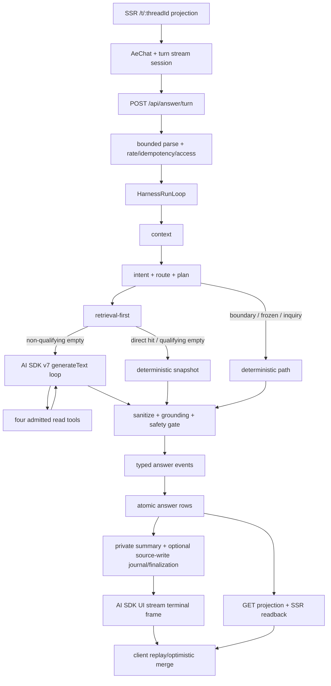
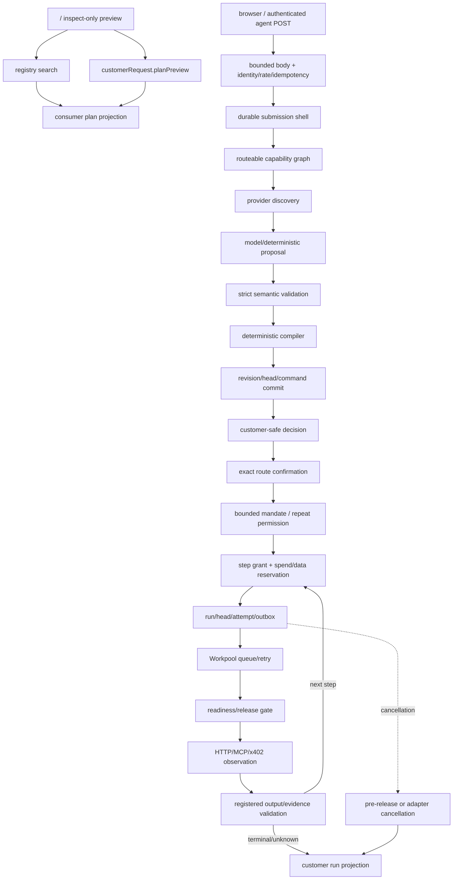
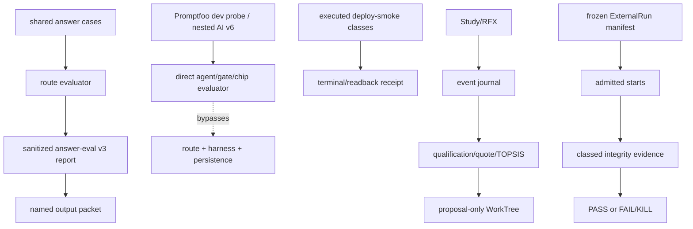

# PROMPT-DATA-FLOW — prompting, data-flow, and AI harness map

**Analysis date: 2026-08-04.** This is a current-source map of prompt assembly, model
boundaries, answer persistence, Customer Request execution, evaluation, and evidence. It does not
claim hosted, provider, payment, or customer success unless a named packet or receipt establishes
that class. No credential value, private URL, environment value, prompt secret, or raw provider
payload is recorded.

## Reading contract and evidence ceilings

- **Source-shape evidence** is checked-in TypeScript, Convex schema/function source, deployment
  configuration, or installed-package source. It establishes a boundary and the code's intended
  behavior, not that a deployment, provider, payment rail, or customer accepted a request
  (`src/modules/model-gateway/public.ts:4-11`; `src/modules/answer/internal/answer-tool-use-agent.ts:229-381`).
- **Fixture evidence** is an in-process port, captured provider, deterministic seed, or source-level
  test contract. It establishes local protocol behavior and invariants only; an unexecuted test
  file is not execution evidence (`tests/helpers/answer-thread-test-port.ts:6-18,104-133`;
  `tests/helpers/openrouter-contract-server.ts:141-180`; `tests/unit/answer-thread/tool-runner.test.ts:275-291`).
- **Packet evidence** is a named output artifact whose recorded result can be inspected. It proves
  only the run and fields recorded in that packet; it does not generalize to a current deployment,
  provider, or customer population (`output/eval/answer-suite-report.json:1-83`;
  `output/release/playwright-answer-runtime-smoke.json:67-126`;
  `output/release/playwright-deploy-smoke.json:68-125`).
- **Hosted evidence** requires an executed deployment smoke against a real base URL, terminal
  response, receipt, and fresh durable readback. The smoke source defines this ceiling; a source
  file, report schema, or local fixture does not (`tests/deploy-smoke/answer-runtime-production-smoke.spec.ts:39-100,191-217,334-411`).
- **Provider evidence** requires a real provider response with request outcome, usage/finish data,
  and cost or an explicit unavailable reason. OpenRouter metadata can omit cost; `undefined` is
  not zero (`src/modules/model-gateway/public.ts:127-139`;
  `src/modules/answer/internal/answer-tool-use-agent.ts:278-300,444-470`).
- **Customer evidence** requires an observed human or external-agent journey and customer-value
  measure. A score, source map, provider receipt, or local eval does not upgrade itself to customer
  value (`eval/answer/lib/scoring.ts:14-50`; `src/modules/study/internal/pipeline.ts:253-429`).
- **Evidence ceiling:** source and fixture claims remain local; packet claims remain packet-scoped;
  hosted/provider/payment/customer claims require the corresponding executed receipt/readback or
  study packet. README prose and generated Convex guidance do not lift any ceiling
  (`eval/answer/README.md:1-12,126-153`; `convex/_generated/ai/guidelines.md:320-323`).

## Current stack and compatibility truth

| dependency/runtime | current declared or installed fact | ownership consequence |
|---|---|---|
| Production AI SDK | Root `ai@7.0.44`, provider-utils `5.0.16`, Node `>=22`; the root package is ESM (`package.json:60-63,90-123,153-156`; `package-lock.json:152-169`; `node_modules/ai/package.json:1-10,44-48`) | Production generation uses the installed v7 API (`instructions`, `output`, `prepareStep`, `stopWhen`, `onStepEnd`); do not copy v6 or newer online examples into runtime code (`src/modules/answer/internal/answer-tool-use-agent.ts:316-380`; `node_modules/ai/docs/03-agents/04-loop-control.mdx:8-21,147-229`). |
| Promptfoo compatibility layer | Promptfoo is dev-only; it carries nested `ai@6.0.216` and provider-utils `4.0.33` (`package.json:125-144`; `package-lock.json:21435-21451,21688-21705`; `node_modules/promptfoo/package.json:42-47,319-344`) | Promptfoo's nested AI SDK v6 is evaluation tooling, not the production AI SDK. Its provider process invokes the eval runner; it does not define the runtime API (`eval/answer/providers/gate.mjs:10-24`). |
| OpenRouter generation adapter | `@openrouter/ai-sdk-provider@3.0.0` peers on AI SDK `^7` (`package.json:60-73`; `package-lock.json:4510-4530`; `node_modules/@openrouter/ai-sdk-provider/package.json:1-49`) | Four production generation families use the AE gateway; the SDK owns provider encoding/retry/abort/structured-output mechanics while AE owns credential gates, budgets, validation, evidence, and customer policy (`src/modules/model-gateway/public.ts:4-11,94-124`). |
| Convex | `convex@1.42.0` (`package.json:90-97`; `package-lock.json:12389-12420`; `node_modules/convex/package.json:1-10`) | Convex rows/functions are the durable source of truth; source-write, authority, revision, and readback contracts stay in AE (`convex/schema.ts:1-49`). |
| Workflow | `@convex-dev/workflow@0.4.4` (`package.json:64-67`; `package-lock.json:1982-2010`) | Project Spine uses installed Workflow waits/events/sleeps/replay/cancel mechanics; Workflow history is not Customer Request authority or answer evidence (`convex/projectSpine.ts:1-104,142-164,339-360`; `node_modules/@convex-dev/workflow/src/client/index.ts:159-306`). |
| Workpool | `@convex-dev/workpool@0.4.9` (`package.json:64-67`; `package-lock.json:1982-2010`) | Route transport/cancellation owns queue, retry, concurrency, and completion mechanics; AE owns release, output validation, outcome, and recovery. Running cancellation finishes the item and suppresses retry; installed status is only pending/running/finished and has no `statusTtl` (`convex/customerRequestRouteWorkpool.ts:1-10`; `convex/customerRequestRouteExecutionJournalPorts.ts:110-153`; `node_modules/@convex-dev/workpool/src/client/index.ts:235-277,264-278,371-400`). |
| TanStack AI | `@tanstack/ai@0.38.0` (`package.json:83-84`) | Used for schema-to-JSON conversion in action/harness descriptors, business-tool descriptors, and sandbox workflow discovery; it is not an execution or authority runtime (`src/modules/common/action.ts:244-284`; `src/modules/harness/tool-contract.ts:239-256`; `src/modules/business-tools/discovery.ts:1-49`; `src/lib/server/sandbox-capability-provider.ts:680-691`). |
| Agent component | No `@convex-dev/agent` declaration, lock entry used by the app, installed directory, or application import (`package.json:60-123`; `node_modules/@convex-dev`; `convex/_generated/ai/guidelines.md:320-323`) | Adoption is deferred, not installed-but-unused. Generic agent threads cannot become AE identity, source-write, evidence, projection, or recovery truth. |
| Runtime source/output | Nitro Vercel functions pin `nodejs22.x`; generated Nitro output dated 2026-08-04 also pins `nodejs22.x` (`vite.config.ts:57-67`; `.vercel/output/nitro.json:1-26`) | Source/build runtime matches the root AI SDK engine. |
| Project metadata | `.vercel/project.json` still declares `nodeVersion: 24.x` (`.vercel/project.json:5-15`) | This is a deployment configuration discrepancy to reconcile, not proof that source functions run on Node 24. |

## Maintenance contract

- When a maintainer changes prompt assembly, model call, tool membership/schema, route/gate,
  stream frame, durable journal, scheduler hop, projection, or package/runtime target, update this
  map in the same change (`.planning/codebase/ARCHITECTURE.md:1-160`).
- Every stage row records **input → processing → output → owner/evidence ceiling**. `lib` is an
  installed SDK/Convex primitive; `domain` is AE policy, authority, validation, evidence, or
  customer semantics; `base` is replaceable glue only after parity proof (`src/modules/common/action.ts:4-24`).
- AI SDK tools, approvals, UI frames, threads, and provider traces are mechanics. They are not AE
  identity, spend authority, mandate, prepared effect, commit, evidence, public projection, or
  recovery truth (`src/modules/common/action.ts:76-115,164-187`; `src/modules/answer-thread/internal/tool-runner.ts:68-127`).

## Flow A — public answer turn: request → plan → answer → persistence → UI

| stage | source evidence | input → processing → output | owner/evidence ceiling |
|---|---|---|---|
| SSR/readback entry | `src/routes/t.$threadId.tsx:29-40,54-69` | thread route → `loadThreadRouteReadback` calls `getPublicThreadProjection`, builds public SEO, supplies `initialProjection` to `AeChat` → redacted SSR projection or unavailable page | domain projection + base router; source-shape |
| browser stream/replay seam | `src/components/ae/chat/AeThreadTurnStreamSection.tsx:94-183`; `src/components/ae/chat/turn-stream-session.ts:24-98`; `src/components/ae/chat/answer-stream.ts:62-93` | query/thread/searchContext/generation → shared in-memory session caches frames/thread metadata, dedupes remount POSTs with `clientTurnKey`, fans out frames, replays cached frames, aborts shared controller → `done`, `aborted`, `error`, or `rate_limited` | base browser transport + domain reducer; source-shape, not durable replay |
| request/session | `src/routes/api.answer.turn.ts:46-99`; `src/components/ae/chat/answer-stream.ts:62-78` | body `{query, threadId?, searchContext?}`, cookie, optional `X-AE-Turn-Key` → resolve pseudonymous session and parse current request contract → admitted input or typed HTTP refusal | base + domain; source-shape |
| bounded body | `src/routes/api.answer.turn.ts:34-59`; `src/lib/server/bounded-request-body.ts:7-75`; `src/modules/answer-thread/answer-thread.schema.ts:188-205` | raw request → 16 KiB declared/streamed byte bound, JSON parse, Zod validation → query/thread/search context or 413/400 | base; source-shape |
| admission/access | `src/routes/api.answer.turn.ts:62-98`; `src/lib/server/rate-limit.ts:1-83`; `src/modules/answer-thread/internal/turn-guard.ts:11-95` | session, turn key, thread → process-local 30-second idempotency claim plus Convex HTTP rate admission, session ownership, 25-turn cap, bounded prior-turn access; `explain_boundary` can use history-independent access; missing dev-remount thread resets to a new thread → allowed access/preload or 403/404/429 | domain over base; process-local idempotency is not a durable effect claim; source-shape |
| UI framing | `src/routes/api.answer.turn.ts:101-143`; `src/modules/answer/answer-ui-stream.ts:1-68` | allowed request + abort signal → `createUIMessageStream` writes only transient `data-answer-event` frames; parser ignores lifecycle/malformed chunks → no-store SSE response and typed AE frames | AI SDK v7 framing + AE payload/admission/abort; source-shape |
| live harness | `src/modules/answer-thread/internal/turn-orchestrator.ts:125-222`; `src/modules/answer-thread/internal/answer-harness-operation.ts:81-108`; `src/modules/harness/harness.schema.ts:21-31`; `src/modules/harness/run-loop.ts:158-205` | query/access → run identity and phases `context → intent → route → retrieval → model → gate → assemble → persist → report`; all phases except report are guarded and report is attempted after failure → mutable runtime state, runtime events, private report | AE harness domain + installed loop; fixture/source until persisted |
| context | `src/modules/answer-thread/internal/turn-orchestrator.ts:236-245` | preloaded complete turns or bounded durable read → prior turns/count and frozen provider/slugs → bounded context state | domain; source-shape |
| intent/route | `src/modules/answer-thread/internal/turn-orchestrator.ts:246-313,314-388`; `src/modules/answer-thread/internal/intent-router.ts:14-45` | query/history/searchContext → classify six intents (`refine_search`, `filter_known`, `compare_known`, `inquiry_handoff`, `explain_boundary`, `unsupported`) and select exhaustive route → deterministic boundary/frozen/inquiry path or tool search | domain; source-shape |
| response plan | `src/modules/answer-thread/internal/answer-response-planner.ts:15-72,88-160` | query/prior count/searchContext → clarification, provider/artifact budgets, and one-call policy → typed plan | domain; source-shape |
| retrieval-first | `src/modules/answer-thread/internal/turns/retrieval-first.ts:44-183,265-323`; `src/modules/registry/registry.actions.ts:397-468`; `convex/registry.ts:188-239` | plan/query/context → canonical read-only `registry.search` first; direct hit becomes snapshot; qualifying location/service empty may call one `web.discover` and preserve imported claims separately; non-qualifying empty falls through to model recovery → snapshot, tool records, timings, imported web claims, or no snapshot | domain + action/Convex base; source-shape |
| model dispatch | `src/modules/answer-thread/internal/turn-orchestrator.ts:314-387`; `src/modules/answer-thread/internal/turns/boundary.ts:21-44,78-88`; `src/modules/answer-thread/internal/turns/frozen-known.ts:1-81`; `src/modules/answer-thread/internal/turns/inquiry-handoff.ts:1-130` | route/retrieval → deterministic boundary/frozen/inquiry/clarification branches avoid model calls; unresolved `tool_search` enters agent path → path result or model input | domain; source-shape |
| prompt assembly | `src/modules/answer/internal/answer-llm-prompts.ts:9-112`; `src/modules/answer/internal/action-to-tool-spec.ts:35-72` | query, searchContext, intent, prior public providers, tool policy → versioned instructions/user payload with sanitized inert catalog facts and model-safe action aliases → v7 instructions/prompt/tool schema; credentials, authority, mandate, spend, and raw DB documents are absent | domain; source-shape |
| AI SDK v7 model loop | `src/modules/answer/internal/answer-tool-use-agent.ts:229-381,402-437,615-659` | gateway model, prompts, four tool specs, abort → `generateText` + `Output.object`, maxRetries 0, serialized tool queue, `prepareStep` removes tools for the final prose step, custom stop condition; an unsupported provider claim gets one evidence-pinned repair request, then a deterministic published-fact fallback if repair still fails → typed `AnswerProse`, tool records, model observations | AI SDK mechanics + AE budgets/schema/gate/fallback; source-shape |
| model accounting | `src/modules/answer/internal/answer-tool-use-agent.ts:278-307,444-470`; `src/modules/answer-thread/internal/turns/agent.ts:78-90`; `src/modules/storefront/internal/business-enrichment.ts:261-318` | each provider SDK step or web-discovery action → one model observation with status, usage, cost or unavailable reason; direct agent callback feeds the live collector without an outer duplicate → private harness model summary | domain collector + SDK callback; source-shape |
| read-tool admission | `src/modules/answer-thread/answer-thread.schema.ts:27-33`; `src/modules/harness/tool-contract.ts:26-31`; `src/modules/answer-thread/internal/answer-tool-registry.ts:1-22`; `src/modules/answer-thread/internal/tool-runner.ts:62-161,265-313` | model alias/input or deterministic call → resolve action, require read-only/strict schemas, execute in `public-read`, classify semantic discovery failures before completion, extract only grounded slugs/claims, hash persisted fields → `complete`, `error`, or `refused` tool evidence | AE action registry/runner; source-shape |
| gates | `src/modules/answer/internal/answer-gate.ts:25-58,61-106`; `src/modules/answer-thread/internal/answer-turn-safety.ts:17-49`; `src/modules/answer-thread/internal/turn-orchestrator.ts:389-431` | snapshot/prose/allowed slugs → sanitization, slug grounding, location, epistemic-vocabulary, injection-upgrade, provider-overclaim, and verbatim published price/availability checks → accepted snapshot + gate summary or typed error/copy ID | domain; source-shape |
| assembly/frames | `src/modules/answer/internal/emit-snapshot-events.ts:31-107`; `src/modules/answer-thread/internal/turn-orchestrator.ts:432-447,614-660` | accepted snapshot → ordered plan/work/thinking/one-line/sources/artifacts/next-step/summary deltas; deferred assembly omits `complete` → transient typed event sequence | domain event contract + AI SDK framing; source-shape |
| durable answer persistence | `src/modules/answer-thread/internal/answer-turn-finalization.ts:150-253`; `convex/answerThreads.ts:240-338` | snapshot/error, evidence, tool/model records → canonical snapshot/evidence hashes, answer/harness summaries, atomic thread+turn+tool rows, source-write admission and 25-turn/session checks → durable `answerThreads`, `answerTurns`, `answerToolCalls` | domain + Convex base; source-shape |
| private summary versus journal | `src/modules/answer-thread/internal/answer-turn-finalization.ts:180-193,256-325,455-560,693-722`; `src/modules/answer/internal/answer-tool-use-agent.ts:278-300`; `tests/unit/answer-thread/answer-harness-operation.test.ts:263-291` | model callbacks → private harness summary counts/usage/cost; live answer model path records callbacks directly and does not call `HarnessRunLoop.runModel`, so ordinary runtime journal entries are turn/gate/persist/report rather than `model.started`/`model.completed`; a supplied runtime event can still be mapped by the generic mapper → private model telemetry plus redacted ordered journal | AE evidence boundary; fixture test is not execution proof |
| source-write finalization | `src/modules/answer-thread/internal/turn-orchestrator.ts:449-525`; `src/modules/answer-thread/internal/answer-turn-finalization.ts:256-325`; `convex/harnessSessions.ts:338-445` | persisted source-write turn → finalization hash binds turn/snapshot/evidence/journal entries; Convex checks owner, snapshot/evidence conflicts, idempotency, parent/sequence, and source-write admission → accepted/replayed finalization before terminal `complete` | domain + Convex base; source-shape |
| public projection/readback | `convex/answerThreads.ts:598-621`; `src/modules/answer-thread/internal/public-projection.ts:45-101`; `src/routes/api.answer.threads.$threadId.ts:11-29`; `src/routes/t.$threadId.tsx:54-69` | durable rows → capped ascending turns, redacted prose/artifacts/work log/check counts; raw prompts/tool payloads/hashes/private harness data are omitted → API/SSR public projection | domain projection + Convex base; source-shape |
| client convergence | `src/components/ae/chat/AeChat.tsx:127-166,208-235,630-668` | optimistic settled turn + SSR/API projection → server turn IDs win, only pending optimistic turns remain, projection refresh follows settlement → reload/converged transcript | base React + domain merge; source-shape |
| cancellation boundary | `src/components/ae/chat/AeThreadTurnStreamSection.tsx:111-183`; `src/components/ae/chat/turn-stream-session.ts:91-98`; `src/routes/api.answer.turn.ts:101-145`; `src/modules/harness/run-loop.ts:536-549` | stop/unmount/generation change → abort shared fetch/controller, local work steps become stopped, server suppresses later frames and catches abort → local `stopped` UI result; `AnswerTurnStatus` has only pending/complete/error and no durable stopped producer (`src/modules/answer-thread/answer-thread.schema.ts:27-33`) | client/server abort seam; `[INFERENCE]` an abort before persistence leaves no durable answer row, while an abort after persistence can leave a durable row without a client terminal frame |

**Flow A invariants.** Direct registry hits and qualifying empty states can complete without answer-agent
model requests; a qualifying empty has at most one separate `web.discover` action/model call
(`src/modules/answer-thread/internal/turns/retrieval-first.ts:44-183`; `eval/answer/lib/cases.ts:204-313`).
The current answer read set is exactly five IDs: `registry.search`, `registry.detail`,
`sandbox.checkup_quote`, `web.discover`, and `registry.operations.search` (the operation-level
discovery tool, also used on the recovery path) (`src/modules/answer-thread/answer-thread.schema.ts:27-33`;
`src/modules/harness/tool-contract.ts:26-31`). Writes never enter that set
(`src/modules/answer-thread/internal/tool-runner.ts:68-82`; `src/modules/common/action.ts:139-187`).
The in-memory answer test port omits production Convex durability; production writes the three-row
contract (`tests/helpers/answer-thread-test-port.ts:18-83`; `convex/answerThreads.ts:240-338`).

## Flow B — Customer Request V2: intake → interpretation → plan → execution → projection

There is **no separate live Agent Engine plan runtime**. Dedicated `enginePlans`, decision-map,
`plan-proposal`, and `AePlanWork` hosts are retired by a source-level retirement contract, and the
current Convex schema composes Customer Request V2 tables instead (`tests/imports/legacy-engine-retirement.test.ts:7-48`; `convex/schema.ts:1-49`; `src/modules/customer-request/internal/convex-v2-schema.ts:669-734`).
The implemented Agent Engine-shaped branch is the Home page's **inspect-only** preview; it does not
create a Customer Request or effect (`src/routes/index.tsx:186-221`; `src/modules/customer-request/plan-preview.actions.ts:46-82`).
Since the real-supply cutover the dev seed seeds only the real curated providers
(`agentic-market-exa`, `agentic-market-tavily`, `frankfurter-ecb-rates`) via `convex/curatedProviders.ts:seed`;
the sandbox/Australian mock businesses were removed, and the Customer Request engine now operates on
this real supply (`convex/curatedProviders.ts:45-58`; `src/modules/dev/internal/dev-seed-business-fixtures.ts:44-91`).

| stage | source evidence | input → processing → output | owner/evidence ceiling |
|---|---|---|---|
| inspect-only Home preview | `src/routes/index.tsx:186-221`; `src/modules/customer-request/plan-preview.actions.ts:46-82`; `convex/customerRequestApplication.ts:648-697` | public query → registry service search and `customerRequest.planPreview`, optional web-discovery claims, bounded Convex `public-read` rate admission → five-minute inspect-only preview or bounded refusal; no Request, authority, reservation, contact, charge, or dispatch | domain public read; source-shape, not durable Request evidence |
| preview composition/projection | `src/modules/customer-request/application/interpret-compile/preview.ts:9-138,57,90`; `src/modules/customer-request/application/consumer-plan-projection.ts:152-211`; `src/components/ae/services/AeServiceList.tsx:13-50`; `src/components/ae/plan/AeConsumerPlan.tsx:22-65` | customer job/network → bounded graph, deterministic provider discovery narrows the descriptor pool before `proposeThenCompile(finalAttempt: true)`, max 32 steps/64 refs/5-minute expiry, public-supply join capped at three options per step → consumer-neutral frontier/queued/attention plan or needs-information/unavailable result | domain projection; source-shape |
| public transports | `src/routes/api.requests.ts:1-6`; `src/routes/api.v1.requests.ts:1-6`; `src/lib/server/customer-request-browser-api.ts:42-154`; `src/lib/server/customer-request-agent-api.ts:45-124,264-313` | browser or authenticated agent → browser session/service assertion or principal-authenticated agent API → common application command | base transport + domain identity; source-shape |
| admission | `src/lib/server/customer-request-api.ts:19-47`; `src/lib/server/customer-request-route-action-api.ts:43-124` | raw submit/refinement/route-action body → 32 KiB submit or 4 KiB route-action bound, strict schema, sensitive-input refusal, identity/rate/idempotency checks → admitted input or typed refusal | base + domain; source-shape |
| durable shell | `convex/customerRequestApplication.ts:701-769`; `convex/customerRequestV2.ts:145-300` | command/authority/digest → rate-limited authenticated caller, replay/conflict check, durable reservation before provider work → shell, replay, or refusal | domain + Convex; source-shape |
| routeable capability graph | `convex/customerRequestApplication.ts:1708-1791`; `src/modules/customer-request/application/interpret-compile/graph.ts:22-169` | network → exact active contracts, routeable supply, mappings, decision models/bindings, bounded descriptors and registry snapshot digest → graph snapshot, loaded unfiltered with the descriptor pool narrowed by the downstream provider-discovery step (`src/modules/customer-request/application/interpret-compile/discover.ts:35-46`) | domain; source-shape |
| provider discovery | `src/modules/customer-request/application/interpret-compile/discover.ts:15-46`; `convex/customerRequestDiscoveryPort.ts:16-25`; `src/modules/customer-request/application/interpret-compile/preview.ts:57,90`; `src/modules/customer-request/application/interpret-compile/interpret.ts:57,110,182` | natural-language customer job/network → deterministic read-only `registry.operations.search` on the job via the Convex-native `discoverCapabilitiesPort` (`ctx.runQuery` on `capabilitySupplyOperations:search`), keeping only `graph.descriptors` whose operation refs were returned; fall back to the full descriptor set on empty/generic/no-match or unavailable; only the candidate pool narrows (models/bindings/mappings/registrySnapshotDigest stay whole so the digest/replay invariant holds) → filtered descriptor set for `propose` | domain deterministic read; source-shape (mirrors answer-engine Flow A retrieval-first discovery) |
| proposal ladder | `src/modules/customer-request/application/interpret-compile/interpret.ts:57,76-118,110,120-203,182`; `src/modules/customer-request/application/interpret-compile/interpreter.ts:22-62` | intent/amendment/graph + discovery-narrowed `capabilities` set (omitted → whole `graph.descriptors`) → submit attempts once non-final then final; no provider key uses deterministic token matching with deterministic-token fallback labels; keyed path uses OpenRouter and final-attempt deterministic fallback; selection is bounded to the discovered or full set → model/deterministic proposal or refusal | domain interpreter; source-shape |
| semantic transport/validation | `src/modules/customer-request/openrouter-transport.ts:34-118`; `src/modules/customer-request/semantic-interpreter.ts:140-220,256-325` | public descriptor payload + versioned instruction → AI SDK v7 `generateText`/`Output.object`, bounded timeout/response, one provider retry, tolerant wire normalization, strict domain schema and input/output digests → typed proposal and interpretation evidence | SDK transport + AE semantic validation; source-shape |
| deterministic compile | `src/modules/customer-request/compiler.ts:67-166,234-426,600-746,784-809` | proposal + exact models/bindings/facts → derive actions, dependencies, routes, prices, data use, effects, recovery, cancellation, evidence, and digests; refuse unknown/on-request cost route generation → aggregate/plan/generation or refusal | AE domain; source-shape |
| revision/head commit | `src/modules/customer-request/application/interpret-compile/compile.ts:34-153`; `convex/customerRequestV2.ts:145-300` | compiled aggregate + expected lineage/command → replay/conflict/stale graph checks and OCC-style commit → persisted V2 revision/head/route generation/command | domain + Convex; source-shape |
| customer decision projection | `src/modules/customer-request/customer-projection.ts:129-168,395-431,493-605`; `src/modules/customer-request/application/consumer-plan-projection.ts:121-211` | stored aggregate/preview → bounded criteria, options, decision, recovery, available actions; deterministic fallback is labeled `keyword_match`; raw model/binding/credential docs remain private → customer-safe decision/consumer plan | domain projection; source-shape |
| confirmation/mandate | `src/modules/customer-request/application/confirm-route/confirm.ts:11-77`; `src/modules/customer-request/route-mandate-mutation/issue.ts:11-170`; `convex/customerRequestApplication.ts:878-899` | exact displayed revision/generation/route + authenticated principal → freshness/current graph/known maximum cost/authority checks; persist command-idempotent route mandate without starting work → confirmation receipt + bounded mandate | domain authority; source-shape |
| standing repeat permission | `convex/customerRequestApplication.ts:901-1045`; `src/modules/customer-request/route-mandate.ts:95-190` | authenticated owner/agent + exact route, occurrences, cumulative spend, expiry → list/allow/use/inspect/revoke bounded standing permission → attenuated authority or refusal | domain authority; source-shape |
| per-step grant | `convex/customerRequestRouteMandateAdmission.ts:60-263`; `src/modules/customer-request/route-mandate-admission.ts:62-246` | mandate + exact step/supply/contract → verify mandate/supply digests, attenuate scope, reserve cumulative spend and data/effect use → admitted/replayed grant | domain authority; source-shape |
| run journal/outbox | `convex/customerRequestApplication.ts:1047-1078`; `src/modules/customer-request/route-execution/machines/start-or-resume.ts:7-187`; `convex/customerRequestRouteExecutionJournalPorts.ts:279-373` | active mandate/principal/key → replay/resume/cancel-prior checks, materialize input, write run/head/queued attempt/pending outbox/command → pending dispatch | domain + Convex; source-shape |
| Workpool seam | `convex/customerRequestRouteWorkpool.ts:1-10`; `convex/customerRequestRouteExecutionJournalPorts.ts:110-153`; `node_modules/@convex-dev/workpool/src/client/index.ts:83-108,235-277,371-400` | committed dispatch ref → max parallelism 32, action retry max 3/backoff, completion mutation → transport/cancellation worker | installed queue mechanics; source-shape |
| release/readiness/transport | `src/modules/customer-request/route-execution/machines/mark-dispatched.ts:7-77`; `convex/customerRequestRouteTransportWorker.ts:66-198`; `src/modules/capability-supply/route-transport-runtime.ts:397-540,566-653` | pending attempt/grant/mandate → recheck current supply/publication, credential/health/readiness, bind call identity, invoke HTTP JSON or MCP JSON-RPC (including bounded JSON/SSE parsing) → bounded untrusted observation | AE release gate + transport adapter; source-shape |
| x402 custody/payment boundary | `src/modules/capability-supply/route-transport-runtime.ts:655-776`; `convex/customerRequestRouteExecution.ts:418-604`; `src/modules/customer-request/internal/route-mandate-convex-schema.ts:745-776` | 402 challenge + exact spend/credential authority → validate currency/exponents/ceiling/expiry, persist opaque prepared custody, mark possibly submitted before send, observe provider proof or reconciliation-required → payment attempt state plus transport observation; source does not prove settlement or money-ledger reconciliation | domain payment boundary + Convex custody; source-shape only |
| outcome/next-step | `src/modules/customer-request/route-execution/machines/record-outcome.ts:8-93`; `convex/customerRequestRouteExecutionJournalPorts.ts:389-473,646-783` | released observation + registered output/evidence → validate disposition/output; malformed/stale output becomes unknown; commit success/partial/failure/cancellation race or re-admit dependency-mapped next step → terminal, advanced, unknown, failed, or replayed run | domain; source-shape |
| cancellation | `src/modules/customer-request/route-execution/machines/cancel-current.ts:16-86`; `src/modules/customer-request/route-execution/machines/cancel-resolve-attempt.ts:7-50`; `convex/customerRequestRouteExecutionCancelPorts.ts:89-188`; `convex/customerRequestRouteCancellationWorker.ts:13-74` | request/principal/key/mode → queued unreleased work cancels directly; active adapter cancellation uses native scheduler worker; accepted/rejected/unknown/too-late is explicit → cancelled/pending/too-late/replayed | domain + scheduler base; source-shape |
| run readback | `src/modules/customer-request/application/route-plan-projection/project-run.ts:15-149`; `convex/customerRequestRouteExecution.ts:120-180,568-579` | durable run/aggregate → preserve queued/leased/dispatched/accepted/succeeded/failed/outcome_unknown/cancelled, progress, evidence, and attention state; duplicate start refuses across leased/released states → bounded customer action status/result | domain projection; source-shape |

**Flow B authority invariant.** A model/deterministic proposal may select opaque registered operations
and customer facts, but cannot construct routes, provider choices, approvals, effects, authority,
completion evidence, or payment. The compiler, confirmation, mandate, grant, release, transport,
and outcome seams do that deterministically (`src/modules/customer-request/semantic-interpreter.ts:222-248`; `src/modules/customer-request/compiler.ts:234-426`; `src/modules/common/action.ts:164-187`).
A discovered capability must still be admitted/routeable to compile; discovery sources candidates
ONLY from `registry.operations.search` output (never external catalog prose) per the no-handroll rule
(`src/modules/customer-request/application/interpret-compile/discover.ts:15-46`; `convex/customerRequestDiscoveryPort.ts:16-25`).

## Flow C — eval, Promptfoo probe, study, and external-run protocols

| stage | source evidence | input → processing → output | owner/evidence ceiling |
|---|---|---|---|
| shared v3 case catalog | `eval/answer/lib/cases.ts:142-186,204-313`; `eval/answer/lib/evaluators.ts:127-151,463-628,759-845` | turn/thread/harness cases + deterministic registry → route evaluator checks persisted evidence, timing, model/tool counts, copy, artifacts, and safe next step → case result | fixture/source unless runner packet is named |
| broad seed | `eval/answer/lib/registry-seed.ts:21-25,27-38,40-138` | eval-only fixture composition → 100 businesses across 10 industries and 10 Australian locales → broad-catalog case supply | fixture only |
| coverage/synchronization | `eval/answer/lib/coverage.ts:60-150,152-207`; `eval/answer/scripts/audit-coverage.ts:8-38` | shared cases + Promptfoo YAML → duplicate/missing/unknown/mode-mismatch, required-tag, broad-seed, and shape audit → JSON success or nonzero process status | source contract; execution only when a named packet records it |
| scoring/report | `eval/answer/lib/scoring.ts:14-50,87-116`; `eval/answer/scripts/run-suite.ts:5-41`; `eval/answer/README.md:126-173` | evaluator results → 7 dimensions, score/rank, `userOutcome`, 9/10 threshold, aggregate usage/cost availability and p95/max route clocks → `answer-eval-suite-report:v3` JSON | local eval/fixture; current packet `output/eval/answer-suite-report.json:1-47` records one successful packet, not hosted/provider/customer proof |
| Promptfoo | `eval/answer/promptfooconfig.yaml:7-9,152-223`; `eval/answer/providers/gate.mjs:10-24`; `eval/answer/lib/evaluators.ts:1008-1068` | vars + dev fixture/captured provider → direct `runAnswerToolUseAgent` or gate/chip assertion; bypasses route admission, live harness, Convex persistence, and public readback → model/tool/gate fixture result | Promptfoo fixture only; nested AI SDK v6 is not production runtime |
| answer runtime smoke | `tests/deploy-smoke/answer-runtime-production-smoke.spec.ts:39-100,191-217,334-411`; `tests/deploy-smoke/answer-runtime-production-smoke-selection.ts:20-64` | deployed public catalog → paginate all rows, exclude development/eval slugs, choose reproducible unique subject, exercise direct and literal-miss recovery via public UI/API, reload and GET readback → packet-scoped hosted terminal/readback receipt when executed | hosted/provider boundary for what receipt records; `output/release/playwright-answer-runtime-smoke.json:67-126` is a named passed packet with a receipt, but does not expose private model counts or provider cost |
| Phase 1 deployment smoke | `tests/deploy-smoke/phase1-deploy-smoke.spec.ts:33-174` | deployed base/config → public routes/APIs/discovery files, security headers, private/admin isolation, explicit Convex reachability → route/readback contract result | hosted packet only when executed |
| cold human Customer Request smoke | `tests/deploy-smoke/customer-request-human-lifecycle-smoke.spec.ts:19-88,90-157` | cold browser + disclosed choice → preview/options, pre-approval disclosures, confirmation, start, completion or unknown recovery, reload parity, evidence readback → `AE_HUMAN_REQUEST_OBSERVATION` packet | customer/hosted observation only for named run; `output/release/playwright-deploy-smoke.json:68-125` records a passed packet and observation; no population claim |
| provider dispatch smokes | `tests/deploy-smoke/phase2-novu-dispatch-smoke.spec.ts:12-48`; `tests/deploy-smoke/phase2-resend-dispatch-smoke.spec.ts:12-45` | guarded deployment dispatch ID + outbox authority → real provider trigger/already-recorded readback, transaction/message ID, redacted response → provider packet if executed | provider evidence only for named receipt; source files alone are not execution |
| Study/RFX | `src/modules/study/internal/pipeline.ts:39-87,253-429`; `src/modules/study/internal/rfx-machine.ts:15-24,40-104,204-283`; `convex/studies.ts:164-283`; `tests/unit/study-rfx-journal.test.ts:91-154` | fenced study/registry material → qualification, fresh quote/refusal/unknown/expiry events, deterministic score/TOPSIS, replayable journal/artifact → StudyArtifact/journal or refusal and proposal-only WorkTree decision | source/fixture; no provider/customer transfer without executed study packet |
| ExternalRun | `src/modules/external-run/internal/gate.ts:133-160,259-298`; `convex/externalRuns.ts:66-98,134-250,252-357`; `tests/unit/external-run/external-run.test.ts:58-135` | frozen manifest + authorized starts + integrity-checked evidence classes → denominator/reconciliation, independent-provider/customer/payment metrics, deterministic gates → `PASS` or `FAIL/KILL` | source/fixture until durable external-run receipt is named |

**Flow C protocol invariant.** Eval `ok`/score, Promptfoo pass, Study recommendation/refusal, hosted
smoke result, provider dispatch result, customer observation, and ExternalRun `PASS | FAIL/KILL` are
separate trust domains. They do not convert into one another (`eval/answer/lib/scoring.ts:44-50`;
`src/modules/study/internal/pipeline.ts:253-429`; `src/modules/external-run/internal/gate.ts:259-298`).
The v3 report's model/tool counts are sanitized private-summary counts, not proof of hosted provider
calls (`eval/answer/README.md:64-107,126-153`).

## Direct model, prompt, tool, and stream callsite inventory

| callsite | prompt/input assembly | installed primitive | boundary and evidence |
|---|---|---|---|
| answer agent | `buildToolUseAgentSystemPrompt`/`buildToolUseAgentUserPrompt`; four action-derived read aliases (`src/modules/answer/internal/answer-llm-prompts.ts:44-112`; `src/modules/answer/internal/action-to-tool-spec.ts:35-72`) | Production AI SDK v7 `generateText`, `Output.object`, `tool`, `prepareStep`, `stopWhen`, `onStepEnd` (`src/modules/answer/internal/answer-tool-use-agent.ts:316-380,402-437`) | tool input is evidence, not authority; serialized tool order, max calls, final tool-less prose, gate, and private one-record-per-step accounting remain AE-owned (`src/modules/answer-thread/internal/tool-runner.ts:62-161`; `src/modules/answer/internal/answer-tool-use-agent.ts:278-307`) |
| follow-up chips | query + public provider facts (`src/modules/answer/internal/answer-llm-prompts.ts:115-133`) | v7 `generateText` + `Output.object`, maxRetries 0 (`src/modules/answer-thread/internal/llm-follow-up-chips.ts:46-78`) | optional feature gate requires eval pass and API key; no-key/error returns empty; unpersisted and outside turn harness (`src/modules/answer/internal/llm-config.ts:1-10`) |
| Customer Request semantic interpreter | versioned v12 instruction + bounded public descriptors/opaque keys (`src/modules/customer-request/semantic-interpreter.ts:222-250,270-325`) | v7 `generateText` + `Output.object`, timeout, one SDK retry (`src/modules/customer-request/openrouter-transport.ts:64-117`) | tolerant wire output is normalized and strict-validated; compiler owns routes/effects/authority (`src/modules/customer-request/compiler.ts:234-426`) |
| semantic interpreter configuration | env model/key/site plumbing + deterministic fallback (`src/modules/customer-request/application/interpret-compile/interpreter.ts:22-62`; `convex/customerRequestApplication.ts:686-695,1748-1753`) | AE configuration around the shared gateway | no key selects deterministic matching; keyed path uses OpenRouter first and final-attempt fallback; source-shape only |
| storefront enrichment/discovery | versioned web-grounding instructions and bounded business/query prompts (`src/modules/storefront/internal/business-enrichment.ts:27-35,94-118,155-255`) | v7 `generateText` with OpenRouter JSON mode/web plugin capped at five and one retry (`src/modules/storefront/internal/business-enrichment.ts:261-318`) | citation URL membership, bounded manual JSON/Zod parsing, `draft_unconfirmed`, imported claims, and cost-unavailable observations remain AE-owned (`src/modules/storefront/internal/business-enrichment.ts:229-255,382-445`) |
| direct model catalog | no model prompt; bounded authenticated GET `/api/v1/models` (`src/modules/answer/internal/openrouter-models.ts:22-25,173-209`) | direct `fetch` with timeout/cache/whitelist/fallback, not `openRouterModel` generation | separate provider HTTP path; model-selector context is intentionally disabled/no live caller (`src/components/ae/chat/AeAnswerModelContext.tsx:1-39`) |
| answer HTTP stream | no model prompt; only transient typed AE data part (`src/routes/api.answer.turn.ts:101-143`) | v7 `createUIMessageStream`/`createUIMessageStreamResponse` plus provider-utils `parseJsonEventStream` (`src/modules/answer/answer-ui-stream.ts:1-68`) | SDK owns framing; AE owns payload, abort, admission, persistence, and terminal gating |
| external MCP response stream | registered route input/authority, not an answer prompt (`src/modules/capability-supply/route-transport-runtime.ts:566-649`) | provider-utils `parseJsonEventStream` for bounded `text/event-stream`, JSON-RPC ID matching, or bounded JSON fallback (`src/modules/capability-supply/route-transport-runtime.ts:892-927`) | transport observation is untrusted until release/output/evidence validation; source-shape |
| answer read tools | action metadata and strict schema conversion (`src/modules/harness/tool-contract.ts:239-256`; `src/modules/answer-thread/internal/answer-tool-registry.ts:8-22`) | AI SDK `tool` wrapper with permissive SDK validation and single AE runner (`src/modules/answer/internal/answer-tool-use-agent.ts:394-437`) | current model-exposed IDs are `registry.search`, `registry.detail`, `sandbox.checkup_quote`, `web.discover`, `registry.operations.search`; membership is manually duplicated in schema, harness list, and registry (`src/modules/answer-thread/answer-thread.schema.ts:27-33`; `src/modules/harness/tool-contract.ts:26-31`; `src/modules/answer-thread/internal/answer-tool-registry.ts:8-20`) |
| schema conversion | canonical action/harness schemas; business prepare/invoke schemas; sandbox workflow input schema (`src/modules/common/action.ts:269-284`; `src/modules/harness/tool-contract.ts:239-256`; `src/modules/business-tools/discovery.ts:16-49`; `src/lib/server/sandbox-capability-provider.ts:680-691`) | `@tanstack/ai` `convertSchemaToJsonSchema` | conversion only; canonical IDs, effect metadata, authority, execution, and source-write gates remain AE-owned |
| Promptfoo direct probe | vars/config rows (`eval/answer/promptfooconfig.yaml:152-223`) | dev-only Promptfoo provider process + `tsx` eval runner (`eval/answer/providers/gate.mjs:10-24`) | nested AI SDK v6 is eval-only; route/harness/persistence are intentionally bypassed |

**Callsite completeness check.** Current source has four production `generateText` families: answer
agent, follow-up chips, Customer Request semantic transport, and storefront enrichment/discovery
(`src/modules/answer/internal/answer-tool-use-agent.ts:1-12`; `src/modules/answer-thread/internal/llm-follow-up-chips.ts:1-2`; `src/modules/customer-request/openrouter-transport.ts:1-14`; `src/modules/storefront/internal/business-enrichment.ts:1-7`).
The answer agent has a tool loop and final prose step; this does not make a fifth family. No
production import uses `streamText`, `ToolLoopAgent`, `createAgentUIStream`, `generateObject`, SDK
telemetry, SDK `toolApproval`, or `@convex-dev/agent` (`src/routes/api.answer.turn.ts:1-8`; `src/modules/answer/answer-ui-stream.ts:1-2`; `package.json:60-123`). Direct model-list GET and external MCP SSE parsing are separate provider/stream-adjacent seams, not generation families.

## Library-adoption matrix

| mechanism | verdict | retain/replace boundary | source proof |
|---|---|---|---|
| v7 model/provider transport | **retain library** | AI SDK/OpenRouter own request encoding, structured output, retries, abort, usage, and typed errors; AE keeps gateway config, credential refusal, model policy, and cost taxonomy | `src/modules/model-gateway/public.ts:94-139`; `node_modules/ai/package.json:1-10,44-48` |
| v7 structured output | **retain library, retain AE validation** | `Output.object` parses a generated object; AE still normalizes tolerant Customer Request wire data, enforces strict domain schemas, digests, and proposal compile | `node_modules/ai/docs/03-ai-sdk-core/10-generating-structured-data.mdx:11-56`; `src/modules/customer-request/semantic-interpreter.ts:287-325` |
| answer tool loop | **retain current seam / defer replacement** | `generateText` mechanics are useful; AE retains four-tool membership, serial evidence, budgets, final tool-less step, gate, and harness accounting | `src/modules/answer/internal/answer-tool-use-agent.ts:244-380`; `src/modules/answer-thread/internal/tool-runner.ts:62-161` |
| `ToolLoopAgent` | **defer** | Installed v7 source offers reusable loop defaults, but parity is missing for AE run IDs, ordered records, budget/refusal, final-step tool removal, abort, and report/finalization | `node_modules/ai/src/agent/tool-loop-agent.ts:34-68,120-180`; `src/modules/answer/internal/answer-tool-use-agent.ts:351-380,444-470` |
| SDK `toolApproval` | **defer for answer reads; not authority** | Read tools are public-read actions. Approval/mandate/payment/source-write authority belongs to AE Customer Request gates, not an SDK model-call protocol | `node_modules/ai/docs/03-ai-sdk-core/15-tools-and-tool-calling.mdx:159-168,243-265`; `convex/customerRequestRouteMandateAdmission.ts:60-263` |
| UI stream framing | **retain library** | AI SDK owns SSE/UI lifecycle framing and provider-utils parsing; AE owns transient `data-answer-event`, redaction, abort, and terminal-complete semantics | `src/modules/answer/answer-ui-stream.ts:1-68`; `src/routes/api.answer.turn.ts:101-143` |
| provider-utils event parser | **retain at bounded stream seams** | Use for answer frames and external MCP SSE/JSON-RPC parsing; AE bounds bytes, matches IDs, and validates observations | `src/modules/capability-supply/route-transport-runtime.ts:892-927`; `src/modules/answer/answer-ui-stream.ts:1-68` |
| model lifecycle telemetry | **simplify** | `onStepEnd` + harness collector provide one private model observation per provider step; do not add OTel until redaction/identity/deployment trace parity is required | `src/modules/answer/internal/answer-tool-use-agent.ts:278-307`; `src/modules/harness/run-collector.ts:404-468` |
| `@tanstack/ai` schema conversion | **retain conversion only** | Convert Zod schemas to provider JSON schemas; do not move action registry, effect metadata, execution, or source-write authority into the conversion library | `src/modules/common/action.ts:244-284`; `src/modules/business-tools/discovery.ts:1-49`; `src/lib/server/sandbox-capability-provider.ts:680-691` |
| direct model catalog GET | **retain as separate adapter** | Bounded/cacheable OpenRouter `/models` fetch is not a generation gateway and must not be mistaken for a model call or provider evidence | `src/modules/answer/internal/openrouter-models.ts:173-209` |
| semantic model transport | **retain library mechanics** | AI SDK call/timeout/retry; AE owns tolerant wire normalization, strict proposal schema, evidence digests, and two-attempt compile | `src/modules/customer-request/openrouter-transport.ts:64-117`; `src/modules/customer-request/application/interpret-compile/interpret.ts:120-203` |
| Workflow | **retain at durable wait seam** | Workflow manages Project Spine define/event/sleep/replay/cancel mechanics; AE keeps Customer Request revision/mandate/evidence and answer finalization | `convex/projectSpine.ts:53-104,142-164`; `node_modules/@convex-dev/workflow/src/client/index.ts:218-306` |
| Workpool | **retain at async dispatch seam** | Queue/retry/concurrency/completion only; AE keeps outbox release, provider attribution, output validation, unknown outcome, and next-step admission | `convex/customerRequestRouteExecutionJournalPorts.ts:110-153,389-473`; `node_modules/@convex-dev/workpool/src/client/index.ts:235-277` |
| native scheduler | **retain domain adapter** | Cancellation/readiness use different action/mutation guarantees; do not infer exactly-once transport from scheduled mutation semantics | `node_modules/convex/src/server/scheduler.ts:17-29,125-147`; `convex/customerRequestRouteExecutionCancelPorts.ts:89-188` |
| `@convex-dev/agent` | **defer** | Absent from manifest/install/import; no AI SDK v7, durable public projection, source-write authority, evidence, or recovery parity | `package.json:60-123`; `node_modules/@convex-dev`; `tests/imports/legacy-engine-retirement.test.ts:7-48` |
| Promptfoo nested AI SDK v6 | **retain dev-only probe boundary** | Promptfoo may use its own v6 dependency; production code must not adopt that API or treat its pass as route/provider/customer proof | `package-lock.json:21435-21451,21688-21705`; `eval/answer/providers/gate.mjs:10-24` |

## Target seams and ownership boundaries

| target seam | library/base side | AE-owned side | parity/evidence gate |
|---|---|---|---|
| model gateway | OpenRouter factory, SDK request encoding/errors/abort/usage (`src/modules/model-gateway/public.ts:1-11,94-139`) | model selection, credential refusal, gateway-only generation boundary, cost-unavailable reasons | captured provider fixture plus a named redacted provider receipt; source alone remains source-shape |
| prompt/input | v7 accepts instructions/prompt/tools/output schema (`node_modules/ai/src/generate-text/generate-text.ts:299-491`) | versioned instructions, bounded/inert payload, searchContext, public copy, no authority/credential facts (`src/modules/answer/internal/answer-llm-prompts.ts:44-112`; `src/modules/customer-request/semantic-interpreter.ts:222-248`) | prompt snapshot/injection cases; fixture until executed |
| actions/tools | AI SDK `tool` wrapper and `@tanstack/ai` schema conversion (`src/modules/answer/internal/answer-tool-use-agent.ts:402-437`; `src/modules/common/action.ts:269-284`) | canonical registry, four answer read IDs, effect/authority metadata, strict input/output/evidence, source-write boundaries (`src/modules/common/action.ts:139-187,216-284`; `src/modules/actions/index.ts:52-120`) | unknown/malformed/write/refused tool cases plus membership parity |
| answer harness | AI SDK callbacks + collector private model records (`src/modules/answer/internal/answer-tool-use-agent.ts:278-307`; `src/modules/harness/run-collector.ts:404-468`) | run identity/phases/status dominance, private summary, redacted journal, finalization hash, public projection (`src/modules/harness/run-loop.ts:158-205`; `src/modules/answer-thread/internal/answer-turn-finalization.ts:256-325`) | one summary record per SDK step and separate journal-kind contract |
| answer browser/SSR replay | React fetch/SSE, SSR loader, Convex query (`src/components/ae/chat/turn-stream-session.ts:24-98`; `src/routes/t.$threadId.tsx:54-69`; `convex/answerThreads.ts:598-621`) | server-wins projection merge, client abort boundary, no durable stopped claim | cold reload/readback packet; local session cache is not durability |
| Customer Request durable workflow | Convex transactions, Workflow/Workpool/scheduler mechanics (`convex/customerRequestRouteWorkpool.ts:1-10`; `convex/projectSpine.ts:53-104`) | caller identity, graph lineage, proposal-only compiler, revision/head, mandate/grant, effects, output/evidence, cancellation/recovery (`src/modules/customer-request/compiler.ts:234-426`; `src/modules/customer-request/route-execution/machines/start-or-resume.ts:7-187`) | Convex restart/cancel/replay and source-write gates |
| async dispatch | Workpool enqueue/retry/status/cancel (`node_modules/@convex-dev/workpool/src/client/index.ts:235-277`) | committed outbox, release readiness, provider invocation attribution, outcome/unknown, next-step admission (`src/modules/customer-request/route-execution/machines/mark-dispatched.ts:7-77`; `src/modules/customer-request/route-execution/machines/record-outcome.ts:8-93`) | duplicate provider-result and stale-release fixtures |
| x402 payment | provider challenge/signature transport (`src/modules/capability-supply/route-transport-runtime.ts:655-776`) | exact spend/exponent authority, prepared custody, possibly-submitted/reconciliation state, evidence/settlement distinction (`convex/customerRequestRouteExecution.ts:418-604`; `src/modules/customer-request/internal/route-mandate-convex-schema.ts:745-776`) | no payment or settlement claim without named receipt and ledger reconciliation |
| public projection | Convex query/reactive read mechanics (`convex/answerThreads.ts:598-621`; `convex/customerRequestRouteExecution.ts:568-579`) | redaction, provenance, customer copy, consumer plan, no raw model/tool/route documents (`src/modules/answer-thread/internal/public-projection.ts:45-101`; `src/modules/customer-request/application/consumer-plan-projection.ts:152-211`) | forbidden-field scan and hosted reload/readback |
| evaluation/proof | Vitest/Promptfoo/Playwright runner mechanics (`package.json:41-44`; `eval/answer/providers/gate.mjs:10-24`) | case catalog, v3 count semantics, evidence classes, score/userOutcome, packet interpretation (`eval/answer/lib/scoring.ts:14-50`; `eval/answer/README.md:64-153`) | named output packet; no test execution claim from source alone |

## Justified hand-rolling register

1. **Answer route taxonomy and retrieval-first policy.** Product semantics decide clarification,
   search, frozen, boundary, inquiry, and unsupported paths; a generic agent cannot know the AE
   catalog or copy contract (`src/modules/answer-thread/internal/answer-response-planner.ts:88-160`;
   `src/modules/answer-thread/internal/intent-router.ts:14-45`; `src/modules/answer-thread/internal/turns/retrieval-first.ts:44-183`).
2. **Canonical action registry and authority metadata.** One action declaration fans out across UI,
   HTTP, agent, MCP, and answer surfaces; effect and source-write authority remain transport-bound
   (`src/modules/common/action.ts:4-24,216-284`; `src/modules/actions/index.ts:1-12,52-120`).
3. **Deterministic Customer Request compiler and route gates.** Model output is untrusted; exact
   opaque refs, graph lineage, costs, dependencies, mandates, grants, release, and evidence are
   customer safety policy (`src/modules/customer-request/compiler.ts:234-426`;
   `convex/customerRequestRouteMandateAdmission.ts:60-263`).
4. **Inspect-only preview and consumer projection.** The Home preview intentionally exposes bounded
   choices before durable Request creation; generic agent planning cannot replace its expiry, public
   supply join, three-option cap, or inspect-only authority (`src/modules/customer-request/application/interpret-compile/preview.ts:54-138`; `src/modules/customer-request/application/consumer-plan-projection.ts:152-211`).
5. **Harness evidence/finalization.** One provider-step model observation, status dominance, private
   summaries, canonical hashes, redacted journal, and public readback are AE's audit contract
   (`src/modules/harness/harness.schema.ts:93-108,195-200`; `src/modules/answer-thread/internal/answer-turn-finalization.ts:150-193,256-325`).
6. **Prepared effects, commits, payment custody, and recovery.** Workpool/Workflow can schedule or
   retry but cannot decide whether an effect is authorized, released, reconciled, or customer-visible
   (`src/modules/customer-request/route-execution/machines/start-or-resume.ts:7-187`;
   `src/modules/capability-supply/route-transport-runtime.ts:704-776`).
7. **Public projections and customer copy.** Projection builders reconstruct redacted artifacts from
   frozen evidence; generic messages or model histories are not customer truth (`src/modules/answer-thread/internal/public-projection.ts:45-101`; `src/modules/customer-request/customer-projection.ts:395-605`).
8. **Protocol-specific evaluation gates.** v3 answer scoring, RFX journal replay, and ExternalRun
   PASS/FAIL/KILL each have distinct denominators and evidence classes; no single library can safely
   collapse them (`eval/answer/lib/scoring.ts:87-116`; `src/modules/study/internal/rfx-machine.ts:204-283`; `src/modules/external-run/internal/gate.ts:160-298`).

## Deletion and simplification candidates

These are bounded candidates, not edits performed by this map refresh.

| candidate | why it can be deleted/simplified | guard before deletion |
|---|---|---|
| legacy answer read fallback | `answer-thread.functions` still carries a missing-public-function compatibility read path beside current optimized source functions (`src/modules/answer-thread/answer-thread.functions.ts:237-301,394-416`) | remove only after all hosted environments retire the legacy function |
| duplicate `AnswerSynthesizer` surface | ordered orchestrator/turn paths assemble snapshots while legacy type/event names remain (`src/modules/answer/answer-synthesizer.ts:7-33,119-171`; `src/modules/answer-thread/internal/turn-orchestrator.ts:432-447`) | migrate exported callers and preserve public event/projection types |
| bespoke answer loop after SDK parity | current loop carries serial evidence, final tool removal, AE budgets, callback accounting, and abort semantics (`src/modules/answer/internal/answer-tool-use-agent.ts:244-380,444-470`) | replace only after exact ToolLoopAgent parity fixtures |
| local answer persistence port | in-memory port intentionally omits Convex three-row durability (`tests/helpers/answer-thread-test-port.ts:6-18,104-133`) | retain until an equivalent deterministic Convex seam covers route/harness assertions |
| semantic JSON salvage | `NoObjectGeneratedError.text` salvage preserves a known semantic failure taxonomy (`src/modules/customer-request/semantic-interpreter.ts:287-308`) | remove only after provider/version fixtures prove no usable response is lost |
| flat OpenRouter parameter projection | provider flat schema and server Zod schema have different contracts (`src/modules/answer/internal/action-to-tool-spec.ts:35-72`) | retain until schema parity proves refusals and boundaries unchanged |
| duplicated four-tool membership | IDs are repeated in answer schema, harness exposure, and registry (`src/modules/answer-thread/answer-thread.schema.ts:27-33`; `src/modules/harness/tool-contract.ts:26-31`; `src/modules/answer-thread/internal/answer-tool-registry.ts:8-20`) | derive once only with a source-shape and persisted-evidence migration plan |

## Proposed SLOs (release targets, not current measurements)

All values below are **[PROPOSED]** targets derived from hard source bounds and eval contracts; no
row is an observed production metric (`src/routes/api.answer.turn.ts:34-72`; `eval/answer/lib/cases.ts:204-313`; `eval/answer/lib/scoring.ts:14-50`).

| SLO | proposed target | measurement/evidence |
|---|---|---|
| answer admission | 100% reject invalid/over-bound bodies; body ≤16 KiB; duplicate client turn key does not re-admit within 30 s | route/body/guard source and fixture packet (`src/lib/server/bounded-request-body.ts:7-75`; `src/modules/answer-thread/internal/turn-guard.ts:11-95`) |
| direct answer cost | deterministic direct-hit cases use zero answer-agent model requests; qualifying empty adds at most one discovery action/model call | case expected counts and retrieval-first source (`eval/answer/lib/cases.ts:204-313`; `src/modules/answer-thread/internal/turns/retrieval-first.ts:44-183`) |
| answer model loop | configured round/tool caps hold; final prose has no active tools; provider failures become private harness evidence | `src/modules/answer/internal/answer-tool-use-agent.ts:351-380,444-470`; `src/modules/harness/harness.schema.ts:93-108` |
| answer integrity | every accepted snapshot passes grounding/safety; public projection contains no raw prompts/tool payloads/private hashes | `src/modules/answer-thread/internal/answer-turn-safety.ts:17-49`; `src/modules/answer-thread/internal/public-projection.ts:45-101` |
| persistence/finalization | terminal complete follows successful answer persistence and accepted/replayed source-write finalization | `src/modules/answer-thread/internal/turn-orchestrator.ts:493-525`; `convex/harnessSessions.ts:338-445` |
| Customer Request authority | 0 released attempts without current mandate/grant/readiness; 0 model-selected direct effects | `src/modules/customer-request/route-execution/machines/mark-dispatched.ts:27-77`; `src/modules/common/action.ts:164-187` |
| x402 uncertainty | no retry after possibly-submitted without reconciliation; payment proof/settlement remains explicit rather than inferred | `src/modules/capability-supply/route-transport-runtime.ts:722-776`; `convex/customerRequestRouteExecution.ts:535-604` |
| cancellation | queued unreleased work cancels deterministically; active adapter result is accepted/rejected/unknown/too-late; no provider interruption claim without adapter evidence | `convex/customerRequestRouteExecutionCancelPorts.ts:89-188`; `convex/customerRequestRouteCancellationWorker.ts:13-74` |
| eval v3 score | every case reaches score ≥9/10; p95/max request clocks remain descriptive until transfer design | `eval/answer/lib/scoring.ts:14-50`; `eval/answer/README.md:126-153` |

## Evaluation ladder

1. **Static source shape:** verify production generation callsites use the gateway, root AI SDK is v7,
   Promptfoo's nested v6 stays dev-only, four answer tools resolve canonical read-only actions, no
   write action enters the answer set, no separate Agent Engine plan runtime exists, and citations
   resolve (`src/modules/model-gateway/public.ts:4-11`; `src/modules/answer-thread/internal/answer-tool-registry.ts:8-22`; `tests/imports/legacy-engine-retirement.test.ts:7-48`).
2. **Schema/prompt fixtures:** malformed model JSON, unknown opaque keys, prompt injection in
   descriptors/catalog data, invalid tool inputs/outputs, unsupported preview, and ungrounded prose
   refuse without effects (`src/modules/customer-request/semantic-interpreter.ts:222-248,287-325`; `src/modules/answer-thread/internal/tool-runner.ts:68-91`; `src/modules/answer-thread/internal/answer-turn-safety.ts:17-49`).
3. **Model-loop fixtures:** direct zero-call, visible typo recovery exact counts, final structured
   prose, abort/timeout/error accounting, web-discovery unavailable/error classification, and
   explicit cost-unavailable reasons (`eval/answer/lib/cases.ts:204-313`; `src/modules/answer/internal/answer-tool-use-agent.ts:278-307,444-470`; `src/modules/answer-thread/internal/tool-runner.ts:284-313`).
4. **Route/harness integration:** exercise bounded request → stream → answer/tool persistence →
   private summary/journal finalization → SSR/API readback; assert private-model-summary versus
   model-free live-journal boundary (`src/modules/answer-thread/internal/turn-orchestrator.ts:225-525`; `tests/unit/answer-thread/answer-harness-operation.test.ts:263-291`).
5. **Convex durability/recovery:** exercise duplicate commands, revision conflicts, release/output
   mismatch, next-step admission, x402 reconciliation, cancellation, and projection readback
   against Convex functions (`convex/customerRequestRouteExecutionJournalPorts.ts:141-153,389-473,646-783`; `convex/customerRequestRouteExecution.ts:418-604`).
6. **Provider evidence:** record real OpenRouter/provider response, usage, finish reason, and cost or
   explicit unavailable reason; captured servers prove fixture behavior only (`src/modules/model-gateway/public.ts:127-139`; `tests/helpers/openrouter-contract-server.ts:141-180`).
7. **Hosted transfer:** execute the complete smoke inventory—answer direct/recovery, Phase 1
   public/readback/security, cold human Customer Request, and guarded Novu/Resend provider dispatch;
   require named receipt/readback packets and keep development fixtures excluded (`tests/deploy-smoke/answer-runtime-production-smoke.spec.ts:39-100`; `tests/deploy-smoke/phase1-deploy-smoke.spec.ts:140-174`; `tests/deploy-smoke/customer-request-human-lifecycle-smoke.spec.ts:19-88`; `tests/deploy-smoke/phase2-novu-dispatch-smoke.spec.ts:17-48`).
8. **Customer value:** instrument completion, correction, inquiry handoff, cancellation, customer
   acceptance, provider/customer completion, and transfer studies through Study/ExternalRun; do not
   convert eval score, packet pass, or provider latency into customer value (`src/modules/study/internal/pipeline.ts:253-429`; `src/modules/external-run/internal/gate.ts:202-298`).

A test source file is not an execution claim. This map cites execution only where a named output packet
records it (`output/eval/answer-suite-report.json:1-83`; `output/release/playwright-answer-runtime-smoke.json:67-126`; `output/release/playwright-deploy-smoke.json:68-125`).

## Migration sequence

1. **Freeze the inventory:** keep four production generation families, the direct model-list GET,
   external MCP SSE parser, four answer read tools, SSR projection loader, and browser stream-session
   replay seam explicit; reconcile source/output Node 22 with project metadata Node 24
   (`src/modules/answer/internal/openrouter-models.ts:173-209`; `src/modules/capability-supply/route-transport-runtime.ts:892-927`; `vite.config.ts:57-67`; `.vercel/project.json:5-15`).
2. **Harden shared seams:** preserve the gateway, v7 structured output, action registry, bounded
   requests, private model summaries, model-free live journal kinds, source-write finalization, and
   public redaction; add parity checks for duplicated four-tool membership (`src/modules/answer-thread/internal/answer-turn-finalization.ts:150-193,455-560`; `src/modules/harness/tool-contract.ts:26-31`).
3. **Keep answer execution mechanical:** do not introduce `@convex-dev/agent` or `ToolLoopAgent`
   without exact v7 callback/order/abort/accounting/projection parity, and do not revive a separate
   Agent Engine plan runtime (`node_modules/ai/src/agent/tool-loop-agent.ts:120-180`; `tests/imports/legacy-engine-retirement.test.ts:7-48`).
4. **Preserve preview-to-durable separation:** Home `planPreview` is inspect-only and expires; only
   authenticated submit creates the durable Customer Request shell, revision, mandate, and effect
   path (`src/modules/customer-request/plan-preview.actions.ts:46-82`; `convex/customerRequestApplication.ts:701-769`).
5. **Retain Workpool and x402 boundaries:** committed outbox → release checks → adapter observation →
   outcome/reconciliation; never let queue retries bypass authority, idempotency, custody, or unknown
   outcomes (`convex/customerRequestRouteExecutionJournalPorts.ts:110-153`; `src/modules/capability-supply/route-transport-runtime.ts:704-776`).
6. **Add evidence transfer in order:** source/fixture gates, then named hosted/readback packets, then
   real provider receipts and guarded dispatch packets, then customer/ExternalRun study; revise SLOs
   only from the matching evidence class (`eval/answer/README.md:126-153`; `src/modules/external-run/internal/gate.ts:259-298`).
7. **Measure customer value:** after hosted parity, use the existing Study/RFX journal and ExternalRun
   gate for completion, correction, independent-provider, and customer-acceptance outcomes; no library
   primitive substitutes for this transfer design (`src/modules/study/internal/rfx-machine.ts:204-283`; `src/modules/external-run/internal/gate.ts:202-298`).

## Rejected alternatives

| alternative | rejection reason |
|---|---|
| install `@convex-dev/agent` now | absent from manifest/install/import and lacks v7, AE projection, source-write authority, evidence, and recovery parity (`package.json:60-123`; `node_modules/@convex-dev`; `src/modules/answer-thread/internal/answer-turn-finalization.ts:256-325`) |
| replace answer loop with `ToolLoopAgent` immediately | would change loop defaults/callback surface and could hide serial tool evidence, final tool-less step, budgets, abort, and failure/replay semantics (`node_modules/ai/src/agent/tool-loop-agent.ts:34-68,120-180`; `src/modules/answer/internal/answer-tool-use-agent.ts:244-380`) |
| use SDK `toolApproval` as mandate/payment authority | SDK approval is a model-call protocol, not principal validation, spend reservation, prepared effect, release, reconciliation, or customer confirmation (`node_modules/ai/docs/03-ai-sdk-core/15-tools-and-tool-calling.mdx:243-265`; `convex/customerRequestRouteMandateAdmission.ts:60-263`) |
| revive a separate Agent Engine plan runtime | retired engine-plan/decision-map paths are absent; current live planning is inspect-only preview plus Customer Request V2, not a second durable runtime (`tests/imports/legacy-engine-retirement.test.ts:7-48`; `src/routes/index.tsx:196-221`; `convex/schema.ts:1-49`) |
| treat Home preview as a Request | preview action declares `inspect_only`, no authority, and no effect; durable submit has separate authentication/shell/commit gates (`src/modules/customer-request/plan-preview.actions.ts:46-81`; `convex/customerRequestApplication.ts:701-769`) |
| move all async work to native scheduler | scheduled action/mutation guarantees differ; route transport needs Workpool bounded retry/concurrency while cancellation/readiness use distinct scheduler seams (`node_modules/convex/src/server/scheduler.ts:17-29,125-147`; `node_modules/@convex-dev/workpool/src/client/index.ts:235-277`) |
| use generic public threads as durable authority | answer public projection is redacted and source-write/finalization binds hashes; generic model messages do not supply AE gates (`src/modules/answer-thread/internal/public-projection.ts:45-101`; `convex/harnessSessions.ts:338-445`) |
| claim local eval/Promptfoo proves hosted/provider/customer success | local ports, captured providers, Promptfoo, and v3 reports are fixture/report evidence; only matching executed smoke/provider/customer packets lift their own ceilings (`eval/answer/providers/gate.mjs:10-24`; `eval/answer/README.md:126-153`; `tests/deploy-smoke/answer-runtime-production-smoke.spec.ts:39-100`) |
| send direct wallet/provider calls outside route runtime | bypasses registered capability identity, mandate/grant, prepared custody, effect generation, release, output validation, and reconciliation (`src/modules/customer-request/route-execution/machines/start-or-resume.ts:7-187`; `src/modules/capability-supply/route-transport-runtime.ts:397-540,655-776`) |

## Entropy ledger — dissipative structures to eliminate or justify

| id | finding | current status and action | evidence |
|---|---|---|---|
| A1 | retrieval may search registry before model recovery searches again | **accepted deterministic-first policy**; initial registry search and model recovery are separate evidence calls; qualifying empty may add one web-discovery call | `src/modules/answer-thread/internal/turns/retrieval-first.ts:59-183`; `src/modules/answer-thread/internal/turns/agent.ts:31-177` |
| A2 | response-plan tool policy and assembly budgets can be derived in different places | **split status:** tool-call policy is passed once into `agentTurnPath`; final assembly budgets remain a drift seam until one canonical plan is consumed | `src/modules/answer-thread/internal/turn-orchestrator.ts:291-313,370-380`; `src/modules/answer-thread/internal/turns/agent.ts:31-46`; `src/modules/answer/internal/emit-snapshot-events.ts:129-175` |
| A3 | prose is checked by model gate, safety adapter, and orchestrator | **accepted defense in depth**; retain until equivalent invariant proof | `src/modules/answer/internal/answer-gate.ts:17-49`; `src/modules/answer-thread/internal/answer-turn-safety.ts:17-49`; `src/modules/answer-thread/internal/turn-orchestrator.ts:389-431` |
| A4 | prompt/tool registry can drift | **partially resolved:** descriptors are action-derived, but four-tool membership is manually repeated; preserve parity check or derive once | `src/modules/answer/internal/answer-llm-prompts.ts:1-12`; `src/modules/answer-thread/answer-thread.schema.ts:27-33`; `src/modules/harness/tool-contract.ts:26-31`; `src/modules/answer-thread/internal/answer-tool-registry.ts:8-20` |
| A5 | optimized answer writes coexist with compatibility reads | **accepted compatibility path**; remove read fallback only after host retirement | `src/modules/answer-thread/answer-thread.functions.ts:237-301,394-416`; `convex/answerThreads.ts:240-338` |
| A6 | live reducer and durable projection both assemble artifacts | **accepted dual representation**; durable server turn IDs win on readback and pending optimistic turns are merged only when absent | `src/components/ae/chat/answer-turn-state.ts:40-176`; `src/modules/answer-thread/internal/public-projection.ts:45-101`; `src/components/ae/chat/AeChat.tsx:630-668` |
| A7 | `AnswerSynthesizer` names remain beside ordered paths | **open deletion candidate**, not removed; preserve public event/projection types during migration | `src/modules/answer/answer-synthesizer.ts:7-33,119-171`; `src/modules/answer-thread/internal/turn-orchestrator.ts:432-447` |
| A8 | unsupported route can be projected as boundary | **resolved behavior**; keep intent/route/layout unions exhaustive | `src/modules/answer-thread/internal/turns/boundary.ts:21-44,78-88`; `src/modules/answer-thread/internal/intent-router.ts:14-45` |
| A9 | route preload and orchestrator fallback can race | **accepted bounded context fork:** preload may be empty for history-independent boundary or remount recovery; orchestrator performs bounded read when needed | `src/routes/api.answer.turn.ts:74-96`; `src/modules/answer-thread/internal/turn-orchestrator.ts:236-245` |
| A10 | a rejected provider-overclaim can add one model request | **accepted bounded repair:** only `unsupported_provider_claim` gets one evidence-pinned rewrite; a second rejection becomes deterministic prose assembled from published provider fields, so unsafe or unavailable model output cannot erase an otherwise grounded shortlist | `src/modules/answer/internal/answer-tool-use-agent.ts:312-344,615-659`; `src/modules/answer/internal/answer-gate.ts:50-106`; `tests/unit/answer/answer-tool-use-agent.test.ts:501-568` |
| B1 | notification outbox has no V2 run-outcome edge | **product gap**, not a library replacement | `src/modules/notification-outbox/internal/commands.ts:28-56`; `convex/notificationOutbox.ts:316-346` |
| B2 | historical `accepted` attempt state has no live producer | **compatibility read remains**; remove literal only when historical rows are impossible | `src/modules/customer-request/internal/route-mandate-convex-schema.ts:706-710`; `src/modules/customer-request/route-execution/machines/mark-dispatched.ts:18-25` |
| B3 | refresh uses final-attempt semantics twice | **deliberate split:** submit has non-final/final provider ladder; refresh retries graph/context compilation but calls each interpreter attempt `finalAttempt: true` for immediate deterministic fallback | `src/modules/customer-request/application/compare-resume/refresh.ts:57-107`; `src/modules/customer-request/application/interpret-compile/interpret.ts:128-196` |
| B4 | route generation omitted for zero/unknown/on-request-cost routes | **customer safety policy**; retain until preparation-price policy changes | `src/modules/customer-request/compiler.ts:407-410,784-809` |
| B5 | Workpool transport and native cancellation/readiness scheduler seams differ | **justified split** by execution guarantees and active-adapter cancellation semantics | `convex/customerRequestRouteExecutionJournalPorts.ts:110-126`; `convex/customerRequestRouteExecutionCancelPorts.ts:89-188`; `node_modules/convex/src/server/scheduler.ts:21-29` |
| B6 | historical `leased` state crosses current projections | **resolved as explicit compatibility:** customer/support/evidence projections preserve leased, while start/resume refuses a second run before release | `src/modules/customer-request/application/route-plan-projection/project-run.ts:15-60`; `convex/customerRequestApplication.ts:471-510`; `src/modules/customer-request/route-execution/machines/start-or-resume.ts:46-105` |
| C1 | Promptfoo bypasses route/harness/persistence | **accepted model/gate probe boundary**; nested AI SDK v6 is dev-only and must never be presented as production runtime | `eval/answer/providers/gate.mjs:10-24`; `package-lock.json:21688-21705`; `eval/answer/lib/evaluators.ts:1008-1068` |
| C2 | outer harness accounting could collapse multi-step SDK calls | **resolved for answer agent:** `onStepEnd` records one private model observation per SDK provider step and `agent.ts` feeds the same record to the collector; web-discovery observations are action callbacks | `src/modules/answer/internal/answer-tool-use-agent.ts:278-307`; `src/modules/answer-thread/internal/turns/agent.ts:83-90`; `src/modules/storefront/internal/business-enrichment.ts:261-318` |
| C3 | live and fallback harness report/journal builders can diverge | **accepted fallback:** live loop snapshot is preferred; finalization/report builder falls back only on operation failure; add parity check on first mismatch | `src/modules/answer-thread/internal/answer-turn-finalization.ts:172-193`; `src/modules/answer-thread/internal/answer-harness-operation.ts:111-118` |
| C4 | eval/study/external verdict protocols do not convert | **accepted distinct trust domains**; require explicit transfer contract | `eval/answer/lib/scoring.ts:44-50`; `src/modules/study/internal/pipeline.ts:253-429`; `src/modules/external-run/internal/gate.ts:259-298` |
| C5 | request wall-clock and internal harness timing have different boundaries | **deliberate split:** v3 request-to-first-progress/completion clocks remain distinct from internal span/total timing | `eval/answer/README.md:126-153`; `eval/answer/lib/evaluators.ts:463-572`; `eval/answer/lib/suite.ts:325-398` |
| C6 | local captures can be mistaken for hosted/provider proof | **explicit evidence ceiling:** only matching executed smoke/receipt/readback/provider/customer packet lifts its own class | `tests/helpers/answer-thread-test-port.ts:18-133`; `tests/helpers/openrouter-contract-server.ts:141-180`; `tests/deploy-smoke/answer-runtime-production-smoke.spec.ts:39-100` |
| C7 | semantic web-discovery failure status and hash could diverge between live harness and durable answer record | **status parity resolved before harness emission; hash reuse claim corrected:** `classifyWebDiscoveryResult` changes semantic unavailable/error status and computes a harness result hash, while `recordResult` independently recomputes the durable `resultHash` from persisted `toolId`, input, summary, result JSON, and status; the hashes are not copied/reused as one value | `src/modules/answer-thread/internal/tool-runner.ts:103-161,265-313`; `tests/unit/answer-thread/tool-runner.test.ts:275-291` |

## Primary-source register

- Runtime/package truth: `package.json:60-158`; `package-lock.json:11-98,152-169,21435-21451,21688-21705`; `node_modules/ai/package.json:1-10,44-48`; `node_modules/@ai-sdk/provider-utils/package.json:1-49`; `node_modules/@openrouter/ai-sdk-provider/package.json:1-49`; `node_modules/promptfoo/package.json:42-47,319-344`.
- Runtime/deployment metadata: `vite.config.ts:57-67`; `.vercel/output/nitro.json:1-26`; `.vercel/project.json:5-15`.
- Gateway and production generation: `src/modules/model-gateway/public.ts:1-139`; `src/modules/answer/internal/answer-tool-use-agent.ts:1-12,229-470`; `src/modules/answer-thread/internal/llm-follow-up-chips.ts:1-78`; `src/modules/customer-request/openrouter-transport.ts:1-118`; `src/modules/storefront/internal/business-enrichment.ts:1-318`.
- Answer prompt/tools/stream/persistence: `src/modules/answer/internal/answer-llm-prompts.ts:1-133`; `src/modules/answer/internal/action-to-tool-spec.ts:1-72`; `src/modules/answer-thread/answer-thread.schema.ts:1-120`; `src/modules/harness/tool-contract.ts:1-83,239-256`; `src/modules/answer-thread/internal/tool-runner.ts:62-313`; `src/modules/answer/answer-ui-stream.ts:1-68`; `src/routes/api.answer.turn.ts:46-143`; `src/modules/answer-thread/internal/answer-turn-finalization.ts:150-325,431-769`; `convex/answerThreads.ts:240-338,598-621`; `convex/harnessSessions.ts:186-445`.
- Answer SSR/browser seams: `src/routes/t.$threadId.tsx:29-40,54-69`; `src/components/ae/chat/answer-stream.ts:62-93`; `src/components/ae/chat/turn-stream-session.ts:24-98`; `src/components/ae/chat/AeThreadTurnStreamSection.tsx:94-183`; `src/components/ae/chat/AeChat.tsx:127-166,208-235,630-668`.
- Customer Request preview/compile/authority: `src/routes/index.tsx:186-221`; `src/modules/customer-request/plan-preview.actions.ts:46-82`; `src/modules/customer-request/application/interpret-compile/preview.ts:9-138`; `src/modules/customer-request/application/consumer-plan-projection.ts:152-211`; `src/modules/customer-request/application/interpret-compile/interpret.ts:76-203`; `src/modules/customer-request/application/compare-resume/refresh.ts:57-107`; `src/modules/customer-request/compiler.ts:234-426`; `convex/customerRequestApplication.ts:648-769,878-1078,1708-1791`.
- Customer Request execution/payment: `src/modules/customer-request/route-mandate-admission.ts:62-246`; `convex/customerRequestRouteMandateAdmission.ts:60-263`; `src/modules/customer-request/route-execution/machines/start-or-resume.ts:7-187`; `src/modules/customer-request/route-execution/machines/mark-dispatched.ts:7-77`; `src/modules/customer-request/route-execution/machines/record-outcome.ts:8-93`; `convex/customerRequestRouteExecutionJournalPorts.ts:110-153,389-473,646-783`; `src/modules/capability-supply/route-transport-runtime.ts:397-540,566-653,655-776,892-927`; `convex/customerRequestRouteExecution.ts:418-604`; `src/modules/customer-request/internal/route-mandate-convex-schema.ts:745-776`.
- Agent Engine retirement/schema: `tests/imports/legacy-engine-retirement.test.ts:7-48`; `convex/schema.ts:1-49`; `src/modules/customer-request/internal/convex-v2-schema.ts:669-734`.
- Eval/Promptfoo/v3: `eval/answer/README.md:1-12,64-107,126-173`; `eval/answer/lib/cases.ts:142-186,204-313`; `eval/answer/lib/coverage.ts:60-207`; `eval/answer/lib/scoring.ts:14-50,87-116`; `eval/answer/lib/registry-seed.ts:21-25,27-138`; `eval/answer/scripts/audit-coverage.ts:8-38`; `eval/answer/scripts/run-suite.ts:5-41`; `eval/answer/promptfooconfig.yaml:7-9,152-303`; `eval/answer/providers/gate.mjs:10-24`.
- Study/ExternalRun protocols: `src/modules/study/internal/rfx-machine.ts:15-24,40-104,204-283`; `convex/studies.ts:164-283`; `src/modules/external-run/internal/gate.ts:133-160,259-298`; `convex/externalRuns.ts:66-98,134-357`; `tests/unit/external-run/external-run.test.ts:58-135`.
- Deployment/smoke inventory and named packets: `tests/deploy-smoke/answer-runtime-production-smoke.spec.ts:39-100,191-217`; `tests/deploy-smoke/phase1-deploy-smoke.spec.ts:33-174`; `tests/deploy-smoke/customer-request-human-lifecycle-smoke.spec.ts:19-157`; `tests/deploy-smoke/phase2-novu-dispatch-smoke.spec.ts:12-48`; `tests/deploy-smoke/phase2-resend-dispatch-smoke.spec.ts:12-45`; `output/eval/answer-suite-report.json:1-83`; `output/release/playwright-answer-runtime-smoke.json:67-126`; `output/release/playwright-deploy-smoke.json:68-125`; `eval/parity/program.md:1-52`; `eval/parity/check-parity.mjs:1-222`.

## Verification record

- **2026-08-04 current-source refresh:** all four audit artifacts were read in full and reconciled
  against the live package, runtime, answer, Customer Request, transport, eval, study, external-run,
  smoke, and output sources cited above. This document refresh itself ran no formatter, linter,
  build, or test command; source-level test files are therefore contracts unless a named packet below
  records execution.
- **Named packet evidence:** `output/eval/answer-suite-report.json:1-47` records an `answer-eval-suite-report:v3` packet with `ok`, 12 cases, 14 turns, sanitized model/tool counts, usage, and a cost-unavailable reason; `output/release/playwright-answer-runtime-smoke.json:67-126` records one passed answer-runtime smoke with a receipt and readback timestamps; `output/release/playwright-deploy-smoke.json:68-125` records one passed cold-human Customer Request smoke with an `AE_HUMAN_REQUEST_OBSERVATION` receipt and reload restoration. These are packet-scoped execution records; they do not establish a blanket current hosted deployment, provider cost, payment settlement, or customer-value population claim.
- **Current architecture conclusion:** production generation is AI SDK v7 through the AE gateway; Promptfoo's nested AI SDK v6 is dev/eval-only; the answer read set has four tools; SSR projection and browser stream-session replay are explicit; Home planning is inspect-only; Customer Request V2 owns durable execution; private model summaries and live journal entries have different contracts; x402 custody records prepared/possibly-submitted/observed/reconciliation states; and C7 status parity does not imply shared hash reuse.
- **Evidence conclusion:** source shape, fixtures, named packets, hosted/provider/customer observations, and ExternalRun verdicts remain separate trust domains. No claim in this map upgrades one class into another without a matching receipt, readback, or study artifact.
