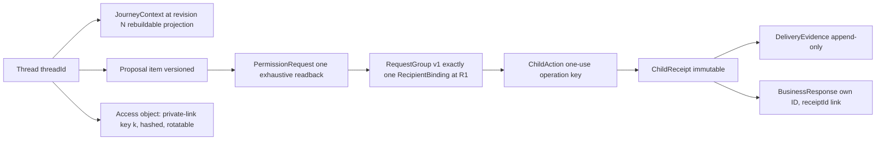

# Journey System — the connective tissue

**Created:** 2026-07-13 · **Status:** canonical (see README precedence)
**Owns:** everything BETWEEN pages: the object identity spine, route projections, transition envelopes, entry normalization, cross-actor sequences, notification re-entry, and the IA graph. Page specs own pages; this doc owns edges.
**Derived from:** 4 journey walks + IA cartography (`agent://WalkCoreR1`, `agent://WalkAltEntries`, `agent://WalkOwnerLoop`, `agent://MapIA`), each walking the page specs transition-by-transition under the assumption of success.

---

## 0. Why this document exists

The 15 page specs are individually coherent and collectively incomplete. Walking the journeys through them found:

- **5 BREAKs** — transitions where the specced journey cannot continue (no owner, no mechanism, or a runtime contradiction);
- **12 AMBIGUOUS seams** — two specs legal-but-disagreeing, or a mechanism named on one side only;
- **14 dangling half-edges** — transitions declared by a source page and received by nothing;
- **3-of-4 public nav pillars wrong in code** (Ask→`/engine`, Activity→`/admin/runs`, For agents→`/developers/discovery`).

The design's genuinely hard problems are all system-level: identity-less multi-day continuity, one object graph projected to four actors, and a funnel with a days-long hole in the middle. None of them is solvable on a page.

---

## 1. The identity spine

One journey = one chain of durable identities. Every route is a projection of this spine; no route owns state the spine doesn't.



**Spine invariants** (from WEDGE-LADDER §4, now bound to routes):

| Invariant | Consequence for routes |
|---|---|
| `threadId` exists before any consequential work (LAW-2) | EVERY entry path that can reach confirm-and-send MUST create or resolve a thread first — see §3 (C1) |
| Receipt proves one child action | `/t/:threadId` renders each sent record by identity; it never aggregates child actions |
| A business reply is a `BusinessResponse` linked to `receiptId`, never a receipt mutation | owner thread and customer thread project the SAME response identity |
| JourneyContext is a rebuildable projection; commands append events | no route dual-writes context; proposals reference `journeyContextRevision` |
| All writes are events; projections are derived | routes and operations MUST append through the authoritative transition path; direct writes to status, JourneyContext, receipts, comparisons, or other projections are prohibited <!-- tx-lens --> |

---

## 2. One route, access contract (C3) <!-- stupid-shit: S1 -->

One customer URL projects the journey. `/t/:threadId` is the canonical route before and after send; access posture determines which projection the visitor receives, never a second route.

| Access posture | May see | May write | Entry projection |
|---|---|---|---|
| `visibility-granted` | Participant-safe decision history allowed by the thread visibility object: ask, work, shortlist, proposal, permission, sent-record summary, and reply summary | Thread events and state-valid customer commands through the authoritative transition path | Full chronological thread, focused at the requested `#item-{id}` or section anchor |
| `key-granted` | Only the record-scoped thread projection encoded by the validated private-link access object: sent record, delivery, reply, notification preference, retention, and permitted prior context | Purpose-bound notification-preference writes, withdrawal, and C5 bounded-message commands; accepted commands append through the same thread-event owner | `Your record` region in `/t/:threadId?k=`, with notification links anchored to the exact record item or record region |

**Rules:**
1. The bearer key is an access method, not route identity. `threadId` alone grants nothing beyond the independently established visibility posture; a valid `k` grants only its encoded record scope.
2. Both postures read one projection version and render shared items by stable identity. Neither copies, re-derives, dual-writes, or upgrades the other's scope.
3. Entry changes emphasis, not canonicality: ordinary thread entry opens the chronological decision view; send completion and notification deep links open `/t/:threadId?k=` at `#record` or the signed `#item-{id}` target. Links between decision and record content are ordinary in-page anchors and render only when that content is within the current access scope.
4. Freshness uses one footer version marker in labelled mono text with `data-numeric`; stale-state recovery never presents an outdated projection as current.
5. Legacy `/i/:threadId?k=` MUST return a permanent `301` redirect to `/t/:threadId?k=`, preserving the key and any valid item fragment without logging or exposing it. <!-- stupid-shit: S1 -->

---

## 3. Entry normalization — `BeginSingleBusinessReview` (C1)

The walks found **6 request-start paths** and only 2 with a defined thread creator. This contract unifies them. Every start path terminates at ONE server operation:

```
BeginSingleBusinessReview({
  businessBindingRevision,            // required
  originating?: { threadId, journeyContextRevision, proposalId },  // thread-origin paths
  draft?: { fields, enteredAt },      // form-entered values (no-thread paths)
  idempotencyKey
}) → { threadId, journeyContextRevision, proposalId, canonicalPayloadDigest, reviewUrl }
```

Semantics: atomically **create-or-reuse** the thread, append `asked` events for every draft field (original value + time preserved — provenance for no-thread entries is `asked`, entered-in-form), project `JourneyContext@revision`, create the proposal + unsigned review. Idempotent per key. Editing in review appends events and bumps the revision — same producer regardless of entry.

`canonicalPayloadDigest` is computed from the one canonical serialization of the exact review fields (including schema version); review rendering and send admission MUST consume that same serialization and digest, never presentation JSON. <!-- tx-lens -->

| Start path | Thread source | Provenance seed |
|---|---|---|
| `/` composer submit (incl. legacy `?q=`, `/q/:answerId` after explicit submit) | created by home submit (already specced) | `asked` from composer |
| `/t/:threadId` → "Ask this business" | existing thread; proposal appended in-thread | carried `asked/understood/assumed` |
| `/:slug` listing CTA (thread-origin arrival) | resolved via transition envelope (§4) | carried |
| `/:slug` listing CTA (direct/SEO arrival) | **bootstrap** via this contract | `asked` from review form |
| `/registry` card CTA | **bootstrap**; goes THROUGH `/:slug/inquiry` (registry card CTA = link to the review route, which invokes bootstrap) | `asked` from review form |
| Machine (`/api/v1/requests`) | API creates request object; out of scope for this UI contract | per agent-surface contract |

**Resolved ambiguity (listing direct-entry):** `listing.md`'s two branches merge — a direct visitor ALWAYS gets the "Ask this business" CTA when the target gate passes; the review route opens with empty editable fields (bootstrap). "Tell us what you need → /" remains only as a secondary exit for visitors who want comparison first. `confirm-and-send.md` entry list gains registry-card and direct-listing entries.

---

## 4. The transition envelope (C2)

Ad-hoc `?from=registry&id=…` params cannot carry what the specs promise (filters, window, scroll, context revisions). One typed, versioned envelope for all intra-app transitions:

```
TransitionEnvelope v1 {
  origin: routeId,
  objectRefs: { threadId?, journeyContextRevision?, proposalId?, businessBindingRevision? },
  returnTo: { routeId, restore: opaque-handle },   // server-held; URL carries only the handle
  focus?: itemId,
  privacyClass: 'public' | 'contextual' | 'private'
}
```

- Mechanism: server-held continuation handle (short-lived, session-bound, single-audience); the URL carries `?tx={handle}` only. Never raw context in public URLs (listing.md key-safety holds).
- Reload/device behavior is explicit: handle expired or foreign device → route degrades to its direct-entry contract (listing shows public mode; registry return restores from URL search params which remain the canonical carrier for *shareable* result state — the envelope carries only *return/restore* state).
- This resolves half-edges: registry↔listing restoration, confirm "Don't send" → origin with preserved draft, and in-thread record anchors.

**State-carriage convention (locked, from the cartography audit):** path params = durable object identity · URL search = shareable result state · transition envelope = journey continuation/return · bearer `k` = private access only · session storage = local convenience only (never keys). No fifth mechanism.

---

## 5. Cross-actor system sequence (C5, C6)
<!-- tx-lens -->

The full R1 loop across four actors, every edge with its clock and notification:

```mermaid
sequenceDiagram
    participant C as Customer
    participant AE as AE (kernel + clocks + outbox)
    participant O as Owner
    C->>AE: Send request to {business} (one-use key + canonical digest)
    Note over AE: COMMIT atomically re-checks R1TargetAdmitted + full tuple validity; drift → named typed refusal + review invalidation
    Note over AE: Same key replays original result; same key + different digest is refused
    AE-->>C: /t/:threadId?k=#record — Your record (returnPosture computed, §6)
    AE-->>O: owner notification [Dispatch sweep clock ≥1/min]
    O->>AE: deep link → sign-in?redirect → /owner/inquiries/:id
    O->>AE: disposition: Reply | Request clarification | Decline | Snooze | Close
    AE-->>C: customer notification [Dispatch sweep] naming the exact event
    C->>AE: bounded customer answer (C5 — see below)
    AE-->>O: answer appears as linked item [Dispatch sweep]
    O->>AE: Close
    AE-->>C: closure notification + Notification-cessation clock
```

### C5 — Participant messaging contract (closes the biggest BREAK)
The walk proved the customer has **no reply path** after the owner responds — breaking PRODUCT.md's "respond when needed" and making the owner's "Request clarification" disposition theatrical. Contract:

1. One versioned message/response object shared by both access postures (same item identity in owner thread and the customer thread).
2. **Legal turns:** owner `Reply` → customer MAY send one bounded follow-up per owner message (text-only, no new fields/recipients/scope — no new consent needed because scope is unchanged); owner `Request clarification` → record shows the typed question + an answer composer scoped to that question; the answer is a `user_text` linked `answersItemId`.
3. Anything that would CHANGE scope (new fields, attachments, another business) exits to a fresh proposal/permission cycle (AX-6 preserved).
4. **Disposition executability:** Decline = real state + customer notification (policy is NOT conditional: declined is always visible on the record, distinctly from closed/no-reply/suppressed/delivery-failed). Snooze = persisted deadline + clock (added to JOURNEY §6 registry: `snooze-expiry` clock, owner-targeted requeue). Close = cessation clock verified before next dispatch claim.

### C6 — Routability & ownership admission
A business with no claimed owner CAN NEVER receive a send (walk found runtime doesn't check `claimStatus`). Target gate = published page ∧ verified inquiry destination ∧ claimed owner with resolvable notification recipient ∧ not suppressed ∧ readiness. Fail-closed with typed refusals projected honestly on listing/confirm (discoverable ≠ actionable, registry.md already distinguishes). No post-send claim rescue.

---

## 6. Return-channel readiness & notification envelope (C4)

The multi-day hole is bridged or the journey dies silently. At send, AE computes:

```
returnPosture = 'deliverable-channel' | 'user-held-private-link' | 'same-session-only'
```

- `deliverable-channel`: a qualifying email was already required/shared, or the user chose SMS/browser. Normal path.
- `user-held-private-link`: user copied the link or chose "no updates." Record states retention plainly.
- `same-session-only`: neither. The record shows a **non-blocking but explicit acknowledgment**: "If you close this page without saving your link, you may not be able to see the reply." Never a send gate (R0 covenant of no coerced identity extends here), but never silent.

**Notification deep-link envelope** (one schema, both audiences):
`{ target: /t/:threadId?k=#item-{id} | /owner/inquiries/:id, event: <exact event type>, focus: signed item target bound to key-version, purpose, cessationRef }`. Signed item target: expires with key rotation; failure degrades to the thread's record region with an orientation banner ("what changed since your last visit" from the key-scoped visit cursor). Owner links always carry the redirect-safe canonical URL.

---

## 7. Subsequent-business episodes (C7)

"Choose another business" after a reply/decline/no-reply: creates a **new RequestGroup + fresh proposal + fresh one-use authorization in the SAME thread** (a new episode, `episodeId` per item-spec grouping). Never mutates or extends the first group; never renders two groups as one multi-recipient act (that's R2). The thread thereby becomes the customer's durable decision record across sequential single sends; cumulative-exposure counters (WEDGE A4) count across episodes.

---

## 8. Navigation & route registry (kills the map divergence)

One generated registry drives shell nav, command palette, sitemap, and spec validation (IA-2 executable at last):

| Node | Status | Decision |
|---|---|---|
| `/activity`, `/for-agents` | specced, missing in code | build; nav points here (public pillars: Ask `/` · Businesses `/registry` · Activity `/activity` · For agents `/for-agents`) |
| `/engine` | live, competing front door | **kill contract:** redirect to `/` once composer ships; Shape C survives only as a mode of `/` (per maintainer adjustment); telemetry review at +90 days |
| `/how-it-works` | dangled from home.md | cut the link; home §7 narrative absorbs it (no new route) |
| `/privacy/remove-business` | real route, no spec | add a compact spec (trust-pages.md delta) |
| 7 advanced operator nav targets | nav entries, no routes | remove from `navigation.ts` until routes exist |
| Code nav Ask→`/engine`, Activity→`/admin/runs`, For agents→`/developers/discovery` | violations | fixed by registry adoption |
| `/api/requests` (unversioned) vs `/api/v1/requests` | two parallel protocols | v1 canonical; unversioned family gets a migration/sunset note in for-agents spec |
| Owner route param `:id` vs code `$threadId` | naming drift | code wins (`$threadId`); spec updated |

---

## 9. Journey × surface matrix

| Stage (JOURNEY) | Customer surface | System (clock) | Owner surface | Admin projection |
|---|---|---|---|---|
| Ask/clarify/shortlist | `/` → `/t` | — | — | `/admin/runs` (turn evidence) |
| Propose/review | `/t` → `/:slug/inquiry` | pending-lock reconciler | — | — |
| Send | `/:slug/inquiry` → `/t#record` | dispatch sweep, readback timeout | notification → inbox | delivery evidence |
| Wait | `/t#record` (+ notification) | no-reply window, retry budget | queue aging, snooze-expiry | correlation search |
| Respond | `/t#record` reply view; bounded answer | dispatch sweep | detail thread | response records |
| Terminal | `/t#record` terminal item (one recovery) | cessation, retention expiry | closed filter | audit events |

---

## 10. Break registry → owning contract

| # | Finding (walk) | Severity | Contract | Doc to amend |
|---|---|---|---|---|
| B1 | No-thread bootstrap unowned (registry/direct-listing entries) | BREAK | C1 §3 | confirm-and-send.md entries; listing.md branch merge; WEDGE §4 |
| B2 | Customer reply loop absent; clarification theatrical | BREAK | C5 §5 | owner-inbox.md; thread.md record projection; ITEM-SPEC turns |
| B3 | Unclaimed business can structurally receive sends | BREAK | C6 §5 | WEDGE §7 gate; listing/confirm gating |
| B4 | No-channel user dead-ends after multi-day wait | BREAK | C4 §6 | confirm-and-send.md; thread.md record projection |
| B5 | "Ask another business" has no creation semantics | BREAK | C7 §7 | JOURNEY stage 11; thread.md |
| B6 | Snooze/decline/close-cessation not executable | BREAK | C5 §5 | JOURNEY §6 clock registry (+snooze); owner-inbox.md |
| A1 | Thread→listing→confirm transport unnamed | AMBIG | C2 §4 | listing.md, thread.md |
| A2 | Separate `/t` and `/i` routes split one thread | RESOLVED | C3 §2 one-route access contract; legacy `/i/:threadId?k=` redirects permanently | thread.md; private-record.md projection spec | <!-- stupid-shit: S1 -->
| A3 | Notification item-target envelope gestured only | AMBIG | C4 §6 | JOURNEY §6.2 |
| A4 | `/activity` producers unspecified | AMBIG | §8 + activity.md amendment (producers: thread creation + meaningful thread visit; never record URLs) | activity.md |
| A5 | Registry return restoration exceeds carrier | AMBIG | C2 §4 | registry.md, listing.md |
| A6 | Owner-notification channel ownerless | AMBIG | C4 §6 envelope | JOURNEY §6.2, owner-settings.md |
| A7 | Legacy `/q/:answerId` resolution contract missing | AMBIG | §8 (redirect keeps; lookup/access/error contract added to home.md) | home.md |
| A8 | Owner label `:id` vs `$threadId`; nav vocab drift | AMBIG | §8 registry | owner-inbox.md |

Runtime divergences found by the walks (thin submit input, 4-state thread lifecycle, latest-reply-only readback, missing claimStatus check, both-provider dispatch without channel policy) are **implementation gaps**, tracked for build planning — the drift protocol says the docs are now authoritative and code must meet them.

---

## 11. Residue accepted (inverse premortem, journeys at scale)

Even with C1–C7: thread-origin and bootstrap-origin entries still exist — mitigated by C1 making ancestry identical in shape; four identities (thread/group/receipt/record) still require the cross-object lookup that admin search must provide (Stripe rule: any ID is a search handle); session-local Activity will still read as "empty" to returning multi-device users — accepted honestly, revisit only with accounts.
