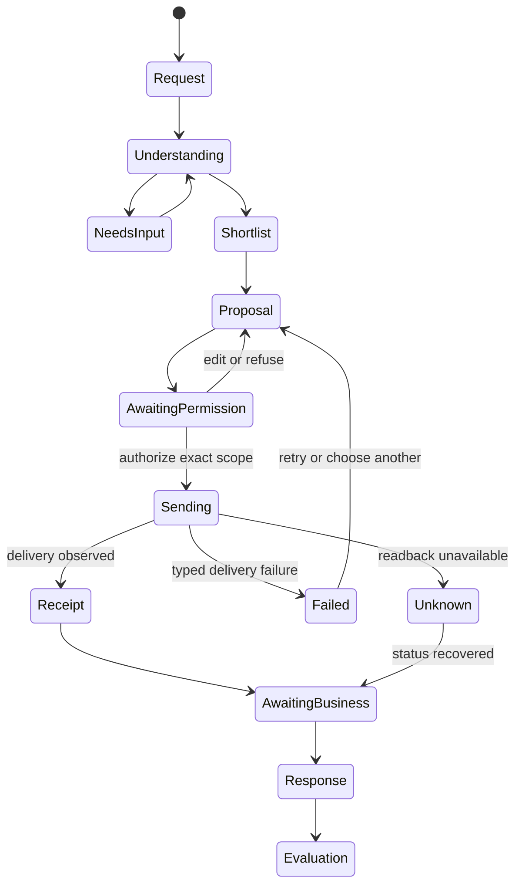

# AE Capability Ladder: Inquiry Wedge to Procurement Ceiling

**Status:** design contract · **First wedge:** R1 — one assisted inquiry to one business  
**Authority:** [`PRINCIPLES.md`](./PRINCIPLES.md) (rules and laws) · [`JOURNEY.md`](./JOURNEY.md) (stage semantics)

## 1. Governing decision

AE starts with a useful, truthful **single-recipient inquiry**, not a miniature procurement product.

> **Kernel-enables rule:** R1 records the recipient, brief, requested response, comparison basis, consent, delivery, and receipt in forms that can later support several recipients and structured quotes. R1 does **not** expose procurement, bill-of-materials, ordering, or vendor-management UI.

This preserves the destination without borrowing its product claims. The kernel carries task, constraints, authority, idempotency, evidence, and recovery; the first wedge presents only the capability that current supply can honestly fulfil. This applies the system-before-screen and no-future-surface-cosplay doctrine (IA foundations §9), keeps model output from creating authority, and separates recommendation, delivery, and business confirmation (AX-6, LAW-4).

### Authority vocabulary boundary

Internal records MAY use AE-native clearance/mandate concepts. Human-facing copy MUST translate them into the concrete permission being granted: what will be sent, to whom, once, and for what purpose. Signed agent identity is attribution, not authorization. A mandate is principal-bound, action-bound, scoped, expiring, and revocable; refusal is typed rather than a generic denial. Public surfaces never expose `kernel`, `clearance`, `mandate`, `greenlight`, or `protocol`, consistent with `handshake-internal-vocabulary` and `public-protocol-language` in `src/lib/ui/contract-scans.ts`.

## 2. Rung definitions

| Rung | User value and terminal object | Consent required | Business-side readiness required — non-fake threshold | Kernel/protocol primitives exercised | UI surfaces required now | Honest thin-supply / failure contract |
|---|---|---|---|---|---|---|
| **R0 — Answer + shortlist** | Interpret the need; show a bounded shortlist with evidence, limitations, and correction controls. Terminal object: durable answer/shortlist under `/t/:threadId`. | **None for external action.** Query submission consents only to AE processing the request. Selecting a business changes context; it does not authorize contact (AX-6). | Registry records with enough current facts to justify inclusion: capability/category, service boundary, evidence posture, and a supported next action. No claim of live availability or responsiveness. | Natural-language task + constraints; candidate retrieval; evidence/provenance; inspectable recommendation; stable thread/run identity. No action mandate and no external send. | Composer-first `/` (D1, LAW-1); durable thread (LAW-2); document-spine answer, evidence disclosure, editable constraints, shortlist cards (CH-2, CH-5, LAW-7, LAW-9). | Say the source is bounded and name the unmatched constraints. Offer individual relax/edit actions or browse; never silently broaden or invent candidates (DS-13, LAW-8). |
| **R1 — Single assisted inquiry** **FIRST WEDGE** | Turn the understood need into a reviewable brief and send it once to **one user-selected business**. Terminal object: pending-lock plus durable inquiry receipt; a later business reply is a linked item, not receipt mutation (LAW-6). | **Explicit, single-use consent immediately before send.** Read back recipient, exact fields, requested response, contact details, limits, and what AE will not do. Named action: “Send inquiry to {business}” (AX-1–AX-5, LAW-5). Refusal/cancel remains symmetric (AX-4). | One business has a valid routable inquiry destination; AE can durably record delivery attempts; the business has a real inbox/operator path to read and answer; reply correlation reaches the inquiry thread. A listing alone is insufficient. Claimed/onboarded capability MAY improve confidence but must not be implied when absent. | Principal + action class/reference; scoped recipient and disclosed fields; expiry/revocation posture where supported; idempotency key + payload hash; single-use authorization; delivery evidence; typed refusal/proof-gap; receipt/correlation ID. Agent signatures, if present, establish identity only—not send authority. | R0 thread; structured-brief review item; single-recipient permission item; pending lock; receipt with state, ID, timestamp, recipient, submitted fields, expected response posture, withdraw/recovery where supported; linked response item (D2, CH-11, LAW-3, LAW-6). | If no business is genuinely routable, keep the answer/shortlist and say AE cannot send this inquiry. Offer another listed business or editable brief. If delivery fails, persist `delivery_retrying` or `delivery_failed`; if readback is unavailable, show `status_unknown`, never “business unavailable” or “confirmed” (CH-6, CH-9, LAW-4). |
| **R2 — Consent-bounded fan-out** | Send one normalized brief to a user-approved set of **up to N named businesses**. Terminal object: one request group with one child inquiry/receipt per recipient. | **One explicit consent over an enumerated set and hard cap.** Readback names every recipient (or requires review of the complete set), shared fields, per-recipient variation, and maximum N. Adding/replacing a recipient requires new consent; model output cannot silently widen scope. | A sufficient pool of independently routable, relevant businesses; each has delivery and reply-correlation capability; suppression/opt-out and duplicate-contact controls work per recipient. The product must distinguish “few eligible businesses” from delivery failure. | R1 primitives plus recipient-set version/hash; cardinality cap; child action refs and idempotency keys; per-recipient delivery/evidence states; group cancellation; partial-failure recovery; immutable consent snapshot. | Recipient-set editor; one group permission item; per-recipient status rows; partial-success receipt; replace/remove flow that repeats changed consequences. Comparison is not promised merely because several inquiries were sent. | Reduce the proposed recipient set **before consent** and explain why. After send, retain each child’s truthful state; never pad N with weak matches, silently reroute, or collapse partial failure into group success (LAW-3, LAW-4, AX-3). |
| **R3 — Quote build-up + structured comparison** | Ask qualified businesses for the same defined response components, collect responses, normalize only commensurable fields, and compare evidence/unknowns. Terminal objects: quote requests, immutable response versions, and a comparison view with explicit basis. | R2 send consent **plus** review of requested quote fields, attachments, deadlines, and disclosure scope. Any follow-up requesting new data or sharing one vendor’s information requires a new scoped authorization. User approves; AE does not negotiate autonomously. | Businesses can return sufficiently structured, attributable responses (native structured endpoint or reliable operator workflow); quote version, validity window, inclusions/exclusions, assumptions, tax/price posture, and provenance can be retained. Enough comparable responses must exist to justify a comparison. | R2 primitives plus response schema/version; requested-field contract; response attribution and signatures/evidence posture; quote validity/expiry; follow-up action refs; comparison-basis version; provenance-preserving normalization; typed missing/non-comparable fields. | Quote-request review; response inbox; side-by-side comparison whose columns disclose authoritative, derived, missing, and non-comparable values; quote-version detail; clarification permission; no synthesized authoritative totals. | Show returned responses individually and label why comparison is incomplete. Do not rank incomparable quotes, fill absent values, treat silence as decline, or present an AE estimate as a business quote (CH-5 provenance, LAW-4, LAW-7). |
| **R4 — Procurement plan / BOM fan-out** **CEILING, NOT WEDGE** | Accept a procurement plan or bill of materials, decompose it into request packages, route packages to qualified vendors, request quote build-up, and compare coverage across the plan. Terminal object: versioned plan → package graph → vendor responses → evaluation plan. **No ordering or payment authority.** | Explicit approval of plan version, package boundaries, recipient sets, disclosed documents/fields, deadlines, and each externally observable fan-out. Material plan changes invalidate prior authorization. No blanket “handle procurement” consent. | Vendors expose verified capability/coverage and can receive structured packages, answer line items, state substitutions/minimums/lead times/validity, and correlate revisions. Supply density must cover enough packages to produce a useful evaluation; otherwise the plan remains analysis-only. | R3 primitives plus versioned task/dependency graph; package-to-recipient bindings; authority scoped by plan/package/version; caps and expiry; parent/child runs; inspectable route proposal; cancellation/recovery; complete audit lineage. HTTP, agent endpoints, and human handoffs remain adapters, not separate product semantics. | **Deferred.** Eventually: plan/BOM importer-editor, package graph, recipient-mapping review, staged permission items, coverage matrix, revision lineage, evaluation plan. None may appear in R1–R3 merely to advertise the ceiling. | Preserve the plan and identify uncovered packages, unsupported fields, and non-comparable responses. Offer analysis/export or narrower requests; never invent vendors, claim full coverage, imply an order, or convert “sent” into “confirmed.” |

## 3. Wedge selection: R1

### Decision scorecard

| Criterion | R0 | R1 | R2 | R3 | R4 |
|---|---:|---:|---:|---:|---:|
| Supported by current registry/inquiry reality | Strong | **Strongest consequential step** | Partial | Weak | Ceiling only |
| Requires supply-side workflow beyond current inquiry handling | No | **Minimal** | Material density + group operations | Structured quote adoption | Plan/package vendor network |
| Demonstrates value beyond directory/search | Moderate | **High and legible** | High if density exists | High if response structure exists | High only at mature supply |
| Can remain boundary-honest without payments/order authority | Yes | **Yes** | Yes | Yes, with strict quote provenance | Yes only as request/evaluation tooling |
| Abandonment risk before first real outcome | Low | **Low enough: one review + one send** | Higher | High | Highest |

**Chosen first wedge: R1.** R0 is the zero-consent entry experience but is not the commercial/action wedge: search and shortlist alone stop where directories stop. R2 introduces recipient-set anxiety, supply-density requirements, partial-failure semantics, and another review burden before AE has proved that one inquiry is useful. R3/R4 depend on structured business participation that current registry presence cannot establish. The repo has registry and inquiry seams and no payment/order authority; R1 uses what exists without impersonating future supply.

<!-- tape-out: A14 -->
### Why R1 is demonstrably better than calling directly

“Better than calling directly” is an **R1 eligibility claim**, not a general description of AE. It MAY be presented only for an offered R1 send when all five conditions below are proven for that category-and-channel cohort:

1. **No re-explaining:** the interpreted need and constraints become a structured, correctable brief (CH-5), not a generic contact form.
2. **Fit evidence before contact:** the recipient is selected from an evidence-bearing shortlist, with limitations visible (CH-2, LAW-7).
3. **Consequence readback:** the user sees exactly what data will go to exactly one business before the named send (AX-1, AX-3, LAW-5).
4. **Durable accountability:** pending lock prevents duplicates; the first-class receipt preserves the submitted evidence and recovery lineage (AX-5, LAW-6).
5. **Continuity:** the response returns to the same durable thread and can be evaluated against the original need; the user does not restart context in phone, email, and notes.

Eligibility MUST be measured per category-and-channel cohort. AE MUST NOT offer R1 sends in cohorts below declared routability and reply-rate readiness thresholds; that journey MUST end honestly at R0 with direct-contact details. If AE cannot deliver and correlate the inquiry, R1 is **not** better than a direct call. “AE wrote nicer prose” is not sufficient wedge value. This claim grades only eligible R1 sends and MUST NOT be used to grade or market R0, R2, R3, or R4 surfaces.

### R1 success proof

R1 is proven only when a real user can: compose a need at `/` → correct the understood brief → choose one routable business → review recipient and shared fields → consent once → see a duplicate-safe pending state → receive a durable sent/delivery-failure receipt → receive or revisit a correlated business response. A shortlist click or generated draft alone is not wedge completion.

## 4. Ladder invariants: design once at R1

These are domain seams, not promised future controls. They MUST exist in the conversation-item projection and journey contract at R1 so R2–R4 extend cardinality and schemas rather than replace the model.

<!-- tape-out: A1 -->
### 4.1 Generalizing record seams

| Seam | Seam status | R1 minimum | Generalization without redesign | Invariant |
|---|---|---|---|---|
| **Task identity** | specified | Stable `threadId`, `requestId`, item IDs, correlation ID | Parent/child request groups, quote requests, plan/package graph | Identity exists before consequential work completes (LAW-2); retries never overwrite history. |
| **Recipient set** | specified | A set containing exactly one versioned recipient binding | R2: up to N; R3: quote participants; R4: package-specific vendor sets | Consent binds the exact set/version. Recipient replacement creates a new proposal/authorization; no silent widening (AX-3). |
| **Structured brief** | specified | Versioned need, constraints, timing, location/service boundary, disclosed contact fields, and provenance per field; text plus typed structured fields only until the R1.5 attachment gate passes | R1.5 may add gated document attachments; R2 shares a normalized core; R3 adds requested quote fields; R4 embeds or references package/BOM lines | User can correct carried context; `asked / understood / assumed / found / authorized` remain distinct (CH-5). Files MUST NOT enter the disclosure scope before the attachment gate below passes. |
| **Requested-response schema** | deferred | Explicit response ask, even if initially human-readable: availability posture, quote/contact response, questions, free text | R3 adds typed quote fields and versions; R4 adds line-item coverage, substitutions, lead times, dependencies | Missing stays missing; business-authored facts remain distinguishable from AE-derived values. Schema version is retained with each response. |
| **Comparison basis** | invariant-only | Snapshot of the user’s selection criteria and priorities, even with one recipient | R2 prepares cross-response evaluation; R3 renders structured comparison; R4 evaluates package/plan coverage | Basis is versioned and inspectable. Changing it does not mutate source responses or fabricate a new quote. |
| **Authority envelope** | specified | Enforced principal-, subject-, action-, brief-, recipient-, disclosure-, purpose-, expiry-, and nonce-bound tuple | Caps N at R2; scopes follow-ups/quote fields at R3; scopes plan/package/version at R4 | Identity never grants authority. Model output never expands scope. Every refusal/proof gap is typed and rendered with a recovery (AX-4, CH-9). |
| **Action lineage** | specified | Proposal → permission decision → child action/send attempt(s) → child receipt → delivery evidence/response | Group/child sends, quote revisions, package runs | Recommendation, authorization, attempted delivery, observed delivery, and business confirmation are separate facts (AX-6, LAW-4). |
| **Group lifecycle** | deferred | R1 persists the group/child identity relation; the group contains exactly one binding | Partial groups, expiring quotes, uncovered packages | Parent summaries are projections, never evidence. One canonical lifecycle and one status narrative apply per scope (CH-1, CH-7, LAW-3). |
| **Public protocol** | deferred | No public protocol is implied; R1 retains internal submitted payload, consent, recipient, delivery, and receipt evidence | A separately versioned public envelope may later project per-recipient evidence, response provenance, comparison lineage, and plan audit lineage | Internal generality creates no public capability. Public projections MUST preserve provenance and MUST NOT promote a parent summary into evidence (CH-2, AX-5). |

The normative internal object model exists at R1 even though no R2 UI exists:

`RequestGroup(version) → RecipientBinding(version) → ChildAction → ChildReceipt → DeliveryEvidence / Response`

At R1, each `RequestGroup` MUST contain exactly one `RecipientBinding`. A `ChildReceipt` proves exactly **one** externally observable `ChildAction`. N recipients therefore produce N child actions and N receipts; a derived group summary MAY aggregate their states but is non-evidentiary. Parent summaries are projections, never evidence.

<!-- tape-out: A2 -->
### 4.2 First-class receipt and response records

`ChildReceipt` and `BusinessResponse` are FIRST-CLASS RECORDS, not conversation-item projections. A receipt MUST store an immutable submitted payload hash and snapshot, consent snapshot and version, recipient-binding version, operation ID, correlation ID, and schema version. A business response MUST have its own ID and version, `receiptId`, source event, dedupe key, and received timestamp. Delivery history MUST reference its receipt and MUST NEVER mutate receipt evidence.

<!-- tape-out: A5 -->
### 4.3 Enforced authority envelope

Every externally consequential action MUST be admitted against this enforced tuple:

`principalId + subject/data-subject posture + actionClass + actionRef + briefRevision + recipientBindingVersion + disclosedFieldIds/hashes + purpose + expiry + one-use nonce/idempotency key`

Any material change MUST create a new proposal and trigger a new mandate evaluation. A retry MAY reuse authorization only when both payload hash and `actionRef` are unchanged. Agent-originated writes MUST FAIL CLOSED without principal or delegation proof. The signer is attribution and MUST NOT be treated as the principal. Scope mismatches MUST produce typed refusals. Identity never grants authority; model output never expands scope.

### 4.3b Transaction discipline <!-- decision: smart-contract semantics, 2026-07-13 -->

Every externally consequential AE action executes with smart-contract transaction semantics, WITHOUT distributed consensus, tokens, or money movement (banned here). The transaction moves information and bounded authority only.

| Guarantee | Mechanism | Rule |
|---|---|---|
| Signed intent over exact bytes | Authorization tuple (§4.3) binds a **canonical payload digest** | The brief MUST have ONE canonical serialization (schema version inside the hashed bytes; sorted keys; normalized values). Both review UI and admission compute the same digest; a digest mismatch is a typed refusal. Never hash presentation JSON. |
| Preconditions at execution, not review | `R1TargetAdmitted` (§7) + tuple validity re-evaluated **atomically at commit** | State drift between review and commit (suppression, binding revision, mandate expiry) MUST refuse with the drifted precondition named, invalidating the review (JOURNEY §4 invalidation). Never send against a stale precondition snapshot. |
| No replay | One-use nonce/idempotency key (§4.3) | Same key → the original result; same key + different digest → typed refusal. |
| Single state-transition function | `BeginSingleBusinessReview` → send admission (JOURNEY-SYSTEM C1) | No side-door mutation may create, modify, or dispatch a consequential action. |
| Append-only log; state is derived | Evidence ledger (§4.2) | Commands append events; every status/projection is derived. Direct projection writes are PROHIBITED (this supersedes any runtime pattern that mutates thread status in place). |
| Receipt ≠ outcome | LAW-6 + `doesNotProve` | The receipt is the transaction receipt: it proves admission and dispatch evidence, never business confirmation. The business is the oracle; AE records its answer and never adjudicates the real-world outcome. |
| Bounded blast radius | Scope caps, expiry, cumulative-exposure budgets (§7) | The gas-limit analogue: no authorization is open-ended in recipients, fields, purpose, or time. |
| Two-party attestation (target state) | Countersigned responses | A business reply SHOULD be recorded as a signed event: the owner's authenticated session countersigns the response digest, giving the record two-party attestation. The same admission machinery verifies agent principals (Web Bot Auth + delegation) at J7. |
| Deterministic replay | Ledger completeness | Given the event log, any projection (record, comparison, export) MUST be recomputable. Dispute answers come from replaying the ledger, not from trusting a projection. |

### 4.4 Conversation-item primitive contract

The shared primitive (D2, CH-11) MUST support these item kinds without domain-specific bubble forks:

- `user_request` — original or revised intent;
- `clarification` — missing fact with field-level correction;
- `work_record` — public checks, sources, assumptions, and bounded progress;
- `proposal` — structured brief + recipient-set snapshot + comparison-basis snapshot;
- `permission_request` — exact action/object/consequence/data/recipients with Allow and Don’t allow;
- `status` — durable semantic state and expected transition;
- `receipt` — projection of an immutable first-class receipt plus referenced delivery history;
- `response` — projection of a separately attributable, versioned first-class business response;
- `error` — persisted typed failure with one primary recovery.

Every item carries stable identity, timestamps, audience/visibility, provenance, related-object references, and lifecycle state. Presentation follows a document spine, not cloned bubbles (LAW-9). The primitive MAY render different bodies by kind; it MUST NOT collapse proposal, authorization, execution, receipt, and response into one mutable card.

### 4.5 Journey contract

At R1, `recipientSet.cardinality = 1`; later rungs add child actions and richer response/evaluation projections, not new authority grammar. “Sent,” “delivered/read back,” “business responded,” and “business confirmed” remain separate transitions (LAW-4). AE always follows the request-authority branch—never the book/order authority branch (Design Study, Airbnb signature mechanic).

<!-- tape-out: A10 -->
### 4.6 Status vocabulary invariant

“Confirmed” is reserved for business-origin assertions ONLY. Delivery adapters MAY emit `queued`, `sent`, `delivered`, or `readback-unknown`; they MUST NEVER emit `confirmed`. The lifecycle edge from delivery to confirmation is forbidden without business-origin evidence. **sent never means confirmed**; AE never books/charges/confirms; business confirms. Release verification MUST include semantic fixtures beyond regex scanners, including fixtures proving that a receipt cannot mutate into confirmation and that every confirmed field is provenance-gated.

## 5. No-future-surface-cosplay rule

A general field in an internal record does not justify a visible feature. A future rung may enter UI only when its business readiness threshold, end-to-end states, refusal/recovery branches, and executable truth checks exist. Until then:
<!-- sim: G1 -->
### 5.1 Comparison boundary at R1

A **READ-ONLY comparison view** across at least two attributable business replies obtained through separate, sequential R1 episodes is R1-legal. It compares evidence the user already holds: it MUST preserve each reply’s business attribution, source record, version, unknowns, and comparison basis, and MUST NOT normalize non-commensurable claims into invented equivalence. Each episode retains its own `RequestGroup`, one `RecipientBinding`, authorization, child action, and record.

This view grants no send authority. A simultaneous or single-action **SEND to multiple recipients remains R2**, even if the recipients or brief already appear in the comparison. Implementers MUST NOT treat a read-only aggregation of sequentially obtained replies as fan-out, and MUST NOT use the comparison view to smuggle in recipient selection, batch send, follow-up, negotiation, or changed disclosure scope.

- Do not render disabled, “coming soon,” simulated, example, or empty R2–R4 controls in R1.
- Do not call a one-recipient object a campaign, sourcing event, procurement request, or vendor workflow.
- Do not expose internal kernel/mandate/protocol vocabulary to explain extensibility.
- Do not show a comparison shell before at least two attributable business replies from sequential episodes exist. The view MAY place non-commensurable replies side by side only when it preserves their differences and unknowns; calculated comparison fields require commensurable source values.
- Do not show quote totals unless the business supplied the values and their validity/assumptions are retained.
- Do not describe registry candidates as onboarded supply unless their routable capability is evidenced.
- Do not put future rung marketing inside the action rail; action rails contain current decisions only (IA-9).
<!-- sim: findings -->
- Do not fake account-era operations in R1. **Portfolio worklists, recurring schedules, compliance rounds, saved sites or templates, and multi-subject caseloads are post-R1 account-era capabilities.** R1 surfaces MUST NOT render empty, disabled, simulated, or locally improvised versions of them. Thread-scoped sequential episodes and their records are not an account, portfolio, recurring-work engine, or caseload.

## 6. Anti-scope and copy guardrails for R1 surfaces

### 6.1 Forbidden R4 language and UI

R1 public or assistant-visible surfaces MUST NOT contain:

| Forbidden family | Forbidden examples | Why |
|---|---|---|
| **Procurement** | “procurement workspace,” “source suppliers,” “procurement request,” “managed sourcing” | Implies R4 plan decomposition, supply coverage, and operational authority that R1 does not provide. |
| **BOM / plan orchestration** | “bill of materials,” “BOM upload,” line-item coverage, package graph, package allocation | Advertises an undesigned importer/schema/vendor workflow. Internal generality is not public capability. |
| **Ordering** | “place order,” “submit order,” “order confirmed,” cart/checkout controls, purchase-order issuance | AE has request authority only. The business confirms; R1 sends an inquiry and performs no order/payment action (AX-6, LAW-4). |
| **Vendor management** | vendor dashboard, preferred-vendor list, vendor scorecard, negotiation automation, supplier performance | Implies persistent multi-vendor operations and evaluative authority absent at R1. Use “business” on customer surfaces. |
| **Multi-recipient scale** | “send to providers,” “contact multiple businesses,” “get competing quotes,” recipient-count selector | R1 authorizes exactly one named business. Do not imply R2/R3 supply density or outcomes. |
| **Autonomous commercial action** | “AE negotiates,” “AE books,” “AE confirms,” “AE buys,” “AE handles it end-to-end” | Collapses proposal/execution/external confirmation and violates the request-authority boundary. |
| **Money/payment infrastructure** | wallet, custody, checkout, marketplace, payment, credits, settlement | Banned or phase-deferred public claims; `generic-money-language` specifically rejects wallet/custody/checkout/marketplace. No payment surface is part of this ladder. |
| **Internal architecture** | kernel, clearance, mandate, greenlight, protocol, gateway, ActionContract | `handshake-internal-vocabulary` and `public-protocol-language` forbid this in public/assistant-visible copy. Translate to concrete permission and receipt language. |

The scanner does not need to enumerate every R4 noun for the design rule to apply. Copy checks are a floor, not permission to publish unscanned overclaims. Apply `pm05-trust-overclaim` as the broader guard against booking, payment, dispatch, autonomy, live availability, and marketplace-liquidity implications.

### 6.2 Required boundary copy at R1

Place these facts beside the named send action and repeat them in the receipt (AX-7):

- “This sends your request to **{business}**.”
- “AE will share: **{field list/readback}**.”
- “The business confirms its quote, timing, availability, and whether it can help.”
- Status wording distinguishes **sending**, **sent/delivery observed**, **waiting for the business**, **business responded**, **delivery failed**, and **status unknown**.

Never turn “sent” into “confirmed,” never call an AE-generated estimate a quote, and never imply the business accepted merely because a delivery channel acknowledged the message (LAW-4).

<!-- sim: G9 -->
### 6.3 R1.5 document-attachment gate

A document attachment is a **disclosure-scope expansion**: file contents are undeclared fields until parsed, classified, and read back. No attachment control, upload affordance, drag target, paperclip, attachment claim, or document-dependent journey MAY ship until every requirement below is implemented and verified end to end:

1. **Typed file classes:** an allowlist of supported document classes and media/MIME mappings; unknown, mismatched, encrypted, or unsupported files fail closed with a typed recovery.
2. **Size limits:** declared per-file and per-request limits enforced before durable acceptance, with accessible copy that names the limit and preserves the text brief on rejection.
3. **Virus and audit posture:** quarantine before recipient access; malware scanning with typed pending/clean/rejected/unavailable states; immutable upload, scan, access, and deletion audit events; no delivery while scan status is unknown.
4. **Disclosure readback naming the document:** the confirmation MUST name each document, its file class, recipient, purpose, and whether its contents are shared; replacement or version change invalidates prior authorization and requires a fresh readback.
5. **Retention class:** a declared retention, access, export, erasure/redaction, and tombstone policy for file bytes and derived content, separate from immutable event evidence.

Until this R1.5 gate passes, briefs are **text plus structured fields only**. Every R0/R1 spec, example, CTA, empty state, and machine-readable claim MUST NOT imply upload, document, image, specification-sheet, intake-form, or other attachment support.

<!-- tape-out: A12 -->
### 6.4 Retention & evidence separation

This section is an R1 RELEASE GATE.

- Immutable event evidence—hashes, metadata, recipient identity, authorization decision, timestamps, and delivery observations—MUST be retained under a declared schedule.
- Raw payloads, contact data, and replies MUST be encrypted and field-separated. They MUST be erasable or redactable; tombstones MUST preserve event lineage without retaining erased content.
- Private-link keys MUST be high-entropy, stored only as hashes, have declared validity, support rotation and revocation, and be stripped from logs and telemetry.
- Notification consent MUST end when the request closes or expires.
- AE MUST be able to reproduce dispute evidence from the exact outbound bytes, source facts and their ages, authorization snapshot, and delivery observations before R1 release. This is not deferred operations work.

<!-- tape-out: A4 -->
## 7. Release gates by rung

| Gate | R0 | R1 | R2 | R3 | R4 |
|---|---|---|---|---|---|
| Honest supply proof | Evidence-bearing shortlist | ≥1 published, verified inquiry destination with explicit acceptance/suppression state per offered send; cohort passes routability + reply-rate thresholds | Enough eligible businesses for the stated cap | Structured, attributable quote responses | Package-capable vendor coverage |
| Authority proof | No external action | Exact one-recipient authorization | Versioned set + cap authorization | Response-field/follow-up scopes | Plan/package/version scopes |
| State proof | Answer/zero-match recovery | Pending lock, receipt, reply, failure, unknown | Per-recipient partial states | Versioned quote + non-comparable states | Package coverage + revision lineage |
| Abuse-control proof | No external contact | Business suppression/blocklist and opt-out; per-business and per-principal rolling contact budgets; semantic duplicate detection; category/time cooldowns; complaint workflow; emergency kill switch | R1 controls remain authoritative per child and group | R1 controls plus structured-request abuse cases | R1 controls plus plan/package abuse cases |
| Cumulative-exposure proof | No external contact | Authoritative counter across request lineage; attempts and failures count, not only deliveries; renewed review at declared thresholds | Same counter spans group/child lineage | Same counter spans quote/follow-up lineage | Same counter spans plan/package lineage |
| Evidence/privacy proof | Source schedule applies | Declared retention; evidence/payload separation; private-link lifecycle; consent cessation; dispute reproduction | R1 controls extend per child | R1 controls extend per response version | R1 controls extend per package graph |
| Public UI allowed | Composer, thread, shortlist | Single-recipient proposal/send/receipt | Only after R2 gate | Only after R3 gate | Only after R4 gate |
<!-- journey-system: B3/C6 -->
### 7.1 R1 routability and ownership admission

For a proposed single-business send, admission MUST be one testable predicate evaluated atomically at send time:

`R1TargetAdmitted = pageStatus == 'published' ∧ inquiryDestination.status == 'verified' ∧ claimStatus == 'claimed' ∧ owner.notificationRecipient.status == 'resolvable' ∧ suppressionStatus == 'not_suppressed' ∧ readinessStatus == 'ready'`

Every conjunct is REQUIRED. The `claimStatus == 'claimed'` check MUST be explicit; registry presence, a verified destination, or a previously drafted confirmation MUST NOT substitute for it. An unclaimed business, a claimed business without a resolvable owner notification recipient, or any otherwise ownerless business MUST NEVER receive a send.

<!-- stupid-shit: S2 -->
**Cold-start consequence:** the claimed-owner requirement makes supply activation (J6) a PRECONDITION of the send wedge (J3). Launching J3 into an unclaimed catalog yields honest refusals, not sends. Pre-claim forwarding to published public contacts is REJECTED because it re-inherits the spam and misrepresentation duties this gate exists to prevent; there is no post-send claim rescue. Directory value (J1/J2) carries the product until claims exist.

Admission MUST fail closed before any child action, delivery attempt, or sent record is created. Each false or unreadable conjunct MUST return exactly one typed refusal: `page_not_published`, `inquiry_destination_unverified`, `business_unclaimed`, `owner_recipient_unresolvable`, `business_suppressed`, `business_not_ready`, or `admission_state_unavailable`. When several conjuncts fail, refusal selection MUST use that listed order; an unreadable admission dependency returns `admission_state_unavailable` before evaluating values derived from it. Listing and confirmation projections MUST render the refusal honestly and MUST NOT imply that discoverability means actionability.

There is NO post-send claim rescue. Claiming or repairing ownership after refusal MAY make a later, newly reviewed proposal eligible, but MUST NOT resume, replay, or retroactively authorize the refused send.

Registry presence is NOT consent to leads. R1 MUST route only to a published, verified inquiry destination with explicit acceptance/suppression state. The R1 gate MUST enforce every abuse control above before send; these controls are not deferred to R2 and cumulative exposure is not optional UI.

**Cutover rule:** advance a rung only when its supply proof and unhappy-path state proof exist end to end. Kernel schemas may precede the UI; public capability claims may not.
