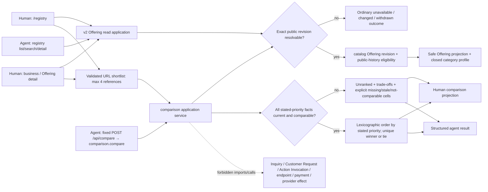

# Phase 05: Consumer decision support - Research

**Researched:** 2026-07-23
**Domain:** public Offering discovery, exact-revision shortlisting and inspect-only comparison
**Confidence:** HIGH for source topology and product constraints; MEDIUM for external web guidance

<user_constraints>
## User Constraints (from CONTEXT.md)

### Locked Decisions
- **D-01:** The canonical loop is **state an ordinary-language need → reflect the understood constraints → ask at most one decisive clarification when required → retrieve → answer or explain the exact insufficiency → inspect or refine**. Browse → Offering → shortlist → compare remains the transparent fallback and evidence path.
- **D-02:** Ask is the primary cold-start product surface. The public catalogue remains a first-class browse and evidence surface, but a fresh visitor must not need AE vocabulary or manual comparison setup before receiving value. Both surfaces converge on the same source-owned facts.
- **D-03:** Browsing, detail, shortlisting and comparison require no account. Authentication must not sit between discovery and comparison.
- **D-04:** Public transient comparison is required for closure. Signed-in saving is secondary and must not block Phase 5. If saving is included, it preserves a historical selection and reports newer revisions rather than silently rewriting history.
- **D-05:** Compare Offerings, not businesses. Business identity and concrete provenance/currentness facts remain visible as context.
- **D-06:** A selected item binds at least `businessId`, `offeringRef`, `offeringRevision` and `projectionObservedAt`; comparison never copies a second mutable version of Offering truth.
- **D-07:** There is no universal score, generic reputation grade or implicit “trust” number. Show who supplied a fact, when it was observed, whether it is current/partial/stale, whether an access path is declared or observed, and whether AE supports a named action.
- **D-08:** Use a common versioned comparison envelope plus bounded versioned category fact profiles. Missing material is explicit as unknown, not supplied, stale or not comparable. Do not create a universal property bag or broad industry ontology.
- **D-09:** Default output is unranked. Ordering or recommendation is allowed only when the customer stated a priority, the relevant facts are genuinely comparable, the rule is inspectable, and missing/stale data cannot improve an Offering's position.
- **D-10:** Human and agent surfaces derive from one Offering-based comparison semantic contract. Phase 5 must reconcile the legacy service-shaped registry action output before claiming parity.
- **D-11:** Access-path facts may remain visible, but Phase 5 comparison actions are limited to view Offering, add/remove shortlist item, compare and change priorities. It must not initiate inquiry, endpoint invocation or another external effect.
- **D-12:** Comparison must remain query-, provider- and category-agnostic at the shared envelope. Category-specific renderers or fact profiles cannot become a second workflow or control plane.
- **D-13:** Closure requires durable source, public human routes, equivalent structured agent actions and exact-revision hosted readback using clearly labelled demo data.
- **D-14:** Acceptance spans two materially unlike categories: one professional-service Offering with potentially unknown price/timing/scope, and one machine/data Offering with technical interface facts.
- **D-15:** Evidence covers current, partial, stale, unknown and changed-revision material; an unranked result; a defensible priority-based ordering; refresh/share behavior; and proof that no comparison path causes an external effect.
- **D-16:** This evidence proves a hosted comparison capability over labelled data. It does not prove real demand, customer value, supplier quality, independent fulfilment, willingness to pay, retention, revenue or production safety.
- **D-17:** GenUI is the primary presentation, bounded by a complete deterministic answer and source-owned facts, ordering, caveats and continuations.
- **D-18:** The normalized Perth website-developer request is the primary cold-start golden query; website-function is the one decisive clarification and price evidence classes remain explicit.
- **D-19:** A blank-session eval must reach an honest result or insufficiency without teaching the evaluator Offering, revision, shortlist or priority terminology.

### the agent's Discretion
- Exact shortlist capacity, URL encoding, responsive comparison layout and the initial two category-profile field sets may be chosen during planning, provided they remain bounded, accessible and faithful to the decisions above.

### Deferred Ideas (OUT OF SCOPE)
- Required signed-in saved-comparison lifecycle, deletion and cross-device history.
- Inquiry, quote request, tender, negotiation, booking, endpoint invocation, payment, dispatch and fulfilment.
- Customer Request and RoutePlan composition.
- Reviews, reputation, universal trust/scoring, sponsored placement and marketplace guarantees.
- Broad category ontology, crawling, endpoint verification and live-price guarantees.
- Independent business/customer evidence, willingness to pay, retention and market-liquidity mechanisms.
</user_constraints>

## Summary

The planner is supporting one decision: how to turn the inherited Offering lane into a public, inspect-only choosing loop without importing execution machinery or inventing a marketplace score. The informed path is dependency-ordered: first integrate and freeze the Offering source lane, then reconcile the current human/agent v2 mismatch, then add a reference-only comparison owner, and only then build the public URL/UI and hosted evidence. This keeps the write blast radius in `catalog`, `registry`, a new `comparison` module, public routes/components, discovery descriptors and focused tests; `customer-request`, `capability-supply`, Action Invocation, inquiry, payment and provider-effect code remain read-only context. [VERIFIED: source inspection at HEAD `1f574cf214d83db2e283fee287e85e6084c65ef0`]

The current checkout cannot be used as the Phase 5 implementation base yet. The Offering core, projection, UI and tests include untracked files, while their schema, Convex, registry, discovery and route consumers are modified in a heavily dirty shared tree. The focused inherited-WIP packet passes 41/41 tests, but full typecheck is red elsewhere and neither condition establishes integrated custody. Phase 5 children must not write until a parent integrator identifies an exact coherent Offering revision/tree, reconciles its generated/schema edges, and gives non-overlapping ownership. [VERIFIED: `git status --short`; focused Vitest run on 2026-07-23]

The smallest correct comparison design is a pure semantic contract that resolves exact public Offering revisions on every load. It uses a small versioned envelope, two closed discriminated profile versions, explicit fact availability/provenance, and lexicographic ordering only over customer-stated comparable priorities. It does not persist anonymous shortlist state, copy Offering facts into browser storage, invoke a model, or depend on Customer Request. [VERIFIED: D-01 through D-12 in `05-CONTEXT.md`; recommendation derived from those constraints]

**Primary recommendation:** serialize eight gated loops: Offering custody/integration → catalog historical-public policy and profile-bearing revisions → strict registry codecs, Convex return validation, actions and three HTTP adapters → Answer, Answer Thread and discovery Offering-v2 consumer migration with literal inventory enforcement → pure comparison semantics → actual public human loader/UI → fixed anonymous comparison POST with actual-loader parity → clean integrated source/accessibility/hosted evidence gates.

## Architectural Responsibility Map

| Capability | Primary Tier | Secondary Tier | Rationale |
|---|---|---|---|
| Offering identity, immutable revision and public-history eligibility | Database / Storage | API / Backend | `catalog` owns the business fact and exact revision; transport must not reconstruct it. [VERIFIED: `src/modules/catalog/internal/offering-supply.ts`; ADR-026] |
| Category fact profile validation | API / Backend | Database / Storage | A closed typed domain contract validates facts before they enter a revision-owned record. [VERIFIED: AGENTS.md typed-contract rule; recommended placement] |
| Resolve transient selection | API / Backend | Database / Storage | The server resolves `(businessId, offeringRef, revision, observedAt)` against current public/suppression and historical-public rules on every load. [VERIFIED: D-06; current suppression pattern in `convex/registry.ts`] |
| Compare and explain | API / Backend | Browser / Client | One pure source-owned function produces cells, comparability, order and reasons; the browser only renders it. [VERIFIED: AGENTS.md deep-owner/thin-adapter rule] |
| Anonymous shortlist/share state | Browser / Client | Frontend Server (SSR) | Validated URL search state survives refresh/share without an account; the loader remains authoritative. [CITED: https://tanstack.com/router/latest/docs/framework/react/guide/search-params] |
| Human Offering detail and compare routes | Frontend Server (SSR) | Browser / Client | SSR loaders fetch the exact semantic result; components provide accessible interaction and responsive projection. [VERIFIED: existing TanStack route pattern in `src/routes/$slug.tsx`] |
| Agent browse/detail/compare actions | API / Backend | Frontend Server (SSR) | Registered read-only actions and public HTTP handlers call the same application functions and validate the same schemas. [VERIFIED: `src/modules/actions/index.ts`; `src/modules/registry/registry.actions.ts`] |
| Search/indexing | Database / Storage | API / Backend | Query/provider details remain behind the registry source port and return the same Offering DTO. [VERIFIED: `src/modules/registry/registry.functions.ts`] |
| SEO and cache policy | Frontend Server (SSR) | CDN / Static | Canonical/noindex and cache headers are response/head concerns, not comparison meaning. [CITED: https://developers.google.com/search/docs/crawling-indexing/consolidate-duplicate-urls] |

## Project Constraints (from AGENTS.md)

- Never permanently delete files or directories; never use `git clean`, `git reset --hard`, bulk checkout or bulk restore. Preserve unrelated dirty work. [VERIFIED: `AGENTS.md`]
- Start from the customer decision, trace the live source owner once, implement the smallest coherent vertical slice, and end each loop with executable behavior, a source-linked narrowing decision, or the earliest reproducible blocker. [VERIFIED: `AGENTS.md`]
- Evaluate both axes: the vertical eval proves the complete customer loop; the horizontal eval proves reuse by another conformant domain without a second workflow or control plane. [VERIFIED: `AGENTS.md`]
- Keep source, fixture/local, hosted exact-revision, independent provider and real-customer evidence classes separate. [VERIFIED: `AGENTS.md`]
- Prefer deep source-owned modules and thin transport/rendering adapters. Use typed contracts and discriminated ordinary outcomes; bound reads and fan-out. [VERIFIED: `AGENTS.md`]
- Public discovery inventory is not routeable supply. A declared external operation is not AE support, and Phase 5 must not probe or invoke it. [VERIFIED: `AGENTS.md`; ADR-026]
- Before any Convex edit, read `convex/_generated/ai/guidelines.md` completely. Keep schema fragments with owners and use indexed, bounded reads. [VERIFIED: `AGENTS.md`; project skill `ae-convex-guardrails`]
- Visual work must use Astryx neutral and the semantic-token bridge; preserve persistent labels, visible focus, keyboard access, non-colour cues, responsive behavior and practical touch targets. [VERIFIED: `AGENTS.md`; `DESIGN.md`]
- Public human copy uses customer language; protocol/status literals stay in agent, JSON, owner or diagnostic surfaces. [VERIFIED: `AGENTS.md`; project skill `ae-public-copy-guardrails`]

## Phase Decisions → Research Support

| Decisions | Planning consequence | Research support |
|---|---|---|
| D-01–D-06 | Build a public URL-owned shortlist of exact Offering references, then server-resolve every item; do not store anonymous comparison records. | TanStack validated search state; immutable Offering revisions; new public-history eligibility seam. |
| D-07–D-09 | Use explicit provenance and availability states; no score; default unranked; lexicographic stated-priority order only when every material value is current and comparable. | Existing Customer Request refusal patterns are reference evidence, not a dependency. |
| D-10–D-12 | Cut `registry.*` actions from v1 `services[]` to the same v2 `offerings[]` application owner before claiming parity; make category profiles plug into one comparator. | Exact source mismatch and consumer inventory below. |
| D-13–D-19 | Produce focused source/fixture/browser checks, one zero-instruction first-session observation and one exact hosted readback packet over labelled demo data; state the claim ceiling. | Validation architecture and evidence ladder below. |

`.planning/REQUIREMENTS.md` contains no Phase 5 requirement IDs, so D-01–D-16 are the executable acceptance contract until requirements are reconciled. [VERIFIED: `.planning/REQUIREMENTS.md`; `05-CONTEXT.md`]

## Source Custody and Baseline Gate

### Current custody

| Evidence | Status | Planning implication |
|---|---|---|
| HEAD | `1f574cf214d83db2e283fee287e85e6084c65ef0` on `codex/shared-tree-checkpoint-20260714` | Bind all initial source audits to this exact WIP observation; do not call it an Offering integration revision. [VERIFIED: `git rev-parse HEAD`] |
| Core Offering files | `offering-supply.ts`, `offering-source.ts`, `offering-migration.ts`, `offering-api-projection.ts`, `convex/catalogSupplyProjection.ts`, Offering components/tests are untracked | Parent integrator must take custody as one coherent parcel; Phase 5 children must not independently recreate or partially absorb them. [VERIFIED: `git status --short`] |
| Bridge files | catalog schema/public API, Convex registry/catalog/discovery, public routes and generated API are modified | Integration must include all generated/schema/route edges, not only the new domain files. [VERIFIED: `git status --short`] |
| Focused WIP evidence | 6 files / 41 tests pass | Contract-level WIP evidence only. [VERIFIED: focused Vitest command in Validation Architecture] |
| Full typecheck | Red, first observed failures are in capability-supply and customer-request WIP ports | No integrated-build claim. Parent assigns or resolves overlapping upstream ownership before Phase 5 uses typecheck as a gate. [VERIFIED: `npm run typecheck` observation supplied by source inventory and reproduced source paths] |
| Phase 4 closure | PASS at committed-source, focused-fixture and local-build evidence in git object `32f5b986...`; absent from checkout | Phase 5 may inherit the Phase 4 evidence ceiling, not pretend its closure record or corrections are present locally. [VERIFIED: git object `32f5b9861ebbdb4882cbc40bcff7155823c99edd:.planning/phases/04-market-activation/04-CLOSURE-COUNCIL.md`] |

### Required Gate 0 before child writes

1. The parent integrator freezes an exact coherent Offering candidate revision/tree and publishes a literal owned-file allowlist. [VERIFIED: dirty-tree custody requirement in `AGENTS.md`; recommended gate]
2. The parent integrates the complete Offering lane: module contracts, schema fragment, Convex functions, snapshot projection, generated API, operator controls, public routes/components, discovery projections and focused tests. [VERIFIED: source dependency graph]
3. `offering_authoring_enabled` and `offering_public_projection_enabled` remain fail-closed until schema/migration/projection/readback evidence passes. [VERIFIED: current WIP controls in `convex/catalog.ts` and `convex/catalogSupplyProjection.ts`]
4. Legacy → Offering cutover requires stable crosswalk/source hashes and mismatch refusal; synthetic `legacy-offering:*` adapter identities are migration views and must never become durable comparison references. [VERIFIED: ADR-026; `adaptLegacyCatalogToOfferingApi` in `offering-api-projection.ts`]
5. Reconcile `.planning/ROADMAP.md:118` and `.planning/PROJECT.md:38`, whose quote-to-close/customer-operating wording is superseded by `05-CONTEXT.md`, before dispatching implementation plans. [VERIFIED: cited files and lines]
6. Resolve full typecheck ownership. Phase 5 fixes errors it causes; unrelated shared-tree failures are recorded rather than silently absorbed. [VERIFIED: `AGENTS.md` focused-test rule]

**Stop condition:** if the parent cannot produce an exact integrated Offering revision with safe public readback, Phase 5 planning stops at Gate 0. Comparison children cannot safely invent the canonical Offering interface. [VERIFIED: source-custody constraint]

## Runtime State Inventory

Phase 5 includes an expand–migrate–contract cutover from legacy service projections to exact Offering revisions, so file inspection alone is insufficient. [VERIFIED: ADR-026; current v1/v2 source split]

| Category | Items found | Required action |
|---|---|---|
| Stored data | Legacy `businessServices`/`serviceCapabilities`; WIP `businessOfferings`, `businessOfferingRevisions`, `offeringAccessPaths`, crosswalks, cutovers and one-current-snapshot table | Migrate with exact crosswalk/source hashes; add exact historical-public revision eligibility; rebuild safe projections; mismatch refuses cutover. This requires data migration plus code changes. [VERIFIED: catalog schema; ADR-026] |
| Live service config | Convex deployment schema/functions and `operatorControls` flags for Offering authoring/public projection | Keep flags disabled until the exact deployment has schema, migration, rebuild and readback. Current hosted state was not probed and remains unknown. [VERIFIED: WIP controls; no hosted authorization/evidence] |
| OS-registered state | None identified or required: this phase does not rename a process, service, task or OS registration | No action unless deployment tooling introduces a named job outside git. [VERIFIED: phase scope and repository source inventory] |
| Secrets / environment variables | Existing Convex/host configuration only; comparison adds no credential, signer, API key or provider secret | Do not put any secret/session/customer text in compare URLs. No secret-key rename is planned. [VERIFIED: D-03/D-11; environment/source inventory] |
| Build artifacts / generated code | Modified `convex/_generated/api.d.ts` and `src/routeTree.gen.ts`; future route/schema additions affect both | Regenerate only from the integrated source lane, include them in the parent custody allowlist, then verify clean archive/build. [VERIFIED: `git status --short`; project generated-code pattern] |

## Exact Reusable Source Owners

| Capability | Reuse owner | Current fact / required change |
|---|---|---|
| Offering identity and current revision | `src/modules/catalog/internal/offering-supply.ts` | Reuse `BusinessOfferingRecord` and `BusinessOfferingRevisionRecord`; add a closed optional comparison-profile value to the revision-owned facts. [VERIFIED: source inspection] |
| Revision-fenced owner writes | `src/modules/catalog/internal/offering-source.ts` | Reuse `createOfferingInState` / `reviseOfferingInState`; profile validation must be part of the same revision hash, not a later mutable join. [VERIFIED: source inspection] |
| Public projection | `src/modules/registry/internal/offering-api-projection.ts` | Reuse v2 `PublicOfferingDto`; extend it with safe profile facts and fact provenance, never internal hashes/credentials/reasons. [VERIFIED: source inspection] |
| Durable browse/search/detail | `src/modules/registry/registry.functions.ts` and `convex/registry.ts` | Reuse v2 reads, but replace broad Offering search scan, `v.any()` return validators and cast-only snapshot parsing before relying on them for Phase 5. [VERIFIED: `convex/registry.ts:291-354,636-679`] |
| Public human browse | `src/routes/registry.tsx` | Reuse `/registry` and the Offering-shaped loader. Add shortlist controls as projections of the comparison selection contract. [VERIFIED: source inspection] |
| Business-context detail | `src/routes/$slug.tsx`, `AeOfferingSupplyList` | Reuse business context and Offering cards. Add a real public Offering detail link/route; current copy says “Open an Offering” but no public Offering route exists. [VERIFIED: `AeOfferingSupplyList.tsx:34-37,71-113`; route inventory] |
| Registered browse actions | `src/modules/registry/registry.actions.ts`, `src/modules/actions/index.ts` | Preserve action IDs if compatible, change outputs/run functions to v2, bump contract version, and migrate direct consumers. [VERIFIED: exact mismatch below; recommended cutover] |
| Comparison refusal/ranking precedent | `src/modules/customer-request/customer-option-set.ts`, `route-plan-customer-projection.ts` | Reuse principles only: explicit priority, comparable shape, stale/unknown refusal, unique lead. Do not import Request/RoutePlan types or mutate Customer Request. [VERIFIED: source inspection; D-09] |
| Existing chat shortlist/table | `src/components/ae/chat/shortlist-projection.ts`, `AeShortlistTerminal`, `src/lib/ui/shortlist-export.ts` | UI mechanics only. These are business/`AnswerSource` keyed, can reorder by contact availability, and do not bind Offering revisions; they are not the Phase 5 semantic owner. [VERIFIED: source inspection] |

## Standard Stack

No external package installation is required. Use the repository's installed and already-owned stack. [VERIFIED: `package.json`; source inspection]

### Core

| Library | Repository version | Purpose | Why this phase uses it |
|---|---:|---|---|
| `@tanstack/react-router` | `1.170.16` | SSR routes and validated URL search state | Existing route owner; search state is shareable/bookmarkable and validated. [VERIFIED: `package.json`; CITED: https://tanstack.com/router/latest/docs/framework/react/guide/search-params] |
| `@tanstack/react-start` | `1.168.26` | server route/load boundaries | Existing public human/API host. [VERIFIED: `package.json`; route imports] |
| `zod` | `4.4.3` | exact input/output/search validation | Existing action schema pattern; Zod v4 can directly validate TanStack search params. [VERIFIED: `package.json`; CITED: https://tanstack.com/router/latest/docs/how-to/validate-search-params] |
| `convex` | `1.42.0` | durable Offering revisions and bounded public queries | Existing storage/source boundary. [VERIFIED: `package.json`; catalog schema] |
| React | `19.2.7` | public UI projection | Existing UI runtime. [VERIFIED: `package.json`] |
| `@astryxdesign/core` + neutral theme | `^0.1.2` | accessible product components/tokens | Mandated visual system. [VERIFIED: `package.json`; `DESIGN.md`] |

### Supporting

| Library | Repository version | Purpose | When to use |
|---|---:|---|---|
| Vitest | `4.1.9` | pure domain, route, schema, parity and falsifier tests | Every source transition and contract boundary. [VERIFIED: `package.json`] |
| Playwright | `1.61.1` | refresh/share, responsive, keyboard and hosted readback | Human-route/browser and exact hosted evidence. [VERIFIED: `package.json`] |
| Testing Library | `16.3.2` | semantic UI unit tests | Comparison table/control behavior before browser eval. [VERIFIED: `package.json`] |
| `@tanstack/react-table` | `^8.21.3` | optional row/column computation only | Use only if the responsive table needs it; retain native table semantics in output. [VERIFIED: `package.json`; recommendation] |

### Alternatives Considered

| Instead of | Do not introduce | Reason |
|---|---|---|
| Validated URL state | Redux/Zustand/new persistence service | The closure loop is transient, public and shareable; a second store would create synchronization and privacy work with no accepted requirement. [VERIFIED: D-03/D-04; TanStack official docs] |
| Closed profile unions | JSON Schema registry / universal property bag / ontology package | D-08 explicitly forbids a broad property bag/ontology; two discriminated profiles are sufficient to falsify vertical coupling. [VERIFIED: D-08/D-14] |
| Deterministic rule comparator | LLM ranking/vector similarity/universal score | The accepted rule requires inspectable stated priorities and honest refusal; a model adds unsupported inference and non-determinism. [VERIFIED: D-07/D-09] |
| Existing action registry | New generic `/api/agent/tools` runtime | Current source has explicit registered actions and no generic invocation contract; adding one is outside the phase. [VERIFIED: `src/modules/actions/index.ts`; project skill `ae-agent-surfaces`] |

**Installation:** none.

## Package Legitimacy Audit

Not applicable: this research recommends no new package install. Existing dependencies remain governed by the repository lock/package policy. [VERIFIED: `package.json`; recommendation]

## Architecture Patterns

### System Architecture Diagram



### Recommended Project Structure

```text
src/modules/comparison/
├── comparison.actions.ts       # registered inspect-only action descriptors
├── public.ts                   # intentional public exports
└── internal/
    ├── contract.ts             # v1 envelope, selection, cell and outcome unions
    ├── profiles/
    │   ├── professional-service-v1.ts
    │   └── machine-data-v1.ts
    ├── resolve.ts              # exact public revision port + reference checks
    ├── compare.ts              # pure rows, comparability, trade-offs and order
    └── projection.ts           # safe shared human/agent semantic DTO
src/components/ae/comparison/
├── AeShortlistBar.tsx
├── AeOfferingDetail.tsx
└── AeOfferingComparison.tsx
src/routes/
├── $slug.offerings.$offeringRef.tsx
└── compare.tsx
tests/unit/comparison/
tests/integration/comparison-*.test.ts
tests/e2e/comparison-*.spec.ts
tests/deploy-smoke/consumer-comparison-smoke.spec.ts
tools/release/consumer-comparison-evidence.ts
```

This is a responsibility map, not authorization to overwrite overlapping WIP. The parent plan must allocate exact files after Gate 0. [VERIFIED: source-custody constraint]

### Pattern 1: Reference-only transient selection

Use a maximum of four selections. Each URL item contains only public opaque references and observation context: `businessId`, `offeringRef`, positive integer `offeringRevision`, and `projectionObservedAt`. Validate count, type, size and duplicates before the loader resolves source truth. The browser never serializes names, facts, URLs, prices, category profile contents, customer free text, auth/session data or internal hashes. [CITED: https://tanstack.com/router/latest/docs/guide/search-params; CITED: https://cornucopia.owasp.org/taxonomy/asvs-5.0/14-data-protection/02-general-data-protection]

Recommended route shape:

```typescript
const compareSearchSchema = z.object({
  v: z.literal('1').catch('1'),
  selections: z.array(z.strictObject({
    businessId: z.string().trim().min(1).max(200),
    offeringRef: z.string().trim().min(1).max(300),
    offeringRevision: z.number().int().positive(),
    projectionObservedAt: z.number().int().nonnegative(),
  })).max(4).catch([]),
  priorities: z.array(z.strictObject({
    dimension: z.string().trim().min(1).max(80),
    direction: z.enum(['minimize', 'maximize', 'prefer']),
  })).max(3).catch([]),
})
```

Source: adapted from TanStack's validated search-param pattern and repository Zod action schemas. [CITED: https://tanstack.com/router/latest/docs/how-to/validate-search-params; VERIFIED: `registry.actions.ts`]

### Pattern 2: Immutable fact profiles, not a property bag

Put one optional discriminated profile on the immutable Offering revision and include it in the revision source hash. Use exactly two initial profile versions:

- `professional_service:v1`: `scopeBasis`, `priceBasis`, `timingBasis`, `serviceArea`, with each field represented by a bounded fact-state union. [VERIFIED: D-14; recommended field set]
- `machine_data:v1`: `interfaceFormat`, `requestMethod`, `authentication`, `priceBasis`, `freshnessOrUpdateCadence`, with the same fact-state/provenance vocabulary. [VERIFIED: D-14; recommended field set]

Each profile is a closed `z.strictObject`/TypeScript discriminated union with fixed keys and bounded strings/enums. Do not store `Record<string, unknown>`, arbitrary key/value arrays or renderer-owned data. [VERIFIED: D-08; repository typed-contract rule]

Recommended fact state:

```typescript
type ComparisonFact<T> =
  | Readonly<{ kind: 'known'; value: T; source: FactSource; observedAt: number; validUntil?: number }>
  | Readonly<{ kind: 'not_supplied'; source: FactSource; observedAt: number }>
  | Readonly<{ kind: 'unknown'; explanation: string; source: FactSource; observedAt: number }>
  | Readonly<{ kind: 'stale'; lastKnown?: T; source: FactSource; observedAt: number; validUntil: number }>

type FactSource =
  | Readonly<{ kind: 'business_supplied' }>
  | Readonly<{ kind: 'publicly_observed' }>
  | Readonly<{ kind: 'ae_support'; actionId: string; actionVersion: string }>
```

`not_comparable` is a comparison-cell/result state, not a stored assertion about one Offering. It is produced when selected profiles/dimensions/units do not share meaning. [VERIFIED: D-08/D-09; recommended normalization]

### Pattern 3: Exact historical public revision resolution

Current WIP only exposes the current revision and overwrites one `businessSupplyProjectionSnapshot`; revision rows do not prove that an old revision was ever publicly published. Therefore changed-revision share/refresh cannot be implemented honestly by reading `businessOfferingRevisions` alone. [VERIFIED: `BusinessOfferingRecord.currentRevision`; `businessSupplyProjectionSnapshots.by_businessId`; source functions]

Add a catalog-owned public-revision eligibility record (or equivalent immutable publication event) keyed by exact `(businessId, offeringRef, revision, offeringSourceHash)`, with `publishedAt`, optional `withdrawnAt`, and safe public display eligibility. A comparison resolver may return an old revision only when this source proves it was public and remains safe to show. Suppression is rechecked live. If the selected revision is unavailable, return `selection_unavailable` plus the current revision reference when public; never silently substitute. [VERIFIED: D-04/D-06/D-15; ADR-026 exact-revision principle; recommended data model]

This data-model addition changes canonical Offering/public-history meaning and therefore requires an ADR-026 amendment or a new accepted ADR before implementation. [VERIFIED: `AGENTS.md` ADR trigger]

### Pattern 4: Deterministic priority ordering

Default is `unranked`. Apply customer priorities in their stated order as a lexicographic rule, never by weights or a summed score. A total order is permitted only when every shortlisted item has a current, normalized and mutually comparable value for each decisive dimension. If any item is unknown, not supplied, stale or not comparable on a decisive dimension, return unranked for the whole set and explain the blocking cells. Ties remain ties; recommend only a unique evidence-backed leader. [VERIFIED: D-07/D-09; existing refusal precedent in `customer-option-set.ts`]

This rule directly satisfies “missing/stale data cannot improve position”: missing data blocks the total order rather than receiving a favorable default. [VERIFIED: D-09; logical consequence]

### Pattern 5: One semantic result, two projections

Define one `offering-comparison:v1` output containing selection identity, business context, Offering revision, projection observation, profile version, comparison rows/cells, ordering outcome, priorities, reasons and safe navigation links. Human route components and structured agent actions consume this object. They may format dates or responsive layout differently, but may not recompute comparability, order or support posture. [VERIFIED: D-10/D-12; AGENTS.md projection rule]

### Anti-Patterns to Avoid

- **Comparing current DTO objects in the browser:** refresh would silently rewrite selected history and make share links non-deterministic. Resolve exact revisions server-side. [VERIFIED: D-04/D-06]
- **Adopting `legacy-offering:*` as identity:** those strings are adapter-generated from service slugs, not stable migration crosswalk custody. [VERIFIED: `adaptLegacyCatalogToOfferingApi`; ADR-026]
- **Reusing `AnswerSource` shortlist semantics:** it compares businesses, not Offering revisions, and currently reorders “today” results by call/inquiry availability. [VERIFIED: `shortlist-projection.ts`]
- **Importing Customer Request comparison:** it would cross the inspect-only boundary and make transient comparison depend on Request/RoutePlan semantics. [VERIFIED: D-11; context canonical reference]
- **Profile renderer owns meaning:** a renderer may label a fixed field; it must not define keys, normalize values or rank options. [VERIFIED: D-12]
- **Partial legacy/v2 action cutover:** HTTP and registered actions already disagree; adding new compare actions without fixing browse/detail leaves parity false. [VERIFIED: source mismatch]
- **Public endpoint buttons in comparison:** displaying declared path facts is allowed; linking must be clearly “view published details,” never framed as invoking or testing it. [VERIFIED: D-11; ADR-026]

## Legacy Registry Action Cutover

### Exact mismatch

`/api/businesses`, `/api/businesses/search`, `/api/businesses/$slug`, `/registry` and `/$slug` call `readPublicOfferingRegistry*` and return/render `public-business-catalog-api:v2` with `offerings[]`. The registered `registry.list`, `registry.search` and `registry.detail` actions still call `readPublicRegistry*`, validate the v1 DTO with `services[]`, and their Answer Thread mapper reads `dto.services`. [VERIFIED: `src/routes/api.businesses*.ts`; `src/routes/registry.tsx`; `src/routes/$slug.tsx`; `registry.actions.ts`; `dto-to-answer-source.ts`]

### Smallest safe cutover

1. Introduce one v2 registry application port whose list/search/detail methods return the existing safe Offering DTOs; both HTTP handlers and registered actions call it. [VERIFIED: recommended consolidation]
2. Preserve action IDs `registry.list`, `registry.search`, `registry.detail` to avoid a parallel agent vocabulary, but bump the resolved invocation/output contract version to v2 and explicitly migrate stored/version-sensitive tests. [VERIFIED: current action IDs and `registry.detail:v1`; recommended compatibility step]
3. Replace the action output Zod schemas with strict v2 Offering schemas. Remove `trustTier` from recommendation meaning; only show concrete source/currentness/support facts allowed by D-07. [VERIFIED: v1 schema contains `trustTier`; D-07]
4. Migrate `toAnswerSource`, `answer-synthesizer`, provider cards and any Answer Thread evidence mapping to Offering-aware projections, or deliberately remove the migrated action from Answer Thread until its consumer supports v2. Do not adapt v2 back into services. [VERIFIED: consumer grep; D-10]
5. Make the existing public anonymous business API routes execute their corresponding registered actions rather than calling application reads beside them, then deep-compare both closed profile payloads through catalog → HTTP → action. [VERIFIED: resolved structured-surface source audit; existing discovery parity pattern]
6. Only after list/search/detail parity passes, register read-only `comparison.compare` with `authorityRequirement: none`, `consequenceClass: read_only` and replayable retry. Expose it only through fixed public anonymous `POST /api/compare` at `src/routes/api.compare.ts`: the route imports only `comparisonCompareAction`, accepts no caller-selected action ID, uses the validated harness with `surface: agentJson` and `allowWrites: false`, enforces the shared four-selection/three-priority body, re-resolves source truth, returns only `offering-comparison:v1` with no-store, and is deep-compared to the actual human loader. [VERIFIED: resolved structured-surface source audit]

**Blast radius:** this cutover touches answer/tool consumers beyond registry routes. Treat it as its own plan with a literal consumer list; do not mix it into the comparison UI parcel. [VERIFIED: repository grep for `PublicBusinessCatalogApiDto`, `dto.services`, and `registry.*`]

## Don't Hand-Roll

| Problem | Don't build | Use instead | Why |
|---|---|---|---|
| URL parsing/state | ad hoc split/base64/localStorage protocol | TanStack validated JSON-first search params + Zod | Typed, shareable, refresh-safe state already exists in the stack. [CITED: TanStack search-param docs] |
| Input/output validation | casts from `JSON.parse`, `v.any()` | Zod at HTTP/action boundary and exact Convex validators | Casts do not validate hostile/stale stored JSON. [VERIFIED: current WIP risk; project typed-contract rule] |
| Anonymous persistence | new table/session/cookie/saved-list service | bounded URL references | Saving is optional and non-blocking; public comparison must work without identity. [VERIFIED: D-03/D-04] |
| Ranking engine | weights, universal score, ML/LLM ranker | deterministic lexicographic stated-priority comparator | Inspectable and fail-closed under missing/stale data. [VERIFIED: D-07/D-09] |
| Category ontology | arbitrary property registry | two closed versioned profile unions | Prevents universal property-bag creep and proves horizontal reuse. [VERIFIED: D-08/D-14] |
| Comparison table accessibility | div grid with ARIA recreation | native `<table>`, `<caption>`, `<th scope>` for desktop/scrolling presentation | Native relationships are the standard data-table semantics. [CITED: https://www.w3.org/WAI/tutorials/tables/] |
| Public search scan | load 1,001 businesses then filter in JS | indexed/search-index candidate query + bounded hydration/pagination | Convex documents that `collect`/wide ranges scan all selected rows; use a specific index and `take`/`paginate`. [CITED: https://docs.convex.dev/database/reading-data/indexes/] |

## Bounded Reads and Query Performance

The inherited v2 list reads `limit + 1` published businesses, then resolves each projection, which is bounded but fans out per item. The inherited v2 search reads up to `CATALOG_TOTAL_COUNT_LIMIT + 1` published businesses and filters Offering text in memory; this is a bounded ceiling but not an acceptable public search architecture for Phase 5 growth. The projection rebuild also uses several `.collect()` calls whose ranges are bounded only by business ownership and configured caps. [VERIFIED: `convex/registry.ts:291-335`; `convex/catalogSupplyProjection.ts:19-23`]

Before hosted proof:

- index or search-index Offering name/category/summary and hydrate at most `limit + 1` business projections; preserve the registry source-port abstraction so Meili/Convex choice does not change semantics. [CITED: Convex index docs; VERIFIED: existing source-port pattern]
- replace `returns: v.any()` on three v2 queries with exact validators. [VERIFIED: `convex/registry.ts:297,316,340`]
- validate `projectionJson` with a strict codec before projection; do not cast `JSON.parse` to `BusinessSupplyProjection`. [VERIFIED: `convex/registry.ts:660-674`; recommended hostile-input control]
- cap comparison to four selections and resolve with exact indexes; no scan, crawler, endpoint fetch, or query-by-presentation-text. [VERIFIED: D-06/D-11; recommended bound]
- keep public calls free of auth and authority state. Use `no-store` for transient comparison/historical resolution until a tested cache key includes every exact revision and suppression/currentness dependency; public catalog cache optimization is separate. [VERIFIED: D-03/D-06; cautious recommendation]

## Common Pitfalls

### Pitfall 1: Historical revision without publication provenance
**What goes wrong:** an old draft or withdrawn unsafe fact becomes publicly retrievable merely because its immutable row exists.
**Avoidance:** add exact public-revision eligibility/history and recheck live suppression; return ordinary unavailable/changed outcomes. [VERIFIED: current schema gap; D-04/D-06]

### Pitfall 2: Observation time treated as identity
**What goes wrong:** `projectionObservedAt` is used to guess the selected content even though the Offering revision is the content identity.
**Avoidance:** exact `(businessId, offeringRef, revision)` resolves content; observation time is displayed and checked as selection context. [VERIFIED: D-06]

### Pitfall 3: Unknown becomes empty or zero
**What goes wrong:** missing price/timing/interface fields sort favorably or look like “free/instant/not required.”
**Avoidance:** discriminated fact/cell states and ordering refusal; no sentinel strings or numeric defaults. [VERIFIED: D-08/D-09]

### Pitfall 4: Cross-category rows imply comparability
**What goes wrong:** category-specific facts align by label and are treated as equal semantics.
**Avoidance:** every dimension has a profile-owned stable ID/version and normalization contract; unmatched dimensions render `not_comparable` and never rank. [VERIFIED: D-08/D-12]

### Pitfall 5: Agent parity means descriptor presence
**What goes wrong:** `agentJson` exposure is counted as reachable semantic parity while the action returns a different DTO or has no public invocation path.
**Avoidance:** execute both source-owned human and agent application paths against the same fixture and compare results; state the exact surface. [VERIFIED: project skill `ae-agent-surfaces`; current mismatch]

### Pitfall 6: Share URL leaks data
**What goes wrong:** free-text priorities, customer context, tokens or business-sensitive values enter browser history, analytics and referrers.
**Avoidance:** URL contains only public opaque references and closed priority IDs; external links use a restrictive referrer policy. [CITED: OWASP ASVS V14.2.1; CITED: https://developer.mozilla.org/en-US/docs/Web/Security/Practical_implementation_guides/Referrer_policy]

### Pitfall 7: Responsive cards destroy table semantics
**What goes wrong:** each mobile card repeats values but loses row/column relationships and keyboard reading order.
**Avoidance:** use a native horizontally scrollable table for the matrix or provide a semantically equivalent labelled list view verified at 320px and 400% zoom. [CITED: W3C WAI tables tutorial; VERIFIED: DESIGN.md]

### Pitfall 8: URL variants become an SEO crawl space
**What goes wrong:** every combination/priority creates an indexable page and consumes crawl capacity.
**Avoidance:** comparison variants are not in sitemap; use stable parameter order and a deliberate canonical/noindex policy. Offering/business detail routes remain indexable canonical content. [CITED: https://developers.google.com/search/docs/crawling-indexing/url-structure; CITED: https://developers.google.com/search/docs/crawling-indexing/consolidate-duplicate-urls]

### Pitfall 9: Phase closure upgrades evidence
**What goes wrong:** hosted labelled-demo readback is described as supply quality, demand, customer value or production readiness.
**Avoidance:** packet and UI retain `labelled_demo` evidence class and D-16 claim ceiling. [VERIFIED: D-13/D-16; Phase 4 closure evidence rules]

## Code Examples

### Pure comparison outcome

```typescript
type ComparisonOrdering =
  | Readonly<{ kind: 'unranked'; reason: 'no_priority' | 'missing_material_fact' | 'stale_fact' | 'not_comparable' | 'tie' }>
  | Readonly<{
      kind: 'ordered'
      rule: 'lexicographic_stated_priorities:v1'
      priorities: readonly ComparisonPriority[]
      offeringRefs: readonly string[]
      recommendedOfferingRef: string
      reasons: readonly string[]
    }>

export function compareOfferings(input: ComparisonInput): ComparisonResult {
  const rows = projectComparisonRows(input)
  const blocking = firstBlockingPriorityCell(rows, input.priorities)
  if (input.priorities.length === 0) return unranked(rows, 'no_priority')
  if (blocking !== undefined) return unranked(rows, blocking.reason)
  return lexicographicOrder(rows, input.priorities)
}
```

Source: recommended pattern derived from D-07–D-09 and the repository's existing discriminated outcome style. [VERIFIED: `05-CONTEXT.md`; `customer-option-set.ts`]

### Exact revision resolver outcome

```typescript
type ResolveSelectionResult =
  | Readonly<{ kind: 'resolved'; selection: ResolvedOfferingSelection }>
  | Readonly<{ kind: 'changed'; selectedRevision: number; currentRevision: number; currentSelection: OfferingSelectionRef }>
  | Readonly<{ kind: 'unavailable'; reason: 'never_public' | 'withdrawn' | 'suppressed' | 'lineage_mismatch' }>
```

Source: recommended application outcome following the repository's ordinary discriminated-result convention and D-04/D-06. [VERIFIED: AGENTS.md; `offering-supply.ts`]

### Bounded Convex query shape

```typescript
const page = await ctx.db
  .query('businessSupplyProjectionSnapshots')
  .withIndex('by_public_search_key', q => q.eq('status', 'current'))
  .paginate({ ...args.paginationOpts, maximumRowsRead: 50 })
```

Source: illustrative only; the final index must match the integrated schema and query key order. [CITED: https://docs.convex.dev/database/pagination; CITED: https://docs.convex.dev/database/reading-data/indexes/]

## Accessibility, Security, Privacy and SEO

### Accessibility contract

- Desktop comparison uses native data-table semantics with a concise `<caption>`, Offering column headers, fact row headers and `scope`; grouped headers use `colgroup`/`rowgroup` only when necessary. [CITED: https://www.w3.org/WAI/tutorials/tables/]
- Add/remove, priority and share controls have persistent labels, 44px targets, visible focus, disabled/loading/error states and keyboard operation. Status never relies on colour. [VERIFIED: `DESIGN.md`; AGENTS.md]
- On narrow screens, preserve Offering identity beside every fact. Verify 320px reflow, declared 400% zoom, reduced motion, focus order and accessibility tree. A horizontal table scroll is acceptable if headers remain perceivable. [VERIFIED: `DESIGN.md`; Phase 3A established test precedent]
- Changed/stale/unknown updates use one bounded status announcement; do not announce every cell. [VERIFIED: repository accessibility precedent; recommended behavior]

## Security Domain

Security enforcement is enabled because `.planning/config.json` does not set `security_enforcement: false`. [VERIFIED: `.planning/config.json`]

| ASVS category | Applies | Standard control |
|---|---|---|
| V2 Authentication | No for required loop | No login dependency; do not branch comparison truth on session. [VERIFIED: D-03] |
| V3 Session Management | No for required loop | URL state is public reference state, not a session or authority token. [VERIFIED: D-03/D-06] |
| V4 Access Control | Yes | Recheck publication, historical-public eligibility and suppression server-side for every exact selection; never trust URL/browser eligibility. [VERIFIED: current suppression pattern; D-06] |
| V5 Validation | Yes | Zod strict schemas at route/action boundaries, exact Convex validators, safe stored-snapshot codec, caps on items/priorities/strings. [VERIFIED: existing stack; recommended controls] |
| V6 Cryptography | No new cryptography | Opaque public refs are not secrets or signatures; do not invent signed share tokens. [VERIFIED: D-03/D-06; recommendation] |
| V14 Data Protection | Yes | No sensitive/customer/auth data in URL; restrictive referrer policy for external access-path links. [CITED: OWASP ASVS V14.2.1; MDN Referrer Policy] |

Known threat/falsifier matrix:

| Pattern | STRIDE | Falsifier / mitigation |
|---|---|---|
| Cross-business Offering reference mix | Spoofing / Information disclosure | Resolver checks business ownership and revision lineage; hostile tuple returns unavailable. [VERIFIED: existing lineage checks] |
| Suppressed Offering accessible through old share URL | Information disclosure | Live suppression check precedes historical snapshot read. [VERIFIED: current registry guard pattern] |
| Malformed/oversized URL state | Denial of service | Strict schema, max 4 selections, max 3 priorities, bounded identifier lengths, duplicate rejection. [VERIFIED: recommended bounds] |
| Stored `projectionJson` shape injection | Tampering | Parse through exact codec; refuse extra/private fields and source-digest mismatch. [VERIFIED: current cast gap; recommended control] |
| External URL to local/private network | SSRF / Information disclosure | Continue existing public HTTPS validation; Phase 5 never fetches the URL. [VERIFIED: `validateOfferingAccessPath`] |
| Fact omission changes rank | Tampering / Repudiation | Missing/stale/not-comparable blocks ordering; reasons and decisive facts returned in semantic result. [VERIFIED: D-09] |
| Query/priority reflected as script | Injection | React text rendering plus validated enums/lengths; never render HTML from profile values. [VERIFIED: React projection pattern; recommended control] |

## SEO and Privacy Policy

- Index canonical business and current Offering detail pages with stable descriptive paths and exact canonical tags. [CITED: Google URL/canonical docs]
- Treat transient `/compare?...` combinations as user state, omit them from sitemap, normalize parameter order, and emit `noindex,follow` plus a canonical to `/compare` unless product later decides comparison pages are standalone search content. [CITED: Google faceted-navigation/canonical guidance; recommended Phase 5 policy]
- Never put free-text customer priorities or private data in URL. [CITED: OWASP ASVS V14.2.1]
- External documentation/access links use `rel="noopener noreferrer"` and `referrerPolicy="no-referrer"`; their presence is descriptive inventory, not execution. [CITED: MDN Referrer Policy; VERIFIED: D-11]

## Environment Availability

| Dependency | Required by | Available | Version | Fallback |
|---|---|---:|---:|---|
| Node.js | build/tests/evidence tools | ✓ | `v25.2.1` | Use repository-supported Node if CI specifies a different version; no `engines` field exists. [VERIFIED: local probe; `package.json`] |
| npm | package scripts | ✓ | `11.7.0` (package manager declares npm 11.5.1) | Run repository npm scripts; do not use pnpm. [VERIFIED: local probe; `package.json`] |
| Vitest | focused tests | ✓ | `4.1.9` | none. [VERIFIED: focused run] |
| Playwright | browser/hosted eval | ✓ | `1.61.1` | Unit/integration tests cannot substitute for required browser/hosted evidence. [VERIFIED: local probe; D-13] |
| Convex configured deployment/codegen | durable schema/runtime | Not verified | — | Local `convex-test` proves source only; parent must authorize/configure one dry-run and hosted deployment/readback. [VERIFIED: Phase 4 closure remaining gap; AGENTS.md] |
| Hosted exact revision | closure readback | Not established | — | No fallback for D-13; planner must include deployment identity/readback gate. [VERIFIED: Phase 4 closure; D-13] |

**Missing dependency with no fallback:** an authorized hosted exact-revision environment for final closure. [VERIFIED: D-13]

## Validation Architecture

Nyquist validation is enabled because `.planning/config.json` does not explicitly set `workflow.nyquist_validation` to `false`. [VERIFIED: `.planning/config.json`]

### Test Framework

| Property | Value |
|---|---|
| Unit/integration | Vitest `4.1.9`, config `vitest.config.ts` [VERIFIED: package/config] |
| UI semantic tests | Testing Library + jsdom [VERIFIED: existing Offering UI tests] |
| Browser/e2e | Playwright `1.61.1`, config `playwright.config.ts` [VERIFIED: package/config] |
| Hosted readback | Playwright deploy-smoke config plus a deterministic evidence generator/verifier [VERIFIED: existing release-tool pattern; recommended addition] |
| Quick run | `npx vitest run <changed focused files>` |
| Full changed-boundary run | focused unit + integration + copy + SEO + imports + UI contract + typecheck + build; do not use unrelated whole-suite red as a substitute for changed-transition diagnosis. [VERIFIED: package scripts; AGENTS.md] |

### Gate and Wave Map

| Gate / wave | Behavior to prove | Test type | Required command/artifact | Existing? |
|---|---|---|---|---|
| Wave 1 / 05-01 | Exact clean Offering custody, cutover refusal and safe v2 predecessor | unit/integration/schema + custody | `npm exec -- vitest run tests/unit/catalog/offering-*.test.ts tests/unit/registry/offering-*.test.ts tests/unit/schema/convex-schema.test.ts tests/integration/discovery-llms-offering-parity.test.ts`; typecheck is either green or diagnostic only for the literal named inherited-owner list | Partial WIP; custody missing |
| Wave 2 / 05-02 | Accepted withdrawal policy, exact history and both closed profile versions inside revision identity | unit/Convex | `npm exec -- vitest run tests/unit/catalog/offering-public-history.test.ts tests/unit/comparison/contract.test.ts tests/unit/comparison/profiles.test.ts` | ❌ |
| Wave 3 / 05-03 | Both profiles survive catalog → strict registry codecs/Convex returns → registered actions → three public HTTP adapters | unit/integration/action | `npm exec -- vitest run tests/unit/actions/registry.test.ts tests/unit/registry/offering-runtime-guards.test.ts tests/integration/registry-api.test.ts tests/integration/registry-offering-parity.test.ts` | ❌ |
| Wave 4 / 05-04 | Answer, Answer Thread and discovery consumers preserve Offering-v2; literal source inventory rejects undeclared consumers | integration/import/copy | `npm exec -- vitest run tests/integration/answer-tool-calls.test.ts tests/integration/discovery-llms-offering-parity.test.ts && npm run test:copy && npm run test:imports` | ❌ |
| Wave 5 / 05-05 | Pure exact resolution/comparison across missing/currentness/tie/priority cases | unit | `npm exec -- vitest run tests/unit/comparison/contract.test.ts tests/unit/comparison/profiles.test.ts tests/unit/comparison/resolve.test.ts tests/unit/comparison/compare.test.ts` | ❌ |
| Wave 6 / 05-06 | Actual public loader/detail/shortlist/compare refresh/share and automated accessibility | UI/e2e/a11y | `npm exec -- vitest run tests/unit/ui/offering-comparison.test.tsx && npm exec -- playwright test tests/e2e/comparison-surface.spec.ts tests/e2e/a11y/comparison.spec.ts` | ❌ |
| Wave 7 / 05-07 | Fixed anonymous `POST /api/compare`, actual loader/action parity, inspect-only import fence and transfer eval | integration/import/eval | `npm exec -- vitest run tests/integration/comparison-public-agent-route.test.ts tests/integration/comparison-surface-parity.test.ts tests/imports/comparison-boundaries.test.ts tests/eval/offering-comparison-transfer.test.ts` | ❌ |
| Wave 8 / 05-08 | Clean integrated codegen/typecheck/build gate, bounded VoiceOver/zoom/focus check, then exact hosted loader/POST readback and packet | source/build + human check + hosted smoke | Complete named 05-01..07 matrices, `npm run test:copy`, `npm run test:seo`, `npm run test:imports`, `npm run check:convex-codegen`, `npm run typecheck`, `npm run build`; then deploy exact result and run hosted smoke/verifier | ❌ |

### Required RED Falsifiers

1. A selection with correct `offeringRef` but wrong `businessId` is refused. [VERIFIED: D-06]
2. A synthetic `legacy-offering:*` reference cannot become a durable share selection after native cutover. [VERIFIED: ADR-026]
3. An old revision that was never public is not retrievable; a previously public changed revision remains exact and reports the current newer revision. [VERIFIED: D-04/D-15]
4. Suppression after URL creation makes both human and agent comparison unavailable on next read. [VERIFIED: current registry security posture]
5. Unknown, not supplied or stale decisive fact never sorts first and blocks recommendation. [VERIFIED: D-09]
6. Cross-profile labels that look alike do not become comparable without the same registered dimension/version/unit. [VERIFIED: D-08]
7. No-priority and tie cases say “not ranked.” [VERIFIED: D-09; `05-CONTEXT.md` specific idea]
8. HTTP browse/detail and `registry.*.run` return the same Offering revisions and support posture. [VERIFIED: D-10]
9. Compare action/route import graph contains no inquiry, Customer Request, RoutePlan, Action Invocation, mandate, booking, payment, provider transport or effect module. [VERIFIED: D-11]
10. Clicking shortlist/compare/priority/share produces zero mutation, endpoint fetch, inquiry, Request or action-attempt records. [VERIFIED: D-11]
11. Malformed, duplicate or >4 URL selections degrade to a safe ordinary state without loader crash or unbounded work. [CITED: TanStack validation guidance; recommended cap]
12. Agent output cannot expose source hashes, credentials, adapter config, private reasons or arbitrary snapshot fields. [VERIFIED: ADR-026 safe DTO boundary]

### Vertical and Horizontal Evals

**Vertical eval:** labelled public visitor browses, opens one professional-service Offering, adds two exact professional-service revisions, compares unranked, states “earliest current timing” or “lowest current comparable price,” receives an inspectable order, shares URL, refreshes, then observes a changed revision without historical substitution. Include unknown/stale failure and zero-effect assertion. [VERIFIED: D-01/D-09/D-15; recommended complete loop]

**Horizontal eval:** the same selection resolver, comparator, route and action accept two machine/data Offerings using `machine_data:v1`; only the profile projector changes. A cross-profile comparison shows common envelope facts and marks profile-only rows not comparable without a host branch. [VERIFIED: D-12/D-14; recommended transfer test]

Use at least four labelled demo Offerings, two per category, so each profile can independently exercise a defensible order while the cross-category pair exercises `not_comparable`. This adds demo coverage, not a product-supply claim. [VERIFIED: D-14/D-16; recommended fixture cardinality]

### Sampling Rate

- **Per task commit:** one focused source/route/UI test command under 30 seconds. [VERIFIED: project verification rule]
- **Per wave merge:** all focused tests in that wave; run typecheck separately and block changed-path errors. Only the literal inherited failures assigned at 05-01 may remain diagnostic before Wave 8. [VERIFIED: project skills; custody decision]
- **Public-copy/SEO wave:** `npm run test:copy && npm run test:seo`. [VERIFIED: project skills]
- **Schema wave:** schema tests and changed-path type diagnosis; defer the authorized codegen control-plane check to the clean integrated Wave-8 candidate so generated output is assessed once. [VERIFIED: project Convex skill]
- **Phase gate:** full named focused matrices, copy/SEO/import checks, authorized codegen, full green typecheck and production build freeze one exact clean revision; bounded human accessibility passes; only then may that same revision deploy for hosted loader/`POST /api/compare`, frozen packet and independent verification. [VERIFIED: D-13; repository release precedent]

### Wave 0 Gaps

- [ ] Freeze/integrate the inherited Offering lane and record the exact base/tree/custody.
- [ ] Add exact public Offering revision history/eligibility schema and ADR decision.
- [ ] Add strict v2 Convex return and stored-snapshot codecs.
- [ ] Add `tests/unit/comparison/contract.test.ts`, `profiles.test.ts`, `compare.test.ts`, `resolve.test.ts`.
- [ ] Add `tests/integration/registry-offering-parity.test.ts` and `comparison-surface-parity.test.ts`.
- [ ] Add `tests/imports/comparison-boundaries.test.ts` with forbidden execution-plane imports.
- [ ] Add `tests/unit/ui/offering-comparison.test.tsx` and browser/a11y comparison specs.
- [ ] Add `tests/eval/offering-comparison-transfer.test.ts` for both category profiles.
- [ ] Add hosted smoke plus evidence generator/verifier bound to exact git revision/tree and labelled demo seed digest.

### Existing focused baseline command

```bash
npx vitest run \
  tests/unit/catalog/offering-supply.test.ts \
  tests/unit/registry/offering-api-projection.test.ts \
  tests/unit/registry/offering-runtime-guards.test.ts \
  tests/unit/ui/offering-surfaces.test.tsx \
  tests/unit/actions/registry.test.ts \
  tests/integration/discovery-llms-offering-parity.test.ts
```

Observed 2026-07-23: 6 files and 41 tests passed; jsdom emitted non-fatal `HTMLCanvasElement.getContext()` warnings. This proves only the inherited dirty-tree WIP contracts exercised by those tests. [VERIFIED: direct local run]

## Evidence Packet and Claim Ceiling

The final packet should record exact git revision/tree, deployment identity, canonical base URL, labelled demo seed/profile versions, selection tuples, public response digests, human screenshots/accessibility observations, agent action results, zero-effect ledger/query evidence, commands and first failures. Generate once from the frozen hosted revision and verify independently; do not regenerate until green. [VERIFIED: D-13/D-16; repository evidence pattern]

The maximum closure claim is: “At exact hosted revision X, AE took the labelled Perth request from a blank session to a grounded answer or exact insufficiency, then publicly exposed and compared exact revisions of labelled professional-service and machine/data demo Offerings through equivalent human and structured agent semantics, including honest missing/stale/changed states, with no external effect. A fresh evaluator understood that named flow without coaching.” [VERIFIED: D-13–D-19]

Do not claim independent businesses, demand, useful recommendations in real use, supplier quality, fulfilment, willingness to pay, conversion, retention, revenue, production safety, endpoint correctness, broad screen-reader usability or broad human comprehension unless separately evidenced. [VERIFIED: D-16, D-19; `PRODUCT.md`; Phase 4 closure]

## State of the Art

| Old/current approach | Phase 5 approach | Impact |
|---|---|---|
| v1 `services[]` registry action output | v2 `offerings[]` from one application owner | Removes human/agent semantic split. [VERIFIED: source mismatch; D-10] |
| Business/AnswerSource shortlist | Exact Offering-revision selection tuple | Makes share/refresh historical and attributable. [VERIFIED: D-05/D-06] |
| Contact-availability ordering in chat shortlist | Unranked default; stated-priority lexicographic order | Prevents implicit preference inference. [VERIFIED: current `shortlist-projection.ts`; D-09] |
| Current-only projection snapshot | Exact historical-public revision eligibility + current revision notice | Enables changed-revision honesty without copying facts. [VERIFIED: current schema gap; D-04/D-15] |
| Generic summary strings | common envelope + two closed profile versions + fact state/provenance | Supports unlike categories without property-bag/ontology creep. [VERIFIED: D-07/D-08/D-14] |

## Assumptions Log

No `[ASSUMED]` claims are used. The four-item shortlist cap, three-priority cap, initial profile fields, lexicographic rule, route shape and historical-public eligibility record are explicit research recommendations within the discretion granted by `05-CONTEXT.md`; the planner may change them only with an equally bounded design that still passes D-01–D-16. [VERIFIED: `05-CONTEXT.md` discretion]

## Resolved Planning Questions

1. **RESOLVED BY GATE 0 — Which exact revision owns the Offering WIP?**
   - Known: the current checkout contains a coherent-looking but untracked/modified lane and 41 focused passing tests. [VERIFIED: git status; test run]
   - Gap: no committed integrated Offering revision/tree or custody owner was supplied. [VERIFIED: source-custody brief]
   - Resolution: 05-01 cannot execute from the current dirty tree. The parent must supply the exact clean base/tree, custody allowlist and committed integrated result/tree before 05-02 dispatch.

2. **RESOLVED BY PRE-DISPATCH DECISION — Should previously public withdrawn revisions remain publicly viewable?**
   - Known: D-04/D-15 require exact changed-revision behavior; current source has no public-history eligibility policy. [VERIFIED: context; schema]
   - Resolution: 05-02 Task 1 blocks production edits until the decision owner accepts one ADR-026 withdrawal/safe-display policy. Both options always refuse never-public, live-suppressed, privacy/safety-withdrawn, mismatched or hash-invalid revisions and never substitute current.

3. **RESOLVED BY SOURCE AUDIT — What is the accepted structured agent invocation surface?**
   - Finding: no accepted public registered-action host exists. `agentJson` is descriptor metadata, Answer Thread runner is internal, public business APIs call application reads directly, Customer Request is the wrong aggregate/auth boundary and `/mcp` is retired.
   - Resolution: 05-03 makes existing public business API routes execute their corresponding registered registry actions. 05-07 adds one fixed public anonymous `POST /api/compare` at `src/routes/api.compare.ts` that imports only `comparisonCompareAction`, accepts no caller-selected action ID, uses strict shared bounds, read-only harness `surface: agentJson` plus `allowWrites: false`, returns only `offering-comparison:v1` with no-store, and is tested against the actual human loader.

4. **RESOLVED BY CUSTODY AND FINAL GREEN RULE — Who owns current unrelated typecheck failures?**
   - Known: first observed failures are outside the new comparison module and overlap other WIP. [VERIFIED: typecheck observation]
   - Resolution: 05-01 names every inherited failure and owner or starts green; focused commands gate interim plans and typecheck remains separately diagnostic only for that unchanged list. 05-08 permits no exception: the exact integrated predeployment candidate must pass full typecheck and production build.

## Sources

### Primary — repository/source (HIGH confidence)

- `05-CONTEXT.md` — founder-accepted D-01–D-16 and scope.
- `AGENTS.md`, `PRODUCT.md`, `DESIGN.md`, `UBIQUITOUS_LANGUAGE.md` — product, evidence, architecture, interface and language authority.
- ADR-026 — one supply graph, exact Offering revision, safe public projection and expand/migrate/contract cutover.
- `src/modules/catalog/internal/offering-supply.ts`, `offering-source.ts`, `offering-migration.ts` — inherited Offering WIP contracts.
- `src/modules/registry/internal/offering-api-projection.ts`, `registry.functions.ts`, `registry.actions.ts`, `src/modules/actions/index.ts` — v2 projection/read and exact legacy action mismatch.
- `convex/registry.ts`, `convex/catalogSupplyProjection.ts`, catalog schema — persistence/read boundaries and current performance/validation gaps.
- Public routes, Offering components and focused tests — human path and missing public Offering/compare routes.
- Git object `32f5b9861ebbdb4882cbc40bcff7155823c99edd:.planning/phases/04-market-activation/04-CLOSURE-COUNCIL.md` — Phase 4 evidence ceiling and remaining frontier.

### Official external documentation (MEDIUM confidence)

- https://tanstack.com/router/latest/docs/framework/react/guide/search-params — validated, shareable URL state.
- https://tanstack.com/router/latest/docs/how-to/validate-search-params — Zod v4 validation and safe fallbacks.
- https://docs.convex.dev/database/pagination — cursor pagination and read caps.
- https://docs.convex.dev/database/reading-data/indexes/ — index specificity and bounded terminal operations.
- https://www.w3.org/WAI/tutorials/tables/ — captions and table header associations.
- https://developer.mozilla.org/en-US/docs/Web/Security/Practical_implementation_guides/Referrer_policy — referrer/query disclosure.
- https://cornucopia.owasp.org/taxonomy/asvs-5.0/14-data-protection/02-general-data-protection — no sensitive data in URLs.
- https://developers.google.com/search/docs/crawling-indexing/url-structure — parameter and URL structure.
- https://developers.google.com/search/docs/crawling-indexing/consolidate-duplicate-urls — canonical handling.

## Metadata

**Confidence breakdown:**
- Source ownership and current mismatch: HIGH — directly inspected and cross-checked with focused executable tests.
- Architecture recommendation: HIGH — constrained by accepted D-01–D-16 and existing module ownership.
- Query/accessibility/security/SEO guidance: MEDIUM — official documentation fetched through web search because Context7/`ctx7` was unavailable.
- Hosted readiness: HIGH confidence that it is unproven — Phase 4 closure and current checkout provide no Phase 5 hosted readback.

**Research date:** 2026-07-23
**Valid until:** 2026-08-22 for stable product decisions; source-custody and dependency versions must be rechecked immediately before planning.

## RESEARCH COMPLETE

Phase 5 is ready for serialized execution only behind Gate 0: integrate and freeze the Offering lane, then complete catalog profile/history truth before registry HTTP/action cutover. The actual public Offering detail/compare loader precedes the fixed anonymous comparison POST so parity uses a real human surface. Final deployment is forbidden until one clean integrated revision passes codegen, every named focused matrix, copy/SEO/import checks, full typecheck, production build and the bounded accessibility checkpoint.
