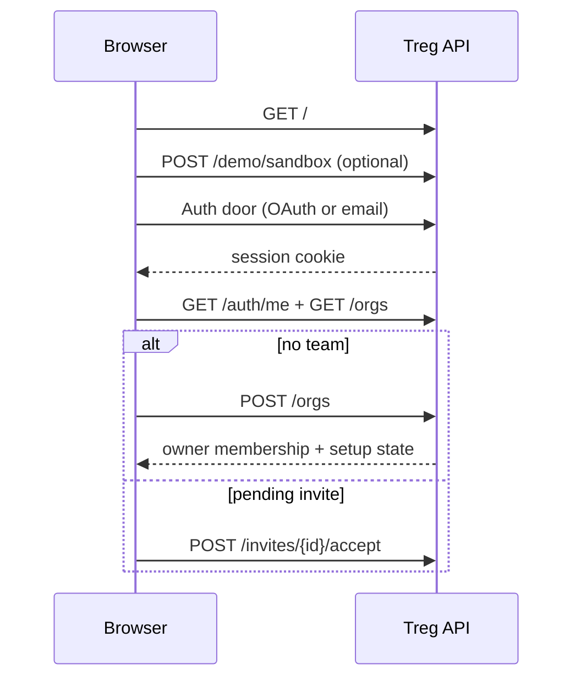
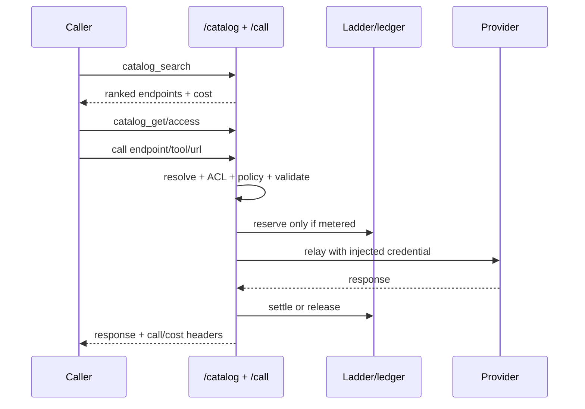

# Treg Interaction and State Flows

## Scope/source pin

- Source: [`superdesigndev/treg@603540f`](https://github.com/superdesigndev/treg/tree/603540f653994080d4f507a9a3564e1017c28eef) (commit time `2026-08-22T10:01:05+10:00`).
- Live target: `https://treg.to`; public read-only observations recorded `2026-08-23`. No authenticated or paid calls were made for this map.
- Core interaction code is `src/treg/api.py`; thin clients are `src/treg/cli.py`, `src/treg/mcp.py`, and `src/treg/web/index.html`.
- Public checks: `GET https://treg.to/meta`, `/catalog/platforms`, `/catalog/search?q=backlinks`, `/.well-known/oauth-protected-resource`, and `/.well-known/oauth-authorization-server` return public metadata/catalog responses; protected `/tools`, `/billing`, `/auth/me`, and `/mcp/` challenge unauthenticated callers.

## First visit and onboarding

1. Browser enters `GET https://treg.to/`, served by `landing()` in `src/treg/api.py`; the anonymous branch of `src/treg/web/index.html` presents the landing, public catalog, sign-in doors, and sandbox studio.
2. The sandbox client calls `POST /demo/sandbox`; `src/treg/sandbox.py` creates a temporary demo org and returns a visitor-scoped token. The browser persists its sandbox reference in `localStorage['treg-sbx']` and can reuse it after reload.
3. Sandbox mutations use ordinary `POST /secrets` and `POST /tools` and calls use `/call/*`, but `call_tool()` detects the sandbox and uses `sandbox.synthesize()` rather than the network. `src/treg/api.py` and `src/treg/sandbox.py` cap the throwaway registry and reject skill import in sandbox mode.
4. A configured exact Stripe test path is the only live sandbox wire; `POST /stripe/webhook` feeds `GET /landing/stripe-feed` through `src/treg/pubfeed.py`. Otherwise sandbox calls return labelled synthetic responses.
5. Human sign-in is GitHub (`GET /auth/github` → callback), Google (`GET /auth/google` → callback), or email OTP (`POST /auth/email/start` → `POST /auth/email/verify`), all implemented in `src/treg/api.py`/`src/treg/session.py` and ending in the signed session-cookie path.
6. CLI browser login uses `POST /auth/cli/start`, opens `GET /login?cli=...`, then polls `GET /auth/cli/poll`; email CLI login uses the email start/verify pair, and CI can use a pre-issued `--token` checked by `GET /auth/me`.
7. A newly signed-in human has a user but no automatic team. Dashboard `maybeOnboard()` reads `GET /auth/me`, forces team naming through `POST /orgs`, then shows agent choice, team-pinned setup token, and try-it examples in `src/treg/web/index.html`.
8. A pending invite is checked before the zero-org early return. Email invite links use `GET/POST /auth/invite-signin`; acceptance is then `POST /invites/{invite_id}/accept` or open `POST /invites/accept` with a code.

## Catalog search, comparison, and call

1. A signed-out browser/CLI/agent searches `GET https://treg.to/catalog/search?q=...`; `src/treg/catalog_store.py` ranks token matches and returns endpoint, capability, platform, provider, price, and verification facts.
2. The caller inspects `GET /catalog/endpoints/{endpoint_id}` or `treg catalog get`; siblings for the same capability are comparison facts, not failover instructions. `src/treg/api.py` and `src/treg/cli.py` leave provider selection with the caller.
3. `GET /catalog/endpoints/{endpoint_id}/access` is the dry-run access decision used by onboarding and the dashboard. It reports how the exact endpoint would be served before a paid call.
4. A call uses one of three `/call/{rest:path}` shapes: catalog endpoint id, named team tool plus path, or full upstream URL passthrough. `src/treg/api.py::_resolve_call` resolves inside the caller's org and applies longest URL-prefix matching for passthrough.
5. Required method/parameter validation, retired/broken endpoint checks, ACL, project scope, deny rules, daily caps, and public-demo guards run before relay or money reservation.
6. `src/treg/proxy.py::relay` preserves method/path/query/body/ordinary headers and injects only server-held bindings; Treg control headers/cookies and hop-by-hop headers are removed before upstream delivery.
7. A provider response is returned verbatim where possible. Treg-owned `/call/` refusals carry `X-Treg-Error: 1`; a provider's own 4xx/5xx remains distinguishable and is not rewritten as a Treg refusal.

## Credential ladder: BYOK, org secret, platform key

- **Org tool/BYOK first:** a tool registered for the provider resolves with its bindings and the team's own credential. `POST /tools`, `PATCH /tools/{id}`, and `src/treg/api.py::_resolve_marketplace_call` keep this path unmetered; the provider charges the team's account.
- **Org secret second:** a secret named/tagged for the provider can form a virtual, non-persisted marketplace tool. `POST /secrets`, `POST /connections/token`, and `src/treg/oauth_providers.py` supply the binding shape; `GET /tools` does not expose the virtual tool.
- **Platform key third:** if the endpoint is priced, provenanced, live-verified, and the provider is enabled, Treg's own platform credential is injected through a platform binding. The call reserves prepaid balance and later settles/release; an unpriced endpoint is refused rather than free.
- **OAuth distinction:** a BYO OAuth connection is an org credential and normally unmetered; a registry OAuth app may be marked upstream-metered (for example X) and enters the same platform reserve/settle path. Provider metadata is served by `GET /oauth/providers` and defined in `src/treg/oauth_providers.py`.
- **Missing credential transition:** a catalog endpoint with no usable org tool/secret and no eligible platform offer returns an actionable 404/410 with `connect`, `secret add`, or capability alternatives; no upstream request is made.
- **Connection transition:** `POST /connections/token` verifies a pasted key/token before storing it; `POST /oauth/start` → provider consent → `GET /oauth/callback` stores and auto-provisions a tool. `src/treg/api.py` handles both paths.

## Balance, reserve, settle, release, and 402

1. A metered call enters `_platform_reserve()` in `src/treg/api.py`, which calls `ledger.reserve()` in `src/treg/ledger.py`; the conditional balance update either opens a hold or fails atomically.
2. Insufficient balance transitions directly to HTTP 402 with `balance_micro`, `estimated_cost_micro`, and `topup_url`; the provider is not called. Recovery is `treg balance`, dashboard Team → Billing, `POST /billing/topup`, or connecting an own key.
3. A relayed billable response calls `_platform_settle()`; the ledger closes the hold at observed provider cost where available, otherwise the estimate, and refunds the difference.
4. A network error, timeout, upstream 5xx, Treg-side failure, or non-billable result calls release. The hold returns in full and the failed call remains auditable.
5. A crashed/stale hold is reclaimed lazily by the org's next reservation; money movement stays synchronous in `src/treg/ledger.py`, not best-effort `src/treg/audit.py`.
6. Funding is visible through `GET /orgs/{id}/balance`, `GET /billing`, and `GET /billing/history`. Stripe payment authorization credits only through `POST /billing/stripe/webhook` in `src/treg/billing.py`; browser return URLs are not proof of payment.

## Idempotent replay and retry states

- A caller supplies `Idempotency-Key` on `/call/`, or `idempotency_key` to MCP `call`; no header means existing non-idempotent behavior.
- A pending key is scoped to the caller membership and request fingerprint, stored before the upstream call by `src/treg/api.py`/`src/treg/models.py`.
- A concurrent duplicate sees 409 while the first call is pending; a same-key/different-request reuse is 422; both happen before a second provider request.
- A metered successful response stores replayable response bytes for 24 hours. Repeating the same key returns the stored result with `X-Treg-Idempotent-Replay: true` and the original `X-Treg-Cost-Micro`; MCP returns `replayed: true`.
- Failures release the key immediately because they are not billed and should be retried. A successful replay never calls the provider and never charges again.

## CLI and local execution

1. `https://treg.to/install.sh` installs the light package, runs `treg config --base-url`, and bootstraps the skill. `treg login` establishes identity; `treg catalog search` → `treg catalog get` → `treg call` is the no-key path.
2. `treg scan` is read-only. `treg upload` imports selected `.env` keys, skills, and catalog CLIs; `--dry-run`/`--status` report without registration, and repeated upload is intended to be idempotent.
3. `treg run TOOL -- ...` dispatches to local or server execution. Local grants use `POST /tools/{name}/grant`, runner proof for shared keys, output redaction, and `POST /tools/{name}/run-report`; server runs use `POST /run` with an allow-listed runnable bundle.
4. `treg shell start` writes PATH shims that call `treg run`; `--server-for` routes named tools server-side. `treg <program>`/`treg with --` starts the local HTTPS proxy for one process; `treg shell start --proxy` combines shims and interception; `treg serve` keeps it for opted-in terminals.
5. `src/treg/localproxy.py` allow-lists hosts from `GET /tools`: registered hosts terminate TLS and forward to `/call/`, unknown hosts blind-tunnel, and the registry itself is excluded to avoid loops. CA state is machine-local and private to the launched process tree.
6. A WAF 403 containing an HTML edge block causes `src/treg/cli.py` and dashboard API helpers to resend the body base64-encoded with `X-Treg-Body-Encoding`; `_BodyDecodeMiddleware` in `src/treg/api.py` restores it before JSON parsing/relay.

## MCP and OAuth interactions

- MCP transport starts at `POST https://treg.to/mcp/`; `src/treg/mcp.py` exposes exactly `catalog_search`, `catalog_get`, `call`, `balance`, `my_tools`, and `catalog_request`.
- Any id-bearing unauthenticated MCP request receives 401 with `WWW-Authenticate` resource metadata; notifications/ping and public `/.well-known/*` discovery remain available. A bearer that looks like a Treg OAuth access token but is expired/bad-audience receives `invalid_token` 401.
- Headless clients use a team-pinned `Authorization: Bearer` token installed by `treg mcp install`; OAuth clients use the protected-resource metadata at `https://treg.to/.well-known/oauth-protected-resource` and authorization-server metadata at `https://treg.to/.well-known/oauth-authorization-server`.
- OAuth client registration is DCR (`POST /oauth/register`) or CIMD; the browser consent flow is `GET /oauth/authorize` followed by same-origin `POST /oauth/authorize`. The approval chooses one member team and its balance.
- Authorization code exchange is `POST /oauth/token` with PKCE S256; refresh tokens rotate, retired-token replay revokes the refresh family; `POST /oauth/revoke` revokes the family and returns a stable success response.
- `GET /oauth/grants` lists live grants and `POST /oauth/grants/{family_id}/team` moves the grant to another team belonging to the same user; the next refresh uses the new authority, while an already-issued token has its short residual lifetime.
- Provider OAuth is separate: dashboard/CLI `POST /oauth/start` stores pending state and PKCE, provider callback exchanges the code, `oauth.ensure_fresh()` refreshes stale credentials before calls, and `GET /connections/{id}/resources` plus `POST /connections/{id}/resource` select an account/property.

## Team access and policy

1. `POST /orgs` creates a team and owner membership; `GET /orgs` lists memberships and active selection. `POST /orgs/{id}/invites` creates a role/tool/project-scoped invite; `GET /invites/mine` and accept routes drive the invitee path.
2. Roles gate management: owner/admin can manage org resources, members can call and manage permitted resources, viewers can read/use permitted tools but cannot register. `src/treg/api.py` applies `_can_manage`, `_require_admin_of`, and `_require_tool_use` on every scoped route.
3. Tool ACL and project scope combine as an allow-list; `PATCH /orgs/{id}/members/{user_id}/access` changes tool access, projects live under `/orgs/{id}/projects`, and deleting a project frees its tools to team-wide scope.
4. `POST /orgs/{id}/deny` adds host/path/method/member/project policy. Deny rules are checked after resolution but before relay and apply to proxy plus local/server CLI runs; the refusal names the rule.
5. `POST /orgs/{id}/agents` mints/rotates a machine membership token, optionally with tool/project/tag-pin/cap restrictions. The token is returned once; `DELETE /orgs/{id}/agents/{user_id}` revokes it and cleans targeted policy rows.
6. `DELETE /orgs/{id}` requires `confirm=<slug>` and owner authorization; leave is `POST /orgs/{id}/leave`. Invalid membership, suspended user/org, missing org selection, or insufficient role stops before resource access.

## Upload, scan, skill install, and sharing

- `treg scan` previews local `.env`, skill folders, and installed catalog CLIs using `src/treg/providers.py`, `src/treg/skills.py`, and `src/treg/convert.py`; it never writes registry state.
- `treg upload` posts detected secrets/tools/skills; dashboard folder import first calls `POST /skills/analyze`, displays missing-credential classifications, then `POST /skills/import` for selected packages. Sandbox callers receive 403 for these skill routes.
- `treg skill init/scaffold` creates a `treg.json` contract; `skill add/push` registers a recipe plus encrypted server-side secrets/tools through `POST /skills`; `skill install` reads `/bundles/{id}` and writes recipe/companion files without secret values.
- `GET /skills/{name}/install.sh?token=...` generates a shell installer with a restricted token format; `/llms.txt` and `/skill.md` teach an agent to call the proxy without holding provider keys.
- Shareable `/app/skills/{name}` and `/app/tools/{name}` links resolve by name; admin sharing posts an invite with a validated landing path, and the invite link can auto-accept into the target team.

## Health, admin, and failure recovery

- `POST /health/run` calls `src/treg/health.py::run_all`: refreshable OAuth credentials are refreshed first, each tool probe runs independently, and invalid/unknown statuses persist without one bad tool aborting the batch. `GET /health` exposes metadata and `needs_reconnect`; reconnect or replace manual credentials on invalid/expired states.
- `GET /admin/*` is visible only to `require_superadmin`; `src/treg/api.py` provides platform stats, org/user/tool/call/error/health reads, while suspend/delete/grant mutations deliberately exclude self-actions in the dashboard. Reconciliation reads are `/admin/reconcile/drift`, `/spend`, and `/repeats`.
- 401: missing/invalid session or bearer; recover with `treg login`, a valid team token, MCP OAuth refresh, or dashboard sign-in. 400/422: malformed body/query/header, missing org confirmation, invalid tag/key/fingerprint; fix input and retry without spending.
- 403: role, tool/project ACL, deny rule, suspended identity, sandbox restriction, or platform policy; ask an admin/update access rather than changing the upstream URL.
- 404/410: no registered host/tool, unavailable credential ladder, or retired catalog entry; use the named tool form, connect/BYOK, or the suggested successor/capability sibling. `X-Treg-Error: 1` distinguishes Treg-owned refusal from vendor 404.
- 409: URL-tool ambiguity, in-flight idempotency key, or another stateful conflict; select `/call/<tool>/<path>` or wait/reuse the same retry key as instructed.
- 402: prepaid balance short; inspect `/orgs/{id}/balance`/`treg balance`, top up through `POST /billing/topup`/Billing, or connect the provider's own key. The call has not reached the provider.
- 429: daily/member cap, tag budget, trial-pool allowance, or rate limit; wait, increase/replace the applicable limit, or choose a credential/provider. A provider 429 is upstream evidence and should not be treated as a Treg balance refusal.
- 502: upstream network failure, OAuth refresh failure, invalid binding/injector, or call-time SSRF/DNS safety refusal; health/reconnect or correct the tool, and retry only after determining whether the failure was upstream.
- Idempotency recovery is the narrow paid-call case: repeat the same request with the same key after a lost response; do not reuse it for new work. Treg replays stored success and charges nothing.
