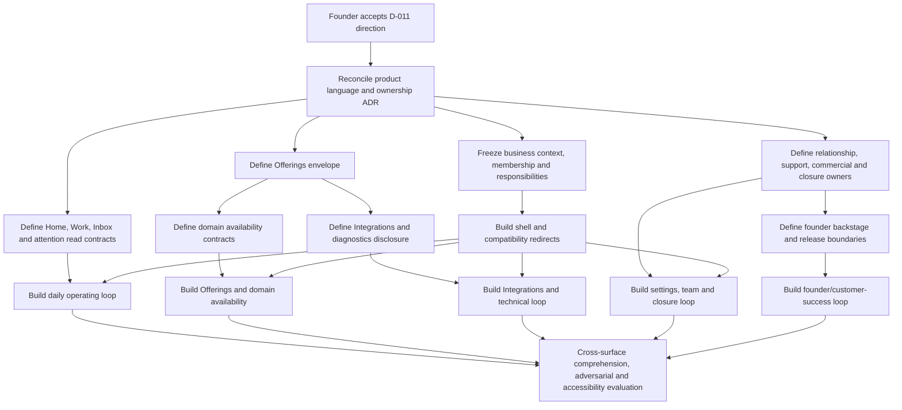

# Phase 4 business experience: information architecture and UI contracts

**Owner:** Founder / Phase 4 business-experience design master
**Status:** Active
**Maturity:** Target research
**Question:** What customer-familiar information architecture, views, UI contracts, access model and operational surfaces should govern AE business management?
**Decision affected:** D-011
**Evidence cutoff:** 2026-07-21
**Review by:** 2026-08-21
**Supersedes:** None
**Superseded by:** None

## Decision status

**INFERRED — design-research baseline:** AE should use a hybrid business-operating model organized around customer jobs rather than its internal source domains. The visible business shell is:

```text
Current business [switch]

Home
Work
Inbox
Offerings
Business settings
Help
```

Integrations is canonically located under **Business settings**, not Offerings. Offerings and Integrations have contextual many-to-many links. Members responsible for technical maintenance may receive a role-aware Integrations shortcut, but the shortcut does not create another route owner or shell.

**UNKNOWN — decision authority:** D-011 remains **PROPOSED** pending founder acceptance of the remaining choices and documentation reconciliation across ADR-024, the Phase 4 product contract, UI-SPEC, plan and child contracts. This research is not implementation authority.

**OBSERVED — custody:** Analysis used the isolated worktree at revision `d7a98bab649f589438388ddd916f25f99f11c717` with 66 inherited dirty paths bound by a verified content manifest. No hosted system or external control plane was used.

## Claim vocabulary

- **OBSERVED** — directly supported by inspected repository bytes or a linked official primary source.
- **INFERRED** — a design conclusion derived from observed evidence and the accepted product direction.
- **HYPOTHESIS** — a candidate expected to work but requiring an operated comprehension, accessibility or customer evaluation.
- **UNKNOWN** — no sufficient current source or evidence establishes the claim.

## Decision supported and blast radius

**INFERRED:** The decision is whether AE has a sufficiently explicit business-experience contract to reconcile its Phase 4 documentation without leaving navigation, permissions, queue semantics or failure behavior for implementation children to invent.

If accepted, the blast radius includes Phase 4 vocabulary, visible navigation, route grouping, membership and responsibility contracts, bounded read projections, compatibility redirects and acceptance evals. It does not change the product destination, canonical business/action facts, registered-operation contracts, uncertainty rules or the separation of release, feature access, member permission, publication and availability.

## Product and source baseline

**OBSERVED:** [PRODUCT.md](../../PRODUCT.md) defines AE as an execution product, not an inquiry product or directory. Its current evidence supports published discovery, public search/detail, qualified inquiry and a narrow sandbox Customer Request flow. It does not establish customer-reachable booking, payment, dispatch, fulfilment or mature Business Account operation.

**OBSERVED:** [DESIGN.md](../../DESIGN.md) requires customer-language consequences and current work to lead, while Action Invocation, effect generation, provider binding, RoutePlan and evidence machinery remain progressively disclosed.

**OBSERVED:** The proposed [Phase 4 UI contract](../phases/04-market-activation/04-UI-SPEC.md), [Business Account contract](../phases/04-market-activation/04A-BUSINESS-ACCOUNT-MANAGEMENT.md), [Phase 4 plan](../phases/04-market-activation/04-PLAN.md), [child contracts](../phases/04-market-activation/04A-INSTANCE-CONTRACTS.md) and [ADR-024](../adr/ADR-024-business-account-and-customer-management-ownership.md) contain a materially sound separation of source truth, authority, publication, readiness and release. They remain proposals under review.

**INFERRED:** Their interface defect is that source-domain decomposition became customer navigation. Capabilities, Connections, Activity, Plan and Support were treated as peers even when the customer has one operating job.

## Current versus target journey

| Journey | Current evidence | Target contract |
|---|---|---|
| First visit | **OBSERVED:** claim/publish one business and inspect listing or inquiry-admission status | **INFERRED:** recognize the current business, know whether customers can find it and request named work, then see one next setup action |
| Onboarding | **OBSERVED:** single-owner claim and publication flow | **INFERRED:** resumable profile, services, domain availability, Integrations and team setup |
| Daily operation | **OBSERVED:** inquiry inbox plus listing/request-admission status | **INFERRED:** Home answers visibility, availability, attention, waiting Work and unread Inbox |
| Exception and recovery | **OBSERVED:** inquiry delivery failures and deep Action Invocation uncertainty machinery exist | **INFERRED:** show consequence, currentness and one safe next action; technical evidence appears on demand |
| Team growth | **OBSERVED:** current business source has one `ownerId`, not a membership aggregate | **INFERRED:** invite people and combine responsibilities while protecting Ownership |
| Closure | **OBSERVED:** no Business Account relationship or closure owner exists | **INFERRED:** withdraw future work/access, export data and preserve attributable history |

## Information architecture alternatives

### Alternative A — marketplace-operations-led

```text
Current business

Home
Requests
Orders / Work
Messages
Services
Availability
Account
```

**INFERRED — rejected:** This makes daily operations prominent but assumes every domain has orders and a uniform fulfilment lifecycle. It prematurely imports marketplace and order nouns into paid information, appointments, dispatch and future domains.

### Alternative B — SaaS-account-led

```text
Current business

Overview
Business details
Products & services
Team
Integrations
Notifications
Security
Plan & data
Support
```

**INFERRED — rejected:** This is familiar but makes AE feel like account-administration software. Customer work, consequential exceptions and communication become secondary to settings.

### Alternative C — hybrid business-operating model

```text
Current business [switch]

Home
Work
Inbox
Offerings
Business settings
Help
```

**INFERRED — selected:** Work and Inbox are the only daily queues. Offerings answers what customers see and can request. Business settings owns account-scoped configuration, including Integrations. History is secondary. Founder/customer-success/release operation remains backstage.

Canonical deep routes:

```text
/businesses/:businessId
/businesses/:businessId/work
/businesses/:businessId/work/:workRef
/businesses/:businessId/inbox
/businesses/:businessId/inbox/:threadRef
/businesses/:businessId/offerings
/businesses/:businessId/offerings/:serviceRef
/businesses/:businessId/offerings/:serviceRef/availability
/businesses/:businessId/settings
/businesses/:businessId/settings/integrations
/businesses/:businessId/settings/integrations/:integrationRef
/businesses/:businessId/settings/team
/businesses/:businessId/settings/notifications
/businesses/:businessId/settings/security
/businesses/:businessId/settings/plan-data
/businesses/:businessId/settings/closure
/businesses/:businessId/history
/businesses/:businessId/help
/businesses/:businessId/help/:caseRef
```

**HYPOTHESIS — mobile:** Current business remains persistently visible. Home, Work and Inbox remain immediately reachable; Offerings, Business settings and Help sit in a labelled menu. This requires operated narrow-screen and comprehension evaluation.

## External familiarity review

**OBSERVED:** [Stripe Dashboard documentation](https://docs.stripe.com/dashboard/basics) supports persistent account context, a Home surface that includes attention, and separation among personal, account and product settings. [Stripe organization team documentation](https://docs.stripe.com/get-started/account/orgs/team) permits multiple roles and account-specific assignments. AE should copy those behavioral expectations, not Stripe's financial breadth or widget-heavy dashboard.

**OBSERVED:** [Airbnb availability guidance](https://www.airbnb.com/help/article/3116) and [Airbnb team-access guidance](https://www.airbnb.com/help/article/1534) show the value of explicit availability and delegated access. AE must reject accommodation-specific calendar and co-host ontology as shared product structure.

**OBSERVED:** [Uber merchant pause guidance](https://help.uber.com/merchants-and-restaurants/article/pausing-new-orders?nodeId=42e66554-9875-4ca4-93f9-59f497120949) supports clear customer-impact language for pausing new work while preserving accepted work. [Uber Eats Manager access guidance](https://help.uber.com/en-AU/merchants-and-restaurants/article/managing-access-in-uber-eats-manager?nodeId=931d0f36-f871-4c8a-be24-ca22ef9b45ff) supports job-based access. AE should reject restaurant-specific lifecycle assumptions.

**OBSERVED:** [Perplexity account settings](https://www.perplexity.ai/help-center/en/articles/10352993-account-settings) supports low navigation burden. Its chat/thread-first model is not suitable for business operations.

**OBSERVED:** [Shopify permission documentation](https://help.shopify.com/en/manual/your-account/users/roles/permissions) supports granular job-based permissions. AE should adapt responsibility grouping without copying Shopify's store ontology.

## Current-to-target source gap map

“Current” in this table means inspected live source. New Phase 4 records are not described as existing.

| View/read model | Classification | Inspected current source | Target frontier |
|---|---|---|---|
| Home | **Proposed projection only** | `src/routes/_operator/owner.status.tsx`; `src/modules/catalog/owner-claim.functions.ts`; `src/components/ae/status/AeStatusCard.tsx` | Removable summary referencing exact visibility, named-operation availability, Work, Inbox and reason-coded attention; no generic health source |
| Work list | **Proposed projection only** | `src/modules/action-invocation/internal/convex-schema.ts` | New business-affinity reference projection for listing and attention only |
| Work detail | **Exists but needs bounded extension** | `src/modules/action-invocation/internal/convex-schema.ts`; `src/modules/action-invocation/paid-operation-application-service.ts` | Business-membership read boundary and domain-detail dispatch; operation result remains authoritative |
| Inbox | **Exists but needs bounded extension** | `src/modules/inquiries/internal/convex-schema.ts`; `src/modules/inquiries/internal/projections/owner.ts` | Membership-bound business scope, indexed cursor reads and preserved unread/needs-reply semantics |
| Conversation | **Exists but needs bounded extension** | `src/routes/_operator/owner.inquiries.$threadId.tsx`; inquiry messages/notification state in the inquiry schema | Business and communication authority plus source references to consequential Work |
| Offerings | **Exists but needs bounded extension** | `src/modules/business/internal/schema.ts`; `src/modules/catalog/internal/schema.ts`; `src/modules/capability-supply/internal/convex-schema.ts` | Revisioned editing, ordering, pause/retire and honest availability summaries |
| Service detail | **Exists but needs bounded extension** | `businessServices` in `src/modules/catalog/internal/schema.ts` | Draft/current revision, publication history and domain relations; `hoursOrUnknown` cannot imply slots or capacity |
| Availability | **New source owner/read model required** | Reusable inputs are service hours plus readiness observation/validity in `src/modules/capability-supply/internal/convex-schema.ts` | Each domain owns acceptance policy and observation; shared UI owns only a narrow projection |
| Integrations | **Exists but needs bounded extension** | bindings, publications, credential references and readiness in `src/modules/capability-supply/internal/convex-schema.ts` | Business scope, membership authority, ordinary summary, many-to-many offering links and protected diagnostics |
| Team & access | **New source owner/read model required** | one compatibility owner in `src/modules/business/internal/schema.ts` | Memberships, invitations, responsibilities, effective access, ownership transfer and last-owner protection |
| Business settings | **New source owners/read models required** | `src/modules/settings/internal/schema.ts`; `src/routes/_operator/owner.settings.tsx` | Business notifications, commercial references, export and durable closure; personal security stays separate |
| Help/support | **New source owner/read model required** | general `/help`; specialised inquiry support and Request-problem sources | Business support cases/messages with customer/private separation and bounded pages |
| Founder account detail | **New source owner/read model required** | admin fragments exposed through `src/lib/operator/navigation.ts` | Relationship, onboarding tasks, private notes, commercial context, support and removable account summary |
| Legacy `/owner/**` | **Retire/redirect** | generated routes in `src/routeTree.gen.ts`; current operator navigation | Membership-resolved redirects only; browser state never supplies authority |

Current navigation advertises `/owner/actions`, `/owner/business-actions`, `/owner/billing` and `/owner/billing/activate` without matching live route files. **INFERRED:** retire these destinations rather than redirecting customers into invented Money or Plan surfaces.

Compatibility mapping:

| Current path | Target |
|---|---|
| `/owner/status` | `/businesses/:businessId` |
| `/owner/inquiries` | `/businesses/:businessId/inbox` |
| `/owner/inquiries/:threadId` | `/businesses/:businessId/inbox/:threadId` |
| `/owner/settings` | `/settings` for personal security; business-scoped settings under `/businesses/:businessId/settings` |
| `/owner/request-problems/:reportRef` | The source-linked `/businesses/:businessId/work/:workRef` recovery view |

Zero permitted businesses routes to `/businesses`. One permits an equivalent redirect. Multiple require explicit selection unless the source record securely resolves one permitted business. Slug, local storage and prior selection are never authority.

## View-specific UI contracts

### Home

- **Source truth:** membership-resolved business context plus removable references to catalog visibility, named-operation availability, Work, Inbox and relationship/onboarding facts.
- **Displayed facts:** current business; Visible to customers; per-offering Available through AE; reason-coded attention; waiting Work; messages needing response; next onboarding task.
- **Commands and responsibility:** any permitted member can open items; destination commands enforce their own responsibility. Home may refresh or recheck one named fact.
- **Consequential boundary:** Home never performs Work, publishes, changes availability or retries an uncertain effect.
- **States and continuation:** loading preserves stable answer slots; empty says nothing needs action or shows the source-issued onboarding task; partial names each unavailable section; stale removes consequential shortcuts and offers refresh/recheck; forbidden never enters a guessed business shell; conflicts are resolved in the source view; uncertain Work says “May have happened” and links to Work detail with no retry.

### Work list

- **Source truth:** removable business-work references; exact state remains with Action Invocation and the domain result owner.
- **Displayed facts:** customer-facing action, counterparty, consequence summary, source state, attention reason and currentness.
- **Commands and responsibility:** Work operations can open or perform explicitly list-safe commands; viewers may read if granted.
- **Consequential boundary:** the list cannot declare success, retry, cancel or reconcile.
- **States and continuation:** loading preserves rows/filters; empty means no current Work and links secondarily to history; partial labels missing domain summaries; stale suppresses shortcuts; unauthorized rows do not leak; assignment conflicts refresh one row; uncertain rows show Needs checking and open exact detail.

### Work detail

- **Source truth:** exact Action Invocation, current attempt/effect generation, authority use and operation-owned result.
- **Displayed facts:** business/customer, consequence, commitment, disclosed data, status, uncertainty, evidence and source-issued continuation.
- **Commands and responsibility:** only current readback commands—inspect, reconcile, request cancellation, retry when explicitly eligible, or start genuinely new work—under Work and action-specific authority.
- **Consequential boundary:** approval, provider release, retry and cancellation are distinct; transport success is not durable success.
- **States and continuation:** loading never shows transient success; missing exact records are unavailable/forbidden rather than empty; partial preserves known attempt/result truth; stale requires refresh; conflict discards stale command preparation; uncertain explains possible effect and permits inspect/reconcile only.

### Inbox

- **Source truth:** business-scoped inquiry summary.
- **Displayed facts:** sender, request summary, unread/response-needed state, delivery issue and linked Work.
- **Commands and responsibility:** customer-communication responsibility may filter, open and mark read.
- **Consequential boundary:** message text alone never creates Work.
- **States and continuation:** loading preserves rows/filters; empty says no messages need response; partial never presents an incorrect zero; stale refreshes before reply shortcuts; unauthorized threads remain absent; read conflicts refresh one thread; uncertain outbound delivery removes resend and opens Conversation.

### Conversation

- **Source truth:** inquiry thread/messages, delivery/read state and explicit Work references.
- **Displayed facts:** ordered messages, participants, delivery, response need, linked Work and attributable times.
- **Commands and responsibility:** customer communication may reply, close/reopen where supported, mark read and open Work.
- **Consequential boundary:** a reply is communication and never claims booking, payment, dispatch or fulfilment.
- **States and continuation:** loading disables the composer until authority/current revision arrives; redacted absence is explained; partial names missing history/evidence; stale pauses sending; forbidden leaks no metadata; conflict preserves the draft while loading newer messages; uncertain delivery offers check, not blind resend.

### Offerings

- **Source truth:** business/catalog services plus named executable-operation relations; availability is a referenced domain summary.
- **Displayed facts:** customer name, visibility, narrow availability, supported customer action and attention reason.
- **Commands and responsibility:** offering management may create, order, open, pause or retire where supported.
- **Consequential boundary:** saving or publishing a service never implies executable availability.
- **States and continuation:** loading keeps stable order; empty explains the first offering; missing availability is Unknown, not Unavailable; stale availability remains separate from publication; unauthorized commands hide and server-refuse; ordering/revision conflicts refresh; publication uncertainty remains Checking.

### Service detail

- **Source truth:** exact service draft/current/published revisions and relations to domain availability and supported actions.
- **Displayed facts:** public fields, visibility, draft/published difference, customer action, availability and affected integrations.
- **Commands and responsibility:** offering management may edit/save/preview/publish/pause/retire; availability changes require matching responsibility.
- **Consequential boundary:** publication preview names customer-visible change but does not activate unrelated operations.
- **States and continuation:** loading waits for revision before commands; new draft is explicitly unpublished; partial preserves editable facts; stale drafts cannot publish; conflict compares current and draft; publication remains Checking until accepted source readback.

### Availability

- **Source truth:** domain-owned acceptance policy/observations; shared projection contains only disposition, currentness and customer impact.
- **Displayed facts:** Available, Limited, Paused, Unavailable or Unknown; reason; observation; customer impact; domain summary.
- **Commands and responsibility:** offering/availability management may use domain-supported configure, pause, resume or recheck commands.
- **Consequential boundary:** pause preview distinguishes new requests from accepted Work; hours do not prove capacity or a slot.
- **States and continuation:** loading retains the last confirmed status with its age; empty means unsupported/not configured and offers only valid setup; partial/expired evidence yields Unknown; stale suppresses request acceptance where current evidence is required; conflict preserves policy and draft; uncertain pause/resume/check waits for source readback.

### Integrations

- **Source truth:** business-scoped bindings, credential references, readiness and affected-offering relations.
- **Displayed facts:** name/purpose, account or offering scope, current state, affected offerings, last check, blocker and safe action.
- **Commands and responsibility:** technical integration may configure, check, reconnect, disable and inspect diagnostics.
- **Consequential boundary:** secrets are never read back; security-critical credential/identity changes require step-up.
- **States and continuation:** loading shows last confirmed state as such; empty does not imply every offering needs an integration; partial does not mark all dependencies unavailable; stale requires recheck; ordinary operators see impact without configuration; binding conflicts require exact revision; uncertain checks permit repair/recheck, not destructive automatic reconnect.

### Team & access

- **Source truth:** new membership, invitation, responsibility and ownership sources.
- **Displayed facts:** person, status, presets, effective responsibilities, ownership, invitation expiry and attributable changes.
- **Commands and responsibility:** business administration may invite/change/suspend/remove; Owner governs ownership transfer and closure.
- **Consequential boundary:** removal affects future access, not history; assigning all permissions is not ownership.
- **States and continuation:** loading exposes no editable controls; empty retains the Owner and invite guidance; unknown effective access disables mutations; stale refreshes before removal/widening; direct commands server-refuse; conflicts require reconfirmation; uncertain invite delivery is checked or replaced without duplicate grants; last-owner changes are unavailable.

### Business settings

- **Source truth:** separate notification, integration, commercial-reference, export and relationship sources; personal security stays at `/settings`.
- **Displayed facts:** notifications, Integrations entry, truthful commercial mode, data/export and closure status.
- **Commands and responsibility:** each section uses administration, technical, billing or Ownership responsibility.
- **Consequential boundary:** commercial labels never grant access; closure withdraws future work/access and preserves history.
- **States and continuation:** section-level loading; “No paid plan applies” is complete; partial sections do not block others; stale commercial/access/closure data requires refresh; direct commands independently refuse; conflicts use expected revision; closure/export uncertainty resumes from durable progress.

### Help/support

- **Source truth:** general help content plus new customer-visible support cases/messages.
- **Displayed facts:** relevant guidance, open cases, latest visible response and status.
- **Commands and responsibility:** permitted members may search help and open/reply/resolve/reopen cases.
- **Consequential boundary:** support cannot rewrite business/provider truth; private founder notes never render.
- **States and continuation:** help remains usable while cases load; empty means no open cases; partial names missing subsections; stale refreshes before reply/resolve; forbidden reveals no case contents; conflict preserves reply drafts; uncertain delivery offers check rather than resend.

### Founder account detail

- **Source truth:** new relationship/onboarding/support/commercial owners plus references to business, membership, offering, action and integration sources.
- **Displayed facts:** relationship, accountable founder, people, tasks, reason-coded attention, support, commercial references and linked operational truth.
- **Commands and responsibility:** explicit founder/customer-success/admin commands only.
- **Consequential boundary:** founder actions never impersonate members, edit raw credentials, manufacture readiness or convert plan labels into access.
- **States and continuation:** loading isolates sections; no notes/tasks/arrangement is stated plainly; partial source failure does not invent At risk; stale data refreshes before lifecycle reduction; conflicts show intervening admin action; offboarding uncertainty shows durable cursor/progress and failed references.

## Integrations placement falsifier

| Topology | Resulting contract |
|---|---|
| One integration powers many offerings | Canonical business-scoped integration; every offering links to it |
| One offering uses multiple integrations | Service detail lists required/optional connections; each opens its canonical integration |
| Account-wide identity, payment or notification integration | Business settings owns placement because no offering owns it |
| Technical-maintenance-only operator | Direct canonical route and optional role-aware shortcut; Home may link failed checks |

**INFERRED:** Canonical placement is `/businesses/:businessId/settings/integrations/:integrationRef`. Offerings and Integrations link many-to-many. Neither owns the other. An optional shortcut may point to the same canonical route for members with Technical integration responsibility.

## Responsibility and command model

Responsibilities are additive:

| Responsibility | Command boundary |
|---|---|
| Business administration | Profile, ordinary settings, notifications and non-owner team administration |
| Work operations | View/assign/act on Work and operational availability |
| Customer communication | Read and respond in Inbox |
| Offering management | Create/edit/order/publish/pause/retire offerings and configure domain availability |
| Technical integration | Configure connections, run checks and inspect diagnostics |
| Billing & commercial | Source-backed commercial contacts, plan references and exports only |
| Reporting & viewing | Read permitted business information; no consequential commands |
| Support interaction | Open and respond to customer-visible support cases |
| Ownership | Transfer ownership, authorize closure and perform irreducible governance actions |

Presets are convenience compositions:

| Preset | Composition |
|---|---|
| Owner | All responsibilities plus protected Ownership |
| Administrator | Business administration, Offering management, Work operations, Customer communication, Support interaction and Reporting |
| Operations | Work operations, Customer communication and operational availability |
| Billing | Billing & commercial and Reporting |
| Developer | Technical integration and Reporting |
| Viewer | Reporting & viewing |

One person may hold multiple presets or a custom combination. Effective access is the union. Ownership never emerges from the union.

- Invite binds one business and explicit responsibilities; acceptance cannot broaden them.
- Access changes are revisioned, attributable and immediately re-evaluated from source.
- Step-up is required for ownership transfer, closure, security-critical integration changes, protected financial/security data and material permission widening.
- Ownership transfer requires explicit recipient acceptance under the ordinary flow.
- Suspension/removal revokes future access while preserving attributed history.
- The last active Owner cannot be suspended, removed, demoted or stripped of Ownership.
- Navigation may hide unavailable areas for comprehension. Direct routes and every command independently refuse from current server authority.

**UNKNOWN:** Emergency founder-operated ownership recovery needs its own audited authority decision. It is not silently included here.

## Queue boundary and attention rules

**INFERRED:** Work is the sole operational queue. Inbox is conversation. Help owns customer-visible support. Integrations owns connection repair. History is evidence, not a queue. Home is a reference-only priority projection.

A message never creates Work because of text classification. Conversation links to Work only when a source-owned transition creates or identifies a durable operational identity, such as an accepted inquiry becoming a registered action, booking request, paid operation or dispatch request. Both sides retain references, not copied state.

Canonical counts are owned by their source queues. Home does not independently recalculate them.

Attention deduplication key:

```text
sourceKind + sourceRef + reasonCode + sourceRevision
```

If one condition appears through several projections, Home emits one item whose destination is the canonical source owner. Other relations appear as context: “Booking request needs checking · customer also sent 2 messages.” Closing a conversation does not close Work, and completing Work does not mark messages read.

Home priority order:

1. possible external effect or safety-sensitive uncertainty;
2. Work blocked on the business;
3. customer response required;
4. availability or integration preventing new work;
5. security/access issue;
6. onboarding/account-maintenance task;
7. support follow-up.

Home never sums these into an opaque “needs attention” score.

## Horizontal falsifier

| Offering shape | Domain-owned facts | Shared UI fields |
|---|---|---|
| Paid digital information operation | price/currency, payment authority, permitted inputs, data source, delivery terms and payment/result evidence | identity, public visibility, customer availability, consequence, currentness and safe continuation |
| Appointment/booking service | duration, timezone, bookable windows, blackouts, lead time, resource/slot capacity and cancellation rules | the same narrow shared fields; slot UI remains domain-owned |
| On-demand/dispatch service | zone, intake state, fleet/concurrency capacity, provider acceptance, fulfilment estimate and dispatch uncertainty | the same narrow shared fields; map/capacity/dispatch lifecycle remains domain-owned |

The shared availability projection is limited to:

```text
customerAvailability:
  available | limited | paused | unavailable | unknown

customerImpact
reason
observedAt
validUntil?
source
allowedNextActions
domainDetailLink
```

Shared UI must not define `price`, `currency`, `timeSlots`, `calendar`, `duration`, `fleet`, `zone`, `capacityUnits`, `deliveryWindow`, `paymentProvider`, `fulfilmentStage` or provider-specific retry state.

Shared Work may show identity, customer-facing action class, counterparty, consequence summary, source-issued status, attention reason, provenance/currentness, safe continuation and a domain-detail link. It must not flatten paid, booking and dispatch outcomes into one lifecycle.

## Trust and provenance

Every material status—Visible, Available, Paused, Stale or Needs checking—answers:

1. what the status means;
2. who or what supplied it;
3. when it was observed or changed;
4. whether it remains current;
5. the safe next action.

Example:

> Available through AE · checked from Acme's booking connection 8 minutes ago · current until 3:40 pm · Why this status?

Technical disclosure may then show exact operation revision, observation reference and blocker. User-authored changes name the actor; system/provider observations name their source. “Verified” is unavailable without a named standard and matching evidence.

## Distinct decision dimensions

| Dimension | Question | Source owner |
|---|---|---|
| Release control | Has AE released this application area here? | Founder/release operations |
| Feature access | May this business use the released area? | Account-access source |
| Member permission | May this person perform this command for this business? | Membership authority |
| Publication | Can customers see this profile/service/operation? | Business/catalog/operation publication |
| Operational availability | Can AE safely accept or route this named work now? | Domain policy plus exact supply/readiness conjunction |

None implies another. Navigation hiding is never authorization.

## Data and query consequences

Home should use one revisioned removable summary plus cap-and-one lists for attention, Work and Inbox. It must not hydrate every service, integration, member and case.

- Resolve URL business context through fresh server membership.
- Cursor-page Inbox by business/status/update time.
- Use a business-affinity Work reference projection, never a result owner.
- Hydrate Work detail from Action Invocation and the operation result owner.
- Keep Availability domain-owned.
- Cursor-page History as a rebuildable reference ledger.
- Keep counts in bounded summary projections rather than whole-table scans.
- Carry `sourceRef`, `sourceRevision`, `observedAt`, `validUntil`, projection time and incomplete/stale disposition.
- Evaluate release, feature access and permission separately.
- Keep publication/availability outside shell authorization.

## Responsive, accessibility and Astryx contract

**INFERRED:** Home is a ranked operating brief, not an equal-weight dashboard-card grid. It leads with customer visibility/availability, attention, waiting Work/Inbox and onboarding.

- Use Astryx neutral primitives and the semantic-token bridge; Tailwind remains layout glue.
- Preserve current business context at 320 CSS pixels and 400% zoom.
- Avoid page-level horizontal scrolling; tables become labelled records.
- Controls have practical 44 by 44 CSS pixel targets.
- Keyboard order follows heading, material status, primary action and detail.
- Labels persist; focus returns predictably after saves and dialogs.
- Status uses text and icon/shape, never colour alone.
- Live regions announce atomic changes rather than polling refreshes.
- Motion remains functional at 120–250ms and respects reduced motion.
- Long names, reasons and references wrap safely.

**HYPOTHESIS:** This contract should produce a comprehensible and operable interface. It has not been validated with representative customers or assistive-technology users.

## Evaluation plan

Comprehension evaluation asks a fresh participant to identify the current business, visibility, named-work availability, why something is unavailable, the next attention item, Work versus Inbox, pause impact, permitted teammate actions and the safe response to a possible external effect.

Adversarial contract evals include:

- published profile plus failed readiness never says Available;
- stale observation removes request acceptance where current evidence is required;
- guessed business ID never enters the shell;
- Billing responsibility cannot act on Work;
- Technical integration cannot invite members;
- last Owner cannot be removed;
- HTTP acceptance without source readback never says Saved;
- uncertain dispatch suppresses resend/retry;
- pausing new availability preserves accepted Work;
- hidden navigation and direct-route refusal agree;
- integration many-to-many relationships remain coherent;
- paid information, appointments and dispatch use the same shell without shared vertical fields;
- 320px, 400% zoom, keyboard-only and reduced-motion paths lose no information.

## Natural dependency graph



This dependency graph must not be compressed into an arbitrary 4A/4B/4C sequence before documentation reconciliation.

## Remaining founder decisions

1. **HYPOTHESIS:** Give technical maintainers an optional role-aware Integrations shortcut while retaining Business settings as canonical placement. Recommended: accept.
2. **HYPOTHESIS:** Model additive responsibilities immediately but initially expose multiple presets; expose full custom combinations only when onboarding evidence requires them. Recommended: accept.
3. **UNKNOWN:** Define whether founder operations may perform emergency ownership recovery. Ordinary ownership transfer requires recipient acceptance; emergency recovery needs a separate, audited authority decision.

## Documentation reconciliation frontier

After D-011 acceptance, reconcile only this dependency-ordered documentation slice:

1. **ADR-024:** Business Account ownership, additive responsibilities, protected Ownership, relationship ownership and projection non-authority.
2. **04A Business Account contract:** accepted customer views, actual current reuse, bounded extensions, new owners and proposed projections.
3. **04 UI-SPEC:** explicit view contracts, Integrations placement, queue rules, horizontal fields, provenance and continuation.
4. **04 Plan:** re-cut work around source-owner creation, bounded projections, customer views and compatibility redirects.
5. **04A instance contracts:** rewrite child ownership and REDs only after the prior authorities agree; add three-domain horizontal and attention-deduplication falsifiers.

No implementation child should begin before these documents agree on route, responsibility, queue and source-owner contracts.

## Evidence ceiling and explicit non-claims

This research contains source inspection, official comparative research and design-contract reasoning.

It does **not** prove:

- customer usability or comprehension;
- customer validation, adoption, demand or value;
- accessibility in use or assistive-technology compatibility;
- hosted behavior or exact-revision deployment;
- provider availability, fulfilment or quality;
- payment, settlement, revenue or commercial correctness;
- production safety, operational maturity or release readiness.

Fixtures, future local rendering and contract tests may prove only their named source or interaction boundary. They cannot silently upgrade this evidence plane.
