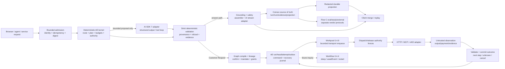

# AE agent runtime architecture audit

**Date:** 2026-08-02  
**Scope:** Flow A (public answer), Flow B (Customer Request V2), and Flow C (evaluation/study/external-run protocols).  
**Decision vocabulary:** `retain-domain` keeps a deliberate AE invariant in the domain kernel; `replace-with-library` delegates a mechanical seam to an installed primitive while retaining an AE adapter; `simplify` removes duplicate/base code without changing the contract; `defer` means no adoption until compatibility and parity evidence exist.

## Baseline

The maintained map is the source inventory: `.planning/codebase/PROMPT-DATA-FLOW.md:1-33,37-237`. The installed compatibility baseline is:

| Package/runtime | Installed fact | Consequence |
|---|---|---|
| `ai@7.0.44` | ESM package; Node `>=22`; v7 source is authoritative | Use v7 `instructions`, `Output.object`, `stopWhen`/`isStepCount`, `prepareStep`, `onStepEnd`, `stream`; do not infer from a newer online API. |
| Vercel/Nitro runtime config | `vite.config.ts:60-65` declares `nodejs20.x` | **Observed source incompatibility:** AI SDK 7 requires Node `>=22`. Resolve and hosted-smoke the runtime target before treating the model path as deployable. |
| `@openrouter/ai-sdk-provider@3.0.0` | peer `ai ^7` | Current OpenRouter adapter is compatible with the AI SDK seam. |
| `@convex-dev/workflow@0.4.4` | installed and used by `convex/projectSpine.ts:1-91,145-164` | Available for durable sleep/event/replay mechanics; it embeds Workpool. |
| `@convex-dev/workpool@0.4.9` | installed and used by `convex/customerRequestRouteExecutionJournalPorts.ts:103-128` | Available for bounded transport enqueue/retry; its operational work rows are not AE status. |
| `convex@1.42.0` | installed runtime/scheduler | Convex is the durable source of truth; scheduled mutations are exactly-once, scheduled actions at-most-once. |
| `zod@4.4.3` | installed schema boundary | Keep strict domain validation around model/provider output. |
| `@convex-dev/agent` | absent from `package.json:63-97` and `node_modules` | Do not adopt speculatively. Investigated `v0.6.4` declares `ai ^6.0.35` and `@ai-sdk/provider-utils ^4.0.6` (`get-convex/agent@v0.6.4/package.json:71-76`) and its source contains `AssertAISDKv6` (`src/client/types.ts:51-53`). It does not fit AE's AI SDK 7/provider-utils 5 graph. |

The AE contract that libraries must not erase is visible in the map and source: authority precedes effects; caller identity, budgets, graph freshness, exact route/command digests, schema validation, refusal/unknown results, evidence hashes, durable journals, replay/idempotency, cancellation, and redacted public projections are domain behavior. Flow B's Convex rows are authoritative, while Workpool/Workflow rows are mechanics. Model/provider observations are untrusted until deterministic validation. Flow C has three intentionally separate trust protocols: eval `boolean ok`, study recommendation/refusal plus proposal-only WorkTree node, and external-run `PASS | FAIL/KILL` (`PROMPT-DATA-FLOW.md:195-197`).

The installed AI SDK v7 migration guidance requires ESM/Node 22, makes `instructions` canonical over deprecated `system`, renames `onStepFinish` to `onStepEnd`, `onFinish` to `onEnd`, `fullStream` to `stream`, and changes aggregate multi-step usage/content semantics (`/Users/joelchan/.agents/skills/migrate-ai-sdk-v6-to-v7/SKILL.md:20-97`; installed `node_modules/ai/src/*`). The project already uses the v7-native loop controls, but `system` remains in current callsites and must be normalized as a behavior-preserving cleanup. Separately, the source-configured Vercel runtime is Node 20, below AI SDK 7's minimum; local package compatibility does not prove a deployable hosted model path.

## Executive verdict

Adopt a **narrow AI SDK 7 / Convex-components runtime**, not a generic agent replacement. The model may understand, propose a typed plan, compare candidates, and explain. Deterministic AE code must continue to select stages, validate every proposal and observation, enforce authority/budget/data rules, prepare effects, commit durable state, wait/resume, recover unknown outcomes, and project customer-safe results. This is the revised D1/D2 decision in `.planning/research/2026-07-31-agent-engine-verdict.md:22-43`.

**Immediate compatibility gate:** align the Nitro/Vercel function runtime and declared project engine with Node `>=22`, then prove the hosted runtime. Until then, AI SDK 7 architecture conclusions are source-level only for the Vercel model path.

1. **Flow A:** use AI SDK 7 for model transport, structured prose, bounded tool-loop controls, usage callbacks, and UI stream framing. Keep AE's planner, retrieval-first policy, canonical tool registry, serial evidence queue, grounding/safety gates, harness lifecycle, finalization hashes, persistence, and public projection.
2. **Flow B:** keep the Customer Request authority/evidence state machine and Convex atomic commits. Retain Workpool 0.4.9 only for normal route-transport enqueue/retry/concurrency. Use Workflow 0.4.4 for a future durable inquiry/wait state machine, not as a replacement for the existing route journal. Never place a second standalone Workpool around a Workflow step; Workflow embeds Workpool (`node_modules/@convex-dev/workflow/src/component/convex.config.ts:1-6`).
3. **Flow C:** keep the separate eval, study, and external-run verdict protocols. Use AI SDK mock providers and trace-shaped instrumentation to improve proof, but do not collapse their trust boundaries.
4. **Do not install `@convex-dev/agent@0.6.4`:** its AI SDK 6-only peer/source contract is incompatible; its generic thread/message/stream rows are not substitutes for AE identity, authority, evidence, projection, or recovery.
5. **Borrow ideas, not a donor runtime:** oh-my-pi's pinned loop source demonstrates useful pre-dispatch validation, soft tool requirements, concurrency modes, steering, append-only context, compaction, and run summaries, but its coding-agent assumptions and unverified package stack make it unsuitable as an AE dependency.

Every recommendation below identifies the current mechanism, an external primitive, a verdict, rationale, and the executable proof required before a migration is considered complete.

## Flow A audit — public answer turn

Current path: request/body bound and parsed → admission/access → `HarnessRunLoop` → context/intent/route/plan → retrieval-first → deterministic path or AI SDK tool-search agent → grounding/safety gates → event assembly → answer-turn persistence/finalization → transient stream plus durable public projection (`PROMPT-DATA-FLOW.md:37-93`).

| Stage and current mechanism | External primitive/version | Verdict and rationale | Required proof |
|---|---|---|---|
| Bounded request/admission: `api.answer.turn.ts:36-97`, `bounded-request-body.ts:58-76`, `turn-guard.ts:23-95`; 16 KiB body, session/owner, 30 s claim and 25-turn gate | Convex mutations/queries and native HTTP boundary; no agent library | **retain-domain.** The claim, owner/session check, remount behavior, and turn budget are authority policy, not generic chat state. | Route tests with malformed/oversized bodies, duplicate keys, wrong owner, exhausted turns, remount, and replay; assert no model/effect before admission. |
| Harness lifecycle: `turn-orchestrator.ts:116-243`, `harness/run-loop.ts:116-210,330-367`; ordered phases and guarded model/tool work, then report attempt | AI SDK callbacks/steps; Workflow 0.4.4 is a durable option but not needed for one HTTP turn | **retain-domain.** The phase/event taxonomy and report-after-failure behavior are AE evidence semantics. AI SDK `onStepEnd` supplies per-step usage, not the harness envelope. | Inject failures at each phase; verify ordered events, one request envelope plus per-step accounting, typed error, report attempt, finalization hash, and no post-abort writes. |
| Plan/retrieval-first: `answer-response-planner.ts:99-191`, `turns/retrieval-first.ts:41-175,241-313`; deterministic registry hit, qualifying empty → direct discovery, otherwise model path | AI SDK `prepareStep` can narrow an available tool menu; AI SDK workflow docs recommend explicit stages; Anthropic's workflow/agent distinction | **retain-domain.** A1 is a deliberate deterministic-first latency/cost and grounding policy; a model must not replace route selection. | Case matrix for hit, qualifying empty, nonqualifying empty/error, boundary, frozen, inquiry, unsupported, and agent recovery; assert call counts and branch-specific budgets. |
| Prompt assembly and trust boundary: `answer-llm-prompts.ts:1-126`; canonical tool IDs, inert catalog data, replacer sanitization | AI SDK `instructions`/`prompt` and tool schemas; native `JSON.stringify` replacer | **retain-domain + simplify.** SDK transports prompts; AE decides what untrusted business/catalog text may mean and keeps canonical IDs. Normalize deprecated `system` to `instructions`; retain sanitization. | Injection fixtures in catalog/tool output; assert no prompt-originated authority, no noncanonical tool, stable serialized prompt, and unchanged accepted/refused evidence. |
| Tool loop: `answer-tool-use-agent.ts:246-357,405-454`; one `generateText`, `Output.object`, tools, custom `stopWhen`, final tool-less step, `maxRetries:0`, `onStepEnd`, abort | Installed `ai@7.0.44`: `generateText`, `Output.object`, `isStepCount`, custom `StopCondition`, `prepareStep`, `activeTools`, `abortSignal`, `timeout` | **replace-with-library (already adopted), retain domain guards.** SDK owns protocol/loop mechanics; AE owns model budget, tool menu, serial evidence, schema, and refusal semantics. AI SDK tool execution uses `Promise.all` (`node_modules/ai/src/generate-text/generate-text.ts:1515-1570`), so it cannot define AE's serial evidence order. Generic `ToolLoopAgent` defaults to 20 steps (`node_modules/ai/src/agent/tool-loop-agent.ts:25-52`), which is not an AE budget. | Mock provider tests for step limit, final tool-less step, no-key fail-closed, abort, invalid structured output, retry count, usage aggregation versus `finalStep`, tool order/evidence order, and typed failures through the harness. |
| Tool admission: `tool-runner.ts:37-112,207-231`, schema `answer-thread.schema.ts:29-33`; allow-list/read-only/schema/evidence digest | AI SDK tool definitions and tool approval API can gate generic tools; AI SDK v7 `toolApproval` is not AE identity/mandate | **retain-domain.** Tool name/input admission and result digest must be checked by AE before execution; SDK approval cannot replace caller identity, route authority, or evidence records. | Forged name/input, unknown tool, malformed input, read/write capability, repeated command, and tool-result injection cases; assert refusal row and no effect. |
| Grounding/safety: `answer-tool-use-agent.ts:135-184`, `catalog-grounding.ts:11-40`, `answer-turn-safety.ts:17-69`, orchestrator `399-429`; three gates and current/frozen slug checks | AI SDK structured output/schema; OpenAI least privilege/confirmation/layered safety guidance | **retain-domain.** Triple gating is accepted A3 defense in depth, not redundant library code. | Prose with wrong location/slug, unsafe content, stale/frozen provider, malformed snapshot, and untrusted tool text; assert typed refusal, no persisted accepted snapshot, and redacted error projection. |
| Stream framing: `api.answer.turn.ts:98-145`, `answer-ui-stream.ts:17-69`; transient `data-answer-event`, no-store, abort suppression | `createUIMessageStream` and `createUIMessageStreamResponse` in installed AI SDK 7 | **replace-with-library (already adopted) + retain AE adapter.** SDK owns framing; AE owns event payload, terminal-complete policy, abort suppression, and durable replay. | Consume a real `Response`; assert frame ordering, transient payload shape, no-store headers, abort behavior, and convergence with GET projection after refresh/reconnect. |
| Persistence/finalization: `answer-turn-finalization.ts:141-314,500-740`, `convex/answerThreads.ts:58-338`, `convex/harnessSessions.ts:186-447`; canonical hashes, tool-call rows, harness journal, accepted/replayed terminal | Convex transactions, scheduler, Workflow journal mechanics | **retain-domain.** No SDK stream/message or Agent component provides AE's three-row production contract, finalization hash, replay status, or source write admission. | Convex integration proof for new/existing thread, duplicate command, replay, persist failure, report failure, source-finalizer failure, and accepted/replayed projection. |
| Client replay/projection: `answer-turn-state.ts:40-176`, `public-projection.ts:45-93`, `answerThreads.ts:580-619` | AI SDK UI stream consumer only | **retain-domain + simplify only after parity.** Optimistic and durable representations have distinct jobs (A6); public data must stay redacted. | Stream/GET race, reconnect, duplicate seq, private evidence leak, and projection parity cases; assert exactly one public turn and stable ordering. |

**AI SDK v7 semantic cautions.** `result.usage` and top-level content/tool calls aggregate all steps; final-step-only fields belong under `result.finalStep` (migration guide and installed `generate-text.ts:1413-1469`). `system`, `onStepFinish`, and `fullStream` are deprecated aliases, not migration targets. The answer agent currently uses `system` in `answer-tool-use-agent.ts:285-357`; normalize it in the migration sequence. A timeout gap remains: semantic transport passes SDK `timeout` plus abort (`openrouter-transport.ts:74-100`), while the answer agent currently passes abort but no independent SDK timeout (`answer-tool-use-agent.ts:294-303,333-347`). Treat any answer-loop timeout change as a measured seam, not an unproved refactor.

## Flow B audit — Customer Request V2

Current path: bounded/authenticated submission → durable reservation shell → routeable capability graph → exactly-two proposal/compile attempts → structured semantics → deterministic compile and lineage commit → customer-safe decision → exact confirmation → mandate → cumulative grants → run/head/attempt/outbox journal → Workpool transport → dispatch/release gates → quarantined observation/output validation → next step or cancellation → projection (`PROMPT-DATA-FLOW.md:101-150`).

| Stage and current mechanism | External primitive/version | Verdict and rationale | Required proof |
|---|---|---|---|
| Public transports/admission/reservation: `customer-request-api.ts:19-47`, route-action API `43-93`, `customerRequestApplication.ts:697-768`, `customerRequestV2.ts:146-218` | Convex mutation atomicity and native bounded body handling | **retain-domain.** Identity, rate, digest/idempotency, sensitive-input refusal, and shell-before-provider-work are the security and cost boundary. | Browser/agent/service-assertion matrix; malformed/oversize/sensitive/replay/rate cases; prove no provider call before shell reservation. |
| Capability graph: `interpret-compile/graph.ts:22-90`, `customerRequestApplication.ts:1768-1791` | Convex indexed reads and deterministic digesting | **retain-domain.** Graph snapshots, exact descriptors, bindings, and digest freshness are the meaning of a plan; no generic agent thread can replace them. | Mutate graph between attempts; assert graph reload, digest mismatch refusal, bounded payload, and no stale route commit. |
| Attempt ladder: `interpret-compile/interpret.ts:118-205`, `interpreter.ts:23-70` | AI SDK `generateText` + `Output.object` at `openrouter-transport.ts:74-100` | **replace-with-library for model transport/structured decoding; retain exactly-two policy and fallback.** AI SDK parses a typed wire response; AE normalizes tolerant wire data, validates strict domain schema, records provenance, and chooses deterministic no-key/final-attempt behavior. | Mock provider tests for exactly two attempts, retryable compile refusal, no-key zero model calls, bounded serialized response, `NoObjectGeneratedError.text` salvage only where allowed, provenance digests, and refusal taxonomy. |
| Deterministic compile: `compiler.ts:208-390,546-700` | Zod and standard deterministic code; AI SDK workflow examples explicitly keep structured workflows | **retain-domain.** Facts/criteria/actions/dependencies, evaluation, Cartesian route generation, cost/freshness/recovery, and zero-route/unknown-cost omission are product policy. | Property/case tests for route Cartesian product, dependency/effect metadata, unknown cost, zero route, stale graph, and canonical aggregate digest. |
| Commit/store: `v2-write/commit-aggregate.ts:11-155`, `customerRequestV2WritePorts.ts:60-216` | Convex transaction/optimistic concurrency | **retain-domain.** Expected lineage, replay/conflict, current graph, supersession, revision/generation/head/command writes are the source of truth. | Concurrent identical/different commands, replay after partial client loss, stale revision, and generated/no-generation writes; assert one authoritative head. |
| Decision/confirmation/mandate: `route-plan-customer-projection.ts:93-162`, `confirm.ts:11-78`, `route-mandate-mutation/issue.ts:11-170` | AI SDK tool approval/HMAC can protect a UI approval token; Convex authority checks remain required | **retain-domain.** Approval is digest-bound preparation before disclosure/payment/commitment, not a model callback. Exact displayed revision/route, caller authority, scope, spend, data, and effect recipient must be checked. | Tampered route/revision, changed supply, stale cost, wrong principal, replayed approval, disclosure without authority, and approval-token forgery; assert zero effect. |
| Step grant and start/journal: `customerRequestRouteMandateAdmission.ts:60-145,199-263`, `start-or-resume.ts:7-187`, journal ports `279-373` | Convex atomic mutations; Workflow journal is a future mechanic | **retain-domain.** Cumulative spend/data reservations, run/head/attempt/outbox/command and resume/cancel decisions are AE invariants. | Duplicate grant/start, cumulative budget overrun, canceled mandate, crash before enqueue, and resume from each durable state; assert idempotent rows and bounded authority. |
| Normal enqueue: `customerRequestRouteExecutionJournalPorts.ts:103-128` | `@convex-dev/workpool@0.4.9`: `maxParallelism:32`, retry default/max 3, 5 s `runAfter` delay | **replace-with-library (already adopted), but keep AE journal authoritative.** Workpool is the correct bounded action queue; it does not own route state or effect exactly-once. | Deploy/fixture proof for enqueue idempotency, retry, queue delay, cancellation before execution, action crash, and reconciliation from AE outbox to worker. |
| Dispatch/release: `RouteExecutionDispatchPorts.ts:96-181`, `mark-dispatched.ts:7-77` | Convex mutation/action boundary; Workpool cancellation cannot stop an in-progress action | **retain-domain.** Exact grant/mandate digest, supply/publication/credential/health/readiness checks must be repeated immediately before release. | Make each readiness/authority input stale between open and release; assert refusal and no provider call; verify in-progress cancellation is recorded as unknown/too-late rather than falsely canceled. |
| Transport/outcome: `route-transport-runtime.ts:147-203,307-520,762-787`, worker `customerRequestRouteTransportWorker.ts:66-198`, `record-outcome.ts:7-95` | HTTP/MCP/x402 adapters plus Convex action; provider idempotency/reconciliation | **retain-domain around base transport.** Provider output/payment/receipt is untrusted; output schema, release disposition, current attempt, evidence, and unknown fallback belong to AE. | Provider success then worker crash, duplicate retry, malformed output, mismatched receipt/payment, timeout, partial response, and unknown reconciliation; assert no duplicate external effect when idempotency is available and `unknown` otherwise. |
| Next step/cancellation: journal `646-783`, `cancel-current.ts:16-86`, cancel ports `89-188`, cancellation worker `13-74` | Workpool for normal next step; native Convex scheduler for active-adapter cancellation | **retain-domain + replace-with-library for enqueue only.** B5's split is deliberate: pending queued work can cancel immediately; active adapter cancellation is a separate observed command; scheduled mutations and actions have different guarantees. | Chain route steps with evidence-bound mapping; cancel pre-release, active, and too-late; prove command/result rows, retry/replay, and correct scheduler semantics. |
| Customer projection: `project-plans.ts:12-68`, `project-run.ts:64-149`, Convex read `customerRequestRouteExecution.ts:105-180,568-579` | Convex queries; no Agent/Workpool status projection | **retain-domain.** Customer-safe action/result/attention state must derive from AE rows and contain no raw provider/private data. | Projection redaction, all terminal/unknown/canceled/failed/progress states, replay, and no live leased branch (B6). |

**Workpool conflict resolved.** The installed `@convex-dev/workpool@0.4.9` README describes a configurable one-day status TTL, but the installed source/types expose no `statusTtl` option and `src/component/schema.ts:46-65` deletes terminal `work` rows. Treat Workpool status as ephemeral operational telemetry; AE attempts, outbox, outcomes, and projections are authoritative. Do not design a recovery or customer status feature around the README-only option. Workpool retries also do not make third-party effects exactly once: an external effect can occur before a worker crash; a stable provider transaction ID and reconciliation are required (`node_modules/@convex-dev/workpool/README.md:54-125`, `src/client/index.ts:360-451`).

**Workflow boundary.** Workflow 0.4.4 provides durable steps, sleep, event waits, cancel/restart, and replay (`node_modules/@convex-dev/workflow/src/component/workflow.ts:376-429`, `src/component/journal.ts:71-183`). Its steps have a total 1 MB input/output limit and the journal has an 8 MiB limit (`README.md:755-815`); function names/order are determinism surfaces. These constraints make it suitable for a future inquiry state machine, not a replacement for AE's high-cardinality route journal. Workflow's `onComplete` errors are captured separately and cannot substitute for AE domain commits.

## Flow C audit — evaluation, Promptfoo, study, external runs

| Protocol/current mechanism | External primitive | Verdict and rationale | Required proof |
|---|---|---|---|
| Main eval: `eval/answer/scripts/run-suite.ts:5-42`, case catalogs, in-process evaluator `evaluators.ts:212-240,359-408`; calls real route/harness with in-memory answer-thread port | AI SDK `MockLanguageModelV4`/mock provider (`node_modules/ai/docs/03-ai-sdk-core/55-testing.mdx:1-25`) | **retain-domain + replace-with-library for deterministic model seam.** The real route/harness/finalization path is the correctness test; mock provider removes provider variance. | Repeat same fixtures; assert `report.ok`, coverage, no failed cases, route/evidence/projection parity, and deterministic call/step budgets. |
| Promptfoo direct tool probe: `promptfooconfig.yaml:152-182`, `evaluators.ts:759-878`; direct `runAnswerToolUseAgent` | Promptfoo plus AI SDK model loop | **retain as a narrow probe, never E2E.** C1 intentionally bypasses route, harness, persistence, and Convex; it can measure tool behavior only. | Label reports as probe; add a paired route-backed case before treating a finding as a release failure. |
| Study: `study.actions.ts:45-114`, `study.functions.ts:100-304`, pipeline `internal/pipeline.ts:38-429`, TOPSIS `internal/topsis.ts:65-151`; proposal-only WorkTree node | Convex durable rows/events and deterministic pipeline | **retain-domain.** Qualification, quotes, evidence, score/TOPSIS, refusal, and proposal-only mutation are a separate trust domain. | Fenced study/replay, quote/evidence integrity, deterministic scores, refusal branches, and no automatic decision effect. |
| External run: `convex/externalRuns.ts:66-363`, gate `external-run/internal/gate.ts:160-297` | Convex evidence rows plus deterministic integrity/metric gate | **retain-domain.** Manifest admission, source authority, evidence references/digests, thresholds, and exact `PASS`/`FAIL/KILL` are not eval `ok` or study recommendation. | Missing/duplicate/tampered evidence, metric threshold, manifest mismatch, and replay; assert exact gate verdict and immutable references. |
| Observability and trace grading | OpenAI trace/eval guidance; AI SDK v7 step usage; optional `@ai-sdk/otel` (not installed) | **defer as a dependency; simplify local envelopes first.** OpenAI describes traces as records of model/tool/guardrail/handoff spans, but no external trace proves AE authority or durability. | Export/compare one harness request envelope plus per-step records; then run trace-to-journal parity and cost/latency checks before adding telemetry package. |

The Flow C protocol invariant is non-conversion: an eval pass does not authorize a study decision; a study recommendation does not authorize a route; an external `PASS` does not imply product correctness.

## Adoption matrix

| AE responsibility/current mechanism | External primitive and source | Verdict | Rationale | Required proof before change |
|---|---|---|---|---|
| UI stream framing, `answer-ui-stream.ts:17-69` | AI SDK 7 `createUIMessageStream`/`createUIMessageStreamResponse`, `node_modules/ai/src/ui-message-stream/*` | `replace-with-library` | Already delegated framing; keep AE payload, abort, no-store, and terminal rules. | Real stream consumption plus abort/reconnect/projection convergence. |
| Structured answer prose and semantic proposal | AI SDK 7 `generateText` + `Output.object` (`answer-tool-use-agent.ts:285-357`; `openrouter-transport.ts:74-100`) | `replace-with-library` | SDK owns decoding/provider protocol; AE owns tolerant wire normalization, strict validation, provenance, and refusal. | Mock-provider schema/invalid-output/retry tests and Convex evidence parity. |
| Generic agent loop | AI SDK 7 `ToolLoopAgent`/`stopWhen`/`prepareStep` | `simplify` | Keep direct `generateText` where AE needs one call, custom budgets, final tool-less step, and harness guards; avoid generic default 20-step behavior. | Step-budget/cost/latency and final-step proof against current route. |
| Request/turn/router/planner | AI SDK/Workflow or model-driven router | `retain-domain` | Task-shape gate, retrieval-first, deterministic boundary/frozen/inquiry paths, and candidate menu are product policy and cost control. | Branch matrix, zero-unnecessary-model-call assertion, grounding and replay evidence. |
| Tool registry/admission/effect metadata | AI SDK tools/`toolApproval` | `retain-domain` | SDK approval is not AE caller identity, mandate scope, read/write effect classification, or evidence digest. | Forged/tampered approval, unknown tool, schema, identity, and no-effect cases. |
| Authority, grants, mandates, spend/data reservations | AI SDK approval secret; Convex transactions | `retain-domain` | Digest-bound preparation before disclosure/payment/commitment is AE safety policy; retain inspect-only/approve-each/bounded-mandate modes. | Authorization matrix and tamper/replay/overspend integration proofs. |
| Harness lifecycle, reports, finalization hashes | Workflow journal or Agent messages | `retain-domain` | Library journals do not carry AE phase taxonomy, report-after-failure, source finalization, or evidence hash contract. | Failure injection and journal/projection parity across all phases. |
| Normal route transport queue | Workpool 0.4.9 `enqueueAction`, max parallelism/retries/runAfter | `replace-with-library` | Installed component owns bounded asynchronous mechanics; AE owns outbox, attempt state, release, outcome, and recovery. | Deployed retry/crash/idempotency/cancellation/reconciliation proof. |
| Durable inquiry wait/resume | Workflow 0.4.4 `awaitEvent`, sleep, restart/cancel | `replace-with-library` (future pilot) | Good fit for `prepared→sent→awaiting→reminder/expiry→resolved/escalated`; not a route journal replacement. | One inquiry type, authenticated/deduplicated callbacks, restart, expiry, SLA and public projection proof. |
| `@convex-dev/agent` threads/messages/streams | Agent `v0.6.4` component | `defer` | Absent and AI SDK 6-only; generic rows do not satisfy AE authority/evidence/projection. | Only revisit after an AI SDK 7-compatible release plus schema, identity, replay, evidence, and migration parity. |
| Model gateway/catalog | Cached OpenRouter seam `model-gateway/public.ts:42-130`; bounded catalog `openrouter-models.ts:171-255` | `retain-domain` + `simplify` collection primitive | Provider choice/cache/fallback are policy; installed `es-toolkit/array.uniqBy` owns first-ID-wins dedupe. | Catalog freshness/fallback/cost and stable model IDs under provider change. |
| Scheduler split | Workpool for transport; native `ctx.scheduler.runAfter` for cancellation/readiness | `retain-domain` | Scheduled mutations are exactly-once and actions at-most-once (`convex/src/server/scheduler.ts:18-25`); semantics differ. | Crash/retry/cancel matrix, not a single “scheduler reliability” assertion. |
| Promptfoo/study/external verdicts | Promptfoo, Convex rows, deterministic gates | `retain-domain` | C1/C4 are intentional trust-boundary separations. | Cross-protocol non-conversion and tamper/integrity proofs. |
| Legacy read-only compatibility fallback | `answer-thread.functions.ts:237-301,394-416` | `simplify` (defer deletion) | Remove only when legacy hosts/functions are impossible; it is not evidence that the primary contract is duplicated. | Host census, fallback-disabled canary, read parity, rollback plan. |
| V2 notification outcome edge | Notification outbox currently accepts inquiry thread/message data (`notification-outbox/internal/commands.ts:28-56`) | `defer` | B1 is a product gap, not a runtime refactor; inventing an edge would change product scope. | Product contract for V2 notifications, then a separate event/evidence design. |

## Target architecture and exact seams

Exact seams are intentionally narrow:

| Seam | Input/output contract | Ownership boundary |
|---|---|---|
| `ModelProposalPort` | bounded intent + graph/candidate descriptors → typed proposal, model/provider ID, attempt, input/output digests, usage | AI SDK may produce a proposal; AE decides whether it is valid, affordable, current, and actionable. No authority/effect in the return value. |
| `ToolExecutionPort` | canonical registered ID + schema-valid input + command/turn key → bounded observation, result digest, sources, refusal/error | Admission, read/write classification, identity, and evidence are AE-owned; SDK tool protocol is transport only. |
| `StreamAdapter` | ordered `AnswerEvent` → AI SDK UI stream frame | SDK owns framing; AE owns transient payload, no-store/abort, terminal completion, and durable convergence. |
| `DurableTurnPort` / `DurableRunPort` | accepted/refused snapshot or state transition + expected lineage → atomic Convex rows and hash | Convex rows, not SDK/Workpool/Workflow operational rows, are source of truth. |
| `QueuePort` | committed dispatch reference + bounded retry/delay policy → Workpool work ID | Workpool owns scheduling mechanics; AE outbox/attempt state owns intent, status, reconciliation, and customer projection. |
| `ApprovalMandatePort` | exact displayed revision/route, principal, scope, spend/data reservation, idempotency key → confirmation/mandate/grant receipt | Approval is digest-bound preparation; disclosure and outbound message composition are effects requiring authority. |
| `OutcomePort` | current attempt + release record + provider observation/output/receipt → validated terminal/unknown/next-step transition | Provider responses remain untrusted; invalid released output becomes `unknown`, never silent success. |
| `WorkflowInquiryPort` | durable inquiry state + authenticated callback event → resumed state or expiry/escalation | Workflow supplies wait/replay mechanics only; AE persists/deduplicates/authenticates callbacks before `awaitEvent`. |
| `ProjectionPort` | private Convex rows/evidence → public answer/run status | Redaction, customer action vocabulary, and attention state remain domain-owned. |
| `EvalPort` | fixture/provider trace/route result → eval `ok`, study artifact/recommendation, or external `PASS/FAIL/KILL` | No protocol may silently authorize another trust domain. |

## Justified hand-rolling register

| Hand-rolled mechanism | Why a library cannot replace it | External primitive checked | Invariant/proof obligation |
|---|---|---|---|
| Task-shape route/planner and retrieval-first policy (`answer-response-planner.ts`, `retrieval-first.ts`) | Libraries loop; they do not know AE's route taxonomy, qualifying-empty discovery fork, frozen evidence, or cost policy. | AI SDK `prepareStep`/tool menus; Anthropic workflow guidance | Mechanical predictable asks avoid model calls; branch matrix and call-count proof. |
| Caller identity, service assertion, session/owner, grants/mandates | Generic thread authorization or tool approval lacks AE principals, bounded authority, cumulative spend/data, exact route digest, and recipient kind. | AI SDK `toolApproval`/approval secret; Convex auth/transactions | Unauthorized effect count zero; tamper/replay/overspend blocked. |
| Canonical registered action/tool registry and effect metadata | SDK tool names are protocol labels, not AE action descriptors or disclosure/payment semantics. | AI SDK tools and `toolApproval`; current action registry | Prompt/admission parity, stable IDs, schema validation, effect class and reversibility checks. |
| Grounding, safety, refusal taxonomy | Generic structured output can be valid yet wrong/stale/unsafe; no SDK API creates AE refusal/evidence/result hash. | AI SDK `Output.object`; OpenAI layered prompt-injection guidance | Three gates, typed error, no accepted snapshot/effect, evidence record. |
| Harness phases, report-after-failure, finalization hash | Workflow/Agent journals are generic execution records and have different size/determinism/status semantics. | Workflow 0.4.4 journal/restart | Failure injection, accepted/replayed finalization, journal/projection parity. |
| Convex aggregate/revision/head/run/attempt/outbox writes | Workpool deletes terminal work rows; Workflow step result is not the customer request head; external action is not exactly-once. | Convex atomic mutations, Workpool, Workflow | OCC/replay/concurrent commit, source-of-truth audit, unknown recovery. |
| Serial evidence queue and ordered tool records | AI SDK executes tool calls concurrently via `Promise.all`; parallelism can violate evidence ordering and budget accounting. | AI SDK tools; oh-my-pi concurrency modes as design reference only | Deterministic sequence/order, bounded concurrency, no duplicate result digest. |
| Release fences and outcome validator | A queue's dequeue is not proof that authority, supply, credential, publication, health, and output schema are still current. | Workpool enqueue/cancel, Convex actions | Stale-at-release refusal; observation/output validation and unknown state. |
| Cancellation semantics | Workpool cannot stop an in-progress action; Convex scheduled mutation/action guarantees differ. | Workpool `cancel`, Convex `runAfter` | Pre-release immediate cancel; active adapter pending cancellation; too-late/unknown is truthful. |
| Public projection and redaction | AI SDK/Agent message history is not a customer-safe projection and may contain tool/provider/private data. | AI SDK UI stream; Agent generic messages | Stream/GET dedupe, redaction, terminal status/result/attention parity. |
| Separate eval/study/external verdicts | A single score/trace cannot define route authority, study recommendation, or external integrity. | AI SDK mock providers; OpenAI trace/eval concepts | Protocol non-conversion and exact per-protocol release gate. |
| Inquiry callback quarantine and contact/disclosure timing | No reviewed OSS component proves the full demand-side async business loop or dual-party disclosure authority. | Workflow `awaitEvent`; prior verdict D3-D5 | Persist/auth/dedupe event before resume; one pilot; contact timing is an experiment, not doctrine. |

## Deletion candidates

These are candidates, not permission to delete before the stated proof:

1. **Normalize deprecated v7 aliases.** Replace current `system:` options with canonical `instructions:` in `src/modules/answer/internal/answer-tool-use-agent.ts:285-357`, `src/modules/customer-request/openrouter-transport.ts:74-100`, `src/modules/storefront/internal/business-enrichment.ts:264-292`, and `src/modules/answer-thread/internal/llm-follow-up-chips.ts:53-72`. Audit `onStepFinish`/`onFinish`/`fullStream` aliases and v6 names. Proof: typecheck plus provider/mock route parity, explicit aggregate-vs-`finalStep` usage assertions, and unchanged evidence hashes.
2. **Remove the legacy answer-thread read fallback** in `src/modules/answer-thread/answer-thread.functions.ts:237-301,394-416` only after every supported host has the optimized function and a fallback-disabled canary proves read/projection parity. Do not remove the production three-row persistence contract.
3. **Remove historical `accepted` compatibility reads** after a durable-row census proves no live producer and no supported historical migration requires it (`PROMPT-DATA-FLOW.md:228-230`).
4. **Keep already-resolved base simplifications out of the codebase:** the duplicate step-shape type, hand-written model-ID dedupe, and repeated sanitization paths were replaced by installed SDK `StepResult`, `es-toolkit/array.uniqBy`, and native JSON replacer according to the map verification record (`PROMPT-DATA-FLOW.md:249-253`). Reintroducing them is prohibited.
5. **Do not add status persistence around Workpool's README-only `statusTtl`.** There is no installed 0.4.9 source option; any code depending on it would be dead/false infrastructure. Use AE journals/projections.
6. **Do not delete fallback report builders or the `AnswerSynthesizer` named contract yet.** C3 parity is unproven and A7 is explicitly open (`PROMPT-DATA-FLOW.md:225,236`); remove or rename only after exported callers and live/fallback parity are mapped.
7. **Do not add a second queue.** If a future inquiry uses Workflow, delete any proposed outer Workpool for the same Workflow steps; Workflow already embeds Workpool. Proof is a single-queue trace with restart/cancel/retry semantics.

## Proposed performance budgets (SLOs, not literature)

No latency, cost, throughput, or deployed recovery measurement was run for this read-only audit. The following are **[PROPOSED] release SLOs** for a first characterization window; they are targets to measure and tune, not observed facts and not copied from external benchmarks.

| Surface | [PROPOSED] SLO/budget | Budget owner and reason | Required measurement/proof |
|---|---|---|---|
| Flow A deterministic path | p95 request-to-first useful event ≤1.0 s; p95 completion ≤3.0 s; zero model calls for known/frozen/boundary/inquiry/unsupported branches where source policy says deterministic | Planner/router/domain; protects predictable asks from agent latency/cost | Route-backed fixture with cold/warm Convex reads, call counter, stream timestamps, and projection parity. |
| Flow A model path | p95 first progress frame ≤2.0 s; p95 completion ≤12 s; one agent invocation, ≤4 model steps, ≤8 read-tool calls per turn unless a plan explicitly lowers the cap; 100% requests obey an abort deadline | AI SDK adapter supplies step/timeout mechanics; AE plan owns budget | Mock and provider-capture runs; record per-step usage, tool count, retries, time-to-first-frame, abort-to-no-write, and accepted/refused rate. |
| Flow A cost | [PROPOSED] p95 input/output token budget per turn is plan-specific and exposed in harness report; no retry when `maxRetries:0`; deterministic branches cost zero provider calls | Harness/domain accounting; avoids hidden SDK defaults (v7 retry default is 2 when unspecified) | Assert request count, token usage aggregation, `finalStep` usage, and provider billing sample. |
| Flow B interpretation | Exactly two attempts maximum; no-key deterministic fallback makes zero model calls; p95 shell reservation ≤500 ms and non-model compile/commit ≤1.5 s under fixture load | Attempt ladder/domain; keeps provider work bounded and preserves replay | Convex deployment with concurrency, graph refresh, digest, retry/refusal and mutation timing traces. |
| Flow B queue/transport | Existing configured ceiling: Workpool max parallelism 32, max 3 attempts, 5 s pre-release delay. [PROPOSED] p95 committed-outbox-to-worker-open ≤10 s excluding provider latency; no customer state depends on Workpool terminal row | Workpool mechanics plus AE journal; status TTL conflict makes AE projection mandatory | Trace outbox, Workpool ID, open/release, retries, and AE terminal rows; measure queue saturation and duplicate provider IDs. |
| Flow B effect/recovery | [PROPOSED] unauthorized releases = 0; every provider attempt has a stable idempotency/reconciliation key; provider outcome remains `unknown` within one recovery cycle when commit is ambiguous; p95 projection update ≤2 s after outcome commit | AE authority/outcome kernel; retries cannot prove third-party exactly-once | Crash injection after release and before outcome, provider reconciliation, duplicate command, cancel, and projection readback. |
| Workflow inquiry pilot | [PROPOSED] one inquiry type; callback dedupe/authentication 100%; sleep/event resume correctness 100% in fault matrix; step payload <1 MB and journal <8 MiB | Workflow 0.4.4 constraints; do not pass large bodies, only IDs | Restart, event replay, expiry, cancellation, function-version migration, and callback tamper tests. |
| Flow C eval | [PROPOSED] fixture suite is deterministic 100% repeatable; `report.ok` cannot be true with missing coverage or failed case; direct Promptfoo probes labeled non-E2E | Eval protocol/domain | Repeat runs, failure injection, coverage audit, and report integrity checks. |

External literature is context, not these SLOs: AI SDK documents a generic `ToolLoopAgent` default of 20 steps as a runaway-cost safety measure; Anthropic recommends the simplest workflow/agent appropriate to the task; τ-bench reports GPT-4o below 50% task success and retail pass^8 below 25%; AgentDojo reports utility loss under attack; GAIA reports 92% human versus 15% GPT-4 with plugins. None is an AE release threshold or a transfer claim.

## Eval ladder and metrics

| Level | Evidence gate | Metrics and failure condition |
|---|---|---|
| L0 source/contract | Version lock, map citation anchors, AI SDK/runtime compatibility, no incompatible Agent dependency, seam schemas | Missing row/owner/citation, a configured runtime below Node 22, v6 API use, or unbounded input is a failure. |
| L1 deterministic kernel | Unit/property fixtures for router, planner, graph, compiler, grants, digests, projections | Wrong branch, stale graph acceptance, budget overrun, unauthorized effect, digest mismatch not refused, or redaction leak is a failure. |
| L2 Flow A route | Real route + HarnessRunLoop + in-memory port + mock AI SDK provider | `report.ok`, phase order, model/tool counts, grounding/refusal, finalization hash, stream/GET parity, abort/no-post-abort-write. |
| L3 model/provider contract | Captured AI SDK v7/OpenRouter responses and controlled errors | Schema validity, tolerant normalization, retries, timeout, `usage` versus `finalStep`, step/tool budget, no-key path, and provider-error taxonomy. |
| L4 Flow B Convex deployment | Convex integration with OCC/concurrency, Workpool retries, transport adapters, scheduler cancellation | Exactly one shell/head per idempotent command; release fences; duplicate/replay behavior; external outcome `succeeded/failed/partial/unknown`; queue and projection SLOs. |
| L5 adversarial authority | Untrusted catalog/reply/tool output, approval tamper, identity substitution, stale route, payment/disclosure attempt | Unauthorized effect rate must be zero; injected instruction cannot alter action set/recipient; approval must bind exact tool/route/input; unknown outcomes are not success. |
| L6 recovery/load | Crash after each commit/effect boundary; queue saturation and provider latency distributions | No lost durable intent; reconciliation reaches truthful terminal/unknown; p95/p99 SLOs, token cost, retry amplification, OCC conflicts, and queue depth stay within proposed budgets. |
| L7 release/eval trust | Full suite, study, and external-run reports | Eval coverage/no failed cases; study evidence/quote integrity and deterministic recommendation; external exact `PASS` or `FAIL/KILL`; no cross-protocol conversion. |

Minimum metric set: model calls and retries; per-step/all-step/final-step tokens; tool calls by canonical ID; prompt/response byte bounds; time-to-first-frame and completion; Convex transaction/OCC conflicts; queue wait/retry/cancel; grant/mandate/release refusals; provider idempotency/reconciliation; unknown rate and resolution age; evidence/hash/journal completeness; public projection redaction/parity; eval coverage and failure counts; study integrity; external gate integrity. Every metric must identify request/turn/run/attempt/command keys without making raw private payload public.

## Migration sequence

1. **Resolve and freeze the compatibility baseline.** Keep the installed package versions, but align `vite.config.ts` and the project engine declaration with AI SDK 7's Node `>=22` requirement, then verify the hosted runtime. Record current route/evidence/projection fixtures and do not install `@convex-dev/agent`.
2. **Canonicalize AI SDK v7 names.** Change all four verified `system` callsites listed under deletion candidates to `instructions`; audit deprecated lifecycle/stream aliases and explicit `finalStep` usage. Preserve behavior; prove with mock/provider and route tests.
3. **Make the adapter contracts explicit.** Put the model call behind `ModelProposalPort`, tool execution behind `ToolExecutionPort`, and stream framing behind `StreamAdapter`; pass digests, attempt, budget, and abort signal through rather than moving authority into an SDK callback.
4. **Characterize Flow A.** Exercise deterministic branches first, then the AI SDK path with controlled provider output. Capture step/tool/usage accounting, stream frames, abort, grounding, persistence, finalization, and public replay before changing loop shape.
5. **Retain and harden Flow B.** Keep Convex aggregate/head/run/attempt/outbox writes and release/outcome gates. Verify Workpool 0.4.9 operational semantics from source, stable external idempotency, and crash reconciliation. Do not read status from Workpool terminal rows.
6. **Pilot one Workflow inquiry.** Use Workflow 0.4.4 only for sleep/event/restart mechanics; store large data by IDs; authenticate/dedupe callback rows before `awaitEvent`; pin stable function names/order and engine/plan versions. Do not wrap existing route transport in a second Workpool.
7. **Add effect metadata and approval UX.** Extend registered action descriptors with observation/quote/disclosure/commitment/payment, reversibility, recipient kind, and exact prepared digest. Stream approval requests through the answer UI, but commit mandate/grant in Convex before dispatch.
8. **Run the eval ladder and proposed SLO study.** Start with mock providers, then provider captures, then Convex fault/load tests, then adversarial and external integrity gates. Compare measured values to the proposed SLOs; do not substitute literature numbers.
9. **Delete only proven duplication.** Remove v7 aliases, compatibility fallbacks, or historical reads only after parity/census/canary evidence. Keep A7/C3 open until exported contract and fallback parity are proven.

## Rejected alternatives

| Alternative | Rejection and evidence |
|---|---|
| Replace the mechanical router with one autonomous model loop | Prior verdict corrected D1/D2: predictable work belongs in workflows/deterministic stages; tool menus, budgets, validation, effects, and recovery remain kernel responsibilities. τ-bench/GAIA/AgentDojo observations reinforce uncertainty, but are not AE gates. |
| Adopt `@convex-dev/agent@0.6.4` now | Package peers require AI SDK 6/provider-utils 4 and source emits an explicit v6 guard; AE is AI SDK 7/provider-utils 5. Its generic `threads/messages/streamingMessages` schema (`get-convex/agent@0.6.4/src/component/schema.ts:31-64`) cannot replace AE rows. |
| Replace AE route journal with Workflow | Workflow embeds Workpool, has 1 MB step and 8 MiB journal limits, function/order determinism constraints, and operational callbacks that do not equal AE commits. Use it for a bounded future inquiry state machine only. |
| Add Workpool around Workflow steps | Duplicate queue/retry/concurrency machinery; Workflow already owns an embedded Workpool. Use one owner per hop. |
| Treat Workpool README status TTL as installed API | 0.4.9 source/types have no `statusTtl`; terminal work rows are deleted. README conflict is resolved in favor of installed source. |
| Use AI SDK `ToolLoopAgent` as the entire runtime | It supplies generic looping and default 20-step stopping, not AE authority, evidence, projections, or recovery; direct `generateText` already supplies the narrower required seam. |
| Install oh-my-pi agent core or copy its coding-agent runtime | Donor source at pinned commit is useful design evidence for pre-dispatch validation, steering, compaction, and summaries, but it is not an AE-compatible package and assumes coding-agent tools/worktrees/IRC/MCP. Borrow patterns only after local proof. |
| Replace registered MCP/x402 transport with a high-level client | Current protocol versions, operation-key request IDs, signed transport, effect/release gates, and observation schemas are part of AE's boundary; a generic client would erase them. |
| Let a business reply or tool result compose/send outbound disclosure autonomously | Untrusted content can carry prompt injection. OpenAI recommends least privilege and confirmation for consequential effects; AE requires digest-bound preparation and mandate before disclosure/payment/commitment. |
| Make contact-at-first-async-effect a universal funnel rule | Prior verdict D5 records conflicting dropout evidence. Capture contact as a typed disclosure blocker and A/B it; it is not an architecture invariant. |
| Collapse eval, study, and external-run into one score | Their outputs have different trust and authorization meanings; C4 explicitly records non-conversion. |

## Primary-source register

| Source | What it establishes for this audit |
|---|---|
| AI SDK repository: https://github.com/vercel/ai | Installed source family for `generateText`, structured output, tools, loop controls, UI streams, and v7 types. Local proof: `node_modules/ai/src/generate-text/*`, `src/ui-message-stream/*`, `src/agent/tool-loop-agent.ts`. |
| AI SDK v7 migration guide: https://ai-sdk.dev/docs/migration-guides/migration-guide-7-0 | `instructions`, `onStepEnd`, `onEnd`, `stream`, aggregate usage/content, `finalStep`, ESM/Node 22, approval/context naming. Installed copy is preferred where it differs. |
| AI SDK agents/workflows: https://ai-sdk.dev/docs/agents/workflows | Core structured workflows and evaluator-optimizer examples; supports using explicit stages rather than assuming a generic agent. |
| AI SDK loop control: https://ai-sdk.dev/docs/agents/loop-control | `stopWhen`, `isStepCount`, custom conditions and `prepareStep`/active tool menus. Local installed source/docs: `node_modules/ai/docs/03-agents/04-loop-control.mdx`. |
| AI SDK tool approvals: https://ai-sdk.dev/docs/agents/tool-approvals | Generic approval use cases and HMAC binding of tool name/call ID/input; not a substitute for AE mandates. |
| AI SDK testing: https://ai-sdk.dev/docs/ai-sdk-core/testing | Mock providers for deterministic model tests; local `node_modules/ai/docs/03-ai-sdk-core/55-testing.mdx`. |
| Convex Workflow repository: https://github.com/get-convex/workflow | Installed 0.4.4 source for durable steps, events, restart/cancel, embedded Workpool, 1 MB step/8 MiB journal and determinism constraints. Local `node_modules/@convex-dev/workflow/*`. |
| Convex Workpool repository: https://github.com/get-convex/workpool | Installed 0.4.9 source for enqueue/retry/concurrency/cancel semantics. Local `node_modules/@convex-dev/workpool/src/client/index.ts`, `src/component/schema.ts`. Source wins over README-only `statusTtl` claim. |
| Convex scheduler docs: https://docs.convex.dev/scheduling/scheduled-functions | Scheduled mutation exactly-once versus scheduled action at-most-once; scheduled functions do not inherit caller auth. Local `node_modules/convex/src/server/scheduler.ts:18-25`. |
| Convex workflow/agent guidance: https://docs.convex.dev/agents/workflows | Workflow is durable multi-step mechanics built on Workpool; use stable prompt/message IDs and pass large data by IDs. |
| Convex Agent v0.6.4 registry: https://registry.npmjs.org/@convex-dev/agent/0.6.4 | Package peer metadata (`ai ^6.0.35`, provider-utils `^4.0.6`). Pinned release: https://github.com/get-convex/agent/releases/tag/v0.6.4; source guard at https://raw.githubusercontent.com/get-convex/agent/2ac74487d69462b6575e21526e09d52a9371c578/src/client/types.ts. |
| Anthropic, “Building effective agents”: https://www.anthropic.com/engineering/building-effective-agents | Workflows use predefined paths; agents dynamically direct work; choose the simplest solution and account for latency/cost. |
| OpenAI agent evals: https://developers.openai.com/api/docs/guides/agent-evals | Trace grading captures model/tool/guardrail/handoff behavior; datasets/eval runs add repeatability. It does not establish AE authority. |
| OpenAI prompt injection: https://openai.com/safety/prompt-injections/ | Prompt injection is third-party malicious instruction in context; least privilege, confirmation, monitoring, and layered defenses are required. |
| AgentDojo: https://arxiv.org/abs/2406.13352 | Untrusted tool-return benchmark (97 tasks, 70 tools, 27 targets) and targeted attack/benign-utility framing; no AE SLO transfer. |
| τ-bench: https://arxiv.org/abs/2406.12045 | Tool-agent-user reliability framing and low GPT-4o/pass^8 results; benchmark context only. |
| GAIA: https://arxiv.org/abs/2311.12983 and https://huggingface.co/datasets/gaia-benchmark/GAIA | Real-world tool/browsing benchmark and human/model gap; not an AE release gate. |
| oh-my-pi pinned source: https://github.com/can1357/oh-my-pi/tree/06343fef4200c4e32d18f08df5a6a8bd84dcc710 | Source-shape donor for validation/steering/compaction/telemetry/run summaries; no AE package compatibility claim. |
| AE maintained map: `.planning/codebase/PROMPT-DATA-FLOW.md:37-237` | Current source paths, owner labels, Flow A/B/C contracts, entropy ledger A1-A9/B1-B6/C1-C4, installed versions, and adoption boundary. |
| AE prior verdict: `.planning/research/2026-07-31-agent-engine-verdict.md:7-83` | Corrected deterministic/router decision, digest-bound approval seam, Convex Workflow inquiry direction, contact-capture experiment, and hero-surface cost/latency ruling. |

## Evidence ceilings

1. **Source shape is not deployed behavior.** This audit establishes installed package APIs and repository control flow. It directly observes that `vite.config.ts` targets Node 20 while AI SDK 7 requires Node 22; it does not establish which runtime is actually active in deployment, nor provider latency/cost, Convex contention, Workpool throughput, cancellation timing, third-party effect idempotency, or recovery success. Those require a hosted runtime readback, the eval ladder, and deployment fault tests.
2. **No compatibility claim for Convex Agent.** Absence plus v0.6.4's AI SDK 6 peer/source contract is enough to defer adoption; it is not evidence that a future AI SDK 7 release will or will not fit.
3. **Installed source wins over README/online/latest claims.** The Workpool 0.4.9 source has no `statusTtl` option and deletes terminal work rows despite the README wording. AI SDK online docs may describe newer releases; this report uses installed `ai@7.0.44` behavior.
4. **External benchmark transfer is unknown.** τ-bench, AgentDojo, GAIA, and literature observations inform risk selection only. They are not AE acceptance thresholds, and no transfer study was run.
5. **Workflow is not full demand-side async proof.** No reviewed OSS system proves the complete discover → inquiry → reply interpretation → pause → offer/hold/confirm/receipt loop. The proposed Workflow pilot is greenfield and must be bounded to one inquiry type.
6. **Fallback and completeness drift remain visible.** C3 fallback report-builder parity is desirable but unproven; A7's `AnswerSynthesizer` contract is open. The migration audit also found model callsites such as `business-enrichment.ts` and `llm-follow-up-chips.ts` outside the maintained map's current Flow A/B model-stage rows; update the map when changing them.
7. **Direct probes are not end-to-end proof.** Promptfoo C1 bypasses route, harness, persistence, and Convex; it cannot prove authorization, finalization, replay, or projection.
8. **Telemetry is incomplete.** AI SDK v7 has a telemetry registration seam, but `@ai-sdk/otel` is not installed and no deployment trace was observed. Current harness request/per-step envelopes remain the evidence contract until a parity proof exists.
9. **Proposed SLOs are proposals.** Numeric budgets in this report are [PROPOSED] release targets, not current measurements. Run the specified fixtures and fault/load scenarios before tightening or relaxing them.

The resulting architecture is therefore a narrow, evidence-producing AE kernel with AI SDK 7 and Convex components at explicit mechanical seams—not a model-owned runtime and not a generic persisted-agent substitution.
