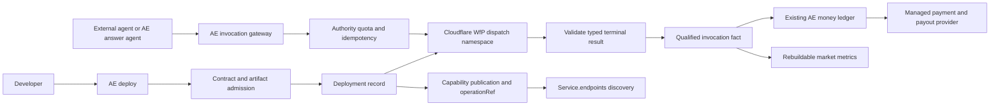

# Hosted Capability Platform Feasibility

**Date:** 2026-08-08  
**Status:** superseded architecture branch — AE-owned provider hosting rejected by founder  
**Canonical product:** Agentic Economy lets developers turn agent capabilities into discoverable, metered services that agents can buy.

## Decision reversal

AE will host the market and transaction boundary, not provider code. Suppliers host their
capabilities wherever they choose and connect an admitted HTTP, MCP or x402 operation to AE.
AE owns discovery, invocation identity, outcome evidence, qualified-use metering, payment
reconciliation and provider economics.

Cloudflare Workers for Platforms, Modal, Vercel and similar runtimes remain optional supplier
deployment targets or future deployment integrations. They are not part of AE’s required data
plane. The remainder of this document preserves the rejected hosting branch and its source audit;
it is not roadmap authority.

## Superseded hosting-branch analysis

## How far the current product actually gets

The agentic.market-shaped `Service.endpoints[]` work solves public representation and discovery. It does not solve hosting.

| Layer | Current state | Evidence | Platform gap |
|---|---|---|---|
| Public market representation | Strong foundation | `src/modules/registry/internal/service-projection.ts`; `services-api-projection.ts` | One projection bug currently labels unlinked/unpriced endpoints `executable` instead of `unpriced`. |
| Capability contracts and admission | Strong foundation | `src/modules/capability-supply/internal/publication-importers.ts`; publication draft/publish/lifecycle modules | Inputs describe already-hosted AE-envelope, OpenAPI, MCP or x402 endpoints. No code artifact admission. |
| Stable public operation identity | Shipped | `createPublicOperationRef`; capability publication/projection | No code/build/deployment digest is bound to the runtime currently serving the operation. |
| Provider self-service | Demo only | `src/components/ae/supply/AeSupplyFunnel.tsx`; `convex/capabilitySupplyOwnerFunnel.ts:246-301` | The backend hardcodes `ae-demo-services.quote`; step advancement is auth plus acknowledgement. |
| Readiness and test | External demo probe | `convex/capabilitySupplyOwnerSupply.ts` | HEAD plus a fixed quote POST; submitted selector, MCP/tool, credential and generic input configuration are not executed. |
| Keyless execution | Narrow shipped lane | `src/modules/capability-execution/operation-execute.functions.ts:7-24,80-183` | Only admitted keyless HTTP JSON GET. It calls external endpoints; it cannot dispatch tenant code. |
| Mandate-bound external execution | Substantial source foundation | `src/modules/capability-supply/route-transport-runtime.ts`; `convex/customerRequestRouteTransportWorker.ts` | No hosted deployment binding. Credential lookup is global `env:NAME`, not tenant-owned secret custody. |
| Invocation/evidence | Several useful seams | answer tool-call records, action invocation facts, route journals, evidence hashes | No single qualified-use fact binds logical invocation, attempt, `operationRef`, deployment revision, consumer class and validated terminal outcome. |
| Exact money ledger | Substantial source foundation, not live-complete | `src/modules/action-invocation/dynamic-published-adapter.ts`; `convex/moneyLedger.ts`; money schemas | Charging occurs before terminal validation; invalid evidence may remain charged; refund/unknown transitions do not reconcile usage projections. |
| x402 | Protocol and provider-call support exist | installed `@x402/*`; route transport payment observations | Provider response is provider-asserted, not authoritative settlement. Internal AE charging and provider x402 are intentionally separate rails. |
| Provider earnings/payout | Model/ports only | `src/modules/money/public.ts`; `convex/moneyLedger.ts`; `src/lib/server/money-query.ts` | Provider earnings and payout server queries are unsupported; Stripe Connect is a port, not a live transfer integration; first-dollar legal/compliance gate is open. |
| Code hosting | Absent | capability-supply schema and `package.json` | No artifact, build, deployment, workload, tenant runtime, quota or provider secret model. |

**Conclusion:** AE already has much of the market control plane. The missing part is the actual hosted data plane and the exact bridge from a deployed revision to a validated, charged invocation.

## The four products that must stay distinct

1. **External endpoint marketplace** — publish and discover an endpoint hosted elsewhere. AE is already close to this, although the owner funnel is still a demo.
2. **Managed execution gateway** — authenticate, authorize, rate-limit, invoke, validate, evidence and charge a call. AE has substantial pieces but not one production-complete seam.
3. **Serverless capability host** — rejected as an AE responsibility; suppliers may use any managed runtime.
4. **Heterogeneous runtime platform** — containers, Python, GPUs, browsers, persistent processes, arbitrary dependencies and state. This is a separate, much larger product. Defer it.

## Rejected hosted architecture



### Boundary ownership

**Cloudflare Workers for Platforms owns**

- isolation of untrusted customer Worker code;
- CPU, subrequest, memory and script limits;
- deployment API and runtime execution;
- scaling and runtime patching;
- dispatch namespace, hostname routing and TLS;
- substrate logs, tails and operational analytics;
- optional KV/D1/R2/Durable Object/Queue/Workflow bindings.

**AE owns**

- developer, Supplier and Business authorization;
- capability contract, effect and data-use admission;
- artifact/source digest and deployment readback;
- `operationRef` and current deployment binding;
- invocation identity, attempt identity and idempotency;
- agent-facing REST/MCP/tool projection;
- gateway wall-clock deadlines and streaming output caps;
- Outbound Worker egress policy;
- terminal output validation and evidence;
- Qualified Use and Settled Use policy;
- exact price, charge, refund, provider accrual and rake;
- publication, search, market metrics and anti-gaming rules.

**Payment provider owns**

- custody/top-up or x402 facilitator/chain truth;
- KYC and provider account onboarding;
- transfers/payouts;
- authoritative webhook/readback for settlement and reversals.

Provider runtime analytics are cost and operations evidence. They are never AE money truth or Qualified Use by themselves.

## Minimum developer product

The first provider journey should be deliberately narrow:

```text
login → init Worker template → declare typed contract → preview locally
→ deploy immutable bundle → AE readback → price/publish → invoke through AE
→ inspect validated uses and deployment health → deploy replacement or rollback
```

Minimum commands/surfaces:

- `ae init worker`
- `ae dev`
- `ae deploy`
- `ae publish`
- `ae logs`
- `ae versions`
- `ae rollback`
- `ae usage`

The first artifact should be a compiled Worker module plus contract/manifest, not an arbitrary Git repository. Use Cloudflare/Wrangler build tooling rather than creating an AE bundler or build farm. V1 should permit one stateless request/response handler, strict JSON input/output, bounded execution and no secrets.

The public invocation should converge on one operation endpoint, such as:

```text
POST /api/v1/operations/{operationRef}/invoke
```

REST, MCP and the AE answer agent should be projections over the same invocation kernel. They must not become three execution implementations.

## New durable concepts actually required

Avoid a parallel registry or a second ledger. Add only the missing hosting facts:

### Deployment

A durable deployment record needs, at minimum:

- `deploymentRef`
- `businessId`
- `publicationRef` / `operationRef`
- source/artifact digest
- substrate and immutable substrate deployment/script/version identifier
- runtime profile and enforced limits
- current lifecycle state
- readiness/readback evidence
- created actor/time
- superseded deployment reference

Whether a code-only revision creates a new `operationRef` or remains a new `deploymentRef` under one market operation is a product identity decision that must be settled before public metrics. Metrics must always retain the exact deployment revision even if the market view rolls revisions up.

### Qualified invocation fact

Extend the existing action/route/answer evidence seams rather than adding another invocation ledger. The canonical fact must bind:

- logical invocation and attempt references;
- `operationRef` and `deploymentRef`;
- caller/principal class and privacy-preserving consumer identity;
- production/test/owner/sandbox environment;
- start/terminal timestamps and duration;
- validated terminal disposition;
- input/output/effect evidence references;
- exact charge/settlement/reversal references.

Only a validated terminal success from one logical production invocation becomes a Qualified Use. Retries, owner traffic, tests, refusal, invalid output, failure and unknown outcomes do not.

### Secrets

V1 should have none. Later, store only opaque tenant-owned secret handles and ownership/binding metadata in Convex. Keep values in a managed secret store or substrate binding. A provider must never select a global AE environment variable by name.

## Build sequence and difficulty

### Gate 0 — make the existing execution truth safe

**Difficulty:** small implementation, high launch importance.

Before hosting:

- fix `Service.endpoints[].ae.settlementSupport` so unlinked/unpriced endpoints are `unpriced`;
- reuse the existing DNS/private-address network guard in keyless execution;
- determine read-only eligibility from admitted effect/data-use semantics, never from HTTP GET;
- stream and cancel oversized responses instead of buffering first;
- remove provider-selectable global `env:NAME` credential lookup.

### Slice 1 — free, public-data, read-only JS/TS Worker

**Difficulty:** large integration; bounded if the substrate is bought.

Acceptance:

- one authenticated developer can deploy one immutable Worker bundle;
- Cloudflare deployment ID/readback and artifact digest are persisted;
- no secrets; a configured Outbound Worker denies egress by default;
- one admitted contract maps to one `operationRef` and current deployment;
- the AE gateway enforces a wall-clock deadline and streaming output cap, while Cloudflare custom limits enforce CPU and subrequests;
- input/output are validated;
- one canonical invocation fact proves success/failure;
- the Service endpoint is discoverable and honestly marked executable;
- replacement and rollback are proven.

This is the first point at which the canonical word **hosted** is true.

### Slice 2 — paid, read-only hosted operation

**Difficulty:** large correctness and compliance integration.

Acceptance:

- reserve/authorize before execution, release provider accrual only after Qualified Use;
- invalid/refused/failed outcomes void or refund; unknown remains held for reconciliation;
- usage projections rebuild from reconciled facts;
- one exact payment rail is selected and proven end to end;
- authoritative settlement readback exists;
- provider identity/KYC, payout and reversal paths are live;
- price, charge, provider net and platform rake reconcile exactly.

This is the first point at which **metered business** is economically real.

### Slice 3 — public market competition

**Difficulty:** medium-to-large data-policy work.

Only after canonical invocation facts exist:

- successful uses;
- distinct consumers;
- reliability with disclosed denominator;
- latency windows;
- settled volume;
- growth and voluntary saves.

No universal score. Exclude self/test/retries/refunds/invalid/unknown traffic. Keep search/ranking non-authoritative for consequential execution.

### Slice 4 — credentialed and effectful operations

**Difficulty:** large safety integration.

Requires opaque tenant secret handles, per-operation egress policy, existing RouteMandate authority, exact effect evidence, cancellation/reconciliation and no automatic retry after possible side effects.

### Slice 5 — additional runtimes

**Difficulty:** very large; defer until actual demand.

Add substrate adapters rather than generalizing the first host:

- Modal for Python/GPU/ephemeral arbitrary-code work;
- AWS Lambda tenant isolation for broader managed runtimes;
- Browserbase/E2B only for browser/sandbox capability classes;
- provider-hosted endpoints remain a separate evidence tier.

## Reuse and no-handrolling decision

Reuse current AE:

- Convex as authoritative control plane;
- existing capability contract/import/admission/publication/lifecycle;
- existing Service and operation projections;
- existing action registry, RouteMandate and execution evidence;
- `@convex-dev/workflow`, `workpool`, `rate-limiter` and `aggregate` for control-plane work and rebuildable views;
- existing exact money ledger and `@x402/*` protocol libraries;
- existing `undici` network guard pattern;
- Clerk business ownership.

Buy:

- Cloudflare Workers for Platforms for JS/TS hosting;
- managed secret custody;
- Stripe Connect or an authoritative x402 settlement/facilitator path for real transfers and KYC;
- later specialist substrates for non-Worker runtimes.

Do not build:

- a scheduler or autoscaler;
- a container orchestrator;
- a sandbox/isolate runtime;
- a package builder;
- a generic secret vault;
- a second gateway or invocation ledger;
- a second billing ledger;
- a universal ranking/recommender system.

## Alternatives

### Cloudflare Workers for Platforms — recommended first substrate

Best fit for the explicit platform use case: customer/AI code in isolated Workers, dynamic dispatch, per-invocation limits, custom routing and namespace observability. Official pricing currently documents a $25/month paid plan with 20 million requests, 60 million CPU-ms and 1,000 scripts included, then published request/CPU/script overages. Those figures are substrate cost inputs, not AE customer pricing.

### Vercel Multi-Project — viable but not preferred

Strong developer deployment and per-project isolation/history. It is shaped around one project per tenant rather than a dispatch fabric for many narrow untrusted operations. AE would still own the operation gateway, metering and settlement.

### AWS Lambda tenant isolation — credible later adapter

Strong Firecracker isolation and broader runtimes, but adds IAM, API Gateway, Secrets Manager, CloudWatch and greater provisioning/control-plane complexity. Tenant isolation also has documented feature restrictions.

### Modal — later specialist adapter

Good for Python, GPU and arbitrary sandbox work. It is not the smallest stable hosted-operation substrate: sandbox lifecycle, routing and build/deployment orchestration would create more AE-owned machinery.

## Hard truth

The DTO mirror is useful, but it is the easy visible edge. The real platform is the chain:

```text
artifact → isolated deployment → admitted operation → authorized invocation
→ validated terminal evidence → qualified use → exact charge → provider payout
```

AE has meaningful foundations from **admitted operation** onward. It does not yet have the artifact/deployment boundary, canonical qualified-use event, or production settlement/payout proof. Buying the runtime makes this a tractable platform integration rather than a cloud-infrastructure project.

## Primary sources

### Current repository

- `.planning/PROJECT.md`
- `src/modules/registry/internal/service-projection.ts`
- `src/modules/registry/internal/services-api-projection.ts`
- `src/modules/capability-supply/internal/publication-importers.ts`
- `src/modules/capability-supply/internal/publication/{draft,publish,refresh,withdraw,lifecycle}.ts`
- `src/modules/capability-supply/internal/convex-schema.ts`
- `src/modules/capability-execution/operation-execute.functions.ts`
- `src/modules/capability-supply/route-transport-runtime.ts`
- `src/modules/action-invocation/dynamic-published-adapter.ts`
- `convex/capabilitySupplyOwnerFunnel.ts`
- `convex/capabilitySupplyOwnerSupply.ts`
- `convex/customerRequestRouteTransportWorker.ts`
- `convex/moneyLedger.ts`
- `src/modules/money/internal/live-money-gate.ts`
- `src/lib/server/money-query.ts`
- `package.json`

### Platform documentation

- [Cloudflare Workers for Platforms architecture](https://developers.cloudflare.com/cloudflare-for-platforms/workers-for-platforms/how-workers-for-platforms-works/)
- [Cloudflare Workers for Platforms isolation](https://developers.cloudflare.com/cloudflare-for-platforms/workers-for-platforms/reference/worker-isolation/)
- [Cloudflare dispatch namespace upload API](https://developers.cloudflare.com/api/resources/workers_for_platforms/subresources/dispatch/subresources/namespaces/subresources/scripts/methods/update/)
- [Cloudflare custom limits](https://developers.cloudflare.com/cloudflare-for-platforms/workers-for-platforms/configuration/custom-limits/)
- [Cloudflare hostname routing](https://developers.cloudflare.com/cloudflare-for-platforms/workers-for-platforms/configuration/hostname-routing/)
- [Cloudflare observability](https://developers.cloudflare.com/cloudflare-for-platforms/workers-for-platforms/configuration/observability/)
- [Cloudflare Workers for Platforms pricing](https://developers.cloudflare.com/cloudflare-for-platforms/workers-for-platforms/reference/pricing/)
- [AWS Lambda tenant isolation](https://docs.aws.amazon.com/lambda/latest/dg/tenant-isolation.html)
- [Vercel multi-project platforms](https://vercel.com/docs/platforms/multi-project-platforms/concepts)
- [Modal Sandboxes](https://modal.com/docs/guide/sandboxes)
- [Apify Actor deployment](https://docs.apify.com/actors/development/deployment)
- [Apify pay-per-event monetization](https://docs.apify.com/actors/publishing/monetize/pay-per-event)
