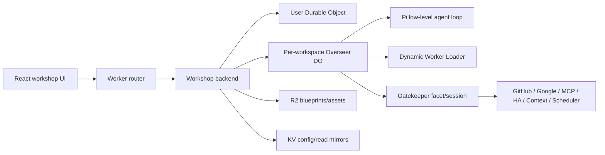
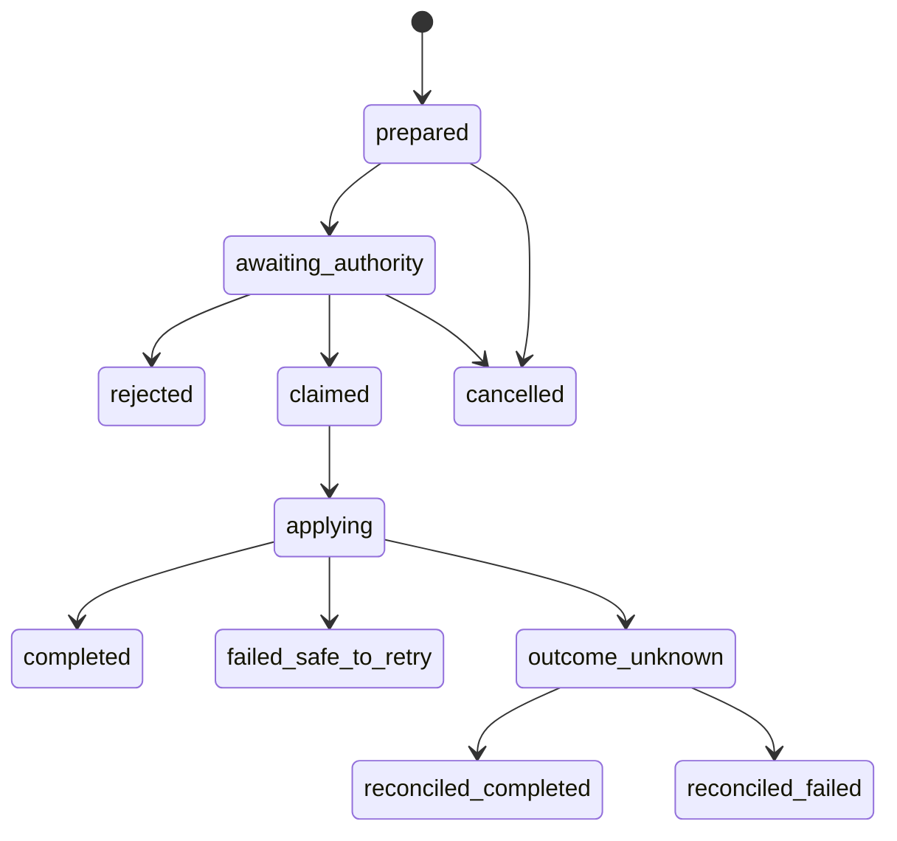

# Cloudflare OS → Agentic Economy Production-Readiness Extraction

**Date:** 2026-08-09  
**Status:** source-implemented and locally certified; hosted release evidence remains blocked  
**Donor:** [`cloudflare/cloudflare-os`](https://github.com/cloudflare/cloudflare-os) at [`1cb5e3d9096589e38f3fcfaf3f2191aa95a4c592`](https://github.com/cloudflare/cloudflare-os/tree/1cb5e3d9096589e38f3fcfaf3f2191aa95a4c592)  
**Dissection workspace:** `/tmp/cloudflare-os.1eg46c/`  
**Generated donor map commit:** `19f1522` in the temporary checkout; seven documents, 916 lines  
**Specialist audits:** `analysis/chat-recovery.md`, `analysis/plugins-gatekeepers.md`, `analysis/errors-settings-base.md`, `analysis/pi-integrations.md`; 591 lines total

This is an extraction document, not a recommendation to port Cloudflare OS wholesale. Cloudflare OS is an early-access, Cloudflare-native AI workspace. Agentic Economy (AE) is a deterministic capability market and execution kernel on Convex. The useful transfer is a set of invariants around durability, authority, external effects, recovery, configuration, and operations—not its Durable Object topology, Cap'n Web RPC, Dynamic Workers, Gadget/Yjs model, or product vocabulary.

## 1. Decision in one page

### 1.1 Executive verdict

**[DESIGN DECISION] Do not replace AE's runtime with Cloudflare OS or Pi.** Keep AI SDK/OpenRouter isolated behind AE's existing model seam. Cloudflare OS itself uses only Pi's low-level provider/event loop and retains host ownership of persistence, approval, tools, budgets, compaction, secrets, and recovery. The mature pattern is host ownership—not the framework brand.

**[DESIGN DECISION] Do not create a second “plugin” registry.** Extend AE's existing capability-supply, action-invocation, registry, and evidence seams with provider connections and narrow execution sessions. Cloudflare's Gatekeepers validate the same architectural direction: provider credentials stay outside general agent context; the host owns policy; each invocation receives bounded authority.

**[OBSERVED FACT] AE already exceeds the donor's chat/error baseline in several important areas.** AE has durable turn reservations, server-allocated turn sequences, request-digest idempotency, explicit `pending | complete | stopped | error`, HMAC share tokens, reservation-only projections, ordered SSE frame validation, durable readback, and RFC 9457 problems (`convex/answerThreads.ts`; `src/modules/answer-thread/internal/convex-schema.ts`; `src/modules/answer/answer-ui-stream.ts`; `src/lib/errors.ts`; `src/lib/server/problem.ts`). Cloudflare OS lacks first-class durable cancellation, per-run stale-completion fencing, per-event durable stream identity, and a general typed HTTP problem boundary.

**[DESIGN DECISION] The highest-value net-new work is not a chat rewrite.** It is:

1. durable-before-I/O external-effect claims with an explicit `outcome_unknown` terminal/recovery state;
2. provider-owned credential connections and narrow per-resource/per-operation sessions;
3. an ordered approval/commit chokepoint with resolver metadata and durable revocation;
4. durable intermediate model/tool-step checkpoints before another model request;
5. a bounded, optional browser/server error-reporting path plus explicit health/readiness;
6. closed deployment manifest/config validation and secret-free boot capability projection;
7. real provider conformance and recovery test packs.

### 1.2 Adopt / adapt / reject summary

| Donor pattern | AE decision | Reason |
|---|---|---|
| Durable request/run record before inference | **Already present; preserve** | AE turn reservations bind session, scope, request digest, thread, turn, and sequence before work. |
| Awaited persistence barrier before the next model request | **Adopt** | AE's multi-call tool path can execute a capability and make a second prose request before the whole turn is durable. |
| Recorded tool-result replay rather than re-execution | **Adopt for multi-step runs** | Required before consequential tools or paid operations enter answer loops. |
| Server-only provider/model snapshot | **Adapt narrowly** | Preserve opaque provider signatures/response IDs only when replay requires them; never expose them as public evidence. |
| Ephemeral stream separate from durable projection | **Already present; preserve** | AE validates frame order and converges onto Convex readback. |
| Durable cancellation and stale-run fencing | **AE is stronger; preserve** | Cloudflare Stop is an in-memory abort projected as generic error; AE has durable `stopped`. |
| Provider-owned credential custody | **Adopt** | Credentials must not enter agent prompts, generic action input, registry DTOs, or browser state. |
| Per-resource facet/session introduction | **Adapt to operation-scoped execution grants** | Matches AE's `operationRef`, authority, attempt, and material-input identity. |
| Read authorization vs staged write approval | **Adopt** | Discovery/read safety and external mutation authority are different policy classes. |
| Durable-before-I/O action claim | **Adopt first** | Prevents blind duplicate writes after crashes or ambiguous network failures. |
| Explicit `outcome_unknown`, non-retryable by default | **Adopt** | Honest external-effect recovery is stronger than optimistic retries. |
| Read-time simulation overlay | **Adapt selectively** | Only for providers with deterministic projections; otherwise show pending/unknown. |
| Permanent revocation marker and resumable cleanup | **Adopt** | Local deletion alone cannot prove remote credential/effect cleanup. |
| Gatekeeper package/service-binding discovery | **Reject transport; adapt metadata** | Keep typed vendor/resource availability, but no Wrangler or Dynamic Worker assumptions in Convex. |
| Pi stateful Agent | **Reject** | Cloudflare does not use it; AE must keep deterministic ownership. |
| Pi low-level event loop/provider adapters | **Study, do not migrate now** | Useful mechanics, but no demonstrated benefit that justifies replacing current AI SDK integrations. |
| Plain RPC/message-string errors | **Reject** | AE's RFC 9457 model is stronger. |
| Bounded fail-open diagnostics | **Adopt** | Safe only because diagnostics are non-authoritative. |
| Durable product settings + secret-free boot config | **Adopt** | AE's current settings surface is mostly owner preferences, not platform operational config. |
| Singleton settings plus KV mirror | **Reject mirror; preserve invariant** | Convex transactions are already the authoritative read/write substrate; do not add dual truth. |
| Closed release manifest | **Adopt** | Unknown deployable keys/bindings must fail closed. |
| SPA fallback as health check | **Reject** | Add explicit deterministic health/readiness. |
| Cloudflare DO/RPC/Dynamic Worker topology | **Reject** | Runtime-specific mechanics do not carry portable authority or durability proof. |

## 2. Evidence method and ceilings

Eight parallel parent crawlers, with additional nested scouts, mapped the donor through the following lenses:

- technology and integrations;
- architecture and physical structure;
- conventions and testing;
- concerns, security, scaling, and missing features;
- chat lifecycle and crash/reconnect recovery;
- Gatekeepers, plugins, approvals, and revocation;
- errors, settings, identity, sharing, diagnostics, and release controls;
- Pi provider/model routing, tool loop, compaction, persistence, and callbacks.

The temporary checkout contains:

- `.planning/codebase/{STACK,INTEGRATIONS,ARCHITECTURE,STRUCTURE,CONVENTIONS,TESTING,CONCERNS}.md`;
- `analysis/{chat-recovery,plugins-gatekeepers,errors-settings-base,pi-integrations}.md`.

**[EVIDENCE CEILING]** This was a source-and-test audit. No donor deployment, build, browser smoke, provider OAuth flow, or real Pi/DO restart scenario was executed. Repository tests establish many pure seams, but the checkout does not contain one end-to-end suite covering Pi events, tool side effects, browser subscription, Stop races, provider failure, and DO restart together.

**[OBSERVED FACT]** The donor README calls the release early access and acknowledges rough edges ([README](https://github.com/cloudflare/cloudflare-os/blob/1cb5e3d9096589e38f3fcfaf3f2191aa95a4c592/README.md)). “Cloudflare released it” is therefore not production-readiness evidence by itself.

## 3. Cloudflare OS platform anatomy

### 3.1 What Pi owns

At donor revision `1cb5e3d`, packages `@earendil-works/pi-agent-core` and `@earendil-works/pi-ai` are pinned to `0.83.0` (`packages/workshop-backend/package.json`). Cloudflare imports provider APIs, model/message types, `runAgentLoopContinue`, compaction helpers, and PDF/model transformation support.

Pi owns:

- provider wire formats and streaming;
- provider-native message conversion;
- tool-call parsing and low-level sequential execution;
- model stop reasons and usage fields.

### 3.2 What Cloudflare deliberately keeps

Cloudflare owns:

- prompt assembly and static-prefix policy;
- model route/auth precedence: user BYOK, platform gateway, direct provider;
- provider credentials and request attribution;
- durable chat and server-only model snapshots;
- Gatekeeper discovery, observations, approval, commit/reject/revert;
- tool and turn budgets;
- Yjs/workspace state;
- compaction thresholds/checkpoints;
- cancellation input, loop stop predicate, error projection, and restart;
- cost projection and UI accounting.

Cloudflare calls low-level `runAgentLoopContinue`; it does not delegate durable state to Pi's stateful `Agent`. This is the strongest harness lesson for AE.

### 3.3 Gatekeeper model

A Gatekeeper is not merely a plugin package. The mature flow is:

1. a vendor advertises supported resource URL patterns and a typed API/catalog;
2. a user establishes a provider account; provider code owns the credential;
3. the host binds a specific resource/facet to a workspace or caller;
4. each session receives explicit caller identity plus narrow approval/observation capabilities;
5. reads authorize observations before returning data;
6. writes stage provider-local state and submit a host-owned approval record;
7. commit/reject/revert happens through one authority boundary;
8. action application persists a claim before remote I/O;
9. ambiguous outcomes are not blindly retried;
10. revocation gates future work while cleanup proceeds.

This is portable. Wrangler service bindings, Cap'n Web stubs, Durable Object classes, Dynamic Worker loader APIs, and generated configurator iframes are not.

## 4. Current AE baseline: do not rebuild what already exists

### 4.1 Chat and recovery

**[OBSERVED FACT]** AE's current chat lifecycle already implements the donor's most important transcript invariants:

- `answerTurnReservations` stores `reservationKey`, session, requested scope, request digest, thread/turn IDs, and sequence, with indexes by reservation, turn, and thread sequence (`src/modules/answer-thread/internal/convex-schema.ts`).
- Reservation replay distinguishes `reserved`, `answer_persisted`, `finalized`, and `stopped`; public projection exposes reservation-only pending/stopped rows without manufacturing content (`convex/answerThreads.ts`; `src/modules/answer-thread/internal/public-projection.ts`).
- `AnswerTurnStatus` is `pending | complete | stopped | error`, unlike Cloudflare's generic error-only cancellation (`src/modules/answer-thread/answer-thread.schema.ts`).
- SSE uses `AnswerTurnFrame { seq, event }`; the parser requires contiguous zero-based order and rejects frames after terminal events (`src/modules/answer/answer-ui-stream.ts`).
- The browser reducer rejects duplicate/older frames, then converges to durable thread readback (`src/components/ae/chat/answer-turn-state.ts`; `thread-readback.ts`).
- Share tokens are HMAC-bound, constant-time verified, generation/revocation aware, and separate from owner readback (`src/modules/answer-thread/internal/share-token.ts`).

**[DESIGN DECISION]** Do not port `ChatInterface.tsx`, Cloudflare's timestamp catch-up, in-memory-only Stop, or generic error row. AE already has the stronger architecture.

### 4.2 Error boundary

**[OBSERVED FACT]** AE has a canonical shared error model in `src/lib/errors.ts`, an HTTP Problem Details builder in `src/lib/server/problem.ts`, method guards in `src/lib/server/method-guard.ts`, and CLI mapping in `tools/ae/lib/output.ts`. Expected non-2xx routes use RFC 9457 plus stable `google.rpc.Code`-aligned kinds. Answer SSE and HTTP-200 domain outcomes are intentionally separate contracts.

**[DESIGN DECISION]** Do not import Cloudflare's plain-text RPC errors, message substring classification, or raw provider error persistence. Extract only the bounded reporter envelope, redaction discipline, and stable provider-failure translation seam.

### 4.3 Capability and action authority

**[OBSERVED FACT]** AE's `src/modules/common/action.ts` already distinguishes reads from admission-gated writes and declares consequence class, material inputs, authority requirement, spend exposure, approval policy, and retry class. Capability supply already owns provenance, admission, conformance, readiness, lifecycle, operation identity, and execution descriptors. Action invocation already models prepared authority, attempts, leases, idempotency, cancellation, payment/provider effects, receipts, and `outcome_unknown` in the customer-request route journal.

**[DESIGN DECISION]** Gatekeeper concepts must deepen these seams. They must not create `Plugin`, `Gatekeeper`, `WorkspaceBinding`, or a parallel action queue as a second domain model.

### 4.4 Settings and operations

**[OBSERVED FACT]** Current AE settings are principally owner notification/account/business preferences (`convex/settings.ts`; `src/modules/settings`; `src/routes/_operator/owner.settings.tsx`). Deployment variables and Vite/Convex configuration are spread across runtime configuration rather than projected through one secret-free platform capability/status contract.

**[INFERENCE]** AE has room to adopt Cloudflare's separation between immutable deployment/security config and durable product settings, but the Cloudflare KV mirror should not be copied because Convex can remain the one authoritative transactional store.

## 5. Extraction by platform area

### 5.1 Chat and recovery

#### Preserve now

1. Durable reservation before work.
2. Server-owned thread/turn sequence.
3. Request-digest idempotency.
4. Explicit terminal `stopped` distinct from error.
5. Frame sequence validation plus durable readback.
6. Private owner projection plus revocable share-token projection.

#### Add

1. **Durable intermediate-step journal.** In `runRealToolUseAgent`, a selected capability call can finish and then feed a second `generateText` prose call (`src/modules/answer/internal/answer-tool-use-agent.ts:414-449`). Today the turn is persisted as a whole after orchestration. Persist the completed model request, tool result/evidence, next-step cursor, and provider replay material before the next model request. On recovery, reuse recorded tool results; never reissue a consequential or paid operation merely to reconstruct prompt context.
2. **Step identity and stale-completion fencing.** Bind each intermediate write to reservation, turn, run/attempt, and step ordinal. A stale provider completion must fail compare-and-set rather than overwrite a stopped/restarted run.
3. **Provider replay snapshot policy.** Store only provider fields needed for replay—model/API, response ID, reasoning signature when required, stop reason, usage, and normalized message parts. Keep it server-only, versioned, integrity-bound to the display/tool records, and retention-limited.
4. **Crash matrix.** Exercise crash/abort immediately before claim, after claim, after tool I/O, after evidence persistence, before prose call, after prose call, and during terminal finalization.

#### Do not add yet

- generic long-lived agent threads detached from AE Plan Contracts;
- Pi steering/follow-up queues;
- Yjs/gadget change records;
- timestamp-only reconnect cursors;
- partial assistant prose as durable truth after a failed provider call.

### 5.2 Plugins, provider connections, and integrations

#### Add to existing capability supply

1. **Provider connection record.** Canonical provider/account identity, credential reference only, normalized granted scopes/resources, status, created/updated/revoked timestamps, failure code, and evidence refs. Never store secret material in public capability rows.
2. **Operation-scoped session/grant.** Mint at execution time from current connection + publication + operation + actor + purpose + material-input digest. Recheck current lifecycle, scope, readiness, authority, and revocation at use—not only when the connection was created.
3. **OAuth state custody.** Two-stage expiring state/nonce, constant-time comparison, one-time redemption, callback-to-account binding, and explicit timeout/replay/refusal results.
4. **Discovery partial failure.** One broken provider description/catalog must become typed `unavailable` evidence; it must not crash the whole registry/discovery response.
5. **Catalog truncation honesty.** If an MCP/provider catalog is truncated, an omitted operation is unavailable—not silently broadened. Upstream issue [#91](https://github.com/cloudflare/cloudflare-os/issues/91) demonstrates why a fixed first-N tool view is a real usability and authority defect.
6. **Current-scope comparison.** Normalize full operation/resource identity and compare it at invocation. Unknown fields, tools, resources, or incomplete catalogs fail closed.
7. **Monotonic scope expansion.** Reauthorization requests the union of current and requested scope, then records what the provider actually granted. Never silently drop an existing grant or claim a requested scope was granted.
8. **Durable revocation.** Revocation is a permanent execution gate with explicit cleanup status. Remote provider revoke and local record removal are separate outcomes. Upstream [#41](https://github.com/cloudflare/cloudflare-os/issues/41) shows the danger of deleting the only local refresh token after remote revocation fails; [#10](https://github.com/cloudflare/cloudflare-os/issues/10) shows reconnect that does not replace stale credential authority.

#### Provider adapter contract

A provider adapter should receive only narrow host capabilities:

- `readCredential(connectionRef)` inside server custody;
- `authorizeObservation(observationDescriptor)`;
- `submitPreparedAction(actionDescriptor, materialDigest)`;
- `claimExternalEffect(attemptRef, idempotencyKey)`;
- `recordExternalOutcome(outcome, evidence)`;
- `markCredentialState(valid | expired | revoked | unavailable)`.

It must not receive Convex internals, arbitrary registry mutation, payment authority, owner session tokens, or a generic “approve” boolean.

### 5.3 External effects, approval, and recovery

This is the most important donor extraction.

#### Required state machine

#### Invariants

1. Persist `claimed/applying` before provider I/O.
2. Claim identity includes operation, contract revision, material-input digest, actor/authority generation, and attempt/idempotency key.
3. Approval records resolver identity, authority source, policy (`manual`, `mandate`, or explicit system rule), decision time, and exact prepared version.
4. Later auto-approved work cannot leapfrog a manual gate or earlier apply failure.
5. Queue submission failure removes/invalidates provider-local staged state.
6. Ambiguous network/provider outcome becomes `outcome_unknown`; default retry is prohibited.
7. Recovery reconciles via provider idempotency/status/receipt support. Absence of such support remains unknown.
8. Provider-side “accepted” and HTTP 2xx are not AE settlement or fulfilment proof.
9. Cancellation after a claim is not represented as “nothing happened.” It must preserve possible external effect.
10. Revocation blocks new claims but does not fabricate cleanup of already-applied work.

**[OBSERVED FACT]** AE already has pieces of this vocabulary in action invocation and customer-request route execution. The implementation task is to converge provider-backed operation execution on that one state machine, not invent another ledger.

### 5.4 Errors and diagnostics

#### Preserve

- RFC 9457 for non-2xx HTTP boundaries;
- stable codes/kinds independent of user prose;
- typed Answer SSE problems;
- CLI error projection and redaction;
- HTTP-200 domain outcomes as domain data.

#### Add

1. **Browser error intake.** Same-origin POST only; strict content type; bounded body; versioned schema; safe URL/frame metadata; occurrence count; stack/message caps; secret-like-field rejection; rate key derived from verified subject or privacy-preserving IP hash.
2. **Client dedupe/throttle.** Fingerprint by surface + normalized error; cap repeated reports; trust only same-origin or explicitly trusted opaque frames.
3. **Fail-open reporter dispatch.** Missing reporter, limiter failure, and reporter transport failure must never fail a user request. Dispatch asynchronously. This exception applies only to diagnostics—not authority, payment, admission, or evidence.
4. **Provider error translation.** One translation boundary from SDK/provider error data into AE's canonical internal failure. Persist redacted user detail plus bounded incident metadata; never raw provider bodies or secret-bearing headers.
5. **Explicit `/health` and `/ready`.** `health` proves process/router liveness without private data. `ready` checks essential configured dependencies with tight budgets and returns machine-readable component status. Neither may fall through to HTML.
6. **Operational correlation.** Carry request, session/owner pseudonym, thread/turn/reservation, operation, invocation/attempt, provider route, model request, and evidence refs without logging payloads or secrets.

### 5.5 Settings, identity, and base functionality

#### Configuration layers

| Layer | Examples | Authority | UI exposure |
|---|---|---|---|
| Deployment/security | auth mode, secret refs, provider endpoints, key IDs, allowlists, environment, hard budgets | deployment only | capability/status projection; never values |
| Product/platform | sign-up availability, notices, supported providers/models, curation, rollout policy | durable admin settings with live recheck | admin UI where safe |
| Tenant/owner | notification preferences, business profile, connected providers, allowed scopes | owner-authorized durable state | owner UI |
| Request/run | model selection, operation grant, budget, evidence requirements | deterministic kernel | per-run projection |

#### Rules

1. No admin UI mutation of deployment secrets or core auth policy.
2. Public boot config reports capabilities (`enabled`, `unavailable`, reason code) without secret names/values beyond approved diagnostics.
3. Product settings writes are authoritative before any cache/projection update.
4. With Convex, prefer direct indexed reads or a rebuildable projection. Do not copy Cloudflare's DO+KV dual-writer mirror.
5. Missing/malformed authoritative security config fails closed. Cloudflare's permissive-default mirror gap is explicitly a donor concern, not a pattern.
6. Auth toggles must be lockout-safe: disabling one method cannot remove the final administrator recovery path.
7. Long-lived capabilities must recheck current authority/revocation. Do not copy Cloudflare's one-time admin capability mint.
8. Session lifecycle requires expiry, logout revocation, rotation, password/auth-change invalidation where applicable, listing, and operator revocation. Do not copy indefinite token-presence checks.

### 5.6 Release and deployment controls

1. **Closed manifest schema.** Reject unknown resources, bindings, migrations, and deployable config.
2. **Content-addressed artifacts.** Hash build products; verify bytes again at upload; publish the manifest last.
3. **Promotion serialization.** Make promotion atomic or lease-guarded. Do not rely on external CI serialization alone; the donor explicitly documents a check-then-act race.
4. **Migration inventory.** Every durable schema/resource migration is declared, ordered, and validated before promotion.
5. **No secret echo.** Diagnostics and release tooling show names/status only.
6. **Readiness before traffic.** Promotion must prove route health, Convex reachability, required schema/version, model/provider configuration status, and rollback identity.
7. **One release acceptance suite.** Compile/type/lint/unit gates are necessary but insufficient; add a small end-to-end matrix for auth, answer, share/revoke, external-effect claim/recovery, and provider connection revocation.

### 5.7 Scheduling and callbacks

Cloudflare's Scheduler has worthwhile mechanics: durable active/retrying/pending state, alarms, bounded batches/concurrency, explicit retry windows, dead-letter state, and cleanup after revocation. AE should adopt these only through Convex schedules/workflows with the same action-invocation identity.

Required policy before exposing schedules:

- declare at-most-once vs at-least-once behavior;
- durable occurrence identity and idempotency key;
- missed-occurrence policy (`skip`, `coalesce`, or bounded catch-up`);
- attempt count and next-attempt time;
- dead-letter reason/evidence;
- revocation check before every delivery;
- no callback stub or runtime object as durable identity.

## 6. Pi harness decision

### 6.1 What is genuinely good

- low-level awaited event loop keeps the host in charge;
- native provider APIs preserve provider-specific reasoning/cache behavior;
- model handle closes over endpoint, auth, attribution, session affinity, and response metadata;
- tools use typed schemas and sequential execution;
- provider error/abort arrives as data and is translated once;
- completed assistant/model data can be stored server-side and replayed;
- model/tool steps have explicit stop predicates and hard turn caps.

### 6.2 Why AE should not migrate now

1. **No missing capability has been proven.** AE already uses AI SDK structured output/tool calling and explicitly serializes tool execution in `answer-tool-use-agent.ts`.
2. **Cloudflare is not using Pi as its durable agent platform.** It wraps only the low-level loop and retains almost all important semantics.
3. **Version/fork risk.** Cloudflare pins `@earendil-works/*` `0.83.0`; the separately inspected `badlogic/pi-mono` donor was `0.84.1`. Behavior from the later donor cannot prove Cloudflare's forked runtime.
4. **Migration would duplicate provider abstractions.** AE already has OpenRouter/AI SDK request accounting, tool schemas, SSE, deterministic action gates, and tests.
5. **The strongest patterns are framework-neutral.** Awaited persistence, provider handles, explicit stop gates, replay snapshots, and error translation can be implemented without replacing the model SDK.
6. **Cloudflare's own evidence is incomplete.** No direct full-loop restart/provider/side-effect integration test was found.

### 6.3 When to reconsider Pi

Run a contained parity spike only if AE needs at least one of:

- provider-native opaque reasoning signatures that AI SDK cannot replay safely;
- cross-model replay conversion with demonstrated fidelity;
- a low-level event sink that AI SDK cannot make awaitable at the needed durability boundary;
- a provider adapter or compaction behavior with measurable reliability/cost benefit.

The spike must compare identical fixtures, provider requests, tool-call ordering, abort behavior, usage/cost fields, stream events, and persisted replay. No production cutover without parity.

## 7. Ranked implementation roadmap

### P0 — external-effect correctness

#### W1. Converge provider execution on durable claim/outcome semantics

**Target seams:** `src/modules/action-invocation`, `src/modules/capability-execution`, customer-request route execution journal, Convex persistence ports.

**Deliverable:** one source-owned operation attempt lifecycle with prepared version, authority generation, effect claim, applying, completed, retryable failure, and `outcome_unknown`.

**Acceptance:** crash/retry probes prove no duplicate payment/provider effect; ambiguous transport never auto-retries; reconciliation can move unknown to terminal only with provider/receipt evidence.

#### W2. Provider connection and operation-scoped grant

**Target seams:** `src/modules/capability-supply`, `convex/capabilitySupply*`, owner/provider UI and server routes.

**Deliverable:** provider-owned credential reference, normalized granted scopes/resources, current connection state, operation-scoped grant minted at invocation, durable revoke/cleanup state.

**Acceptance:** expired/revoked connection blocks a previously opened invocation; reauthorization replaces stale credential authority; remote revoke failure remains visible/retryable without deleting the only credential needed for retry.

#### W3. Approval/commit chokepoint

**Target seams:** `src/modules/common/action.ts`, `src/modules/action-invocation`, operator/owner decision surfaces.

**Deliverable:** all consequential provider actions enter one ordered decision/commit path with resolver metadata; no provider adapter applies directly.

**Acceptance:** later auto-approved work cannot pass an earlier manual gate/failure; stale prepared version and stale authority generation are refused.

### P1 — durable agent loop and recovery

#### W4. Intermediate answer-step journal

**Target seam:** `src/modules/answer/internal/answer-tool-use-agent.ts` plus answer-thread/harness persistence.

**Deliverable:** durable model request + tool result/evidence checkpoint before any next model request, with recovery cursor and server-only replay material.

**Acceptance:** kill after capability success/before prose; resume produces prose from recorded result with zero second provider/tool effect. Stop/restart rejects stale completion.

#### W5. Provider/model route handle

**Target seams:** current OpenRouter/model configuration and answer request accounting.

**Deliverable:** one handle closes over model route, credential custody, attribution, abort, response ID/status, usage, and redaction; tools never access credentials.

**Acceptance:** BYOK/platform/direct precedence is explicit and tested; provider failures map once into canonical AE failure data; no raw provider error reaches durable public history.

#### W6. Recovery certification matrix

**Deliverable:** deterministic integration scenarios across reservation, claim, tool result, model continuation, Stop, finalization, share readback, and cold reconstruction.

**Acceptance:** each crash point has a named expected state and effect count; projections converge after retry/reload; no test asserts source text or mocked tautology.

### P1 — operations and configuration

#### W7. Bounded diagnostics and explicit readiness

**Target seams:** server routes, browser root error boundary, observability module.

**Deliverable:** strict client error intake, fail-open optional reporter, stable correlation fields, `/health`, `/ready`.

**Acceptance:** hostile/oversized/cross-origin reports are rejected; reporter outage cannot break product requests; readiness returns JSON/problem, never SPA HTML; no secrets/payloads are logged.

#### W8. Closed deployment manifest and config projection

**Target seams:** deployment/build scripts, environment readers, admin settings.

**Deliverable:** closed schema covering bindings/resources/migrations, secret-free runtime capability projection, explicit deployment-vs-product-vs-owner settings boundary.

**Acceptance:** unknown config fails before deploy; missing security config fails closed; UI can explain disabled/unavailable capability without receiving secret values.

### P2 — provider usability and advanced policy

#### W9. Provider conformance packs

For each adapter: discovery, OAuth/state replay, scope expansion, expiry, revocation, catalog truncation, observation authorization, write claim, safe retry, outcome unknown, reconciliation, and cleanup.

#### W10. Deterministic pending-state simulation

Implement only for operations with a complete provider-specific projection. Otherwise expose `awaiting_authority`/`applying`/`outcome_unknown` honestly.

#### W11. Durable scheduling

Add only after W1-W3. Reuse invocation identity, claim, revocation, retry, and evidence; do not create a scheduler-only effect model.

### Deferred / rejected

- Pi migration;
- Cloudflare Dynamic Workers or Cap'n Web;
- generic Gatekeeper/plugin marketplace;
- blueprint/gadget/Yjs architecture;
- iframe configurator runtime;
- generic MCP trust based solely on self-declared `readOnlyHint`;
- provider-specific simulation as a platform default;
- automatic retries after ambiguous external writes;
- dual-writer settings mirrors;
- async gateway cost estimates as billing truth.

## 8. Adversarial lessons from upstream issues

These issues are not architectural proof, but they reveal failure modes that acceptance tests should reproduce before AE adopts analogous functionality:

| Issue | Lesson for AE |
|---|---|
| [#97 — image sent to unsupported model permanently locks chat](https://github.com/cloudflare/cloudflare-os/issues/97) | Attachment/model compatibility must be checked before durable admission; Retry must be able to alter/remove offending input rather than replay it forever. |
| [#91 — MCP Gatekeeper sees only first 60 tools](https://github.com/cloudflare/cloudflare-os/issues/91) | Truncated catalogs must be explicit and searchable/paged; absence from a truncated prompt is not absence from the provider. |
| [#41 — disconnect can leave refresh token live](https://github.com/cloudflare/cloudflare-os/issues/41) | Remote revocation and local deletion are separate; retain recoverable cleanup custody until outcome is known. |
| [#42 — approval descriptions skip sanitizers](https://github.com/cloudflare/cloudflare-os/issues/42) | Every approval surface must render only through one sanitizer/formatter; annotations and markdown cannot bypass it. |
| [#54 — provider message-shape incompatibility](https://github.com/cloudflare/cloudflare-os/issues/54) | “OpenAI-compatible” is not a sufficient model contract; conformance-test multi-turn tool messages per provider/route. |
| [#86 — local port configuration only half-applies](https://github.com/cloudflare/cloudflare-os/issues/86) | Derived endpoints and callback URLs must come from one validated configuration source; no duplicated defaults. |
| [#10 — reauthorization does not recover stale credential](https://github.com/cloudflare/cloudflare-os/issues/10) | Reconnect must atomically replace credential authority and invalidate stale sessions/grants. |
| [#96 — no Gatekeeper deletion path](https://github.com/cloudflare/cloudflare-os/issues/96) | Provider lifecycle needs disable, revoke, cleanup, remove, and audit states before installation is exposed. |
| [#88 — sign-out issues](https://github.com/cloudflare/cloudflare-os/issues/88) | Browser logout is not session revocation; production session lifecycle is server-owned. |
| [#78 — pluggable agent runtime request](https://github.com/cloudflare/cloudflare-os/issues/78) | Runtime pluggability is demand, not proof it belongs in AE now. Add an interface only after two production-backed implementations require it. |

## 9. Donor patterns explicitly not mature enough to copy

The audit found these donor ceilings:

- cancellation is in-memory and becomes generic error;
- no per-run generation fences stale completion;
- stream deltas have no per-event durable identity;
- reconnect uses a global timestamp cursor while transcript identity is per-chat sequence;
- model/tool/restart/browser lifecycle lacks direct E2E coverage;
- provider retry policy is implicit in Pi, not a host contract;
- gateway cost lookup is best-effort and restart-lossy;
- one edit+execute step has a known replay-order hazard;
- generic Gatekeeper removal does not prove remote credential revocation;
- BYO MCP may falsely label destructive tools read-only;
- password sessions show no server expiry/logout revocation;
- admin capability authority is checked only when minted;
- missing/malformed admin mirror can return permissive defaults;
- there is no explicit health/readiness route;
- release promotion is externally serialized check-then-act;
- real vendor OAuth/provider semantics are outside the repository's CI;
- browser export documents a WebRTC/STUN egress gap;
- runtime persistence/RPC behavior depends on experimental or tightly coupled Cloudflare flags.

AE should use these as a negative test catalog, not inherit them.

## 10. Source register

### Primary repository evidence

- [Cloudflare OS repository](https://github.com/cloudflare/cloudflare-os)
- [Pinned audited revision](https://github.com/cloudflare/cloudflare-os/tree/1cb5e3d9096589e38f3fcfaf3f2191aa95a4c592)
- [Workshop backend agent loop](https://github.com/cloudflare/cloudflare-os/blob/1cb5e3d9096589e38f3fcfaf3f2191aa95a4c592/packages/workshop-backend/src/agent.ts)
- [Workshop Overseer](https://github.com/cloudflare/cloudflare-os/blob/1cb5e3d9096589e38f3fcfaf3f2191aa95a4c592/packages/workshop-backend/src/overseer.ts)
- [Shared Gatekeeper contract](https://github.com/cloudflare/cloudflare-os/blob/1cb5e3d9096589e38f3fcfaf3f2191aa95a4c592/packages/workshop-shared/src/gatekeeper.ts)
- [MCP action store](https://github.com/cloudflare/cloudflare-os/blob/1cb5e3d9096589e38f3fcfaf3f2191aa95a4c592/packages/mcp-shared/src/action-store.ts)
- [MCP scope model](https://github.com/cloudflare/cloudflare-os/blob/1cb5e3d9096589e38f3fcfaf3f2191aa95a4c592/packages/mcp-shared/src/scope.ts)
- [AI model routing](https://github.com/cloudflare/cloudflare-os/blob/1cb5e3d9096589e38f3fcfaf3f2191aa95a4c592/packages/workshop-backend/src/ai-models.ts)
- [Client error intake](https://github.com/cloudflare/cloudflare-os/blob/1cb5e3d9096589e38f3fcfaf3f2191aa95a4c592/packages/workshop-backend/src/client-errors.ts)
- [Admin settings](https://github.com/cloudflare/cloudflare-os/blob/1cb5e3d9096589e38f3fcfaf3f2191aa95a4c592/packages/workshop-backend/src/admin-settings.ts)
- [Sharing model](https://github.com/cloudflare/cloudflare-os/blob/1cb5e3d9096589e38f3fcfaf3f2191aa95a4c592/packages/workshop-backend/src/sharing.ts)
- [Release manifest validation](https://github.com/cloudflare/cloudflare-os/blob/1cb5e3d9096589e38f3fcfaf3f2191aa95a4c592/scripts/release/manifest-lib.mjs)
- [Cloudflare OS Pi implementation plan](https://github.com/cloudflare/cloudflare-os/blob/1cb5e3d9096589e38f3fcfaf3f2191aa95a4c592/plans/pi-impl.md) — plan evidence only, not runtime proof

### First-party Cloudflare context

- [Code Mode: the better way to use MCP](https://blog.cloudflare.com/code-mode/)
- [Dynamic Workers](https://blog.cloudflare.com/dynamic-workers/)
- [Durable Objects in Dynamic Workers](https://blog.cloudflare.com/durable-object-facets-dynamic-workers/)

These posts explain Cloudflare-specific runtime motives. They do not establish portability to Convex or replace the source evidence above.

## 11. Final recommendation

Build W1-W3 before extending the agent/plugin surface. They establish the irreversible correctness boundary: external effects are claimed before I/O, approval is host-owned and ordered, ambiguous outcomes are honest, credentials remain provider-custodied, and revocation is durable. Then build W4-W8 to make multi-step answers, incidents, configuration, and releases recoverable and operable.

Do not spend the next cycle migrating to Pi or recreating Cloudflare OS. AE already has stronger chat persistence, cancellation, sharing, error, authority, provenance, payment, and evidence foundations. Mine Cloudflare OS for the missing operational invariants; keep AE's kernel and vocabulary authoritative.

## 12. Implementation and certification record

The extraction roadmap was executed in the current working tree on 2026-08-09 without adopting Cloudflare OS, Pi, Durable Objects, Cap'n Web, Dynamic Workers, Gadget, Gatekeepers, Facets, Yjs, or a second plugin/runtime registry.

### Landed source boundaries

- **Effect convergence:** production Action Invocation now owns asynchronous durable claim, fencing, cancellation, late observation, retry safety, and reconciliation semantics; Customer Request transport projects that source-owned result instead of independently minting effect truth.
- **Provider authority:** capability supply owns durable provider connections, credential-reference custody, granted scope/resource snapshots, generation/digest fences, revocation/cleanup state, and pre-I/O revalidation. Customer Request preparation and route execution carry the same bounded connection authority.
- **Approval:** consequential actions persist one canonical resolver decision with prepared-version and authority evidence before commit.
- **Answer recovery:** answer reservations persist CAS-guarded model/tool checkpoints and resume from recorded tool evidence before another model request.
- **Operations:** request correlation, strict bounded client-error intake, fail-open diagnostic reporting, explicit `/api/health` and `/api/ready`, and redacted component readiness are present.
- **Release/config:** production deployment configuration is validated by a closed manifest, names/status-only diagnostics, runtime compatibility checks, and the existing source release gate.
- **Conformance:** provider connection, readiness, publication, transport, action-invocation, approval, answer recovery, diagnostics, and release-manifest behavior are covered by the release suites.

### Observed verification

- `npm run typecheck`: passed.
- `npm run lint`: passed with warnings denied.
- `npm run check:convex-codegen`: passed under repository-pinned Node 22.
- `npm run build`: passed; Vite/Nitro produced the Vercel output bundle.
- `npm run test:conformance`: 25 files and 278 tests passed.
- `npm run test:release:unit`: 3,335 tests passed across 1,014 files.
- `npm run test:release:integration`: 280 tests passed across 89 files. The suite emitted existing future-timestamp overflow and post-teardown scheduled-readiness warnings but exited successfully.
- `npm run test:eval:report`: 13 cases / 15 turns passed; minimum score 9.5/9, average score 9.87, and no failed cases or turns. The final repair made selected-capability tool execution, tool/model accounting, checkpoint-safe token metrics, and frozen-evidence multi-turn fixtures observable rather than relaxing the eval contract.
- Focused provider-loader regression: 1 test passed after moving supply-landing action discovery behind a TanStack server-function boundary.
- Browser smoke: `/t/new?q=What+is+the+current+price+of+bitcoin+in+USD%3F` rendered the durable-identity recovery state rather than crashing; `/agent-access` rendered the local assistant-access console; operator quick navigation filtered to Settings.

### Remaining evidence blockers

- `npm run test:release:source` correctly stops at `verify:deployment-manifest -- --environment production`: the current environment lacks the production Convex, Clerk, canonical-origin, OpenRouter, server-function-auth, and valid source-write key-family configuration. Node 22 is compatible. This is a deployment-configuration blocker, not a passed source-release claim.
- The existing local Convex database contains pre-cutover `capabilityTransportBindings` rows without required `authority`; local function upload therefore refuses until that development database is deliberately reset and reseeded. No compatibility fallback or migration script was added.
- No staging/production deployment or hosted smoke was run. Those actions require an explicitly selected deployment and deployment consent. All evidence above remains source/local.
