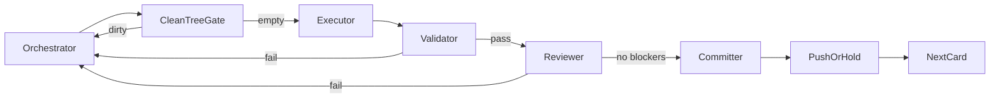

# Atomic Operation Market Reset — Operating Model

Authoritative execution contract for the reset. The plan states intent; this file states
who may do what, what a task card must contain, and which gates block advancement.

## Product target (locked)

AE owns operation identity/contract, authorization, exactly-once durable invocation,
delivery evidence, and brokered money. Consuming agents own planning and orchestration.

Core loop: `publish → admit → search/get/compare → execute-or-invoke → validate → receipt → settle`.

- MCP keeps separate tools for anonymous read-only `operation.execute` and paid/destructive `operation.invoke`.
- One paid HTTP path: `/api/v1/operations/call`. One CLI mental model over the same actions.
- Chat is a bounded AI SDK tool loop over the same market actions — no deterministic intent router.
- Organization/account owns funds and aggregate budget; API keys receive narrower grants.
- V1 money is AE-brokered only. x402 stays as import/discovery metadata, refused as a live lane.
- Customer Request, WorkTree, Study: quarantined; family HTTP including inspect is 410 after hashed-export closeout. Inquiry customer-record stays readable. Inquiry tables never drop. Other quarantined tables unlist after hashed export.

## Roles

| Role | May do | Must not do |
| --- | --- | --- |
| Orchestrator | Sequence phases, write cards, assign agents, interpret failures, authorize commits, refuse to advance on dirty trees | Implement product code, invent scope, skip validators |
| Executor | Exactly the files, commands, and assertions on one card | Choose architecture, expand scope, clean up adjacent modules |
| Validator | Run the card's exact commands, report pass/fail with logs | Fix code, reinterpret acceptance, mark green on partial |
| Reviewer | Review the diff against the card's invariants | Approve by vibe, rewrite the design |
| Committer | Stage only the card's allowed paths, one attributable commit, verify clean status | Amend foreign commits, force-push, reset --hard, commit secrets |
| Evidence scribe | Update named planning/evidence files with measured receipts | Change product code or policy |

## Model assignment

Orchestration is the only role that carries judgment, so it is the only role that runs on the
reasoning model. Everything downstream executes a written card and must not be reasoning about
whether the card is right.

| Role | Model |
| --- | --- |
| Orchestrator | Opus 5 |
| Executor | Composer 2.5 |
| Validator | Composer 2.5 |
| Reviewer | Grok 4.6 high |
| Committer | Composer 2.5, or the orchestrator directly for merges |
| Evidence scribe | Orchestrator |

Reconnaissance is read-only and carries no write authority, so it may run on any model.

## Role separation is not optional

An executor never runs its own acceptance gates and never lands its own work on the product
branch. An executor that self-certifies has produced an unreviewed diff with a green label on it,
which is worse than an unlabelled one. Concretely:

- The executor changes files and commits **on its own branch in its own worktree**. That is how the
  diff is preserved and the worktree stays clean. It is not the card's acceptance.
- A separate validator runs the exact command list and reports measured pass/fail. It may not fix.
- A separate reviewer reads the diff against the card's invariants. It may not rewrite.
- Only after both are green does the work merge to the product branch.

## Hard rules

1. One card = one concern. No "implement Phase 1".
2. No discretion. The card lists allowed paths, forbidden paths, exact commands, exact acceptance, stop conditions.
3. Fail closed. Missing path/command/assertion → stop and escalate.
4. No destructive Git. Never reset --hard, force-push, amend foreign commits, or drop tables without a landed retention receipt.
5. Validators are separate agents from the executor.
6. Reviewers are separate agents for every product-code card.
7. Parallel only with `depends_on: []` and non-overlapping paths; separate worktrees. Before
   dispatching a parallel wave, the orchestrator diffs the cards' `ALLOWED_PATHS` against each
   other; any shared path means the cards serialize instead.
7a. Parallel applies to editing, not to measuring. Two full-suite validators never run at the same
   time on one machine: the suites carry 5s–30s per-test timeouts, so concurrent runs manufacture
   timeout failures that are indistinguishable from real ones and cost a differential investigation
   to unpick. Executors may overlap; validators queue.
8. Commit as you go. A card is incomplete until its commit exists.
9. Clean tree is a hard gate between cards.

## Card template

```text
TASK_ID:
ROLE: executor | validator | reviewer | committer | scribe
DEPENDS_ON: []
BRANCH:
WORKTREE:
ALLOWED_PATHS:
FORBIDDEN_PATHS:
COMMANDS:
ACCEPTANCE:
COMMIT:
  required: true|false
  message: |
  stage_paths: []
HOUSEKEEPING_EXIT:
  - git status --porcelain empty for this worktree
  - no new stashes
  - no untracked artifacts outside ALLOWED_PATHS
STOP_IF:
OUTPUT: receipt with files touched, command exit codes, commit SHA
```

## Per-card pipeline



Validator or reviewer failure produces a **fix card** with an exact finding list. Fix cards
also end in commit + clean status. No open-ended "make it better".

## Git housekeeping (first-class acceptance criterion)

Baseline and branch policy:

1. No Phase 1+ product card starts until stashes are triaged, the dirty tree is sliced into
   attributable commits, the baseline is tagged, and status is clean.
2. One active product branch from the baseline tag, unless an explicit parallel worktree card exists.
3. Every completed card leaves the working branch clean and committed.
4. Never accumulate more than three unpushed product commits without a written reason.

Commit rules:

1. One card → one commit (or one commit series the card enumerates).
2. Why-focused messages via HEREDOC. No secrets. No `--no-verify` without founder authorization.
3. Stage only `COMMIT.stage_paths`. Never `git add -A` unless the card lists every path.
4. Pre-commit hook rewrites must be included or escalated — never left uncommitted.
5. Failed commits are fixed with a new commit after a fix card. No silent amend, never after push.

Worktree rules:

1. Start clean, end clean. Untracked artifacts get deleted or gitignored on the card.
2. No opportunistic stashing. Stashes after Phase 0 are a regression.
3. Parallel work uses worktrees, never two agents on one dirty tree.
4. `.env`, credentials, and local Convex state are never staged. Committer fails closed on such paths.

## Orchestrator advance gate

Before dispatching the next product card:

```text
- git status --porcelain → empty
- HEAD matches the last accepted commit SHA
- branch not unexpectedly detached
- no leftover temp artifacts unless retained as evidence with a receipt
- stash list unchanged (empty after Phase 0)
```

Any failure → housekeeping card first, not the next feature card.

## Verification command vocabulary

Cards draw commands from this set so validators never improvise:

| Gate | Command |
| --- | --- |
| Types | `npm run typecheck` |
| Lint | `npm run lint` |
| Unit (scoped) | `npx vitest run <paths>` |
| Conformance floor | `npm run test:conformance` |
| Boundaries | `npm run test:imports` |
| Frontier | `npm run check:product-frontier` |
| Kernel retirement | `npm run check:kernel-retirement` |
| Full source gate | `npm run test:release:source` |

## End-state guardrails

- ≤14 active actions, ≤60k active module LOC, ≤60 live tables; quarantined tables reported separately.
- No public URL disappears without one deprecation release.
- No conformance path disappears without an equivalent atomic-market proof.
- No chat-only market capability.
- No live x402 execution in V1; no live money before legal gates close.
- No worker agent has architectural discretion.
- No accumulated dirty trees.
