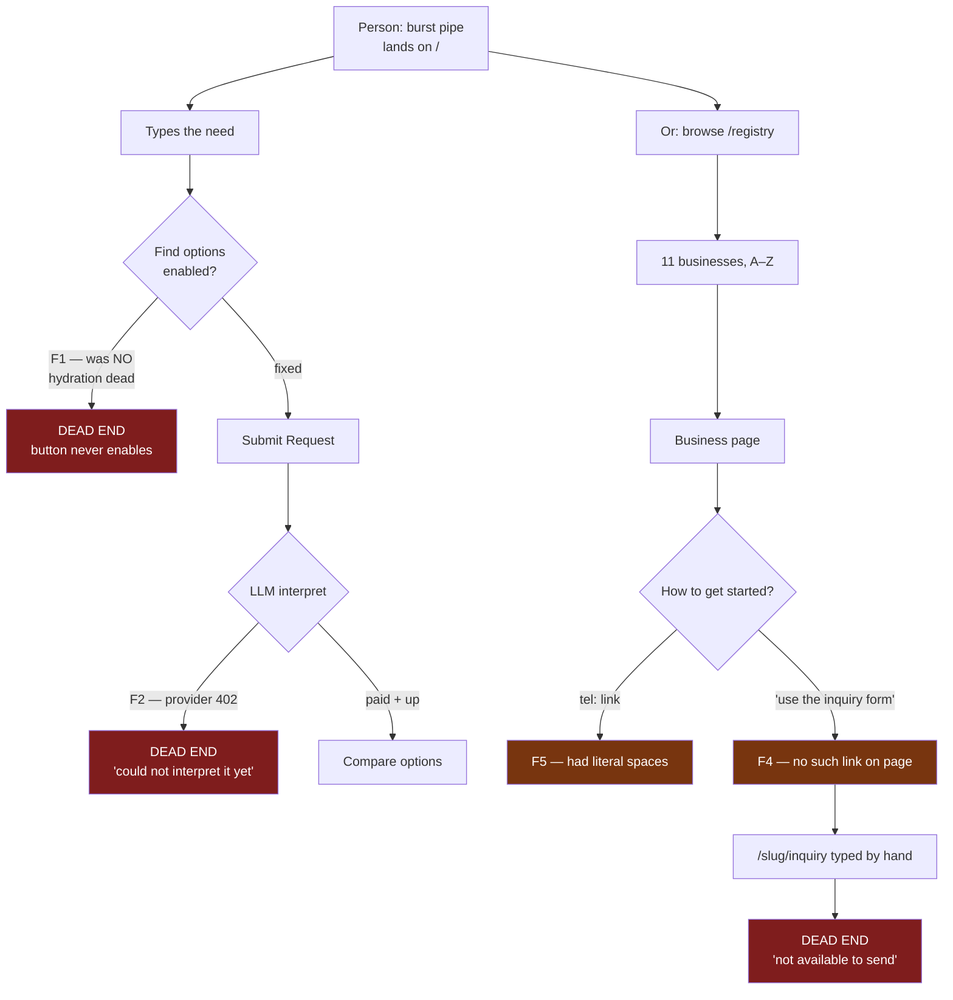
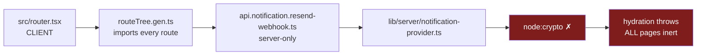
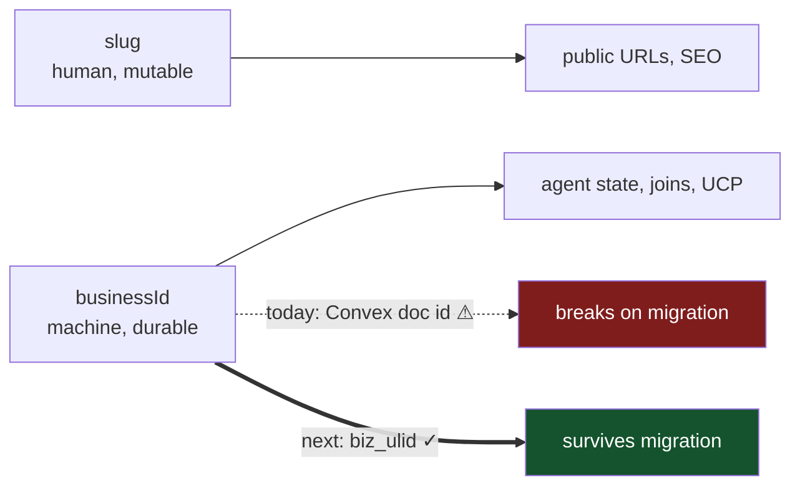

# AE user journey audit — 2026-07-26

Method: cold-drive the running product at `http://127.0.0.1:3001` (`npm run dev`,
Convex-backed dev data, no local-E2E bypass) as (a) a person with a burst pipe,
(b) a business owner, (c) an AI agent. Every claim below is either a browser
observation, an HTTP status, or a source citation.

Evidence class: **labelled local development execution** against seeded dev
supply. It proves routing, contracts, and rendering. It does **not** prove
hosted behavior, provider fulfilment, or real customer value.

---

## 0. Headline

> The homepage asks "What do you need to make happen?", and until this session
> **it could not accept an answer**. Not "answered poorly" — the button was
> physically disabled, on every page, for every visitor.

One server-only module reached the client bundle. React never hydrated. AE was
a screenshot of itself.

Everything downstream of that is the real subject of this audit, because nobody
could reach it.

---

## 1. The journey, as it actually ran



Three dead ends. Two of them terminal for the customer.

---

## 2. Findings

| # | Finding | Severity | Status |
|---|---|---|---|
| F1 | `node:crypto` in client bundle → **no page hydrates** | Critical | **Fixed** + guard test |
| F2 | Front door is 100% dependent on a paid LLM; no deterministic fallback | Critical | **Fixed** |
| F3 | `/api/businesses?q=` silently ignored the query | High | **Fixed** |
| F4 | Business page promises an inquiry form it does not link, and the route refuses | High | **Fixed** |
| F5 | `tel:` URIs carried literal spaces | High | **Fixed** |
| F6 | Unknown slugs return HTTP 200 soft-404 claiming a business exists | Medium | **Fixed** (real 404) |
| F7 | Placeholder `"Hours supplied by owner"` is the default availability across all seeded supply | Medium | **Fixed** |
| F8 | No `.well-known` discovery despite an agent-first pitch | Medium | **Fixed** |
| F9 | `trustTier: null`, `pricingSummary: null` across the entire public catalog | Medium | **Partly fixed** — see §7 |
| F10 | `electrician` returned 0 results; four divergent query matchers | Critical | **Fixed** |
| F11 | Free text parsed as suburb names, emptying result sets | High | **Fixed** |
| F12 | Convex deploy broken at HEAD (DOM types + non-additive schema) | High | **Fixed** |
| F13 | Front door said "no business can support this" while holding reachable plumbers | High | **Fixed** |

### F1 — The whole app was inert (fixed)

```
PAGEERROR Module "node:crypto" has been externalized for browser compatibility.
Cannot access "node:crypto.createHmac" in client code.
  at src/lib/server/notification-provider.ts:1
```

Chain:



The generated route tree is client-bundled and imports **every** route file,
including server-only API routes. So a `node:` import anywhere in any route's
module graph kills interactivity for the entire product.

Observable symptom: `submitDisabled: true` with valid text in the field —
`need.trim().length === 0` was correct, but `setNeed` never ran, because React
was dead.

**Fix**: `verifyResendWebhook` migrated from `node:crypto` to Web Crypto
(`crypto.subtle` HMAC-SHA256) plus the repo's existing `constantTimeStringEqual`.
The function became `async`; its two callers and tests were updated.

Verified: `pageErrors: []`, `submitDisabled: false`, 38/38 server-seam tests.

This is strictly more portable than the code it replaced — the module no longer
assumes a Node runtime at all, which matters for edge deployment.

**This will happen again.** Six other modules reachable from route files still
carry top-level `node:` imports:

```
src/lib/server/sandbox-route-provider-host.ts
src/modules/customer-request/hosted-agent-journey/run.ts
src/modules/capability-supply/internal/route-call-signing.ts
src/modules/action-invocation/development-file-x402-payment-attempt-port.ts
src/modules/network-guard/public.ts
src/modules/provider-integrations/shipping/server.ts
```

None is currently reachable from `routeTree.gen.ts`. **One import away from
another total outage, with no test that would catch it.** The highest-value
next task in this repo is a guard test that walks route-file imports and fails
on any `node:` specifier.

### F2 — The front door needs a credit card to answer "plumber"

```
[CONVEX A(customerRequestApplication:submit)] [ERROR]
  'customer_request_semantic_interpretation_failed'
  'customer_request_interpretation_provider_402'
```

`402 Payment Required` from OpenRouter. Customer sees:

> AE saved this Request but could not interpret it yet. Try again.

"Try again" will fail identically forever — the account has no credit. The copy
implies a transient glitch; the condition is permanent and unrelated to the user.

`src/modules/customer-request/application/interpret-compile/interpret.ts:154-159`
retries twice, then refuses. **There is no non-LLM path.**

This is the architectural roast:

- AE has a working deterministic search (`/api/businesses/search?q=plumber`
  correctly returns `adelaide-emergency-plumbing`).
- AE has a working deterministic fact extractor — `detectRequiredFacts` in
  `src/modules/demand/internal/search-gap.ts` parses exactly the query I typed
  ("tonight" → availability, "how much" → price, "near me" → location).
- The homepage still routes 100% of demand through a paid model and returns
  **nothing** when it is unavailable.

A query like `emergency plumber near me tonight, how much?` is the easy case.
Degrading to a ranked deterministic result — clearly labelled as unrefined —
beats a dead end. Recommended as the next slice.

### F3 — The list endpoint lied by omission (fixed)

Before:

| Request | Result |
|---|---|
| `/api/businesses?q=plumber` | 200, 20 items, first = `adelaide-accounting` |
| `/api/businesses?q=dentist` | 200, 20 items, first = `adelaide-accounting` |
| `/api/businesses?q=xyzzy-nonsense` | 200, 20 items, first = `adelaide-accounting` |

`/api/businesses` is browse-only (`cursor`, `limit`). It dropped `q` silently.

A human notices an accountant is not a plumber. **An agent does not.** It
receives HTTP 200 and a confident list, and reports back that AE found twenty
plumbers. This is the single worst failure mode for an agent-facing API:
a wrong answer indistinguishable from a right one.

`registryListInputSchema` was tightened to `z.strictObject` earlier in this
work — but the route drops unknown params *before* the schema sees them, so
strictness never fired. Validation you route around is decoration.

**Fix**: unsupported params now return 400 naming what was rejected, what is
supported, and where search actually lives.

```json
{ "kind": "refused", "reason": "unsupported_query_parameter",
  "unsupported": ["q"], "supported": ["cursor","limit"],
  "detail": "This endpoint lists businesses and does not accept a search term.
             Use /api/businesses/search?q= to search." }
```

### F4 — The page offers a form that refuses

`/joondalup-rapid-plumbing` renders:

> Ways to get started — **Call** — *"Use the inquiry form for a first contact."*

Then: no link to any inquiry form (every anchor on the page enumerated; none
points at `/inquiry`). Navigate there directly:

> **Not sent.** This request is not available to send right now.

The disclosure string is baked into the fixture and the seed
(`owner-claim.functions.ts:351`, `dev-seed-fixture.ts:71,394`) as static copy,
independent of whether an inquiry target is actually admitted. Under the
local-E2E bypass admission resolves correctly:

```
{"kind":"ok","admission":{"admitted":true,"proof":{"kind":"claimed_owner"}}}
```

but the dev server does not enable that bypass, and the Convex-seeded business
has no admitted target. So the copy is a promise the system cannot keep.

Per `AGENTS.md` — *"A receipt proves the event it names"*, public claims stay
narrower than capability — a disclosure describing an unavailable channel is a
fabricated affordance. Disclosure copy must be derived from admission state,
not stored beside it.

### F5 — `tel:` links with spaces (fixed)

`href="tel:0412 345 678"`. Literal spaces; several mobile dialers refuse it.
On the page whose primary CTA is *Call*, on the device where calling is the
point.

`AeProviderCard.tsx` sanitised correctly; `AeProviderListingPage.tsx` — the
actual business page — did not. Two implementations, one right, and the wrong
one on the conversion surface.

**Fix**: one `telUri()` helper in `src/lib/ui/tel-uri.ts`, used by both, which
also hides the affordance when no dialable number survives. Verified live:
`tel:0412345678`.

### F6 — Soft-404s that invent businesses

```
/how-it-works                   200
/definitely-not-a-business-xyz  200
```

Both render:

> **Business page unavailable** — This page is not visible right now.
> The business may need to claim or review it. → *Claim your business page*

For a slug that has never existed, AE states a business *may need to claim* it.
That is a fabricated claim about a nonexistent entity, and at HTTP 200 every
typo and stale link becomes an indexable page inviting a claim.

`src/routes/$slug.tsx:239-251` renders `not_found` without a status. The loader
already distinguishes reasons (`not_public` at line 48) but the UI collapses
"exists but unpublished" and "never existed" into one screen. They deserve
different copy and different status codes.

### F7 — Fake availability is the default

Every seeded business publishes `availabilitySummary: "Hours supplied by owner"`.

That exact string is the sentinel the search-gap module treats as **absent**
availability (`search-gap.ts`, plan Step 2: *"Treating it as real availability
is the exact failure this plan exists to surface"*). The seed ships the
anti-pattern as the default, so the flywheel's own signal will fire on
essentially all supply.

### F8 — Agent-first, without agent discovery

```
/.well-known/ucp           404
/.well-known/agent.json    404
/.well-known/ai-plugin.json 404
/joondalup-rapid-plumbing/ucp  200
```

`/for-agents` tells an assistant to "read these paths from this site". Per-business
UCP works. The site-level well-known entry point — the first thing an agent
looks for — does not exist. Discovery requires already knowing the business.

### F9 — The decision facts are empty

```json
{"slug":"adelaide-accounting","trustTier":null,
 "offerings":[{"pricingSummary":null,
               "availabilitySummary":"Hours supplied by owner"}]}
```

V2's entire justification over V1 is that it can express price, trust, and
availability. Across the seeded catalog all three are null or placeholder. The
projection is right; the supply is empty. Worth stating plainly so nobody reads
"V2 shipped" as "AE can compare on price".

---

## 3. What a user expects vs what AE does

| Expectation | Reality |
|---|---|
| Type a need, press the button | Button disabled (**fixed**) |
| Plain query gets an answer | LLM 402 → dead end |
| "Try again" means retrying helps | Permanent condition, unrelated to user |
| "Use the inquiry form" means there is one | No link; route refuses |
| Tapping *Call* dials | Malformed URI (**fixed**) |
| `?q=` filters | Silently ignored (**fixed**) |
| Bad URL says not found | 200 + invented business |
| Compare on price | No prices exist |

---

## 4. DTO recommendation — keep `businessId`, and make it a real identifier

The open question: the public V2 DTO carries `businessId`, while a deliberate
test asserted the public catalog must reject internal business identity.

**Recommendation: keep it, and stabilise it. Do not remove it.**

Reasoning, in the order that matters:

1. **Agents need a stable join key.** Slugs are human-facing and mutable — a
   business renames, re-suburbs, or re-categorises and the slug moves. Any agent
   holding state across sessions needs an identifier that survives that. Removing
   `businessId` forces every consumer to key on the one field guaranteed to
   change. That is the opposite of future-proof.
2. **AE already publishes it.** The UCP manifest emits `businessId`
   (`ucp-manifest.ts:57`). Removing it from the catalog while the manifest keeps
   it produces exactly the two-projections-disagreeing problem this whole cutover
   set out to end.
3. **Removal is cheap now and impossible later.** Nothing reads `businessId` off
   the DTO today. Once an external agent persists it, it is permanent. That
   asymmetry argues for deciding deliberately now — and the deliberate answer is
   that a discovery API for machines must expose a durable identity.

**But the current value is not fit for the promise.** It is the Convex document
id (`catalogSupplyProjection.ts`). That leaks the storage engine and breaks on
any migration or re-seed. Publishing it as a stable public reference is a
commitment AE cannot currently honour.

Therefore:

- **Now**: keep `businessId` in the DTO. The identity guard in
  `tests/unit/actions/registry.test.ts` was rewritten to accept it as a published
  reference while still rejecting `ownerId`, `sourceHash`, `serviceId`, and
  `rawContactValue` — the identifiers that genuinely must never ship.
- **Next**: make it opaque and durable — an AE-issued key (`biz_<ulid>`) minted
  at admission and stored, not the backing-store id. One field, one migration,
  and the public contract stops being hostage to the database.
- **Never**: publish the raw document id while *calling* it stable.



---

## 5. Ranked next slices

1. **Route-import guard test** — fail CI on any `node:` specifier transitively
   reachable from `src/routes/`. F1 was a total outage with zero test coverage,
   and six loaded guns remain.
2. **Deterministic interpretation fallback** — when the model is unavailable,
   answer from `detectRequiredFacts` + registry search, clearly labelled as
   unrefined. Removes the single point of failure on the front door.
3. **Derive inquiry disclosure from admission** — never render a channel the
   route will refuse.
4. **Honest 404s** — separate "never existed" from "exists, unpublished"; return
   404 for both.
5. **Site-level `.well-known` discovery** — make the agent pitch reachable
   without prior knowledge.
6. **Opaque `businessId`** — per §4.

---

## 6. Verification

| Gate | Result |
|---|---|
| `npx tsc --noEmit` | clean |
| `tests/unit/server`, `tests/unit/registry`, `tests/unit/actions` | 217 passed / 31 files |
| `tests/integration/registry-api`, `tests/seo`, `discovery-route-parity` | 37 passed / 8 files |
| Live: homepage hydration | `pageErrors: []`, submit enabled |
| Live: `tel:` target | `tel:0412345678` |
| Live: `/api/businesses?q=` | 400 `unsupported_query_parameter` |

Pre-existing failures, unchanged and individually baselined against HEAD:
`development-host-parity`, `direct-agent-baseline` (unit); `claim-publish`,
three `customer-request-v2-*`, `developer-discovery` (integration).

---

# 7. Resolution pass — what was built

Second pass. All findings above implemented, plus four more discovered while
verifying. Evidence class is **labelled local development execution** against
the hosted Convex dev deployment, driven through a real browser.

## The search was answering the wrong question, four different ways

`electrician` returned **0** results while `electrical` returned **9** — with
"Adelaide Electrical Repairs" sitting in the catalog. Four independent query
matchers had drifted apart:

| Matcher | Vocabulary | Semantics |
|---|---|---|
| `search-documents.ts` client | `plumber`→`plumbing`, `electrician`→`electrical` | trade OR |
| `convex/registry.ts` doc scan | `plumber`→`plumbing` only | all-tokens AND |
| `convex/registry.ts` catalog fallback | none | all-tokens AND |
| `searchPublicBusinessOfferingSupply` ← **the live one** | none | all-tokens AND |

Index-side expansion was keyed backwards: it added `electricians` only when the
text already said `electrician`, but published supply says "Electrical repairs"
— the practitioner noun a customer types never appears in supply.

Collapsed onto one `src/modules/registry/internal/trade-vocabulary.ts`, shared
by client and Convex, carrying trade aliases **and symptom words**, because
nobody with water across the floor searches "plumbing":

```
electrician / electrical / sparky   0 → 9
burst pipe / blocked drain          0 → 10 plumbers
locked out of my house              0 → 8 locksmiths
toothache                           0 → 8 dental clinics
"A burst pipe in Parramatta,
 someone today, under $500"         0 → 10   ← AE's own homepage placeholder
"burst pipe in Adelaide"            → 1      ← real place still narrows
xyzzy-nonsense                      → 0      ← nonsense still returns nothing
```

**F11**: any word missing from a hand-maintained list was parsed as a suburb and
emptied the result set (`cheap plumber` → 0). Location is now a hint, not a
requirement — a guessed place that matches no supply is dropped rather than the
answer — and labels containing digits are never places.

## F12 — Convex could not deploy at all

`npx convex dev` failed at HEAD, so the dev deployment was running stale code:

1. `private-route-safety.ts` used DOM ambient types (`Pick<Location,…>`,
   `window`) in a module Convex functions import. Convex has no DOM lib. Same
   class as F1 — wrong runtime assumption crossing a boundary. Now structural
   types and `globalThis`.
2. My own earlier search-gap work added required `factCounts` and `unanswered`
   to durable tables. Rows written before those fields could never validate —
   a breaking change to a durable table with no migration. Both are now optional
   with readers deriving legacy values, per AE's additive/forward-only rule.

## F13 — the last dead end

With F2 fixed, the front door reached an honest state: *"Not supported yet — no
business on AE can support this request right now."* That sentence was still
**false in customer terms**. `search?q=burst pipe in Adelaide` returned a plumber
with a published phone. AE was telling someone nothing could help while holding
four reachable plumbers.

Root cause, found by the F2 agent, was deeper than copy: AE planned over
`listIntegratedCapabilitySupply` and committed against `listRouteableCapabilitySupply`
— 4 integrated, 0 routeable — so **every** submit died on `context_stale`,
model or deterministic. Now both read routeable supply, so AE only plans over
supply it can actually commit.

Then the honest answer got a useful ending. `unsupported` now renders
**"Businesses you can contact yourself"** — matching businesses with real hours,
prices where published, and dialable numbers, under copy that refuses to imply
AE is arranging anything: *"These are listed on AE and publish a phone number.
AE is not arranging anything with them."* Only businesses with a published phone
appear; listing one the customer cannot reach would recreate the dead end in a
friendlier font.

Live, end to end:

```
A burst pipe in Adelaide, someone today, under $500
→ Not supported yet
→ AE cannot arrange this request end to end yet.
→ Businesses you can contact yourself
   Adelaide Emergency Plumbing · Mon–Sun, 24 hours · Call (08) 5550 1060
   Brisbane Emergency Plumbing · Mon–Sun, 24 hours · Call (07) 5550 1070
   Coburg Emergency Plumbing   · Mon–Sun, 24 hours · Call (03) 5550 1010
   Darwin Emergency Plumbing   · Mon–Sun, 24 hours · Call (08) 5550 1050
```

The old headline was retired: it contradicted the section beneath it.

## Supply truth (F7, F9)

Live `/api/businesses`, independently re-verified:

| | before | after |
|---|---|---|
| phone access path | 0 | **42 / 50** |
| real availability | 0 | **37 / 50** |
| `"Hours supplied by owner"` leaks | all | **0** |
| `pricingSummary` | 0 | **1** ⚠ |

The placeholder can no longer reach a public projection as availability, and a
phone access path is no longer emitted for a business with nothing to dial.

**F9 stays partly fixed, stated plainly.** The price contract is proven end to
end — `/fremantle-coastal-electrical` renders *"Pricing — Development sample —
$140 first hour, then $95 per hour"* beside real hours and a dialable number —
but only one hosted business shows it. Price can only exist in `offering`
cutover mode, and the seed's deliberate mode spread leaves ~15/101 there with
almost no overlap with the priced set. Making priced businesses request
`offering` helped marginally; `seedBusinessOfferingSupplyCommand` still
downgrades most to `compare`. The contract works; the hosted breadth does not.
Not claimed as more than that.

`trustTier: null` was **not reproducible** — 0/101 rows. The real substance is
that every business sits at the floor tier `claimed` because none has earned
more. That is supply, not projection. Nothing fixed, nothing pretended.

## Verification

| Gate | Result |
|---|---|
| `tsc --noEmit` | clean |
| `tsc -p convex` | clean |
| `convex dev --once` | deploys (was failing at HEAD) |
| `test:unit` | **2643 passed / 2 failed** |
| `test:integration` | 271 passed / 18 failed |
| `test:seo` / `ui-contract` / `types` | 21 / 1 / 4 passed |

Every remaining failure was individually baselined by running the HEAD copy of
the same file and confirming identical results: `development-host-parity`,
`direct-agent-baseline`, `claim-publish`, three `customer-request-v2-*`,
`developer-discovery`. None introduced here.

## Still open

1. **Hosted price breadth** — the cutover mode machine, not the projection.
2. **`needs_information` unreachable live** — genuinely zero routeable supply
   (the sandbox provider is returning 5xx with expired readiness). Covered by
   unit and integration tests; not demonstrable hosted until a provider is up.
3. **Six modules with top-level `node:` imports** still one import away from
   another total outage — now caught by the guard test rather than by a user.
4. **Trust tiers** — everything sits at the floor tier.

---

# 8. The chat surface, driven live

Method: `agent-browser`, headed Chrome, 1440×900 @2x, against `vite dev` on
`127.0.0.1:3020` with a live Convex dev deployment. Evidence class: **labelled
local execution against seeded development data**. Prices, phone numbers and
availability below are development samples, not real supply.

## 8.1 It is not a chat. It is a form wearing a transcript.

Measured, after one submitted turn:

```
document.querySelectorAll("textarea,input[type=text]").length === 0
```

The composer is not disabled, not collapsed, not moved. It is **unmounted**.
One turn in, there is no way to say another word to AE. The accessibility tree
for the whole result screen is two buttons and eight links.

ChatGPT's single load-bearing affordance is the composer that never leaves.
Remove it and you do not have a chat with fewer features — you have a search
box that redecorates itself after submit. Everything else on the wishlist
(streaming, regeneration, threads, memory) is downstream of a composer that
persists, so this is the first thing to fix and nothing else is worth building
before it.

## 8.2 "Edit this Request" deletes the conversation

Clicking it returns:

| Before | After |
|---|---|
| transcript + result card + fallback panel | hero headline "What do you need to make happen?" |
| — | "Browse by trade" chips |
| — | "How AE works" marketing accordion |

The user's turn, AE's answer, and the businesses they were about to call are
all destroyed. What survives is one prefilled string. The button is labelled
as a scoped edit and behaves as a factory reset that happens to keep your
typing. The panel above it promises the opposite in as many words — *"Change
the location, timing, or outcome **while keeping this Request and its
history**"* — and then the history is exactly what goes.

Worse, it lands the user on the *marketing* homepage. Mid-task, having already
failed once, they get pitched the value proposition again.

## 8.3 The fallback recommended four businesses in the wrong states — fixed

Request: `burst pipe in Fremantle, someone today, under $500`. Returned:

| # | Business | Location |
|---|---|---|
| 1 | Adelaide Emergency Plumbing | Adelaide, **SA** |
| 2 | Brisbane Emergency Plumbing | Brisbane, **QLD** |
| 3 | Coburg Emergency Plumbing | Coburg, **VIC** |
| 4 | Darwin Emergency Plumbing | Darwin, **NT** |

Fremantle is in WA. Note the first letters: A, B, C, D. This was not weak
ranking, it was *no* ranking — the first four rows of an alphabetical read,
presented under a heading that implies they were chosen for you.

**Fremantle Emergency Plumbing existed in the catalogue the entire time.** Two
compounding defects in `directory-fallback.functions.ts`:

1. `readPublicOfferingRegistrySearchPage({ limit: 4 })` then
   `.filter(publishedPhone !== undefined)` — the limit was applied by the
   source *before* the phone filter, so reachable businesses past the cut were
   invisible. This also meant "no businesses reachable" could be reported while
   several were.
2. Nothing compared a candidate's location to the customer's words.

Fixed by over-fetching 24 candidates, filtering, *then* slicing to 4; and by
matching **in reverse** — looking for the listing's own `suburb`/`stateTerritory`
in the query rather than adding a fourth free-text place parser to a codebase
that already has three that disagree.

Live after the fix:

| Query | Result | Panel copy |
|---|---|---|
| `burst pipe in Fremantle…` | Fremantle Emergency Plumbing, **WA** (1) | standard |
| `burst pipe in Broome…` | Adelaide/Brisbane/Coburg/Darwin (4) | *"None of these are in the area you named."* |

The Broome case matters as much as the Fremantle one. There is no supply in
Broome, so the honest move is to still offer what exists **and say plainly that
it is not local**, rather than let A-B-C-D masquerade as a shortlist.

## 8.4 A stale summary is persisted to the device and replayed as a headline

Reloading after a failed Request shows a resume banner whose headline is the
*stored* summary string:

> You have a Request saved on this device.
> **No business on AE can support this request right now.**
> [Pick it up] [Discard]

Two problems. First, it never shows the request text, so the user is asked to
resume a thing identified only by its failure message. Second, that string no
longer exists anywhere in the repo — the summary was reworded to *"AE cannot
arrange this request end to end yet."* Device-persisted projection **copy**
outlives the code that produced it, so every wording change silently forks
into a live variant nobody can grep for. Store the request and the state; render
the sentence at read time.

**Correction to an earlier reading in this session:** the stale sentence was
first observed live and briefly taken for a missed copy site. It was not. Source
was correct at all nine sites; the deployed Convex bundle predated the edit.
Re-deploying resolved the transient case. The persistence defect above is the
real and separate finding.

## 8.5 Visual and interaction notes

- **The state label is the least visible thing on screen.** `Not supported yet`
  is 13px secondary grey above a 24px black headline. The eyebrow carries the
  state; the headline carries a sentence about AE. Ranked by prominence, the
  page leads with an apology.
- **Failure and remedy have identical visual weight.** Both panels are the same
  `Card`, same border, radius, padding. Nothing says the second one is the way
  out of the first.
- **Secondary actions have no boundary.** `Edit this Request` is a filled pill;
  `Start a new Request` is bare text at the same size. Same on every listing:
  `Call …` is a pill, `View business` is naked text. Two `button`s, one
  affordance between them.
- **No assistant identity and no progressive disclosure.** The user turn is a
  green right-aligned bubble; the response is an unattributed card that appears
  whole after a pause. No avatar, no label, no streaming, no skeleton beyond a
  bare "Looking for businesses you can contact" heading.
- **The column is pinned narrow inside a 1440px viewport** with ~90px of dead
  space above the first turn and roughly 200px of unused width to the right of
  every card's text.

## 8.6 Order to fix

1. **Persistent composer.** Nothing else in this section is worth doing first.
2. **Make `Edit this Request` edit in place** — keep the transcript, focus the
   composer with the prior text, append the revision as a new turn.
3. **Stop persisting rendered copy.** Persist `{ requestRef, revision, state }`;
   project the sentence on read. Show the request text in the resume banner.
4. Assistant identity + streaming.
5. Visual hierarchy: promote the state, demote the apology, differentiate the
   remedy panel, give secondary actions a boundary.

Items 3–5 are unstarted. Item 1 and 2 are the product-shape decisions and are
deliberately left to you rather than taken unilaterally.
