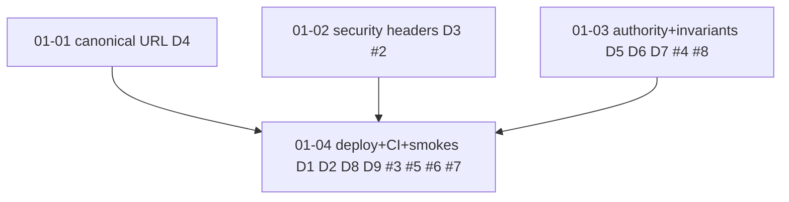

# Scope 01 — Production landing (INDEX)

**ADR:** [.planning/adr/ADR-001-scope1-production-landing.md](../../adr/ADR-001-scope1-production-landing.md) (Status: Proposed)
**Direction:** `local://five-scopes.md` §"Scope 1" — convert local proof into a deployed, hardened product; clear the STATE.md blockers; lock auth / agent-door / canonical URLs / source-state invariants *before* scopes 2-5 build on them.
**Blocks:** every other scope (five-scopes.md §Sequencing: "S1 -> everything").
**Boundary posture:** ships no new public capability. No copy claims booking / payment / dispatch / autonomous fulfillment. P5/P6 money smokes are sandbox / test-mode only; live money stays gated on the ROADMAP money-rail decision records (L22, L226). "Verified" is never introduced as an unqualified claim.


## Validation-first gate

Read `.planning/scopes/PREMORTEM-VALIDATION-GATES.md` before executing this scope. Scope 1 may proceed while the global PM gates run, but it owns the substrate that blocks downstream build work. Two Scope-1 local gates are mandatory; the superseded five-scope execution-prep runbook is preserved at `.planning/archive/scopes/PHASED-EXECUTION-PREP.md`.

- **S1-G1 deployed-smoke readiness ledger** before 01-04: host, refs, env, owner/support row, seeded slug, provider mode, redaction rule, expected evidence row, and fail-loud missing-input behavior for the Scope-1 deployed evidence suite defined in `.planning/scopes/SCOPE-EXECUTION-READINESS.md` (rows: header/canonical, support row, inquiry/notification readback, Resend, Novu, P5 test-mode, P6 test-mode).
- **S1-G2 authz/source-state rollout proof** before identity narrowing or fallback deletion: dual-read window, wrong-issuer proof, tokenIdentifier membership checks, indexed lookup path per persisted table, fallback-used metric, and rollback/narrow criteria.
- **S1-G3 agent-experience audit gate** (ADR-006) before any agent-facing GTM claim: an outside-in audit (`examples/agent-experience/`, plan 01-05) run against the DEPLOYED surface must pass grade ≥ B, zero convergent boundary-overreach, `docs_promise_met ≥ onboarding`, one-hop unsigned-write recovery, cold storefront discovery, boundary-refusal, and freshness/correction scenarios. Local runs are iteration-only, not this gate. `npm run audit:agent-experience:gate -- --base <deployed-origin>` blocks GTM claims unless a fresh deployed report exists. Blocked on #5.

## Decisions digest (ADR D-refs)

| D | Decision | Plan |
|---|---|---|
| D1 | Adopt Vercel; pin Nitro `preset: 'vercel'` + standardize server runtime (two-way door to scope 3). | 01-04 |
| D2 | Run the Scope-1 deployed evidence suite in a fixed order once env is provisioned; sandbox/test-mode only; non-secret evidence per blocker-doc schema. Historical "five smokes" wording now means provider rows inside the full matrix, not a smaller closure bar. | 01-04 |
| D3 | Source-owned browser security-header response middleware in `src/start.ts`; assert in the existing phase1 deploy smoke. | 01-02 |
| D4 | Server helper `resolveCanonicalBaseUrl(request)` (env var + host allowlist); migrate all 7 origin-derivation sites; fix the `$slug.tsx` hardcode. | 01-01 |
| D5 | Canonicalize authority identity to `tokenIdentifier` via widen-migrate-narrow; lands before scope 3. | 01-03 |
| D6 | `agentTools` surface snapshot test: exactly `{registry.search, registry.detail, inquiry.submit}`; only `inquiry.submit` is a write. | 01-03 |
| D7 | Source-state index guard + enforce `registrySearchDocuments` as the required search read model (fallback-used metric). | 01-03 |
| D8 | Extend the PR gate (`eval-gate.yml`) with `test:types`, `test:source-mining`, `test:ts-standards`, `test:seo`; deploy-smokes stay off the PR gate. | 01-04 |
| D9 | Deliver the deployed claim→publish→status→inquiry loop + attribution readback; the five owner-activation packets stay GTM-side deferred debt. | 01-04 |

## Tickets (wayfinder, scope:1)

Every scope-1 ticket is handled below — as an early **resolution task** (resolve → post resolution comment → close → append one line to map issue [#1](https://github.com/CreasyBear/Agentic-Economy/issues/1) "Decisions so far") or as a named **preflight gate** blocking a later task.

| Title (#N) | Type | Where handled |
|---|---|---|
| Prototype a CSP that survives TanStack Start SSR (#2) *(entry ticket)* | prototype | 01-02 Task 1 (resolution); enforced-CSP proof gated to 01-04 deployed run |
| Confirm Vercel runtime meets scope-3 agent-signature needs (#3) | research | 01-04 Task 1 (resolution) |
| Verify Convex rollout safety for tokenIdentifier authz migration (#4) | research | 01-03 Task 1 (resolution) |
| Stand up deployed env and capture Scope-1 deployed evidence artifacts (#5) | task | 01-04 Task 4 (blocked_by #2 → depends on 01-02) |
| Decide if P5/P6 live-mode money smokes stay out of scope 1 (#6) | grilling | 01-04 Task 3 (resolution) |
| Set CI gate boundary: blocking PR suites vs nightly (#7) | grilling | 01-04 Task 2 (resolution) |
| Decide whether to delete the source-state collect() fallback (#8) | grilling | 01-03 Task 2 (resolution) |

Coverage: **7/7** scope-1 tickets. Entry ticket #2 (CSP) resolves in wave 1 (01-02) and gates #5.

## Fog (open questions carried forward, NOT pre-answered here)

From `local://tickets-scope-1.json` — surfaced so later scopes revisit, deliberately left as questions:
- When P7 answer/chat is enabled, will streaming + model calls need CSP/`connect-src` exceptions beyond the static-page policy? (revisit in 01-02 report-only phase; do not widen speculatively now).
- Does edge/multi-region caching of `llms.txt`/`sitemap` change the canonical-host allowlist story (per-region hosts)? (01-01 leaves the allowlist multi-host capable; per-region decision deferred).
- Will scope-3 per-agent rate limiting need a deployed rate-limit store that scope 1's env must provision now? (scope-3 concern; not provisioned in scope 1).

## Plan sequence, waves, depends_on

```text
Wave 1 (parallel, source-owned; no shared files):
  01-01  canonical base-URL helper        [D4]            depends_on: []
  01-02  security-header middleware        [D3]  #2        depends_on: []
  01-03  convex authority + source invariants [D5,D6,D7] #4 #8  depends_on: []

Wave 2 (deployed + CI; needs all wave-1 hardening landed & deployed):
  01-04  deploy target + CI gate + smoke evidence [D1,D2,D8,D9] #3 #5 #6 #7
         depends_on: ["01-01","01-02","01-03"]

Wave 3 (agent-experience audit gate; harness runs any origin, GATE needs deployed env):
  01-05  agent-experience audit + remediations [ADR-006]  depends_on: ["01-04"]
```

Wave 1 local/source status (2026-07-04): **complete and green locally**. `01-01-SUMMARY.md`, `01-02-SUMMARY.md`, and `01-03-SUMMARY.md` record source changes and proof. `npm run test:all` passed after resolving the `$slug.tsx` server-only import leak by moving route SEO to a pure module plus TanStack server-function canonical URL boundary. Wave 2 source/config tasks are complete: the Vercel Node runtime is pinned, the PR gate includes the cheap deterministic scans, and the money boundary is recorded. Wave 2 deployed smokes remain blocked on 01-04 user provisioning for deployed env/provider inputs.



Shared-file note: 01-01 owns routes + `src/lib/server`; 01-02 owns `src/start.ts` + `src/lib/http`; 01-03 owns `convex/*` + security schema + convex tests. No wave-1 plan writes another's files, so the three run in parallel.

## End conditions

Observable, command-verifiable. **Local/source** conditions are agent-executable now; **deployed** conditions require the user-provisioned env (01-04) and are honestly separated.

Local/source (no deployed env):
- `npm run typecheck` and `npm run check:convex-codegen` pass.
- `npm run test:unit` passes including the new `tests/unit/actions/agent-tools-surface.test.ts`, `tests/unit/convex/source-state-index-guard.test.ts`, `tests/unit/convex/authz.test.ts` (tokenIdentifier dual-read + wrong-issuer), and `tests/unit/http/security-headers.test.ts`.
- `npm run test:seo` passes including `tests/seo/canonical-base-url.test.ts`; no route emits `https://ae.example` under a canonical/allowlisted host; `$slug.tsx` no longer hardcodes `https://ae.example`.
- `npm run test:ts-standards`, `npm run test:source-mining`, `npm run test:copy`, `npm run test:imports`, `npm run test:ui-contract` stay green with zero new allowances.
- `npm run build` succeeds with the Nitro preset pinned (`preset: 'vercel'`).
- `.github/workflows/eval-gate.yml` runs `test:types`, `test:source-mining`, `test:ts-standards`, `test:seo` on every PR; deploy-smokes/e2e/a11y/graph-freshness are NOT on the PR gate and remain manual/operator-local until separate evidence automation is designed.

Deployed (user-provisioned env; 01-04):
- The Scope-1 deployed evidence suite in `.planning/scopes/SCOPE-EXECUTION-READINESS.md` runs green and `.planning/scopes/scope-01-production-landing/EVIDENCE-deploy-smokes.md` records non-secret evidence (host, slug, refs, dispatch IDs, redacted provider refs, payload hashes, states, operator next action, "no secret values recorded"). If the team keeps the historical "five provider smokes" label, rows 3-7 are the provider suite while rows 1-2 remain required substrate/setup proof.
- The deployed HTML/JSON routes carry CSP (`frame-ancestors 'none'`), `Referrer-Policy`, `Permissions-Policy`, `X-Content-Type-Options: nosniff`, `X-Frame-Options: DENY`, asserted by the extended phase1 deploy smoke.
- The deployed claim→publish→status→inquiry loop works against a seeded eligible business with a complete `human_inquiry_owner_inbox` support row; owner-activation attribution readback is intact.
- STATE.md deploy-smoke blockers are cleared with evidence; the five friendly-owner activation packets remain explicitly GTM-side deferred debt (not engineering scope, D9).
- The ADR-006 agent-experience audit (`npm run audit:agent-experience:gate -- --base <deployed>`, and a mixed-model hermes run) passes the D5 gate; the report is committed under `.planning/audits/agent-experience/` and referenced from GTM-READINESS before any agent-facing claim ships (plan 01-05).

## Success criteria (rollup of plan success_criteria)

- **01-01:** one canonical-URL helper, all 7 origin sites migrated, `$slug.tsx` hardcode fixed, forwarded-host/explicit-canonical tests green; no second URL-resolution path remains.
- **01-02:** source-owned security-header middleware + pure builder, report-only CSP first, phase1 deploy smoke extended with `securityHeaders`; enforced/deployed proof handed to 01-04.
- **01-03:** authz canonicalized to `tokenIdentifier` (widen+backfill+dual-read, wrong-issuer rejected, narrow step gated on a deploy); `agentTools` snapshot locked; source-state index guard + registry read-model metric green.
- **01-04:** Vercel preset pinned + runtime confirmed for scope 3; PR gate extended; money boundary + CI matrix recorded; Scope-1 deployed evidence suite green with non-secret evidence; STATE.md blockers cleared.

## What good looks like (reviewer-checkable)

1. A reviewer can reconstruct scope completion from the evidence file + green commands alone — deployed vs local proof is never conflated.
2. Deploy smokes fail loudly, listing every missing input, and are never counted as external proof unless configured evidence passes (blocker-doc discipline preserved).
3. There is exactly **one** canonical-base-URL resolution path and **one** security-header source; no `https://ae.example` reaches production output.
4. The diff adds **no** bespoke `Ae*`/CSS/shadcn primitives and no future-surface vocabulary; copy/source/UI-contract scans stay green with **zero** new allowances.
5. `agentTools` stays exactly `{registry.search, registry.detail, inquiry.submit}` with `inquiry.submit` the only write; any widening is a deliberate, boundary-tested act.
6. Every open scope-1 ticket is either closed with a resolution comment linked from map issue #1 or is a named preflight gate; no ticket is silently pre-answered.

## How to execute (fresh session)

1. Load skills FIRST (ENGINEERING-STANDARDS "Required skills/modes" mapped to this harness): `ponytail` (full posture — delete/simplify first, no future abstractions), `codebase-design`, `tdd`. Then per plan: `tanstack-start-best-practices` + `tanstack-router-best-practices` + `seo-audit` + `ai-seo` + `schema` (01-01), `security-best-practices` + `tanstack-start-best-practices` (01-02), `convex-best-practices` + `convex-schema-validator` + `convex-migration-helper` + `convex-security-audit` + `clerk-tanstack-patterns` (01-03), `playwright` + `sentry` + `convex-performance-audit` + `grilling` (01-04). Run `code-review` at the end of each plan (Standards + Spec axes).
2. Read this INDEX, then the ADR, then `.planning/ENGINEERING-STANDARDS.md`, `AGENTS.md`, `.planning/codebase/CONVENTIONS.md`, `.planning/codebase/ARCHITECTURE.md`, `.planning/codebase/CONCERNS.md`.
3. Execute wave 1 plans (01-01, 01-02, 01-03) — they are parallelizable. In each plan, do the ticket-resolution tasks first, then implementation tasks in order; TDD where marked; run each task's `<verify>` before moving on; write the SUMMARY.md named in the plan's `<output>`.
4. Provision the deployed env (user_setup in 01-04), then execute wave 2 (01-04). Deploy-smoke evidence is captured to `EVIDENCE-deploy-smokes.md`; the D5 authz narrow step runs after one deployed dual-read window.
5. Central verification (orchestrator): `npm run test:all` (+ the deployed smoke suite once env is live). Do not run formatters/linters mid-plan; the orchestrator verifies centrally.
