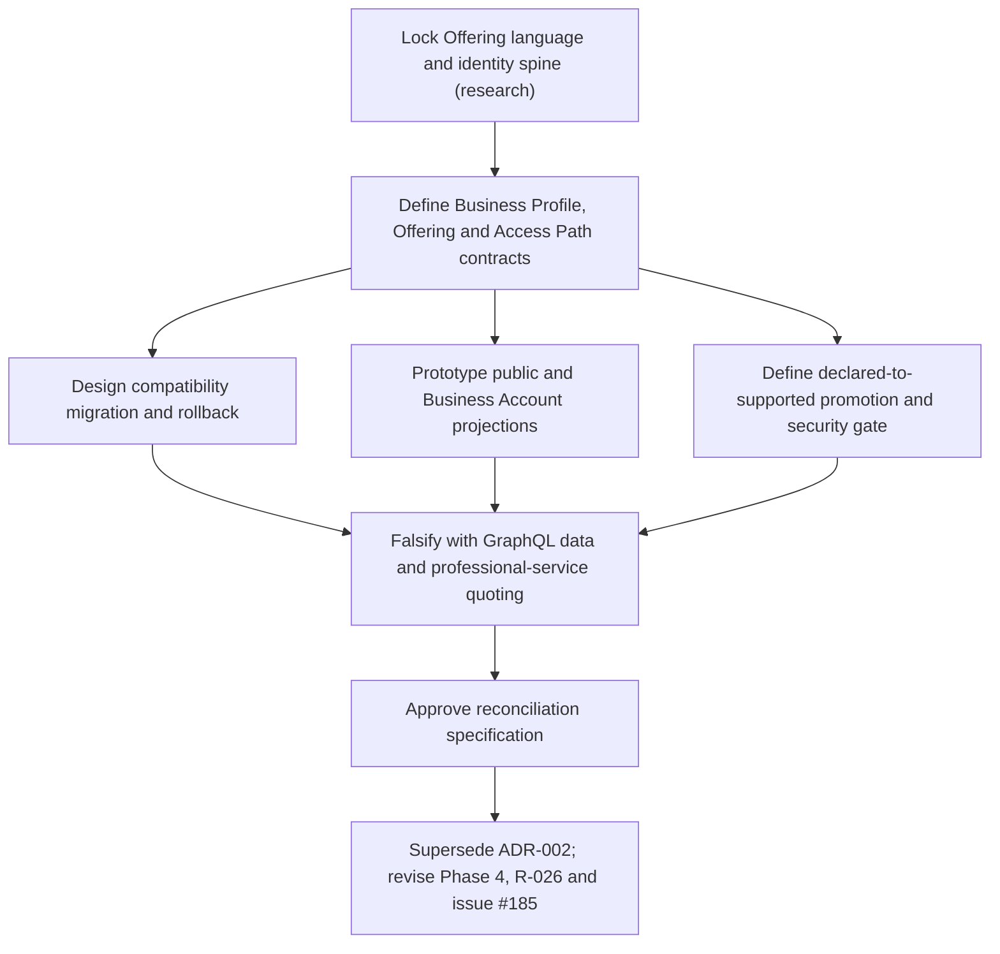

# Reconcile one business supply graph from listing to execution

Destination: a decision-complete, source-backed specification and migration
that preserves one Offering identity from directory discovery through optional
AE-supported execution. This feeds and narrows issue #185; it does not reopen
Customer Request or Action Invocation.

## Closure evidence

- [x] One Offering identity across catalogue and supported supply.
- [x] Business visibility without mandatory services.
- [x] Simultaneous human and machine access paths.
- [ ] Enforce exact promotion against current catalogue source rows.
- [ ] Persist crosswalks and complete dual-read/rollback cutover controls.
- [ ] Connect the safe projection to public, discovery and owner reads.
- [x] GraphQL data and engineering quote use the same contract.
- [x] ADR-002, Phase 4 and R-026 reconciled at decision/source-plan level.
- [ ] Live migration readback and Business Account UI cutover.
- [ ] Independently operated business validation.

## Premortem gates

A declared URL always retains its provenance and never implies AE support.
Directory publication performs no network call. Route generation consumes only
strict routeable supply. Any crosswalk mismatch leaves v1 authoritative. A
private-data or consequential promotion stops until its vertical rights,
quality and evidence gate exists.
