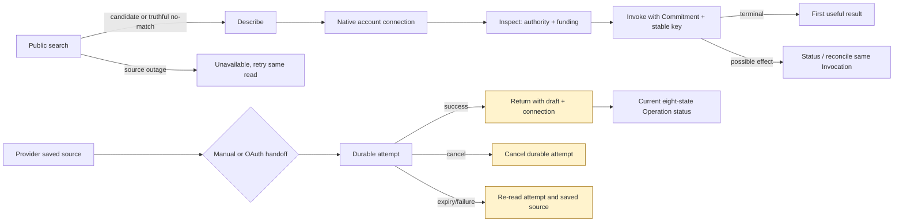

# Package 6 implementation review

**Review date:** 5 September 2026  
**Checkout:** original dirty checkout, branch `main` (confirmed with `git branch --show-current`)  
**Decision:** **CHANGES REQUIRED — local components are promising, but the connected Provider journey is not reliable across cancellation, replay and return-path failures. Public/native release remains correctly blocked.**

## Executive assessment

The implementation has good safety foundations: anonymous discovery is bounded to four read-only tools; no-match and catalogue outage are distinct machine results; inspection keeps funding separate from authority; uncertain Invocations point back to the same Invocation; connection records enforce owner, source and environment; Provider status is a shared eight-state projection with at most one continuation; and private support is now primary.

It does not yet deliver the complete connected journey claimed for P6-01–09. Four concrete Provider handoff defects can strand or mislead a user around an otherwise successful, uncertain or still-live connection attempt. A fifth public-page defect simultaneously says Provider information is unavailable and that no Operations are published. These are source-level behaviour defects, not missing polish. The focused `19 files / 105 tests` claim is reproducible, but those tests do not exercise these cross-step branches. The repository import gate remains red exactly as documented.

## Findings

### P1 — “Cancel” leaves the pending Provider connection attempt live

**Confidence: high. User consequence:** an owner who clicks Cancel has only left the page. The same manual handoff can still accept a credential, and the same pre-OAuth handoff can still start OAuth, until the attempt expires. This finding concerns the pending AE attempt only; it does not imply that cancellation should revoke an already saved connection.

The requirement explicitly says to check “the Provider handoff from a fresh process, another account, **cancellation**, expiry and changed source” (`docs/guides/package-6-plugin-release.md:136-138`). The two buttons only navigate:

> `<Link to="/owner/offerings/new" ...>Cancel</Link>`

at `src/routes/_operator/owner.supply.connections.new.tsx:167-170` and `:243-246`. There is no cancellation server call or mutation. The durable contract admits a `cancelled` state (`src/modules/capability-supply/internal/supply-funnel/provider-connection-handoff-contract.ts:18-30`), but a repository search found no write that produces it. Manual completion accepts every unexpired `pending` attempt (`provider-connection-handoff.ts:275-286`); MCP OAuth start does the same (`:369-377`).

**Minimal fix:** add one owner-bound cancellation command to the existing attempt authority, make the button await its authoritative `cancelled` readback, and then return with the saved draft reference. A late callback must refuse the cancelled attempt. Do not revoke an existing connection.

### P1 — Reopening a consumed MCP handoff drops the connection required to restore its saved source

**Confidence: high. User consequence:** after OAuth succeeds, reopening the stable attempt and choosing “Return to Add service” can land on a fresh form instead of the exact saved source and selected Operation.

The manual consumed branch passes all three facts:

> `connectionRef={loaded.attempt.connectionRef}`  
> `environment={loaded.attempt.environment}`  
> `draftRef={loaded.attempt.draftRef ?? loaded.attempt.candidateDraftRef}`

at `src/routes/_operator/owner.supply.connections.new.tsx:74-77`. The MCP consumed branch passes only `draftRef` at `:187-196`. That produces `/owner/offerings/new?draft=...` because `ReturnToAddService` omits connection and environment whenever either is absent (`:274-284`). The saved-source resume path requires `state === 'connected'`, a stored connection, and exact equality with the supplied `connectionRef` (`src/modules/capability-supply/internal/supply-funnel/source-first-owner.ts:373-379`). With no connection query parameter it returns `not_found`; the destination renders `initial` only for `available`, silently falling back to a fresh form (`src/routes/_operator/owner.offerings.new.tsx:34-56, 74-78`).

The direct OAuth callback redirect correctly carries connection, environment and draft (`src/routes/_operator/owner.supply.connections.oauth.callback.tsx:36-47`), so the defect is specifically the fresh-process/reopened consumed-attempt path required by Journey C.

**Minimal fix:** make the MCP consumed return identical to the HTTP consumed return by carrying `connectionRef`, `environment` and the draft. Add one black-box route test that opens a consumed MCP attempt, follows the rendered link and observes the same selected source/candidate.

### P2 — An MCP attempt read outage is reported as absence and recommends starting again

**Confidence: high for the source mapping; medium for full browser presentation. User consequence:** a transient backend read failure during the MCP “Continue to sign in” POST produces missing-attempt guidance instead of preserving the stable attempt and saying no state was confirmed. This does not itself discard the draft or prove a duplicate external effect.

`startOwnerMcpProviderConnection` treats every non-available safe read as `not_found` (`src/modules/capability-supply/internal/supply-funnel/provider-connection-handoff.ts:369-373`). Its helper converts every thrown read into `not_found` (`:808-813`). The resulting copy says:

> `This connection request is no longer available. Return to Add service and start again.`

for `not_found` at `src/routes/_operator/owner.supply.connections.new.tsx:289-301`. Manual HTTP completion correctly preserves `source_unavailable` when the same read throws (`provider-connection-handoff.ts:275-280`). This violates Journey D's distinction between unavailable and absent and its rule that “Try again” appears only when known safe (`research/PACKAGE-6-INVERSE-PREMORTEM.md:471-486`). An initial route-loader exception has not been black-box demonstrated and should be treated separately.

**Minimal fix:** give the safe read a distinct `source_unavailable` branch. Keep the same attempt reference, state that no connection state was confirmed, and offer a retry of the same read/start identity.

### P2 — The Provider landing page renders outage and empty-market claims together

**Confidence: high from source, corroborated by the parent review's local-browser transition check on port 3020. User consequence:** during a read outage the signed-out page says both “Supplier information is unavailable” and “No Operations are published yet,” turning unknown market state into a false empty claim.

On any loader error, `src/routes/for-providers.tsx:20-31` supplies an error message but also substitutes `tools=[]` and `operations=[]`. `AeSupplyAgentProof` interprets the empty array as authoritative absence:

> `No Operations are published yet. Be the first supplier to add one bounded job.`

at `src/components/ae/supply/AeSupplyAgentProof.tsx:26-28`. The parent reviewer observed both messages concurrently in the local browser. The existing component test covers only an honest empty state, not an unavailable read (`tests/unit/ui/supply-funnel-landing.test.tsx:39-42`).

**Minimal fix:** carry availability as a tagged read state into `AeSupplyAgentProof`, suppress catalogue facts during outage, and extend the existing route/component test with the error branch.

### P2 — Connection completion uncertainty tells the user to retry without authoritative readback

**Confidence: medium-high. User consequence:** if secret provisioning/finalization succeeds but the response is lost, the form clears the credential and says “Try again.” The next submission may return `not_found` because the attempt is already consumed, leaving the user to reload manually to discover success. Deterministic connection identity and server replay checks limit duplicate connection creation; this is a recovery/claim defect, not evidence of a duplicate Provider effect.

The UI clears the credential for every result and exception (`src/routes/_operator/owner.supply.connections.new.tsx:105-125`). The default refusal says only “AE could not confirm the connection. Try again” (`:289-301`). The server converts a thrown finalization call into `source_unavailable` after provisioning (`src/modules/capability-supply/internal/supply-funnel/provider-connection-handoff.ts:321-355`). On a late successful write/failed response, the retry's initial read sees a consumed attempt and exits as `not_found` before finalization replay (`:275-286`).

**Minimal fix:** on completion uncertainty, re-read the same attempt first. Redirect if consumed, retain the same attempt and allow resubmission only if still pending, and never claim no connection was created unless authoritative state proves it.

## Package 6 coverage

| ID | Static implementation | Observable proof reviewed | Assessment |
| --- | --- | --- | --- |
| P6-01 | Action-derived MCP annotations and tiered tool projection | Focused MCP tests prove exactly four anonymous tools, ≤8 KiB, and bounded authenticated projections | **Local pass; native auth compatibility/live client proof open** |
| P6-02 | `candidateDraftRef` is optional/additive; reserve validates owner, draft, digest, source URL/kind and environment | Convex integration tests include wrong owner/source/environment and replay cases | **Pass for manual OpenAPI binding** |
| P6-03 | Draft references added to manual/OAuth exit paths | Unit/integration tests cover callback and candidate binding, but not cancel, consumed-MCP return or late completion response | **Fail: findings P1/P2** |
| P6-04 | Shared eight-state projector, reason presentation, one continuation/owner handoff | Status unit/UI tests cover stale/unhealthy/lost credential/review and no duplicate validation scheduling | **Local pass; no live source transition proof** |
| P6-05 | Plugin scaffold and `/SKILL.md` import the same file | SEO/unit parity tests pass | **Local pass; install/publish absent by design** |
| P6-06 | Public value first; Codex primary; alternatives disclosed; copied commands use canonical origin | jsdom tests and parent local-browser spot checks; focused Playwright claim documented | **Local UI pass; first useful native result unproved** |
| P6-07 | Public Provider fit, cost/effect warning, publication/timing caveats | Component tests pass | **Copy pass; outage falsely renders empty market** |
| P6-08 | Private mailto primary; current-record links; diagnostics disclosed | Support unit tests and keyboard/browser checks pass | **Local UI pass; mailbox receipt unverified** |
| P6-09 | Touched surfaces largely use Operation, Provider, Account, authority, funding and Invocation distinctions | Copy/SEO/unit tests pass | **Partial: outage and completion copy still collapse states** |
| P6-10 | No approved canonical deployment | Release guide records unresolved `app.aecon.ai` and synthetic non-promotable environment | **Blocked** |
| P6-11 | No same-revision ChatGPT/Codex/Claude/Cursor proof | Local mocks/SDK tests only | **Blocked** |
| P6-12 | No verified publisher, directory listing or public installation | Release guide explicitly withholds claim | **Blocked** |

## Journey, architecture and quality assessment

- **Discovery/no-match/outage:** machine HTTP/MCP/CLI/skill parity is strong. `operationChoiceSearchOutputSchema` has a distinct `no_candidates` result (`src/modules/registry/operation-choice-contracts.ts:88-107`); thrown reads become the shared 503 problem (`src/routes/api.v1.market-operations.search.ts:30-46`). `tests/integration/operation-read-outage-parity.test.ts:19-75` checks HTTP, MCP, CLI, llms and skill. A real admitted candidate and useful no-match clarification remain live proof.
- **Authority/funding:** connection is described as access rather than authority; inspection produces a funding handoff separately and requires reinspection after funding in the shared skill (`plugins/agentic-economy/skills/use-agentic-economy/SKILL.md:36-58`). Existing operation tests cover insufficient authority, insufficient credit and exact continuations. These were read as inherited safety proof, not rerun as part of the claimed 105.
- **Invocation uncertainty:** source and tests preserve one Invocation reference, distinguish replay from reconciliation, and prohibit blind new Calls. The focused Package 6 suite does not contain the core dispatch/recovery tests, so this is static/mocked proof rather than new Package 6 end-to-end evidence.
- **Provider security:** owner and wrong-account checks fail closed at Convex reads/mutations; connected OpenAPI reuse verifies connection, Business, source URL, origin and environment before exposing a secret (`provider-connection-handoff.ts:462-503`). Secret bytes are cleared after use. The defects above concern lifecycle continuity and messaging.
- **Schema compatibility:** `candidateDraftRef` is optional in the read/write contract and persisted only when supplied. Existing `draftRef` remains accepted. No destructive migration is present. The release guide correctly requires preserving the additive field and existing records.
- **Architecture:** changes reuse action declarations, attempt/draft records, source readers, status projector, design-system components and canonical URL configuration. No second installer, OAuth stack, Provider schema, workflow engine, status machine, error taxonomy or ticketing system appeared in the reviewed P6 path.
- **Code quality:** core projections are compact and well typed. The primary weakness is branch asymmetry: HTTP vs MCP and direct callback vs reopened attempt have different continuation payloads, while UI fallback silently converts failed resume into a blank form. Tests mirror individual functions but miss the user-observable join.
- **Performance:** anonymous and authenticated tool payload budgets are asserted. Public Provider outage renders cheap empty arrays but at the cost of false semantics. No meaningful runtime performance regression is evident statically; no load or production latency proof was run.
- **Accessibility:** semantic buttons/links, live feedback, disclosure and 375/1440 overflow checks are present. The cited Playwright test proves keyboard activation and horizontal fit, not screen-reader announcements, 320 px, 200% zoom or a full authenticated Provider journey.

## Validation

All commands ran on the original dirty `main` checkout. Temporary process files were redirected to `/tmp/ae-p6-review.2fpS52`. A before/after `git status --porcelain=v1` diff was empty, so diagnostics did not mutate the checkout.

1. The exact focused command from `docs/guides/package-6-plugin-release.md:23-38`: **PASS — 19 files, 105 tests** in 11.07 s.
2. `npm run test:imports`: **FAIL — 10 files passed, 1 failed; 48 tests passed, 1 failed.** The sole failure reports exactly four `module-unowned-test-import` violations:
   - `tests/unit/capability-supply/openapi-preflight.test.ts:8` imports `capability-supply/internal/openapi-import/validation`.
   - `tests/unit/release/package5-reference-provider.test.ts:12` imports `capability-supply/internal/mcp-source-discovery`.
   - The same file at `:13` imports `capability-supply/internal/x402-seller-endpoint-inspector`.
   - The same file at `:14` imports `capability-supply/internal/openapi-import/validation`.
3. `git diff --quiet -- tests/unit/capability-supply/openapi-preflight.test.ts tests/unit/release/package5-reference-provider.test.ts`: **PASS (exit 0)**. Both reported files are unchanged in the dirty diff. The failure is correctly attributed and remains an unwaived repository gate.
4. Parent review spot check: six relevant local transition files, **30 tests passed** (reported by the parent reviewer); a signed-out local browser corroborated the Provider outage/empty-state contradiction. It did not enter an authenticated Provider handoff, so no browser transition proof is credited. Exact parent command/output is external to this report's own terminal log.

## Proof boundaries and blockers

| Proof kind | Established | Missing |
| --- | --- | --- |
| Static source | Access/authority separation, owner/source/environment binding, tagged status, no blind retry, additive schema | Correct cancellation write, symmetric return payloads, authoritative uncertainty recovery |
| Mocked/local tests | 105 focused tests; exact tool count/budgets; route/status/support/component contracts | Cross-route consumed MCP resume; cancel then late completion; response-lost-after-success; Provider outage vs empty |
| Local browser | Parent spot checks cover public agent entry, signed-out Provider entry and support; Playwright claim covers keyboard/375/1440 | Any authenticated Provider handoff transition, fresh authenticated process, second tab, expiry/cancel, screen reader, 320 px/200% zoom |
| Native/live | None credited | Plugin directory install, native authorization challenge/resume, real public Operation/no-match, real Clerk return, external OAuth/manual source, funding, first useful Call, uncertain Invocation reconciliation, revoke/reconnect |

Literal external blockers remain those in `docs/guides/package-6-plugin-release.md:51-68`: `app.aecon.ai` did not resolve on the recorded check; the available Package 4 release environment is synthetic and never promotable; publisher, support mailbox, legal content and reviewer access are unverified; no public listing or OpenAI connection ID exists; and current OpenAI authentication metadata compatibility is unresolved. These prevent P6-10–12 and any public/native support claim.

## Minimum release path

1. Fix the four local behaviour defects above using the existing attempt, draft, status and readback authorities.
2. Extend existing tests at the user-observable joins: cancel then late action; consumed MCP attempt to restored source; backend read outage preserving the same attempt; completion response loss/readback; Provider landing outage without empty claim.
3. Rerun the focused suite, relevant Invocation/inspection tests, import gate and compact/keyboard browser checks. Keep the import failure red until its owning tests receive exact registered exceptions or are refactored through public surfaces.
4. Only after an approved same-revision deployment exists, execute the release guide's real public search/no-match, native client authorization, Provider manual/OAuth, authority/funding and uncertain Invocation journeys. Publication remains a separate final gate.

## Post-review bounded remediation

The confirmed local transition defects were repaired after this review without a new schema, workflow or dependency. Cancellation now atomically closes a pending AE attempt; late OAuth prepare/finalize and HTTP finalize cannot create a connection, while cancellation after consumption is idempotent and leaves the saved connection intact. Consumed MCP returns carry the connection, environment and exact draft through the real Add service resume. Pending, cancelled and expired owner-bound MCP drafts restore their source inputs without claiming a connected preview. MCP attempt read outages remain `source_unavailable`. Manual completion response loss rereads the exact attempt and uses a stable per-attempt replay identity across reload instead of a fresh command.

Post-remediation validation: `npm run typecheck -- --pretty false` passed; four focused test files passed with 26 tests; `git diff --check` passed. These are local Convex/mock/jsdom proofs. Cancellation cannot revoke credential or OAuth token material already created outside AE by a losing in-flight request; it prevents that request from finalizing an AE connection. The public/native blockers above remain.
