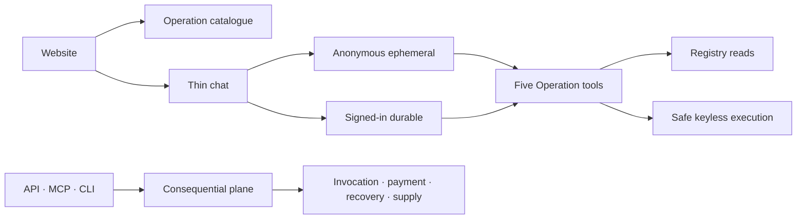

# Agentic Economy

Agentic Economy is an **Operation market**: a catalogue of callable capabilities
that people and software agents can search, inspect, compare, and invoke through
controlled contracts. The website chat is a thin adapter over that market. It is
not the product authority.



Chat exposes exactly five tools:

- `registry.operations.search`
- `registry.operations.detail`
- `registry.operations.compare`
- `registry.operations.inspectPlan`
- `operation.execute`

The first four read canonical Operation projections. The fifth may execute only
an eligible keyless Operation through the existing SSRF-safe network boundary.
Consequential invocation, payment, recovery, and supplier management remain on
the HTTP API, MCP, and CLI surfaces.

## Run locally

Use Node.js 22 and npm 11.5.1.

```sh
npm ci
npm run dev:local
```

Open `http://127.0.0.1:3024/market` for the catalogue or
`http://127.0.0.1:3024/t/new` for chat.

Useful deterministic checks:

```sh
npm run test:chat:conformance
npm run parity:check
npm run test:cli-package
npm run test:release:source
```

## Machine surfaces

Start with `/llms.txt`, `/SKILL.md`, `/.well-known/ucp`, or `/mcp`. Canonical
Operation reads live under `/api/v1/market-operations/*`; consequential calls
start at `/api/v1/operations/call`. The compiled client is
`@agentic-economy/cli`:

```sh
npx @agentic-economy/cli search "weather forecast" --limit 5
npx @agentic-economy/cli inspect <operationRef>
npx @agentic-economy/cli call <operationRef> --input '{"city":"Perth"}'
```

The `/api/v1/services/*` routes are retained compatibility views, not parity or
discovery authority. Browser-only anonymous chat at `/api/chat/anonymous` is not
advertised as a machine Agent API.

## Migration status

This branch is a **Release-B source candidate**: the old runtime, readers, and
eleven legacy schema declarations have been removed from source. That does not
prove a production drain, export, Release A deployment, Release B deployment,
staging smoke, or table deletion occurred.

Before any irreversible data deletion, identify the exact production deployment,
export and verify each legacy table, deploy and verify the staged releases, and
obtain a separate typed human confirmation for every table. See
[the architecture and rollback runbook](.planning/codebase/ARCHITECTURE.md).
