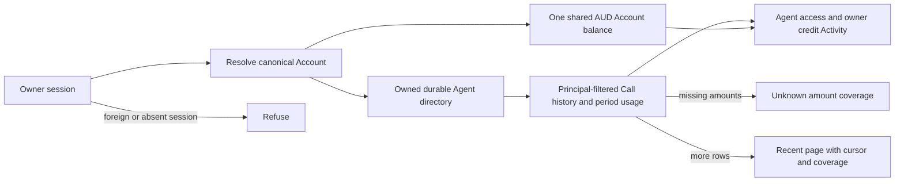
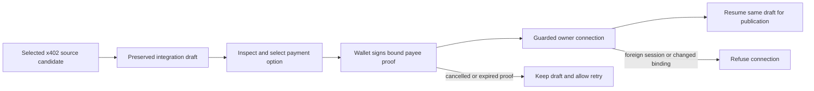

## Cold-review source closeout — 2026-09-08

**Status: source repairs and verification independently accepted with the retained
standards baseline; owned source checkpoint committed.**
This dated receipt supersedes earlier pending statements, not their historical
outputs. C01–C19, all thirteen discovery gaps and the subsequent bounded
verification repairs are accounted for below and in the existing plan. This is
source acceptance, not an aggregate-green or production-release claim.

Owned source/current-documentation/package checkpoint:
`5f313129775c91de88e6cef819800bd116e31168` — `fix: complete vocabulary cutover journeys and contract consumers`
(**136 paths**). The subsequent serialized governance commit contains this
receipt, the maintained coverage map and the unchanged cold-review register and
raw evidence. No remote push, deployment, data activation or publication occurred.
Final evidence review accepted the complete requirement/discovery-gap coverage,
check scope and retained holds. All **47 unrelated dirty paths** match their
preserved bytes/deletions; all **36 original audit files** remain byte-identical.

### Final source verification

Project commands used Node **22.22.0 / npm 11.5.1** in the original
`codex/vocabulary-rationalisation` checkout. The expressly authorized existing
CLI compatibility harness separately exercised Node 20 and Node 22 subprocesses.

| Check / exact command family | Result and scope |
| --- | --- |
| `npm run test:unit -- --no-file-parallelism` | **463 files / 4,200 tests pass** after C19. Subsequent test-render and navigation-copy deltas have their focused passes below. |
| `npm run test:integration` | **113 files / 1,109 tests pass; one file / four existing skips**, after deterministic probe scheduling repair. |
| `npm run test:conformance` | **42 files / 402 tests pass** on the repaired integration state. |
| `npm run test:chat:conformance` | **11 files / 55 tests pass**. |
| `npm run test:release:architecture` | **2 files / 21 tests pass**. |
| `npm run typecheck` | **Pass**, including the final JSX test rename. Later changes are reviewed copy/selector literals with focused browser/unit verification. |
| `npm run test:types` | **4 tests pass**. |
| `npm run gate:anatomy` | **5 parity/envelope tests, 49 import tests and 2 UI contract tests pass**. |
| `npm run test:seo` | **5 files / 28 tests pass**. |
| `npm run lint` | **Pass** after correcting the two children-prop errors with JSX, without suppressions. |
| `npm run test:ts-standards` | **Fails on the same 26 baseline findings**, with zero additions/removals comparing file, rule and excerpt independently of line numbers. No clean aggregate is claimed. |
| `npm run check:convex-codegen` | **Pass** after C19. |
| `npm run verify:convex-generated:anonymous` | **Pass: seven generated files byte-identical** after regenerating current source in an isolated anonymous local backend; shared deployment/data unchanged. |
| `npm run pack:cli:public` and `npm run test:cli-package` | **Pass**. Actual installed `--help` checks pass on Node **20.20.2 / 22.23.2**; package imports remain blocked. Packed and public archives match SHA-256 `99aaeac6f9b065ba0526e8746bf0f3f8b934632b1b87dc8dc4855bc0d1781fce`. |
| `npm run verify:release-integrity` | **Final build passes** after the Provider navigation label; generated protected paths and pinned Nitro integrity unchanged. Existing chunk-size/browser-externalization/WASM fallback warnings are retained. |
| Local Playwright public browser set | **28 pass / two viewport-specific skips**, across compact and wide Chromium. Exact five-file invocation below; no authenticated/hosted test bodies were run. |
| `env -u PLAYWRIGHT_BASE_URL npm run test:e2e:a11y` | **14/14 pass**, both viewports, one worker, after two stale heading assertions were corrected. |
| Installed offline React Doctor | Final staged/changed-source scan exits **0**, newCount **0**, baseTotalCount **30** after the renamed test is staged. The advisory commit hook reports **72/100 and 30 warnings** and exits successfully; no clean full-project health claim. |

Exact public browser command (through the pinned NVM runner):

```sh
env -u PLAYWRIGHT_BASE_URL npm exec --offline -- node tools/dev/run-with-cleanup.mjs playwright test tests/e2e/application-recovery.spec.ts tests/e2e/code-block-hit-target.spec.ts tests/e2e/developer-discovery.spec.ts tests/e2e/local-auth-boundary.spec.ts tests/e2e/owner-operations-compatibility.spec.ts
```

The browser runs started their own local Vite server with Clerk disabled and
terminated it normally. The configured local catalogue backend was unavailable;
retained `fetch failed`, missing-auth and safe error-boundary output therefore
qualify the result as navigation, keyboard, layout, local-auth and outage-path
proof, not populated/live catalogue or authenticated account proof. The CLI
matrix proves package integrity and installed help, not complete cross-harness
hosted commercial execution. Production money, deployment, recovery, dataset
rebuilding, operational ingestion/freshness/buffer policy (G02), Package 6/7 and
full-plan hosted/live acceptance remain **parked and open**.

### Final verification repairs and retained failures

- **Probe test scheduling:** the first final integration run had 1,108 passes
  and one failure: an automatically scheduled inactive probe could overwrite
  its manual healthy observation. The unchanged isolated test passed. The
  existing test now uses the established fake-timer hooks and awaits all
  scheduled work before seeding the intended observation, restoring real timers
  afterward. All admission, no-paid-canary and refusal assertions remain.
  Focused 1, related owner-funnel 21, architecture 21, full integration 1,109 and
  conformance 402 pass. No production scheduling behavior changed.
- **Owner route lint:** the two previously advisory children-prop findings were
  actual lint errors. `supply-owner-routes.test.ts` became `.test.tsx`; two
  equivalent JSX provider renders replace children props, with all guards,
  mocks and assertions preserved. **4 focused tests, lint and typecheck pass**.
- **Public browser consumers:** initial public browser results were 24 passes,
  two viewport skips and four failures. Two tests still used the removed
  `/operations` route/anchor or old installation heading. They now use `/tools`
  and `#tools`, preserve opaque `operation:v1:` references and complete
  query/history/refresh checks, and expect `Connect with Codex`. **10 focused
  browser cases**, then the complete **28-case public set**, pass.
- **Provider navigation copy:** the shared public navigation/footer label was
  an omitted canonical-role correction, not a retained marketing exception.
  `For Providers` and its three test consumers retain `/for-providers`, shared
  navigation semantics and every assertion. **Two files / eight unit tests pass**.
- **Accessibility consumers:** initial a11y results were 10 passes/four failures
  at the two stale headings. Exact assertions now use `Listed Providers` and
  `Connect with Codex`; keyboard, focus, route and compact layout checks remain.
  **All 14 a11y cases pass**. No production changes were needed.

The first direct public-browser invocation also failed before tests because the
wrapper could not find Playwright outside npm's executable path. The corrected
installed/offline invocation above passes; no package was downloaded or runner
changed. All failed checkpoints remain retained alongside successful reruns.

Evidence: `/tmp/ae-cold-final-checks-20260907.json` and its named logs;
`/tmp/ae-cold-react-doctor-staged-final-20260908.json`;
`/tmp/ae-cold-final-commit-preparation-20260908.json`;
`/tmp/ae-cold-final-ts-standards-baseline-comparison-20260907.json`;
`/tmp/ae-cold-fix-probe-race-review-20260907`,
`/tmp/ae-cold-fix-route-lint-review-20260907`,
`/tmp/ae-cold-fix-public-browser-review-20260907`,
`/tmp/ae-cold-fix-provider-nav-review-20260907` and
`/tmp/ae-cold-fix-a11y-labels-review-20260907` contain exact snapshots, hashes,
complete deltas and actual check output. Browser failure contexts/screenshots
are retained under `/tmp/ae-cold-public-e2e-failure-evidence-20260907` and
`/tmp/ae-cold-a11y-failure-evidence-20260907`. These are deliberate audit records;
transient browser output is not a source deliverable.

## Integrated completion finding C19 — 2026-09-08

**Status: source correction independently accepted; final integrated checks running.**
The completion audit disproved an earlier blanket OpenAPI exception:
`PublicToolDescriptor.operationId` is an AE-generated capability identity, not
an upstream OpenAPI field. The surrounding public DTO has no exact retained-name
exception. Correcting it is within the approved whole-source vocabulary cutover.
The earlier reports remain dated evidence, including this classification error.

Rename only this public descriptor field to `toolId` through its type, strict
schema, producer, wire serializer/deserializer, search/UI consumers and actual
HTTP/MCP/CLI/test fixtures. `toolId` names the stable capability identity;
`toolRef` remains the version-bound callable reference. No compatibility alias.
Preserve `CapabilityToolSourceRecord.operationId`, PublishedTool identity,
`createPublicToolRef` input/material, `current_operation_commitment:v1` material,
upstream OpenAPI fields, opaque prefixes and exact hash bytes. Those are separate
protected boundaries; their protection does not extend to the surrounding DTO.
No persisted schema, data, deployment, endpoint or dependency change is included.

Exact production seam: `tool-projection-types.ts` PublicToolDescriptor only;
`tool-project.ts` returned descriptor; wire types/serializer/deserializer;
`tool-schemas.ts` strict descriptor; `tool-search.ts` descriptor search text;
`AeToolContractSections.tsx` existing Tool ID value. Source-record fixtures keep
their protected names; returned public-descriptor fixtures use `toolId`.

Acceptance: actual projection → wire roundtrip → strict schema retains `toolId`
and rejects the old public alias; HTTP/MCP/CLI/UI consumers continue to work;
Tool reference golden value and commitment/digest tests remain unchanged.
Pre-change golden fixture (`capability:reference.lookup`, publication
`publication:reference.lookup` revision 3, contract `reference.lookup` version 1,
digest `digest:contract`) yields
`operation:v1:e44c003644675cf77edbadbfa296976d2cb0bc82d7d20445df92af940bc18f6b`.
A single bounded Luna Max owner implements; root reviews, runs installed Doctor,
rebuilds affected artifacts and completes integrated acceptance. Previous green
checks are retained as checkpoints, not proof of this pending DTO correction.

C19 source receipt: complete **15-file** producer/type/wire/schema/Convex return
validator/search/UI/test correction independently reviewed, with all final
hashes matching. **14 existing test files / 234 tests pass**, including the
added strict-alias/golden regression; coherent typecheck and diff check pass.
The initial six canonical-read failures were real Convex return-validator
mismatches; correcting that public validator produced **20/20** canonical-read
passes. No stored schema or protected hash/source-record field changed.
Final installed offline Doctor exited 0: two previously accepted route-test
children-prop findings, baseTotalCount 30, no C19-attributable diagnostic.
Candidate: `/tmp/ae-cold-fix-tool-descriptor-id-review-20260907`;
Doctor: `/tmp/ae-cold-react-doctor-tool-descriptor-id-20260907.json`.

## Cold-review repair plan — 2026-09-07

**Status: independent review accepted; implementation authorized (2026-09-07).**
This plan supersedes the repair-order suggestions below, not the retained audit
or earlier dated verification. It covers all eighteen consolidated findings and
all thirteen discovery gaps in the [cold-review register](./WF-20260905-vocabulary-cold-review-20260907.md).
Raw reports and bad-behavior probes remain unchanged. Passing those probes proves
the old defects; it is not regression acceptance.

### Outcome, authority and boundaries

Restore complete journeys across actual producers, validators, consumers and
human/agent guidance. Validate meaning against `PRODUCT.md` and `CONTEXT.md`, not
only spelling. Implement only in the original dirty checkout on
`codex/vocabulary-rationalisation`; a19f remains outside the write boundary.
Preserve all pre-existing unrelated edits, protected identifiers, protocol
vocabulary, hash material, evidence and historical records. No deployment,
publishing, dataset rebuild, migration, new service or dependency is included.

Root owns sequencing, integration, evidence and serialized owned local commits.
Bounded Luna Max owners implement one complete boundary at a time; independent
read-only preparation/review may overlap, source ownership may not. Each owner
reads PRODUCT, CONTEXT, the qualified finding and relevant project/skill rules.
Convex writers additionally read the generated project guidelines and Convex
expert guidance. Relevant frontend checks include the installed React Doctor;
reuse existing components, SDKs, validators and test infrastructure. The separate
oversight task reviews this plan and final evidence without competing edits.

Reference-product research supports reuse of current scoped Agent connection,
Account/budget and recovery boundaries: [Locus agent connections](https://docs.paywithlocus.com/locus-pro/connect-agents)
and [Nevermined API documentation](https://nevermined.ai/docs/api-reference/introduction).
It does not authorize copying their services or adding orchestration to AE.

### Decisions surfaced before implementation

1. **C15:** add the canonical `quote` endpoint discriminator. No current kind
   correctly describes a Quote; `call` and discovery `tool_read` would conflate
   distinct stages. Update both manifest projections and exhaustive consumers.
   This is a narrow public discriminator correction, not a new endpoint.
2. **C10/C18:** atomically cut `ae supply operations` over to `ae supply tools`
   across registration, help, examples, tests and packaged surfaces. No alias;
   protected external operation names and hash fields remain exact.
3. **C04:** add a bounded owner-only read projection using existing owner
   authorization and Call indexes, with shared Account AUD balance. Use the
   current UTC calendar month explicitly for usage (the activity page precedent),
   recent paginated activity, and explicit incomplete amount coverage. Do not
   manufacture all-time totals or revive the retired USD ledger. This extends
   an internal owner read contract; no new persisted schema is proposed.
4. **C08:** select evidence against trusted active custody identity/generation,
   not arbitrary newest environment rows. Retain append-only history and fail
   closed on genuine conflicts. Bounded discovery confirms the V8-safe existing custody config parser and
   budget-ref helper can be exposed through capability-supply/convex.ts; use
   Convex env and the existing custody/generation index descending for one row.
   No persisted-treasury TTL/future-clock tolerance is established; do not invent
   one from unrelated 15-second evidence rules. G02 retains those policies and
   ingestion/activation as explicit operational work.
5. **G03, retained contract:** PRODUCT requires an unexpired Quote. Expiry is
   checked before consumed replay; retain this behavior and document existing
   Call status recovery when the Call reference is available. Extending replay
   retention is optional future contract work, not a blocker or confirmed defect.
6. Joel authorized running the existing installed CLI Node 20/22 matrix. Project
   commands remain Node 22/npm 11.5.1; only that unchanged script's established
   compatibility subprocesses use its Node 20 path. No temporary runtime workaround.

### Dependency and ownership queue

| Wave / bounded owner | Responsibility | Dependency / acceptance |
| --- | --- | --- |
| A1 producer | C01 owner Tool readback | First P1; real backend-to-server-to-route projection passes |
| A2 evidence | C16 durable late-observation digest | Exact established digest/replay and conflict behavior pass |
| A3 authority | C09 independently expired grant | Shared authorization refuses expired/equal-boundary grants |
| B1 owner money | C04 owner Agent activity/credit | Current AUD producer and both UI journeys agree |
| B2 treasury | C08 active custody evidence selection | Trusted identity/freshness contract reviewed; history retained |
| B3 Provider handoff | C05 x402 source-first connection | After A1; existing wallet proof and draft return path work |
| C1 discovery | C02, C06, C07 | Correct inventory, bounded links and empty-page continuation |
| C2 agent surfaces | C03, C12, C13, C18 plus C10 CLI verb | Producers stable; all advertised continuations execute |
| C3 HTTP manifests | C14, C15 | Reviewed discriminator; authenticated request/parser contracts |
| D1 semantic/UI/docs | Remaining C10, C17, ubiquitous-language findings | Stable names/contracts; current copy, docs and semantic claims agree |
| D2 browser consumers | C11 | Updated actions, scopes, selectors; substantive assertions preserved |
| E root integration | Cross-surface checks, independent review, fixes, owned commits | Every row has evidence or explicit justified runtime/decision hold |

Global tests/builds run after source ownership. A larger boundary’s sole owner
may be assigned one coherent typecheck at stable handoff; root never runs a
concurrent compiler. Owners run narrow behavioral checks first; root runs final
integrated checks against the coherent complete state. New evidence can adjust file ownership within the same boundary; material
contract, storage, dependency or activation expansion must be surfaced first.

### Changed flows and failure outcomes





Discovery pagination separately preserves continuation through a health-filtered
empty page whenever later raw pages remain; only exhaustion permits the no-Tool
fallback. Proof cancellation never implies publication; shared Account funds
never imply Agent authority.

### Finding implementation and regression matrix

| ID | Concrete repair / reuse | Observable acceptance and failure coverage |
| --- | --- | --- |
| C01 | In `convex/capabilityProviderTools.ts`, align validator/response `tool` with `provider-workspace.functions.ts` and owner supply route. Complete the actual producer/consumer chain. | Extend provider workspace tests through real Convex readback and actual server consumer/route guard; ready Tool renders, missing/refused/foreign-owner states remain truthful. Do not merely replace a successful mock field. |
| C02 | Replace retired `registry.operations` inventory prefix in `supply-landing.functions.ts` with actual `registry.tools` descriptors. | Existing supply-landing route test uses real registered action IDs; `/for-providers` presents the current callable surface. |
| C03 | Correct stale `operation.status` in account safe continuations and latent `operation.invoke` in funding handoff. Use current registered status/balance/Quote guidance appropriate to state; funding never automatically authorizes a new Call. | Assert actual manifest/MCP descriptions and serialized outputs refer to real actions; preserve deliberate compact projection omissions. Funding-unavailable/pending/success guidance remains semantically correct. |
| C04 | Replace `MoneyQueryPort`/USD retired-ledger caller in `agent-access-console.ts`. Reuse `resolveBusinessActor`, owned directory/grants, `moneyAccountFundingFormance` Account balance and `capabilityCallProjections`. Extend owner projection with principal-filtered paginated current Call DTO and explicit period usage. Update view model and both Agent access/owner credit consumers. | Real owner/stranger/anonymous authorization tests; canonical Account from session, Agent principal from owned directory. AUD exponent 6 integer amounts; missing amounts never zero. Preserve credential attribution, delivery/payment/Call state separation and `toolRef`. Activity max 50/cursor, directory max 25 separately; label recent/truncated if continuation unavailable. Usage `[start,end)` retains 366-day cap, initial UTC month, settled-charge amount only with explicit complete coverage: sum valid settled rows, exclude released/refunded, and mark unknown/not_applicable/missing amounts uncovered. Denominator/counts describe Calls created in the selected UTC period, not charges settled during it or net/final-accounting spend. Mixed payment states and fallback usage amounts must not manufacture complete spend. Agent bearer reads remain separately tested. Canonical Agent activity/usage must survive an empty or unmatched provider-key/grant inventory: attach owner readback by principal directly, using credentials only for attribution/control enrichment. |
| C05 | Connect source-first x402 handoff to existing inspect/payment-selection/payee-proof/wallet-signing/`connectOwnerX402` path; preserve durable source draft and return to publication. Reuse source-first-owner.ts, supply-funnel.functions.ts, supply-compatibility.ts and existing AeProviderWorkspace/AeOwnerProviderConnections panel; carry exact URL/method/environment and return existing owner.offerings.new draft/connection route. Existing x402 integration draft already supports owner-bound storage; do not expand HTTP/MCP attempt model. Keep httpCredentials rollout flag HTTP-only while preserving all x402 rollout/authorization/payment-profile/write/proof guards; no deployed flag change. Test HTTP refusal with its flag disabled while supported x402 follows its own guards. | Existing route/connection/publication tests cover valid selected option, cancellation, invalid or changed candidate, wrong wallet/claim, foreign owner, expired payee claim and resumed draft. Resume must refuse another owner’s draft or mismatched connection/environment. x402 integration draft itself has no cancellation/TTL state: abandonment preserves it; changed source/candidate refuses with source_changed. Do not apply HTTP/MCP attempt expiry to x402. No fake OpenAPI branch, bypassed payee proof or generic unavailable fallback. Exact publication authorization remains enforced; G08 governs eligibility. |
| C06 | Reuse shared bounded `callableAlternativesHref` projection from `suggested-next-action.ts` in full/compact Tool inspector. | Rendered href checks for long query (>200), encoding and routeable filter match producer. Preserve existing default `window=30d`; it was not the defect. |
| C07 | Preserve cursor/continuation when health filtering yields an empty raw page with more pages. Suggest a Service request only after exhaustion. Reuse current opaque cursor and shell-safe origin builder. Qualify empty-page CLI copy and the existing JSON note by page versus exhaustion; the note remains health-neutral for explicit health filters. | Real producer empty first page → later routeable page → executable CLI continuation. Cursor, filters, selected origin and JSON survive. Final empty page offers legitimate fallback. No speculative cursor-corruption redesign. |
| C08 | Replace newest-two-environment/length-one shortcut in `capabilityQuotes.prepareFinancialSubjects`. Reuse existing `by_custody_and_observedAt` index and trusted active custody/generation; select newest applicable authoritative observation with bounded reads, then validate existing shape/network/capacity rules. Treasury TTL/future-clock policy remains explicitly unimplemented under G02. Never fall back to older healthy evidence when the newest applicable observation is invalid or negative. Keep `moneyTreasury.recordObservation` append-only. | Real Convex rows: one valid observation; two same-custody historical observations; old generation/other custody; conflicting identity; malformed/missing evidence; correct newest applicable evidence and refusal behavior. No unbounded scan, deleted history or arbitrary first-row acceptance. Do not import CDP Node SDK into query isolate. Derive active tuple from existing V8-safe config/budget-ref helper exposed through capability-supply/convex.ts; no new treasury freshness policy. Test invalid/missing config and no active match fail closed. |
| C09 | Check normalized grant expiry independently at existing consequenceNow and finalNow decision points in shared `authorityBoundary.ts` authorization before Self acceptance, preserving downstream admission controls and the post-async recheck. | Real live credential with expired/equal-time grant refuses at both decision points, including expiry crossed during async snapshot work; current grant succeeds; revoked/stale generation/other bindings refuse. Normal issuance often aligns expiries; make no unproved spending-bypass claim. |
| C10 | Finish ordinary product/operator navigation, accessibility copy, install/help/status/support/privacy, plugin descriptions, current DESIGN/START_LINE prose and workflow labels. Atomic CLI `supply tools` cutover as above. Include AeCompromiseRecoveryChecklist, AeCapabilityList, AeOperatorRouteStates, admin.index-health and owner.supply.connections.new. | Semantic cross-surface pass plus relevant rendered UI/CLI/plugin/help tests. Provider replaces supplier-role prose only when that is the actual role; Service/Offering/Source/Publication remain distinct. Preserve upstream OpenAPI operationId, x402 seller and exact protected identifiers. Do not rename artifact paths merely to change workflow display text. |
| C11 | Repair deploy-smoke actions, current card selectors and invalid negative selector; update authenticated lifecycle actions/scopes/token assertions to actual registry/contracts. | Existing browser/source fixture checks retain auth refusal, idempotency and negative assertions. Local public browser checks use existing isolated setup. Hosted/authenticated execution only in separately authorized environment; test discovery or source inspection is not runtime proof. |
| C12 | Align cold-loop recipe receipt/reuse steps in manifest to actual registered runners (status/history as applicable); do not invent commands to satisfy stale prose. | Every advertised executable step resolves to real registration and appropriate purpose; happy and recovery recipes remain usable. |
| C13 | Use shared `continuationCommand` and baseUrlSource behavior for request/doctor/connect results, including creation, list/status, refusal, timeout and reuse. | Fresh CLI process follows printed command at non-default origin with JSON retained; shell-hostile opaque values, IPv6/loopback and quoted origin remain safe. No unsupported origin-data-leak claim. |
| C14 | Enforce declared JSON Content-Type for Quote/Call/recovery through Node 22 built-in MIMEType where compatible with this server boundary, reusing the existing bounded JSON reader. Preserve authentication order. Avoid copying weak substring acceptance. | Authenticated text/plain JSON and missing/invalid media type return 415 without effects; valid mixed-case application/json with charset accepted; malformed JSON 400 and over-limit body 413; unauthenticated behavior and valid Quote/Call/recovery preserved. No CSRF/auth-bypass claim. |
| C15 | Add `quote` to endpoint-kind contract/classifier using actual TOOL_QUOTE_ACTION_ID; update top-level and nested projections plus exhaustive consumers. | Quote is classified consistently, never Call/discovery; all remaining kinds stay correct; intentional compact MCP `{result: output}` envelope unchanged. |
| C16 | Restore protected established `invocationRef` digest key in Convex generic Action execution late observation, matching development durable port. | Shared exact digest vector plus real both-port late replay: same material idempotent, legitimately changed material conflicts. No alias, migration or new canonical digest format. |
| C17 | Repair two current roadmap file links to AeProviderWorkspace and provider workspace test. | Links resolve to real files; historic claims remain dated and qualified. |
| C18 | Make supply.status businessRef/toolRef requirements truthful in help, onboarding and examples. Inventory is existing renamed `supply tools`; no optional-status fallback. | Advertised commands parse with concrete refs, missing Tool gives current useful help; quoted variables include explicit substitution instructions. Properly substituted commands were not broken by placeholder syntax. |

### Ubiquitous-language acceptance

Validate complete meaning in definitions, source comments, DTOs, product screens,
CLI/HTTP/MCP/plugin instructions and current documentation. The callable supply
unit is Tool; portfolio Service, Offering, Publication, Listing, Source and
Provider connection remain distinct. Generic Action execution is not a purchased
Call. Customer/Agent product roles are not generic IAM Principal/Account/User.
Provider, fixed buyer-facing Seller and payment recipient remain separate.
Funding is not authority; settlement is not delivery; delivery is not Purchase
resolution/status. The host owns the larger task and memory.

Qualify CONTEXT's opening compatibility/“Until then” statements against the
accepted source cutover: historical/protected mappings are retained, not blanket
permission for new old-name aliases. Qualify PRODUCT's accepted-implementation
Quote paragraph against the real DTO: do not claim explicit Provider/Seller and
full commercial terms are implemented where source only proves version/input,
price/Account/budget/policy bindings and evidence digest. Preserve the target
principal-reseller direction and explicit remaining implementation work.

Correct the misleading protected `callRef` comment in
`spending-policy-evaluation.ts` to established `invocationRef`; no hash change.
Clarify the generic Action execution kernel header in `action-execution/runtime.ts`
and its use by the Call lifecycle; no export rename. Preserve the already-correct
protected operationRef projection explanation in contracts. The Tool ID displayed in AeToolContractSections is an AE-generated identity;
C19 corrects its surrounding public DTO field to `toolId`. Only actual upstream
OpenAPI fields and the exact protected source/hash keys retain `operationId`.

### Discovery-gap dispositions (separate from confirmed fixes)

| Gap | Evidence / disposition / closure condition |
| --- | --- |
| G01 installed/hosted/client matrix | Run Joel-authorized existing Node 20/22 installed package matrix after build. Hosted revision, deployed schema/data and live client acceptance stay explicit existing 31/35 release gates; local success does not prove them. |
| G02 treasury ingestion/activation | Repository search finds no runtime caller of observer/recordObservation. Bounded discovery confirms no production observation caller or activation path, and observer does not supply bufferUnits. Separate operational decisions are invocation boundary, buffer policy and persisted-treasury max age/future-clock tolerance/stale behavior; unrelated 15-second evidence rules do not establish these. No scheduler/service or activation inferred. C08 source selection can close independently; production treasury evidence remains a release hold until authorized ingestion evidence exists. D1 qualifies the existing package-4-operations runbook’s observation step so helper availability is not presented as an activated pipeline. |
| G03 consumed Quote expiry replay | Investigated and retained: PRODUCT requires an unexpired Quote; readForCall checks expiry before consumed replay. Document current Call status recovery when reference is available; qualify package-4-operations stale-Quote steps to avoid a replacement Call after dispatch may have begun. Future replay retention extension is outside this refactor, not a blocker. |
| G04 grant expiry | Adversarial persisted state covered by C09; distinguish independently expired grant from normally aligned issuance. No extra finding or inflated severity. |
| G05 SKILL origin | Packaged public skill intentionally shares canonical production instructions regardless of origin. Retain documented invariant and test non-default-origin parity; no templating without a product requirement. |
| G06 chat recovery/context | Host owns project/task memory. Verify current six-tool/CLI/HTTP/MCP continuations via C12/C13; do not add orchestration, persistence or new recovery tools to fill this gap. |
| G07 legacy money schema leads | `CreditAccountView.accountId` has no current successful producer; current owner/Agent balance uses accountRef. ProviderEarningsView.truncated has no live semantics from unavailable/stub producer. Record latent unsupported boundary, do not fabricate a C04 Provider earnings fix. |
| G08 x402 connection eligibility | Investigated: UI lists same-Business available x402 adapter connections broadly; exact connection path re-inspects URL/method/payee/expiry/signature and staging verifies endpoint/payment/evidence/catalog target. No wrong-connection acceptance established; preserve these checks and no speculative eligibility-helper change. Generic source-first publisher versus stricter staging remains a runtime evidence distinction, not proof of a bypass. |
| G09 source-write gateway path | `/api/v1/release/operation-gateway` participates in exact request-binding evidence; path validation alone does not establish deployed route. Preserve protected material; document meaning, do not lexical-rename or claim actual route existence. |
| G10 example copyability | C18 improves explicit quoted variable setup/substitution. Ignored tools/ae/README is not a tracked finding, and correct substitution already worked. |
| G11 device URI/transport recovery | Inspected connect.ts: verification_uri receives text-only validation; interactive TTY opens it through the platform opener, suppressed for JSON/non-TTY/disable flag. No exploit demonstrated and no scheme/origin validation proved. Accepted bounded C13 repair: built-in URL parsing requires absolute HTTP(S) before opening; allow loopback HTTP and legitimate cross-origin OAuth verification. Invalid/missing/unparseable/non-web values produce clear protocol failure and no launch. Test HTTPS/loopback, bad schemes and existing JSON/non-TTY suppression. No exploit claim, same-origin restriction, new dependency or framework. |
| G12 Quote routes/MCP envelope | Literal routes and compact `{result: output}` projection are intentional and matched. Retain wire envelope; C15 fixes semantic classification only. |
| G13 baseline diagnostics | Preserve 26 standards failures, seven parallel CLI failures and React Doctor 116 advisory baseline as dated failed/advisory evidence. Run relevant checks sequentially and compare affected frontend findings; fix attributable regressions, never claim aggregate green by waiver or perform blanket cleanup. |

### Execution receipts

- **C01 implemented; independent scoped review accepted.** Only production changes are
  owner readback validator and producer keys `operation` → `tool` in
  `convex/capabilityProviderTools.ts`. Existing server consumer and route already
  require Tool. Real Convex owner publication/readback, actual server consumer
  and route render/refusal regressions cover published, missing, anonymous and
  foreign-owner results. Node 22.22.0/npm 11.5.1:
  `npm exec -- vitest run tests/integration/capability-supply-owner-funnel-read.test.ts tests/unit/server/provider-workspace-functions.test.ts tests/unit/routes/supply-owner-routes.test.ts --no-file-parallelism`
  passed **3 files / 17 tests**; `git diff --check` passed. Initial new-test fixture
  expectation failures were corrected and remain in the retained test receipt.
  No broad compiler, deployed browser or global check is implied. Coherent typecheck must validate the new server test query-helper assignability; resolve actual diagnostics at integration without rerunning unchanged tests. Review candidate
  retained at `/tmp/ae-cold-fix-c01-review-20260907`.
- **C16 implemented; independent scoped review accepted.** Restored established protected
  `invocationRef` digest key in Convex; fixed literal digest vector exercises
  actual Convex and development ports for applied/duplicate/material-conflict
  outcomes and stored digest equality.
  `npm exec -- vitest run tests/unit/action-execution/durable-action-execution-observation.test.ts tests/unit/action-execution/convex-handler-contract.test.ts --no-file-parallelism`
  passed **2 files / 6 tests**; `git diff --check` passed. Review candidate
  `/tmp/ae-cold-fix-c16-review-20260907`. No migration or hash format change.
- **C09 implemented; independent scoped review accepted.** Added normalized grant expiry
  checks at both existing consequenceNow and post-async finalNow decision points.
  Real shared authorization tests cover expired/equal/current and expiry crossing
  the async snapshot boundary.
  `npm exec -- vitest run convex/agentAccessPrincipals.test.ts tests/unit/convex/authority-boundary.test.ts tests/unit/server/agent-access-auth.test.ts tests/unit/server/agent-account-api.test.ts --no-file-parallelism`
  passed **4 files / 99 tests**; scoped `git diff --check` passed. A read-only
  follow-up attempt wrote no files and ran zero tests; the final write-enabled
  rerun supplied the passing receipt. Candidate `/tmp/ae-cold-fix-c09-review-20260907`.

- **A-wave coherent typecheck:** initial run failed with seven diagnostics in
  three new test fixtures: widened readonly control (C16), required router
  children props (C01) and typed query-helper assignability (C01). No production
  diagnostics. Bounded test-only correction now passes coherent `npm run typecheck`
  and all three affected files (2 + 4 + 8 tests). It uses a narrow `satisfies`
  fixture, explicit router children props and the actual typed query contract;
  no casts/suppressions or production changes. Initial failed receipt remains
  retained. Supplement `/tmp/ae-cold-fix-wave-a-types-review-20260907`; independent
  supplement review accepted. Already-run affected-test outputs are attached. C04 is now the sole source owner.

- **C04 implementation and final supplement independently accepted.** The
  owner readback now uses canonical Account AUD funding and principal-filtered
  Call history, independently of surviving credentials/grants. Created-period
  pagination, rotation deduplication, mixed payment/amount coverage and known
  empty usage are covered. Candidate `/tmp/ae-cold-fix-c04-review-20260907`
  contains ten files; independent review confirmed all hashes and the passing
  six-file **45-test** receipt plus coherent `npm run typecheck` (exit 0).
  Earlier stale fixtures failed before correction. The worker lost completed
  compiler metadata and started a redundant second run; root stopped it without
  further source edits. No second-pass result is claimed. An intermediate resume
  incorrectly selected Astra; those direct-principal/order edits were retained
  and tested, while original and final source work used Luna Max. Subsequent
  launch/resume commands explicitly pin model, reasoning, runtime and write mode.
  Final review required the zero-row unavailable Activity UI to remain distinct
  from known empty, and restoration of the existing two-independent-Agents test
  assertion alongside rotation. The accepted supplement below resolves both.
- **C04 frontend diagnostic:** installed React Doctor 0.7.7, offline, without
  supply-chain or remote-score checks, compared the current tree with
  `a51e17b221c6b73851c5873502d8150120ef3aad`. It analyzed 30 files in the changed
  scope (42 changed paths reported), with ten base diagnostics and four new
  warnings. Two C04 unnecessary sequential waits are assigned to the same
  supplement. Two route-test `no-children-prop` warnings are independently
  accepted advisory false positives: `React.createElement` supplies the required
  Router children prop without competing nested children. No suppression or
  file rename is needed. Report `/tmp/ae-cold-react-doctor-c04-20260907.json`.
  This scoped result does not relabel the earlier 116-advisory whole-tree result.

- **C04 supplement independently accepted; source acceptance complete.** The five-file
  supplement `/tmp/ae-cold-fix-c04-doctor-review-20260907` removes both unnecessary
  waits, distinguishes unavailable zero-row Activity with the existing refresh
  action, and restores the independent-Agent grouping assertion alongside
  rotation. Three affected files / **23 tests** and coherent `npm run typecheck`
  pass; scoped diff check passes. Final installed React Doctor report
  `/tmp/ae-cold-react-doctor-c04-final-20260907.json` contains only the two accepted
  route-test advisories, with no C04 diagnostics. Original and supplement failed
  attempts remain retained. C08 is now the sole source owner; no global-suite,
  deployed-runtime or treasury-activation acceptance is implied.

- **C08 independently accepted; source preparation boundary complete.** Candidate
  `/tmp/ae-cold-fix-c08-review-20260907` contains five files. The preparation
  boundary derives the trusted active custody reference/generation from current
  Convex configuration and selects only its newest indexed observation, then
  validates network, USDC/exponent, units, evidence and positive post-buffer
  capacity. Older healthy evidence is never a fallback. The existing budget-ref
  helper moved to the V8-safe configuration module with its hash material and
  Node export preserved; append-only storage/writer behavior is unchanged.
  Real preparation/observation regressions and existing Quote/config checks
  passed **3 files / 34 tests**; observer checks passed **1 file / 29 tests**.
  Final coherent `npm run typecheck` and scoped diff check pass. Two earlier
  compiler attempts found three then one attributable undefined-narrowing/test
  fixture diagnostics; fixes and affected reruns are retained. These are local
  source/preparation receipts, not deployed managed-Quote or ingestion proof.
  G02 buffer/freshness/activation decisions remain explicit. C05 is now the sole
  source owner.

- **C05 independently accepted; source scope complete.**
  The source-first x402 draft now opens the existing Provider connection panel,
  carries the saved endpoint/method/environment through inspection and wallet
  proof, and returns the confirmed connection to that draft. HTTP rollout is
  HTTP-only; x402 authorization, payment-profile and live proof checks remain.
  Route search uses a truthful discriminated union. Refresh/navigation failures
  retain the accepted connection for retry; handoff changes discard obsolete
  pending returns. Canonical URL comparison agrees with backend normalization.
  Original candidate `/tmp/ae-cold-fix-c05-review-20260907` (14 files), correction
  `/tmp/ae-cold-fix-c05-corrections-review-20260907` (7 delta files), and evidence
  `/tmp/ae-cold-fix-c05-evidence-review-20260907` (3 delta files) were independently
  reviewed. Original **11 files / 80 tests** and correction **5 files / 56 tests**
  passed; a later route environment edit was not covered by the original run,
  and the correction added its regression. The final evidence command
  `npm run test -- tests/unit/ui/owner-provider-connections.test.tsx tests/unit/capability-supply/source-first-owner.test.ts`
  passed **2 files / 27 tests**, followed by coherent `npm run typecheck` exit 0.
  Actual assertions now cover invalidate and navigation rejection retries with
  wallet/connect each once, handoff replacement during an in-flight refresh,
  cancelled/refused wallet proof, and resume with explicit or omitted environment
  metadata plus mismatched/foreign/changed-source refusals. The original panel
  test count alone did not establish all those cases. x402 drafts have no new
  expiry/cancellation storage; abandonment preserves the draft.
  Final installed Doctor `/tmp/ae-cold-react-doctor-c05-bound-20260907.json`
  failed with one new panel render-time ref mutation and the two already accepted
  route-test advisories (base total 15). The independently accepted one-file correction
  `/tmp/ae-cold-fix-c05-render-review-20260907` moves ref synchronization into a
  layout effect with the same primitive identity dependencies. The affected panel
  passed **9 tests** and final coherent typecheck exited 0. Final installed Doctor
  `/tmp/ae-cold-react-doctor-c05-render-20260907.json` exited 0 with only the two
  accepted route-test advisories and no C05 diagnostics. Failed receipts remain
  retained. All correction/resume turns were verified as explicit Luna Max.
  C1 discovery (C02/C06/C07) is now the sole source owner.
  No live wallet, hosted publication, global-suite or deployment proof is implied.

- **C02/C06/C07 independently accepted; discovery source scope complete.**
  Candidate `/tmp/ae-cold-fix-discovery-review-20260907` contains nine files.
  Supply landing selects actual `registry.tools` descriptors; the regression
  checks the four registered public IDs. Both inspector layouts use the shared
  normalized, 200-character alternative-search projection while preserving
  `window=30d`, routeable filtering and equivalent rendered URL semantics.
  Empty health-filtered pages retain the real producer cursor through transport,
  HTTP route and a fresh CLI process; the printed continuation preserves origin,
  filters and JSON mode and reaches a later routeable Tool. CLI/JSON copy is
  page-qualified and health-neutral; existing exhausted fallback assertions remain.
  `npm run test -- tests/unit/capability-supply/supply-landing-authority.test.ts tests/unit/routes/supply-landing.test.ts tests/unit/routes/tool-detail-route.test.tsx tests/unit/market-terminal/search-origin-continuation.test.ts tests/unit/market/suggested-next-action.test.ts tests/unit/market-terminal/cold-loop.test.ts`
  passed **6 files / 88 tests**, then final coherent typecheck and scoped diff
  check passed. Initial tests had two new expectation failures (router-normalized
  apostrophe encoding and safely unquoted origin); initial typecheck had four
  attributable fixture/result-narrowing diagnostics. Corrections and successful
  reruns are retained. The newly introduced whole-transport double cast was
  removed using the existing typed transport/fetch seam. Final installed Doctor
  `/tmp/ae-cold-react-doctor-discovery-20260907.json` exited 0 with only the two
  accepted route-test advisories (base total 17), no discovery findings. These
  are local source/CLI receipts; hosted acceptance remains separate. C2 agent
  surfaces is now the sole source owner.

- **C2a independently accepted; coherent C2 typecheck completed below.**
  The initial broad C2 owner performed inspection only and was stopped at the
  agreed context guard. Implementation was split into sequential registry,
  request/doctor, and connection groups without dropping accepted scope.
  Candidate `/tmp/ae-cold-fix-agent-registry-review-20260907` contains twelve files.
  C03 account activity advertises registered `call.status`; funding metadata
  points to existing funding status, balance and Quote reads and explicitly
  separates credit from authority or a new Call. Serialized manifest and actual
  registry regressions retain the intentional compact MCP omission of
  `invocationContract`. C12 recipes use registered history/status/wait steps;
  subprocess tests establish help availability and independent source inspection
  confirms the actual runner registration. They do not claim executed purchases.
  C10 CLI/C18 atomically replace `supply operations` with `supply tools`, with no
  alias, and align help/current examples with the pre-existing requirement for
  both status references. Missing Tool input gives canonical usage/help without
  fetching; quoted examples give explicit substitution directions.
  Sequential `npm exec -- vitest run <file> --reporter=default` receipts cover
  `tests/unit/agent-access/account-actions.test.ts` (**5**), and
  `tests/unit/market-terminal/{manifest-oauth,recovery,supply,cli-errors-help}.test.ts`
  (**4/19/11/16** respectively): latest per-file **55 passing tests**, not one
  combined run. Initial help assertions had one capitalization mismatch (15
  passed/1 failed); its correction and successful rerun are retained. The final
  supplement reran supply and manifest tests (11/4 passing); two intervening
  edits changed only test titles. Scoped diff checking passed. Independent review
  verified all twelve final hashes, source and evidence. C2b request/doctor is
  now the sole source owner; coherent C2 typechecking follows connection fixes.
  No global-suite, installed-package or hosted acceptance is claimed here.

- **C2b independently accepted; coherent C2 typecheck completed below.**
  Candidate `/tmp/ae-cold-fix-cli-guidance-review-20260907` contains request and
  doctor source plus three existing test files. Creation, refusal, list and
  status guidance preserves selected nondefault origin and JSON mode through
  the existing shell-safe continuation builder. Doctor passes the same options
  through supply/request/balance/Call/reuse diagnostics; recorded uncertain
  Calls continue through status/wait and Provider inventory uses `supply tools`.
  Review caught an introduced duplicate `--base-url` in the nonloopback config
  fallback, which the actual CLI parser rejects. The same owner corrected it to
  one sanitized origin plus the original output mode. The intentional existing
  loopback-to-hosted diagnostic remains explicit. Its regression follows the
  printed config command in a fresh shell; request creation separately follows
  an IPv6 continuation carrying a hostile opaque reference unchanged without
  executing its marker command.
  Sequential `npm exec -- vitest run <file> --no-file-parallelism` passed
  `tests/unit/market-terminal/request-origin-continuation.test.ts` (**4**),
  `request-memory.test.ts` (**5**) and `doctor.test.ts` (**11**): **20 tests**.
  Initial receipts are retained: request origin 3 passed, request memory
  1 passed/2 failed, doctor 2 passed/9 failed, before expected guidance was
  updated and the reviewed correction applied. Final scoped diff check passed;
  independent review verified all five hashes and complete source/test evidence.
  Both implementation turns were explicit Luna Max. C2c connection/URL repairs
  are now the sole source work. Global, compiler, package and hosted checks are
  not included in this bounded receipt.

- **C2c and the complete C2 group independently accepted; source scope complete.**
  Final candidate `/tmp/ae-cold-fix-cli-connect-review-20260907` contains only
  `tools/ae/commands/connect.ts` and its existing cold-loop test. Connection
  results and human guidance use exact shell-safe continuations with selected
  nondefault origin and original output mode, including Provider inventory and
  timeout. The device response validates an absolute HTTP(S) verification URL
  before output/opener; valid cross-origin HTTPS and loopback HTTP remain
  accepted. Missing, malformed, relative and non-web values refuse before a
  browser launch. Independent suppression cases cover JSON with a TTY, human
  output without a TTY, and explicit browser disabling. Fresh IPv6 CLI
  follow-through reaches the selected server; the human command line is exact,
  with no appended punctuation or bare secondary examples.
  Early review corrected an initially unwired validator and residual human
  suffix before testing. The first cold-loop run had **32 passing/11 failing**
  cases from new test setup (ESM mock, Provider option placement and empty-result
  expectation); corrections passed **43** tests plus unchanged manifest/OAuth
  **4**. Root's coherent C2 typecheck then found one TS2790 fixture deletion
  error. Final polish uses `Reflect.deleteProperty`, removes command-line
  punctuation, and advances timeout-test time at the token-fetch boundary rather
  than counting internal clock reads. The final
  `npm exec -- vitest run tests/unit/market-terminal/cold-loop.test.ts --no-file-parallelism`
  passed **46 tests**; assigned coherent `npm run typecheck` exited **0** against
  all C2 changes. Failed receipts and scoped diff checks are retained. Independent
  review verified both final hashes, complete source and raw evidence, and
  accepted C2a/C2b/C2c together. All five connection owner turn-context records
  were verified as explicit Luna Max. All 47 unrelated dirty paths were checked
  against the pre-repair baseline and remained unchanged, including deletions.
  C3 HTTP contracts are now the sole source work. No hosted OAuth/browser launch,
  deployment, global-suite or rebuilt-package acceptance is implied.

- **C14/C15 independently accepted; HTTP contract source scope complete.**
  Candidate `/tmp/ae-cold-fix-http-manifests-review-20260907` contains nine files.
  The shared Node 22 `MIMEType` predicate accepts JSON media types with valid
  case/parameters and refuses substring lookalikes. Quote/Call and both recovery
  handlers enforce the declared media contract without service dispatch on
  authenticated unsupported media. Review corrected the first recovery placement:
  cancel/reconcile already parsed before authentication, so media validation now
  runs after the authentication result while preserving their existing bounded
  body/JSON/schema order. Four new unauthenticated wrong/missing-media cases retain
  401/no service; authenticated cases return 415. Valid mixed-case parameterized
  Quote/Call/cancel/reconcile requests pass; existing body-limit and malformed-JSON
  behavior remains covered. The public Tool-read parser reuses the same predicate:
  actual list/search/describe/compare routes reject misleading JSON substrings
  before remote admission and a valid mixed-case request still succeeds.
  C15 adds the approved `quote` endpoint discriminator using the registered
  `TOOL_QUOTE_ACTION_ID`; full/compact endpoints distinguish Quote from Call or
  discovery and the already-correct nested gateway route is preserved.
  Final `npm exec --offline -- vitest run tests/unit/server/tool-market-routes.test.ts tests/unit/server/call-recovery-api.test.ts tests/unit/server/call-api.test.ts tests/unit/server/bounded-request-body.test.ts tests/unit/discovery/site-discovery-manifest.test.ts --no-file-parallelism`
  passed **5 files / 69 tests**; coherent
  `npm run typecheck -- --pretty false` exited **0**. Initial four-file results
  had 54 passing/2 failing new fixture assertions, then 56 passing after using a
  valid Quote DTO and the correct manifest field location. Root's added public
  route run had 8 passing/1 failing stale C1 empty-search-note expectation; the
  final supplement aligns that expectation with accepted C1 copy. Those receipts
  and the reviewed auth-order correction remain retained. Independent review
  verified all nine final hashes and complete source/test evidence. All four
  owner turn-context records were explicit Luna Max. No persisted schema,
  dependency, deployment or hosted proof was introduced. D1 language/documents
  is now the sole source work.

- **D1 semantic/UI/docs (C10 remainder, C17 and G02/G03) independently
  accepted.** The complete 36-file candidate updates current navigation,
  onboarding, status, support, privacy, plugin descriptions, workflow display
  labels and product documentation. Public status counts remain Offerings;
  generic Action execution, purchased Call, Provider/Seller/payment recipient,
  Agent budget, Customer-wide exposure and Account funds remain distinct.
  PRODUCT qualifies the actual Quote DTO against the fuller commercial target;
  CONTEXT no longer presents retained historical/protected names as current AE
  aliases. Two roadmap links resolve. The current runbook retains known-Call
  recovery after possible dispatch and explicitly leaves treasury ingestion,
  buffer and freshness activation unimplemented. Hash/protocol values and
  artifact paths remain unchanged.
  `npm exec vitest run -- tests/unit/operator-navigation.test.ts tests/unit/operator-shell-chrome.test.tsx tests/unit/ui/agent-door-page.test.tsx tests/unit/ui/demand-console.test.tsx tests/unit/routes/status-route.test.tsx tests/seo/agent-skill.test.ts tests/unit/routes/admin-source-authority-review.test.tsx`
  passed **7 files / 60 tests**; coherent typecheck, roadmap/link/plugin checks
  and diff check passed. Independent review corrected Customer-wide exposure,
  Call status wording, the AE-generated Tool ID label, recorded treasury
  capacity wording and Tool reference label. The final five-file supplement
  passed **1 file / 2 tests**, another coherent typecheck and scoped diff check.
  An initial shell-quoted string check failed before its corrected replacement
  passed; no source failure is concealed. Final installed offline Doctor exited
  0 with only the two previously accepted route-test children-prop findings
  (newCount 2, baseTotalCount 27), no D1-attributable diagnostic. Full 36-file
  and final five-file hashes/source/tests independently accepted. Candidates:
  `/tmp/ae-cold-fix-semantics-review-20260907` and
  `/tmp/ae-cold-fix-semantics-reviewfix-review-20260907`; final Doctor:
  `/tmp/ae-cold-react-doctor-semantics-final-20260907.json`.
- **D2 browser consumers (C11) independently source-accepted.** Exactly the
  staging chat and authenticated lifecycle test files now use registered Tool
  actions, current OAuth scopes/MCP name and actual `data-tool-card` markup;
  malformed negative selectors are valid and still assert zero purchased Calls.
  Exactly-once search, shared privacy, auth refusal, credential lifecycle and
  idempotency assertions remain. Coherent typecheck and diff check passed.
  Owner discovery listed **4 authenticated project entries**; its initial
  deploy-smoke discovery used the default configuration and selected no tests.
  Root's corrected
  `npm exec --offline -- playwright test --config=playwright.chat-staging.config.ts chat-browser-staging.spec.ts --list`
  exited 0 and listed **1 staging test**. These are parse/discovery receipts,
  not hosted/authenticated runtime passes. Both final hashes and complete diff
  independently accepted at `/tmp/ae-cold-fix-browser-consumers-review-20260907`;
  corrected discovery log `/tmp/ae-cold-browser-smoke-discovery-20260907.log`.
- **Integrated checks begun; completion remains unproven.** Complete-state
  typecheck passed. Existing Convex codegen dry-run then failed because C14's
  Node MIME parser import entered the shared portable body-reader module used
  by non-Node Convex bundles. Same C3 owner is isolating that Node dependency
  at its actual HTTP callers; no parser weakening or backend runtime change is
  authorized. Failure retained in
  `/tmp/ae-cold-final-convex-codegen-20260907.log`. Full integrated suites,
  artifact/package/browser checks, final review and owned commits remain open.

- **Integrated C14 runtime corrections independently accepted.** The strict
  MIME predicate is unchanged in meaning but now lives in the narrow
  `json-content-type.ts` server helper, loaded through a call-time dynamic
  Node import. Portable bounded readers have neither a Node import nor a
  re-export of the predicate. Both async HTTP consumers await their five
  checks in the existing authentication/body/dispatch order. This fixed the
  actual Convex bundle failure; the first codegen retry passed. The full unit
  suite then exposed eleven client-route module-scope Node import failures,
  so the call-time import correction was required as well. Its **5 files /
  176 tests** (55 HTTP cases plus 121 route graph checks) and coherent
  typecheck pass. Final codegen retry also passes. Candidates
  `/tmp/ae-cold-fix-http-runtime-review-20260907` and
  `/tmp/ae-cold-fix-http-lazy-review-20260907` were fully reviewed; root
  normalized only two incidental indentation slips before final hash review.
- **Integrated semantic assertion supplement independently accepted.** The
  first complete sequential unit run finished **458 files / 4,184 tests
  passing**, **5 files / 15 tests failing**. Eleven failures were the Node
  route import issue above; four cases expected stale Provider/recovery/workflow
  labels. Five expected strings across four existing test files now match the
  independently accepted copy, preserving all links, independent controls,
  confidentiality, credential-free release and ordering assertions. Affected
  checks pass **7 + 3 + 9 + 4 = 23 tests**. Full four-file diff and hashes
  accepted at `/tmp/ae-cold-fix-semantic-assertions-review-20260907`.
  The original failed full suite remains at
  `/tmp/ae-cold-final-unit-sequential-20260907.log`; the complete-state rerun
  and remaining integrated gates are still required. Current check receipts
  accumulate at `/tmp/ae-cold-final-checks-20260907.json`.

- **Integrated C16 import correction independently accepted.** The import
  guard found the observation test importing `DurableControlRow` from a private
  module. The identical type was already exported by the approved runtime
  facade. One erased type-only import now uses that facade; no production,
  manifest, exception or export change. Observation **2 tests**, module guard
  **11 tests**, and coherent typecheck pass. Full imports then passed **49
  tests** through `gate:anatomy`, whose discovery/envelope **5 tests** and UI
  contract **2 tests** also passed. Candidate
  `/tmp/ae-cold-fix-c16-import-review-20260907`; initial import failure retained
  at `/tmp/ae-cold-final-imports-20260907.log`. These are pre-C19 checkpoints;
  final public-descriptor acceptance remains separately required.

### Verification and closeout

For each owner, record files, concrete behavior, exact narrow commands/results,
new failures and limitations in this existing work record. Use actual Convex
producers and real registered contracts where they were previously hidden by
mocks. Await async effects before assertions. Check affected refusal/recovery
paths as well as happy paths. Tests for copy/link edits need only existing
appropriate checks, not ceremonial new infrastructure.

Root then runs the existing typecheck, Convex codegen check, full unit and
integration suites sequentially, type/import/conformance/release architecture,
anatomy, SEO/UI contracts, lint/standards, build/package and authorized installed
CLI matrix as applicable to the final changes. Use package.json's existing
commands and retain exact results; known failures remain visible. React Doctor
uses installed offline tooling. Browser checks use existing local public setup
where applicable; report authenticated/hosted/live checks as unrun unless their
environment is authorized and actually executed. No tool-list-only receipt is a
browser acceptance result.

Completion requires a per-C01–C18 implementation/test disposition, per-gap
investigated disposition, cross-surface semantic review, independent scoped
review resolved, generated/package consistency, and serialized commits containing
only owned changes. Restore/retain unrelated dirty edits exactly. Remove task
scratch artifacts except deliberate rollback/evidence records. Report source
readiness separately from outstanding commercial implementation, G02 activation
and parked runtime release gates. Never carry earlier green receipts forward as
proof of these later repairs.

## Cold audit follow-up — 2026-09-07

Five waves of three independent cold Luna Max reviewers and parent validation
identified eighteen open finding groups (1 P1, 13 P2, 4 P3). The
[consolidated audit](./WF-20260905-vocabulary-cold-review-20260907.md) records the evidence,
deduplication, limits and proposed repair order. Fixes remain pending. Earlier
source-review and verification receipts below remain dated evidence; they do
not establish that these subsequently identified findings are resolved.

## Current source closeout — 2026-09-07

All ten module groups, their material corrections, current documentation and
historical-header preservation passed independent review. The owned source
checkpoint is `3770b43bac9bf3ea11478664ee8249ec4ddf505e`. It includes the formatter
cleanup explicitly approved by Joel and leaves unrelated cleanup outside the
commit; two mixed files retain only their unrelated helper changes unstaged.

Final verification on Node 22.22.0 / npm 11.5.1:

| Check | Result |
| --- | --- |
| TypeScript and existing Convex codegen dry-run | Pass |
| Full unit suite, sequential, unchanged time limits | 463 files / 4,093 tests pass |
| Integration | 113 files / 1,091 tests pass; one file / four tests skipped |
| Type tests / imports / SEO / UI contracts | 4 / 49 / 28 / 2 tests pass |
| Lint / production build and generated integrity | Pass |
| Earlier unchanged-input conformance / release architecture / anatomy | 391 / 21 tests and anatomy pass retained |
| TypeScript standards | Fails on the exact original 26 findings; zero additions/removals |
| Default parallel test:all | Fails on seven five-second CLI timeouts; the five files pass 44/44 sequentially and the full sequential unit suite passes |
| Commit-hook React Doctor advisory | 74/100; 116 warnings; commit exits zero |
| Installed CLI Node 20/22 matrix | Pending Joel's explicit runtime exception decision |

The source evidence is accepted with these limitations. No green aggregate,
clean standards/React Doctor result, installed-package compatibility, hosted
deployment, data cutover, Package 6/7 promotion, legal approval or production
proof is claimed. Existing source issues are resolved at their reviewed source
boundary; package verification, hosted/runtime and overall closeout remain open.

Exact final receipts: `/tmp/ae-final-unit-sequential-20260907.log`,
`/tmp/ae-final-integration-20260907.log`,
`/tmp/ae-final-downstream-checks-20260907.json`,
`/tmp/ae-final-ts-standards-baseline-comparison-20260907.json`,
`/tmp/ae-final-test-all-20260907.log` and
`/tmp/ae-final-release-integrity-20260907.log`.
Earlier sections below are dated checkpoints and do not supersede this status.

## All ten module reviews accepted; final runtime checks — 2026-09-07

Independent oversight accepted the complete current documentation boundary
(21 paths: 17 changed, four preserved), the four historical headers and their
unchanged original bodies. All ten module groups now retain whole-module source
acceptance. The documentation/discovery check passes 46/46 tests and the coherent
compiler reports zero errors.

Public, Catalogue, Connection, Provider and Call runtime corrections are also
accepted. Call's one-file correction passes 30/30 tests and preserves attribution,
refusal and unexpected-error assertions. Money's two-file correction passes
12/12 focused tests and is completing handoff; Policy's one-file return follows.
Final integrated verification and owned local commits remain open.

The standards scan retains the exact recorded 26-finding baseline; this is not
a standards pass. The built CLI archive passes artifact integrity checks, while
its unchanged Node 20/22 compatibility test awaits Joel's explicit runtime
exception decision. Hosted deployment, data cutover, Package 6/7 promotion and
production proof remain separate and unperformed.

## Current integrated checkpoint — 2026-09-07

Native outputs verified unchanged; type tests4PASS, scopedlintPASS, actionaudit
35actions/zero findings. Globalcompiler86diagnostics29files. Public19/13 is
returned to the samePublicowner; earliermoduleconsumers67/16 retain their
existing owner assignments in issue32 and require integrated returns. Prior
bounded sourceacceptance8/10 is not fullintegratedacceptance. Packaging/current
docs/materialreview/ownedlocalcommits remain open; hosted/data/recovery/deploy
remain parked. Exact report `/tmp/ae-public-coherent-ownership-return-20260907.json`.

# WF-20260905-vocabulary: one familiar vocabulary across Agentic Economy

## Storage SOURCE ACCEPTED — 2026-09-07, eight of ten groups

Independent oversight confirmed closure of the sole recorded storage return dependency. Prior indexed-link/predicate review,22/22schema/import checks, scoped checks and native dry-run/generation plus4/4type tests were already satisfied. Accepted Tool/Quote/Call/Money producers and exact five-suite29/29PASS (`/tmp/ae-money-storage-return-20260907.log`) resolve the seven remaining Workpool/managed-booking failures. No earlier storage review item remains. Formal source acceptance8/10; Group9 Public implementation and Group10 current docs/integrated acceptance remain. This is bounded storage source acceptance, not data rebuild, runtime cutover or release permission. No repeat accepted checks required.

## Money SOURCE ACCEPTED — 2026-09-07

Independent oversight accepted the corrected immutable Money candidate after reviewing the complete42path boundary and exact2file readBooking correction. Current accepted baseline `/tmp/ae-money-review-corrected-candidate-20260907/manifest.json`. No remaining Money finding; protected v1 digest/claims and historical receipt mapping accepted. Seven of ten source groups formally accepted. Mandatory storage return29/29PASS is retained; Group9 shared discovery/callhelper defects remain separately owned. Public implementation now advances from completed inventory. No global/compiler or225/29 repeats required solely for the two-field correction. Integrated checks, artifacts/docs, localcommits and parked runtime work remain open.

Status: active
Owner: Joel / active Codex refactor coordinator (2026-09-06 pickup)
Started: 2026-09-05
Last reconciled: 2026-09-07

## Current checkpoint — 2026-09-07

Six of ten source groups are accepted: policy, connection/consent, catalogue,
Provider, Quote and Call. Call's final material corrections passed independent
oversight. Its installed CLI and asynchronous Workpool checks passed 13/13;
the subsequent status/copy correction checks passed 25/25. These batches overlap
other receipts and are not a suite-wide total. The latest coherent compiler
checkpoint reports 230 diagnostics in 57 files; integrated acceptance remains open.

Money (issues 18/26) is the sole active implementation owner, continuing its
completed inventory and first implementation receipt. Remaining schema,
fixtures, release consumers and UI/server mappings are in progress, with
post-change verification still required. Group 9 public/installed inventory is
complete and its implementation is held for Money acceptance. The mandatory
storage return, public contracts, shared generation/package verification,
current documentation, integrated checks and owned local commits remain open.
Recovery, data rebuilding, hosted/live acceptance and deployment remain parked.

The dated sections below retain earlier checkpoints; this section is current.

## Original-checkout ownership pickup — 2026-09-06

Joel explicitly directed work back into the original dirty checkout at
`/Users/joelchan/Documents/Coding/App-Dev/live/01. Pre-Implementation/Agentic-Economy`.
Branch `codex/vocabulary-rationalisation`, HEAD `fe09a6463ebda5d259b947ef21d07ae9194e2b7b`,
822 status entries and empty index match the handoff. All tracked/untracked
file contents match the inherited copy. Node 22.22.0 / npm 11.5.1 confirmed.
No branch, source reset, staging or commit occurred during pickup.

The coordinator owns this record and finite assignments in existing issues;
Luna Max owns implementation and repair receipts. Existing mixed changes remain
preserved. Storage's recorded return dependency permits the next policy group;
its first slice repairs the existing stored-policy/grant codec and its direct
policy tests. The full storage return and eventual live acceptance remain open.

## Active source-delivery goal and module — 2026-09-06

Independent evaluation is now owned by Joel's oversight task. This coordinator
retains source implementation/fixes through the original module owner, shared
generation/index and canonical tracker writes. Completed stable module handoffs
include exact changed paths, a comparison snapshot, behavioral receipts,
protected exceptions and dependencies. No duplicate independent reviewers or
checks are dispatched here. During evaluation, only genuinely independent next
module work proceeds; producer dependencies/shared files remain serialized.

Current: policy, connection/consent, catalogue, Provider and Quote are SOURCE
ACCEPTED (five of ten groups). Quote's two-file correction delta passed oversight:
protected Quote/funding identities restored; direct real Convex preparation,
issuance/refusal/expiry coverage added. Final correction check:4files33testsPASS,
scoped lint/whitespacePASS (overlaps earlier156). Call implementation is active
from its completed inventory under the same whole-module owner. The corrected
Quote compiler remains332 diagnostics/74files, with none in its two correction
paths; this is not integrated acceptance.

The approved native source goal remains active: coherent vocabulary across
source and consumers, required checks, review, owned commits and source release
readiness. The existing module queue and broad edits are preserved. Recovery,
data rebuilding, deployment and Package 6/7 release remain parked.

Policy/authorization and connection/consent are accepted for source delivery:
contract complete, behavior verified, review resolved in issue12. Catalogue
Provider and Quote have also passed complete review. Five of ten groups are
source accepted; Call implementation is active.

Progress means module contract complete, behavior verified, review resolved.
Before implementation, inventory definitions, schemas, serializers, exports,
callers, fixtures, tests, generated surfaces and cross-module dependencies.
In-module discoveries remain with the owner. Context continuations preserve
completed inventory, remaining work and verification. Review completed modules
and material corrections; global TypeScript verifies coherence rather than
selecting repair tickets.

## Current execution summary — 2026-09-06

Coordinator execution is anchored in a persistent shell in the original dirty
checkout, Node22.22.0/npm11.5.1. Luna Max workers launch from it with that actual
working root and a workspace sandbox that leaves the comparison worktree
read-only. Native workers inheriting the old worktree are retired. The desktop
task association remains the old worktree because the active task cannot
self-handoff; no work is executed from that association.

Latest compiler checkpoint:332 diagnostics/74files (convex8/src16/tests268/
tools40), after the accepted Quote correction. Exact snapshots and direct
handler evidence are recorded in issue15. Call inventory is preserved in
issue16 and implementation is active. Storage's seven broader Call/money
failures retain their mandatory return. No complete refactor, integrated
acceptance or hosted proof is claimed.

### Historical compiler and storage snapshots

The source was initially frozen after the current-Tool Call reader correction (two
focused suites, 10 tests passed; narrow lint passed). The fresh integrated
checkpoint on Node 22.22.0/npm 11.5.1 reports **1,164 compiler diagnostics in
231 files**: 98 in `src`, 279 in `convex` (including its tests), 673 in `tests`
and 114 in `tools`. These are diagnostic counts, not independent defects or
failed-test counts. No fresh full test-suite result is claimed. All work remains
uncommitted above `fe09a6463`; the shared tree has 821 status entries at this
checkpoint. Earlier counts below are dated snapshots, not current status.

The invalid-index generation dependency is now cleared. The remaining storage
return dependency runs through the existing policy, Tool, Quote, Call and money
contract groups; the Call issue records the exact failed fixtures and rerun.
Continue only through that dependency-ordered queue, not independent symbol
batches. After each group, refresh the integrated count and close only issues
whose full acceptance is satisfied. The refactor and Package 6/7 holds remain
open. Current source is uncommitted; no hosted proof is claimed.

## Historical source receipts — 2026-09-05–06

- Latest rotation: agent comparison completed (four files, three suites / 50
  tests, zero compactions); Quote declaration callers completed (three files,
  narrow lint/import/whitespace checks); protected reconciliation correction
  returned (ten files, static material comparison, one compaction). Recovery
  test loading was blocked by the stale action declaration, not a test pass.
  Discovery's four-file batch returned after coordinator interruption: narrow
  lint/whitespace passed, zero compactions; no tests run. All remain source
  handoffs, not integrated or deployed acceptance.
- Subsequent handoffs: recovery action declarations passed 16 focused tests;
  request identity passed seven recovery/source-transport tests, including six
  literal identity vectors; catalogue producers passed narrow lint/whitespace
  with their matching tests updated but unrun. All three workers reported zero
  compactions and returned their file ownership.
- Further handoffs: the three authority material boundaries match original
  protected keys/formats under static comparison (runtime golden test pending);
  descriptor exports/direct callers and manifest field/status caller passed
  narrow checks (their broader tests unrun). The Call service's nine-file
  propagation then passed both focused suites / 23 tests, retaining all six
  identity vectors and removing two introduced non-null assertions. The shared
  next-action export/caller batch passed two suites / 40 tests. These completed
  workers reported zero compactions except the descriptor handoff, which said
  no second compaction without an exact count; that worker is retired.
- Later handoffs: recovery backend API test 7/7 passed; chat contracts and
  their original hash-material keys passed narrow/static checks (chat suite
  unrun). Permissions display initially passed 9/10 UI tests; the isolated
  one-line credit-link follow-up then passed 10/10. These workers reported
  zero compactions. Parity consumer returned after interruption with one
  compaction: syntax/stale/whitespace checks passed; root's actual repository
  linter found two unchanged console statements, also present in HEAD. No
  behavioral parity or full lint pass is claimed for that script.
- Latest returned batches: Call listing passed two suites / 10 tests; AE's
  custom OAuth detail type passed 46 tests; Quote continuations passed 12
  tests; Tool cards passed two UI tests; Call endpoint propagation passed
  two server suites / 18 tests. Narrow checks passed. The Tool-card worker
  reported one compaction; the others reported zero. All are retired.
  An unassigned whole-app typecheck from the list worker exposed remaining
  refactor errors; these are not reclassified as pre-refactor baseline failures.
- Returned source batches: Spending policy basis accesses and original attempt
  hash keys passed static original-material comparison and narrow checks;
  per-Call Quote budget passed three suites / 30 tests; five removed development
  fixture imports passed static/narrow checks (not runtime). The budget worker
  was explicitly reassigned a separate six-file lease type-only batch after
  reporting zero cumulative compactions: `ProviderConnectionInvocationLease`
  → `ProviderConnectionCallLease`; static/narrow checks passed, still zero
  compactions. No automatic task pickup occurred.
- Further source receipts: Quote RPCs passed three suites / 30 tests and narrow
  checks; root commands passed exact approved-transform comparison and all 27
  mapped targets exist; current-Quote digest material now preserves its original
  canonical `operationRef` key while runtime material retains `toolRef`, with
  complete static material comparison passing. All three reported zero compactions.
- Latest checkpoint: Convex's approved dry-run failed on stale transport-file
  imports; generation was not run and no generated files changed. Combined
  typecheck failed on remaining refactor errors, including OAuth test shapes
  and release-tool contract consumers. This is not a pre-refactor baseline.
  `vocab_transport_imports_01` owns the exact six source import-path fixes.
  The eleven-file fixture API batch passed narrow checks; its contract test
  first exposed two stale source error literals (18 passed / 7 failed). A
  separate same-file follow-up corrected those literals; all 25 tests now pass.
  The thirteen-file gateway import batch resolves all 81 relative imports;
  its config suite could not load because the separate harness still imports
  `isPublicOperationRef`. No test pass is claimed there. All these workers
  reported zero compactions. Root records claims;
  each worker owns its finite patch/checks and returns before reassignment.
  Shared files were released before reassignment.
  Backend RPC names are queued renames, not permanent protected exceptions.
  No source parent issue is closed by association. Recovery and cutover remain
  parked.

### Combined source checkpoint — 2026-09-06

The next approved native dry-run also stopped during analysis, before any
generated output changed. Missing source exports were `insertOperationEvidence`,
`normalizeStoredAgentAccessGrantForOperation`, and three Tool formatting helpers.
One combined typecheck returned 1,240 diagnostics: 130 under `src`, 282 under
`convex` (including its tests), 711 under `tests`, 117 under `tools`. These are
current incomplete-refactor diagnostics, not pre-existing baseline failures.

Assigned corrections: `vocab_market_view_model_01` owns three catalogue source
files and five exact test consumers for Tool view-model exports and Provider
display fields; `vocab_grant_tool_callers_01` owns the two backend grant-helper
imports/callers; `vocab_transport_imports_01` was explicitly reassigned only
`convex/marketEvidence.ts` for its existing Tool-evidence helper import/use.
No task may expand into arbitrary compiler repair or generate/deploy on its own.

Further returned evidence: current-Quote snapshot wrapper/callers passed 31
tests; Provider lease identity passed 21 tests with an original literal vector
and replay/conflict assertions; Call admission/attempt identity passed five
tests with original vectors and opaque nested input. The lease and admission
workers reported zero compactions; the snapshot worker omitted its count and
is retired without further assignment. Catalogue view models passed five tests
and reported zero compactions. Two additional in-file
server changes (`readCapabilityToolSearch`, `registry-tools:v1`) were reviewed
and accepted by the coordinator after handoff; this does not authorise future
worker-selected additions.

Native generation remains unperformed: the next dry-run stopped on the stale
`registeredOperationMappingValue` re-export chain. `vocab_mapping_validator_exports_01`
owns exactly its four barrel/caller files, preserving the existing validator.
`vocab_tool_scope_exports_01` owns fourteen exact consumers of the already
renamed `MARKET_TOOLS_CALL_SCOPE` constant, symbol-only; literal fixture updates
remain separate. No release or hosted operation was performed.

Both source batches returned with narrow lint/whitespace and removed-symbol
checks passing. The scope worker reported zero compactions and was explicitly
reassigned a separate eight-file AE Provider access-profile change, including
its existing OAuth suites; no CLI profile or unrelated test repair is included.
`vocab_native_source_checkpoint_02` owns the next native dry-run/generation
attempt and one complete app/non-test-backend diagnostic inventory. Its only
write allowance is the existing five generated Convex files, through the
native generator. It cannot fix source or choose a different deployment target.

Provider profile handoff: eight files, OAuth API 47/47 passed; OAuth state
4/24 passed with 20 remaining refactor fixture failures. Narrow checks passed,
zero cumulative compactions reported. The same owner received an explicit,
separate one-file test-only assignment for those fixed mode/scope/selection
names. These failures are not relabelled as pre-refactor baseline failures.

### Earlier bounded-dispatch receipts — 2026-09-05

- Latest bounded handoffs: OAuth Tool selection (`vocab_oauth_tools_02`,
  issue 13, five files) passed both focused suites / 46 tests. Registry
  direct callers (`vocab_registry_callers_02`, issues 13/19, four files)
  passed narrow lint and stale-import checks. Quote/Call declarations
  (`vocab_call_contracts_01`, issue 19, seven files) passed static contract
  and whitespace checks; its worker reported one compaction and retired.
  These are source-batch receipts, not whole-issue or runtime closure.
- Current finite assignments: `vocab_evidence_boundary_01` restores original
  signed reconciliation keys in ten explicitly assigned source files;
  `vocab_discovery_contracts_01` propagates declared contracts through four
  discovery producers; `vocab_agent_compare_01` updates the agent-directory
  comparison port and its callers/test in four files. All use fresh Luna Max
  contexts. Root controls the queue and shared records. Protected evidence
  keys renamed by the earlier bulk pass are a refactor regression, not an
  approved format change; correction and verification remain required.
- Coordinator check-in: the three oversized workers are frozen and retired
  from their broad assignments. Domain/interfaces workers reported unknown
  compaction counts; tests/docs reported one. No count was inferred from
  runtime. Fresh bounded dispatches now run under existing issues:
  `vocab_oauth_modes_01` (12: five OAuth source/test files; source handoff
  received, one compaction; 25 tests passed and 21 exposed pending Tool
  selection propagation, not waived), `vocab_call_contracts_01` (19: seven
  Quote/Call declaration/registration files, subsequently handed off), and
  `vocab_registry_contracts_01` (13/19: eight Tool registry files plus their
  six-line shared path-constant file; source handoff received, zero
  compactions, narrow lint passed). Fresh follow-through assignments are
  `vocab_oauth_tools_02` (13: the same five OAuth files, Tool selection only)
  and `vocab_registry_callers_02` (13/19: four direct contract callers).
  Root actively reviews handoffs and assigns the next batch. No open-ended
  ownership, automatic next-task pickup or third compaction is permitted.
- Latest direction: **bulk rename first, then module/package verification**.
  Three coverage areas cover domain/backend, interfaces/clients/tooling, and
  tests/current documentation; they are not worker assignments. Existing issues retain mappings and acceptance;
  per-family test/review/commit gates no longer hold the source queue. The
  selected plan records ownership boundaries. No protected bytes or behaviour
  changes are authorized, and release verification is not waived.
- Joel's latest execution adjustment is **source first**: finish each source
  slice and relevant tests; regenerate Convex bindings only when affected;
  park further recovery work until release unless a source blocker needs it;
  integrate and test, then perform one coordinated hosted cutover. Issue 31
  is parked with data-only restore proof retained. No per-task deployment or
  operational exercise is required.
- Status is **active**. Joel accepted the complete mature-vocabulary refactor
  plan in the current task, including implementation, issue pickup and closure
  through the existing Wayfinder records.
- The selected plan is
  [Mature vocabulary refactor — implementation plan](../../../docs/designs/vocabulary-rationalisation.md).
  It is the single current plan for the fixed mappings, protected boundaries,
  issue sequencing, verification and closeout. Its target language is the
  execution contract; the terminology decision ticket still records rationale
  and exceptions, not a license to invent competing names. Baseline SHA-256:
  `6456e2325ae9333d3e79efd937e01382142fa4e1ebdc4c84bd0440fae61e2cea`.
- Source delivery has started: the execution branch and private source baseline
  are established; issues 03/08/09/29/30/37 are resolved with their respective
  inventory, recovery, canonical-language and planning evidence. Issue 10 is
  resolved and committed at `d5e9c46a4f43696e472a74f4eab68eba816366a7`.
  Issue 11 is resolved locally in `df44826b7988c3dc04e1d50d36baa82a43730443`:
  generic Action execution source, controls, consumers and matching generated
  bindings. Its failure rerun passed 97 tests; focused acceptance passed 212;
  typecheck passed. The independent production-caller review found no further
  issues. Broad integrated and live verification remain outstanding.
  Issue11's later-discovered test import was corrected in `7780b1673`; the
  policy and complete import/host-boundary suites passed (62 tests).
  Issue 38 is resolved in `fe09a6463`: one shared authority-hash helper through
  the existing runtime entry, 10 focused tests, typecheck and four type tests
  passed. No new runtime entry or import exception was introduced. Issue 12
  is now released to the Luna Max policy owner for source implementation.
- The [read-only operational preflight](../../operations/vocabulary-cutover-preflight.md)
  records current hosted test bindings and 20 pending funding commands, 18
  carrying external/provider references. Hosted reset remains blocked on
  reconciliation, functional recovery proof and callback isolation. A fresh
  native Convex export passed archive-integrity checks at 10:21 UTC and was
  subsequently restored into an isolated empty local target. Its 544 document
  rows and 22 stored files matched the original aggregate digests. Data-only
  restoration does not prove application recovery or permit a hosted reset.
  These do not block independent source work. Unrelated alert/cost gaps are
  operational follow-up, not additional refactor acceptance criteria.
- The rejected standalone tracking-register proposal is superseded by the
  existing Wayfinder map and child issues. No parallel tracking system is
  introduced. Separately, the product retains one purchase chain and its
  existing records.
- Production/mainnet rollout is excluded. Destructive database reset,
  functional Convex recovery, financial reconciliation and hosted cutover remain
  unperformed and require their own recorded evidence.

### Coordinator checkpoint — 2026-09-05, after source issue 10

- Local commit `d5e9c46a4f43696e472a74f4eab68eba816366a7` contains only
  issue 10 and its ten owned source/test paths. Root verified the commit's
  file set and empty index. The 29 remaining modified planning/operations
  paths are retained separately; no untracked files remained at that check.
- Customer/Agent role tests passed (13 files / 167 tests), audit/boundary
  tests passed (2 files / 13 tests), typecheck and type tests passed. Issue
  22's serialized checkpoint passed native Convex generation/check and
  import tests (11 files / 49 tests), with no generated, package, lockfile
  or public-artifact changes. Protected audit identity bytes are unchanged.
- Issue 11 now owns generic Action execution, not purchased Calls. Protected
  cancellation and reconciliation evidence bodies retain their existing
  canonical keys and values; surrounding generic references become
  `executionRef`. Existing paid records stay with their later owners.
- Source-backed preparation admitted necessary structural issue 38 between
  11 and 12: one authority-material serializer in the existing contracts
  module, shared by three existing hash sites. It preserves current bytes
  before policy terms change; no module, dependency or behavior is added.
  The current queue therefore contains 38 issues. The earlier 37-ticket
  review remains dated evidence; issue 38 has its own finite scope and checks.
  Preparation also corrected issue 12 to preserve existing standalone v1-to-v2
  policy normalization while retaining v1 bytes in the stored-grant branch.
- Issue 31 records native data-only restoration into the private detached
  `convex-restore-31-20260905` workspace. Source and restored aggregate document
  and storage digests matched. Root independently verified original and
  validation-export checksums, unchanged primary HEAD and stopped source/target
  ports. No application code, callbacks or financial actions ran there.
  The operations owner used a maintained read-only watch as the backend
  supervisor before returning the changed command for coordinator approval;
  that dispatch deviation is recorded, not represented as prior exact-command
  approval. Remaining operations work was restricted to documentation.
  Functional recovery, pending financial records and live acceptance remain open.

### Earlier coordinator checkpoint — 2026-09-05 10:10 UTC

- Inventory 03 and preparation 37 are resolved. Engineering 29 and DX 30
  independently cleared the corrected planning queue. The header dependency
  graph contains 37 tickets with no missing blockers or cycles; issue 22's
  early generator/command checkpoint remains separate from final acceptance.
- `vocabulary_10` (GPT-5.6 Luna, max) owns the first source implementation:
  Customer/Agent role terminology, existing caller propagation and literal
  audit-identity tests. Generic IAM access bindings and protected bytes stay
  unchanged. No other application-source writer is active.
- Root `package.json` now has one assigned writer, issue 22, applying exact
  source-owner command receipts before accepting checks. Issue 21 alone moves
  active release-tooling filenames; earlier core owners change fields only.
- These are planning/dispatch results. No renamed-source test pass, browser
  journey, database rebuild or deployed refactor acceptance is claimed yet.
  Hosted recovery/isolation and the Node 20/22 CLI test decision remain open.

### Earlier coordinator checkpoint — 2026-09-05 09:43 UTC

- Joel authorised “commit all dirty”. Local checkpoint
  `971660119a80a58013c67e2dafee5e47fe7edca8` preserves the pre-existing
  implementation and vocabulary preparation; supplemental checkpoint
  `645a348421479510432db4bdc630ed306acd18d8` includes the retained review
  screenshots and blueprint artifacts. Root independently verified an empty
  staged, unstaged and untracked status after the second commit, before
  releasing writers. No push or deployment occurred. Subsequent refactor
  changes are measured against this clean Git boundary, not the earlier
  planning-only HEAD. This is source recovery, not database backup proof.
- All 37 Wayfinder issues exist. Issue 37 is completing exact remaining
  filename/import assignments; independent reviews 29/30 remain open until
  consequential planning findings are assigned. Canonical documentation 09
  is complete; application renames and their acceptance are still pending.
- The supported non-deploying Convex generation check was verified against
  the explicitly selected existing hosted test target, with ambient deploy
  keys disabled. It passed and left generated files unchanged. Issue 22 owns
  the exact process-scoped command and future serialized generation. This
  supersedes the earlier unselected-codegen note, not any missing runtime or
  hosted reset proof. Operational readback was partial, with five checks
  skipped; see issue 31's dated receipt.

### Earlier coordinator checkpoint — 2026-09-05 08:53 UTC

- Issues 10–16 and 19–22 have concrete source-informed assignments; 23–26 are
  being prepared. Remaining queue preparation and independent review corrections
  are still open. No application source rename or generated-file update has
  begun; canonical-document issue 09 is the completed implementation slice.
- The coordinator corrected issue 22's dependency cycle: a generator checkpoint
  can run after its owning source patch but before that source issue closes.
  Required generated types precede the accepting type/test checkpoint. Final
  artifact closure still requires the complete producer/consumer receipts.
- Additional protected-material crossings are assigned to their source owners:
  agent-policy Tool selection (13), nested per-Call budget fields (16), request
  authorization and authority labels (12), and HTTP command digests affected by
  those fields (12–16). Existing encoding boundaries must emit the original
  canonical keys and bytes, proved by literal baseline vectors. No generic
  compatibility mapper or parallel public API is authorised.
- The existing Convex codegen implementation explicitly states it does not
  change deployed code, but starts a stopped selected local backend. A supported
  explicit hosted-test analysis target is an alternative for operational review;
  it has not been selected or run. No codegen, deployment, backend restart,
  database reset or financial mutation is implied by this investigation.

### Earlier coordinator checkpoint — 2026-09-05 08:22 UTC

- Engineering first-pass [report](../../../.scratch/vocabulary-rationalisation/reports/29-engineering-review.md)
  returned concrete corrections; issue 29 remains open for their assignment
  and the complete queue check. DX review is still running. No review gate
  has been waived.
- Coordinator accepts the qualified `AgentAccessPrincipal` /
  `agentAccessPrincipals` IAM access-binding exception: it is not the canonical
  Agent identity and is not to become another Agent or Credential record.
  Role-specific fields outside protected material still require issue 10's
  exact mapping. Hash keys such as `agentPrincipalRef` stay byte-stable.
- Generic execution references and purchased Call references need separate
  mappings; MCP action classification must move with the new public IDs.
  Distinct external registry/portfolio objects remain distinct, but this does
  not exempt their links to renamed Tools/Quotes/Calls from propagation.
- `npm run test:types` passed: 1 file / 4 tests. This is additional pre-refactor
  baseline proof, not renamed-source acceptance.
- Compared all 2,096 source-baseline checksums again. Exactly 13 existing
  paths differed, all the authorised canonical documents, vocabulary issues,
  map and work record. No archived application-source path differed. New
  review/preflight files are separate task outputs, not part of that census.
- Existing `test:cli-package` runs an installed-client compatibility matrix
  using downloaded Node 20/22 runtimes. This conflicts with the project-wide
  Node 22 rule; Joel has been asked whether the existing CLI-only matrix is an
  exception. It has not been run or weakened. `test:imports` builds CLI output
  and therefore needs a serialized generated-artifact checkpoint.

## Direction and approval

- Request: use ubiquitous-language first, then wayfinder and wayfinder-delivery to rationalise vocabulary across code, tests, documentation, tables and databases.
- Accepted product direction: mature Australian equivalent of the familiar Locus and Nevermined experience; no current requirement to invent differentiation.
- Product anchors: [PRODUCT](../../../PRODUCT.md), [CONTEXT](../../../CONTEXT.md), [roadmap](../../../IMPLEMENTATION_ROADMAP.md).
- Language proposal: [UBIQUITOUS_LANGUAGE.md](../../../UBIQUITOUS_LANGUAGE.md), proposed revision 1; not a second accepted glossary.
- Wayfinder destination: an agreed vocabulary and safe, sequenced migration plan covering all affected consumers and retained data, ready for bounded implementation and real-environment verification. [Decision map](../../../.scratch/vocabulary-rationalisation/map.md).
- Historical charting approval (superseded by the current execution summary): Joel authorised glossary and migration planning in this task; at chart time no selected implementation revision, database cutover, destructive reset or deployment had been approved.
- Selected plan: [Mature vocabulary refactor — implementation plan](../../../docs/designs/vocabulary-rationalisation.md), saved as the single accepted plan for issue preparation, bounded implementation, verification and closeout. It preserves the fixed language, protected boundaries, package holds and no-handrolling rules supplied in Joel's task request.
- Execution override — 2026-09-05: Joel's accepted task request authorises carrying implementation and repeated issue pickup, fixes, verification and closure through the existing Wayfinder issues. This supersedes the earlier planning-only status for this refactor, but does not claim application implementation, Convex/financial backup proof, destructive reset or deployment without the corresponding evidence.
- Scope answer on 2026-09-05: "yeah i think we need to do the whole thing. i'll take a full backup at the same time" in response to coordinated updates of AE-owned clients while protecting independently used integrations. Whole-platform coverage is accepted; the exact cutover remains to be designed. Historical note: Joel's Convex/financial backup was planned at chart time and is still not evidenced or restore-tested; the Phase 0 source archive below is separate rollback evidence.
- Scope boundaries: names and the necessary compatibility, data-preservation and behavioural proof; no incidental commercial redesign, new payment rail, feature programme or wholesale history rewrite.

## Acceptance and evidence

| ID | Observable result | Required environment | Evidence | Result / remaining proof |
| --- | --- | --- | --- | --- |
| Language | Familiar terms distinguish users, customers, agents, callable supply, permission, quotes, Calls and money without inventing new records. | Documents and live discussion with Joel | Accepted plan mappings, glossary decision record and protected-boundary evidence | Target mappings are fixed by the accepted implementation plan; decision issue 02 retains rationale, examples and any explicit exceptions. |
| Map | Decisions cover internal names, public consumers, persisted data, immutable identities, generators, tests and release sequencing. | Repository and selected tracker | Linked decision map and child issues | Decisions 02/05, baseline 08, inventory 03 and preparation 37 resolved; owned implementation acceptance remains open. |
| Plan | One selected migration plan identifies owned slices, compatibility strategy, data handling and observable acceptance in each target environment. | Source plus verified deployment/data inventory | Accepted implementation plan and issues 29–31 | Approved by Joel; independent planning reviews 29/30 resolved. Operational cutover proof in31 remains outstanding. |
| Delivery | The approved migration preserves behaviour, money, history and recovery, repairs consumers and has a verified scoped local commit. | Environments selected in the accepted plan | Baseline checks, two local recovery checkpoints, scoped issue 10 commit/checks and operational preflight | Canonical documents and Customer/Agent source slice complete locally. Remaining source, data rebuild, live journeys and hosted cutover remain open. Recovery checkpoints and archive integrity do not establish refactor acceptance. |

## Execution and handoffs

- Historical charting branch/HEAD: `main`, `91a4fff6f68fecd63ac39bbbd4509de0bc0d5b0d`.
- Phase 0 execution branch/HEAD: `codex/vocabulary-rationalisation`, `91a4fff6f68fecd63ac39bbbd4509de0bc0d5b0d`; established after read-only branch collision checks and without discarding the shared dirty worktree.
- Starting index: no staged paths. The shared worktree already contains extensive Package 4–7, infrastructure, workflow and product-document edits; none becomes owned by this goal merely by being present.
- Historical charting ownership snapshot (superseded): this session owned the new glossary, this work record, one workflow-index link and removal of the exact glossary ignore rule. Existing product-document and application changes remained outside that charting session's edit scope.
- Current Phase 0 ownership: this baseline subtask owns the selected plan, this work record, the existing map and issue 08 evidence only. Implementation issues 09 onward, reviews and deployment-operations records have separate owners; shared application/schema/generated/client paths remain outside this subtask.
- Skill sequence: ubiquitous-language proposal; Wayfinder destination/frontier discussion using grilling and domain-modeling; later delivery plan reviews and one direction approval before implementation. No office-hours or plan-review completion is claimed; the product problem and maturity-first direction are reused from the preceding discussion.
- Tracker: use the existing local-Markdown convention at `.scratch/vocabulary-rationalisation/map.md` with one file per child decision. This effort's exact paths must remain visible to Git. The map owns decision links, not a competing delivery-status record.
- Current CONTEXT remains authoritative until proposed terms are resolved. Domain-modeling should update accepted definitions as decisions land; the migration mapping must not become a second product vocabulary.
- Historical charting next action (superseded): claim and work through Agree the vocabulary without merging different concepts with Joel, using the completed reference report. Charting itself resolved no human decision ticket.
- Current next action: complete and verify source issue 11, use issue 22's serialized generator/command checkpoints where needed, then advance the dependency-ordered implementation queue. Continue separately safe operational proof without waiving recovery gates. Preserve Package 6/7 holds and every open acceptance item.

### Historical charting resumption and package coordination — 2026-09-05

- Joel's terminology answer was "tool probably". Record Tool as a working choice, not final glossary or migration approval; CONTEXT is unchanged.
- Joel explicitly instructed Package 6 to checkpoint and hold and Package 7 to align its plan with maturity-first direction and vocabulary rationalisation. Both tasks acknowledged and recorded their handoffs.
- [Package 6 closeout handoff](../../guides/package-6-plugin-release.md#closeout-pause-handoff) preserves its unfinished source gate and deployed/client acceptance gaps. Its checks are dated evidence from that task, not tests rerun here. Do not duplicate its checklist or erase gaps during migration.
- [Package 7 work record](WF-20260905-package-7.md) owns the held implementation and naming dependencies across its six planned tasks. Its prior reviews and 47 foundation tests do not establish validation of future migrated behaviour.
- Resumption check: Node 22.22.0 / npm 11.5.1; index empty; extensive concurrent dirty work remains. The earlier resumption edited only the proposal's tentative Tool wording and this work record. Charting adds the decision map and research evidence, not source, schema or stored data changes.
- The decision map is now charted following Joel's whole-platform scope answer. No human decision ticket or implementation plan is approved by chart creation. This charting session additionally owns `.scratch/vocabulary-rationalisation/` and its reference report. Delivery resumes after the shared decisions and relevant plan reviews, followed by one explicit approval of the resulting implementation direction.

### Phase 0 execution baseline — 2026-09-05

- The branch was established at the preserved HEAD above. The index was empty;
  no paths were staged, reset, discarded or committed by this baseline task.
- At the captured boundary the shared checkout contained 131 modified tracked
  paths and 122 untracked files (2,130 tracked/untracked paths in the Git
  snapshot; porcelain collapses some untracked directories). The full status
  and path inventories are retained outside the checkout at
  `/Users/joelchan/.codex/backups/agentic-economy/vocabulary-20260905-073915/status.porcelain`,
  `/Users/joelchan/.codex/backups/agentic-economy/vocabulary-20260905-073915/unstaged.name-status`
  and
  `/Users/joelchan/.codex/backups/agentic-economy/vocabulary-20260905-073915/untracked.paths`.
  Existing source,
  package, infrastructure, research, plugin, test and documentation work is
  concurrent work and is not owned merely because it is present.
- Private source rollback archive (not Convex or financial-backup proof):
  `/Users/joelchan/.codex/backups/agentic-economy/vocabulary-20260905-073915/source-baseline.tar`, captured at
  `2026-09-05T07:39:15Z`, SHA-256
  `422b7bcfb2a8f694db0ce824bf2ebaadea7d3ff3c150c71ca7b8b367338b7fb2`.
  It includes 2,096 tracked/relevant untracked source and documentation paths;
  34 temporary or sensitive-environment paths were excluded (`.impeccable/`,
  `tmp/`, environment files and sensitive key/state patterns). Dependency,
  cache, build-dump and secret-path scans passed; no secret contents were put
  in this record.
- The tracked `.env.example` template was preserved separately because it is a
  dirty configuration input used by refactor consumers. Its private supplemental
  archive is
  `/Users/joelchan/.codex/backups/agentic-economy/vocabulary-20260905-073915/env-template-baseline.tar`,
  captured at `2026-09-05T07:46:11Z`; archive SHA-256 is
  `7222500821bcb701a7a5b739d52672db31ddcff49e329abf517b3c52e8bd0c8d`, and
  worktree/extracted SHA-256 is
  `69cddf6e54515cf358740453f9356269140795116bdb9acd2b3aae450d76cb5e` for
  both. No environment value is reproduced in this record.
- Per-file SHA-256 manifests are retained at
  `/Users/joelchan/.codex/backups/agentic-economy/vocabulary-20260905-073915/worktree.sha256`
  and
  `/Users/joelchan/.codex/backups/agentic-economy/vocabulary-20260905-073915/archive.sha256`.
  Native `tar`
  listing and extraction to
  `/tmp/ae-vocabulary-source-extract.aEzWXp` were successful, and the complete
  2,096-line checksum comparison passed. Representative dirty tracked and
  untracked/source bytes matched: `PRODUCT.md`
  (`2ecf35a926ad80e334f9d25775e47d69918777fb96dd3c40fdc23c7923028882`),
  `src/modules/actions/index.ts`
  (`43a5c5cce624fe0427a4e6dde96fe732fab71529570966e3042dbe94e3dd7c17`),
  `.scratch/vocabulary-rationalisation/issues/08-execution-baseline.md`
  (`b4e61fb9aa24503b319dc3c7ca549bd545d1b1eecb429a93d79343c69450127a`) and
  `convex/moneyStripeWebhookInbox.ts`
  (`88fae68aed95c4c55f7ef6b14771702dc7924b5c321e463ca5c9732fc44fc479`).
  The temporary extraction was removed after verification; the persistent
  backup directory is private (`0700`).
- Coordinator baseline checks were recorded separately from refactor proof:
  `npm run typecheck` passed; `npm run test:unit` passed (459 files / 4,041
  tests); `npm run test:ts-standards` failed its one test with 26 pre-refactor
  findings (1 unknown-double-cast, 1 convex-any-validator and 24 non-null
  assertions); `npm run test:integration` passed (112 files, 1 skipped; 1,083
  tests, 4 skipped). No broad test suite was run by the baseline subagent, and
  these results do not establish vocabulary implementation or database cutover.
- No Convex backup/restore, hosted target inventory, database reset, deployment,
  application source change, generated-output change or financial-history
  mutation was performed by this baseline task. The corresponding operational
  issue remains responsible for test-target and supported Convex recovery proof.

### Source evidence informing the questions

- [General action contracts](../../../src/modules/action-execution/contracts.ts) and [control tables](../../../src/modules/action-execution/internal/convex-schema.ts): invocation and mandate names are not limited to one simple customer-Call rename.
- [Quote contract](../../../src/modules/capability-execution/quote.ts): bound input, price, expiry, account/budget facts, continuations and typed identifiers must survive naming changes.
- [Call contract](../../../src/modules/capability-execution/call-contracts.ts): public request fields, reference prefixes and tagged results are compatibility boundaries.
- [Supply schema](../../../src/modules/capability-supply/internal/convex-schema.ts): offering, publication, operation, binding and connection references coexist; table consolidation cannot be inferred from synonyms.
- [Agent schema](../../../src/modules/agent-access/internal/principal-convex-schema.ts): persisted authority modes include names requiring explicit data and enum migration decisions.
- [Schema assembly](../../../convex/schema.ts), generated Convex types and [module boundaries](../../../src/modules/module-boundaries.ts): generated references and architecture checks belong in the migration inventory.
- [.gitignore](../../../.gitignore): the glossary had an explicit ignore rule; this session removes only that rule so the requested proposal is durable.

### Historical charting decision ownership

The [map's child tickets](../../../.scratch/vocabulary-rationalisation/issues/)
own the open questions and their eventual answers. They are decisions and
prerequisite investigations, not approved implementation tasks. The reference
research has a bounded agent assignment; its ticket records the branch, report
and outcome. No application implementation is delegated during charting.

## Historical charting closeout (not refactor completion)

- This is a scoping handoff, not delivery completion.
- Runtime: Node 22.22.0 / npm 11.5.1 confirmed using the existing NVM runner.
- No application, schema, stored data, external issue, deployment or public contract changed.
- Main-checkout proposal, map and work record remain uncommitted; retain them for the live terminology discussion. The isolated reference report has receipt `4f191b14ede8398a3f5b6d16bff4db23b840b23d`; its linked research ticket owns findings and limitations. This is not an implementation commit.
- Chart validation: seven child tickets, no dependency cycles, 28 local links resolve and no trailing whitespace; `git diff --check` passes. Map and tickets are not ignored; main index remains empty. These are documentation checks, not application or migration proof.
- Research report matches its isolated commit byte-for-byte. Removed only the clean task-created temporary research checkout; the evidence branch/commit and main report copy remain available. No user work was removed.
- Lesson: familiar display labels alone do not establish safe one-to-one implementation renames; inspect shared execution and immutable identity boundaries first.

### Execution correction — complete module cutovers

Joel directs keeping the existing broad edits and module queue, consolidating
current policy acceptance in issue12, and replacing per-error slicing with one
complete module inventory/owner/implementation/review/checkpoint lifecycle.
Connection/consent follows policy, then catalogue, Provider supply, Quotes, Calls,
money and external consumers. Continuations retain module ownership; compiler
counts are supporting verification only. Actual working checkout and read-only
comparison baseline are execution controls, not repeated prompt reminders.
