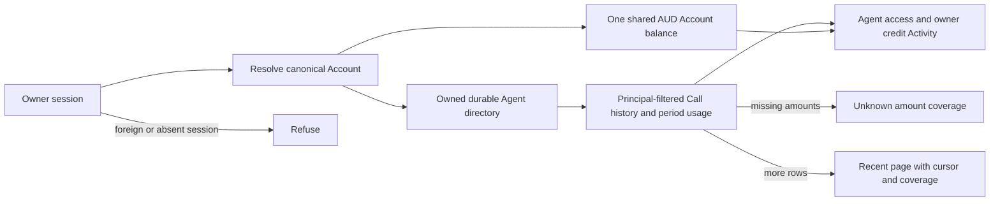
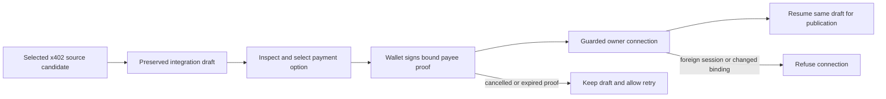

## Cold-review source closeout — 2026-09-08

**Status: source repairs and verification independently accepted with the retained
standards baseline; owned source checkpoint committed.**
This dated receipt supersedes earlier pending statements, not their historical
outputs. C01–C19, all thirteen discovery gaps and the subsequent bounded
verification repairs are accounted for below and in the existing plan. This is
source acceptance, not an aggregate-green or production-release claim.

Owned source/current-documentation/package checkpoint:
`5f313129775c91de88e6cef819800bd116e31168` — `fix: complete vocabulary cutover journeys and contract consumers`
(**136 paths**). Governance commit `d5fb0a2209f5936eb7613d9a3a4c49a2d1d4c581` contains this
receipt, the maintained coverage map and the unchanged cold-review register and
raw evidence. No remote push, deployment, data activation or publication occurred.
Final evidence review accepted the complete requirement/discovery-gap coverage,
check scope and retained holds. At source acceptance, all **47 unrelated dirty paths** matched their
preserved bytes/deletions; all **36 original audit files** remain byte-identical.

### Final source verification

Project commands used Node **22.22.0 / npm 11.5.1** in the original
`codex/vocabulary-rationalisation` checkout. The expressly authorized existing
CLI compatibility harness separately exercised Node 20 and Node 22 subprocesses.

| Check / exact command family | Result and scope |
| --- | --- |
| `npm run test:unit -- --no-file-parallelism` | **463 files / 4,200 tests pass** after C19. Subsequent test-render and navigation-copy deltas have their focused passes below. |
| `npm run test:integration` | **113 files / 1,109 tests pass; one file / four existing skips**, after deterministic probe scheduling repair. |
| `npm run test:conformance` | **42 files / 402 tests pass** on the repaired integration state. |
| `npm run test:chat:conformance` | **11 files / 55 tests pass**. |
| `npm run test:release:architecture` | **2 files / 21 tests pass**. |
| `npm run typecheck` | **Pass**, including the final JSX test rename. Later changes are reviewed copy/selector literals with focused browser/unit verification. |
| `npm run test:types` | **4 tests pass**. |
| `npm run gate:anatomy` | **5 parity/envelope tests, 49 import tests and 2 UI contract tests pass**. |
| `npm run test:seo` | **5 files / 28 tests pass**. |
| `npm run lint` | **Pass** after correcting the two children-prop errors with JSX, without suppressions. |
| `npm run test:ts-standards` | **Fails on the same 26 baseline findings**, with zero additions/removals comparing file, rule and excerpt independently of line numbers. No clean aggregate is claimed. |
| `npm run check:convex-codegen` | **Pass** after C19. |
| `npm run verify:convex-generated:anonymous` | **Pass: seven generated files byte-identical** after regenerating current source in an isolated anonymous local backend; shared deployment/data unchanged. |
| `npm run pack:cli:public` and `npm run test:cli-package` | **Pass**. Actual installed `--help` checks pass on Node **20.20.2 / 22.23.2**; package imports remain blocked. Packed and public archives match SHA-256 `99aaeac6f9b065ba0526e8746bf0f3f8b934632b1b87dc8dc4855bc0d1781fce`. |
| `npm run verify:release-integrity` | **Final build passes** after the Provider navigation label; generated protected paths and pinned Nitro integrity unchanged. Existing chunk-size/browser-externalization/WASM fallback warnings are retained. |
| Local Playwright public browser set | **28 pass / two viewport-specific skips**, across compact and wide Chromium. Exact five-file invocation below; no authenticated/hosted test bodies were run. |
| `env -u PLAYWRIGHT_BASE_URL npm run test:e2e:a11y` | **14/14 pass**, both viewports, one worker, after two stale heading assertions were corrected. |
| Installed offline React Doctor | Final staged/changed-source scan exits **0**, newCount **0**, baseTotalCount **30** after the renamed test is staged. The advisory commit hook reports **72/100 and 30 warnings** and exits successfully; no clean full-project health claim. |

Exact public browser command (through the pinned NVM runner):

```sh
env -u PLAYWRIGHT_BASE_URL npm exec --offline -- node tools/dev/run-with-cleanup.mjs playwright test tests/e2e/application-recovery.spec.ts tests/e2e/code-block-hit-target.spec.ts tests/e2e/developer-discovery.spec.ts tests/e2e/local-auth-boundary.spec.ts tests/e2e/owner-operations-compatibility.spec.ts
```

The browser runs started their own local Vite server with Clerk disabled and
terminated it normally. The configured local catalogue backend was unavailable;
retained `fetch failed`, missing-auth and safe error-boundary output therefore
qualify the result as navigation, keyboard, layout, local-auth and outage-path
proof, not populated/live catalogue or authenticated account proof. The CLI
matrix proves package integrity and installed help, not complete cross-harness
hosted commercial execution. Production money, deployment, recovery, dataset
rebuilding, operational ingestion/freshness/buffer policy (G02), Package 6/7 and
full-plan hosted/live acceptance remain **parked and open**.

### Final verification repairs and retained failures

- **Probe test scheduling:** the first final integration run had 1,108 passes
  and one failure: an automatically scheduled inactive probe could overwrite
  its manual healthy observation. The unchanged isolated test passed. The
  existing test now uses the established fake-timer hooks and awaits all
  scheduled work before seeding the intended observation, restoring real timers
  afterward. All admission, no-paid-canary and refusal assertions remain.
  Focused 1, related owner-funnel 21, architecture 21, full integration 1,109 and
  conformance 402 pass. No production scheduling behavior changed.
- **Owner route lint:** the two previously advisory children-prop findings were
  actual lint errors. `supply-owner-routes.test.ts` became `.test.tsx`; two
  equivalent JSX provider renders replace children props, with all guards,
  mocks and assertions preserved. **4 focused tests, lint and typecheck pass**.
- **Public browser consumers:** initial public browser results were 24 passes,
  two viewport skips and four failures. Two tests still used the removed
  `/operations` route/anchor or old installation heading. They now use `/tools`
  and `#tools`, preserve opaque `operation:v1:` references and complete
  query/history/refresh checks, and expect `Connect with Codex`. **10 focused
  browser cases**, then the complete **28-case public set**, pass.
- **Provider navigation copy:** the shared public navigation/footer label was
  an omitted canonical-role correction, not a retained marketing exception.
  `For Providers` and its three test consumers retain `/for-providers`, shared
  navigation semantics and every assertion. **Two files / eight unit tests pass**.
- **Accessibility consumers:** initial a11y results were 10 passes/four failures
  at the two stale headings. Exact assertions now use `Listed Providers` and
  `Connect with Codex`; keyboard, focus, route and compact layout checks remain.
  **All 14 a11y cases pass**. No production changes were needed.

The first direct public-browser invocation also failed before tests because the
wrapper could not find Playwright outside npm's executable path. The corrected
installed/offline invocation above passes; no package was downloaded or runner
changed. All failed checkpoints remain retained alongside successful reruns.

Evidence: `vocabulary-temporary-evidence.tar.gz:tmp/ae-cold-final-checks-20260907.json` and its named logs;
`vocabulary-temporary-evidence.tar.gz:tmp/ae-cold-react-doctor-staged-final-20260908.json`;
`vocabulary-temporary-evidence.tar.gz:tmp/ae-cold-final-commit-preparation-20260908.json`;
`vocabulary-temporary-evidence.tar.gz:tmp/ae-cold-final-ts-standards-baseline-comparison-20260907.json`;
`vocabulary-temporary-evidence.tar.gz:tmp/ae-cold-fix-probe-race-review-20260907`,
`vocabulary-temporary-evidence.tar.gz:tmp/ae-cold-fix-route-lint-review-20260907`,
`vocabulary-temporary-evidence.tar.gz:tmp/ae-cold-fix-public-browser-review-20260907`,
`vocabulary-temporary-evidence.tar.gz:tmp/ae-cold-fix-provider-nav-review-20260907` and
`vocabulary-temporary-evidence.tar.gz:tmp/ae-cold-fix-a11y-labels-review-20260907` contain exact snapshots, hashes,
complete deltas and actual check output. Browser failure contexts/screenshots
are retained under `vocabulary-temporary-evidence.tar.gz:tmp/ae-cold-public-e2e-failure-evidence-20260907` and
`vocabulary-temporary-evidence.tar.gz:tmp/ae-cold-a11y-failure-evidence-20260907`. These are deliberate audit records;
transient browser output is not a source deliverable.

## Integrated completion finding C19 — 2026-09-08

**Status: source correction independently accepted; final integrated checks running.**
The completion audit disproved an earlier blanket OpenAPI exception:
`PublicToolDescriptor.operationId` is an AE-generated capability identity, not
an upstream OpenAPI field. The surrounding public DTO has no exact retained-name
exception. Correcting it is within the approved whole-source vocabulary cutover.
The earlier reports remain dated evidence, including this classification error.

Rename only this public descriptor field to `toolId` through its type, strict
schema, producer, wire serializer/deserializer, search/UI consumers and actual
HTTP/MCP/CLI/test fixtures. `toolId` names the stable capability identity;
`toolRef` remains the version-bound callable reference. No compatibility alias.
Preserve `CapabilityToolSourceRecord.operationId`, PublishedTool identity,
`createPublicToolRef` input/material, `current_operation_commitment:v1` material,
upstream OpenAPI fields, opaque prefixes and exact hash bytes. Those are separate
protected boundaries; their protection does not extend to the surrounding DTO.
No persisted schema, data, deployment, endpoint or dependency change is included.

Exact production seam: `tool-projection-types.ts` PublicToolDescriptor only;
`tool-project.ts` returned descriptor; wire types/serializer/deserializer;
`tool-schemas.ts` strict descriptor; `tool-search.ts` descriptor search text;
`AeToolContractSections.tsx` existing Tool ID value. Source-record fixtures keep
their protected names; returned public-descriptor fixtures use `toolId`.

Acceptance: actual projection → wire roundtrip → strict schema retains `toolId`
and rejects the old public alias; HTTP/MCP/CLI/UI consumers continue to work;
Tool reference golden value and commitment/digest tests remain unchanged.
Pre-change golden fixture (`capability:reference.lookup`, publication
`publication:reference.lookup` revision 3, contract `reference.lookup` version 1,
digest `digest:contract`) yields
`operation:v1:e44c003644675cf77edbadbfa296976d2cb0bc82d7d20445df92af940bc18f6b`.
A single bounded Luna Max owner implements; root reviews, runs installed Doctor,
rebuilds affected artifacts and completes integrated acceptance. Previous green
checks are retained as checkpoints, not proof of this pending DTO correction.

C19 source receipt: complete **15-file** producer/type/wire/schema/Convex return
validator/search/UI/test correction independently reviewed, with all final
hashes matching. **14 existing test files / 234 tests pass**, including the
added strict-alias/golden regression; coherent typecheck and diff check pass.
The initial six canonical-read failures were real Convex return-validator
mismatches; correcting that public validator produced **20/20** canonical-read
passes. No stored schema or protected hash/source-record field changed.
Final installed offline Doctor exited 0: two previously accepted route-test
children-prop findings, baseTotalCount 30, no C19-attributable diagnostic.
Candidate: `vocabulary-temporary-evidence.tar.gz:tmp/ae-cold-fix-tool-descriptor-id-review-20260907`;
Doctor: `vocabulary-temporary-evidence.tar.gz:tmp/ae-cold-react-doctor-tool-descriptor-id-20260907.json`.

## Accepted repair plan and retained decisions — 2026-09-07

**Status: independent review accepted; implementation authorized (2026-09-07).**
This plan supersedes the repair-order suggestions below, not the retained audit
or earlier dated verification. It covers all eighteen consolidated findings and
all thirteen discovery gaps in the [cold-review register](./WF-20260905-vocabulary-cold-review-20260907.md).
Raw reports and bad-behavior probes remain unchanged. Passing those probes proves
the old defects; it is not regression acceptance.

### Outcome, authority and boundaries

Restore complete journeys across actual producers, validators, consumers and
human/agent guidance. Validate meaning against `PRODUCT.md` and `CONTEXT.md`, not
only spelling. Implement only in the original dirty checkout on
`codex/vocabulary-rationalisation`; a19f remains outside the write boundary.
Preserve all pre-existing unrelated edits, protected identifiers, protocol
vocabulary, hash material, evidence and historical records. No deployment,
publishing, dataset rebuild, migration, new service or dependency is included.

Root owns sequencing, integration, evidence and serialized owned local commits.
Bounded Luna Max owners implement one complete boundary at a time; independent
read-only preparation/review may overlap, source ownership may not. Each owner
reads PRODUCT, CONTEXT, the qualified finding and relevant project/skill rules.
Convex writers additionally read the generated project guidelines and Convex
expert guidance. Relevant frontend checks include the installed React Doctor;
reuse existing components, SDKs, validators and test infrastructure. The separate
oversight task reviews this plan and final evidence without competing edits.

Reference-product research supports reuse of current scoped Agent connection,
Account/budget and recovery boundaries: [Locus agent connections](https://docs.paywithlocus.com/locus-pro/connect-agents)
and [Nevermined API documentation](https://nevermined.ai/docs/api-reference/introduction).
It does not authorize copying their services or adding orchestration to AE.

### Decisions surfaced before implementation

1. **C15:** add the canonical `quote` endpoint discriminator. No current kind
   correctly describes a Quote; `call` and discovery `tool_read` would conflate
   distinct stages. Update both manifest projections and exhaustive consumers.
   This is a narrow public discriminator correction, not a new endpoint.
2. **C10/C18:** atomically cut `ae supply operations` over to `ae supply tools`
   across registration, help, examples, tests and packaged surfaces. No alias;
   protected external operation names and hash fields remain exact.
3. **C04:** add a bounded owner-only read projection using existing owner
   authorization and Call indexes, with shared Account AUD balance. Use the
   current UTC calendar month explicitly for usage (the activity page precedent),
   recent paginated activity, and explicit incomplete amount coverage. Do not
   manufacture all-time totals or revive the retired USD ledger. This extends
   an internal owner read contract; no new persisted schema is proposed.
4. **C08:** select evidence against trusted active custody identity/generation,
   not arbitrary newest environment rows. Retain append-only history and fail
   closed on genuine conflicts. Bounded discovery confirms the V8-safe existing custody config parser and
   budget-ref helper can be exposed through capability-supply/convex.ts; use
   Convex env and the existing custody/generation index descending for one row.
   No persisted-treasury TTL/future-clock tolerance is established; do not invent
   one from unrelated 15-second evidence rules. G02 retains those policies and
   ingestion/activation as explicit operational work.
5. **G03, retained contract:** PRODUCT requires an unexpired Quote. Expiry is
   checked before consumed replay; retain this behavior and document existing
   Call status recovery when the Call reference is available. Extending replay
   retention is optional future contract work, not a blocker or confirmed defect.
6. Joel authorized running the existing installed CLI Node 20/22 matrix. Project
   commands remain Node 22/npm 11.5.1; only that unchanged script's established
   compatibility subprocesses use its Node 20 path. No temporary runtime workaround.

### Dependency and ownership queue

| Wave / bounded owner | Responsibility | Dependency / acceptance |
| --- | --- | --- |
| A1 producer | C01 owner Tool readback | First P1; real backend-to-server-to-route projection passes |
| A2 evidence | C16 durable late-observation digest | Exact established digest/replay and conflict behavior pass |
| A3 authority | C09 independently expired grant | Shared authorization refuses expired/equal-boundary grants |
| B1 owner money | C04 owner Agent activity/credit | Current AUD producer and both UI journeys agree |
| B2 treasury | C08 active custody evidence selection | Trusted identity/freshness contract reviewed; history retained |
| B3 Provider handoff | C05 x402 source-first connection | After A1; existing wallet proof and draft return path work |
| C1 discovery | C02, C06, C07 | Correct inventory, bounded links and empty-page continuation |
| C2 agent surfaces | C03, C12, C13, C18 plus C10 CLI verb | Producers stable; all advertised continuations execute |
| C3 HTTP manifests | C14, C15 | Reviewed discriminator; authenticated request/parser contracts |
| D1 semantic/UI/docs | Remaining C10, C17, ubiquitous-language findings | Stable names/contracts; current copy, docs and semantic claims agree |
| D2 browser consumers | C11 | Updated actions, scopes, selectors; substantive assertions preserved |
| E root integration | Cross-surface checks, independent review, fixes, owned commits | Every row has evidence or explicit justified runtime/decision hold |

Global tests/builds run after source ownership. A larger boundary’s sole owner
may be assigned one coherent typecheck at stable handoff; root never runs a
concurrent compiler. Owners run narrow behavioral checks first; root runs final
integrated checks against the coherent complete state. New evidence can adjust file ownership within the same boundary; material
contract, storage, dependency or activation expansion must be surfaced first.

### Changed flows and failure outcomes





Discovery pagination separately preserves continuation through a health-filtered
empty page whenever later raw pages remain; only exhaustion permits the no-Tool
fallback. Proof cancellation never implies publication; shared Account funds
never imply Agent authority.

### Finding implementation and regression matrix

| ID | Concrete repair / reuse | Observable acceptance and failure coverage |
| --- | --- | --- |
| C01 | In `convex/capabilityProviderTools.ts`, align validator/response `tool` with `provider-workspace.functions.ts` and owner supply route. Complete the actual producer/consumer chain. | Extend provider workspace tests through real Convex readback and actual server consumer/route guard; ready Tool renders, missing/refused/foreign-owner states remain truthful. Do not merely replace a successful mock field. |
| C02 | Replace retired `registry.operations` inventory prefix in `supply-landing.functions.ts` with actual `registry.tools` descriptors. | Existing supply-landing route test uses real registered action IDs; `/for-providers` presents the current callable surface. |
| C03 | Correct stale `operation.status` in account safe continuations and latent `operation.invoke` in funding handoff. Use current registered status/balance/Quote guidance appropriate to state; funding never automatically authorizes a new Call. | Assert actual manifest/MCP descriptions and serialized outputs refer to real actions; preserve deliberate compact projection omissions. Funding-unavailable/pending/success guidance remains semantically correct. |
| C04 | Replace `MoneyQueryPort`/USD retired-ledger caller in `agent-access-console.ts`. Reuse `resolveBusinessActor`, owned directory/grants, `moneyAccountFundingFormance` Account balance and `capabilityCallProjections`. Extend owner projection with principal-filtered paginated current Call DTO and explicit period usage. Update view model and both Agent access/owner credit consumers. | Real owner/stranger/anonymous authorization tests; canonical Account from session, Agent principal from owned directory. AUD exponent 6 integer amounts; missing amounts never zero. Preserve credential attribution, delivery/payment/Call state separation and `toolRef`. Activity max 50/cursor, directory max 25 separately; label recent/truncated if continuation unavailable. Usage `[start,end)` retains 366-day cap, initial UTC month, settled-charge amount only with explicit complete coverage: sum valid settled rows, exclude released/refunded, and mark unknown/not_applicable/missing amounts uncovered. Denominator/counts describe Calls created in the selected UTC period, not charges settled during it or net/final-accounting spend. Mixed payment states and fallback usage amounts must not manufacture complete spend. Agent bearer reads remain separately tested. Canonical Agent activity/usage must survive an empty or unmatched provider-key/grant inventory: attach owner readback by principal directly, using credentials only for attribution/control enrichment. |
| C05 | Connect source-first x402 handoff to existing inspect/payment-selection/payee-proof/wallet-signing/`connectOwnerX402` path; preserve durable source draft and return to publication. Reuse source-first-owner.ts, supply-funnel.functions.ts, supply-compatibility.ts and existing AeProviderWorkspace/AeOwnerProviderConnections panel; carry exact URL/method/environment and return existing owner.offerings.new draft/connection route. Existing x402 integration draft already supports owner-bound storage; do not expand HTTP/MCP attempt model. Keep httpCredentials rollout flag HTTP-only while preserving all x402 rollout/authorization/payment-profile/write/proof guards; no deployed flag change. Test HTTP refusal with its flag disabled while supported x402 follows its own guards. | Existing route/connection/publication tests cover valid selected option, cancellation, invalid or changed candidate, wrong wallet/claim, foreign owner, expired payee claim and resumed draft. Resume must refuse another owner’s draft or mismatched connection/environment. x402 integration draft itself has no cancellation/TTL state: abandonment preserves it; changed source/candidate refuses with source_changed. Do not apply HTTP/MCP attempt expiry to x402. No fake OpenAPI branch, bypassed payee proof or generic unavailable fallback. Exact publication authorization remains enforced; G08 governs eligibility. |
| C06 | Reuse shared bounded `callableAlternativesHref` projection from `suggested-next-action.ts` in full/compact Tool inspector. | Rendered href checks for long query (>200), encoding and routeable filter match producer. Preserve existing default `window=30d`; it was not the defect. |
| C07 | Preserve cursor/continuation when health filtering yields an empty raw page with more pages. Suggest a Service request only after exhaustion. Reuse current opaque cursor and shell-safe origin builder. Qualify empty-page CLI copy and the existing JSON note by page versus exhaustion; the note remains health-neutral for explicit health filters. | Real producer empty first page → later routeable page → executable CLI continuation. Cursor, filters, selected origin and JSON survive. Final empty page offers legitimate fallback. No speculative cursor-corruption redesign. |
| C08 | Replace newest-two-environment/length-one shortcut in `capabilityQuotes.prepareFinancialSubjects`. Reuse existing `by_custody_and_observedAt` index and trusted active custody/generation; select newest applicable authoritative observation with bounded reads, then validate existing shape/network/capacity rules. Treasury TTL/future-clock policy remains explicitly unimplemented under G02. Never fall back to older healthy evidence when the newest applicable observation is invalid or negative. Keep `moneyTreasury.recordObservation` append-only. | Real Convex rows: one valid observation; two same-custody historical observations; old generation/other custody; conflicting identity; malformed/missing evidence; correct newest applicable evidence and refusal behavior. No unbounded scan, deleted history or arbitrary first-row acceptance. Do not import CDP Node SDK into query isolate. Derive active tuple from existing V8-safe config/budget-ref helper exposed through capability-supply/convex.ts; no new treasury freshness policy. Test invalid/missing config and no active match fail closed. |
| C09 | Check normalized grant expiry independently at existing consequenceNow and finalNow decision points in shared `authorityBoundary.ts` authorization before Self acceptance, preserving downstream admission controls and the post-async recheck. | Real live credential with expired/equal-time grant refuses at both decision points, including expiry crossed during async snapshot work; current grant succeeds; revoked/stale generation/other bindings refuse. Normal issuance often aligns expiries; make no unproved spending-bypass claim. |
| C10 | Finish ordinary product/operator navigation, accessibility copy, install/help/status/support/privacy, plugin descriptions, current DESIGN/START_LINE prose and workflow labels. Atomic CLI `supply tools` cutover as above. Include AeCompromiseRecoveryChecklist, AeCapabilityList, AeOperatorRouteStates, admin.index-health and owner.supply.connections.new. | Semantic cross-surface pass plus relevant rendered UI/CLI/plugin/help tests. Provider replaces supplier-role prose only when that is the actual role; Service/Offering/Source/Publication remain distinct. Preserve upstream OpenAPI operationId, x402 seller and exact protected identifiers. Do not rename artifact paths merely to change workflow display text. |
| C11 | Repair deploy-smoke actions, current card selectors and invalid negative selector; update authenticated lifecycle actions/scopes/token assertions to actual registry/contracts. | Existing browser/source fixture checks retain auth refusal, idempotency and negative assertions. Local public browser checks use existing isolated setup. Hosted/authenticated execution only in separately authorized environment; test discovery or source inspection is not runtime proof. |
| C12 | Align cold-loop recipe receipt/reuse steps in manifest to actual registered runners (status/history as applicable); do not invent commands to satisfy stale prose. | Every advertised executable step resolves to real registration and appropriate purpose; happy and recovery recipes remain usable. |
| C13 | Use shared `continuationCommand` and baseUrlSource behavior for request/doctor/connect results, including creation, list/status, refusal, timeout and reuse. | Fresh CLI process follows printed command at non-default origin with JSON retained; shell-hostile opaque values, IPv6/loopback and quoted origin remain safe. No unsupported origin-data-leak claim. |
| C14 | Enforce declared JSON Content-Type for Quote/Call/recovery through Node 22 built-in MIMEType where compatible with this server boundary, reusing the existing bounded JSON reader. Preserve authentication order. Avoid copying weak substring acceptance. | Authenticated text/plain JSON and missing/invalid media type return 415 without effects; valid mixed-case application/json with charset accepted; malformed JSON 400 and over-limit body 413; unauthenticated behavior and valid Quote/Call/recovery preserved. No CSRF/auth-bypass claim. |
| C15 | Add `quote` to endpoint-kind contract/classifier using actual TOOL_QUOTE_ACTION_ID; update top-level and nested projections plus exhaustive consumers. | Quote is classified consistently, never Call/discovery; all remaining kinds stay correct; intentional compact MCP `{result: output}` envelope unchanged. |
| C16 | Restore protected established `invocationRef` digest key in Convex generic Action execution late observation, matching development durable port. | Shared exact digest vector plus real both-port late replay: same material idempotent, legitimately changed material conflicts. No alias, migration or new canonical digest format. |
| C17 | Repair two current roadmap file links to AeProviderWorkspace and provider workspace test. | Links resolve to real files; historic claims remain dated and qualified. |
| C18 | Make supply.status businessRef/toolRef requirements truthful in help, onboarding and examples. Inventory is existing renamed `supply tools`; no optional-status fallback. | Advertised commands parse with concrete refs, missing Tool gives current useful help; quoted variables include explicit substitution instructions. Properly substituted commands were not broken by placeholder syntax. |

### Ubiquitous-language acceptance

Validate complete meaning in definitions, source comments, DTOs, product screens,
CLI/HTTP/MCP/plugin instructions and current documentation. The callable supply
unit is Tool; portfolio Service, Offering, Publication, Listing, Source and
Provider connection remain distinct. Generic Action execution is not a purchased
Call. Customer/Agent product roles are not generic IAM Principal/Account/User.
Provider, fixed buyer-facing Seller and payment recipient remain separate.
Funding is not authority; settlement is not delivery; delivery is not Purchase
resolution/status. The host owns the larger task and memory.

Qualify CONTEXT's opening compatibility/“Until then” statements against the
accepted source cutover: historical/protected mappings are retained, not blanket
permission for new old-name aliases. Qualify PRODUCT's accepted-implementation
Quote paragraph against the real DTO: do not claim explicit Provider/Seller and
full commercial terms are implemented where source only proves version/input,
price/Account/budget/policy bindings and evidence digest. Preserve the target
principal-reseller direction and explicit remaining implementation work.

Correct the misleading protected `callRef` comment in
`spending-policy-evaluation.ts` to established `invocationRef`; no hash change.
Clarify the generic Action execution kernel header in `action-execution/runtime.ts`
and its use by the Call lifecycle; no export rename. Preserve the already-correct
protected operationRef projection explanation in contracts. The Tool ID displayed in AeToolContractSections is an AE-generated identity;
C19 corrects its surrounding public DTO field to `toolId`. Only actual upstream
OpenAPI fields and the exact protected source/hash keys retain `operationId`.

### Discovery-gap dispositions (separate from confirmed fixes)

| Gap | Evidence / disposition / closure condition |
| --- | --- |
| G01 installed/hosted/client matrix | Run Joel-authorized existing Node 20/22 installed package matrix after build. Hosted revision, deployed schema/data and live client acceptance stay explicit existing 31/35 release gates; local success does not prove them. |
| G02 treasury ingestion/activation | Repository search finds no runtime caller of observer/recordObservation. Bounded discovery confirms no production observation caller or activation path, and observer does not supply bufferUnits. Separate operational decisions are invocation boundary, buffer policy and persisted-treasury max age/future-clock tolerance/stale behavior; unrelated 15-second evidence rules do not establish these. No scheduler/service or activation inferred. C08 source selection can close independently; production treasury evidence remains a release hold until authorized ingestion evidence exists. D1 qualifies the existing package-4-operations runbook’s observation step so helper availability is not presented as an activated pipeline. |
| G03 consumed Quote expiry replay | Investigated and retained: PRODUCT requires an unexpired Quote; readForCall checks expiry before consumed replay. Document current Call status recovery when reference is available; qualify package-4-operations stale-Quote steps to avoid a replacement Call after dispatch may have begun. Future replay retention extension is outside this refactor, not a blocker. |
| G04 grant expiry | Adversarial persisted state covered by C09; distinguish independently expired grant from normally aligned issuance. No extra finding or inflated severity. |
| G05 SKILL origin | Packaged public skill intentionally shares canonical production instructions regardless of origin. Retain documented invariant and test non-default-origin parity; no templating without a product requirement. |
| G06 chat recovery/context | Host owns project/task memory. Verify current six-tool/CLI/HTTP/MCP continuations via C12/C13; do not add orchestration, persistence or new recovery tools to fill this gap. |
| G07 legacy money schema leads | `CreditAccountView.accountId` has no current successful producer; current owner/Agent balance uses accountRef. ProviderEarningsView.truncated has no live semantics from unavailable/stub producer. Record latent unsupported boundary, do not fabricate a C04 Provider earnings fix. |
| G08 x402 connection eligibility | Investigated: UI lists same-Business available x402 adapter connections broadly; exact connection path re-inspects URL/method/payee/expiry/signature and staging verifies endpoint/payment/evidence/catalog target. No wrong-connection acceptance established; preserve these checks and no speculative eligibility-helper change. Generic source-first publisher versus stricter staging remains a runtime evidence distinction, not proof of a bypass. |
| G09 source-write gateway path | `/api/v1/release/operation-gateway` participates in exact request-binding evidence; path validation alone does not establish deployed route. Preserve protected material; document meaning, do not lexical-rename or claim actual route existence. |
| G10 example copyability | C18 improves explicit quoted variable setup/substitution. Ignored tools/ae/README is not a tracked finding, and correct substitution already worked. |
| G11 device URI/transport recovery | Inspected connect.ts: verification_uri receives text-only validation; interactive TTY opens it through the platform opener, suppressed for JSON/non-TTY/disable flag. No exploit demonstrated and no scheme/origin validation proved. Accepted bounded C13 repair: built-in URL parsing requires absolute HTTP(S) before opening; allow loopback HTTP and legitimate cross-origin OAuth verification. Invalid/missing/unparseable/non-web values produce clear protocol failure and no launch. Test HTTPS/loopback, bad schemes and existing JSON/non-TTY suppression. No exploit claim, same-origin restriction, new dependency or framework. |
| G12 Quote routes/MCP envelope | Literal routes and compact `{result: output}` projection are intentional and matched. Retain wire envelope; C15 fixes semantic classification only. |
| G13 baseline diagnostics | Preserve 26 standards failures, seven parallel CLI failures and React Doctor 116 advisory baseline as dated failed/advisory evidence. Run relevant checks sequentially and compare affected frontend findings; fix attributable regressions, never claim aggregate green by waiver or perform blanket cleanup. |


## Archived chronology and evidence — 2026-09-08

This record retains the accepted source results, C19 finding, decision boundaries,
repair matrix and discovery-gap dispositions. The full pre-compaction record is
preserved in `superseded-document-originals.tar.gz`, member
`files/docs/workflow/work/WF-20260905-vocabulary.md`, and Git commit `d5fb0a220`.
Earlier execution snapshots do not override the accepted source results above.

The original `/tmp` evidence references now identify members of the verified local
`vocabulary-temporary-evidence.tar.gz` archive; supporting references were followed
recursively. `/tmp/ae-vocabulary-source-extract.aEzWXp` was already missing and has
not been reconstructed. Private operational transcripts remain outside this archive.
The cold-review register and its 36 original audit files remain unchanged in Git.

See [closeout recovery and verification](WF-20260908-closeout.md) for the archive
location, integrity inventory and separate disposition of the 47 pending paths.
Source acceptance still does not establish hosted deployment, installed commercial
execution, production money, operational G02 policy or Package 6/7 completion.
